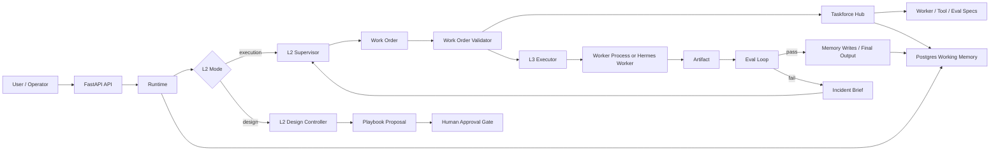

# Architecture

The runtime is built around a clear L2/L3 split:

- **L2** plans, supervises, validates, repairs, and escalates only when a decision belongs to the human.
- **L3** executes bounded work through workers and tools.
- **Runtime** enforces the protocol between them.
- **Taskforce Hub** is the source of registered capabilities.

## System Diagram



## Execution Mode

Execution Mode is the delivery path.

Requirements:

- `l2_mode` is `execution`.
- `playbook_key` exists in Taskforce Hub.
- Playbook defines allowed workers, allowed tools, required inputs, completion criteria, and eval gates.

Flow:

1. Runtime loads the Playbook from Taskforce Hub.
2. Runtime loads allowed worker profiles.
3. L2 chooses the next action.
4. L2 creates Work Orders.
5. Runtime validates inputs, tools, schemas, and External Action policy.
6. L3 executes the Work Order.
7. Runtime stores artifacts and eval results.
8. Failures produce Incident Briefs.
9. L2 repairs autonomously when the decision is internal.
10. Runtime stops at approval when human approval is required.

Execution Mode does not invent missing capabilities. Missing Playbooks, workers, tools, evals, or required inputs fail explicitly.

## Design Mode

Design Mode is the discovery path.

Requirements:

- `l2_mode` is `design`.
- The user is asking for a new Playbook or a new capability design.

Flow:

1. Runtime captures a Taskforce Hub snapshot.
2. L2 Design Controller analyzes the requested mission.
3. It proposes a Playbook spec.
4. It lists required workers, tools, evals, and registry change candidates.
5. It writes a `playbook_proposal` artifact.
6. Runtime stops at human approval.

Design Mode does not execute workers and does not mutate executable Hub state directly.

## Taskforce Hub

Taskforce Hub stores:

- `playbook`
- `worker`
- `tool`
- `eval`
- `failure_pattern`

YAML in `registries/` is seed data. Runtime reads the database-backed Hub.

Supported API:

```text
GET  /hub/{kind}
GET  /hub/{kind}/{key}
POST /hub/change-candidates
POST /hub/change-candidates/{id}/approve
POST /hub/change-candidates/{id}/reject
POST /hub/sync/yaml
```

## Work Orders

A Work Order is the bounded contract between L2 and one L3 worker.

It contains:

- task type
- worker profile
- goal
- inputs
- output schema
- allowed tools
- budget
- grader spec
- retry policy
- memory policy
- External Action policy

Runtime validates Work Orders before execution and validates worker output after execution.

## Eval Loop

If a Work Order has `grader_spec.eval_key`, Runtime:

1. loads the eval spec from Taskforce Hub
2. applies the Hub threshold
3. normalizes score, checks, reasons, and pass/fail result
4. stores the eval result
5. marks the task failed when the eval fails
6. emits an Incident Brief for L2 repair

The worker cannot self-declare success if it fails the registered threshold.

## Incident Briefs

Incident Briefs are structured failure packets for L2.

They include:

- failed task id
- worker profile
- failure type
- raw error
- structured worker error when available
- repair policy
- repair guidance
- matched failure pattern
- retry count remaining
- eval result when relevant

L2 should repair internally when the decision is technical and safe. It should escalate only for product/editorial decisions, unsafe External Actions, spending, posting, or approval-required Hub changes.

## External Actions

External Actions are effects outside Runtime-owned memory and artifacts:

- publishing
- sending messages
- spending money
- mutating third-party services
- writing to external systems

Read-only source collection is allowed only through registered read tools. Mutating actions require explicit policy and approval.
