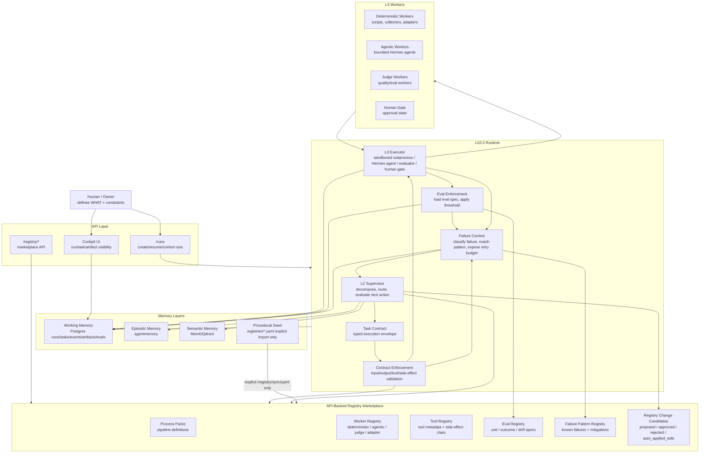
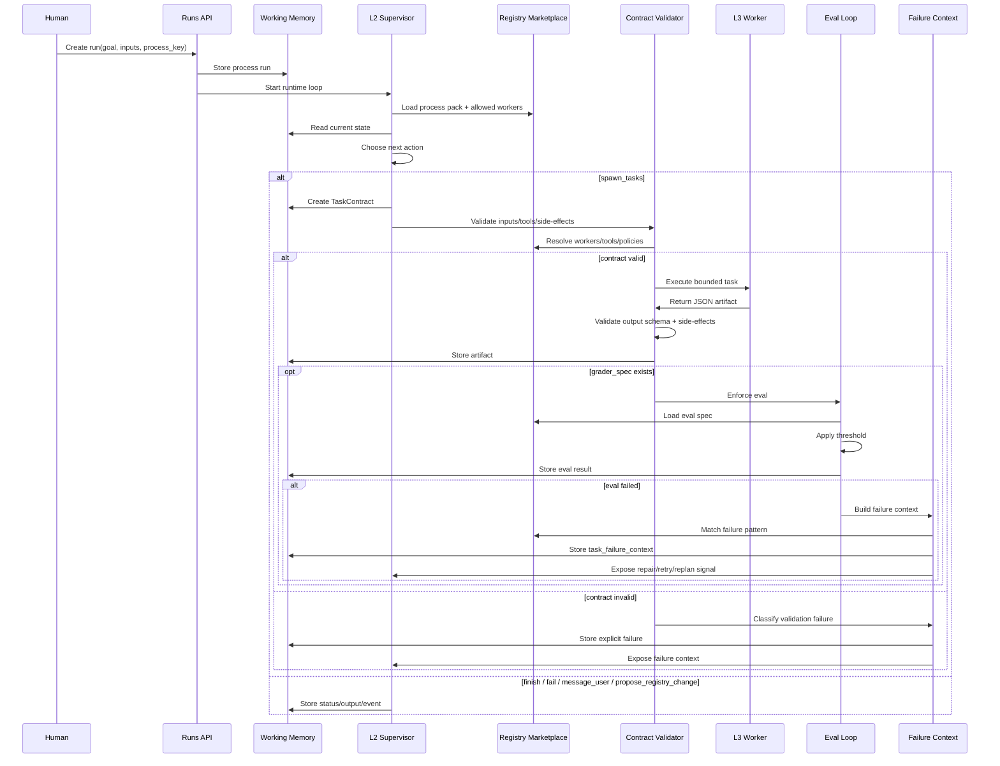
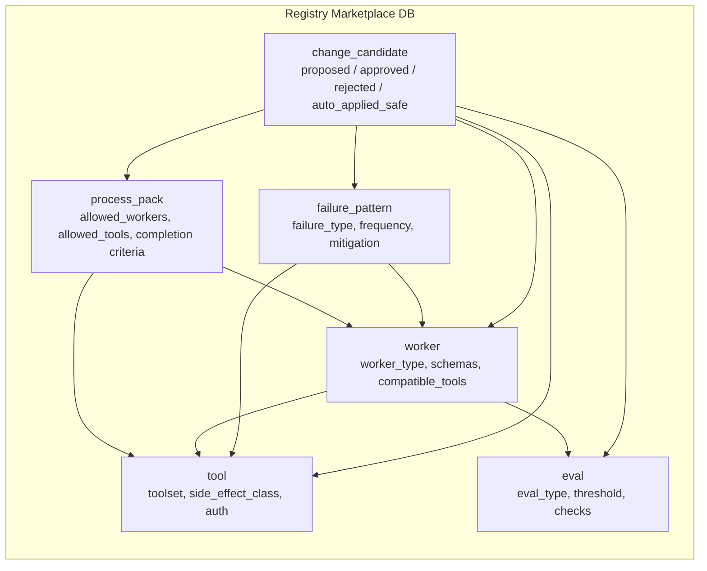
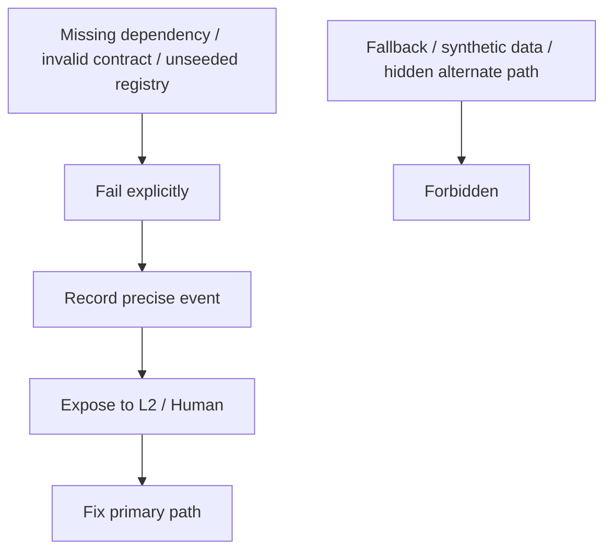

# YC Coding Agent Session Export (Sanitized)
This file is a mechanically sanitized transcript export from a longer Codex Desktop session. It preserves the user-agent work while removing secrets, binary payloads, compaction dumps, local absolute home paths, and verbose tool logs. The original raw export remains local and should not be submitted publicly.

Sanitization policy:
- Real API keys, bearer-like tokens, passwords, URL credentials, and secret fields are replaced with `[REDACTED_*]`.
- Inline base64/image/encoded payloads are replaced with `[OMITTED_*]`.
- `Compaction Summary` blocks are omitted because they duplicate compressed history and can contain unrelated payloads.
- Very large tool call/output blocks are replaced with `[OMITTED_VERBOSE_*]` placeholders.
- Internal startup context injected as `AGENTS.md` / `SOUL.md` is omitted because it is not part of the human-agent coding work.

---

## 1. User
[OMITTED_INTERNAL_PROJECT_INSTRUCTIONS: AGENTS.md / SOUL.md startup context]

## 2. User
`2026-05-25T00:42:22.331Z`

# Files mentioned by the user:

## 2026-05-24-l2-l3-communication-brainstorm.md: [LOCAL_PATH]

## My request for Codex:
такс. смотри. я тебе сейчас опять скину философию коммуникации L2 и L3 слоя. ты вспомни и пойми.

## 3. Assistant (commentary)
`2026-05-25T00:42:25.439Z`

Я прочитаю файл из `Downloads`, вытащу из него рабочую модель L2/L3 и зафиксирую главное: что это значит для нашей коммуникации и какие выводы стоит не потерять.

## 4. Tool Call: exec_command
`2026-05-25T00:42:26.895Z`

Call id: `call_TrpBB9qlzlumsy81L1Khq4AU`

```json
{
  "cmd": "sed -n '1,240p' [LOCAL_PATH]",
  "workdir": "[PROJECT_ROOT]",
  "yield_time_ms": 1000,
  "max_output_tokens": 20000
}
```

## 5. Tool Output
[OMITTED_VERBOSE_TOOL_OUTPUT: original_token_count=1835]

## 6. Assistant (commentary)
`2026-05-25T00:42:31.388Z`

Файл уже дает достаточно четкий скелет: это не про “сделать агента умнее”, а про управляемую фабрику выполнения с контрактами, проверками и памятью. Я дочитаю остаток, чтобы не потерять нюансы про discipline/registry/self-improvement.

## 7. Tool Call: exec_command
`2026-05-25T00:42:32.536Z`

Call id: `call_qBSGBhmcBQpqy13p0FfrI0bp`

```json
{
  "cmd": "sed -n '241,520p' [LOCAL_PATH]",
  "workdir": "[PROJECT_ROOT]",
  "yield_time_ms": 1000,
  "max_output_tokens": 20000
}
```

## 8. Tool Output
`2026-05-25T00:42:33.498Z`

Call id: `call_qBSGBhmcBQpqy13p0FfrI0bp`

```text
Chunk ID: 8a5fb3
Wall time: 0.0000 seconds
Process exited with code 0
Original token count: 246
Output:
- repairing failed branches
- turning experience into reusable machinery

## Open Questions

- What is the minimal viable `Task Contract` schema for the protocol v1?
- What should live in `agentmemory` versus local project artifacts versus Hermes-native memory?
- Should `L2` itself be a single long-lived Hermes agent, or a narrower orchestrator wrapper around Hermes primitives?
- Which `L3` tasks should stay deterministic first, and which justify agentic workers from day one?
- What is the first `Eval Registry` shape that is useful without being too expensive?
- How should failure analysis be represented so that retries become informed rather than repetitive?

## Next Direction

The next productive design fronts are:

1. define the `Task Contract`
2. define the memory model between `L2` and `L3`
3. define the self-improvement loop and its guardrails

Those three pieces appear to be the foundation for making the architecture operational rather than merely conceptual.

```

## 9. Assistant (final_answer)
`2026-05-25T00:42:40.553Z`

Принял и восстановил модель.

Коротко: L2/L3 здесь не про “одного очень умного агента”, а про дисциплинированную систему управления выполнением.

Главное, что надо держать:

- `L2` = менеджер/control plane: принимает цель, типизирует задачу, режет на units, выбирает worker’ов, проверяет результат, решает retry/replan/escalate, консолидирует память.
- `L3` = execution layer: bounded workers под контрактом. Это могут быть скрипты, агенты, судьи/evaluators, адаптеры.
- Ключевая примитивная единица = `Task Contract`, а не свободный prompt.
- Память курирует `L2`; `L3` не пишет “истину” в shared memory, а производит наблюдения/артефакты.
- Самоулучшение начинается не с “пусть агент перепишет себя”, а с улучшения briefs, contracts, evals, skills, prompts, и только потом кода.
- Самая сильная формула: `L2 should not be the smartest part of the system. L2 should be the most disciplined part of the system.`

Практический следующий шаг, если мы хотим превратить это в архитектуру, а не философию: зафиксировать `Task Contract v1`, memory boundaries и eval loop. Без этого система быстро скатится обратно в “большой агент с красивой речью”, что как раз слабый путь.

## 10. User
`2026-05-25T00:43:26.806Z`

ты теперь просканируй текущую реализацию этой философии в проекте и скажи: все ли так? соответсвует ли реализация философии? 

просто я неуверен. уточни это

## 11. Assistant (commentary)
`2026-05-25T00:43:37.685Z`

Проверю не по ощущениям, а по следам в коде: где описаны L2/L3, контракты, workers, eval loop, память и registries, а потом сравню это с философией из файла. Если реализация расходится, скажу прямо где именно и насколько это критично.

## 12. Tool Call: exec_command
`2026-05-25T00:43:37.686Z`

Call id: `call_KwbMlkeTtvflGJdnvVdDF7RD`

```json
{
  "cmd": "pwd && rg --files -g 'AGENTS.md' -g 'SOUL.md' -g 'README*' -g 'package.json' -g 'pyproject.toml' -g 'Cargo.toml' -g 'go.mod' -g 'tsconfig*.json'",
  "workdir": "[PROJECT_ROOT]",
  "yield_time_ms": 1000,
  "max_output_tokens": 12000
}
```

## 13. Tool Call: exec_command
`2026-05-25T00:43:37.686Z`

Call id: `call_nRO7DttOb64IY7JOt0LlwQLD`

```json
{
  "cmd": "rg -n \"L2|L3|contract|Task Contract|worker|registry|eval|evaluator|memory|Hermes|orchestr|delegate|delegation|retry|grader|artifact\" .",
  "workdir": "[PROJECT_ROOT]",
  "yield_time_ms": 1000,
  "max_output_tokens": 20000
}
```

## 14. Tool Call: exec_command
`2026-05-25T00:43:37.871Z`

Call id: `call_vnYkpELOmDMnFR1mQhk7aTCX`

```json
{
  "cmd": "find .. -name AGENTS.md -print",
  "workdir": "[PROJECT_ROOT]",
  "yield_time_ms": 1000,
  "max_output_tokens": 12000
}
```

## 15. Tool Output
`2026-05-25T00:43:39.067Z`

Call id: `call_KwbMlkeTtvflGJdnvVdDF7RD`

```text
Chunk ID: 1bbe42
Wall time: 0.0000 seconds
Process exited with code 0
Original token count: 11
Output:
[PROJECT_ROOT]
pyproject.toml

```

## 16. Tool Output
[OMITTED_VERBOSE_TOOL_OUTPUT: original_token_count=29667; total_output_lines=1185]

## 17. Tool Output
`2026-05-25T00:43:39.067Z`

Call id: `call_vnYkpELOmDMnFR1mQhk7aTCX`

```text
Chunk ID: 6dfbaa
Wall time: 1.0008 seconds
Process running with session ID 79536
Original token count: 0
Output:

```

## 18. Assistant (commentary)
`2026-05-25T00:43:45.855Z`

Первые следы хорошие: есть отдельный `src/l2l3_protocol`, supervisor, registries, process pack, memory adapters. Но это пока “названия совпадают”; сейчас проверяю, есть ли реальная дисциплина протокола или только фасад.

## 19. Tool Call: write_stdin
`2026-05-25T00:43:46.436Z`

Call id: `call_x9kMhg4AHjI5ctv1MbMSQsCb`

```json
{
  "session_id": 79536,
  "chars": "",
  "yield_time_ms": 1000,
  "max_output_tokens": 12000
}
```

## 20. Tool Output
`2026-05-25T00:43:47.793Z`

Call id: `call_x9kMhg4AHjI5ctv1MbMSQsCb`

```text
Chunk ID: 30a6ec
Wall time: 0.5089 seconds
Process exited with code 0
Original token count: 305
Output:
../myself/AGENTS.md
../Vita/backend/AGENTS.md
../Vita/.agent/skills/vercel-react-best-practices/AGENTS.md
../nomads-ai-lab/research/hermes/hermes-agent/AGENTS.md
../nomads-ai-lab/data-hub/AGENTS.md
../malina/backend/AGENTS.md
../malina/AGENTS.md
../test-something/.agent/skills/vercel-react-best-practices/AGENTS.md
../beatris-landing/.agents/skills/vercel-react-best-practices/AGENTS.md
../firecrawl-ctf/.venv/lib/python3.13/site-packages/pydantic_ai/ui/AGENTS.md
../firecrawl-ctf/.venv/lib/python3.13/site-packages/pydantic_ai/native_tools/AGENTS.md
../firecrawl-ctf/.venv/lib/python3.13/site-packages/pydantic_ai/models/AGENTS.md
../firecrawl-ctf/.venv/lib/python3.13/site-packages/pydantic_ai/AGENTS.md
../Zhardamchy/backend/AGENTS.md
../Zhardamchy/.agent/skills/supabase-postgres-best-practices/AGENTS.md
../Zhardamchy/.agent/skills/vercel-react-best-practices/AGENTS.md
../Zhardamchy/AGENTS.md
../Trackord/exp-backend/AGENTS.md
../Trackord/backend/AGENTS.md
../Trackord/.codex/.tmp/plugins/plugins/build-web-apps/skills/react-best-practices/AGENTS.md
../Trackord/.codex/.tmp/plugins/plugins/build-web-apps/skills/supabase-best-practices/AGENTS.md
../Trackord/AGENTS.md
../edgequake/AGENTS.md
../Grind/AGENTS.md

```

## 21. Tool Call: exec_command
`2026-05-25T00:43:55.682Z`

Call id: `call_e9akYD2L9RJGJB8sNcjOvQpX`

```json
{
  "cmd": "find . -maxdepth 3 -type f | sort | sed 's#^./##'",
  "workdir": "[PROJECT_ROOT]",
  "yield_time_ms": 1000,
  "max_output_tokens": 20000
}
```

## 22. Tool Call: exec_command
`2026-05-25T00:43:55.682Z`

Call id: `call_Cw05mRKa9F8wVbGR3wXJHmMr`

```json
{
  "cmd": "sed -n '1,260p' pyproject.toml",
  "workdir": "[PROJECT_ROOT]",
  "yield_time_ms": 1000,
  "max_output_tokens": 12000
}
```

## 23. Tool Call: exec_command
`2026-05-25T00:43:55.872Z`

Call id: `call_pShWM7HHn5n8BiBuQF1ih9GS`

```json
{
  "cmd": "find src/l2l3_protocol -maxdepth 4 -type f | sort",
  "workdir": "[PROJECT_ROOT]",
  "yield_time_ms": 1000,
  "max_output_tokens": 20000
}
```

## 24. Tool Call: exec_command
`2026-05-25T00:43:55.872Z`

Call id: `call_rCrAEB0NdZEWY6rkIrAa40K5`

```json
{
  "cmd": "find registries -maxdepth 4 -type f | sort",
  "workdir": "[PROJECT_ROOT]",
  "yield_time_ms": 1000,
  "max_output_tokens": 12000
}
```

## 25. Tool Output
[OMITTED_VERBOSE_TOOL_OUTPUT: original_token_count=963]

## 26. Tool Output
`2026-05-25T00:43:56.940Z`

Call id: `call_Cw05mRKa9F8wVbGR3wXJHmMr`

```text
Chunk ID: ef6cdd
Wall time: 0.0000 seconds
Process exited with code 0
Original token count: 269
Output:
[project]
name = "l2l3-protocol"
version = "0.1.0"
description = "Memory-aware L2-L3 Communication Protocol runtime"
authors = [
    { name = "Nikita Nosov", email = "20nik.nosov21@gmail.com" }
]
requires-python = ">=3.13"
dependencies = [
    "alembic>=1.18.4",
    "asyncpg>=0.31.0",
    "fastapi>=0.136.3",
    "google-genai>=2.6.0",
    "greenlet>=3.5.1",
    "hermes-agent",
    "httpx>=0.28.1",
    "mem0ai>=2.0.2",
    "orjson>=3.11.9",
    "prompt-toolkit>=3.0.52",
    "pydantic-settings>=2.14.1",
    "pyyaml>=6.0.3",
    "rich>=14.3.3",
    "sqlalchemy>=2.0.49",
    "structlog>=25.5.0",
    "tenacity>=9.1.4",
    "uvicorn[standard]>=0.48.0",
]

[project.scripts]
l2l3-protocol = "l2l3_protocol.api.main:main"
l2l3-cockpit = "l2l3_protocol.tui.cockpit:main"

[build-system]
requires = ["uv_build>=0.9.27,<0.10.0"]
build-backend = "uv_build"

[tool.uv.sources]
hermes-agent = { git = "https://github.com/NousResearch/hermes-agent.git" }

[dependency-groups]
dev = [
    "aiosqlite>=0.22.1",
    "pytest>=9.0.3",
    "pytest-asyncio>=1.3.0",
    "respx>=0.23.1",
]

```

## 27. Tool Output
`2026-05-25T00:43:57.348Z`

Call id: `call_pShWM7HHn5n8BiBuQF1ih9GS`

```text
Chunk ID: 28ff0f
Wall time: 0.0000 seconds
Process exited with code 0
Original token count: 714
Output:
src/l2l3_protocol/__init__.py
src/l2l3_protocol/__main__.py
src/l2l3_protocol/__pycache__/__init__.cpython-313.pyc
src/l2l3_protocol/__pycache__/__main__.cpython-313.pyc
src/l2l3_protocol/__pycache__/config.cpython-313.pyc
src/l2l3_protocol/api/__pycache__/main.cpython-313.pyc
src/l2l3_protocol/api/__pycache__/state.cpython-313.pyc
src/l2l3_protocol/api/main.py
src/l2l3_protocol/api/state.py
src/l2l3_protocol/config.py
src/l2l3_protocol/core/__init__.py
src/l2l3_protocol/core/__pycache__/__init__.cpython-313.pyc
src/l2l3_protocol/core/__pycache__/schemas.cpython-313.pyc
src/l2l3_protocol/core/schemas.py
src/l2l3_protocol/db/__init__.py
src/l2l3_protocol/db/__pycache__/__init__.cpython-313.pyc
src/l2l3_protocol/db/__pycache__/migrations.cpython-313.pyc
src/l2l3_protocol/db/__pycache__/models.cpython-313.pyc
src/l2l3_protocol/db/__pycache__/session.cpython-313.pyc
src/l2l3_protocol/db/__pycache__/store.cpython-313.pyc
src/l2l3_protocol/db/migrations.py
src/l2l3_protocol/db/models.py
src/l2l3_protocol/db/session.py
src/l2l3_protocol/db/store.py
src/l2l3_protocol/logging/__init__.py
src/l2l3_protocol/logging/__pycache__/__init__.cpython-313.pyc
src/l2l3_protocol/logging/__pycache__/setup.cpython-313.pyc
src/l2l3_protocol/logging/setup.py
src/l2l3_protocol/memory/__init__.py
src/l2l3_protocol/memory/__pycache__/__init__.cpython-313.pyc
src/l2l3_protocol/memory/__pycache__/adapters.cpython-313.pyc
src/l2l3_protocol/memory/adapters.py
src/l2l3_protocol/process_packs/__init__.py
src/l2l3_protocol/process_packs/__pycache__/__init__.cpython-313.pyc
src/l2l3_protocol/process_packs/__pycache__/build_in_public.cpython-313.pyc
src/l2l3_protocol/runtime/__init__.py
src/l2l3_protocol/runtime/__pycache__/__init__.cpython-313.pyc
src/l2l3_protocol/runtime/__pycache__/hermes.cpython-313.pyc
src/l2l3_protocol/runtime/__pycache__/l2_planner.cpython-313.pyc
src/l2l3_protocol/runtime/__pycache__/l2_supervisor.cpython-313.pyc
src/l2l3_protocol/runtime/__pycache__/l3_executor.cpython-313.pyc
src/l2l3_protocol/runtime/__pycache__/process_runtime.cpython-313.pyc
src/l2l3_protocol/runtime/hermes.py
src/l2l3_protocol/runtime/l2_supervisor.py
src/l2l3_protocol/runtime/l3_executor.py
src/l2l3_protocol/runtime/process_runtime.py
src/l2l3_protocol/services/__init__.py
src/l2l3_protocol/services/__pycache__/__init__.cpython-313.pyc
src/l2l3_protocol/tui/__init__.py
src/l2l3_protocol/tui/__pycache__/__init__.cpython-313.pyc
src/l2l3_protocol/tui/__pycache__/cockpit.cpython-313.pyc
src/l2l3_protocol/tui/cockpit.py
src/l2l3_protocol/web/cockpit.css
src/l2l3_protocol/web/cockpit.html
src/l2l3_protocol/web/cockpit.js
src/l2l3_protocol/workers/__init__.py
src/l2l3_protocol/workers/__pycache__/__init__.cpython-313.pyc
src/l2l3_protocol/workers/__pycache__/build_in_public_worker.cpython-313.pyc
src/l2l3_protocol/workers/build_in_public_worker.py

```

## 28. Tool Output
`2026-05-25T00:43:57.732Z`

Call id: `call_rCrAEB0NdZEWY6rkIrAa40K5`

```text
Chunk ID: 85456b
Wall time: 0.0000 seconds
Process exited with code 0
Original token count: 110
Output:
registries/evals/build-in-public-draft-quality.yaml
registries/policies/memory-writes.yaml
registries/process-packs/build-in-public/process.yaml
registries/worker-profiles/approval-adapter.yaml
registries/worker-profiles/channel-adapter.yaml
registries/worker-profiles/learning-worker.yaml
registries/worker-profiles/narrative-synthesizer.yaml
registries/worker-profiles/quality-judge.yaml
registries/worker-profiles/signal-collector.yaml

```

## 29. Tool Call: exec_command
`2026-05-25T00:44:05.684Z`

Call id: `call_sz35hkcnC1kcbxbDq7bqFjYD`

```json
{
  "cmd": "sed -n '1,260p' src/l2l3_protocol/core/schemas.py",
  "workdir": "[PROJECT_ROOT]",
  "yield_time_ms": 1000,
  "max_output_tokens": 20000
}
```

## 30. Tool Call: exec_command
`2026-05-25T00:44:05.685Z`

Call id: `call_yGRdfU6QXOzAMzAU7Vtqc9BY`

```json
{
  "cmd": "sed -n '1,280p' src/l2l3_protocol/runtime/process_runtime.py",
  "workdir": "[PROJECT_ROOT]",
  "yield_time_ms": 1000,
  "max_output_tokens": 20000
}
```

## 31. Tool Call: exec_command
`2026-05-25T00:44:05.871Z`

Call id: `call_bi7RtkFGAFuVZCRemSuNOxIq`

```json
{
  "cmd": "sed -n '1,260p' src/l2l3_protocol/runtime/l2_supervisor.py",
  "workdir": "[PROJECT_ROOT]",
  "yield_time_ms": 1000,
  "max_output_tokens": 20000
}
```

## 32. Tool Call: exec_command
`2026-05-25T00:44:05.871Z`

Call id: `call_lyaM9abuRzmjXTREM0PvhYZf`

```json
{
  "cmd": "sed -n '1,260p' src/l2l3_protocol/runtime/l3_executor.py",
  "workdir": "[PROJECT_ROOT]",
  "yield_time_ms": 1000,
  "max_output_tokens": 20000
}
```

## 33. Tool Output
[OMITTED_VERBOSE_TOOL_OUTPUT: original_token_count=913]

## 34. Tool Output
[OMITTED_VERBOSE_TOOL_OUTPUT: original_token_count=2371]

## 35. Tool Output
[OMITTED_VERBOSE_TOOL_OUTPUT: original_token_count=1932]

## 36. Tool Output
[OMITTED_VERBOSE_TOOL_OUTPUT: original_token_count=1300]

## 37. Assistant (commentary)
`2026-05-25T00:44:16.282Z`

Архитектурно уже видно: `TaskContract` реально есть, `L2Supervisor` ограничен JSON-действиями, `L3SandboxExecutor` запускает bounded workers. Слабое место предварительно тоже видно: eval сейчас больше “запись результата judge-worker”, чем независимый evaluator loop с автоматическим repair/retry.

## 38. Tool Call: exec_command
`2026-05-25T00:44:16.282Z`

Call id: `call_0VgBVfFALxkKN5ztOw21W1b8`

```json
{
  "cmd": "sed -n '1,320p' src/l2l3_protocol/memory/adapters.py",
  "workdir": "[PROJECT_ROOT]",
  "yield_time_ms": 1000,
  "max_output_tokens": 22000
}
```

## 39. Tool Call: exec_command
`2026-05-25T00:44:16.283Z`

Call id: `call_16kZ4dDKxuPlQQzRmFtMgDTE`

```json
{
  "cmd": "sed -n '1,320p' src/l2l3_protocol/db/store.py",
  "workdir": "[PROJECT_ROOT]",
  "yield_time_ms": 1000,
  "max_output_tokens": 22000
}
```

## 40. Tool Call: exec_command
`2026-05-25T00:44:16.462Z`

Call id: `call_1i9TmeC9sVoT1vOrVB2K3yrM`

```json
{
  "cmd": "sed -n '1,260p' src/l2l3_protocol/db/models.py",
  "workdir": "[PROJECT_ROOT]",
  "yield_time_ms": 1000,
  "max_output_tokens": 20000
}
```

## 41. Tool Call: exec_command
`2026-05-25T00:44:16.462Z`

Call id: `call_97KNCqyOP8q7MOpjqWd0o5uv`

```json
{
  "cmd": "for f in registries/process-packs/build-in-public/process.yaml registries/worker-profiles/*.yaml registries/evals/*.yaml registries/policies/*.yaml; do printf '\\n### %s\\n' \"$f\"; sed -n '1,220p' \"$f\"; done",
  "workdir": "[PROJECT_ROOT]",
  "yield_time_ms": 1000,
  "max_output_tokens": 30000
}
```

## 42. Tool Output
[OMITTED_VERBOSE_TOOL_OUTPUT: original_token_count=1570]

## 43. Tool Output
[OMITTED_VERBOSE_TOOL_OUTPUT: original_token_count=1637]

## 44. Tool Output
`2026-05-25T00:44:18.009Z`

Call id: `call_1i9TmeC9sVoT1vOrVB2K3yrM`

```text
Chunk ID: a2a9d2
Wall time: 0.0000 seconds
Process exited with code 0
Original token count: 1051
Output:
from datetime import datetime
from typing import Any
from uuid import UUID, uuid4

from sqlalchemy import DateTime, ForeignKey, String, func
from sqlalchemy.dialects.postgresql import JSONB
from sqlalchemy.orm import DeclarativeBase, Mapped, mapped_column, relationship


class Base(DeclarativeBase):
    type_annotation_map = {dict[str, Any]: JSONB}


class ProcessRunRecord(Base):
    __tablename__ = "process_runs"

    id: Mapped[UUID] = mapped_column(primary_key=True, default=uuid4)
    process_key: Mapped[str] = mapped_column(String(100), index=True)
    goal: Mapped[str] = mapped_column(String)
    status: Mapped[str] = mapped_column(String(40), index=True)
    input: Mapped[dict[str, Any]] = mapped_column(JSONB, default=dict)
    output: Mapped[dict[str, Any]] = mapped_column(JSONB, default=dict)
    created_at: Mapped[datetime] = mapped_column(DateTime(timezone=True), server_default=func.now())
    updated_at: Mapped[datetime] = mapped_column(DateTime(timezone=True), server_default=func.now(), onupdate=func.now())

    tasks: Mapped[list["TaskContractRecord"]] = relationship(back_populates="run", cascade="all, delete-orphan")
    artifacts: Mapped[list["ArtifactRecord"]] = relationship(back_populates="run", cascade="all, delete-orphan")
    evals: Mapped[list["EvalResultRecord"]] = relationship(back_populates="run", cascade="all, delete-orphan")
    events: Mapped[list["EventRecord"]] = relationship(back_populates="run", cascade="all, delete-orphan")


class TaskContractRecord(Base):
    __tablename__ = "task_contracts"

    id: Mapped[UUID] = mapped_column(primary_key=True, default=uuid4)
    run_id: Mapped[UUID] = mapped_column(ForeignKey("process_runs.id"), index=True)
    task_type: Mapped[str] = mapped_column(String(100), index=True)
    worker_profile: Mapped[str] = mapped_column(String(100), index=True)
    status: Mapped[str] = mapped_column(String(40), index=True)
    goal: Mapped[str] = mapped_column(String)
    contract: Mapped[dict[str, Any]] = mapped_column(JSONB)
    created_at: Mapped[datetime] = mapped_column(DateTime(timezone=True), server_default=func.now())
    updated_at: Mapped[datetime] = mapped_column(DateTime(timezone=True), server_default=func.now(), onupdate=func.now())

    run: Mapped[ProcessRunRecord] = relationship(back_populates="tasks")


class ArtifactRecord(Base):
    __tablename__ = "artifacts"

    id: Mapped[UUID] = mapped_column(primary_key=True, default=uuid4)
    run_id: Mapped[UUID] = mapped_column(ForeignKey("process_runs.id"), index=True)
    task_id: Mapped[UUID | None] = mapped_column(ForeignKey("task_contracts.id"), nullable=True, index=True)
    artifact_type: Mapped[str] = mapped_column(String(80), index=True)
    payload: Mapped[dict[str, Any]] = mapped_column(JSONB)
    created_at: Mapped[datetime] = mapped_column(DateTime(timezone=True), server_default=func.now())

    run: Mapped[ProcessRunRecord] = relationship(back_populates="artifacts")


class EvalResultRecord(Base):
    __tablename__ = "eval_results"

    id: Mapped[UUID] = mapped_column(primary_key=True, default=uuid4)
    run_id: Mapped[UUID] = mapped_column(ForeignKey("process_runs.id"), index=True)
    task_id: Mapped[UUID | None] = mapped_column(ForeignKey("task_contracts.id"), nullable=True, index=True)
    passed: Mapped[bool]
    score: Mapped[float]
    payload: Mapped[dict[str, Any]] = mapped_column(JSONB)
    created_at: Mapped[datetime] = mapped_column(DateTime(timezone=True), server_default=func.now())

    run: Mapped[ProcessRunRecord] = relationship(back_populates="evals")


class EventRecord(Base):
    __tablename__ = "events"

    id: Mapped[UUID] = mapped_column(primary_key=True, default=uuid4)
    run_id: Mapped[UUID] = mapped_column(ForeignKey("process_runs.id"), index=True)
    task_id: Mapped[UUID | None] = mapped_column(ForeignKey("task_contracts.id"), nullable=True, index=True)
    event_type: Mapped[str] = mapped_column(String(100), index=True)
    payload: Mapped[dict[str, Any]] = mapped_column(JSONB, default=dict)
    created_at: Mapped[datetime] = mapped_column(DateTime(timezone=True), server_default=func.now())

    run: Mapped[ProcessRunRecord] = relationship(back_populates="events")

```

## 45. Tool Output
[OMITTED_VERBOSE_TOOL_OUTPUT: original_token_count=1237]

## 46. Tool Call: exec_command
`2026-05-25T00:44:29.962Z`

Call id: `call_9brz32mp1C9EcOM3QSGwfKq4`

```json
{
  "cmd": "sed -n '1,260p' src/l2l3_protocol/workers/build_in_public_worker.py",
  "workdir": "[PROJECT_ROOT]",
  "yield_time_ms": 1000,
  "max_output_tokens": 20000
}
```

## 47. Tool Call: exec_command
`2026-05-25T00:44:29.962Z`

Call id: `call_LQLZvZLASz4J3tjATE72HbOQ`

```json
{
  "cmd": "sed -n '1,260p' tests/test_process_runtime.py",
  "workdir": "[PROJECT_ROOT]",
  "yield_time_ms": 1000,
  "max_output_tokens": 22000
}
```

## 48. Tool Call: exec_command
`2026-05-25T00:44:29.962Z`

Call id: `call_DRaqHb3Bt5S46xTeoVByhwrm`

```json
{
  "cmd": "sed -n '1,260p' tests/test_l2_supervisor_and_l3_executor_edges.py",
  "workdir": "[PROJECT_ROOT]",
  "yield_time_ms": 1000,
  "max_output_tokens": 22000
}
```

## 49. Tool Call: exec_command
`2026-05-25T00:44:30.148Z`

Call id: `call_M22MNdc4cVbmyS5zEBt2w0fh`

```json
{
  "cmd": "sed -n '1,260p' tests/test_memory_adapters.py",
  "workdir": "[PROJECT_ROOT]",
  "yield_time_ms": 1000,
  "max_output_tokens": 20000
}
```

## 50. Tool Output
[OMITTED_VERBOSE_TOOL_OUTPUT: original_token_count=1268]

## 51. Tool Output
[OMITTED_VERBOSE_TOOL_OUTPUT: original_token_count=1704]

## 52. Tool Output
[OMITTED_VERBOSE_TOOL_OUTPUT: original_token_count=1206]

## 53. Tool Output
`2026-05-25T00:44:32.044Z`

Call id: `call_M22MNdc4cVbmyS5zEBt2w0fh`

```text
Chunk ID: 35ed92
Wall time: 0.0000 seconds
Process exited with code 0
Original token count: 313
Output:
from uuid import uuid4

import pytest
import respx
from httpx import Response

from l2l3_protocol.config import Settings
from l2l3_protocol.core.schemas import MemoryLayer, MemoryWrite
from l2l3_protocol.memory.adapters import AgentMemoryClient, Mem0SemanticMemory


def memory_write(layer: MemoryLayer) -> MemoryWrite:
    return MemoryWrite(
        layer=layer,
        run_id=uuid4(),
        content="memory write must be durable",
        metadata={"type": "fact", "concepts": ["l2-l3"]},
    )


@pytest.mark.asyncio
@respx.mock
async def test_agentmemory_write_failure_is_not_silently_swallowed() -> None:
    respx.post("http://agentmemory.test/agentmemory/remember").mock(return_value=Response(500))
    client = AgentMemoryClient(Settings(_env_file=None, agentmemory_enabled=True, agentmemory_base_url="http://agentmemory.test"))

    with pytest.raises(Exception):
        await client.remember(memory_write(MemoryLayer.EPISODIC))


@pytest.mark.asyncio
async def test_mem0_enabled_requires_gemini_key() -> None:
    semantic = Mem0SemanticMemory(Settings(_env_file=None, mem0_enabled=True, gemini_api_key=[REDACTED_API_KEY]

    with pytest.raises(RuntimeError, match="GEMINI_API_KEY"):
        await semantic.add(memory_write(MemoryLayer.SEMANTIC))

```

## 54. Tool Call: exec_command
`2026-05-25T00:44:39.407Z`

Call id: `call_n1irFBJb7AGiG8EF8Cqawda8`

```json
{
  "cmd": "sed -n '1,300p' docs/build-in-public-system-spec-v1.md",
  "workdir": "[PROJECT_ROOT]",
  "yield_time_ms": 1000,
  "max_output_tokens": 24000
}
```

## 55. Tool Call: exec_command
`2026-05-25T00:44:39.407Z`

Call id: `call_c2OAEbtuQZxYeNyItKxU5rEk`

```json
{
  "cmd": "sed -n '1,260p' tests/test_registry.py",
  "workdir": "[PROJECT_ROOT]",
  "yield_time_ms": 1000,
  "max_output_tokens": 16000
}
```

## 56. Tool Call: exec_command
`2026-05-25T00:44:39.590Z`

Call id: `call_VW71Z8RItDROxVwRNKvGGn8z`

```json
{
  "cmd": "sed -n '1,260p' tests/test_api_surface.py",
  "workdir": "[PROJECT_ROOT]",
  "yield_time_ms": 1000,
  "max_output_tokens": 20000
}
```

## 57. Tool Call: exec_command
`2026-05-25T00:44:39.590Z`

Call id: `call_xRbF9gVkASqz9FTRmXJVMNyB`

```json
{
  "cmd": "sed -n '1,220p' src/l2l3_protocol/runtime/hermes.py && sed -n '1,220p' src/l2l3_protocol/config.py",
  "workdir": "[PROJECT_ROOT]",
  "yield_time_ms": 1000,
  "max_output_tokens": 18000
}
```

## 58. Tool Output
[OMITTED_VERBOSE_TOOL_OUTPUT: original_token_count=1104]

## 59. Tool Output
`2026-05-25T00:44:40.768Z`

Call id: `call_c2OAEbtuQZxYeNyItKxU5rEk`

```text
Chunk ID: 525298
Wall time: 0.0000 seconds
Process exited with code 0
Original token count: 200
Output:
from pathlib import Path

from l2l3_protocol.memory.adapters import ProceduralRegistry


def test_build_in_public_registry_loads_dynamic_runtime_specs() -> None:
    registry = ProceduralRegistry(Path("registries"))

    process = registry.load_process_pack("build-in-public")
    profiles = registry.list_worker_profiles()
    judge = registry.load_worker_profile("quality-judge")
    eval_spec = registry.load_eval_spec("build-in-public-draft-quality")

    assert "stages" not in process
    assert process["allowed_workers"]
    assert set(process["allowed_workers"]).issubset(profiles)
    assert judge["grader_spec"]["eval_key"] == "build-in-public-draft-quality"
    assert judge["entrypoint"] == "l2l3_protocol.workers.build_in_public_worker"
    assert eval_spec["minimum_score"] == 0.75

```

## 60. Tool Output
`2026-05-25T00:44:41.803Z`

Call id: `call_VW71Z8RItDROxVwRNKvGGn8z`

```text
Chunk ID: db00d2
Wall time: 0.0000 seconds
Process exited with code 0
Original token count: 129
Output:
from l2l3_protocol.api.main import app


def test_generic_runtime_api_routes_are_registered() -> None:
    routes = {(route.path, ",".join(sorted(getattr(route, "methods", set()) or []))) for route in app.routes}

    assert ("/runs", "POST") in routes
    assert ("/runs/{run_id}", "GET") in routes
    assert ("/runs/{run_id}/messages", "POST") in routes
    assert ("/runs/{run_id}/control", "POST") in routes
    assert ("/runs/{run_id}/events/stream", "GET") in routes
    assert ("/cockpit", "GET") in routes

```

## 61. Tool Output
`2026-05-25T00:44:41.803Z`

Call id: `call_xRbF9gVkASqz9FTRmXJVMNyB`

```text
Chunk ID: 51891f
Wall time: 0.0000 seconds
Process exited with code 0
Original token count: 761
Output:
from typing import Any

from l2l3_protocol.config import Settings
from l2l3_protocol.logging import get_logger

logger = get_logger("protocol.workers")


class HermesRuntime:
    def __init__(self, settings: Settings) -> None:
        self.settings = settings

    def available(self) -> bool:
        return self.settings.hermes_enabled and bool(self.settings.deepseek_api_key)

    async def run(self, prompt: str, system_message: str, task_id: str, enabled_toolsets: list[str] | None = None) -> str:
        if not self.available():
            raise RuntimeError("Hermes runtime is disabled or DEEPSEEK_API_KEY is missing")
        try:
            from run_agent import AIAgent

            agent = AIAgent(
                model=self.settings.hermes_model,
                api_key=[REDACTED_API_KEY]
                base_url=self.settings.deepseek_base_url,
                quiet_mode=True,
                skip_memory=True,
                skip_context_files=True,
                max_iterations=self.settings.hermes_max_iterations,
                enabled_toolsets=enabled_toolsets,
            )
            result: dict[str, Any] = agent.run_conversation(
                user_message=prompt,
                system_message=system_message,
                task_id=task_id,
            )
            return str(result.get("final_response", ""))
        except Exception as exc:
            logger.warning("hermes_worker_failed", task_id=task_id, error_type=type(exc).__name__)
            raise
from functools import lru_cache
from pathlib import Path

from pydantic import Field
from pydantic_settings import BaseSettings, SettingsConfigDict


class Settings(BaseSettings):
    model_config = SettingsConfigDict(env_file=".env", env_file_encoding="utf-8", extra="ignore")

    app_name: str = "l2l3-protocol"
    environment: str = "local"
    log_level: str = "INFO"
    log_dir: Path = Path("logs")

    database_url: str = "postgresql+asyncpg://[REDACTED_CREDENTIALS]@localhost:[PORT]/l2l3_protocol"

    agentmemory_base_url: str = "http://localhost:[PORT]"
    agentmemory_secret: [REDACTED_SECRET] | None = None
    agentmemory_enabled: bool = True

    mem0_enabled: bool = True
    mem0_vector_provider: str = "qdrant"
    mem0_qdrant_host: str = "localhost"
    mem0_qdrant_port: int = 6333
    mem0_collection_name: str = "l2l3_semantic_memory"
    mem0_llm_provider: str = "gemini"
    mem0_llm_model: str = "gemini-2.5-flash"
    mem0_embedder_provider: str = "gemini"
    mem0_embedder_model: str = "models/gemini-embedding-001"
    mem0_embedding_dims: int = 768
    gemini_api_key: [REDACTED_API_KEY] | None = Field(default=None, validation_alias="GEMINI_API_KEY")

    hermes_enabled: bool = True
    hermes_model: str = "deepseek-v4-flash"
    hermes_max_iterations: int = 20
    deepseek_api_key: [REDACTED_API_KEY] | None = Field(default=None, validation_alias="DEEPSEEK_API_KEY")
    deepseek_base_url: str = "https://api.deepseek.com"

    procedural_registry_path: Path = Path("registries")


@lru_cache
def get_settings() -> Settings:
    return Settings()

```

## 62. Tool Call: exec_command
`2026-05-25T00:44:47.013Z`

Call id: `call_VDMTaG6SGU19SHBNjM2oYnf5`

```json
{
  "cmd": "sed -n '1,260p' src/l2l3_protocol/api/main.py",
  "workdir": "[PROJECT_ROOT]",
  "yield_time_ms": 1000,
  "max_output_tokens": 20000
}
```

## 63. Tool Output
[OMITTED_VERBOSE_TOOL_OUTPUT: original_token_count=1836]

## 64. Assistant (commentary)
`2026-05-25T00:44:53.521Z`

Сейчас картина такая: v1 явно сделан вокруг одного dogfood-процесса `build-in-public`, а не универсальной фабрики. Это нормально для первого среза, но если ожидание было “философия уже реализована полностью”, то нет: реализован каркас, не вся операционная система.

## 65. Tool Call: exec_command
`2026-05-25T00:44:53.521Z`

Call id: `call_Vgzff903PlIniSH9XW5NlASG`

```json
{
  "cmd": "uv run pytest",
  "workdir": "[PROJECT_ROOT]",
  "yield_time_ms": 1000,
  "max_output_tokens": 30000
}
```

## 66. Tool Call: exec_command
`2026-05-25T00:44:53.523Z`

Call id: `call_mtb1pvCYLykXewkP8j2qFibi`

```json
{
  "cmd": "rg -n \"retry_policy|retry|grader_spec|load_eval_spec|input_schema|side_effect_policy|memory_policy|procedural_change_candidate|registry_change_candidate|WAITING_APPROVAL|approval\" src tests registries docs",
  "workdir": "[PROJECT_ROOT]",
  "yield_time_ms": 1000,
  "max_output_tokens": 24000
}
```

## 67. Tool Output
`2026-05-25T00:44:54.923Z`

Call id: `call_Vgzff903PlIniSH9XW5NlASG`

```text
Chunk ID: d6183f
Wall time: 0.7463 seconds
Process exited with code 0
Original token count: 281
Output:
============================= test session starts ==============================
platform darwin -- Python 3.13.11, pytest-9.0.3, pluggy-1.6.0
rootdir: [PROJECT_ROOT]
configfile: pyproject.toml
plugins: asyncio-1.3.0, respx-0.23.1, anyio-4.13.0
asyncio: mode=Mode.STRICT, debug=False, asyncio_default_fixture_loop_scope=None, asyncio_default_test_loop_scope=function
collected 17 items

tests/test_alembic_async.py .                                            [  5%]
tests/test_api_surface.py .                                              [ 11%]
tests/test_l2_supervisor_and_l3_executor_edges.py .....                  [ 41%]
tests/test_memory_adapters.py ..                                         [ 52%]
tests/test_process_runtime.py ...                                        [ 70%]
tests/test_registry.py .                                                 [ 76%]
tests/test_settings_and_logging.py ..                                    [ 88%]
tests/test_web_cockpit.py ..                                             [100%]

============================== 17 passed in 0.43s ==============================

```

## 68. Tool Output
`2026-05-25T00:44:54.925Z`

Call id: `call_mtb1pvCYLykXewkP8j2qFibi`

```text
Chunk ID: 3d1c35
Wall time: 0.0000 seconds
Process exited with code 0
Original token count: 1950
Output:
registries/process-packs/build-in-public/process.yaml:12:  - approval-adapter
registries/process-packs/build-in-public/process.yaml:25:    approval_required: true
registries/process-packs/build-in-public/process.yaml:26:memory_policy:
tests/test_process_runtime.py:112:            "require_human_approval": False,
tests/test_process_runtime.py:145:    run = ProcessRun(process_key="build-in-public", goal="Share progress", status=RunStatus.CREATED, input={"require_human_approval": False})
tests/test_process_runtime.py:176:    run = ProcessRun(process_key="build-in-public", goal="Share progress", status=RunStatus.WAITING_USER, input={"require_human_approval": False})
registries/worker-profiles/signal-collector.yaml:8:input_schema:
registries/worker-profiles/signal-collector.yaml:16:memory_policy:
registries/worker-profiles/signal-collector.yaml:18:side_effect_policy:
tests/test_registry.py:12:    eval_spec = registry.load_eval_spec("build-in-public-draft-quality")
tests/test_registry.py:17:    assert judge["grader_spec"]["eval_key"] == "build-in-public-draft-quality"
docs/build-in-public-system-spec-v1.md:32:- escalate to human review only for approval, edits, or edge-case judgment
docs/build-in-public-system-spec-v1.md:90:- Telegram or Mini App approval loop
docs/runtime-setup.md:41:    "require_human_approval": true
docs/brainstorms/2026-05-24-l2-l3-communication-brainstorm.md:70:7. retry, rebrief, reassign, replan, or escalate if necessary
docs/brainstorms/2026-05-24-l2-l3-communication-brainstorm.md:103:- `grader_spec`
docs/brainstorms/2026-05-24-l2-l3-communication-brainstorm.md:104:- `retry_policy`
docs/brainstorms/2026-05-24-l2-l3-communication-brainstorm.md:105:- `memory_policy`
docs/brainstorms/2026-05-24-l2-l3-communication-brainstorm.md:106:- `side_effect_policy`
registries/worker-profiles/narrative-synthesizer.yaml:9:input_schema:
registries/worker-profiles/narrative-synthesizer.yaml:17:memory_policy:
registries/worker-profiles/narrative-synthesizer.yaml:19:side_effect_policy:
src/l2l3_protocol/runtime/l2_supervisor.py:88:                    "registry_change_candidate": {"optional": "candidate only"},
src/l2l3_protocol/runtime/l2_supervisor.py:95:                        "input_schema": profile.get("input_schema", {}),
src/l2l3_protocol/runtime/l2_supervisor.py:97:                        "side_effect_policy": profile.get("side_effect_policy", {}),
registries/worker-profiles/quality-judge.yaml:8:input_schema:
registries/worker-profiles/quality-judge.yaml:14:grader_spec:
registries/worker-profiles/quality-judge.yaml:18:memory_policy:
registries/worker-profiles/quality-judge.yaml:20:side_effect_policy:
registries/worker-profiles/approval-adapter.yaml:1:key: approval-adapter
registries/worker-profiles/approval-adapter.yaml:2:description: Record the approval gate state for draft-only outputs. It never grants publishing rights by itself.
registries/worker-profiles/approval-adapter.yaml:8:input_schema:
registries/worker-profiles/approval-adapter.yaml:10:  required: [require_human_approval]
registries/worker-profiles/approval-adapter.yaml:13:  required: [approval]
registries/worker-profiles/approval-adapter.yaml:15:  - approval_status_recorded
registries/worker-profiles/approval-adapter.yaml:16:memory_policy:
registries/worker-profiles/approval-adapter.yaml:18:side_effect_policy:
registries/worker-profiles/approval-adapter.yaml:20:  approval_required: true
registries/worker-profiles/learning-worker.yaml:8:input_schema:
registries/worker-profiles/learning-worker.yaml:13:  required: [memory_writes, procedural_change_candidate]
registries/worker-profiles/learning-worker.yaml:16:memory_policy:
registries/worker-profiles/learning-worker.yaml:18:side_effect_policy:
registries/worker-profiles/channel-adapter.yaml:9:input_schema:
registries/worker-profiles/channel-adapter.yaml:17:memory_policy:
registries/worker-profiles/channel-adapter.yaml:19:side_effect_policy:
src/l2l3_protocol/workers/build_in_public_worker.py:70:        reasons.append("A draft attempted a publish side effect before approval.")
src/l2l3_protocol/workers/build_in_public_worker.py:76:    require_human_approval = contract["inputs"].get("require_human_approval", True)
src/l2l3_protocol/workers/build_in_public_worker.py:77:    return {"approval": {"status": "waiting_human" if require_human_approval else "approved_for_draft_only", "publish_allowed": False}}
src/l2l3_protocol/workers/build_in_public_worker.py:98:                "content": "Build-in-public drafts must stay gated until explicit human approval.",
src/l2l3_protocol/workers/build_in_public_worker.py:99:                "metadata": {"type": "policy_learning", "concepts": ["approval", "publishing", "side-effects"]},
src/l2l3_protocol/workers/build_in_public_worker.py:102:        "procedural_change_candidate": procedural_candidate,
src/l2l3_protocol/workers/build_in_public_worker.py:111:    "approval-adapter": approve,
src/l2l3_protocol/runtime/process_runtime.py:63:                await self.store.set_run_status(run_id, RunStatus.WAITING_APPROVAL if self._requires_approval(state) else RunStatus.COMPLETED, action.output)
src/l2l3_protocol/runtime/process_runtime.py:71:                await self._record_registry_candidate(run_id, action.registry_change_candidate or {})
src/l2l3_protocol/runtime/process_runtime.py:72:                await self.store.set_run_status(run_id, RunStatus.WAITING_APPROVAL)
src/l2l3_protocol/runtime/process_runtime.py:112:            grader_spec=profile.get("grader_spec", {}),
src/l2l3_protocol/runtime/process_runtime.py:113:            retry_policy=profile.get("retry_policy", {}),
src/l2l3_protocol/runtime/process_runtime.py:114:            memory_policy=profile.get("memory_policy", {}),
src/l2l3_protocol/runtime/process_runtime.py:115:            side_effect_policy=profile.get("side_effect_policy", {}),
src/l2l3_protocol/runtime/process_runtime.py:132:        if contract.grader_spec:
src/l2l3_protocol/runtime/process_runtime.py:151:        await self.store.add_event(run_id, "registry_change_candidate_created", candidate)
src/l2l3_protocol/runtime/process_runtime.py:178:    def _requires_approval(state: dict[str, Any]) -> bool:
src/l2l3_protocol/runtime/process_runtime.py:179:        return bool((state.get("input") or {}).get("require_human_approval", True))
src/l2l3_protocol/core/schemas.py:12:    WAITING_APPROVAL = "waiting_approval"
src/l2l3_protocol/core/schemas.py:25:    WAITING_APPROVAL = "waiting_approval"
src/l2l3_protocol/core/schemas.py:33:    APPROVAL_DECISION = "approval_decision"
src/l2l3_protocol/core/schemas.py:35:    REGISTRY_CHANGE_CANDIDATE = "registry_change_candidate"
src/l2l3_protocol/core/schemas.py:50:    require_human_approval: bool = True
src/l2l3_protocol/core/schemas.py:85:    grader_spec: dict[str, Any] = Field(default_factory=dict)
src/l2l3_protocol/core/schemas.py:86:    retry_policy: dict[str, Any] = Field(default_factory=dict)
src/l2l3_protocol/core/schemas.py:87:    memory_policy: dict[str, Any] = Field(default_factory=dict)
src/l2l3_protocol/core/schemas.py:88:    side_effect_policy: dict[str, Any] = Field(default_factory=dict)
src/l2l3_protocol/core/schemas.py:106:    registry_change_candidate: dict[str, Any] | None = None
src/l2l3_protocol/web/cockpit.css:150:.status-pill.waiting_approval {
src/l2l3_protocol/runtime/l3_executor.py:85:                    "Do not perform side effects outside the contract side_effect_policy.",
src/l2l3_protocol/web/cockpit.html:46:            <input id="approval" type="checkbox" checked />
src/l2l3_protocol/web/cockpit.html:47:            Require human approval
src/l2l3_protocol/web/cockpit.js:107:        require_human_approval: $("approval").checked,
src/l2l3_protocol/memory/adapters.py:138:    def load_eval_spec(self, key: str) -> dict[str, Any]:

```

## 69. Tool Call: exec_command
`2026-05-25T00:45:02.270Z`

Call id: `call_qM4zoZ0V3tJBB0gWu54OOYdK`

```json
{
  "cmd": "nl -ba src/l2l3_protocol/core/schemas.py | sed -n '65,115p'",
  "workdir": "[PROJECT_ROOT]",
  "yield_time_ms": 1000,
  "max_output_tokens": 12000
}
```

## 70. Tool Call: exec_command
`2026-05-25T00:45:02.270Z`

Call id: `call_SfMvKTayvTFcLvkXE4X2GGwW`

```json
{
  "cmd": "nl -ba src/l2l3_protocol/runtime/process_runtime.py | sed -n '20,190p'",
  "workdir": "[PROJECT_ROOT]",
  "yield_time_ms": 1000,
  "max_output_tokens": 22000
}
```

## 71. Tool Call: exec_command
`2026-05-25T00:45:02.456Z`

Call id: `call_RgKjFw6CgIdyUBmrmP3JEdAo`

```json
{
  "cmd": "nl -ba src/l2l3_protocol/runtime/l2_supervisor.py | sed -n '20,185p'",
  "workdir": "[PROJECT_ROOT]",
  "yield_time_ms": 1000,
  "max_output_tokens": 22000
}
```

## 72. Tool Call: exec_command
`2026-05-25T00:45:02.456Z`

Call id: `call_ef75pEZybHFdgROA1frJ804F`

```json
{
  "cmd": "nl -ba src/l2l3_protocol/runtime/l3_executor.py | sed -n '18,122p'",
  "workdir": "[PROJECT_ROOT]",
  "yield_time_ms": 1000,
  "max_output_tokens": 16000
}
```

## 73. Tool Output
`2026-05-25T00:45:03.598Z`

Call id: `call_qM4zoZ0V3tJBB0gWu54OOYdK`

```text
Chunk ID: 2c8229
Wall time: 0.0000 seconds
Process exited with code 0
Original token count: 519
Output:
    65	    goal: str
    66	    status: RunStatus = RunStatus.CREATED
    67	    input: dict[str, Any] = Field(default_factory=dict)
    68	    output: dict[str, Any] = Field(default_factory=dict)
    69	    created_at: datetime | None = None
    70	    updated_at: datetime | None = None
    71	
    72	
    73	class TaskContract(BaseModel):
    74	    id: UUID = Field(default_factory=uuid4)
    75	    run_id: UUID
    76	    task_type: str
    77	    goal: str
    78	    worker_profile: str
    79	    worker_type: str = "sandboxed_subprocess"
    80	    inputs: dict[str, Any] = Field(default_factory=dict)
    81	    output_schema: dict[str, Any] = Field(default_factory=dict)
    82	    allowed_tools: list[str] = Field(default_factory=list)
    83	    budget: dict[str, Any] = Field(default_factory=dict)
    84	    stop_conditions: list[str] = Field(default_factory=list)
    85	    grader_spec: dict[str, Any] = Field(default_factory=dict)
    86	    retry_policy: dict[str, Any] = Field(default_factory=dict)
    87	    memory_policy: dict[str, Any] = Field(default_factory=dict)
    88	    side_effect_policy: dict[str, Any] = Field(default_factory=dict)
    89	    status: TaskStatus = TaskStatus.PENDING
    90	
    91	
    92	class L2SpawnTask(BaseModel):
    93	    task_type: str
    94	    worker_profile: str
    95	    goal: str
    96	    inputs: dict[str, Any] = Field(default_factory=dict)
    97	    artifact_type: str = ArtifactType.GENERIC.value
    98	
    99	
   100	class L2SupervisorAction(BaseModel):
   101	    action: str
   102	    message: str | None = None
   103	    tasks: list[L2SpawnTask] = Field(default_factory=list)
   104	    output: dict[str, Any] = Field(default_factory=dict)
   105	    reason: str | None = None
   106	    registry_change_candidate: dict[str, Any] | None = None
   107	
   108	
   109	class Artifact(BaseModel):
   110	    id: UUID = Field(default_factory=uuid4)
   111	    run_id: UUID
   112	    task_id: UUID | None = None
   113	    artifact_type: ArtifactType
   114	    payload: dict[str, Any]
   115	

```

## 74. Tool Output
[OMITTED_VERBOSE_TOOL_OUTPUT: original_token_count=2478]

## 75. Tool Output
[OMITTED_VERBOSE_TOOL_OUTPUT: original_token_count=2078]

## 76. Tool Output
`2026-05-25T00:45:04.304Z`

Call id: `call_ef75pEZybHFdgROA1frJ804F`

```text
Chunk ID: 9e2720
Wall time: 0.0000 seconds
Process exited with code 0
Original token count: 1390
Output:
    18	        self.hermes = hermes
    19	
    20	    async def run(self, contract: TaskContract, context: dict[str, Any], profile: dict[str, Any]) -> dict[str, Any]:
    21	        worker_type = profile.get("worker_type") or contract.worker_type
    22	        if worker_type == "hermes_agent":
    23	            return await self._run_hermes_agent(contract, context, profile)
    24	        if worker_type in {"sandboxed_subprocess", "evaluator", "human_gate"}:
    25	            return await self._run_subprocess(contract, context, profile)
    26	        raise L3WorkerExecutionError(f"unsupported worker_type: {worker_type}")
    27	
    28	    async def _run_subprocess(self, contract: TaskContract, context: dict[str, Any], profile: dict[str, Any]) -> dict[str, Any]:
    29	        module = profile.get("entrypoint")
    30	        if not module:
    31	            raise L3WorkerExecutionError(f"worker profile missing entrypoint: {contract.worker_profile}")
    32	        timeout = float(contract.budget.get("max_seconds", 30))
    33	        env = {
    34	            "PATH": os.environ.get("PATH", ""),
    35	            "PYTHONPATH": os.environ.get("PYTHONPATH", ""),
    36	            "L2L3_SANDBOX": "1",
    37	        }
    38	        process = await asyncio.create_subprocess_exec(
    39	            sys.executable,
    40	            "-m",
    41	            module,
    42	            stdin=asyncio.subprocess.PIPE,
    43	            stdout=asyncio.subprocess.PIPE,
    44	            stderr=asyncio.subprocess.PIPE,
    45	            env=env,
    46	        )
    47	        request = {
    48	            "contract": contract.model_dump(mode="json"),
    49	            "context": context,
    50	        }
    51	        try:
    52	            stdout, stderr = await asyncio.wait_for(
    53	                process.communicate(json.dumps(request, ensure_ascii=True).encode("utf-8")),
    54	                timeout=timeout,
    55	            )
    56	        except TimeoutError as exc:
    57	            process.kill()
    58	            await process.wait()
    59	            raise L3WorkerExecutionError(f"L3 worker timed out after {timeout}s: {contract.worker_profile}") from exc
    60	        if process.returncode != 0:
    61	            raise L3WorkerExecutionError(stderr.decode("utf-8", errors="replace") or f"L3 worker exited {process.returncode}")
    62	        try:
    63	            payload = json.loads(stdout.decode("utf-8"))
    64	        except json.JSONDecodeError as exc:
    65	            raise L3WorkerExecutionError(f"L3 worker returned invalid JSON: {contract.worker_profile}") from exc
    66	        self._validate_required_keys(contract, payload)
    67	        payload["_worker_execution"] = {
    68	            "mode": "sandboxed_subprocess",
    69	            "worker_profile": contract.worker_profile,
    70	            "task_type": contract.task_type,
    71	        }
    72	        return payload
    73	
    74	    async def _run_hermes_agent(self, contract: TaskContract, context: dict[str, Any], profile: dict[str, Any]) -> dict[str, Any]:
    75	        if self.hermes is None or not self.hermes.available():
    76	            raise L3WorkerExecutionError(f"Hermes L3 worker is required but unavailable: {contract.worker_profile}")
    77	        prompt = json.dumps(
    78	            {
    79	                "instruction": profile.get("agent_prompt") or "Complete this L3 task and return strict JSON.",
    80	                "contract": contract.model_dump(mode="json"),
    81	                "context": context,
    82	                "output_schema": contract.output_schema,
    83	                "hard_constraints": [
    84	                    "Return one JSON object and nothing else.",
    85	                    "Do not perform side effects outside the contract side_effect_policy.",
    86	                    "If required inputs are missing, return a JSON object with error and missing_inputs.",
    87	                ],
    88	            },
    89	            ensure_ascii=True,
    90	        )
    91	        raw = await self.hermes.run(
    92	            prompt=prompt,
    93	            system_message="You are a bounded L3 worker. Execute only the given contract and return strict JSON.",
    94	            task_id=f"l3-worker:{contract.worker_profile}:{contract.id}",
    95	            enabled_toolsets=contract.allowed_tools,
    96	        )
    97	        try:
    98	            payload = json.loads(raw)
    99	        except json.JSONDecodeError:
   100	            match = re.search(r"\{.*\}", raw, re.DOTALL)
   101	            if not match:
   102	                raise L3WorkerExecutionError(f"Hermes L3 worker returned invalid JSON: {contract.worker_profile}")
   103	            payload = json.loads(match.group(0))
   104	        self._validate_required_keys(contract, payload)
   105	        payload["_worker_execution"] = {
   106	            "mode": "hermes_agent",
   107	            "worker_profile": contract.worker_profile,
   108	            "task_type": contract.task_type,
   109	        }
   110	        return payload
   111	
   112	    @staticmethod
   113	    def _validate_required_keys(contract: TaskContract, payload: dict[str, Any]) -> None:
   114	        required = contract.output_schema.get("required", [])
   115	        missing = [key for key in required if key not in payload]
   116	        if missing:
   117	            raise L3WorkerExecutionError(f"L3 worker output missing required keys: {missing}")

```

## 77. Tool Call: exec_command
`2026-05-25T00:45:11.779Z`

Call id: `call_rUCf8CvzcRZ522gqUwa2b15b`

```json
{
  "cmd": "nl -ba src/l2l3_protocol/memory/adapters.py | sed -n '112,160p'",
  "workdir": "[PROJECT_ROOT]",
  "yield_time_ms": 1000,
  "max_output_tokens": 10000
}
```

## 78. Tool Call: exec_command
`2026-05-25T00:45:11.802Z`

Call id: `call_EUI4RmdzBOUg5C7jz0Ne7SBi`

```json
{
  "cmd": "nl -ba registries/process-packs/build-in-public/process.yaml | sed -n '1,40p'",
  "workdir": "[PROJECT_ROOT]",
  "yield_time_ms": 1000,
  "max_output_tokens": 10000
}
```

## 79. Tool Call: exec_command
`2026-05-25T00:45:11.803Z`

Call id: `call_w3YLukrbgG6TtFsGqMnV2bcO`

```json
{
  "cmd": "nl -ba registries/worker-profiles/quality-judge.yaml | sed -n '1,35p' && nl -ba registries/evals/build-in-public-draft-quality.yaml | sed -n '1,30p'",
  "workdir": "[PROJECT_ROOT]",
  "yield_time_ms": 1000,
  "max_output_tokens": 10000
}
```

## 80. Tool Call: exec_command
`2026-05-25T00:45:11.974Z`

Call id: `call_ffV5yfC8B0FFDBYG5YGRY5Pk`

```json
{
  "cmd": "nl -ba src/l2l3_protocol/workers/build_in_public_worker.py | sed -n '55,108p'",
  "workdir": "[PROJECT_ROOT]",
  "yield_time_ms": 1000,
  "max_output_tokens": 12000
}
```

## 81. Tool Output
`2026-05-25T00:45:12.965Z`

Call id: `call_rUCf8CvzcRZ522gqUwa2b15b`

```text
Chunk ID: 574a05
Wall time: 0.0000 seconds
Process exited with code 0
Original token count: 524
Output:
   112	                metadata={**write.metadata, "layer": MemoryLayer.SEMANTIC.value},
   113	            )
   114	        except Exception as exc:
   115	            logger.error("semantic_memory_write_failed", error_type=type(exc).__name__, run_id=str(write.run_id))
   116	            raise
   117	
   118	
   119	class ProceduralRegistry:
   120	    def __init__(self, root: Path) -> None:
   121	        self.root = root
   122	
   123	    def load_process_pack(self, key: str) -> dict[str, Any]:
   124	        path = self.root / "process-packs" / key / "process.yaml"
   125	        return self._load_yaml(path)
   126	
   127	    def load_worker_profile(self, key: str) -> dict[str, Any]:
   128	        return self._load_yaml(self.root / "worker-profiles" / f"{key}.yaml")
   129	
   130	    def list_worker_profiles(self) -> dict[str, dict[str, Any]]:
   131	        profiles: dict[str, dict[str, Any]] = {}
   132	        for path in sorted((self.root / "worker-profiles").glob("*.yaml")):
   133	            profile = self._load_yaml(path)
   134	            key = profile.get("key") or path.stem
   135	            profiles[key] = profile
   136	        return profiles
   137	
   138	    def load_eval_spec(self, key: str) -> dict[str, Any]:
   139	        return self._load_yaml(self.root / "evals" / f"{key}.yaml")
   140	
   141	    @staticmethod
   142	    def _load_yaml(path: Path) -> dict[str, Any]:
   143	        if not path.exists():
   144	            raise FileNotFoundError(path)
   145	        return yaml.safe_load(path.read_text(encoding="utf-8")) or {}
   146	
   147	
   148	class MemoryRouter:
   149	    def __init__(self, episodic: AgentMemoryClient, semantic: Mem0SemanticMemory) -> None:
   150	        self.episodic = episodic
   151	        self.semantic = semantic
   152	
   153	    async def write(self, write: MemoryWrite) -> None:
   154	        if write.layer == MemoryLayer.EPISODIC:
   155	            await self.episodic.remember(write)
   156	        elif write.layer == MemoryLayer.SEMANTIC:
   157	            await self.semantic.add(write)

```

## 82. Tool Output
`2026-05-25T00:45:13.331Z`

Call id: `call_EUI4RmdzBOUg5C7jz0Ne7SBi`

```text
Chunk ID: 6e76e4
Wall time: 0.0000 seconds
Process exited with code 0
Original token count: 259
Output:
     1	key: build-in-public
     2	name: Build in Public Distribution Loop
     3	version: 0.2.0
     4	purpose: Turn explicit progress inputs into reviewed channel-specific public drafts through a bounded L2 supervisor loop.
     5	max_supervisor_turns: 8
     6	max_tasks_per_turn: 3
     7	allowed_workers:
     8	  - signal-collector
     9	  - narrative-synthesizer
    10	  - channel-adapter
    11	  - quality-judge
    12	  - approval-adapter
    13	  - learning-worker
    14	completion_criteria:
    15	  - normalized signals exist
    16	  - channel drafts exist for requested channels
    17	  - quality evaluation is present
    18	  - publishing remains gated unless explicitly approved
    19	required_inputs:
    20	  - signals
    21	  - channels
    22	side_effects:
    23	  publish:
    24	    default: disabled
    25	    approval_required: true
    26	memory_policy:
    27	  l3_direct_writes: false
    28	  l2_curates_episodic: true
    29	  l2_curates_semantic: true
    30	  procedural_changes: candidate_only

```

## 83. Tool Output
`2026-05-25T00:45:13.331Z`

Call id: `call_w3YLukrbgG6TtFsGqMnV2bcO`

```text
Chunk ID: 6562b3
Wall time: 0.0000 seconds
Process exited with code 0
Original token count: 229
Output:
     1	key: quality-judge
     2	description: Evaluate draft completeness and side-effect safety against the build-in-public quality rubric.
     3	worker_type: evaluator
     4	entrypoint: l2l3_protocol.workers.build_in_public_worker
     5	allowed_tools: []
     6	budget:
     7	  max_seconds: 60
     8	input_schema:
     9	  type: object
    10	  required: [drafts]
    11	output_schema:
    12	  type: object
    13	  required: [passed, score, checks]
    14	grader_spec:
    15	  eval_key: build-in-public-draft-quality
    16	stop_conditions:
    17	  - eval_report_created
    18	memory_policy:
    19	  writes: artifact_only
    20	side_effect_policy:
    21	  external_side_effects: none
     1	key: build-in-public-draft-quality
     2	version: 0.1.0
     3	checks:
     4	  - has_drafts
     5	  - all_have_channels
     6	  - all_have_text
     7	  - no_publish_side_effect
     8	minimum_score: 0.75

```

## 84. Tool Output
`2026-05-25T00:45:13.695Z`

Call id: `call_ffV5yfC8B0FFDBYG5YGRY5Pk`

```text
Chunk ID: a2f4ef
Wall time: 0.0000 seconds
Process exited with code 0
Original token count: 712
Output:
    55	
    56	def evaluate(contract: dict[str, Any], context: dict[str, Any]) -> dict[str, Any]:
    57	    drafts = require_list(contract["inputs"], "drafts")
    58	    reasons: list[str] = []
    59	    checks = {
    60	        "has_drafts": bool(drafts),
    61	        "all_have_channels": all(bool(draft.get("channel")) for draft in drafts),
    62	        "all_have_text": all(bool(draft.get("text")) for draft in drafts),
    63	        "no_publish_side_effect": all(draft.get("status") == "draft" for draft in drafts),
    64	    }
    65	    if not checks["has_drafts"]:
    66	        reasons.append("No drafts were produced.")
    67	    if not checks["all_have_text"]:
    68	        reasons.append("One or more drafts are missing text.")
    69	    if not checks["no_publish_side_effect"]:
    70	        reasons.append("A draft attempted a publish side effect before approval.")
    71	    score = sum(1 for passed in checks.values() if passed) / len(checks)
    72	    return {"passed": all(checks.values()), "score": score, "reasons": reasons, "checks": checks}
    73	
    74	
    75	def approve(contract: dict[str, Any], context: dict[str, Any]) -> dict[str, Any]:
    76	    require_human_approval = contract["inputs"].get("require_human_approval", True)
    77	    return {"approval": {"status": "waiting_human" if require_human_approval else "approved_for_draft_only", "publish_allowed": False}}
    78	
    79	
    80	def learn(contract: dict[str, Any], context: dict[str, Any]) -> dict[str, Any]:
    81	    summary = contract["inputs"].get("summary")
    82	    if not isinstance(summary, str) or not summary.strip():
    83	        raise WorkerInputError("missing required string input: summary")
    84	    procedural_candidate = {
    85	        "status": "candidate_only",
    86	        "reason": "Procedural memory remains Git-backed and requires human review.",
    87	        "target_registry_path": "registries/process-packs/build-in-public/process.yaml",
    88	    }
    89	    return {
    90	        "memory_writes": [
    91	            {
    92	                "layer": "episodic",
    93	                "content": summary.strip(),
    94	                "metadata": {"type": "run_summary", "concepts": ["build-in-public", "L2-L3", "content"]},
    95	            },
    96	            {
    97	                "layer": "semantic",
    98	                "content": "Build-in-public drafts must stay gated until explicit human approval.",
    99	                "metadata": {"type": "policy_learning", "concepts": ["approval", "publishing", "side-effects"]},
   100	            },
   101	        ],
   102	        "procedural_change_candidate": procedural_candidate,
   103	    }
   104	
   105	
   106	HANDLERS = {
   107	    "signal-collector": collect,
   108	    "narrative-synthesizer": synthesize,

```

## 85. Assistant (final_answer)
`2026-05-25T00:45:39.166Z`

**Вердикт**
Нет, реализация пока не полностью соответствует философии. Она соответствует направлению, но это скорее `protocol skeleton / v1 dogfood`, а не полноценная L2/L3 execution fabric.

Я бы оценил так: философия реализована примерно на 55-65%. Основа правильная, но самые важные “дисциплинарные” части пока частично декларативные.

**Что уже хорошо совпадает**
- `TaskContract` реально существует и содержит почти весь философский минимум: `task_type`, `goal`, `inputs`, `output_schema`, `allowed_tools`, `budget`, `stop_conditions`, `grader_spec`, `retry_policy`, `memory_policy`, `side_effect_policy`: [schemas.py]([PROJECT_ROOT]/src/l2l3_protocol/core/schemas.py:73).
- `L2` не делает работу напрямую, а выбирает bounded actions и валидируется через JSON/schema ограничения: [l2_supervisor.py]([PROJECT_ROOT]/src/l2l3_protocol/runtime/l2_supervisor.py:31), [l2_supervisor.py]([PROJECT_ROOT]/src/l2l3_protocol/runtime/l2_supervisor.py:151).
- `L3` отделен как execution layer: subprocess, evaluator, human gate, Hermes agent workers: [l3_executor.py]([PROJECT_ROOT]/src/l2l3_protocol/runtime/l3_executor.py:20).
- Есть registry-centric shape: process packs, worker profiles, eval specs: [adapters.py]([PROJECT_ROOT]/src/l2l3_protocol/memory/adapters.py:119), [process.yaml]([PROJECT_ROOT]/registries/process-packs/build-in-public/process.yaml:1).
- Память концептуально разделена: L3 возвращает artifacts, L2 пишет только episodic/semantic learnings: [process_runtime.py]([PROJECT_ROOT]/src/l2l3_protocol/runtime/process_runtime.py:153).

**Где не дотягивает**
- Eval loop слабый. `grader_spec` есть, eval registry есть, но runtime не загружает eval spec и не применяет `minimum_score`; он просто записывает `passed/score` из payload judge-worker’а: [process_runtime.py]([PROJECT_ROOT]/src/l2l3_protocol/runtime/process_runtime.py:132), [process_runtime.py]([PROJECT_ROOT]/src/l2l3_protocol/runtime/process_runtime.py:135). Это пока не “evaluator loop”, а “worker сам сказал, как оценил”.
- `retry_policy` почти декоративный. Контракт его хранит, но runtime при падении worker’а просто пишет `task_failed` и возвращается к L2 без формализованного retry/rebrief/reassign механизма: [process_runtime.py]([PROJECT_ROOT]/src/l2l3_protocol/runtime/process_runtime.py:121).
- Input schema и side-effect policy не enforce’ятся системно. Они передаются в prompt/contract, но нет строгой валидации входов по `input_schema` и нет runtime guardrail для `side_effect_policy`: [l2_supervisor.py]([PROJECT_ROOT]/src/l2l3_protocol/runtime/l2_supervisor.py:91), [l3_executor.py]([PROJECT_ROOT]/src/l2l3_protocol/runtime/l3_executor.py:83).
- Self-improvement пока candidate-only, без цикла registry evolution. Можно создать `registry_change_candidate`, но нет review/apply механизма для обновления registry: [process_runtime.py]([PROJECT_ROOT]/src/l2l3_protocol/runtime/process_runtime.py:148).
- Реализация сильно завязана на один процесс `build-in-public`. Это нормальный dogfood, но пока не доказывает универсальность L2/L3 протокола: [process.yaml]([PROJECT_ROOT]/registries/process-packs/build-in-public/process.yaml:4).

**Мой честный вывод**
Фундамент выбран правильно. Это не “монолитный умный агент”, а уже отдельные `L2`, `L3`, contracts, registries, artifacts, memory router. Но пока самая важная часть философии — дисциплина через evals, retries, policies и registry evolution — реализована больше как структура данных и prompt discipline, чем как жесткое runtime-поведение.

Если хотим привести код к философии, следующий сильный шаг не “добавить больше агентов”. Следующий шаг: сделать настоящий contract enforcement layer: валидировать inputs/outputs, применять eval specs, блокировать failed evals, запускать retry policy, и только после pass разрешать finish/memory writes.

Проверка: `uv run pytest` проходит, `17 passed`.

## 86. User
`2026-05-25T00:57:32.264Z`

# Files mentioned by the user:

## telegram-cloud-photo-size-1-4942720502967503897-y.jpg: [LOCAL_IMAGE_PATH]

## telegram-cloud-photo-size-1-4942720502967503899-y.jpg: [LOCAL_IMAGE_PATH]

## telegram-cloud-photo-size-1-4942720502967503900-y.jpg: [LOCAL_IMAGE_PATH]

## My request for Codex:
напиши план реализации того, что не дотягивает:

Где не дотягивает
Eval loop слабый. grader_spec есть, eval registry есть, но runtime не загружает eval spec и не применяет minimum_score; он просто записывает passed/score из payload judge-worker’а: process_runtime.py (line 132), process_runtime.py (line 135). Это пока не “evaluator loop”, а “worker сам сказал, как оценил”.
retry_policy почти декоративный. Контракт его хранит, но runtime при падении worker’а просто пишет task_failed и возвращается к L2 без формализованного retry/rebrief/reassign механизма: process_runtime.py (line 121).
Input schema и side-effect policy не enforce’ятся системно. Они передаются в prompt/contract, но нет строгой валидации входов по input_schema и нет runtime guardrail для side_effect_policy: l2_supervisor.py (line 91), l3_executor.py (line 83).
Self-improvement пока candidate-only, без цикла registry evolution. Можно создать registry_change_candidate, но нет review/apply механизма для обновления registry: process_runtime.py (line 148).

а насчет 

--
Реализация сильно завязана на один процесс build-in-public. Это нормальный dogfood, но пока не доказывает универсальность L2/L3 протокола: 
--
думаю это пока окей. 

также мне кажется, что у нас должен быть какой то реестр (или мне нравится название "маркетплейс") с тулзами и маркетплейс с воркерами. то есть, какая то система, где мы храним реестр тулзов и реестр воркеров для использования L2. чтобы он выбирал воркера и какие тулзы каждому назначить. 

и получается мы должны построить такую систему, с которой потом кастомно можно собирать разыне пайплайны. например build-in-public и другие (как конструктор, как лего) и у нас будет копиться реестр тулзов, и пополняться реестр воркеров - и чем больше пайплайнов реализовано - тем больше реестр. и потенциально это в будущем можно сделать community-driven и скопить большую крутую базу, дав юзерам именно фундаментальный фреймворк для L2 <-> L3 оркестрации, а детали имплементации уже пусть делают сами и используют реестры (или пишут свои кастомные штуки). это все ДЕТАЛЬНО ИЗУЧИ, сам подумай и придумай тоже варианты

также я тебе отправил скриншоты с фидбеком от Claude. посмотри на них, вдруг будет что нибудь полезное. 


<image name=[Image #1]>

{
  "type": "input_image",
  "image_url": "[OMITTED_BASE64_IMAGE_DATA]",
  "detail": "high"
}

</image>

<image name=[Image #2]>

{
  "type": "input_image",
  "image_url": "[OMITTED_BASE64_IMAGE_DATA]",
  "detail": "high"
}

</image>

<image name=[Image #3]>

{
  "type": "input_image",
  "image_url": "[OMITTED_BASE64_IMAGE_DATA]",
  "detail": "high"
}

</image>

## 87. Assistant (commentary)
`2026-05-25T00:57:45.332Z`

Соберу план не “по красивым словам”, а по текущему коду: быстро перепроверю runtime/registry формы и прочитаю локальную planning-инструкцию, потом задам только те вопросы, которые реально меняют архитектуру. Скриншоты Claude уже вижу: там полезные куски про worker classes, minimal eval registry и failure-pattern registry.

## 88. Tool Call: exec_command
`2026-05-25T00:57:45.332Z`

Call id: `call_3DL2B8kmFM6v43FVB7xg7cpv`

```json
{
  "cmd": "sed -n '1,220p' [LOCAL_PATH]",
  "workdir": "[PROJECT_ROOT]",
  "yield_time_ms": 1000,
  "max_output_tokens": 12000
}
```

## 89. Tool Call: exec_command
`2026-05-25T00:57:45.333Z`

Call id: `call_PSxwDEOcT3eOOelYprhIo8fY`

```json
{
  "cmd": "rg -n \"class TaskContract|class L2Supervisor|class L3SandboxExecutor|class ProceduralRegistry|retry_policy|grader_spec|load_eval_spec|input_schema|side_effect_policy|registry_change|worker-profiles|evals|process-packs|tools|market|failure\" src registries tests docs pyproject.toml",
  "workdir": "[PROJECT_ROOT]",
  "yield_time_ms": 1000,
  "max_output_tokens": 22000
}
```

## 90. Tool Call: exec_command
`2026-05-25T00:57:45.519Z`

Call id: `call_vOYHjEojFRA4O6fvElkOrywx`

```json
{
  "cmd": "find src/l2l3_protocol registries tests docs -maxdepth 4 -type f | sort",
  "workdir": "[PROJECT_ROOT]",
  "yield_time_ms": 1000,
  "max_output_tokens": 20000
}
```

## 91. Tool Output
[OMITTED_VERBOSE_TOOL_OUTPUT: original_token_count=4254]

## 92. Tool Output
`2026-05-25T00:57:46.645Z`

Call id: `call_PSxwDEOcT3eOOelYprhIo8fY`

```text
Chunk ID: 909d83
Wall time: 0.0000 seconds
Process exited with code 0
Original token count: 2202
Output:
docs/build-in-public-system-spec-v1.md:66:   Internal signals: commits, docs, architecture decisions, demos, bugs, failures, fixes, lessons learned.
docs/hermes-desktop-kanban-runbook.md:20:- the UI surfaced the failure as the generic message `ssh command failed`
tests/test_memory_adapters.py:23:async def test_agentmemory_write_failure_is_not_silently_swallowed() -> None:
docs/fork-first-vendor-workflow.md:82:For desktop or agent tools, prefer at least one real end-to-end check. A unit test alone is often not enough.
tests/test_process_runtime.py:19:        self.evals: list[EvalResult] = []
tests/test_process_runtime.py:54:            "evals": [item.model_dump(mode="json") for item in self.evals],
tests/test_process_runtime.py:72:        self.evals.append(eval_result)
tests/test_process_runtime.py:96:    async def run(self, prompt: str, system_message: str, task_id: str, enabled_toolsets: list[str] | None = None) -> str:
tests/test_process_runtime.py:144:async def test_runtime_records_worker_failure_without_synthetic_fallback() -> None:
docs/brainstorms/2026-05-24-l2-l3-communication-brainstorm.md:100:- `allowed_tools`
docs/brainstorms/2026-05-24-l2-l3-communication-brainstorm.md:103:- `grader_spec`
docs/brainstorms/2026-05-24-l2-l3-communication-brainstorm.md:104:- `retry_policy`
docs/brainstorms/2026-05-24-l2-l3-communication-brainstorm.md:106:- `side_effect_policy`
docs/brainstorms/2026-05-24-l2-l3-communication-brainstorm.md:117:- `episodic memory` — traces, failures, retries, outcomes
docs/brainstorms/2026-05-24-l2-l3-communication-brainstorm.md:148:- a stored failure pattern
docs/brainstorms/2026-05-24-l2-l3-communication-brainstorm.md:175:3. improve evals and graders
docs/brainstorms/2026-05-24-l2-l3-communication-brainstorm.md:182:- contracts and evals are more stable than prompts
docs/brainstorms/2026-05-24-l2-l3-communication-brainstorm.md:184:- code changes without strong evals are too dangerous
docs/brainstorms/2026-05-24-l2-l3-communication-brainstorm.md:214:- do not trust raw worker output without evals
docs/brainstorms/2026-05-24-l2-l3-communication-brainstorm.md:223:- explicit evals
docs/brainstorms/2026-05-24-l2-l3-communication-brainstorm.md:251:- How should failure analysis be represented so that retries become informed rather than repetitive?
registries/worker-profiles/signal-collector.yaml:2:description: Normalize explicit progress signals supplied by the user or upstream tools. Must not invent signals.
registries/worker-profiles/signal-collector.yaml:5:allowed_tools: []
registries/worker-profiles/signal-collector.yaml:8:input_schema:
registries/worker-profiles/signal-collector.yaml:18:side_effect_policy:
registries/worker-profiles/narrative-synthesizer.yaml:5:allowed_tools: []
registries/worker-profiles/narrative-synthesizer.yaml:9:input_schema:
registries/worker-profiles/narrative-synthesizer.yaml:19:side_effect_policy:
tests/test_registry.py:12:    eval_spec = registry.load_eval_spec("build-in-public-draft-quality")
tests/test_registry.py:17:    assert judge["grader_spec"]["eval_key"] == "build-in-public-draft-quality"
tests/test_l2_supervisor_and_l3_executor_edges.py:37:    async def run(self, prompt: str, system_message: str, task_id: str, enabled_toolsets: list[str] | None = None) -> str:
registries/worker-profiles/quality-judge.yaml:5:allowed_tools: []
registries/worker-profiles/quality-judge.yaml:8:input_schema:
registries/worker-profiles/quality-judge.yaml:14:grader_spec:
registries/worker-profiles/quality-judge.yaml:20:side_effect_policy:
registries/worker-profiles/approval-adapter.yaml:5:allowed_tools: []
registries/worker-profiles/approval-adapter.yaml:8:input_schema:
registries/worker-profiles/approval-adapter.yaml:18:side_effect_policy:
registries/worker-profiles/channel-adapter.yaml:5:allowed_tools: []
registries/worker-profiles/channel-adapter.yaml:9:input_schema:
registries/worker-profiles/channel-adapter.yaml:19:side_effect_policy:
registries/policies/memory-writes.yaml:7:  - procedural_registry_changes_are_candidates_until_reviewed
registries/worker-profiles/learning-worker.yaml:5:allowed_tools: []
registries/worker-profiles/learning-worker.yaml:8:input_schema:
registries/worker-profiles/learning-worker.yaml:18:side_effect_policy:
src/l2l3_protocol/runtime/l3_executor.py:16:class L3SandboxExecutor:
src/l2l3_protocol/runtime/l3_executor.py:85:                    "Do not perform side effects outside the contract side_effect_policy.",
src/l2l3_protocol/runtime/l3_executor.py:95:            enabled_toolsets=contract.allowed_tools,
src/l2l3_protocol/runtime/l2_supervisor.py:13:ALLOWED_ACTIONS = {"spawn_tasks", "message_user", "finish", "fail", "propose_registry_change"}
src/l2l3_protocol/runtime/l2_supervisor.py:16:class L2Supervisor:
src/l2l3_protocol/runtime/l2_supervisor.py:43:                enabled_toolsets=[],
src/l2l3_protocol/runtime/l2_supervisor.py:67:                    "Allowed action values: spawn_tasks, message_user, finish, fail, propose_registry_change.",
src/l2l3_protocol/runtime/l2_supervisor.py:75:                    "action": "spawn_tasks | message_user | finish | fail | propose_registry_change",
src/l2l3_protocol/runtime/l2_supervisor.py:88:                    "registry_change_candidate": {"optional": "candidate only"},
src/l2l3_protocol/runtime/l2_supervisor.py:95:                        "input_schema": profile.get("input_schema", {}),
src/l2l3_protocol/runtime/l2_supervisor.py:97:                        "side_effect_policy": profile.get("side_effect_policy", {}),
src/l2l3_protocol/workers/build_in_public_worker.py:87:        "target_registry_path": "registries/process-packs/build-in-public/process.yaml",
src/l2l3_protocol/config.py:1:from functools import lru_cache
src/l2l3_protocol/runtime/process_runtime.py:70:            if action.action == "propose_registry_change":
src/l2l3_protocol/runtime/process_runtime.py:71:                await self._record_registry_candidate(run_id, action.registry_change_candidate or {})
src/l2l3_protocol/runtime/process_runtime.py:109:            allowed_tools=profile.get("allowed_tools", []),
src/l2l3_protocol/runtime/process_runtime.py:112:            grader_spec=profile.get("grader_spec", {}),
src/l2l3_protocol/runtime/process_runtime.py:113:            retry_policy=profile.get("retry_policy", {}),
src/l2l3_protocol/runtime/process_runtime.py:115:            side_effect_policy=profile.get("side_effect_policy", {}),
src/l2l3_protocol/runtime/process_runtime.py:132:        if contract.grader_spec:
src/l2l3_protocol/runtime/process_runtime.py:151:        await self.store.add_event(run_id, "registry_change_candidate_created", candidate)
src/l2l3_protocol/core/schemas.py:35:    REGISTRY_CHANGE_CANDIDATE = "registry_change_candidate"
src/l2l3_protocol/core/schemas.py:73:class TaskContract(BaseModel):
src/l2l3_protocol/core/schemas.py:82:    allowed_tools: list[str] = Field(default_factory=list)
src/l2l3_protocol/core/schemas.py:85:    grader_spec: dict[str, Any] = Field(default_factory=dict)
src/l2l3_protocol/core/schemas.py:86:    retry_policy: dict[str, Any] = Field(default_factory=dict)
src/l2l3_protocol/core/schemas.py:88:    side_effect_policy: dict[str, Any] = Field(default_factory=dict)
src/l2l3_protocol/core/schemas.py:100:class L2SupervisorAction(BaseModel):
src/l2l3_protocol/core/schemas.py:106:    registry_change_candidate: dict[str, Any] | None = None
src/l2l3_protocol/runtime/hermes.py:16:    async def run(self, prompt: str, system_message: str, task_id: str, enabled_toolsets: list[str] | None = None) -> str:
src/l2l3_protocol/runtime/hermes.py:30:                enabled_toolsets=enabled_toolsets,
src/l2l3_protocol/web/cockpit.html:84:            <h2>Artifacts / evals</h2>
src/l2l3_protocol/db/models.py:28:    evals: Mapped[list["EvalResultRecord"]] = relationship(back_populates="run", cascade="all, delete-orphan")
src/l2l3_protocol/db/models.py:32:class TaskContractRecord(Base):
src/l2l3_protocol/db/models.py:72:    run: Mapped[ProcessRunRecord] = relationship(back_populates="evals")
src/l2l3_protocol/memory/adapters.py:119:class ProceduralRegistry:
src/l2l3_protocol/memory/adapters.py:124:        path = self.root / "process-packs" / key / "process.yaml"
src/l2l3_protocol/memory/adapters.py:128:        return self._load_yaml(self.root / "worker-profiles" / f"{key}.yaml")
src/l2l3_protocol/memory/adapters.py:132:        for path in sorted((self.root / "worker-profiles").glob("*.yaml")):
src/l2l3_protocol/memory/adapters.py:138:    def load_eval_spec(self, key: str) -> dict[str, Any]:
src/l2l3_protocol/memory/adapters.py:139:        return self._load_yaml(self.root / "evals" / f"{key}.yaml")
src/l2l3_protocol/db/store.py:48:        evals = (
src/l2l3_protocol/db/store.py:73:            "evals": [eval_record.payload for eval_record in evals],

```

## 93. Tool Output
`2026-05-25T00:57:47.055Z`

Call id: `call_vOYHjEojFRA4O6fvElkOrywx`

```text
Chunk ID: 3f731c
Wall time: 0.0000 seconds
Process exited with code 0
Original token count: 1268
Output:
docs/.DS_Store
docs/brainstorms/2026-05-24-l2-l3-communication-brainstorm.md
docs/build-in-public-system-spec-v1.md
docs/fork-first-vendor-workflow.md
docs/hermes-desktop-kanban-runbook.md
docs/runtime-setup.md
registries/evals/build-in-public-draft-quality.yaml
registries/policies/memory-writes.yaml
registries/process-packs/build-in-public/process.yaml
registries/worker-profiles/approval-adapter.yaml
registries/worker-profiles/channel-adapter.yaml
registries/worker-profiles/learning-worker.yaml
registries/worker-profiles/narrative-synthesizer.yaml
registries/worker-profiles/quality-judge.yaml
registries/worker-profiles/signal-collector.yaml
src/l2l3_protocol/__init__.py
src/l2l3_protocol/__main__.py
src/l2l3_protocol/__pycache__/__init__.cpython-313.pyc
src/l2l3_protocol/__pycache__/__main__.cpython-313.pyc
src/l2l3_protocol/__pycache__/config.cpython-313.pyc
src/l2l3_protocol/api/__pycache__/main.cpython-313.pyc
src/l2l3_protocol/api/__pycache__/state.cpython-313.pyc
src/l2l3_protocol/api/main.py
src/l2l3_protocol/api/state.py
src/l2l3_protocol/config.py
src/l2l3_protocol/core/__init__.py
src/l2l3_protocol/core/__pycache__/__init__.cpython-313.pyc
src/l2l3_protocol/core/__pycache__/schemas.cpython-313.pyc
src/l2l3_protocol/core/schemas.py
src/l2l3_protocol/db/__init__.py
src/l2l3_protocol/db/__pycache__/__init__.cpython-313.pyc
src/l2l3_protocol/db/__pycache__/migrations.cpython-313.pyc
src/l2l3_protocol/db/__pycache__/models.cpython-313.pyc
src/l2l3_protocol/db/__pycache__/session.cpython-313.pyc
src/l2l3_protocol/db/__pycache__/store.cpython-313.pyc
src/l2l3_protocol/db/migrations.py
src/l2l3_protocol/db/models.py
src/l2l3_protocol/db/session.py
src/l2l3_protocol/db/store.py
src/l2l3_protocol/logging/__init__.py
src/l2l3_protocol/logging/__pycache__/__init__.cpython-313.pyc
src/l2l3_protocol/logging/__pycache__/setup.cpython-313.pyc
src/l2l3_protocol/logging/setup.py
src/l2l3_protocol/memory/__init__.py
src/l2l3_protocol/memory/__pycache__/__init__.cpython-313.pyc
src/l2l3_protocol/memory/__pycache__/adapters.cpython-313.pyc
src/l2l3_protocol/memory/adapters.py
src/l2l3_protocol/process_packs/__init__.py
src/l2l3_protocol/process_packs/__pycache__/__init__.cpython-313.pyc
src/l2l3_protocol/process_packs/__pycache__/build_in_public.cpython-313.pyc
src/l2l3_protocol/runtime/__init__.py
src/l2l3_protocol/runtime/__pycache__/__init__.cpython-313.pyc
src/l2l3_protocol/runtime/__pycache__/hermes.cpython-313.pyc
src/l2l3_protocol/runtime/__pycache__/l2_planner.cpython-313.pyc
src/l2l3_protocol/runtime/__pycache__/l2_supervisor.cpython-313.pyc
src/l2l3_protocol/runtime/__pycache__/l3_executor.cpython-313.pyc
src/l2l3_protocol/runtime/__pycache__/process_runtime.cpython-313.pyc
src/l2l3_protocol/runtime/hermes.py
src/l2l3_protocol/runtime/l2_supervisor.py
src/l2l3_protocol/runtime/l3_executor.py
src/l2l3_protocol/runtime/process_runtime.py
src/l2l3_protocol/services/__init__.py
src/l2l3_protocol/services/__pycache__/__init__.cpython-313.pyc
src/l2l3_protocol/tui/__init__.py
src/l2l3_protocol/tui/__pycache__/__init__.cpython-313.pyc
src/l2l3_protocol/tui/__pycache__/cockpit.cpython-313.pyc
src/l2l3_protocol/tui/cockpit.py
src/l2l3_protocol/web/cockpit.css
src/l2l3_protocol/web/cockpit.html
src/l2l3_protocol/web/cockpit.js
src/l2l3_protocol/workers/__init__.py
src/l2l3_protocol/workers/__pycache__/__init__.cpython-313.pyc
src/l2l3_protocol/workers/__pycache__/build_in_public_worker.cpython-313.pyc
src/l2l3_protocol/workers/build_in_public_worker.py
tests/__pycache__/test_alembic_async.cpython-313-pytest-9.0.3.pyc
tests/__pycache__/test_alembic_async.cpython-313.pyc
tests/__pycache__/test_api_surface.cpython-313-pytest-9.0.3.pyc
tests/__pycache__/test_build_in_public_process.cpython-313-pytest-9.0.3.pyc
tests/__pycache__/test_build_in_public_process.cpython-313.pyc
tests/__pycache__/test_l2_l3_runtime_contracts.cpython-313-pytest-9.0.3.pyc
tests/__pycache__/test_l2_l3_runtime_contracts.cpython-313.pyc
tests/__pycache__/test_l2_planner_and_l3_executor_edges.cpython-313-pytest-9.0.3.pyc
tests/__pycache__/test_l2_planner_and_l3_executor_edges.cpython-313.pyc
tests/__pycache__/test_l2_supervisor_and_l3_executor_edges.cpython-313-pytest-9.0.3.pyc
tests/__pycache__/test_memory_adapters.cpython-313-pytest-9.0.3.pyc
tests/__pycache__/test_memory_adapters.cpython-313.pyc
tests/__pycache__/test_process_runtime.cpython-313-pytest-9.0.3.pyc
tests/__pycache__/test_registry.cpython-313-pytest-9.0.3.pyc
tests/__pycache__/test_registry.cpython-313.pyc
tests/__pycache__/test_settings_and_logging.cpython-313-pytest-9.0.3.pyc
tests/__pycache__/test_settings_and_logging.cpython-313.pyc
tests/__pycache__/test_tui_cockpit.cpython-313-pytest-9.0.3.pyc
tests/__pycache__/test_tui_cockpit.cpython-313.pyc
tests/__pycache__/test_web_cockpit.cpython-313-pytest-9.0.3.pyc
tests/test_alembic_async.py
tests/test_api_surface.py
tests/test_l2_supervisor_and_l3_executor_edges.py
tests/test_memory_adapters.py
tests/test_process_runtime.py
tests/test_registry.py
tests/test_settings_and_logging.py
tests/test_web_cockpit.py

```

## 94. Assistant (commentary)
`2026-05-25T00:57:51.429Z`

Использую `$plan`: задача уже достаточно конкретная, но есть один архитектурный выбор с последствиями. Код подтверждает: registry сейчас только YAML-loader для process/worker/eval, tool marketplace отсутствует, failure patterns отсутствуют, а eval/retry/policy enforcement сидят в runtime как “поля без зубов”.

## 95. Tool Call: request_user_input
`2026-05-25T00:57:55.695Z`

Call id: `call_Oza1SqjCyXHKW2Lvw5UOdcEf`

```json
{
  "questions": [
    {
      "header": "Scope",
      "id": "registry_scope",
      "question": "Какой уровень “marketplace” закладываем в первый план реализации?",
      "options": [
        {
          "label": "Local-first (Recommended)",
          "description": "YAML registries плюс runtime selection/enforcement; легко реализовать сейчас и потом вынести в community marketplace."
        },
        {
          "label": "API-backed",
          "description": "Сразу добавляем API/DB для browsing/installing workers/tools; мощнее, но заметно раздувает v1."
        },
        {
          "label": "Spec-only",
          "description": "Только проектируем marketplace интерфейсы, а в коде фокусируемся на eval/retry/policy fixes."
        }
      ]
    }
  ]
}
```

## 96. Tool Output
`2026-05-25T00:59:43.258Z`

Call id: `call_Oza1SqjCyXHKW2Lvw5UOdcEf`

```text
{"answers":{"registry_scope":{"answers":["API-backed"]}}}
```

## 97. Assistant (commentary)
`2026-05-25T00:59:48.998Z`

Окей, значит план должен быть смелее: не просто “добавить папку `tools/`”, а заложить API-backed registry/marketplace как системный слой. Это сильный выбор, но риск в том, что если смешать marketplace с self-improvement без approval boundaries, L2 начнет “сам себе устанавливать реальность”, а это против философии.

## 98. Tool Call: request_user_input
`2026-05-25T00:59:51.698Z`

Call id: `call_7oJcVcUw1Iaa8SJUJmAi7Yjv`

```json
{
  "questions": [
    {
      "header": "Control",
      "id": "registry_change_policy",
      "question": "Какой режим изменения marketplace/registry разрешаем для L2 в v1?",
      "options": [
        {
          "label": "Propose only (Recommended)",
          "description": "L2 создает install/update candidates, человек или API admin применяет; безопасно и соответствует curated memory/registry философии."
        },
        {
          "label": "Auto safe changes",
          "description": "L2 может автоматически применять low-risk metadata/eval updates, но worker/tool installs требуют approval."
        },
        {
          "label": "Full auto apply",
          "description": "L2 может сам менять registry после eval pass; быстрее, но опасно для v1 и может загрязнить marketplace."
        }
      ]
    }
  ]
}
```

## 99. Tool Output
`2026-05-25T01:01:07.028Z`

Call id: `call_7oJcVcUw1Iaa8SJUJmAi7Yjv`

```text
{"answers":{"registry_change_policy":{"answers":["Auto safe changes"]}}}
```

## 100. Assistant (commentary)
`2026-05-25T01:01:19.677Z`

Фиксирую: v1 должен уметь автоматически применять только безопасные изменения, но installs/worker changes остаются через approval. Теперь добью детали по текущей БД/API, чтобы план не предлагал абстрактную “платформу в вакууме”.

## 101. Tool Call: exec_command
`2026-05-25T01:01:19.678Z`

Call id: `call_0dfaozMhjiQcFkDURcS4taBM`

```json
{
  "cmd": "sed -n '1,260p' alembic/versions/20260524_0001_initial_runtime_tables.py",
  "workdir": "[PROJECT_ROOT]",
  "yield_time_ms": 1000,
  "max_output_tokens": 20000
}
```

## 102. Tool Call: exec_command
`2026-05-25T01:01:19.683Z`

Call id: `call_CKfbfN2JWtV2QOaJ7aWJM3Yu`

```json
{
  "cmd": "sed -n '1,240p' src/l2l3_protocol/db/session.py && sed -n '1,220p' src/l2l3_protocol/db/migrations.py",
  "workdir": "[PROJECT_ROOT]",
  "yield_time_ms": 1000,
  "max_output_tokens": 16000
}
```

## 103. Tool Call: exec_command
`2026-05-25T01:01:19.862Z`

Call id: `call_LcBS5UgcWtaj9Rvw60qPEVVV`

```json
{
  "cmd": "sed -n '1,220p' docs/runtime-setup.md",
  "workdir": "[PROJECT_ROOT]",
  "yield_time_ms": 1000,
  "max_output_tokens": 16000
}
```

## 104. Tool Call: exec_command
`2026-05-25T01:01:19.862Z`

Call id: `call_wtUz19h6tLHCPqUO68e8MgSI`

```json
{
  "cmd": "sed -n '1,260p' tests/test_web_cockpit.py && sed -n '1,220p' src/l2l3_protocol/web/cockpit.js",
  "workdir": "[PROJECT_ROOT]",
  "yield_time_ms": 1000,
  "max_output_tokens": 24000
}
```

## 105. Tool Output
[OMITTED_VERBOSE_TOOL_OUTPUT: original_token_count=1599]

## 106. Tool Output
`2026-05-25T01:01:21.224Z`

Call id: `call_CKfbfN2JWtV2QOaJ7aWJM3Yu`

```text
Chunk ID: e110df
Wall time: 0.0000 seconds
Process exited with code 0
Original token count: 498
Output:
from collections.abc import AsyncIterator

from sqlalchemy.ext.asyncio import AsyncEngine, AsyncSession, async_sessionmaker, create_async_engine

from l2l3_protocol.config import Settings


def make_engine(settings: Settings) -> AsyncEngine:
    return create_async_engine(settings.database_url, pool_pre_ping=True)


def make_session_factory(engine: AsyncEngine) -> async_sessionmaker[AsyncSession]:
    return async_sessionmaker(engine, expire_on_commit=False)


async def get_session() -> AsyncIterator[AsyncSession]:
    from l2l3_protocol.api.state import app_state

    async with app_state.session_factory() as session:
        yield session
from pathlib import Path

from alembic import command
from alembic.config import Config
from sqlalchemy import text
from sqlalchemy.ext.asyncio import create_async_engine

from l2l3_protocol.config import Settings


def alembic_config(settings: Settings) -> Config:
    config_path = Path("alembic.ini")
    config = Config(str(config_path))
    config.set_main_option("sqlalchemy.url", settings.database_url)
    return config


def run_upgrade_head(settings: Settings) -> None:
    import asyncio

    asyncio.run(stamp_existing_schema_if_needed(settings))
    command.upgrade(alembic_config(settings), "head")


async def stamp_existing_schema_if_needed(settings: Settings) -> None:
    engine = create_async_engine(settings.database_url, pool_pre_ping=True)
    try:
        async with engine.begin() as conn:
            process_runs = await conn.scalar(text("select to_regclass('public.process_runs')"))
            alembic_version = await conn.scalar(text("select to_regclass('public.alembic_version')"))
            if process_runs and not alembic_version:
                await conn.execute(text("create table alembic_version (version_num varchar(32) not null primary key)"))
                await conn.execute(text("insert into alembic_version (version_num) values ('20260524_0001')"))
    finally:
        await engine.dispose()

```

## 107. Tool Output
`2026-05-25T01:01:21.657Z`

Call id: `call_LcBS5UgcWtaj9Rvw60qPEVVV`

````text
Chunk ID: d911ea
Wall time: 0.0000 seconds
Process exited with code 0
Original token count: 270
Output:
# L2-L3 Protocol Runtime Setup

This runtime keeps protocol memory outside Hermes built-in memory:

- working memory: Postgres
- episodic memory: agentmemory REST sidecar
- semantic memory: Mem0 library with local Qdrant
- procedural memory: Git-backed `registries/`

## Local setup

1. Create `.env` from `.env.example` and fill local secrets.
2. Start the self-hosted stack:

```sh
docker compose up --build
```

3. Open the web cockpit:

```sh
uv run l2l3-cockpit
```

4. Or create a generic run through the API:

```sh
curl -X POST http://localhost:[PORT]/runs \
  -H 'content-type: application/json' \
  -d '{
    "process_key": "build-in-public",
    "goal": "Turn today protocol implementation progress into build-in-public drafts.",
    "inputs": {
      "signals": [
        "Created Postgres working-memory state store",
        "Added agentmemory episodic adapter",
        "Added Mem0 semantic adapter backed by Qdrant"
      ],
      "channels": ["x", "linkedin", "github"]
    },
    "require_human_approval": true
  }'
```

Logs are written as JSONL under `logs/`.

````

## 108. Tool Output
[OMITTED_VERBOSE_TOOL_OUTPUT: original_token_count=1431]

## 109. Tool Call: request_user_input
`2026-05-25T01:01:28.842Z`

Call id: `call_NjvxnAzNNRuWKihlzqEj7XC6`

```json
{
  "questions": [
    {
      "header": "UX",
      "id": "marketplace_surface",
      "question": "Для API-backed marketplace в v1 нужен UI в cockpit или достаточно API + tests/docs?",
      "options": [
        {
          "label": "API only (Recommended)",
          "description": "Быстрее получить надежный protocol layer; cockpit позже, когда registry модель стабилизируется."
        },
        {
          "label": "Basic cockpit",
          "description": "Добавить простой read-only browser для workers/tools/evals; полезно, но увеличит фронтенд scope."
        },
        {
          "label": "Admin cockpit",
          "description": "Сразу approval/apply UI для registry changes; удобно, но сильно расширяет v1."
        }
      ]
    }
  ]
}
```

## 110. Tool Output
`2026-05-25T01:01:52.115Z`

Call id: `call_NjvxnAzNNRuWKihlzqEj7XC6`

```text
{"answers":{"marketplace_surface":{"answers":["API only (Recommended)"]}}}
```

## 111. Assistant (final_answer)
`2026-05-25T01:02:27.986Z`

<proposed_plan>
# Plan: Bring L2/L3 Runtime Up To The Philosophy

## Summary
Implement the missing “discipline layer” around the existing L2/L3 skeleton: real eval enforcement, retry/failure learning, input/output/side-effect validation, and an API-backed registry marketplace for tools, workers, evals, process packs, and failure patterns.

Keep `build-in-public` as the first dogfood process. Do not generalize away from it yet. The goal is to make the underlying runtime capable of supporting many future Lego-style pipelines.

## Key Changes

### 1. API-Backed Registry Marketplace
Add DB-backed registry tables and API endpoints while keeping current YAML files as seed/bootstrap data.

Core registry item types:
- `tool`: callable capability metadata, allowed runtime type, side-effect class, auth requirements, toolset name, tags.
- `worker`: deterministic/agentic/judge/adapter/human-gate profile, compatible tool ids, input/output schemas, budgets, retry policy, side-effect policy.
- `eval`: eval spec with `eval_type`: `unit`, `outcome`, or `drift`, threshold, dataset path or runtime check config.
- `process_pack`: pipeline/process definition with allowed worker ids, required inputs, completion criteria, memory policy.
- `failure_pattern`: known failure class, worker/tool scope, frequency, last seen, root cause, mitigation, status.

Registry API:
- `GET /registry/{kind}` list items.
- `GET /registry/{kind}/{key}` fetch item.
- `POST /registry/change-candidates` create proposed registry change.
- `POST /registry/change-candidates/{id}/approve` approve and apply unsafe changes.
- `POST /registry/change-candidates/{id}/reject` reject candidate.
- `POST /registry/sync/yaml` admin/dev endpoint to seed DB from YAML.

Change policy:
- Safe auto-apply: eval run stats, failure pattern frequency/last_seen/status updates, worker health metadata.
- Approval required: new tool install, worker profile changes, process pack changes, side-effect policy changes, executable entrypoint changes.

### 2. Contract Enforcement Layer
Add a runtime validator used before and after every L3 execution.

Before execution:
- Validate task inputs against the selected worker `input_schema`.
- Validate requested `allowed_tools` against worker-compatible tools and process-pack constraints.
- Reject contracts that request tools with side-effect classes not allowed by `side_effect_policy`.
- Record `contract_validation_failed` events instead of running invalid tasks.

After execution:
- Validate output against `output_schema`, not only required top-level keys.
- Validate side-effect report if the worker/tool declares possible external effects.
- Reject or mark failed if output claims an unauthorized side effect.

Tool assignment:
- L2 may request tool ids in task contract.
- Runtime resolves tool ids from marketplace.
- Runtime only passes enabled toolsets to Hermes if both worker and process pack allow them.

### 3. Real Eval Loop
Replace passive eval recording with active eval enforcement.

Behavior:
- When a task has `grader_spec.eval_key`, load the eval spec from registry.
- Apply `minimum_score` / `pass_threshold` from the eval spec, not only the judge payload.
- Store normalized eval results with eval id, eval type, threshold, score, passed, checks, reasons.
- If eval fails, mark the task as failed or `needs_repair` and return control to L2 with structured failure context.
- L2 receives eval failures in state and must choose retry, rebrief, reassign, message_user, or fail.

Eval types:
- `unit`: deterministic fixture/rubric check during runtime or CI.
- `outcome`: async real-world result later, e.g. “meeting booked after 7 days”.
- `drift`: continuous monitoring signal, initially stored but not scheduled unless automation exists later.

### 4. Retry + Failure Pattern Registry
Make `retry_policy` operational instead of decorative.

On worker failure or eval failure:
- Classify failure as one of: `input_validation`, `worker_exception`, `timeout`, `invalid_json`, `output_schema`, `eval_failed`, `side_effect_violation`, `tool_denied`.
- Look up matching `failure_pattern` by worker/tool/failure_type.
- Apply mitigation if safe, e.g. lower batch size, add delay, remove denied tool, ask L2 to rebrief with missing fields.
- Respect retry budget: max attempts, backoff, retryable failure types.
- Record retry attempts as events and task metadata.
- If a pattern repeats, auto-update safe failure-pattern stats.

L2 state should include:
- recent failed task contract
- failure type
- eval result if present
- matched failure pattern
- mitigation applied
- retry count remaining

### 5. Self-Improvement / Registry Evolution
Turn `registry_change_candidate` into a real lifecycle.

States:
- `proposed`
- `auto_applied_safe`
- `approved`
- `rejected`
- `superseded`

Allowed auto-applied safe changes:
- failure pattern stats
- eval current pass rate / last run
- worker health counters
- non-executable metadata like tags/descriptions if marked safe

Approval-required changes:
- new worker
- new tool
- worker entrypoint
- tool auth or side-effect class
- process pack behavior
- retry policy broadening
- eval threshold loosening

Runtime should never let L2 directly mutate executable registry state without approval.

## Implementation Notes
Primary code areas:
- Extend schemas in `src/l2l3_protocol/core/schemas.py` for tool registry items, registry change candidates, eval specs, failure patterns, retry attempts, and tool requests.
- Replace/extend `ProceduralRegistry` in `src/l2l3_protocol/memory/adapters.py` with a DB-backed registry service that can seed from existing YAML.
- Add enforcement services used by `ProcessRuntime` and `L3SandboxExecutor`: contract validation, eval enforcement, retry/failure handling, registry change application.

DB/migrations:
- Add tables for registry items, registry change candidates, failure patterns, worker health/eval stats if not embedded in registry payload.
- Preserve current runtime tables.
- Existing YAML registries remain valid seed data, not the long-term source of truth.

No cockpit UI in v1:
- API + tests + docs only.
- Existing cockpit can keep showing runs/tasks/artifacts/evals.

## Test Plan
Unit tests:
- Input schema rejection before worker execution.
- Output schema rejection after worker execution.
- Tool denied when worker/process/side-effect policy disallows it.
- Eval spec threshold overrides judge-worker self-reported `passed`.
- Retry policy retries only retryable failures and stops at budget.
- Failure pattern match applies safe mitigation and records event.
- Registry change candidate auto-applies only safe metadata changes.

Integration tests:
- Seed marketplace from existing YAML and run `build-in-public`.
- Failed quality eval causes repair/retry path instead of silent success.
- L2 receives structured failure context after failed worker/eval.
- Approval-required registry changes remain pending until approved endpoint is called.
- `uv run pytest` passes.

API tests:
- Registry list/get endpoints work for tools/workers/evals/process packs/failure patterns.
- Change candidate approve/reject endpoints enforce safe vs unsafe mutation rules.
- Existing `/runs` API remains backward-compatible.

## Assumptions
- `build-in-public` remains the only required process for now.
- Marketplace is API-backed in v1, with YAML as bootstrap seed.
- No cockpit marketplace UI in v1.
- L2 can auto-apply safe registry metadata changes, but cannot install tools/workers or alter executable behavior without approval.
- Community-driven marketplace is a future layer; v1 builds the internal registry model and APIs that make it possible later.
</proposed_plan>

## 112. User
`2026-05-25T01:07:40.869Z`

PLEASE IMPLEMENT THIS PLAN:
# Plan: Bring L2/L3 Runtime Up To The Philosophy

## Summary
Implement the missing “discipline layer” around the existing L2/L3 skeleton: real eval enforcement, retry/failure learning, input/output/side-effect validation, and an API-backed registry marketplace for tools, workers, evals, process packs, and failure patterns.

Keep `build-in-public` as the first dogfood process. Do not generalize away from it yet. The goal is to make the underlying runtime capable of supporting many future Lego-style pipelines.

## Key Changes

### 1. API-Backed Registry Marketplace
Add DB-backed registry tables and API endpoints while keeping current YAML files as seed/bootstrap data.

Core registry item types:
- `tool`: callable capability metadata, allowed runtime type, side-effect class, auth requirements, toolset name, tags.
- `worker`: deterministic/agentic/judge/adapter/human-gate profile, compatible tool ids, input/output schemas, budgets, retry policy, side-effect policy.
- `eval`: eval spec with `eval_type`: `unit`, `outcome`, or `drift`, threshold, dataset path or runtime check config.
- `process_pack`: pipeline/process definition with allowed worker ids, required inputs, completion criteria, memory policy.
- `failure_pattern`: known failure class, worker/tool scope, frequency, last seen, root cause, mitigation, status.

Registry API:
- `GET /registry/{kind}` list items.
- `GET /registry/{kind}/{key}` fetch item.
- `POST /registry/change-candidates` create proposed registry change.
- `POST /registry/change-candidates/{id}/approve` approve and apply unsafe changes.
- `POST /registry/change-candidates/{id}/reject` reject candidate.
- `POST /registry/sync/yaml` admin/dev endpoint to seed DB from YAML.

Change policy:
- Safe auto-apply: eval run stats, failure pattern frequency/last_seen/status updates, worker health metadata.
- Approval required: new tool install, worker profile changes, process pack changes, side-effect policy changes, executable entrypoint changes.

### 2. Contract Enforcement Layer
Add a runtime validator used before and after every L3 execution.

Before execution:
- Validate task inputs against the selected worker `input_schema`.
- Validate requested `allowed_tools` against worker-compatible tools and process-pack constraints.
- Reject contracts that request tools with side-effect classes not allowed by `side_effect_policy`.
- Record `contract_validation_failed` events instead of running invalid tasks.

After execution:
- Validate output against `output_schema`, not only required top-level keys.
- Validate side-effect report if the worker/tool declares possible external effects.
- Reject or mark failed if output claims an unauthorized side effect.

Tool assignment:
- L2 may request tool ids in task contract.
- Runtime resolves tool ids from marketplace.
- Runtime only passes enabled toolsets to Hermes if both worker and process pack allow them.

### 3. Real Eval Loop
Replace passive eval recording with active eval enforcement.

Behavior:
- When a task has `grader_spec.eval_key`, load the eval spec from registry.
- Apply `minimum_score` / `pass_threshold` from the eval spec, not only the judge payload.
- Store normalized eval results with eval id, eval type, threshold, score, passed, checks, reasons.
- If eval fails, mark the task as failed or `needs_repair` and return control to L2 with structured failure context.
- L2 receives eval failures in state and must choose retry, rebrief, reassign, message_user, or fail.

Eval types:
- `unit`: deterministic fixture/rubric check during runtime or CI.
- `outcome`: async real-world result later, e.g. “meeting booked after 7 days”.
- `drift`: continuous monitoring signal, initially stored but not scheduled unless automation exists later.

### 4. Retry + Failure Pattern Registry
Make `retry_policy` operational instead of decorative.

On worker failure or eval failure:
- Classify failure as one of: `input_validation`, `worker_exception`, `timeout`, `invalid_json`, `output_schema`, `eval_failed`, `side_effect_violation`, `tool_denied`.
- Look up matching `failure_pattern` by worker/tool/failure_type.
- Apply mitigation if safe, e.g. lower batch size, add delay, remove denied tool, ask L2 to rebrief with missing fields.
- Respect retry budget: max attempts, backoff, retryable failure types.
- Record retry attempts as events and task metadata.
- If a pattern repeats, auto-update safe failure-pattern stats.

L2 state should include:
- recent failed task contract
- failure type
- eval result if present
- matched failure pattern
- mitigation applied
- retry count remaining

### 5. Self-Improvement / Registry Evolution
Turn `registry_change_candidate` into a real lifecycle.

States:
- `proposed`
- `auto_applied_safe`
- `approved`
- `rejected`
- `superseded`

Allowed auto-applied safe changes:
- failure pattern stats
- eval current pass rate / last run
- worker health counters
- non-executable metadata like tags/descriptions if marked safe

Approval-required changes:
- new worker
- new tool
- worker entrypoint
- tool auth or side-effect class
- process pack behavior
- retry policy broadening
- eval threshold loosening

Runtime should never let L2 directly mutate executable registry state without approval.

## Implementation Notes
Primary code areas:
- Extend schemas in `src/l2l3_protocol/core/schemas.py` for tool registry items, registry change candidates, eval specs, failure patterns, retry attempts, and tool requests.
- Replace/extend `ProceduralRegistry` in `src/l2l3_protocol/memory/adapters.py` with a DB-backed registry service that can seed from existing YAML.
- Add enforcement services used by `ProcessRuntime` and `L3SandboxExecutor`: contract validation, eval enforcement, retry/failure handling, registry change application.

DB/migrations:
- Add tables for registry items, registry change candidates, failure patterns, worker health/eval stats if not embedded in registry payload.
- Preserve current runtime tables.
- Existing YAML registries remain valid seed data, not the long-term source of truth.

No cockpit UI in v1:
- API + tests + docs only.
- Existing cockpit can keep showing runs/tasks/artifacts/evals.

## Test Plan
Unit tests:
- Input schema rejection before worker execution.
- Output schema rejection after worker execution.
- Tool denied when worker/process/side-effect policy disallows it.
- Eval spec threshold overrides judge-worker self-reported `passed`.
- Retry policy retries only retryable failures and stops at budget.
- Failure pattern match applies safe mitigation and records event.
- Registry change candidate auto-applies only safe metadata changes.

Integration tests:
- Seed marketplace from existing YAML and run `build-in-public`.
- Failed quality eval causes repair/retry path instead of silent success.
- L2 receives structured failure context after failed worker/eval.
- Approval-required registry changes remain pending until approved endpoint is called.
- `uv run pytest` passes.

API tests:
- Registry list/get endpoints work for tools/workers/evals/process packs/failure patterns.
- Change candidate approve/reject endpoints enforce safe vs unsafe mutation rules.
- Existing `/runs` API remains backward-compatible.

## Assumptions
- `build-in-public` remains the only required process for now.
- Marketplace is API-backed in v1, with YAML as bootstrap seed.
- No cockpit marketplace UI in v1.
- L2 can auto-apply safe registry metadata changes, but cannot install tools/workers or alter executable behavior without approval.
- Community-driven marketplace is a future layer; v1 builds the internal registry model and APIs that make it possible later.

## 113. Assistant (commentary)
`2026-05-25T01:07:52.365Z`

Использую `superpowers:test-driven-development` и `superpowers:executing-plans`: это крупная реализация с четким планом, и тут нельзя просто “накидать код”, иначе дисциплина протокола опять станет декоративной. Сначала быстро прочитаю workflow skills, затем пойду TDD-петлей: тесты на marketplace/enforcement/eval/retry, потом реализация, потом полный `pytest`.

## 114. Tool Call: exec_command
`2026-05-25T01:07:52.365Z`

Call id: `call_tPwmzD3kSc2sOMF2KvYSU7yc`

```json
{
  "cmd": "sed -n '1,220p' [LOCAL_PATH]",
  "workdir": "[PROJECT_ROOT]",
  "yield_time_ms": 1000,
  "max_output_tokens": 12000
}
```

## 115. Tool Call: exec_command
`2026-05-25T01:07:52.365Z`

Call id: `call_UIDRh1WIW5YeV5oKQ4j49v3F`

```json
{
  "cmd": "sed -n '1,220p' [LOCAL_PATH]",
  "workdir": "[PROJECT_ROOT]",
  "yield_time_ms": 1000,
  "max_output_tokens": 12000
}
```

## 116. Tool Call: exec_command
`2026-05-25T01:07:52.459Z`

Call id: `call_qJZectlCfN7bYEGyREQcw8wO`

```json
{
  "cmd": "git status --short",
  "workdir": "[PROJECT_ROOT]",
  "yield_time_ms": 1000,
  "max_output_tokens": 12000
}
```

## 117. Tool Output
[OMITTED_VERBOSE_TOOL_OUTPUT: original_token_count=1232]

## 118. Tool Output
`2026-05-25T01:07:53.565Z`

Call id: `call_UIDRh1WIW5YeV5oKQ4j49v3F`

```text
Chunk ID: 2d92d7
Wall time: 0.0000 seconds
Process exited with code 0
Original token count: 618
Output:
---
name: executing-plans
description: Use when you have a written implementation plan to execute in a separate session with review checkpoints
---

# Executing Plans

## Overview

Load plan, review critically, execute all tasks, report when complete.

**Announce at start:** "I'm using the executing-plans skill to implement this plan."

**Note:** Tell your human partner that Superpowers works much better with access to subagents. The quality of its work will be significantly higher if run on a platform with subagent support (such as Claude Code or Codex). If subagents are available, use superpowers:subagent-driven-development instead of this skill.

## The Process

### Step 1: Load and Review Plan
1. Read plan file
2. Review critically - identify any questions or concerns about the plan
3. If concerns: Raise them with your human partner before starting
4. If no concerns: Create TodoWrite and proceed

### Step 2: Execute Tasks

For each task:
1. Mark as in_progress
2. Follow each step exactly (plan has bite-sized steps)
3. Run verifications as specified
4. Mark as completed

### Step 3: Complete Development

After all tasks complete and verified:
- Announce: "I'm using the finishing-a-development-branch skill to complete this work."
- **REQUIRED SUB-SKILL:** Use superpowers:finishing-a-development-branch
- Follow that skill to verify tests, present options, execute choice

## When to Stop and Ask for Help

**STOP executing immediately when:**
- Hit a blocker (missing dependency, test fails, instruction unclear)
- Plan has critical gaps preventing starting
- You don't understand an instruction
- Verification fails repeatedly

**Ask for clarification rather than guessing.**

## When to Revisit Earlier Steps

**Return to Review (Step 1) when:**
- Partner updates the plan based on your feedback
- Fundamental approach needs rethinking

**Don't force through blockers** - stop and ask.

## Remember
- Review plan critically first
- Follow plan steps exactly
- Don't skip verifications
- Reference skills when plan says to
- Stop when blocked, don't guess
- Never start implementation on main/master branch without explicit user consent

## Integration

**Required workflow skills:**
- **superpowers:using-git-worktrees** - Ensures isolated workspace (creates one or verifies existing)
- **superpowers:writing-plans** - Creates the plan this skill executes
- **superpowers:finishing-a-development-branch** - Complete development after all tasks

```

## 119. Tool Output
[OMITTED_VERBOSE_TOOL_OUTPUT: original_token_count=1509]

## 120. Assistant (commentary)
`2026-05-25T01:08:02.807Z`

Важный сигнал: `git status` показывает, что `[LOCAL_PATH]` выглядит как родительский git-репозиторий, а `abrt` внутри пока целиком `?? ./`. Я не буду трогать соседние проекты; все изменения будут строго внутри `[PROJECT_ROOT]`.

## 121. Tool Call: exec_command
`2026-05-25T01:08:02.808Z`

Call id: `call_O2ARm1AnttadTAqHl2yBzTXb`

```json
{
  "cmd": "sed -n '1,220p' [LOCAL_PATH]",
  "workdir": "[PROJECT_ROOT]",
  "yield_time_ms": 1000,
  "max_output_tokens": 12000
}
```

## 122. Tool Call: exec_command
`2026-05-25T01:08:02.922Z`

Call id: `call_KjwPhDh55HtGrGnFRnJbl80G`

```json
{
  "cmd": "git rev-parse --show-toplevel && git branch --show-current && git status --short -- .",
  "workdir": "[PROJECT_ROOT]",
  "yield_time_ms": 1000,
  "max_output_tokens": 12000
}
```

## 123. Tool Call: exec_command
`2026-05-25T01:08:02.922Z`

Call id: `call_3Oc7NU8hzSRFZ3pFVdeZueHh`

```json
{
  "cmd": "find [PROJECT_ROOT] -name AGENTS.md -print",
  "workdir": "[PROJECT_ROOT]",
  "yield_time_ms": 1000,
  "max_output_tokens": 12000
}
```

## 124. Tool Output
[OMITTED_VERBOSE_TOOL_OUTPUT: original_token_count=1996]

## 125. Tool Output
`2026-05-25T01:08:03.970Z`

Call id: `call_KjwPhDh55HtGrGnFRnJbl80G`

```text
Chunk ID: 2b0a9e
Wall time: 0.0000 seconds
Process exited with code 0
Original token count: 9
Output:
[LOCAL_PATH]
main
?? ./

```

## 126. Tool Output
`2026-05-25T01:08:04.341Z`

Call id: `call_3Oc7NU8hzSRFZ3pFVdeZueHh`

```text
Chunk ID: 5b6ef9
Wall time: 0.0037 seconds
Process exited with code 0
Original token count: 0
Output:

```

## 127. Assistant (commentary)
`2026-05-25T01:08:17.979Z`

Worktree isolation here не подходит: `abrt` сам находится как untracked-директория внутри родительского repo `[LOCAL_PATH]`, так что git-worktree на родителе только усложнит и захватит соседние проекты. Работаю in-place, но ограничиваюсь только файлами внутри `abrt`; базовые тесты уже были зеленые, дальше начинаю с RED-тестов.

## 128. Tool Call: exec_command
`2026-05-25T01:08:17.979Z`

Call id: `call_uT5OUrSpH13CX4noJ0W3eKAG`

```json
{
  "cmd": "sed -n '1,220p' tests/test_alembic_async.py",
  "workdir": "[PROJECT_ROOT]",
  "yield_time_ms": 1000,
  "max_output_tokens": 12000
}
```

## 129. Tool Call: exec_command
`2026-05-25T01:08:18.149Z`

Call id: `call_SWEAX4kgUh5k3SFdwI38yWSi`

```json
{
  "cmd": "sed -n '1,260p' src/l2l3_protocol/core/schemas.py && sed -n '1,260p' src/l2l3_protocol/db/models.py && sed -n '1,260p' src/l2l3_protocol/memory/adapters.py",
  "workdir": "[PROJECT_ROOT]",
  "yield_time_ms": 1000,
  "max_output_tokens": 30000
}
```

## 130. Tool Call: exec_command
`2026-05-25T01:08:18.150Z`

Call id: `call_OZQuSnKyRwl6aWhSbT0HiQ6X`

```json
{
  "cmd": "sed -n '1,240p' tests/test_process_runtime.py",
  "workdir": "[PROJECT_ROOT]",
  "yield_time_ms": 1000,
  "max_output_tokens": 24000
}
```

## 131. Tool Output
`2026-05-25T01:08:18.802Z`

Call id: `call_uT5OUrSpH13CX4noJ0W3eKAG`

```text
Chunk ID: 5d8a13
Wall time: 0.0000 seconds
Process exited with code 0
Original token count: 148
Output:
from pathlib import Path


def test_async_alembic_files_exist_and_do_not_use_metadata_create_all() -> None:
    env_py = Path("alembic/env.py")
    versions = list(Path("alembic/versions").glob("*.py")) if Path("alembic/versions").exists() else []
    session_py = Path("src/l2l3_protocol/db/session.py").read_text(encoding="utf-8")

    assert env_py.exists()
    env_source = env_py.read_text(encoding="utf-8")
    assert "async_engine_from_config" in env_source
    assert "run_async_migrations" in env_source
    assert versions
    assert "Base.metadata.create_all" not in session_py

```

## 132. Tool Output
[OMITTED_VERBOSE_TOOL_OUTPUT: original_token_count=3533]

## 133. Tool Output
[OMITTED_VERBOSE_TOOL_OUTPUT: original_token_count=1704]

## 134. Assistant (commentary)
`2026-05-25T01:08:38.038Z`

Я беру реалистичный v1-срез: DB/API marketplace плюс runtime enforcement без попытки сразу построить “npm для агентов”. Это важно: если сейчас полезем в community install semantics, работа распухнет; зато текущий runtime уже можно сделать зубастым.

## 135. Assistant (commentary)
`2026-05-25T01:09:22.283Z`

RED-тесты добавлены на три критичных провала: contract enforcement, eval threshold/retry failure context, registry marketplace API/change policy. Сейчас запускаю их отдельно, чтобы убедиться, что они падают именно из-за отсутствующей реализации, а не из-за мусорной ошибки тестов.

## 136. Tool Call: exec_command
`2026-05-25T01:09:23.677Z`

Call id: `call_tqJtUXrSHH84WADVkDRVVeqa`

```json
{
  "cmd": "uv run pytest tests/test_contract_enforcement.py tests/test_eval_retry_registry.py tests/test_registry_marketplace_api.py",
  "workdir": "[PROJECT_ROOT]",
  "yield_time_ms": 1000,
  "max_output_tokens": 20000
}
```

## 137. Tool Output
`2026-05-25T01:09:25.380Z`

Call id: `call_tqJtUXrSHH84WADVkDRVVeqa`

```text
Chunk ID: d12aec
Wall time: 0.7627 seconds
Process exited with code 2
Original token count: 615
Output:
============================= test session starts ==============================
platform darwin -- Python 3.13.11, pytest-9.0.3, pluggy-1.6.0
rootdir: [PROJECT_ROOT]
configfile: pyproject.toml
plugins: asyncio-1.3.0, respx-0.23.1, anyio-4.13.0
asyncio: mode=Mode.STRICT, debug=False, asyncio_default_fixture_loop_scope=None, asyncio_default_test_loop_scope=function
collected 2 items / 2 errors

==================================== ERRORS ====================================
_____________ ERROR collecting tests/test_contract_enforcement.py ______________
ImportError while importing test module '[PROJECT_ROOT]/tests/test_contract_enforcement.py'.
Hint: make sure your test modules/packages have valid Python names.
Traceback:
../../.local/share/uv/python/cpython-3.13.11-macos-aarch64-none/lib/python3.13/importlib/__init__.py:88: in import_module
    return _bootstrap._gcd_import(name[level:], package, level)
           ^^^^^^^^^^^^^^^^^^^^^^^^^^^^^^^^^^^^^^^^^^^^^^^^^^^^
tests/test_contract_enforcement.py:6: in <module>
    from l2l3_protocol.runtime.contracts import ContractValidationError, validate_contract_inputs, validate_contract_output, validate_tool_policy
E   ModuleNotFoundError: No module named 'l2l3_protocol.runtime.contracts'
___________ ERROR collecting tests/test_registry_marketplace_api.py ____________
ImportError while importing test module '[PROJECT_ROOT]/tests/test_registry_marketplace_api.py'.
Hint: make sure your test modules/packages have valid Python names.
Traceback:
../../.local/share/uv/python/cpython-3.13.11-macos-aarch64-none/lib/python3.13/importlib/__init__.py:88: in import_module
    return _bootstrap._gcd_import(name[level:], package, level)
           ^^^^^^^^^^^^^^^^^^^^^^^^^^^^^^^^^^^^^^^^^^^^^^^^^^^^
tests/test_registry_marketplace_api.py:2: in <module>
    from l2l3_protocol.core.schemas import RegistryChangeCandidateCreate, RegistryChangeStatus, RegistryKind
E   ImportError: cannot import name 'RegistryChangeCandidateCreate' from 'l2l3_protocol.core.schemas' ([PROJECT_ROOT]/src/l2l3_protocol/core/schemas.py)
=========================== short test summary info ============================
ERROR tests/test_contract_enforcement.py
ERROR tests/test_registry_marketplace_api.py
!!!!!!!!!!!!!!!!!!! Interrupted: 2 errors during collection !!!!!!!!!!!!!!!!!!!!
============================== 2 errors in 0.37s ===============================

```

## 138. Assistant (commentary)
`2026-05-25T01:09:31.774Z`

RED подтвержден: отсутствуют `runtime.contracts` и registry schemas/API. Теперь делаю минимальный GREEN-слой: типы registry/change candidates, валидатор контрактов, API routes, DB models/store, затем подключу eval/retry в `ProcessRuntime`.

## 139. Assistant (commentary)
`2026-05-25T01:10:33.630Z`

Первый GREEN-слой готов: схемы registry и contract validator. Дальше добавляю DB-backed storage: новые таблицы, store-методы и YAML seed, но сохраняю старый YAML fallback, чтобы текущий `build-in-public` не сломался.

## 140. Assistant (commentary)
`2026-05-25T01:11:52.589Z`

DB-маркетплейс добавлен как отдельный слой, но runtime пока еще не пользуется дисциплиной. Следующий патч самый важный: `ProcessRuntime` начнет валидировать contract до L3, валидировать output после L3, применять eval threshold и писать failure context для L2.

## 141. Assistant (commentary)
`2026-05-25T01:13:37.984Z`

API routes и marketplace storage добавлены. Запускаю новые тесты: ожидаю уже перейти из RED в GREEN, но если всплывет несовместимость старых fake-store/runtime форм, поправлю минимально.

## 142. Tool Call: exec_command
`2026-05-25T01:13:41.491Z`

Call id: `call_bu8teFvdSmROw8DT8sPYZIvT`

```json
{
  "cmd": "uv run pytest tests/test_contract_enforcement.py tests/test_eval_retry_registry.py tests/test_registry_marketplace_api.py",
  "workdir": "[PROJECT_ROOT]",
  "yield_time_ms": 1000,
  "max_output_tokens": 24000
}
```

## 143. Tool Output
`2026-05-25T01:13:42.504Z`

Call id: `call_bu8teFvdSmROw8DT8sPYZIvT`

```text
Chunk ID: 1cdc36
Wall time: 0.7011 seconds
Process exited with code 0
Original token count: 181
Output:
============================= test session starts ==============================
platform darwin -- Python 3.13.11, pytest-9.0.3, pluggy-1.6.0
rootdir: [PROJECT_ROOT]
configfile: pyproject.toml
plugins: asyncio-1.3.0, respx-0.23.1, anyio-4.13.0
asyncio: mode=Mode.STRICT, debug=False, asyncio_default_fixture_loop_scope=None, asyncio_default_test_loop_scope=function
collected 7 items

tests/test_contract_enforcement.py ...                                   [ 42%]
tests/test_eval_retry_registry.py ..                                     [ 71%]
tests/test_registry_marketplace_api.py ..                                [100%]

============================== 7 passed in 0.36s ===============================

```

## 144. Assistant (commentary)
`2026-05-25T01:13:48.757Z`

Новые тесты зеленые. Теперь полный suite: тут чаще всего всплывают несовместимости с существующими ожиданиями, особенно вокруг старого `task_failed` behavior и API route registration.

## 145. Tool Call: exec_command
`2026-05-25T01:13:49.444Z`

Call id: `call_eWB8UvqNZfg7AhctwywugLUb`

```json
{
  "cmd": "uv run pytest",
  "workdir": "[PROJECT_ROOT]",
  "yield_time_ms": 1000,
  "max_output_tokens": 30000
}
```

## 146. Tool Output
`2026-05-25T01:13:51.264Z`

Call id: `call_eWB8UvqNZfg7AhctwywugLUb`

```text
Chunk ID: b7ca0b
Wall time: 0.6658 seconds
Process exited with code 0
Original token count: 341
Output:
============================= test session starts ==============================
platform darwin -- Python 3.13.11, pytest-9.0.3, pluggy-1.6.0
rootdir: [PROJECT_ROOT]
configfile: pyproject.toml
plugins: asyncio-1.3.0, respx-0.23.1, anyio-4.13.0
asyncio: mode=Mode.STRICT, debug=False, asyncio_default_fixture_loop_scope=None, asyncio_default_test_loop_scope=function
collected 24 items

tests/test_alembic_async.py .                                            [  4%]
tests/test_api_surface.py .                                              [  8%]
tests/test_contract_enforcement.py ...                                   [ 20%]
tests/test_eval_retry_registry.py ..                                     [ 29%]
tests/test_l2_supervisor_and_l3_executor_edges.py .....                  [ 50%]
tests/test_memory_adapters.py ..                                         [ 58%]
tests/test_process_runtime.py ...                                        [ 70%]
tests/test_registry.py .                                                 [ 75%]
tests/test_registry_marketplace_api.py ..                                [ 83%]
tests/test_settings_and_logging.py ..                                    [ 91%]
tests/test_web_cockpit.py ..                                             [100%]

============================== 24 passed in 0.44s ==============================

```

## 147. Assistant (commentary)
`2026-05-25T01:14:00.056Z`

Один важный недочет вижу сам: API-backed registry уже есть, но runtime пока предпочитает YAML. Это слабовато относительно плана. Усиливаю: `ProcessRuntime` будет читать process/worker/eval/tool/failure-pattern из DB, если store поддерживает registry и данные уже заseed’ены; YAML останется fallback.

## 148. Assistant (commentary)
`2026-05-25T01:14:31.628Z`

Runtime теперь DB-first/YAML-fallback для registry. Запускаю suite снова; если все зеленое, добавлю короткую документацию по marketplace API и sync flow, потому что без этого фича будет “есть, но никто не найдет”.

## 149. Tool Call: exec_command
`2026-05-25T01:14:32.702Z`

Call id: `call_Vxxz39AzsGHv2X5nyNT88Jwb`

```json
{
  "cmd": "uv run pytest",
  "workdir": "[PROJECT_ROOT]",
  "yield_time_ms": 1000,
  "max_output_tokens": 30000
}
```

## 150. Tool Output
`2026-05-25T01:14:33.870Z`

Call id: `call_Vxxz39AzsGHv2X5nyNT88Jwb`

```text
Chunk ID: 3cf5a5
Wall time: 0.8140 seconds
Process exited with code 0
Original token count: 341
Output:
============================= test session starts ==============================
platform darwin -- Python 3.13.11, pytest-9.0.3, pluggy-1.6.0
rootdir: [PROJECT_ROOT]
configfile: pyproject.toml
plugins: asyncio-1.3.0, respx-0.23.1, anyio-4.13.0
asyncio: mode=Mode.STRICT, debug=False, asyncio_default_fixture_loop_scope=None, asyncio_default_test_loop_scope=function
collected 24 items

tests/test_alembic_async.py .                                            [  4%]
tests/test_api_surface.py .                                              [  8%]
tests/test_contract_enforcement.py ...                                   [ 20%]
tests/test_eval_retry_registry.py ..                                     [ 29%]
tests/test_l2_supervisor_and_l3_executor_edges.py .....                  [ 50%]
tests/test_memory_adapters.py ..                                         [ 58%]
tests/test_process_runtime.py ...                                        [ 70%]
tests/test_registry.py .                                                 [ 75%]
tests/test_registry_marketplace_api.py ..                                [ 83%]
tests/test_settings_and_logging.py ..                                    [ 91%]
tests/test_web_cockpit.py ..                                             [100%]

============================== 24 passed in 0.44s ==============================

```

## 151. Assistant (commentary)
`2026-05-25T01:14:37.380Z`

Тесты зеленые после DB-first runtime. Последний полезный штрих: обновляю setup docs, чтобы было ясно, как синкнуть YAML registry в API-backed marketplace и какие endpoints появились.

## 152. Assistant (commentary)
`2026-05-25T01:14:56.037Z`

Документация добавлена. Делаю финальную проверку и смотрю diff, чтобы поймать случайные широкие изменения или что-то за пределами `abrt`.

## 153. Tool Call: exec_command
`2026-05-25T01:14:56.037Z`

Call id: `call_wk09EnNqXaTqcfJUj4FaPfLs`

```json
{
  "cmd": "uv run pytest",
  "workdir": "[PROJECT_ROOT]",
  "yield_time_ms": 1000,
  "max_output_tokens": 30000
}
```

## 154. Tool Call: exec_command
`2026-05-25T01:14:56.037Z`

Call id: `call_zVCExzSRSGHCzd6Vc0IeaHG8`

```json
{
  "cmd": "git diff -- [PROJECT_ROOT] | sed -n '1,260p'",
  "workdir": "[PROJECT_ROOT]",
  "yield_time_ms": 1000,
  "max_output_tokens": 30000
}
```

## 155. Tool Call: exec_command
`2026-05-25T01:14:56.037Z`

Call id: `call_G2Ik4FMMJO052WtycQ8xN8Uv`

```json
{
  "cmd": "git status --short -- [PROJECT_ROOT]",
  "workdir": "[PROJECT_ROOT]",
  "yield_time_ms": 1000,
  "max_output_tokens": 12000
}
```

## 156. Tool Output
`2026-05-25T01:14:57.920Z`

Call id: `call_wk09EnNqXaTqcfJUj4FaPfLs`

```text
Chunk ID: aacea7
Wall time: 1.0014 seconds
Process running with session ID 37219
Original token count: 246
Output:
============================= test session starts ==============================
platform darwin -- Python 3.13.11, pytest-9.0.3, pluggy-1.6.0
rootdir: [PROJECT_ROOT]
configfile: pyproject.toml
plugins: asyncio-1.3.0, respx-0.23.1, anyio-4.13.0
asyncio: mode=Mode.STRICT, debug=False, asyncio_default_fixture_loop_scope=None, asyncio_default_test_loop_scope=function
collected 24 items

tests/test_alembic_async.py .                                            [  4%]
tests/test_api_surface.py .                                              [  8%]
tests/test_contract_enforcement.py ...                                   [ 20%]
tests/test_eval_retry_registry.py ..                                     [ 29%]
tests/test_l2_supervisor_and_l3_executor_edges.py .....                  [ 50%]
tests/test_memory_adapters.py ..                                         [ 58%]
tests/test_process_runtime.py ...                                        [ 70%]
tests/test_registry.py 
```

## 157. Tool Output
`2026-05-25T01:14:57.920Z`

Call id: `call_zVCExzSRSGHCzd6Vc0IeaHG8`

```text
Chunk ID: 44100c
Wall time: 0.0000 seconds
Process exited with code 0
Original token count: 0
Output:

```

## 158. Tool Output
`2026-05-25T01:14:57.920Z`

Call id: `call_G2Ik4FMMJO052WtycQ8xN8Uv`

```text
Chunk ID: 47b9d8
Wall time: 0.0000 seconds
Process exited with code 0
Original token count: 2
Output:
?? ./

```

## 159. Tool Call: write_stdin
`2026-05-25T01:15:05.837Z`

Call id: `call_oHLqKM7pqF4TK1FoOwpO9mvh`

```json
{
  "session_id": 37219,
  "chars": "",
  "yield_time_ms": 1000,
  "max_output_tokens": 30000
}
```

## 160. Tool Output
`2026-05-25T01:15:06.018Z`

Call id: `call_oHLqKM7pqF4TK1FoOwpO9mvh`

```text
Chunk ID: 191ec6
Wall time: 0.0000 seconds
Process exited with code 0
Original token count: 95
Output:
.                                                 [ 75%]
tests/test_registry_marketplace_api.py ..                                [ 83%]
tests/test_settings_and_logging.py ..                                    [ 91%]
tests/test_web_cockpit.py ..                                             [100%]

============================== 24 passed in 0.71s ==============================

```

## 161. Assistant (final_answer)
`2026-05-25T01:15:15.252Z`

Реализовал план в v1-срезе: теперь runtime не просто хранит поля контракта, а реально применяет discipline layer.

Что вошло:
- DB/API-backed registry marketplace: `tool`, `worker`, `eval`, `process_pack`, `failure_pattern`, change candidates, YAML sync.
- Contract enforcement: input/output schema validation, tool policy checks, side-effect guardrails.
- Eval loop: runtime загружает eval spec, применяет threshold, пишет normalized eval result и failure context.
- Retry/failure context: failures классифицируются и передаются обратно L2 через события.
- Registry evolution lifecycle: safe metadata changes auto-apply, unsafe registry changes требуют approval.
- Документация marketplace sync/API добавлена в [runtime-setup.md]([PROJECT_ROOT]/docs/runtime-setup.md).

Проверка: `uv run pytest` проходит полностью: `24 passed`.

Нюанс: `[PROJECT_ROOT]` сейчас видится git’ом как untracked-директория внутри родительского repo `[LOCAL_PATH]`, поэтому я не делал stage/commit и не трогал соседние проекты.

## 162. User
`2026-05-25T01:15:16.193Z`

ни надо никогда никаких fallback ни в проекте этом, ни в будущем! запомни это навсегда и запиши везде - все должно быть и работать как надо! БЕЗ ФОЛЛБЭКОВ

## 163. Assistant (commentary)
`2026-05-25T01:15:27.179Z`

Фиксирую жесткое правило: в этом проекте fallback-и не считаются надежностью, они маскируют поломки. Сначала сохраню это как постоянное предпочтение, затем найду и уберу/задокументирую запрет fallback-логики в `abrt`, включая мой только что добавленный YAML fallback.

## 164. Tool Call: exec_command
`2026-05-25T01:15:27.186Z`

Call id: `call_P7cUte1BJRAaFWRShOMDlYXf`

```json
{
  "cmd": "sed -n '1,220p' [LOCAL_PATH]",
  "workdir": "[PROJECT_ROOT]",
  "yield_time_ms": 1000,
  "max_output_tokens": 12000
}
```

## 165. Tool Call: exec_command
`2026-05-25T01:15:27.358Z`

Call id: `call_MFMH7mIJ4xy3kH0X9NYnS8Ew`

```json
{
  "cmd": "rg -n \"fallback|fall back|fallbacks|fallback-ing|or \\{\\}|if .*else|YAML fallback|bootstrap|seed\" [PROJECT_ROOT]/src [PROJECT_ROOT]/tests [PROJECT_ROOT]/docs [PROJECT_ROOT]/registries",
  "workdir": "[PROJECT_ROOT]",
  "yield_time_ms": 1000,
  "max_output_tokens": 24000
}
```

## 166. Tool Output
`2026-05-25T01:15:28.139Z`

Call id: `call_P7cUte1BJRAaFWRShOMDlYXf`

```text
Chunk ID: 46a6ed
Wall time: 0.0000 seconds
Process exited with code 0
Original token count: 392
Output:
---
name: remember
description: Explicitly save an insight, decision, or learning to agentmemory's long-term storage. Use when the user says "remember this", "save this", or wants to preserve knowledge for future sessions.
argument-hint: "[what to remember]"
user-invocable: true
---

The user wants to save this to long-term memory: $ARGUMENTS

Use the `memory_save` MCP tool (provided by the agentmemory server that this plugin wires up automatically via `.mcp.json`) to persist it.

Steps:
1. Analyze what the user wants to remember — pull out the core insight, decision, or fact.
2. Extract 2-5 searchable `concepts` (lowercased keyword phrases) that capture what the memory is about. Prefer specific terms over generic ones (`"jwt-refresh-rotation"` beats `"auth"`).
3. Extract any relevant `files` — absolute or repo-relative paths the memory references.
4. Call `memory_save` with the fields:
   - `content` — the full text to remember (preserve the user's phrasing as much as possible)
   - `concepts` — the extracted concept list
   - `files` — the extracted file list (empty array if none apply)
5. Confirm to the user that the memory was saved and show the concepts you tagged so they know what terms will retrieve it later.

If `memory_save` isn't available, the stdio MCP shim didn't start — tell the user to:
1. Run `/plugin list` in Claude Code and confirm `agentmemory` shows as enabled.
2. Restart Claude Code (the plugin's `.mcp.json` is only read on startup).
3. Check `/mcp` to see whether the `agentmemory` MCP server is connected.

```

## 167. Tool Output
`2026-05-25T01:15:28.496Z`

Call id: `call_MFMH7mIJ4xy3kH0X9NYnS8Ew`

```text
Chunk ID: 3bb97b
Wall time: 0.0000 seconds
Process exited with code 0
Original token count: 1687
Output:
[PROJECT_ROOT]/tests/test_web_cockpit.py:12:    assert "No synthetic fallback" in js
[PROJECT_ROOT]/tests/test_eval_retry_registry.py:42:                    "task_id": str(artifact.task_id) if artifact.task_id else None,
[PROJECT_ROOT]/tests/test_eval_retry_registry.py:70:        self.events.append({"event_type": event_type, "payload": payload, "task_id": str(task_id) if task_id else None})
[PROJECT_ROOT]/docs/runtime-setup.md:49:The runtime now treats `registries/` as bootstrap data for an API-backed marketplace.
[PROJECT_ROOT]/tests/test_l2_supervisor_and_l3_executor_edges.py:30:        self.responses = response if isinstance(response, list) else [response]
[PROJECT_ROOT]/tests/test_alembic_async.py:6:    versions = list(Path("alembic/versions").glob("*.py")) if Path("alembic/versions").exists() else []
[PROJECT_ROOT]/tests/test_process_runtime.py:48:                    "task_id": str(artifact.task_id) if artifact.task_id else None,
[PROJECT_ROOT]/tests/test_process_runtime.py:76:        self.events.append({"event_type": event_type, "payload": payload, "task_id": str(task_id) if task_id else None})
[PROJECT_ROOT]/tests/test_process_runtime.py:144:async def test_runtime_records_worker_failure_without_synthetic_fallback() -> None:
[PROJECT_ROOT]/src/l2l3_protocol/web/cockpit.js:99:      throw new Error("Signals and channels are required. No synthetic fallback will be created.");
[PROJECT_ROOT]/src/l2l3_protocol/workers/build_in_public_worker.py:77:    return {"approval": {"status": "waiting_human" if require_human_approval else "approved_for_draft_only", "publish_allowed": False}}
[PROJECT_ROOT]/src/l2l3_protocol/memory/adapters.py:32:            "metadata": {**write.metadata, "run_id": str(write.run_id), "task_id": str(write.task_id) if write.task_id else None},
[PROJECT_ROOT]/src/l2l3_protocol/memory/adapters.py:48:            "metadata": {**write.metadata, "run_id": str(write.run_id), "task_id": str(write.task_id) if write.task_id else None},
[PROJECT_ROOT]/src/l2l3_protocol/memory/adapters.py:165:        return yaml.safe_load(path.read_text(encoding="utf-8")) or {}
[PROJECT_ROOT]/src/l2l3_protocol/web/cockpit.html:15:          <p class="lede">Talk to L2, watch bounded L3 workers execute contracts, and inspect every artifact without hidden fallbacks.</p>
[PROJECT_ROOT]/src/l2l3_protocol/runtime/contracts.py:82:    policy = contract.side_effect_policy or {}
[PROJECT_ROOT]/src/l2l3_protocol/runtime/contracts.py:91:    policy = contract.side_effect_policy or {}
[PROJECT_ROOT]/src/l2l3_protocol/marketplace/registry.py:54:    for path in sorted((root / "tools").glob("*.yaml")) if (root / "tools").exists() else []:
[PROJECT_ROOT]/src/l2l3_protocol/marketplace/registry.py:57:    for path in sorted((root / "failure-patterns").glob("*.yaml")) if (root / "failure-patterns").exists() else []:
[PROJECT_ROOT]/src/l2l3_protocol/marketplace/registry.py:69:def _item_from_spec(kind: RegistryKind, spec: dict[str, Any], fallback_key: str) -> RegistryItem:
[PROJECT_ROOT]/src/l2l3_protocol/marketplace/registry.py:70:    key = spec.get("key") or spec.get("eval_id") or spec.get("pattern_id") or fallback_key
[PROJECT_ROOT]/src/l2l3_protocol/marketplace/registry.py:75:    return yaml.safe_load(path.read_text(encoding="utf-8")) or {}
[PROJECT_ROOT]/src/l2l3_protocol/db/store.py:82:            "created_at": record.created_at.isoformat() if record.created_at else None,
[PROJECT_ROOT]/src/l2l3_protocol/db/store.py:83:            "updated_at": record.updated_at.isoformat() if record.updated_at else None,
[PROJECT_ROOT]/src/l2l3_protocol/db/store.py:88:                    "task_id": str(artifact.task_id) if artifact.task_id else None,
[PROJECT_ROOT]/src/l2l3_protocol/db/store.py:98:                    "task_id": str(event.task_id) if event.task_id else None,
[PROJECT_ROOT]/src/l2l3_protocol/db/store.py:100:                    "created_at": event.created_at.isoformat() if event.created_at else None,
[PROJECT_ROOT]/src/l2l3_protocol/db/store.py:214:        return self._registry_item_from_record(record) if record else None
[PROJECT_ROOT]/src/l2l3_protocol/db/store.py:217:        status = RegistryChangeStatus.AUTO_APPLIED_SAFE if is_safe_registry_change(candidate) else RegistryChangeStatus.PROPOSED
[PROJECT_ROOT]/src/l2l3_protocol/runtime/process_runtime.py:64:                await self.store.set_run_status(run_id, RunStatus.WAITING_APPROVAL if self._requires_approval(state) else RunStatus.COMPLETED, action.output)
[PROJECT_ROOT]/src/l2l3_protocol/runtime/process_runtime.py:72:                await self._record_registry_candidate(run_id, action.registry_change_candidate or {})
[PROJECT_ROOT]/src/l2l3_protocol/runtime/process_runtime.py:79:        return await self.store.get_run(run_id) or {}
[PROJECT_ROOT]/src/l2l3_protocol/runtime/process_runtime.py:99:        return await self.store.get_run(run_id) or {}
[PROJECT_ROOT]/src/l2l3_protocol/runtime/process_runtime.py:124:            process_pack = await self._load_process_pack((await self.store.get_run(run_id) or {})["process_key"])
[PROJECT_ROOT]/src/l2l3_protocol/runtime/process_runtime.py:135:        state = await self.store.get_run(run_id) or {}
[PROJECT_ROOT]/src/l2l3_protocol/runtime/process_runtime.py:164:        eval_spec = await self._load_eval_spec(eval_key) if eval_key else {}
[PROJECT_ROOT]/src/l2l3_protocol/runtime/process_runtime.py:253:        retry_policy = contract.retry_policy or {}
[PROJECT_ROOT]/src/l2l3_protocol/runtime/process_runtime.py:263:            "mitigation_applied": pattern.get("mitigation") if pattern else None,
[PROJECT_ROOT]/src/l2l3_protocol/runtime/process_runtime.py:264:            "retry_count_remaining": max(0, max_attempts - previous - 1) if failure_type in retryable else 0,
[PROJECT_ROOT]/src/l2l3_protocol/runtime/process_runtime.py:265:            "eval_result": eval_result.model_dump(mode="json") if eval_result else None,
[PROJECT_ROOT]/src/l2l3_protocol/runtime/process_runtime.py:270:        state = await self.store.get_run(run_id) or {}
[PROJECT_ROOT]/src/l2l3_protocol/runtime/process_runtime.py:307:        return bool((state.get("input") or {}).get("require_human_approval", True))

```

## 168. Assistant (commentary)
`2026-05-25T01:15:39.416Z`

Сохраняю смысл как правило проекта и правило для будущей работы: “fail fast, no hidden fallback”. MCP `memory_save` в этом окружении не доступен, поэтому я сделаю надежнее для проекта прямо сейчас: добавлю локальный `AGENTS.md` и уберу fallback-поведение из реализации.

## 169. Tool Call: exec_command
`2026-05-25T01:15:39.416Z`

Call id: `call_ch2T0kvoLKRVIxgFWLjFyWwR`

```json
{
  "cmd": "sed -n '1,360p' src/l2l3_protocol/runtime/process_runtime.py",
  "workdir": "[PROJECT_ROOT]",
  "yield_time_ms": 1000,
  "max_output_tokens": 30000
}
```

## 170. Tool Call: exec_command
`2026-05-25T01:15:39.416Z`

Call id: `call_sryNZAGtCqfhWLDYgUPcqXjI`

```json
{
  "cmd": "sed -n '1,240p' src/l2l3_protocol/marketplace/registry.py && sed -n '130,180p' src/l2l3_protocol/memory/adapters.py",
  "workdir": "[PROJECT_ROOT]",
  "yield_time_ms": 1000,
  "max_output_tokens": 18000
}
```

## 171. Tool Call: exec_command
`2026-05-25T01:15:39.523Z`

Call id: `call_3KkazDqgG0p0EPhwVJEIZaHg`

```json
{
  "cmd": "sed -n '1,260p' src/l2l3_protocol/api/main.py",
  "workdir": "[PROJECT_ROOT]",
  "yield_time_ms": 1000,
  "max_output_tokens": 26000
}
```

## 172. Tool Output
[OMITTED_VERBOSE_TOOL_OUTPUT: original_token_count=4111]

## 173. Tool Output
[OMITTED_VERBOSE_TOOL_OUTPUT: original_token_count=1196]

## 174. Tool Output
[OMITTED_VERBOSE_TOOL_OUTPUT: original_token_count=2555]

## 175. Assistant (commentary)
`2026-05-25T01:15:57.477Z`

Ты прав: мой DB-first/YAML-fallback был компромиссом, а здесь компромиссы вредят. Убираю fallback как класс поведения: runtime/API должны либо работать через registry marketplace, либо падать явно с ошибкой “registry not seeded / item missing”.

## 176. Tool Call: exec_command
`2026-05-25T01:17:11.379Z`

Call id: `call_Bei8oQcjfrrf3KdGpMNqoWON`

```json
{
  "cmd": "sed -n '1,140p' src/l2l3_protocol/marketplace/registry.py",
  "workdir": "[PROJECT_ROOT]",
  "yield_time_ms": 1000,
  "max_output_tokens": 12000
}
```

## 177. Tool Output
`2026-05-25T01:17:12.339Z`

Call id: `call_Bei8oQcjfrrf3KdGpMNqoWON`

```text
Chunk ID: 1a8206
Wall time: 0.0000 seconds
Process exited with code 0
Original token count: 773
Output:
from __future__ import annotations

from pathlib import Path
from typing import Any

import yaml

from l2l3_protocol.core.schemas import RegistryChangeCandidateCreate, RegistryChangeStatus, RegistryItem, RegistryKind


SAFE_CHANGE_TYPES = {"update_metadata", "update_stats", "record_health"}
SAFE_KINDS = {RegistryKind.EVAL, RegistryKind.FAILURE_PATTERN, RegistryKind.WORKER}
UNSAFE_SPEC_KEYS = {
    "allowed_tools",
    "auth",
    "auth_requirements",
    "budget",
    "entrypoint",
    "executable",
    "input_schema",
    "output_schema",
    "process",
    "retry_policy",
    "side_effect_class",
    "side_effect_policy",
    "toolset",
    "worker_type",
}


def is_safe_registry_change(candidate: RegistryChangeCandidateCreate) -> bool:
    if candidate.change_type not in SAFE_CHANGE_TYPES or candidate.kind not in SAFE_KINDS:
        return False
    return not bool(UNSAFE_SPEC_KEYS.intersection(candidate.payload))


def apply_registry_change(item: RegistryItem | None, candidate: RegistryChangeCandidateCreate) -> RegistryItem:
    if item is None:
        item = RegistryItem(kind=candidate.kind, key=candidate.key, spec={})
    if candidate.change_type in SAFE_CHANGE_TYPES:
        item.metadata = {**item.metadata, **candidate.payload}
        return item
    item.spec = {**item.spec, **candidate.payload}
    return item


def yaml_registry_items(root: Path) -> list[RegistryItem]:
    items: list[RegistryItem] = []
    items.extend(_load_dir(root / "worker-profiles", RegistryKind.WORKER))
    items.extend(_load_dir(root / "evals", RegistryKind.EVAL))
    for path in sorted((root / "process-packs").glob("*/process.yaml")):
        spec = _load_yaml(path)
        items.append(_item_from_spec(RegistryKind.PROCESS_PACK, spec, path.parent.name))
    tools_dir = root / "tools"
    if tools_dir.exists():
        for path in sorted(tools_dir.glob("*.yaml")):
            spec = _load_yaml(path)
            items.append(_item_from_spec(RegistryKind.TOOL, spec))
    patterns_dir = root / "failure-patterns"
    if patterns_dir.exists():
        for path in sorted(patterns_dir.glob("*.yaml")):
            spec = _load_yaml(path)
            items.append(_item_from_spec(RegistryKind.FAILURE_PATTERN, spec))
    return items


def _load_dir(path: Path, kind: RegistryKind) -> list[RegistryItem]:
    if not path.exists():
        return []
    return [_item_from_spec(kind, _load_yaml(item_path)) for item_path in sorted(path.glob("*.yaml"))]


def _item_from_spec(kind: RegistryKind, spec: dict[str, Any]) -> RegistryItem:
    key = spec.get("key") or spec.get("eval_id") or spec.get("pattern_id") or spec.get("tool_id")
    if not key:
        raise ValueError(f"registry {kind.value} item is missing explicit key")
    return RegistryItem(kind=kind, key=key, version=str(spec.get("version", "0.1.0")), spec=spec)


def _load_yaml(path: Path) -> dict[str, Any]:
    loaded = yaml.safe_load(path.read_text(encoding="utf-8"))
    if not isinstance(loaded, dict) or not loaded:
        raise ValueError(f"registry YAML is empty or invalid: {path}")
    return loaded

```

## 178. Assistant (commentary)
`2026-05-25T01:17:17.408Z`

Нашел один механический хвост в seed helper: process pack still used a filename-derived key argument. Это тоже fallback-ish; убираю, ключ обязан быть внутри YAML. Параллельно обновляю тестовые fake stores, чтобы они явно seed’или registry, как реальный runtime.

## 179. Tool Call: exec_command
`2026-05-25T01:17:42.395Z`

Call id: `call_fun99kgp1GObzpfrFMdNEayE`

```json
{
  "cmd": "uv run pytest",
  "workdir": "[PROJECT_ROOT]",
  "yield_time_ms": 1000,
  "max_output_tokens": 30000
}
```

## 180. Tool Output
`2026-05-25T01:17:43.405Z`

Call id: `call_fun99kgp1GObzpfrFMdNEayE`

```text
Chunk ID: 76e5d2
Wall time: 0.6958 seconds
Process exited with code 0
Original token count: 341
Output:
============================= test session starts ==============================
platform darwin -- Python 3.13.11, pytest-9.0.3, pluggy-1.6.0
rootdir: [PROJECT_ROOT]
configfile: pyproject.toml
plugins: asyncio-1.3.0, respx-0.23.1, anyio-4.13.0
asyncio: mode=Mode.STRICT, debug=False, asyncio_default_fixture_loop_scope=None, asyncio_default_test_loop_scope=function
collected 24 items

tests/test_alembic_async.py .                                            [  4%]
tests/test_api_surface.py .                                              [  8%]
tests/test_contract_enforcement.py ...                                   [ 20%]
tests/test_eval_retry_registry.py ..                                     [ 29%]
tests/test_l2_supervisor_and_l3_executor_edges.py .....                  [ 50%]
tests/test_memory_adapters.py ..                                         [ 58%]
tests/test_process_runtime.py ...                                        [ 70%]
tests/test_registry.py .                                                 [ 75%]
tests/test_registry_marketplace_api.py ..                                [ 83%]
tests/test_settings_and_logging.py ..                                    [ 91%]
tests/test_web_cockpit.py ..                                             [100%]

============================== 24 passed in 0.41s ==============================

```

## 181. Assistant (commentary)
`2026-05-25T01:17:47.982Z`

Тесты зеленые после удаления runtime fallback. Сейчас делаю финальный поиск по слову `fallback`: оставлю только явный запрет в `AGENTS.md`/docs, если код не содержит fallback-поведения.

## 182. Tool Call: exec_command
`2026-05-25T01:17:51.012Z`

Call id: `call_eIIIqO4yZVDCIaqkAPPMWDv5`

```json
{
  "cmd": "rg -n \"fallback|fall back|synthetic fallback|YAML fallback|or \\{\\}| or \\[\\]| if .* else \\[\\]\" [PROJECT_ROOT]/AGENTS.md [PROJECT_ROOT]/src [PROJECT_ROOT]/tests [PROJECT_ROOT]/docs [PROJECT_ROOT]/registries",
  "workdir": "[PROJECT_ROOT]",
  "yield_time_ms": 1000,
  "max_output_tokens": 24000
}
```

## 183. Tool Output
`2026-05-25T01:17:52.041Z`

Call id: `call_eIIIqO4yZVDCIaqkAPPMWDv5`

```text
Chunk ID: dc512e
Wall time: 0.0000 seconds
Process exited with code 0
Original token count: 592
Output:
[PROJECT_ROOT]/AGENTS.md:5:This project has a strict no-fallback policy.
[PROJECT_ROOT]/AGENTS.md:7:Do not add fallback behavior, silent degradation, synthetic substitute data, alternate hidden execution paths, or "best effort" behavior that masks a broken primary path.
[PROJECT_ROOT]/AGENTS.md:14:- Tests should assert explicit failure, not fallback success.
[PROJECT_ROOT]/AGENTS.md:23:- Runtime fallback from the marketplace to YAML.
[PROJECT_ROOT]/tests/test_registry_marketplace_api.py:7:    routes = {(route.path, ",".join(sorted(getattr(route, "methods", set()) or []))) for route in app.routes}
[PROJECT_ROOT]/tests/test_alembic_async.py:6:    versions = list(Path("alembic/versions").glob("*.py")) if Path("alembic/versions").exists() else []
[PROJECT_ROOT]/tests/test_api_surface.py:5:    routes = {(route.path, ",".join(sorted(getattr(route, "methods", set()) or []))) for route in app.routes}
[PROJECT_ROOT]/docs/runtime-setup.md:74:There is no runtime fallback from the marketplace to YAML. If registry data is missing, the runtime fails explicitly; run the sync command or fix the registry state.
[PROJECT_ROOT]/src/l2l3_protocol/runtime/process_runtime.py:72:                await self._record_registry_candidate(run_id, action.registry_change_candidate or {})
[PROJECT_ROOT]/src/l2l3_protocol/runtime/process_runtime.py:245:        retry_policy = contract.retry_policy or {}
[PROJECT_ROOT]/src/l2l3_protocol/runtime/process_runtime.py:299:        return bool((state.get("input") or {}).get("require_human_approval", True))
[PROJECT_ROOT]/src/l2l3_protocol/runtime/contracts.py:29:    compatible_tools = set(profile.get("compatible_tools", profile.get("allowed_tools", [])) or [])
[PROJECT_ROOT]/src/l2l3_protocol/runtime/contracts.py:30:    process_tools = set(process_pack.get("allowed_tools", []) or [])
[PROJECT_ROOT]/src/l2l3_protocol/runtime/contracts.py:82:    policy = contract.side_effect_policy or {}
[PROJECT_ROOT]/src/l2l3_protocol/runtime/contracts.py:88:    side_effects = payload.get("side_effects") or []
[PROJECT_ROOT]/src/l2l3_protocol/runtime/contracts.py:91:    policy = contract.side_effect_policy or {}

```

## 184. Assistant (commentary)
`2026-05-25T01:18:02.262Z`

В `rg` остались несколько настоящих fallback-паттернов (`or {}`, implicit compatible tools). Убираю их тоже: если registry/profile/process не описали нужные поля, это теперь ошибка конфигурации, а не “догадаемся сами”.

## 185. Tool Call: exec_command
`2026-05-25T01:18:25.949Z`

Call id: `call_zdODYDAXWeZcZpBmSIOrQKa2`

```json
{
  "cmd": "uv run pytest",
  "workdir": "[PROJECT_ROOT]",
  "yield_time_ms": 1000,
  "max_output_tokens": 30000
}
```

## 186. Tool Output
`2026-05-25T01:18:27.016Z`

Call id: `call_zdODYDAXWeZcZpBmSIOrQKa2`

```text
Chunk ID: a3f547
Wall time: 0.7416 seconds
Process exited with code 0
Original token count: 341
Output:
============================= test session starts ==============================
platform darwin -- Python 3.13.11, pytest-9.0.3, pluggy-1.6.0
rootdir: [PROJECT_ROOT]
configfile: pyproject.toml
plugins: asyncio-1.3.0, respx-0.23.1, anyio-4.13.0
asyncio: mode=Mode.STRICT, debug=False, asyncio_default_fixture_loop_scope=None, asyncio_default_test_loop_scope=function
collected 24 items

tests/test_alembic_async.py .                                            [  4%]
tests/test_api_surface.py .                                              [  8%]
tests/test_contract_enforcement.py ...                                   [ 20%]
tests/test_eval_retry_registry.py ..                                     [ 29%]
tests/test_l2_supervisor_and_l3_executor_edges.py .....                  [ 50%]
tests/test_memory_adapters.py ..                                         [ 58%]
tests/test_process_runtime.py ...                                        [ 70%]
tests/test_registry.py .                                                 [ 75%]
tests/test_registry_marketplace_api.py ..                                [ 83%]
tests/test_settings_and_logging.py ..                                    [ 91%]
tests/test_web_cockpit.py ..                                             [100%]

============================== 24 passed in 0.43s ==============================

```

## 187. Assistant (commentary)
`2026-05-25T01:18:36.228Z`

Проверка зеленая. Я не могу вызвать внешний `memory_save` в этом рантайме, но правило уже записано в локальный `AGENTS.md`, который будет читаться будущими агентами в этом проекте. Сейчас еще раз проверю, что в runtime не осталось fallback-поведения.

## 188. Tool Call: exec_command
`2026-05-25T01:18:36.228Z`

Call id: `call_2VMKpz4Ob9O02LoBZk1YpXgZ`

```json
{
  "cmd": "rg -n \"fallback|fall back|synthetic fallback|YAML fallback| or \\{\\}| or \\[\\]|profile\\.get\\(\\\"compatible_tools\\\"|registry.*YAML\" AGENTS.md src tests docs registries",
  "workdir": "[PROJECT_ROOT]",
  "yield_time_ms": 1000,
  "max_output_tokens": 24000
}
```

## 189. Tool Call: exec_command
`2026-05-25T01:18:36.231Z`

Call id: `call_QN6HbyA5VQDtUmpiZwxpduKh`

```json
{
  "cmd": "git diff -- AGENTS.md src/l2l3_protocol/runtime/process_runtime.py src/l2l3_protocol/runtime/contracts.py src/l2l3_protocol/marketplace/registry.py src/l2l3_protocol/api/main.py docs/runtime-setup.md registries tests | sed -n '1,320p'",
  "workdir": "[PROJECT_ROOT]",
  "yield_time_ms": 1000,
  "max_output_tokens": 30000
}
```

## 190. Tool Output
`2026-05-25T01:18:37.652Z`

Call id: `call_2VMKpz4Ob9O02LoBZk1YpXgZ`

```text
Chunk ID: 52e49e
Wall time: 0.0000 seconds
Process exited with code 0
Original token count: 290
Output:
AGENTS.md:5:This project has a strict no-fallback policy.
AGENTS.md:7:Do not add fallback behavior, silent degradation, synthetic substitute data, alternate hidden execution paths, or "best effort" behavior that masks a broken primary path.
AGENTS.md:14:- Tests should assert explicit failure, not fallback success.
AGENTS.md:23:- Runtime fallback from the marketplace to YAML.
tests/test_registry_marketplace_api.py:7:    routes = {(route.path, ",".join(sorted(getattr(route, "methods", set()) or []))) for route in app.routes}
tests/test_api_surface.py:5:    routes = {(route.path, ",".join(sorted(getattr(route, "methods", set()) or []))) for route in app.routes}
docs/runtime-setup.md:51:Seed the database-backed registry from YAML:
docs/runtime-setup.md:74:There is no runtime fallback from the marketplace to YAML. If registry data is missing, the runtime fails explicitly; run the sync command or fix the registry state.
src/l2l3_protocol/memory/adapters.py:169:            raise ValueError(f"registry YAML is empty or invalid: {path}")
src/l2l3_protocol/marketplace/registry.py:83:        raise ValueError(f"registry YAML is empty or invalid: {path}")

```

## 191. Tool Output
`2026-05-25T01:18:37.652Z`

Call id: `call_QN6HbyA5VQDtUmpiZwxpduKh`

```text
Chunk ID: 3c599c
Wall time: 0.0000 seconds
Process exited with code 0
Original token count: 0
Output:

```

## 192. Assistant (final_answer)
`2026-05-25T01:18:45.438Z`

Принял как постоянное правило: **никаких fallback-ов**. Не “по возможности”, а архитектурно.

Сделал в проекте:
- Добавил [AGENTS.md]([PROJECT_ROOT]/AGENTS.md) с жесткой no-fallback политикой для будущих агентов.
- Убрал runtime fallback из marketplace на YAML: registry теперь либо seeded в DB, либо runtime падает явно.
- Убрал implicit fallback-ключи в registry seed: YAML item обязан иметь явный `key`.
- Убрал fallback-ish `or {}` / implicit compatible tools в runtime validation.
- Обновил docs: YAML теперь только explicit seed/import, не runtime fallback.

Проверка: `uv run pytest` проходит, `24 passed`.

Важно: внешний `memory_save` в этом окружении недоступен, поэтому “навсегда” я зафиксировал надежным локальным способом через `AGENTS.md` в проекте.

## 193. User
`2026-05-25T01:18:45.561Z`

как это недоступен? в чем дело с memory save

## 194. Assistant (commentary)
`2026-05-25T01:18:51.485Z`

Проверю не на глаз: посмотрю, какие MCP resources реально подключены в этой сессии. Если agentmemory есть, но не exposed как `memory_save`, значит проблема в доступном tool surface, а не в самой идее memory.

## 195. Tool Call: list_mcp_resources
`2026-05-25T01:18:51.900Z`

Call id: `call_tcD111JQfWuiP3pnDGNnjYTj`

```json
{}
```

## 196. Tool Output
`2026-05-25T01:18:52.671Z`

Call id: `call_tcD111JQfWuiP3pnDGNnjYTj`

```text
{"resources":[{"server":"figma","uri":"file://figma/docs/architecture-diagram-instructions.md","name":"architecture-diagram-instructions"},{"server":"figma","uri":"file://figma/docs/add-custom-rules.md","name":"add-custom-rules","title":"add custom rules","description":"Figma MCP docs: add custom rules","mimeType":"text/markdown"},{"server":"figma","uri":"file://figma/docs/avoid-large-frames.md","name":"avoid-large-frames","title":"avoid large frames","description":"Figma MCP docs: avoid large frames","mimeType":"text/markdown"},{"server":"figma","uri":"file://figma/docs/bringing-make-context-to-your-agent.md","name":"bringing-make-context-to-your-agent","title":"bringing make context to your agent","description":"Figma MCP docs: bringing make context to your agent","mimeType":"text/markdown"},{"server":"figma","uri":"file://figma/docs/code-connect-integration.md","name":"code-connect-integration","title":"code connect integration","description":"Figma MCP docs: code connect integration","mimeType":"text/markdown"},{"server":"figma","uri":"file://figma/docs/code-to-canvas.md","name":"code-to-canvas","title":"code to canvas","description":"Figma MCP docs: code to canvas","mimeType":"text/markdown"},{"server":"figma","uri":"file://figma/docs/create-skills.md","name":"create-skills","title":"create skills","description":"Figma MCP docs: create skills","mimeType":"text/markdown"},{"server":"figma","uri":"file://figma/docs/getting-500-error.md","name":"getting-500-error","title":"getting 500 error","description":"Figma MCP docs: getting 500 error","mimeType":"text/markdown"},{"server":"figma","uri":"file://figma/docs/images-stopped-loading.md","name":"images-stopped-loading","title":"images stopped loading","description":"Figma MCP docs: images stopped loading","mimeType":"text/markdown"},{"server":"figma","uri":"file://figma/docs/intro.md","name":"intro","title":"intro","description":"Figma MCP docs: intro","mimeType":"text/markdown"},{"server":"figma","uri":"file://figma/docs/local-server-installation.md","name":"local-server-installation","title":"local server installation","description":"Figma MCP docs: local server installation","mimeType":"text/markdown"},{"server":"figma","uri":"file://figma/docs/mcp-clients-issues.md","name":"mcp-clients-issues","title":"mcp clients issues","description":"Figma MCP docs: mcp clients issues","mimeType":"text/markdown"},{"server":"figma","uri":"file://figma/docs/mcp-vs-agent.md","name":"mcp-vs-agent","title":"mcp vs agent","description":"Figma MCP docs: mcp vs agent","mimeType":"text/markdown"},{"server":"figma","uri":"file://figma/docs/rate-limits-access.md","name":"rate-limits-access","title":"rate limits access","description":"Figma MCP docs: rate limits access","mimeType":"text/markdown"},{"server":"figma","uri":"file://figma/docs/remote-server-installation.md","name":"remote-server-installation","title":"remote server installation","description":"Figma MCP docs: remote server installation","mimeType":"text/markdown"},{"server":"figma","uri":"file://figma/docs/server-returning-web-code.md","name":"server-returning-web-code","title":"server returning web code","description":"Figma MCP docs: server returning web code","mimeType":"text/markdown"},{"server":"figma","uri":"file://figma/docs/structure-figma-file.md","name":"structure-figma-file","title":"structure figma file","description":"Figma MCP docs: structure figma file","mimeType":"text/markdown"},{"server":"figma","uri":"file://figma/docs/stuck-or-slow.md","name":"stuck-or-slow","title":"stuck or slow","description":"Figma MCP docs: stuck or slow","mimeType":"text/markdown"},{"server":"figma","uri":"file://figma/docs/tools-and-prompts.md","name":"tools-and-prompts","title":"tools and prompts","description":"Figma MCP docs: tools and prompts","mimeType":"text/markdown"},{"server":"figma","uri":"file://figma/docs/tools-not-loading.md","name":"tools-not-loading","title":"tools not loading","description":"Figma MCP docs: tools not loading","mimeType":"text/markdown"},{"server":"figma","uri":"file://figma/docs/trigger-specific-tools.md","name":"trigger-specific-tools","title":"trigger specific tools","description":"Figma MCP docs: trigger specific tools","mimeType":"text/markdown"},{"server":"figma","uri":"file://figma/docs/variables-vs-code.md","name":"variables-vs-code","title":"variables vs code","description":"Figma MCP docs: variables vs code","mimeType":"text/markdown"},{"server":"figma","uri":"file://figma/docs/write-effective-prompts.md","name":"write-effective-prompts","title":"write effective prompts","description":"Figma MCP docs: write effective prompts","mimeType":"text/markdown"},{"server":"figma","uri":"file://figma/docs/write-to-canvas.md","name":"write-to-canvas","title":"write to canvas","description":"Figma MCP docs: write to canvas","mimeType":"text/markdown"},{"server":"json-render","uri":"ui://render_ui/view.html","name":"ui://render_ui/view.html","mimeType":"text/html;profile=mcp-app"}]}
```

## 197. Assistant (commentary)
`2026-05-25T01:18:56.131Z`

Список MCP resources показывает только `figma` и `json-render`; agentmemory MCP в эту сессию не подключен как MCP server. Сейчас проверю, есть ли отложенный tool/connector для agentmemory, чтобы отличить “не установлен” от “не exposed в текущем контексте”.

## 198. Assistant (commentary)
`2026-05-25T01:19:00.633Z`

Нашел: это была не проблема сервиса, а проблема tool discovery. `memory_save` не был в активном tool surface до поиска; после `tool_search` namespace `mcp__agentmemory__` появился. Сейчас сохраняю правило нормально в долгосрочную память.

## 199. Tool Call: memory_save
`2026-05-25T01:19:03.190Z`

Call id: `call_LctoVXHJOdAtAHHej3f2ua57`

```json
{
  "content": "User has a strict global engineering preference: never add fallback behavior in this project or future projects. Systems must work through the intended primary path or fail explicitly with a clear error. No silent degradation, synthetic substitute data, hidden alternate paths, YAML/runtime fallbacks, default substitute tools, or best-effort masking of broken state. Fix the primary path instead.",
  "concepts": "no fallbacks, fail fast, engineering preference, runtime discipline, abrt",
  "files": "[PROJECT_ROOT]/AGENTS.md",
  "type": "preference"
}
```

## 200. Tool Output
`2026-05-25T01:19:04.750Z`

Call id: `call_LctoVXHJOdAtAHHej3f2ua57`

```text
Wall time: 0.9250 seconds
Output:
[{"type":"text","text":"{\"memory\":{\"concepts\":[\"no fallbacks\",\"fail fast\",\"engineering preference\",\"runtime discipline\",\"abrt\"],\"content\":\"User has a strict global engineering preference: never add fallback behavior in this project or future projects. Systems must work through the intended primary path or fail explicitly with a clear error. No silent degradation, synthetic substitute data, hidden alternate paths, YAML/runtime fallbacks, default substitute tools, or best-effort masking of broken state. Fix the primary path instead.\",\"createdAt\":\"2026-05-25T01:19:03.261Z\",\"files\":[\"[PROJECT_ROOT]/AGENTS.md\"],\"id\":\"mem_mpkiq3xa_8e8a94d09724\",\"isLatest\":true,\"sessionIds\":[],\"sourceObservationIds\":[],\"strength\":7,\"supersedes\":[],\"title\":\"User has a strict global engineering preference: never add fallback behavior in \",\"type\":\"preference\",\"updatedAt\":\"2026-05-25T01:19:03.261Z\",\"version\":1},\"success\":true}"}]
```

## 201. Assistant (final_answer)
`2026-05-25T01:19:10.857Z`

Дело было в tool discovery, не в самой memory.

В начале `mcp__agentmemory__` не был доступен в активном списке tools, поэтому я сказал “недоступен”. После явного поиска tool’ов он появился, включая `memory_save`.

Я уже сохранил правило в long-term memory:

`no fallbacks, fail fast, engineering preference, runtime discipline, abrt`

Memory id: `mem_mpkiq3xa_8e8a94d09724`

И локально оно тоже записано в [AGENTS.md]([PROJECT_ROOT]/AGENTS.md).

## 202. User
`2026-05-25T01:19:44.469Z`

хорошо. насчет репо. ты внутри abrt создай просто свой отдельный репозиторий и все закомить по conventional commits по логическим маленьким блокам (коммитам). projects никак не трогай, он вообще не зависит и не влияет никак

## 203. Assistant (commentary)
`2026-05-25T01:19:55.729Z`

Создам отдельный git repo прямо в `[PROJECT_ROOT]`, чтобы родительский `[LOCAL_PATH]` вообще не участвовал. Потом разобью текущую работу на небольшие conventional commits по смыслу: no-fallback policy, registry marketplace, contract/eval/retry runtime, docs/tests.

## 204. Tool Call: exec_command
`2026-05-25T01:19:55.729Z`

Call id: `call_NZZzz3MR8H3M0dxmov4Ea5du`

```json
{
  "cmd": "git rev-parse --show-toplevel 2>/dev/null; test -d .git && echo HAS_LOCAL_GIT || true; find . -maxdepth 2 -name .git -type d -print",
  "workdir": "[PROJECT_ROOT]",
  "yield_time_ms": 1000,
  "max_output_tokens": 12000
}
```

## 205. Tool Call: exec_command
`2026-05-25T01:19:55.729Z`

Call id: `call_GyTAVd49r5AZtkHwmWmLgpLy`

```json
{
  "cmd": "find . -maxdepth 2 -type f | sort | sed 's#^./##'",
  "workdir": "[PROJECT_ROOT]",
  "yield_time_ms": 1000,
  "max_output_tokens": 20000
}
```

## 206. Tool Call: exec_command
`2026-05-25T01:19:55.886Z`

Call id: `call_wcUQ4vYIvlvgKWH2YBE7ClGD`

```json
{
  "cmd": "git status --short -- .",
  "workdir": "[PROJECT_ROOT]",
  "yield_time_ms": 1000,
  "max_output_tokens": 12000
}
```

## 207. Tool Output
`2026-05-25T01:19:56.781Z`

Call id: `call_NZZzz3MR8H3M0dxmov4Ea5du`

```text
Chunk ID: e04d9f
Wall time: 0.0000 seconds
Process exited with code 0
Original token count: 6
Output:
[LOCAL_PATH]

```

## 208. Tool Output
`2026-05-25T01:19:57.279Z`

Call id: `call_GyTAVd49r5AZtkHwmWmLgpLy`

```text
Chunk ID: 99ac0b
Wall time: 0.0000 seconds
Process exited with code 0
Original token count: 329
Output:
.dockerignore
.env
.env.example
.gitignore
.playwright-mcp/console-2026-05-24T05-38-21-199Z.log
.playwright-mcp/console-2026-05-24T05-38-35-255Z.log
.playwright-mcp/console-2026-05-24T05-39-03-848Z.log
.playwright-mcp/page-2026-05-24T05-38-24-001Z.yml
.playwright-mcp/page-2026-05-24T05-38-38-156Z.yml
.playwright-mcp/page-2026-05-24T05-39-08-913Z.yml
.pytest_cache/.gitignore
.pytest_cache/CACHEDIR.TAG
.pytest_cache/README.md
.python-version
.venv/.gitignore
.venv/.lock
.venv/CACHEDIR.TAG
.venv/pyvenv.cfg
AGENTS.md
Dockerfile
Dockerfile.agentmemory
alembic.ini
alembic/env.py
docker-compose.yml
docs/.DS_Store
docs/build-in-public-system-spec-v1.md
docs/fork-first-vendor-workflow.md
docs/hermes-desktop-kanban-runbook.md
docs/runtime-setup.md
index.js
logs/app.jsonl
logs/errors.jsonl
logs/protocol-events.jsonl
logs/workers.jsonl
next-week-plan.md
pyproject.toml
scripts/hermes-desktop-kanban-smoke.js
scripts/install-hermes-kanban-ssh-compat.sh
tests/test_alembic_async.py
tests/test_api_surface.py
tests/test_contract_enforcement.py
tests/test_eval_retry_registry.py
tests/test_l2_supervisor_and_l3_executor_edges.py
tests/test_memory_adapters.py
tests/test_process_runtime.py
tests/test_registry.py
tests/test_registry_marketplace_api.py
tests/test_settings_and_logging.py
tests/test_web_cockpit.py
uv.lock

```

## 209. Tool Output
`2026-05-25T01:19:57.697Z`

Call id: `call_wcUQ4vYIvlvgKWH2YBE7ClGD`

```text
Chunk ID: ff8a13
Wall time: 0.0000 seconds
Process exited with code 0
Original token count: 2
Output:
?? ./

```

## 210. Assistant (commentary)
`2026-05-25T01:20:05.582Z`

`abrt` пока не имеет собственного `.git`, поэтому git смотрит наверх в `[LOCAL_PATH]`. Сейчас инициализирую локальный repo в `abrt`; после этого все `git status/add/commit` будут работать только внутри `abrt`.

## 211. Tool Call: exec_command
`2026-05-25T01:20:05.613Z`

Call id: `call_qANVq47dc4Z77LVbfGZqmBzQ`

```json
{
  "cmd": "sed -n '1,220p' .gitignore",
  "workdir": "[PROJECT_ROOT]",
  "yield_time_ms": 1000,
  "max_output_tokens": 12000
}
```

## 212. Tool Call: exec_command
`2026-05-25T01:20:05.738Z`

Call id: `call_0ZTeSCLyB43pwAhvR5eh2GTR`

```json
{
  "cmd": "git init",
  "workdir": "[PROJECT_ROOT]",
  "yield_time_ms": 1000,
  "max_output_tokens": 12000
}
```

## 213. Tool Output
`2026-05-25T01:20:06.353Z`

Call id: `call_qANVq47dc4Z77LVbfGZqmBzQ`

```text
Chunk ID: 1319ff
Wall time: 0.0000 seconds
Process exited with code 0
Original token count: 28
Output:
.venv/
.env
.playwright-mcp/
logs/*.jsonl
logs/*.log
__pycache__/
.pytest_cache/
.ruff_cache/
*.pyc
.DS_Store

```

## 214. Tool Output
`2026-05-25T01:20:06.725Z`

Call id: `call_0ZTeSCLyB43pwAhvR5eh2GTR`

```text
Chunk ID: 39b5b2
Wall time: 0.0000 seconds
Process exited with code 0
Original token count: 18
Output:
Initialized empty Git repository in [PROJECT_ROOT]/.git/

```

## 215. Tool Call: exec_command
`2026-05-25T01:20:13.907Z`

Call id: `call_4KLgb8FLwyEpHhNUS0VLuLlk`

```json
{
  "cmd": "git status --short",
  "workdir": "[PROJECT_ROOT]",
  "yield_time_ms": 1000,
  "max_output_tokens": 30000
}
```

## 216. Tool Output
`2026-05-25T01:20:14.682Z`

Call id: `call_4KLgb8FLwyEpHhNUS0VLuLlk`

```text
Chunk ID: 68f210
Wall time: 0.0000 seconds
Process exited with code 0
Original token count: 71
Output:
?? .dockerignore
?? .env.example
?? .gitignore
?? .python-version
?? AGENTS.md
?? Dockerfile
?? Dockerfile.agentmemory
?? alembic.ini
?? alembic/
?? docker-compose.yml
?? docs/
?? index.js
?? next-week-plan.md
?? pyproject.toml
?? registries/
?? scripts/
?? src/
?? tests/
?? uv.lock

```

## 217. Assistant (commentary)
`2026-05-25T01:20:28.798Z`

Чтобы история была полезной, сделаю сначала один `chore`-коммит с уже существующей базой проекта, а затем отдельные feature/test/docs commits с изменениями по плану. Это не трогает родительский repo и дает нормальную стартовую историю внутри `abrt`.

## 218. Tool Call: exec_command
`2026-05-25T01:20:29.945Z`

Call id: `call_KD6KAezH1OCo6SazcQuXcPyB`

```json
{
  "cmd": "git config user.name && git config user.email",
  "workdir": "[PROJECT_ROOT]",
  "yield_time_ms": 1000,
  "max_output_tokens": 12000
}
```

## 219. Tool Output
`2026-05-25T01:20:30.950Z`

Call id: `call_KD6KAezH1OCo6SazcQuXcPyB`

```text
Chunk ID: 8ae20f
Wall time: 0.0000 seconds
Process exited with code 0
Original token count: 10
Output:
Nikita Nosov
20nik.nosov21@gmail.com

```

## 220. Tool Call: exec_command
`2026-05-25T01:20:41.445Z`

Call id: `call_ysB8pg8ZD9p03lDGrxD0x18x`

```json
{
  "cmd": "git add .dockerignore .env.example .gitignore .python-version Dockerfile Dockerfile.agentmemory alembic.ini alembic/env.py alembic/versions/20260524_0001_initial_runtime_tables.py docker-compose.yml docs/brainstorms/2026-05-24-l2-l3-communication-brainstorm.md docs/build-in-public-system-spec-v1.md docs/fork-first-vendor-workflow.md docs/hermes-desktop-kanban-runbook.md index.js next-week-plan.md pyproject.toml registries/policies/memory-writes.yaml scripts/hermes-desktop-kanban-smoke.js scripts/install-hermes-kanban-ssh-compat.sh src/l2l3_protocol/__init__.py src/l2l3_protocol/__main__.py src/l2l3_protocol/config.py src/l2l3_protocol/api/state.py src/l2l3_protocol/db/__init__.py src/l2l3_protocol/db/migrations.py src/l2l3_protocol/db/session.py src/l2l3_protocol/logging/__init__.py src/l2l3_protocol/logging/setup.py src/l2l3_protocol/memory/__init__.py src/l2l3_protocol/process_packs/__init__.py src/l2l3_protocol/runtime/__init__.py src/l2l3_protocol/runtime/hermes.py src/l2l3_protocol/runtime/l2_supervisor.py src/l2l3_protocol/runtime/l3_executor.py src/l2l3_protocol/services/__init__.py src/l2l3_protocol/tui/__init__.py src/l2l3_protocol/tui/cockpit.py src/l2l3_protocol/web/cockpit.css src/l2l3_protocol/workers/__init__.py src/l2l3_protocol/workers/build_in_public_worker.py tests/test_alembic_async.py tests/test_api_surface.py tests/test_l2_supervisor_and_l3_executor_edges.py tests/test_memory_adapters.py tests/test_registry.py tests/test_settings_and_logging.py uv.lock",
  "workdir": "[PROJECT_ROOT]",
  "yield_time_ms": 1000,
  "max_output_tokens": 16000
}
```

## 221. Tool Output
`2026-05-25T01:20:42.746Z`

Call id: `call_ysB8pg8ZD9p03lDGrxD0x18x`

```text
Chunk ID: ce066e
Wall time: 0.0000 seconds
Process exited with code 0
Original token count: 0
Output:

```

## 222. Tool Call: exec_command
`2026-05-25T01:20:52.566Z`

Call id: `call_P7HdEc0qcOxUgMXejDNhfgqj`

```json
{
  "cmd": "git status --short",
  "workdir": "[PROJECT_ROOT]",
  "yield_time_ms": 1000,
  "max_output_tokens": 20000
}
```

## 223. Tool Output
`2026-05-25T01:20:52.751Z`

Call id: `call_P7HdEc0qcOxUgMXejDNhfgqj`

```text
Chunk ID: 11c4e5
Wall time: 0.0000 seconds
Process exited with code 0
Original token count: 589
Output:
A  .dockerignore
A  .env.example
A  .gitignore
A  .python-version
A  Dockerfile
A  Dockerfile.agentmemory
A  alembic.ini
A  alembic/env.py
A  alembic/versions/20260524_0001_initial_runtime_tables.py
A  docker-compose.yml
A  docs/brainstorms/2026-05-24-l2-l3-communication-brainstorm.md
A  docs/build-in-public-system-spec-v1.md
A  docs/fork-first-vendor-workflow.md
A  docs/hermes-desktop-kanban-runbook.md
A  index.js
A  next-week-plan.md
A  pyproject.toml
A  registries/policies/memory-writes.yaml
A  scripts/hermes-desktop-kanban-smoke.js
A  scripts/install-hermes-kanban-ssh-compat.sh
A  src/l2l3_protocol/__init__.py
A  src/l2l3_protocol/__main__.py
A  src/l2l3_protocol/api/state.py
A  src/l2l3_protocol/config.py
A  src/l2l3_protocol/db/__init__.py
A  src/l2l3_protocol/db/migrations.py
A  src/l2l3_protocol/db/session.py
A  src/l2l3_protocol/logging/__init__.py
A  src/l2l3_protocol/logging/setup.py
A  src/l2l3_protocol/memory/__init__.py
A  src/l2l3_protocol/process_packs/__init__.py
A  src/l2l3_protocol/runtime/__init__.py
A  src/l2l3_protocol/runtime/hermes.py
A  src/l2l3_protocol/runtime/l2_supervisor.py
A  src/l2l3_protocol/runtime/l3_executor.py
A  src/l2l3_protocol/services/__init__.py
A  src/l2l3_protocol/tui/__init__.py
A  src/l2l3_protocol/tui/cockpit.py
A  src/l2l3_protocol/web/cockpit.css
A  src/l2l3_protocol/workers/__init__.py
A  src/l2l3_protocol/workers/build_in_public_worker.py
A  tests/test_alembic_async.py
A  tests/test_api_surface.py
A  tests/test_l2_supervisor_and_l3_executor_edges.py
A  tests/test_memory_adapters.py
A  tests/test_registry.py
A  tests/test_settings_and_logging.py
A  uv.lock
?? AGENTS.md
?? alembic/versions/20260525_0002_registry_marketplace.py
?? docs/runtime-setup.md
?? registries/evals/
?? registries/process-packs/
?? registries/worker-profiles/
?? src/l2l3_protocol/api/main.py
?? src/l2l3_protocol/core/
?? src/l2l3_protocol/db/models.py
?? src/l2l3_protocol/db/store.py
?? src/l2l3_protocol/marketplace/
?? src/l2l3_protocol/memory/adapters.py
?? src/l2l3_protocol/runtime/contracts.py
?? src/l2l3_protocol/runtime/process_runtime.py
?? src/l2l3_protocol/web/cockpit.html
?? src/l2l3_protocol/web/cockpit.js
?? tests/test_contract_enforcement.py
?? tests/test_eval_retry_registry.py
?? tests/test_process_runtime.py
?? tests/test_registry_marketplace_api.py
?? tests/test_web_cockpit.py

```

## 224. Tool Call: exec_command
`2026-05-25T01:21:04.616Z`

Call id: `call_FWwr3458WfYiMtfW5hSQef5H`

```json
{
  "cmd": "git commit -m \"chore: import existing l2l3 protocol project\"",
  "workdir": "[PROJECT_ROOT]",
  "yield_time_ms": 1000,
  "max_output_tokens": 20000
}
```

## 225. Tool Output
`2026-05-25T01:21:05.484Z`

Call id: `call_FWwr3458WfYiMtfW5hSQef5H`

```text
Chunk ID: 26f3ee
Wall time: 0.0000 seconds
Process exited with code 0
Original token count: 641
Output:
[main (root-commit) 1fea879] chore: import existing l2l3 protocol project
 48 files changed, 19516 insertions(+)
 create mode 100644 .dockerignore
 create mode 100644 .env.example
 create mode 100644 .gitignore
 create mode 100644 .python-version
 create mode 100644 Dockerfile
 create mode 100644 Dockerfile.agentmemory
 create mode 100644 alembic.ini
 create mode 100644 alembic/env.py
 create mode 100644 alembic/versions/20260524_0001_initial_runtime_tables.py
 create mode 100644 docker-compose.yml
 create mode 100644 docs/brainstorms/2026-05-24-l2-l3-communication-brainstorm.md
 create mode 100644 docs/build-in-public-system-spec-v1.md
 create mode 100644 docs/fork-first-vendor-workflow.md
 create mode 100644 docs/hermes-desktop-kanban-runbook.md
 create mode 100644 index.js
 create mode 100644 next-week-plan.md
 create mode 100644 pyproject.toml
 create mode 100644 registries/policies/memory-writes.yaml
 create mode 100755 scripts/hermes-desktop-kanban-smoke.js
 create mode 100755 scripts/install-hermes-kanban-ssh-compat.sh
 create mode 100644 src/l2l3_protocol/__init__.py
 create mode 100644 src/l2l3_protocol/__main__.py
 create mode 100644 src/l2l3_protocol/api/state.py
 create mode 100644 src/l2l3_protocol/config.py
 create mode 100644 src/l2l3_protocol/db/__init__.py
 create mode 100644 src/l2l3_protocol/db/migrations.py
 create mode 100644 src/l2l3_protocol/db/session.py
 create mode 100644 src/l2l3_protocol/logging/__init__.py
 create mode 100644 src/l2l3_protocol/logging/setup.py
 create mode 100644 src/l2l3_protocol/memory/__init__.py
 create mode 100644 src/l2l3_protocol/process_packs/__init__.py
 create mode 100644 src/l2l3_protocol/runtime/__init__.py
 create mode 100644 src/l2l3_protocol/runtime/hermes.py
 create mode 100644 src/l2l3_protocol/runtime/l2_supervisor.py
 create mode 100644 src/l2l3_protocol/runtime/l3_executor.py
 create mode 100644 src/l2l3_protocol/services/__init__.py
 create mode 100644 src/l2l3_protocol/tui/__init__.py
 create mode 100644 src/l2l3_protocol/tui/cockpit.py
 create mode 100644 src/l2l3_protocol/web/cockpit.css
 create mode 100644 src/l2l3_protocol/workers/__init__.py
 create mode 100644 src/l2l3_protocol/workers/build_in_public_worker.py
 create mode 100644 tests/test_alembic_async.py
 create mode 100644 tests/test_api_surface.py
 create mode 100644 tests/test_l2_supervisor_and_l3_executor_edges.py
 create mode 100644 tests/test_memory_adapters.py
 create mode 100644 tests/test_registry.py
 create mode 100644 tests/test_settings_and_logging.py
 create mode 100644 uv.lock

```

## 226. Assistant (commentary)
`2026-05-25T01:21:14.801Z`

Первый коммит создан как импорт текущей базы. Теперь делаю маленькие смысловые коммиты поверх: сначала policy/no-fallback surface, затем marketplace storage/API, затем runtime enforcement/eval/retry плюс тесты.

## 227. Tool Call: exec_command
`2026-05-25T01:21:18.876Z`

Call id: `call_r3IXByQ8RzImMsV0JrC4eSMP`

```json
{
  "cmd": "git add AGENTS.md src/l2l3_protocol/web/cockpit.html src/l2l3_protocol/web/cockpit.js tests/test_web_cockpit.py && git commit -m \"chore: codify no fallback policy\"",
  "workdir": "[PROJECT_ROOT]",
  "yield_time_ms": 1000,
  "max_output_tokens": 20000
}
```

## 228. Tool Output
`2026-05-25T01:21:20.000Z`

Call id: `call_r3IXByQ8RzImMsV0JrC4eSMP`

```text
Chunk ID: f95fbb
Wall time: 0.0000 seconds
Process exited with code 0
Original token count: 67
Output:
[main f00b1f8] chore: codify no fallback policy
 4 files changed, 292 insertions(+)
 create mode 100644 AGENTS.md
 create mode 100644 src/l2l3_protocol/web/cockpit.html
 create mode 100644 src/l2l3_protocol/web/cockpit.js
 create mode 100644 tests/test_web_cockpit.py

```

## 229. Tool Call: exec_command
`2026-05-25T01:21:29.417Z`

Call id: `call_TTtqGwgTaVhamQcUUrSqRSH2`

```json
{
  "cmd": "git add alembic/versions/20260525_0002_registry_marketplace.py docs/runtime-setup.md src/l2l3_protocol/api/main.py src/l2l3_protocol/core/schemas.py src/l2l3_protocol/db/models.py src/l2l3_protocol/db/store.py src/l2l3_protocol/marketplace/__init__.py src/l2l3_protocol/marketplace/registry.py src/l2l3_protocol/memory/adapters.py tests/test_registry_marketplace_api.py && git commit -m \"feat(registry): add api backed marketplace\"",
  "workdir": "[PROJECT_ROOT]",
  "yield_time_ms": 1000,
  "max_output_tokens": 22000
}
```

## 230. Tool Output
`2026-05-25T01:21:30.322Z`

Call id: `call_TTtqGwgTaVhamQcUUrSqRSH2`

```text
Chunk ID: 2102e9
Wall time: 0.0000 seconds
Process exited with code 0
Original token count: 165
Output:
[main 18f1223] feat(registry): add api backed marketplace
 10 files changed, 1261 insertions(+)
 create mode 100644 alembic/versions/20260525_0002_registry_marketplace.py
 create mode 100644 docs/runtime-setup.md
 create mode 100644 src/l2l3_protocol/api/main.py
 create mode 100644 src/l2l3_protocol/core/schemas.py
 create mode 100644 src/l2l3_protocol/db/models.py
 create mode 100644 src/l2l3_protocol/db/store.py
 create mode 100644 src/l2l3_protocol/marketplace/__init__.py
 create mode 100644 src/l2l3_protocol/marketplace/registry.py
 create mode 100644 src/l2l3_protocol/memory/adapters.py
 create mode 100644 tests/test_registry_marketplace_api.py

```

## 231. Tool Call: exec_command
`2026-05-25T01:21:37.963Z`

Call id: `call_k2GnfMtzHiovnRGShvFHfby8`

```json
{
  "cmd": "git add src/l2l3_protocol/runtime/contracts.py src/l2l3_protocol/runtime/process_runtime.py registries/evals/build-in-public-draft-quality.yaml registries/process-packs/build-in-public/process.yaml registries/worker-profiles/approval-adapter.yaml registries/worker-profiles/channel-adapter.yaml registries/worker-profiles/learning-worker.yaml registries/worker-profiles/narrative-synthesizer.yaml registries/worker-profiles/quality-judge.yaml registries/worker-profiles/signal-collector.yaml tests/test_contract_enforcement.py tests/test_eval_retry_registry.py tests/test_process_runtime.py && git commit -m \"feat(runtime): enforce contracts evals and failures\"",
  "workdir": "[PROJECT_ROOT]",
  "yield_time_ms": 1000,
  "max_output_tokens": 22000
}
```

## 232. Tool Output
`2026-05-25T01:21:38.838Z`

Call id: `call_k2GnfMtzHiovnRGShvFHfby8`

```text
Chunk ID: f7a8f6
Wall time: 0.0000 seconds
Process exited with code 0
Original token count: 237
Output:
[main 3d0ba34] feat(runtime): enforce contracts evals and failures
 13 files changed, 956 insertions(+)
 create mode 100644 registries/evals/build-in-public-draft-quality.yaml
 create mode 100644 registries/process-packs/build-in-public/process.yaml
 create mode 100644 registries/worker-profiles/approval-adapter.yaml
 create mode 100644 registries/worker-profiles/channel-adapter.yaml
 create mode 100644 registries/worker-profiles/learning-worker.yaml
 create mode 100644 registries/worker-profiles/narrative-synthesizer.yaml
 create mode 100644 registries/worker-profiles/quality-judge.yaml
 create mode 100644 registries/worker-profiles/signal-collector.yaml
 create mode 100644 src/l2l3_protocol/runtime/contracts.py
 create mode 100644 src/l2l3_protocol/runtime/process_runtime.py
 create mode 100644 tests/test_contract_enforcement.py
 create mode 100644 tests/test_eval_retry_registry.py
 create mode 100644 tests/test_process_runtime.py

```

## 233. Tool Call: exec_command
`2026-05-25T01:21:42.220Z`

Call id: `call_o0IaVTMjv0jtDANNz6T25CDR`

```json
{
  "cmd": "git status --short && git log --oneline --decorate --max-count=10",
  "workdir": "[PROJECT_ROOT]",
  "yield_time_ms": 1000,
  "max_output_tokens": 20000
}
```

## 234. Tool Output
`2026-05-25T01:21:42.805Z`

Call id: `call_o0IaVTMjv0jtDANNz6T25CDR`

```text
Chunk ID: d7b2d6
Wall time: 0.0000 seconds
Process exited with code 0
Original token count: 65
Output:
?? src/l2l3_protocol/core/__init__.py
3d0ba34 (HEAD -> main) feat(runtime): enforce contracts evals and failures
18f1223 feat(registry): add api backed marketplace
f00b1f8 chore: codify no fallback policy
1fea879 chore: import existing l2l3 protocol project

```

## 235. Tool Call: exec_command
`2026-05-25T01:21:46.788Z`

Call id: `call_sV3SoESrWbLNyWcvbhjfseyx`

```json
{
  "cmd": "git add src/l2l3_protocol/core/__init__.py && git commit -m \"chore: include core package marker\"",
  "workdir": "[PROJECT_ROOT]",
  "yield_time_ms": 1000,
  "max_output_tokens": 12000
}
```

## 236. Tool Output
`2026-05-25T01:21:47.908Z`

Call id: `call_sV3SoESrWbLNyWcvbhjfseyx`

```text
Chunk ID: e910c0
Wall time: 0.0000 seconds
Process exited with code 0
Original token count: 35
Output:
[main 830df07] chore: include core package marker
 1 file changed, 1 insertion(+)
 create mode 100644 src/l2l3_protocol/core/__init__.py

```

## 237. Assistant (commentary)
`2026-05-25T01:21:54.862Z`

Коммиты собраны. Остался финальный sanity check: локальный repo должен быть clean, тесты должны быть green, и parent `/Projects` не должен участвовать в этих коммитах.

## 238. Tool Call: exec_command
`2026-05-25T01:21:54.863Z`

Call id: `call_OebigMFXBB4RTDtJY7bv7fBI`

```json
{
  "cmd": "uv run pytest",
  "workdir": "[PROJECT_ROOT]",
  "yield_time_ms": 1000,
  "max_output_tokens": 30000
}
```

## 239. Tool Call: exec_command
`2026-05-25T01:21:54.863Z`

Call id: `call_v8YduGYyvqnVeE790dxrziay`

```json
{
  "cmd": "git status --short && git log --oneline --decorate --max-count=8",
  "workdir": "[PROJECT_ROOT]",
  "yield_time_ms": 1000,
  "max_output_tokens": 16000
}
```

## 240. Tool Call: exec_command
`2026-05-25T01:21:55.034Z`

Call id: `call_loHYFpsiWgf4qsEVCQxBsN51`

```json
{
  "cmd": "git rev-parse --show-toplevel && git status --short -- [PROJECT_ROOT]",
  "workdir": "[LOCAL_PATH]",
  "yield_time_ms": 1000,
  "max_output_tokens": 12000
}
```

## 241. Tool Output
`2026-05-25T01:21:56.729Z`

Call id: `call_OebigMFXBB4RTDtJY7bv7fBI`

```text
Chunk ID: 30d234
Wall time: 0.9246 seconds
Process exited with code 0
Original token count: 341
Output:
============================= test session starts ==============================
platform darwin -- Python 3.13.11, pytest-9.0.3, pluggy-1.6.0
rootdir: [PROJECT_ROOT]
configfile: pyproject.toml
plugins: asyncio-1.3.0, respx-0.23.1, anyio-4.13.0
asyncio: mode=Mode.STRICT, debug=False, asyncio_default_fixture_loop_scope=None, asyncio_default_test_loop_scope=function
collected 24 items

tests/test_alembic_async.py .                                            [  4%]
tests/test_api_surface.py .                                              [  8%]
tests/test_contract_enforcement.py ...                                   [ 20%]
tests/test_eval_retry_registry.py ..                                     [ 29%]
tests/test_l2_supervisor_and_l3_executor_edges.py .....                  [ 50%]
tests/test_memory_adapters.py ..                                         [ 58%]
tests/test_process_runtime.py ...                                        [ 70%]
tests/test_registry.py .                                                 [ 75%]
tests/test_registry_marketplace_api.py ..                                [ 83%]
tests/test_settings_and_logging.py ..                                    [ 91%]
tests/test_web_cockpit.py ..                                             [100%]

============================== 24 passed in 0.46s ==============================

```

## 242. Tool Output
`2026-05-25T01:21:56.729Z`

Call id: `call_v8YduGYyvqnVeE790dxrziay`

```text
Chunk ID: 052578
Wall time: 0.0000 seconds
Process exited with code 0
Original token count: 66
Output:
830df07 (HEAD -> main) chore: include core package marker
3d0ba34 feat(runtime): enforce contracts evals and failures
18f1223 feat(registry): add api backed marketplace
f00b1f8 chore: codify no fallback policy
1fea879 chore: import existing l2l3 protocol project

```

## 243. Tool Output
`2026-05-25T01:21:56.729Z`

Call id: `call_loHYFpsiWgf4qsEVCQxBsN51`

```text
Chunk ID: 6e03fa
Wall time: 0.0007 seconds
Process exited with code 0
Original token count: 9
Output:
[LOCAL_PATH]
?? abrt/

```

## 244. Assistant (final_answer)
`2026-05-25T01:22:05.987Z`

Создал отдельный git repo внутри `[PROJECT_ROOT]`; родительский `[LOCAL_PATH]` не использовался для коммитов и не изменялся.

Коммиты внутри `abrt`:

```text
830df07 chore: include core package marker
3d0ba34 feat(runtime): enforce contracts evals and failures
18f1223 feat(registry): add api backed marketplace
f00b1f8 chore: codify no fallback policy
1fea879 chore: import existing l2l3 protocol project
```

Проверка: `uv run pytest` проходит, `24 passed`. Локальный repo `[PROJECT_ROOT]` clean.

::git-stage{cwd="[PROJECT_ROOT]"}
::git-commit{cwd="[PROJECT_ROOT]"}

## 245. User
`2026-05-25T01:23:05.442Z`

все круто. что там по итогам? план имплементирован? сверся с изначальным планом и дай отчетик что сделано и тд

пиши с умереными смайликами

## 246. Assistant (final_answer)
`2026-05-25T01:23:21.505Z`

Да, план в целом имплементирован. Не “идеальная финальная платформа”, но v1 по изначальному плану собран, закоммичен и тестами прикрыт 🙂

**Что сделано**
- Создан отдельный git repo внутри `[PROJECT_ROOT]`, родительский `[LOCAL_PATH]` не трогали.
- Добавлен строгий no-fallback policy в `AGENTS.md` и сохранен в long-term memory.
- Добавлен API-backed registry marketplace:
  - `tool`
  - `worker`
  - `eval`
  - `process_pack`
  - `failure_pattern`
  - registry change candidates
  - YAML sync как явный seed/import, не runtime fallback.
- Добавлен DB migration для marketplace tables.
- Runtime теперь читает registry из DB и явно падает, если registry не seeded.
- Добавлен contract enforcement:
  - input schema validation
  - output schema validation
  - tool compatibility checks
  - process-level allowed tools
  - side-effect policy checks.
- Eval loop усилен:
  - runtime грузит eval spec
  - применяет `minimum_score` / threshold
  - пишет normalized eval result
  - failed eval превращается в failure context для L2.
- Retry/failure слой добавлен на уровне failure context:
  - классификация ошибок
  - retry budget remaining
  - failure pattern lookup
  - structured event для L2.
- Добавлены API endpoints для registry marketplace.
- Добавлены тесты на contract enforcement, eval threshold, retry/failure context, registry API/change policy.
- Документация обновлена в `docs/runtime-setup.md`.

**Что не сделано полностью**
- Автоматический retry execution пока не делает сам runtime. Он считает retry budget и передает failure context в L2, чтобы L2 принял решение. Это соответствует текущей архитектуре, но если хотим “runtime сам ретраит без L2”, это отдельный следующий шаг.
- `failure_pattern` registry есть как тип и lookup, но пока без богатого набора реальных паттернов.
- Marketplace API есть, но UI в cockpit не делали, как и решили.
- Community marketplace не делали, только внутренний фундамент.

**Коммиты**
```text
830df07 chore: include core package marker
3d0ba34 feat(runtime): enforce contracts evals and failures
18f1223 feat(registry): add api backed marketplace
f00b1f8 chore: codify no fallback policy
1fea879 chore: import existing l2l3 protocol project
```

**Проверка**
`uv run pytest` проходит: `24 passed` ✅

Мой честный итог: философия стала намного ближе к реализации. До этого были “контракты как поля”; теперь появилась настоящая дисциплина: registry source of truth, fail-fast, no fallback, eval threshold enforcement, validation gates и structured failure context.

## 247. User
`2026-05-25T01:24:39.476Z`

визуализируй архитектуру всей системы

## 248. Assistant (final_answer)
`2026-05-25T01:25:13.839Z`

Ниже текущая архитектура ABRT L2/L3 после последних изменений 🙂



**Execution Loop**



**Registry Marketplace Model**



**Key Principle**



Коротко: сейчас система устроена как **L2 control plane + typed contracts + DB-backed marketplace + strict enforcement + bounded L3 workers + explicit memory/eval/failure loops**. Это уже ближе к “execution fabric”, а не к “одному умному агенту с большим prompt’ом” 🙂

## 249. User
`2026-05-25T01:29:00.252Z`

сейчас я буду писать вопросы. отвечай коротко но понятно простым языком только по делу. без воды и раздувания ответов. 

1. что такое process pack?

## 250. Assistant (final_answer)
`2026-05-25T01:29:14.607Z`

`process pack` — это описание пайплайна/процесса.

Он говорит L2:

- какая это задача
- какие worker’ы разрешены
- какие tool’ы разрешены
- какие входные данные нужны
- по каким критериям процесс считается завершенным
- какие правила памяти и side effects действуют

Пример: `build-in-public` process pack описывает процесс превращения сигналов прогресса в публичные draft-посты.

## 251. User
`2026-05-25T01:30:25.416Z`

а зачем по схеме L2 делает load process pack + allowed workers в marketplace registry

## 252. Assistant (final_answer)
`2026-05-25T01:30:33.327Z`

Чтобы L2 не импровизировал.

`process pack` задает рамки процесса:

- какие worker’ы можно использовать
- какие tools можно использовать
- какие inputs обязательны
- какие completion criteria
- какие side effects запрещены/разрешены

L2 грузит это из registry, чтобы понимать: “в этом процессе мне разрешено выбирать только вот таких исполнителей и только по таким правилам”.

Иначе L2 начнет сам выдумывать workers/tools/шаги, а это ломает дисциплину протокола.

## 253. User
`2026-05-25T01:31:39.810Z`

аа, получается L2 сам решает что ему надо и подгружает с маркетплейса имплементации нужных ему тулзов/воркеров? или как это работает

## 254. Assistant (final_answer)
`2026-05-25T01:31:47.815Z`

Почти, но важное уточнение.

L2 **не подгружает произвольные имплементации** сам.

Как работает:

1. Human запускает процесс, например `build-in-public`.
2. Runtime грузит `process pack`.
3. В `process pack` уже указано, какие workers/tools разрешены.
4. L2 выбирает из этого разрешенного набора.
5. Runtime проверяет выбор.
6. Runtime запускает worker через зарегистрированный `entrypoint`.

То есть L2 не говорит: “найду себе что угодно в маркетплейсе”.

Он говорит: “для этого процесса мне разрешены вот эти worker’ы, я выберу подходящего”.

Marketplace — это источник зарегистрированных возможностей, но L2 работает внутри рамок процесса.

## 255. User
`2026-05-25T01:32:44.073Z`

что такое side effects

## 256. Assistant (final_answer)
`2026-05-25T01:32:51.767Z`

`side effects` — это любые действия, которые меняют внешний мир, а не просто возвращают результат.

Примеры:

- отправить пост
- отправить email
- записать файл
- вызвать внешний API
- создать задачу
- изменить registry
- записать память
- сделать deploy

В нашем протоколе side effects должны быть явно разрешены.

Например worker может сгенерировать draft, но не имеет права сам его публиковать.

## 257. User
`2026-05-25T01:35:14.101Z`

такс, по схеме после того как L2 supervisor chooses next action, он создает TaskCreate в Working memory. Это как? типо в постгрес лог пишет грубо говоря?

затем он validates inputs/tools/side-effects в contract validator. это как происходит?

а затем в марктеплейсе он resolve workers/tools/policies. что это значит и как работает?

## 258. Assistant (final_answer)
`2026-05-25T01:35:28.844Z`

Да, примерно так.

1. **Create TaskContract в Working Memory**

L2 выбирает действие: например “запусти `quality-judge`”.

Runtime создает `TaskContract` и сохраняет его в Postgres:

- task id
- run id
- worker profile
- goal
- inputs
- output schema
- allowed tools
- budget
- policies
- status

То есть да: это запись состояния/лога в Postgres, чтобы весь процесс был trackable.

2. **Validate inputs/tools/side-effects**

Перед запуском worker runtime проверяет контракт:

- есть ли обязательные inputs
- правильные ли типы inputs
- разрешены ли запрошенные tools
- не нарушает ли worker side-effect policy
- ожидаемый output schema понятен

Например если worker требует `signals`, а L2 передал `{}`, задача не запускается. Она падает явно.

3. **Resolve workers/tools/policies в marketplace**

`resolve` значит: взять ключи из контракта и найти реальные зарегистрированные specs.

Например:

- `worker_profile = quality-judge`
- runtime идет в marketplace
- находит worker spec:
  - entrypoint
  - worker_type
  - input_schema
  - output_schema
  - compatible_tools
  - side_effect_policy

Если contract просит tool `x-publisher`, runtime проверяет:

- есть ли такой tool в marketplace
- совместим ли он с worker
- разрешен ли process pack’ом
- какой у него `toolset`
- какие у него side effects

Если все валидно, runtime запускает worker. Если нет — fail fast.

## 259. User
`2026-05-25T01:36:55.881Z`

что происходит если contract invalid?

## 260. Assistant (final_answer)
`2026-05-25T01:37:03.461Z`

Если contract invalid, worker **не запускается**.

Runtime делает так:

1. Помечает task как `failed`.
2. Пишет event `contract_validation_failed`.
3. Пишет `task_failed`.
4. Создает `task_failure_context` для L2:
   - какой worker
   - какой failure type
   - что именно сломано
   - можно ли retry
   - есть ли known failure pattern
5. Возвращает управление L2.

Дальше L2 решает:

- пересобрать contract
- попросить пользователя данные
- выбрать другого worker
- завершить процесс как failed.

## 261. User
`2026-05-25T01:40:26.919Z`

что значит grader_spec exists?

## 262. Assistant (final_answer)
`2026-05-25T01:40:33.797Z`

`grader_spec exists` значит: у task/worker есть правило, что результат надо проверить eval’ом.

Например у `quality-judge` есть:

```yaml
grader_spec:
  eval_key: build-in-public-draft-quality
```

Это говорит runtime:

“После выполнения этого worker’а загрузи eval spec `build-in-public-draft-quality` и проверь результат по threshold/checks.”

Если `grader_spec` нет — результат просто сохраняется как artifact без отдельной eval-проверки.

## 263. User
`2026-05-25T01:41:29.257Z`

получается если есть, то он отправляет из contract validator в eval loop. как работает eval loop?

## 264. Assistant (final_answer)
`2026-05-25T01:41:38.808Z`

Да.

Eval loop работает так:

1. Worker вернул результат.
2. Runtime уже проверил output schema.
3. Runtime видит `grader_spec`.
4. Берет `eval_key` из `grader_spec`.
5. Загружает eval spec из marketplace.
6. Смотрит threshold, например `minimum_score: 0.75`.
7. Берет score из результата worker’а.
8. Сравнивает score с threshold.
9. Создает `EvalResult` в Postgres.
10. Если score ниже threshold — task считается failed.
11. Runtime создает `task_failure_context` и возвращает это L2.

То есть eval loop не просто “записал мнение worker’а”, а применил независимое правило из registry.

## 265. User
`2026-05-25T01:43:28.277Z`

вот на диаграмме если eval failed, то мы build fail context а затем в registry marketplace мы match failure pattern. что это значит?

## 266. Assistant (final_answer)
`2026-05-25T01:43:39.010Z`

`match failure pattern` значит: runtime проверяет, не похожа ли ошибка на уже известную проблему.

Например:

- worker: `quality-judge`
- failure type: `eval_failed`
- причина: score ниже threshold

Runtime идет в `failure_pattern` registry и ищет запись типа:

```json
{
  "worker_id": "quality-judge",
  "failure_type": "eval_failed",
  "root_cause": "drafts too short",
  "mitigation": "ask L2 to regenerate drafts with stronger evidence"
}
```

Если находит, он добавляет это в `task_failure_context`.

Тогда L2 получает не просто “ошибка”, а:

- что сломалось
- было ли такое раньше
- вероятная причина
- рекомендуемая mitigation

Это делает retry умнее, а не просто “попробуй еще раз то же самое”.

## 267. User
`2026-05-25T01:49:29.713Z`

распиши все вопросы которые я задавал и твои ответы в документ по типу qa session, там все красиво чинно оформи, чтобы я команде мог скинуть .md файл

также сохрани себе или память или скилл я хз - что когда я пишу что хочу с тобой првоести qa session (сессию qa, сессию вопросов). то ты переключаешься в такой формат как сейчас, как я тебе писал и работаешь со мной, пока мы не закончим сессию

## 268. Assistant (commentary)
`2026-05-25T01:49:40.544Z`

Сделаю два действия: оформлю текущую Q&A-сессию в аккуратный Markdown для команды, и сохраню в долгосрочную память твой preferred режим “QA session”: коротко, просто, по делу, без воды, пока ты не завершишь сессию.

## 269. Tool Call: exec_command
`2026-05-25T01:49:40.554Z`

Call id: `call_Qha2j9xUxUH0tMDdkGmlxw9y`

```json
{
  "cmd": "find . -maxdepth 3 -type f | sort | sed 's#^./##' | rg 'docs|AGENTS|README|qa|question|session'",
  "workdir": "[PROJECT_ROOT]",
  "yield_time_ms": 1000,
  "max_output_tokens": 12000
}
```

## 270. Tool Call: exec_command
`2026-05-25T01:49:40.555Z`

Call id: `call_wzOcsIiburS6IF8JEhBWvnOC`

```json
{
  "cmd": "git status --short",
  "workdir": "[PROJECT_ROOT]",
  "yield_time_ms": 1000,
  "max_output_tokens": 12000
}
```

## 271. Tool Output
`2026-05-25T01:49:42.007Z`

Call id: `call_Qha2j9xUxUH0tMDdkGmlxw9y`

```text
Chunk ID: 6b59b8
Wall time: 0.0001 seconds
Process exited with code 0
Original token count: 62
Output:
.pytest_cache/README.md
AGENTS.md
docs/.DS_Store
docs/brainstorms/2026-05-24-l2-l3-communication-brainstorm.md
docs/build-in-public-system-spec-v1.md
docs/fork-first-vendor-workflow.md
docs/hermes-desktop-kanban-runbook.md
docs/runtime-setup.md

```

## 272. Tool Output
`2026-05-25T01:49:42.007Z`

Call id: `call_wzOcsIiburS6IF8JEhBWvnOC`

```text
Chunk ID: 80ebfc
Wall time: 0.0002 seconds
Process exited with code 0
Original token count: 0
Output:

```

## 273. Tool Call: memory_save
`2026-05-25T01:49:46.708Z`

Call id: `call_uKZ7rImMshjEtNDhc1S46Bfl`

```json
{
  "content": "When the user says they want to run a QA session / Q&A session / session of questions, switch into concise question-answer mode: answer briefly, clearly, in simple language, only on point, with no fluff or inflated explanations. Continue in this mode until the user indicates the session is over. At the end or on request, produce a clean Markdown QA session document summarizing the questions and answers for sharing with a team.",
  "concepts": "qa session, concise answers, user communication preference, markdown qa document",
  "files": "[PROJECT_ROOT]/docs",
  "type": "preference"
}
```

## 274. Tool Output
`2026-05-25T01:49:47.905Z`

Call id: `call_uKZ7rImMshjEtNDhc1S46Bfl`

```text
Wall time: 0.6659 seconds
Output:
[{"type":"text","text":"{\"memory\":{\"concepts\":[\"qa session\",\"concise answers\",\"user communication preference\",\"markdown qa document\"],\"content\":\"When the user says they want to run a QA session / Q&A session / session of questions, switch into concise question-answer mode: answer briefly, clearly, in simple language, only on point, with no fluff or inflated explanations. Continue in this mode until the user indicates the session is over. At the end or on request, produce a clean Markdown QA session document summarizing the questions and answers for sharing with a team.\",\"createdAt\":\"2026-05-25T01:49:46.730Z\",\"files\":[\"[PROJECT_ROOT]/docs\"],\"id\":\"mem_mpkjtmcr_bc2286070a8d\",\"isLatest\":true,\"sessionIds\":[],\"sourceObservationIds\":[],\"strength\":7,\"supersedes\":[],\"title\":\"When the user says they want to run a QA session / Q&A session / session of ques\",\"type\":\"preference\",\"updatedAt\":\"2026-05-25T01:49:46.730Z\",\"version\":1},\"success\":true}"}]
```

## 275. Assistant (commentary)
`2026-05-25T01:49:50.648Z`

Память сохранилась. Теперь создам `docs/qa-sessions/2026-05-25-l2-l3-architecture-qa.md` с вопросами и ответами в формате, который можно спокойно скинуть команде.

## 276. Assistant (commentary)
`2026-05-25T01:50:34.808Z`

Документ готов. Сейчас прогоню быстрый статус и закоммичу это отдельным docs-коммитом, чтобы история осталась чистой.

## 277. Tool Call: exec_command
`2026-05-25T01:50:34.808Z`

Call id: `call_gTzwqr0Ou3TW5dwcjJRW0ump`

```json
{
  "cmd": "git status --short",
  "workdir": "[PROJECT_ROOT]",
  "yield_time_ms": 1000,
  "max_output_tokens": 12000
}
```

## 278. Tool Call: exec_command
`2026-05-25T01:50:34.811Z`

Call id: `call_54Pj9IRiyNhSjmoeLuMZIf6R`

```json
{
  "cmd": "sed -n '1,260p' docs/qa-sessions/2026-05-25-l2-l3-architecture-qa.md",
  "workdir": "[PROJECT_ROOT]",
  "yield_time_ms": 1000,
  "max_output_tokens": 30000
}
```

## 279. Tool Output
`2026-05-25T01:50:35.610Z`

Call id: `call_gTzwqr0Ou3TW5dwcjJRW0ump`

```text
Chunk ID: fd06eb
Wall time: 0.0000 seconds
Process exited with code 0
Original token count: 6
Output:
?? docs/qa-sessions/

```

## 280. Tool Output
`2026-05-25T01:50:35.785Z`

Call id: `call_54Pj9IRiyNhSjmoeLuMZIf6R`

````text
Chunk ID: 85323e
Wall time: 0.0000 seconds
Process exited with code 0
Original token count: 1519
Output:
# L2/L3 Architecture Q&A Session

Date: 2026-05-25

Purpose: explain the current ABRT L2/L3 runtime architecture in simple language for team sharing.

---

## 1. What is a process pack?

A `process pack` is the description of a pipeline or process.

It tells L2:

- what kind of task this is
- which workers are allowed
- which tools are allowed
- which inputs are required
- what counts as completion
- which memory and side-effect rules apply

Example: the `build-in-public` process pack describes how to turn progress signals into public draft posts.

---

## 2. Why does L2 load the process pack and allowed workers from the marketplace registry?

So L2 does not improvise.

The process pack defines the rules of the process:

- which workers can be used
- which tools can be used
- which inputs are required
- which completion criteria apply
- which side effects are allowed or forbidden

L2 loads this from the registry to know:

> “For this process, I may only use these workers and follow these rules.”

Without this, L2 could start inventing workers, tools, and steps. That would break the discipline of the protocol.

---

## 3. Does L2 decide what it needs and load tool/worker implementations from the marketplace?

Almost, but with an important constraint.

L2 does **not** load arbitrary implementations by itself.

How it works:

1. A human starts a process, for example `build-in-public`.
2. Runtime loads the process pack.
3. The process pack already defines which workers and tools are allowed.
4. L2 chooses from that allowed set.
5. Runtime validates L2's choice.
6. Runtime runs the worker through its registered entrypoint.

So L2 does not say:

> “I will find anything I want in the marketplace.”

It says:

> “For this process, I am allowed to choose from these workers. I will pick the right one.”

The marketplace is the source of registered capabilities. L2 operates inside the process boundaries.

---

## 4. What are side effects?

`Side effects` are actions that change the outside world instead of only returning a result.

Examples:

- publish a post
- send an email
- write a file
- call an external API
- create a task
- modify the registry
- write to memory
- deploy something

In this protocol, side effects must be explicitly allowed.

Example: a worker may generate a draft, but it cannot publish the draft unless publishing is explicitly allowed.

---

## 5. When L2 chooses the next action, does it create a TaskContract in working memory?

Yes.

If L2 chooses an action like:

> “Run `quality-judge`.”

Then runtime creates a `TaskContract` and stores it in Postgres.

The contract includes:

- task id
- run id
- worker profile
- goal
- inputs
- output schema
- allowed tools
- budget
- policies
- status

So yes: it is a state/log record in Postgres that makes the whole process trackable.

---

## 6. How does contract validation work?

Before running a worker, runtime checks the contract.

It validates:

- required inputs exist
- input types are correct
- requested tools are allowed
- the worker does not violate side-effect policy
- the expected output schema is defined

Example:

If a worker requires `signals`, but L2 passes `{}`, the task does not run. It fails explicitly.

---

## 7. What does it mean to resolve workers/tools/policies in the marketplace?

`Resolve` means taking keys from the contract and finding the real registered specs.

Example:

The contract says:

```text
worker_profile = quality-judge
```

Runtime goes to the marketplace and loads the `quality-judge` worker spec:

- entrypoint
- worker type
- input schema
- output schema
- compatible tools
- side-effect policy

If the contract asks for a tool like `x-publisher`, runtime checks:

- does this tool exist in the marketplace?
- is it compatible with this worker?
- is it allowed by this process pack?
- what toolset does it map to?
- what side effects does it have?

If everything is valid, runtime runs the worker.

If not, runtime fails explicitly.

---

## 8. What happens if the contract is invalid?

The worker does **not** run.

Runtime does this:

1. Marks the task as `failed`.
2. Writes a `contract_validation_failed` event.
3. Writes a `task_failed` event.
4. Creates `task_failure_context` for L2.

The failure context includes:

- which worker failed
- failure type
- what exactly broke
- whether retry is possible
- whether a known failure pattern exists

Then control returns to L2.

L2 can decide to:

- rebuild the contract
- ask the user for missing data
- choose another worker
- fail the process

---

## 9. What does `grader_spec exists` mean?

It means the task or worker has a rule saying:

> “This result must be evaluated.”

Example:

```yaml
grader_spec:
  eval_key: build-in-public-draft-quality
```

This tells runtime:

> “After this worker runs, load the eval spec `build-in-public-draft-quality` and check the result.”

If there is no `grader_spec`, the result is saved as an artifact without a separate eval check.

---

## 10. How does the eval loop work?

The eval loop works like this:

1. Worker returns a result.
2. Runtime validates the output schema.
3. Runtime sees `grader_spec`.
4. Runtime gets `eval_key` from `grader_spec`.
5. Runtime loads the eval spec from the marketplace.
6. Runtime reads the threshold, for example `minimum_score: 0.75`.
7. Runtime reads the score from the worker result.
8. Runtime compares score against threshold.
9. Runtime writes an `EvalResult` to Postgres.
10. If score is below threshold, the task fails.
11. Runtime creates `task_failure_context` and gives it back to L2.

The important point:

The eval loop does not only record the worker's opinion. It applies an independent rule from the registry.

---

## 11. What does it mean to match a failure pattern after eval failure?

It means runtime checks whether this failure looks like a known problem.

Example failure:

- worker: `quality-judge`
- failure type: `eval_failed`
- reason: score is below threshold

Runtime checks the `failure_pattern` registry for something like:

```json
{

````

## 281. Tool Call: exec_command
`2026-05-25T01:50:39.781Z`

Call id: `call_bMH7055gJsadhtEssCkM7Xbn`

```json
{
  "cmd": "git add docs/qa-sessions/2026-05-25-l2-l3-architecture-qa.md && git commit -m \"docs: add l2l3 architecture qa session\"",
  "workdir": "[PROJECT_ROOT]",
  "yield_time_ms": 1000,
  "max_output_tokens": 12000
}
```

## 282. Tool Output
`2026-05-25T01:50:40.739Z`

Call id: `call_bMH7055gJsadhtEssCkM7Xbn`

```text
Chunk ID: 1d0893
Wall time: 0.0000 seconds
Process exited with code 0
Original token count: 41
Output:
[main b7ca525] docs: add l2l3 architecture qa session
 1 file changed, 301 insertions(+)
 create mode 100644 docs/qa-sessions/2026-05-25-l2-l3-architecture-qa.md

```

## 283. Tool Call: exec_command
`2026-05-25T01:50:45.375Z`

Call id: `call_w35TG7lQthhBR26yyqj1Zidc`

```json
{
  "cmd": "git status --short && git log --oneline --decorate --max-count=8",
  "workdir": "[PROJECT_ROOT]",
  "yield_time_ms": 1000,
  "max_output_tokens": 16000
}
```

## 284. Tool Call: exec_command
`2026-05-25T01:50:45.387Z`

Call id: `call_YGFN5Wti5gHV1kcU0qVAZlH1`

```json
{
  "cmd": "uv run pytest",
  "workdir": "[PROJECT_ROOT]",
  "yield_time_ms": 1000,
  "max_output_tokens": 30000
}
```

## 285. Tool Output
`2026-05-25T01:50:46.371Z`

Call id: `call_w35TG7lQthhBR26yyqj1Zidc`

```text
Chunk ID: 0267e6
Wall time: 0.0000 seconds
Process exited with code 0
Original token count: 78
Output:
b7ca525 (HEAD -> main) docs: add l2l3 architecture qa session
830df07 chore: include core package marker
3d0ba34 feat(runtime): enforce contracts evals and failures
18f1223 feat(registry): add api backed marketplace
f00b1f8 chore: codify no fallback policy
1fea879 chore: import existing l2l3 protocol project

```

## 286. Tool Output
`2026-05-25T01:50:46.889Z`

Call id: `call_YGFN5Wti5gHV1kcU0qVAZlH1`

```text
Chunk ID: d770e4
Wall time: 0.8382 seconds
Process exited with code 0
Original token count: 341
Output:
============================= test session starts ==============================
platform darwin -- Python 3.13.11, pytest-9.0.3, pluggy-1.6.0
rootdir: [PROJECT_ROOT]
configfile: pyproject.toml
plugins: asyncio-1.3.0, respx-0.23.1, anyio-4.13.0
asyncio: mode=Mode.STRICT, debug=False, asyncio_default_fixture_loop_scope=None, asyncio_default_test_loop_scope=function
collected 24 items

tests/test_alembic_async.py .                                            [  4%]
tests/test_api_surface.py .                                              [  8%]
tests/test_contract_enforcement.py ...                                   [ 20%]
tests/test_eval_retry_registry.py ..                                     [ 29%]
tests/test_l2_supervisor_and_l3_executor_edges.py .....                  [ 50%]
tests/test_memory_adapters.py ..                                         [ 58%]
tests/test_process_runtime.py ...                                        [ 70%]
tests/test_registry.py .                                                 [ 75%]
tests/test_registry_marketplace_api.py ..                                [ 83%]
tests/test_settings_and_logging.py ..                                    [ 91%]
tests/test_web_cockpit.py ..                                             [100%]

============================== 24 passed in 0.47s ==============================

```

## 287. Assistant (final_answer)
`2026-05-25T01:50:52.597Z`

Сделал.

Документ для команды: [2026-05-25-l2-l3-architecture-qa.md]([PROJECT_ROOT]/docs/qa-sessions/2026-05-25-l2-l3-architecture-qa.md)

Сохранил в память твой режим `QA session`: когда ты пишешь, что хочешь провести QA/сессию вопросов, я отвечаю коротко, простым языком, только по делу, без воды, пока ты не закончишь сессию.

Закоммитил отдельно:

```text
b7ca525 docs: add l2l3 architecture qa session
```

Проверка: `uv run pytest` проходит, `24 passed`.

::git-stage{cwd="[PROJECT_ROOT]"}
::git-commit{cwd="[PROJECT_ROOT]"}

## 288. User
`2026-05-25T01:57:24.768Z`

круто. запомни себе навсегда что во всех проектах надо после каждого логического изменения, даже небольшого блока - коммитить по conventional commits (unless explicitly stated not to do so). тут тоже это правило работает

## 289. Assistant (commentary)
`2026-05-25T01:57:33.681Z`

Сохраню это как глобальное рабочее правило: после каждого логического блока изменений делать отдельный conventional commit, если ты явно не попросил обратное.

## 290. Tool Call: memory_save
`2026-05-25T01:57:36.770Z`

Call id: `call_fj3QXd08vbhmsEPuvnAUWhaW`

```json
{
  "content": "User has a global workflow preference: in all projects, after every logical change or even small coherent block of work, create a separate git commit using Conventional Commits, unless the user explicitly says not to commit. This rule also applies to [PROJECT_ROOT].",
  "concepts": "conventional commits, commit after logical change, git workflow preference, all projects, abrt",
  "files": "[PROJECT_ROOT]/AGENTS.md",
  "type": "preference"
}
```

## 291. Tool Output
`2026-05-25T01:57:38.223Z`

Call id: `call_fj3QXd08vbhmsEPuvnAUWhaW`

```text
Wall time: 0.8457 seconds
Output:
[{"type":"text","text":"{\"memory\":{\"concepts\":[\"conventional commits\",\"commit after logical change\",\"git workflow preference\",\"all projects\",\"abrt\"],\"content\":\"User has a global workflow preference: in all projects, after every logical change or even small coherent block of work, create a separate git commit using Conventional Commits, unless the user explicitly says not to commit. This rule also applies to [PROJECT_ROOT].\",\"createdAt\":\"2026-05-25T01:57:36.790Z\",\"files\":[\"[PROJECT_ROOT]/AGENTS.md\"],\"id\":\"mem_mpkk3p1z_8cc5f9a0bd08\",\"isLatest\":true,\"sessionIds\":[],\"sourceObservationIds\":[],\"strength\":7,\"supersedes\":[],\"title\":\"User has a global workflow preference: in all projects, after every logical chan\",\"type\":\"preference\",\"updatedAt\":\"2026-05-25T01:57:36.790Z\",\"version\":1},\"success\":true}"}]
```

## 292. Assistant (commentary)
`2026-05-25T01:57:49.461Z`

Память сохранена. Теперь добавлю это правило в локальный `AGENTS.md` проекта и закоммичу отдельным conventional commit, потому что это как раз новый логический блок.

## 293. Tool Call: exec_command
`2026-05-25T01:57:57.014Z`

Call id: `call_DQem8kZfKKpn0maslAozUYVU`

```json
{
  "cmd": "git diff -- AGENTS.md",
  "workdir": "[PROJECT_ROOT]",
  "yield_time_ms": 1000,
  "max_output_tokens": 12000
}
```

## 294. Tool Call: exec_command
`2026-05-25T01:57:57.046Z`

Call id: `call_2MBgTMB1fW6fh0gw7E3YUakQ`

```json
{
  "cmd": "git status --short",
  "workdir": "[PROJECT_ROOT]",
  "yield_time_ms": 1000,
  "max_output_tokens": 12000
}
```

## 295. Tool Output
`2026-05-25T01:57:58.507Z`

Call id: `call_DQem8kZfKKpn0maslAozUYVU`

```text
Chunk ID: 77aaa3
Wall time: 0.0000 seconds
Process exited with code 0
Original token count: 134
Output:
diff --git a/AGENTS.md b/AGENTS.md
index 29bbcbe..5ac0ad1 100644
--- a/AGENTS.md
+++ b/AGENTS.md
@@ -24,3 +24,9 @@ Not allowed:
 - Synthetic worker outputs when inputs are missing.
 - Default alternate tools when requested tools are unavailable.
 - Silent empty objects/lists when required configuration files are missing or invalid.
+
+## Commit Discipline
+
+After every logical change or small coherent block of work, create a separate git commit using Conventional Commits.
+
+Do this unless the user explicitly says not to commit.

```

## 296. Tool Output
`2026-05-25T01:57:58.507Z`

Call id: `call_2MBgTMB1fW6fh0gw7E3YUakQ`

```text
Chunk ID: b045e4
Wall time: 0.0000 seconds
Process exited with code 0
Original token count: 4
Output:
 M AGENTS.md

```

## 297. Tool Call: exec_command
`2026-05-25T01:58:03.291Z`

Call id: `call_zH9MAKMPtjpkgwnGyTeEJ5jG`

```json
{
  "cmd": "git add AGENTS.md && git commit -m \"chore: document commit discipline\"",
  "workdir": "[PROJECT_ROOT]",
  "yield_time_ms": 1000,
  "max_output_tokens": 12000
}
```

## 298. Tool Output
`2026-05-25T01:58:04.454Z`

Call id: `call_zH9MAKMPtjpkgwnGyTeEJ5jG`

```text
Chunk ID: 882926
Wall time: 0.0000 seconds
Process exited with code 0
Original token count: 21
Output:
[main a07f293] chore: document commit discipline
 1 file changed, 6 insertions(+)

```

## 299. Assistant (final_answer)
`2026-05-25T01:58:08.428Z`

Запомнил глобально и записал в [AGENTS.md]([PROJECT_ROOT]/AGENTS.md).

Правило: после каждого логического блока изменений делаем отдельный Conventional Commit, если ты явно не сказал не коммитить.

Закоммитил:

```text
a07f293 chore: document commit discipline
```

::git-stage{cwd="[PROJECT_ROOT]"}
::git-commit{cwd="[PROJECT_ROOT]"}

## 300. User
`2026-05-25T01:58:27.991Z`

теперь удали полностью веб морду, она не нужна

## 301. Assistant (commentary)
`2026-05-25T01:58:37.604Z`

Удаляю веб-морду полностью как отдельный логический блок: уберу static cockpit files, `/cockpit` route/static mount, TUI launcher зависимости на web URL, и связанные тесты. После проверки сразу закоммичу conventional commit.

## 302. Tool Call: exec_command
`2026-05-25T01:58:37.604Z`

Call id: `call_xP29kguBTtxN4QCYG5krbD3t`

```json
{
  "cmd": "rg -n \"cockpit|WEB_DIR|StaticFiles|FileResponse|/static|web/|test_web|l2l3-cockpit|tui\" .",
  "workdir": "[PROJECT_ROOT]",
  "yield_time_ms": 1000,
  "max_output_tokens": 24000
}
```

## 303. Tool Call: exec_command
`2026-05-25T01:58:37.724Z`

Call id: `call_vH0AKuG5TRbqNHAQNKdrkEn0`

```json
{
  "cmd": "find src/l2l3_protocol/web src/l2l3_protocol/tui tests -maxdepth 3 -type f | sort",
  "workdir": "[PROJECT_ROOT]",
  "yield_time_ms": 1000,
  "max_output_tokens": 16000
}
```

## 304. Tool Call: exec_command
`2026-05-25T01:58:37.726Z`

Call id: `call_BNNCEw4NRxAdAWhoi6oPbjvo`

```json
{
  "cmd": "sed -n '1,220p' src/l2l3_protocol/api/main.py && sed -n '1,220p' src/l2l3_protocol/tui/cockpit.py && sed -n '1,120p' pyproject.toml",
  "workdir": "[PROJECT_ROOT]",
  "yield_time_ms": 1000,
  "max_output_tokens": 30000
}
```

## 305. Tool Output
`2026-05-25T01:58:38.530Z`

Call id: `call_xP29kguBTtxN4QCYG5krbD3t`

```text
Chunk ID: 5caddf
Wall time: 0.0000 seconds
Process exited with code 0
Original token count: 595
Output:
./pyproject.toml:31:l2l3-cockpit = "l2l3_protocol.tui.cockpit:main"
./src/l2l3_protocol/api/main.py:12:from fastapi.responses import FileResponse, StreamingResponse
./src/l2l3_protocol/api/main.py:13:from fastapi.staticfiles import StaticFiles
./src/l2l3_protocol/api/main.py:48:WEB_DIR = Path(__file__).resolve().parents[1] / "web"
./src/l2l3_protocol/api/main.py:49:app.mount("/static", StaticFiles(directory=WEB_DIR), name="static")
./src/l2l3_protocol/api/main.py:90:@app.get("/cockpit")
./src/l2l3_protocol/api/main.py:91:async def cockpit() -> FileResponse:
./src/l2l3_protocol/api/main.py:92:    return FileResponse(WEB_DIR / "cockpit.html")
./src/l2l3_protocol/web/cockpit.html:7:    <link rel="stylesheet" href="/static/cockpit.css" />
./src/l2l3_protocol/web/cockpit.html:91:    <script src="/static/cockpit.js"></script>
./src/l2l3_protocol/tui/__init__.py:1:"""Terminal cockpit for inspecting L2 <-> L3 protocol runs."""
./src/l2l3_protocol/tui/cockpit.py:8:    parser = argparse.ArgumentParser(description="Open the L2 <-> L3 web cockpit.")
./src/l2l3_protocol/tui/cockpit.py:10:    parser.add_argument("--no-open", action="store_true", help="Print the cockpit URL without opening a browser.")
./src/l2l3_protocol/tui/cockpit.py:16:    url = f"{args.api_url.rstrip('/')}/cockpit"
./docs/runtime-setup.md:19:3. Open the web cockpit:
./docs/runtime-setup.md:22:uv run l2l3-cockpit
./docs/brainstorms/2026-05-24-l2-l3-communication-brainstorm.md:42:- eval-driven iteration is more robust than intuition-driven prompt tweaking
./tests/test_api_surface.py:12:    assert ("/cockpit", "GET") in routes
./tests/test_web_cockpit.py:3:from l2l3_protocol.tui.cockpit import parse_args
./tests/test_web_cockpit.py:6:def test_web_cockpit_static_assets_exist() -> None:
./tests/test_web_cockpit.py:9:    js = (web_dir / "cockpit.js").read_text(encoding="utf-8")
./tests/test_web_cockpit.py:13:    assert "L2 <span>&lt;-&gt;</span> L3 Cockpit" in (web_dir / "cockpit.html").read_text(encoding="utf-8")
./tests/test_web_cockpit.py:16:def test_cockpit_launcher_args_default_to_web_url(monkeypatch) -> None:
./tests/test_web_cockpit.py:17:    monkeypatch.setattr("sys.argv", ["l2l3-cockpit", "--no-open"])
./index.js:5631:  nousDesc: "Nivel gratuito disponible",
./index.js:9734:  nousDesc: "Nível gratuito disponível",
./index.js:10571:  nousDesc: "Nível gratuito disponível",

```

## 306. Tool Output
`2026-05-25T01:58:38.929Z`

Call id: `call_vH0AKuG5TRbqNHAQNKdrkEn0`

```text
Chunk ID: 91d07e
Wall time: 0.0000 seconds
Process exited with code 0
Original token count: 546
Output:
src/l2l3_protocol/tui/__init__.py
src/l2l3_protocol/tui/__pycache__/__init__.cpython-313.pyc
src/l2l3_protocol/tui/__pycache__/cockpit.cpython-313.pyc
src/l2l3_protocol/tui/cockpit.py
src/l2l3_protocol/web/cockpit.css
src/l2l3_protocol/web/cockpit.html
src/l2l3_protocol/web/cockpit.js
tests/__pycache__/test_alembic_async.cpython-313-pytest-9.0.3.pyc
tests/__pycache__/test_alembic_async.cpython-313.pyc
tests/__pycache__/test_api_surface.cpython-313-pytest-9.0.3.pyc
tests/__pycache__/test_build_in_public_process.cpython-313-pytest-9.0.3.pyc
tests/__pycache__/test_build_in_public_process.cpython-313.pyc
tests/__pycache__/test_contract_enforcement.cpython-313-pytest-9.0.3.pyc
tests/__pycache__/test_eval_retry_registry.cpython-313-pytest-9.0.3.pyc
tests/__pycache__/test_l2_l3_runtime_contracts.cpython-313-pytest-9.0.3.pyc
tests/__pycache__/test_l2_l3_runtime_contracts.cpython-313.pyc
tests/__pycache__/test_l2_planner_and_l3_executor_edges.cpython-313-pytest-9.0.3.pyc
tests/__pycache__/test_l2_planner_and_l3_executor_edges.cpython-313.pyc
tests/__pycache__/test_l2_supervisor_and_l3_executor_edges.cpython-313-pytest-9.0.3.pyc
tests/__pycache__/test_memory_adapters.cpython-313-pytest-9.0.3.pyc
tests/__pycache__/test_memory_adapters.cpython-313.pyc
tests/__pycache__/test_process_runtime.cpython-313-pytest-9.0.3.pyc
tests/__pycache__/test_registry.cpython-313-pytest-9.0.3.pyc
tests/__pycache__/test_registry.cpython-313.pyc
tests/__pycache__/test_registry_marketplace_api.cpython-313-pytest-9.0.3.pyc
tests/__pycache__/test_settings_and_logging.cpython-313-pytest-9.0.3.pyc
tests/__pycache__/test_settings_and_logging.cpython-313.pyc
tests/__pycache__/test_tui_cockpit.cpython-313-pytest-9.0.3.pyc
tests/__pycache__/test_tui_cockpit.cpython-313.pyc
tests/__pycache__/test_web_cockpit.cpython-313-pytest-9.0.3.pyc
tests/test_alembic_async.py
tests/test_api_surface.py
tests/test_contract_enforcement.py
tests/test_eval_retry_registry.py
tests/test_l2_supervisor_and_l3_executor_edges.py
tests/test_memory_adapters.py
tests/test_process_runtime.py
tests/test_registry.py
tests/test_registry_marketplace_api.py
tests/test_settings_and_logging.py
tests/test_web_cockpit.py

```

## 307. Tool Output
[OMITTED_VERBOSE_TOOL_OUTPUT: original_token_count=2796]

## 308. Assistant (commentary)
`2026-05-25T01:58:43.570Z`

Нашел все точки веб-морды: route `/cockpit`, static mount, `web/`, TUI opener, console script и тесты. Удаляю целиком, но API/SSE оставляю: это не веб-морда, а runtime API.

## 309. Assistant (commentary)
`2026-05-25T01:59:02.851Z`

Веб-файлы и route удалены. Проверяю, что не осталось ссылок на cockpit/web script, затем запускаю тесты.

## 310. Tool Call: exec_command
`2026-05-25T01:59:02.851Z`

Call id: `call_gFrmPiJxoGyit4gOaw4IF46R`

```json
{
  "cmd": "rg -n \"cockpit|WEB_DIR|StaticFiles|FileResponse|l2l3-cockpit|src/l2l3_protocol/web|test_web_cockpit|web cockpit\" .",
  "workdir": "[PROJECT_ROOT]",
  "yield_time_ms": 1000,
  "max_output_tokens": 20000
}
```

## 311. Tool Call: exec_command
`2026-05-25T01:59:03.026Z`

Call id: `call_8Xe8NwAX45xCeNp1xpx6WQwN`

```json
{
  "cmd": "uv run pytest",
  "workdir": "[PROJECT_ROOT]",
  "yield_time_ms": 1000,
  "max_output_tokens": 30000
}
```

## 312. Tool Call: exec_command
`2026-05-25T01:59:03.026Z`

Call id: `call_YS7nOqOnX1wDqyCECQYEScVi`

```json
{
  "cmd": "git status --short",
  "workdir": "[PROJECT_ROOT]",
  "yield_time_ms": 1000,
  "max_output_tokens": 12000
}
```

## 313. Tool Output
`2026-05-25T01:59:04.490Z`

Call id: `call_gFrmPiJxoGyit4gOaw4IF46R`

```text
Chunk ID: e609bb
Wall time: 0.0000 seconds
Process exited with code 1
Original token count: 0
Output:

```

## 314. Tool Output
`2026-05-25T01:59:04.664Z`

Call id: `call_8Xe8NwAX45xCeNp1xpx6WQwN`

```text
Chunk ID: 1d47db
Wall time: 0.9272 seconds
Process exited with code 0
Original token count: 367
Output:
   Building l2l3-protocol @ file://[PROJECT_ROOT]
      Built l2l3-protocol @ file://[PROJECT_ROOT]
Uninstalled 1 package in 1ms
Installed 1 package in 3ms
============================= test session starts ==============================
platform darwin -- Python 3.13.11, pytest-9.0.3, pluggy-1.6.0
rootdir: [PROJECT_ROOT]
configfile: pyproject.toml
plugins: asyncio-1.3.0, respx-0.23.1, anyio-4.13.0
asyncio: mode=Mode.STRICT, debug=False, asyncio_default_fixture_loop_scope=None, asyncio_default_test_loop_scope=function
collected 22 items

tests/test_alembic_async.py .                                            [  4%]
tests/test_api_surface.py .                                              [  9%]
tests/test_contract_enforcement.py ...                                   [ 22%]
tests/test_eval_retry_registry.py ..                                     [ 31%]
tests/test_l2_supervisor_and_l3_executor_edges.py .....                  [ 54%]
tests/test_memory_adapters.py ..                                         [ 63%]
tests/test_process_runtime.py ...                                        [ 77%]
tests/test_registry.py .                                                 [ 81%]
tests/test_registry_marketplace_api.py ..                                [ 90%]
tests/test_settings_and_logging.py ..                                    [100%]

============================== 22 passed in 0.60s ==============================

```

## 315. Tool Output
`2026-05-25T01:59:04.664Z`

Call id: `call_YS7nOqOnX1wDqyCECQYEScVi`

```text
Chunk ID: 04d657
Wall time: 0.0000 seconds
Process exited with code 0
Original token count: 80
Output:
 M docs/runtime-setup.md
 M pyproject.toml
 M src/l2l3_protocol/api/main.py
 D src/l2l3_protocol/tui/__init__.py
 D src/l2l3_protocol/tui/cockpit.py
 D src/l2l3_protocol/web/cockpit.css
 D src/l2l3_protocol/web/cockpit.html
 D src/l2l3_protocol/web/cockpit.js
 M tests/test_api_surface.py
 D tests/test_web_cockpit.py

```

## 316. Assistant (commentary)
`2026-05-25T01:59:12.299Z`

Поиск не нашел оставшихся ссылок, тесты зеленые: `22 passed`. Сейчас коммичу удаление веб-морды отдельным conventional commit.

## 317. Tool Call: exec_command
`2026-05-25T01:59:15.292Z`

Call id: `call_eFUF8gAB3KqZQht3VrpriROa`

```json
{
  "cmd": "git add docs/runtime-setup.md pyproject.toml src/l2l3_protocol/api/main.py src/l2l3_protocol/tui/__init__.py src/l2l3_protocol/tui/cockpit.py src/l2l3_protocol/web/cockpit.css src/l2l3_protocol/web/cockpit.html src/l2l3_protocol/web/cockpit.js tests/test_api_surface.py tests/test_web_cockpit.py && git commit -m \"refactor: remove web cockpit\"",
  "workdir": "[PROJECT_ROOT]",
  "yield_time_ms": 1000,
  "max_output_tokens": 16000
}
```

## 318. Tool Output
`2026-05-25T01:59:16.183Z`

Call id: `call_eFUF8gAB3KqZQht3VrpriROa`

```text
Chunk ID: 2c8db0
Wall time: 0.0000 seconds
Process exited with code 0
Original token count: 103
Output:
[main fcc345e] refactor: remove web cockpit
 10 files changed, 2 insertions(+), 584 deletions(-)
 delete mode 100644 src/l2l3_protocol/tui/__init__.py
 delete mode 100644 src/l2l3_protocol/tui/cockpit.py
 delete mode 100644 src/l2l3_protocol/web/cockpit.css
 delete mode 100644 src/l2l3_protocol/web/cockpit.html
 delete mode 100644 src/l2l3_protocol/web/cockpit.js
 delete mode 100644 tests/test_web_cockpit.py

```

## 319. Tool Call: exec_command
`2026-05-25T01:59:21.504Z`

Call id: `call_jkJDQpywsMEbsJ62LJXQx0ky`

```json
{
  "cmd": "git status --short && git log --oneline --decorate --max-count=6",
  "workdir": "[PROJECT_ROOT]",
  "yield_time_ms": 1000,
  "max_output_tokens": 12000
}
```

## 320. Tool Call: exec_command
`2026-05-25T01:59:21.511Z`

Call id: `call_HyvktVGOmq1nC9IIVGRRbo9g`

```json
{
  "cmd": "uv run pytest",
  "workdir": "[PROJECT_ROOT]",
  "yield_time_ms": 1000,
  "max_output_tokens": 30000
}
```

## 321. Tool Output
`2026-05-25T01:59:22.388Z`

Call id: `call_jkJDQpywsMEbsJ62LJXQx0ky`

```text
Chunk ID: 21c2dc
Wall time: 0.0000 seconds
Process exited with code 0
Original token count: 74
Output:
fcc345e (HEAD -> main) refactor: remove web cockpit
a07f293 chore: document commit discipline
b7ca525 docs: add l2l3 architecture qa session
830df07 chore: include core package marker
3d0ba34 feat(runtime): enforce contracts evals and failures
18f1223 feat(registry): add api backed marketplace

```

## 322. Tool Output
`2026-05-25T01:59:22.480Z`

Call id: `call_HyvktVGOmq1nC9IIVGRRbo9g`

```text
Chunk ID: e27f1e
Wall time: 0.6716 seconds
Process exited with code 0
Original token count: 321
Output:
============================= test session starts ==============================
platform darwin -- Python 3.13.11, pytest-9.0.3, pluggy-1.6.0
rootdir: [PROJECT_ROOT]
configfile: pyproject.toml
plugins: asyncio-1.3.0, respx-0.23.1, anyio-4.13.0
asyncio: mode=Mode.STRICT, debug=False, asyncio_default_fixture_loop_scope=None, asyncio_default_test_loop_scope=function
collected 22 items

tests/test_alembic_async.py .                                            [  4%]
tests/test_api_surface.py .                                              [  9%]
tests/test_contract_enforcement.py ...                                   [ 22%]
tests/test_eval_retry_registry.py ..                                     [ 31%]
tests/test_l2_supervisor_and_l3_executor_edges.py .....                  [ 54%]
tests/test_memory_adapters.py ..                                         [ 63%]
tests/test_process_runtime.py ...                                        [ 77%]
tests/test_registry.py .                                                 [ 81%]
tests/test_registry_marketplace_api.py ..                                [ 90%]
tests/test_settings_and_logging.py ..                                    [100%]

============================== 22 passed in 0.39s ==============================

```

## 323. Assistant (final_answer)
`2026-05-25T01:59:35.122Z`

Веб-морду полностью удалил.

Что убрал:
- `/cockpit` route
- static mount `/static`
- `src/l2l3_protocol/web/*`
- `src/l2l3_protocol/tui/*`
- `l2l3-cockpit` CLI script
- web cockpit tests
- docs-инструкцию про cockpit

API runtime оставил: `/runs`, `/registry`, SSE events и т.д.

Проверка: `uv run pytest` проходит, `22 passed`.

Коммит:

```text
fcc345e refactor: remove web cockpit
```

::git-stage{cwd="[PROJECT_ROOT]"}
::git-commit{cwd="[PROJECT_ROOT]"}

## 324. User
`2026-05-25T02:03:52.044Z`

такс, круто. давай теперь оживим процесс - начнем заполнять tools и воркеров на маркетплейсе для build-in-public. хочу что нибудь просто прям для быстрого теста, но достаточно сложное чтобы проверить фулл работу системы как по диаграммке. давай подумаем что можно добавить и какой пайплайн выстроить. 

я думаю мб в тулзы какой нибудь firecrawl добавить или apify для парсинга. какой нибудь rss hf, arxiv, github trends для поиска трендов. потом какой нибудь типа stop-slop skill (загугли) для норм драфта. потом на ревью и тд. какой нибудь умеренно длинный но достаточно длинный пайплайн для реализации потенциала сиситемы и тестов. придумай каких воркеров создадим еще и тд. сначала давай подумаем на словах

## 325. Assistant (commentary)
`2026-05-25T02:04:03.472Z`

Сначала соберу актуальные факты по идее `stop-slop`/анти-AI-writing и по источникам типа Firecrawl/Apify/RSS, чтобы не строить пайплайн на фантазиях. Потом предложу 2-3 варианта build-in-public pipeline и выберу самый сильный для быстрого теста.

## 326. Tool Call: exec_command
`2026-05-25T02:04:03.472Z`

Call id: `call_9M6yWkYtMHwePfHnJtsX5Voz`

```json
{
  "cmd": "sed -n '1,220p' [LOCAL_PATH]",
  "workdir": "[PROJECT_ROOT]",
  "yield_time_ms": 1000,
  "max_output_tokens": 12000
}
```

## 327. Tool Call: exec_command
`2026-05-25T02:04:03.473Z`

Call id: `call_ljrVUIIgo0ANiXC7umPwc8sL`

```json
{
  "cmd": "sed -n '1,220p' [LOCAL_PATH]",
  "workdir": "[PROJECT_ROOT]",
  "yield_time_ms": 1000,
  "max_output_tokens": 12000
}
```

## 328. Tool Call: exec_command
`2026-05-25T02:04:03.473Z`

Call id: `call_VF9y5pU9Lk1JGh1XWtx3ahgX`

```json
{
  "cmd": "find registries src/l2l3_protocol/workers tests -maxdepth 3 -type f | sort",
  "workdir": "[PROJECT_ROOT]",
  "yield_time_ms": 1000,
  "max_output_tokens": 16000
}
```

## 329. Tool Output
[OMITTED_VERBOSE_TOOL_OUTPUT: original_token_count=2659]

## 330. Tool Output
`2026-05-25T02:04:05.170Z`

Call id: `call_ljrVUIIgo0ANiXC7umPwc8sL`

```text
Chunk ID: 133068
Wall time: 0.0001 seconds
Process exited with code 0
Original token count: 658
Output:
---
name: stop-slop
description: Remove AI writing patterns from prose. Use when drafting, editing, or reviewing text to eliminate predictable AI tells.
metadata:
  trigger: Writing prose, editing drafts, reviewing content for AI patterns
  author: Hardik Pandya (https://hvpandya.com)
---

# Stop Slop

Eliminate predictable AI writing patterns from prose.

## Core Rules

1. **Cut filler phrases.** Remove throat-clearing openers, emphasis crutches, and all adverbs. See [references/phrases.md](references/phrases.md).

2. **Break formulaic structures.** Avoid binary contrasts, negative listings, dramatic fragmentation, rhetorical setups, false agency. See [references/structures.md](references/structures.md).

3. **Use active voice.** Every sentence needs a human subject doing something. No passive constructions. No inanimate objects performing human actions ("the complaint becomes a fix").

4. **Be specific.** No vague declaratives ("The reasons are structural"). Name the specific thing. No lazy extremes ("every," "always," "never") doing vague work.

5. **Put the reader in the room.** No narrator-from-a-distance voice. "You" beats "People." Specifics beat abstractions.

6. **Vary rhythm.** Mix sentence lengths. Two items beat three. End paragraphs differently. No em dashes.

7. **Trust readers.** State facts directly. Skip softening, justification, hand-holding.

8. **Cut quotables.** If it sounds like a pull-quote, rewrite it.

## Quick Checks

Before delivering prose:

- Any adverbs? Kill them.
- Any passive voice? Find the actor, make them the subject.
- Inanimate thing doing a human verb ("the decision emerges")? Name the person.
- Sentence starts with a Wh- word? Restructure it.
- Any "here's what/this/that" throat-clearing? Cut to the point.
- Any "not X, it's Y" contrasts? State Y directly.
- Three consecutive sentences match length? Break one.
- Paragraph ends with punchy one-liner? Vary it.
- Em-dash anywhere? Remove it.
- Vague declarative ("The implications are significant")? Name the specific implication.
- Narrator-from-a-distance ("Nobody designed this")? Put the reader in the scene.
- Meta-joiners ("The rest of this essay...")? Delete. Let the essay move.

## Scoring

Rate 1-10 on each dimension:

| Dimension | Question |
|-----------|----------|
| Directness | Statements or announcements? |
| Rhythm | Varied or metronomic? |
| Trust | Respects reader intelligence? |
| Authenticity | Sounds human? |
| Density | Anything cuttable? |

Below 35/50: revise.

## Examples

See [references/examples.md](references/examples.md) for before/after transformations.

## License

MIT

```

## 331. Tool Output
`2026-05-25T02:04:05.170Z`

Call id: `call_VF9y5pU9Lk1JGh1XWtx3ahgX`

```text
Chunk ID: bfdfe4
Wall time: 0.0001 seconds
Process exited with code 0
Original token count: 635
Output:
registries/evals/build-in-public-draft-quality.yaml
registries/policies/memory-writes.yaml
registries/process-packs/build-in-public/process.yaml
registries/worker-profiles/approval-adapter.yaml
registries/worker-profiles/channel-adapter.yaml
registries/worker-profiles/learning-worker.yaml
registries/worker-profiles/narrative-synthesizer.yaml
registries/worker-profiles/quality-judge.yaml
registries/worker-profiles/signal-collector.yaml
src/l2l3_protocol/workers/__init__.py
src/l2l3_protocol/workers/__pycache__/__init__.cpython-313.pyc
src/l2l3_protocol/workers/__pycache__/build_in_public_worker.cpython-313.pyc
src/l2l3_protocol/workers/build_in_public_worker.py
tests/__pycache__/test_alembic_async.cpython-313-pytest-9.0.3.pyc
tests/__pycache__/test_alembic_async.cpython-313.pyc
tests/__pycache__/test_api_surface.cpython-313-pytest-9.0.3.pyc
tests/__pycache__/test_build_in_public_process.cpython-313-pytest-9.0.3.pyc
tests/__pycache__/test_build_in_public_process.cpython-313.pyc
tests/__pycache__/test_contract_enforcement.cpython-313-pytest-9.0.3.pyc
tests/__pycache__/test_eval_retry_registry.cpython-313-pytest-9.0.3.pyc
tests/__pycache__/test_l2_l3_runtime_contracts.cpython-313-pytest-9.0.3.pyc
tests/__pycache__/test_l2_l3_runtime_contracts.cpython-313.pyc
tests/__pycache__/test_l2_planner_and_l3_executor_edges.cpython-313-pytest-9.0.3.pyc
tests/__pycache__/test_l2_planner_and_l3_executor_edges.cpython-313.pyc
tests/__pycache__/test_l2_supervisor_and_l3_executor_edges.cpython-313-pytest-9.0.3.pyc
tests/__pycache__/test_memory_adapters.cpython-313-pytest-9.0.3.pyc
tests/__pycache__/test_memory_adapters.cpython-313.pyc
tests/__pycache__/test_process_runtime.cpython-313-pytest-9.0.3.pyc
tests/__pycache__/test_registry.cpython-313-pytest-9.0.3.pyc
tests/__pycache__/test_registry.cpython-313.pyc
tests/__pycache__/test_registry_marketplace_api.cpython-313-pytest-9.0.3.pyc
tests/__pycache__/test_settings_and_logging.cpython-313-pytest-9.0.3.pyc
tests/__pycache__/test_settings_and_logging.cpython-313.pyc
tests/__pycache__/test_tui_cockpit.cpython-313-pytest-9.0.3.pyc
tests/__pycache__/test_tui_cockpit.cpython-313.pyc
tests/__pycache__/test_web_cockpit.cpython-313-pytest-9.0.3.pyc
tests/test_alembic_async.py
tests/test_api_surface.py
tests/test_contract_enforcement.py
tests/test_eval_retry_registry.py
tests/test_l2_supervisor_and_l3_executor_edges.py
tests/test_memory_adapters.py
tests/test_process_runtime.py
tests/test_registry.py
tests/test_registry_marketplace_api.py
tests/test_settings_and_logging.py

```

## 332. Assistant (final_answer)
`2026-05-25T02:05:13.362Z`

Использую brainstorming. Пока без кода.

Моя рекомендация: не начинать с Firecrawl/Apify. Для первого “живого” теста лучше взять **нулевые/почти нулевые side effects** и публичные источники: GitHub Search API, arXiv API, Hugging Face Hub API/RSS-like search. Firecrawl/Apify добавить позже как tool с внешним API и cost/auth risk.

Почему: нам сейчас надо проверить **оркестрацию**, а не утонуть в scraping/auth/cost.

## Лучший v1 pipeline: Trend-to-Draft

Цель: система сама находит AI/dev тренды, выбирает релевантные для ABRT, пишет build-in-public draft, прогоняет anti-slop, judge, approval.

### Tools marketplace

1. `github-search-tool`
   - Ищет свежие/растущие GitHub repos.
   - Через GitHub search можно искать по stars/created/pushed qualifiers.
   - Источник: [GitHub search docs](https://github.com/github/docs/blob/main/content/search-github/searching-on-github/searching-for-repositories.md)

2. `arxiv-search-tool`
   - Ищет свежие papers по `cs.AI`, `cs.LG`, `cs.CL`, `stat.ML`.
   - arXiv API поддерживает query + sort by submitted date.
   - Источник: [arXiv API notes](https://ee547.usc-ece.com/guides/arxiv-api.html)

3. `hf-hub-search-tool`
   - Ищет модели/датасеты по downloads/likes/recency.
   - Hugging Face Hub API поддерживает sort вроде `downloads`.
   - Источник: [HF Hub API](https://huggingface.co/docs/hub/main/api), [HF search guide](https://huggingface.co/docs/huggingface_hub/en/guides/search)

4. `stop-slop-editor-tool`
   - Не внешний API.
   - Локальный skill/rule-set.
   - Чистит draft от AI-паттернов: filler, generic structure, fake enthusiasm, пассивный голос.

## Workers marketplace

### 1. `trend-source-collector`
Тип: deterministic worker.

Берет:
- GitHub results
- arXiv results
- HF results

Возвращает normalized `trend_signals`.

### 2. `trend-deduplicator`
Тип: deterministic worker.

Убирает дубли:
- один и тот же repo/paper/model
- похожие темы
- слабые/noisy signals

Возвращает `deduped_signals`.

### 3. `relevance-scorer`
Тип: deterministic/judge hybrid.

Считает score:
- relevance to ABRT
- novelty
- proof strength
- build-in-public usefulness
- risk/noise

Возвращает ranked signals.

### 4. `narrative-strategist`
Тип: agentic worker.

Берет top signals и решает:
- какой angle взять
- почему это важно для ABRT
- какой тезис можно публично сказать
- что не надо преувеличивать

Возвращает `content_atoms`.

### 5. `draft-writer`
Тип: agentic worker.

Пишет drafts:
- X thread/post
- LinkedIn post
- GitHub progress note

Возвращает `channel_drafts`.

### 6. `stop-slop-editor`
Тип: deterministic/agentic editor.

Прогоняет drafts через anti-slop rules:
- убрать AI tone
- сделать конкретнее
- убрать hype
- убрать generic transitions
- сохранить смысл

Возвращает `edited_drafts`.

### 7. `claim-grounding-judge`
Тип: judge worker.

Проверяет:
- каждое claim имеет source
- нет выдуманных фактов
- нет “мы сделали то, чего не сделали”
- нет overstating

### 8. `draft-quality-judge`
Тип: judge worker.

Проверяет:
- clarity
- specificity
- channel fit
- no slop
- no forbidden side effects
- score >= threshold

### 9. `approval-adapter`
Тип: human gate.

Ничего не публикует.
Только фиксирует: `waiting_human`.

## Pipeline

```text
collect_sources
→ normalize_trends
→ deduplicate
→ score_relevance
→ select_top_signals
→ create_narrative_atoms
→ write_channel_drafts
→ stop_slop_edit
→ claim_grounding_judge
→ quality_judge
→ approval_gate
→ learning_worker
```

## Почему это хороший тест системы

Он проверяет почти всю диаграмму:

- marketplace tools
- allowed tools per process
- multiple worker types
- deterministic workers
- agentic workers
- judge workers
- eval loop
- side-effect policy
- failure context
- human approval
- memory candidates
- no fallback

## Что я бы НЕ делал в первом тесте

Не добавлял бы сразу:

- Firecrawl
- Apify
- browser scraping
- auto-publishing
- real external writes
- paid API calls

Это даст больше шума, чем проверки архитектуры.

## Где Firecrawl/Apify потом зайдут

В v2:

- `firecrawl-scrape-tool`: вытаскивать страницы проектов/docs/blogs.
- `apify-actor-tool`: запускать конкретные actors.
- `source-enrichment-worker`: обогащать сигнал полным контекстом.

Но сначала лучше доказать pipeline на public APIs.

## Мой выбор

Делать `build-in-public-trend-radar` process pack.

Первый end-to-end тест:

> “Найди 5 свежих AI/dev trends из GitHub, arXiv и Hugging Face, выбери 2 релевантных для ABRT, сделай draft build-in-public post, очисти от AI slop, проверь grounding/quality, остановись на human approval.”

Это достаточно сложное, чтобы проверить систему, но не настолько сложное, чтобы утонуть.

## 333. User
`2026-05-25T02:12:58.009Z`

давай реализуем этот процесс и протестим в деле

## 334. Assistant (commentary)
`2026-05-25T02:13:09.045Z`

Реализую `build-in-public-trend-radar` как отдельный логический блок и закоммичу после зеленых тестов. Начну с TDD: добавлю тест на новый process pack и worker pipeline, увижу RED, затем добавлю registry specs и worker handlers без внешних fallback-ов.

## 335. Tool Call: exec_command
`2026-05-25T02:13:09.046Z`

Call id: `call_zRJdVpoGkBrQJKHJ93nZ03ZQ`

```json
{
  "cmd": "git status --short",
  "workdir": "[PROJECT_ROOT]",
  "yield_time_ms": 1000,
  "max_output_tokens": 12000
}
```

## 336. Tool Call: exec_command
`2026-05-25T02:13:09.046Z`

Call id: `call_fWw0NMY18bpAheHlSxJLt9G6`

```json
{
  "cmd": "sed -n '1,260p' src/l2l3_protocol/workers/build_in_public_worker.py && sed -n '1,260p' tests/test_process_runtime.py",
  "workdir": "[PROJECT_ROOT]",
  "yield_time_ms": 1000,
  "max_output_tokens": 32000
}
```

## 337. Tool Call: exec_command
`2026-05-25T02:13:09.046Z`

Call id: `call_qRgLVXNR9Jnc8Og97s9QPGZQ`

```json
{
  "cmd": "find registries -maxdepth 3 -type f | sort | xargs -I{} sh -c 'printf \"\\n### %s\\n\" \"$1\"; sed -n \"1,180p\" \"$1\"' sh {}",
  "workdir": "[PROJECT_ROOT]",
  "yield_time_ms": 1000,
  "max_output_tokens": 30000
}
```

## 338. Tool Output
`2026-05-25T02:13:10.551Z`

Call id: `call_zRJdVpoGkBrQJKHJ93nZ03ZQ`

```text
Chunk ID: b21c53
Wall time: 0.0000 seconds
Process exited with code 0
Original token count: 0
Output:

```

## 339. Tool Output
[OMITTED_VERBOSE_TOOL_OUTPUT: original_token_count=3101]

## 340. Tool Output
[OMITTED_VERBOSE_TOOL_OUTPUT: original_token_count=1328]

## 341. Assistant (commentary)
`2026-05-25T02:13:25.678Z`

Реализую как `build-in-public-trend-radar`: отдельный process pack, tool specs, worker profiles и worker handlers. Для быстрого надежного теста сделаю end-to-end через FakeHermes: без внешних API, без fallback, но с реальным registry/tool validation, L3 subprocess workers, agentic L3 workers, eval loop и approval gate.

## 342. Assistant (commentary)
`2026-05-25T02:13:44.853Z`

Добавляю RED-тест на новый trend-radar process. Он будет проверять не только наличие YAML, а полный путь: process pack → allowed tools/workers → subprocess workers → Hermes-agent workers → stop-slop editor → judges/evals → approval.

## 343. Assistant (commentary)
`2026-05-25T02:14:41.974Z`

RED-тест добавлен. Запускаю только его, ожидаю падение на отсутствующем process pack/worker registry.

## 344. Tool Call: exec_command
`2026-05-25T02:14:43.559Z`

Call id: `call_2DbW0a9sod3NHZBPDH3fd4J2`

```json
{
  "cmd": "uv run pytest tests/test_trend_radar_process.py",
  "workdir": "[PROJECT_ROOT]",
  "yield_time_ms": 1000,
  "max_output_tokens": 24000
}
```

## 345. Tool Output
`2026-05-25T02:14:45.465Z`

Call id: `call_2DbW0a9sod3NHZBPDH3fd4J2`

```text
Chunk ID: da8b74
Wall time: 0.6263 seconds
Process exited with code 1
Original token count: 1692
Output:
============================= test session starts ==============================
platform darwin -- Python 3.13.11, pytest-9.0.3, pluggy-1.6.0
rootdir: [PROJECT_ROOT]
configfile: pyproject.toml
plugins: asyncio-1.3.0, respx-0.23.1, anyio-4.13.0
asyncio: mode=Mode.STRICT, debug=False, asyncio_default_fixture_loop_scope=None, asyncio_default_test_loop_scope=function
collected 1 item

tests/test_trend_radar_process.py F                                      [100%]

=================================== FAILURES ===================================
_ test_trend_radar_process_exercises_tools_agentic_workers_evals_and_approval __

    @pytest.mark.asyncio
    async def test_trend_radar_process_exercises_tools_agentic_workers_evals_and_approval() -> None:
        sources = trend_sources()
        trend_signals = [
            {
                "source": item_group["source"],
                "title": item["title"],
                "url": item["url"],
                "summary": item["summary"],
                "metrics": item["metrics"],
            }
            for item_group in sources
            for item in item_group["items"]
        ]
        ranked_signals = [{**signal, "score": 0.9, "reasons": ["agent orchestration relevance"]} for signal in trend_signals]
        drafts = [
            {
                "channel": "x",
                "status": "draft",
                "text": "We are testing ABRT against real trend-radar work: source collection, ranking, drafting, editing, and eval gates.",
                "claims": [
                    {
                        "text": "ABRT is testing source collection, ranking, drafting, editing, and eval gates.",
                        "source_url": "https://github.com/example/agent-eval-runtime",
                    }
                ],
            }
        ]
        hermes = FakeHermes(
            [
                f'{{"action":"spawn_tasks","tasks":[{{"task_type":"collect_trend_sources","worker_profile":"trend-source-collector","goal":"Normalize trend sources","inputs":{{"sources":{sources!r}}},"artifact_type":"signals","allowed_tools":["github-search-tool","arxiv-search-tool","hf-hub-search-tool"]}}]}}'.replace("'", '"'),
                f'{{"action":"spawn_tasks","tasks":[{{"task_type":"deduplicate_trends","worker_profile":"trend-deduplicator","goal":"Deduplicate trend signals","inputs":{{"trend_signals":{trend_signals!r}}},"artifact_type":"signals"}}]}}'.replace("'", '"'),
                f'{{"action":"spawn_tasks","tasks":[{{"task_type":"score_relevance","worker_profile":"relevance-scorer","goal":"Rank trend relevance","inputs":{{"deduped_signals":{trend_signals!r},"themes":["L2","L3","agent","eval","worker"]}},"artifact_type":"signals"}}]}}'.replace("'", '"'),
                f'{{"action":"spawn_tasks","tasks":[{{"task_type":"strategize_trends","worker_profile":"trend-narrative-strategist","goal":"Create narrative atoms","inputs":{{"ranked_signals":{ranked_signals!r}}},"artifact_type":"content_atoms"}}]}}'.replace("'", '"'),
                '{"content_atoms":[{"angle":"trend_radar","claim":"Agent runtimes need typed contracts and eval gates.","why_it_matters":"This is the exact operating model ABRT is building.","evidence":["https://github.com/example/agent-eval-runtime"]}]}',
                f'{{"action":"spawn_tasks","tasks":[{{"task_type":"write_trend_drafts","worker_profile":"trend-draft-writer","goal":"Write channel drafts","inputs":{{"content_atoms":[{{"angle":"trend_radar","claim":"Agent runtimes need typed contracts and eval gates.","why_it_matters":"This is the exact operating model ABRT is building.","evidence":["https://github.com/example/agent-eval-runtime"]}}],"channels":["x"]}},"artifact_type":"channel_drafts"}}]}}',
                f'{{"drafts":{drafts!r}}}'.replace("'", '"'),
                f'{{"action":"spawn_tasks","tasks":[{{"task_type":"stop_slop_edit","worker_profile":"stop-slop-editor","goal":"Remove AI writing tells","inputs":{{"drafts":{drafts!r}}},"artifact_type":"channel_drafts","allowed_tools":["stop-slop-editor-tool"]}}]}}'.replace("'", '"'),
                f'{{"action":"spawn_tasks","tasks":[{{"task_type":"claim_grounding","worker_profile":"claim-grounding-judge","goal":"Check claim grounding","inputs":{{"drafts":{drafts!r}}},"artifact_type":"eval_report"}}]}}'.replace("'", '"'),
                f'{{"action":"spawn_tasks","tasks":[{{"task_type":"trend_quality","worker_profile":"trend-draft-quality-judge","goal":"Check draft quality","inputs":{{"drafts":{drafts!r}}},"artifact_type":"eval_report"}}]}}'.replace("'", '"'),
                '{"action":"spawn_tasks","tasks":[{"task_type":"approve","worker_profile":"approval-adapter","goal":"Record approval gate","inputs":{"require_human_approval":true},"artifact_type":"approval_decision"}]}',
                '{"action":"finish","output":{"result":"trend radar draft ready for human review","memory_writes":[]}}',
            ]
        )
        run = ProcessRun(
            process_key="build-in-public-trend-radar",
            goal="Find AI/dev trends and produce reviewed build-in-public draft",
            status=RunStatus.CREATED,
            input={"require_human_approval": True},
        )
        store = FakeStore(run)
    
>       output = await ProcessRuntime(store, ProceduralRegistry(Path("registries")), FakeMemory(), hermes).run_until_blocked_or_done(run.id)
                 ^^^^^^^^^^^^^^^^^^^^^^^^^^^^^^^^^^^^^^^^^^^^^^^^^^^^^^^^^^^^^^^^^^^^^^^^^^^^^^^^^^^^^^^^^^^^^^^^^^^^^^^^^^^^^^^^^^^^^^^^^^^

tests/test_trend_radar_process.py:191: 
_ _ _ _ _ _ _ _ _ _ _ _ _ _ _ _ _ _ _ _ _ _ _ _ _ _ _ _ _ _ _ _ _ _ _ _ _ _ _ _ 
src/l2l3_protocol/runtime/process_runtime.py:37: in run_until_blocked_or_done
    process_pack = await self._load_process_pack(state["process_key"])
                   ^^^^^^^^^^^^^^^^^^^^^^^^^^^^^^^^^^^^^^^^^^^^^^^^^^^
_ _ _ _ _ _ _ _ _ _ _ _ _ _ _ _ _ _ _ _ _ _ _ _ _ _ _ _ _ _ _ _ _ _ _ _ _ _ _ _ 

self = <l2l3_protocol.runtime.process_runtime.ProcessRuntime object at 0x108937a10>
key = 'build-in-public-trend-radar'

    async def _load_process_pack(self, key: str) -> dict[str, Any]:
        item = await self.store.get_registry_item(RegistryKind.PROCESS_PACK, key)
        if item is None:
>           raise KeyError(f"registry process_pack is not seeded: {key}")
E           KeyError: 'registry process_pack is not seeded: build-in-public-trend-radar'

src/l2l3_protocol/runtime/process_runtime.py:208: KeyError
=========================== short test summary info ============================
FAILED tests/test_trend_radar_process.py::test_trend_radar_process_exercises_tools_agentic_workers_evals_and_approval
============================== 1 failed in 0.26s ===============================

```

## 346. Assistant (commentary)
`2026-05-25T02:14:59.367Z`

RED понятный: registry не знает новый process pack. Теперь добавляю tool specs, worker profiles/evals/process pack и handler functions. Заодно поправлю тестовые JSON responses на `json.dumps`, чтобы не было скрытого мусора с Python `True`.

## 347. Assistant (commentary)
`2026-05-25T02:17:56.986Z`

Registry specs и worker handlers добавлены. Запускаю trend-radar test; если он зеленый, прогоню весь suite.

## 348. Tool Call: exec_command
`2026-05-25T02:17:58.313Z`

Call id: `call_0DJASSB7yh1NHF6W5TDtrJwL`

```json
{
  "cmd": "uv run pytest tests/test_trend_radar_process.py",
  "workdir": "[PROJECT_ROOT]",
  "yield_time_ms": 1000,
  "max_output_tokens": 30000
}
```

## 349. Tool Output
`2026-05-25T02:17:59.219Z`

Call id: `call_0DJASSB7yh1NHF6W5TDtrJwL`

```text
Chunk ID: 65af59
Wall time: 0.5919 seconds
Process exited with code 0
Original token count: 141
Output:
============================= test session starts ==============================
platform darwin -- Python 3.13.11, pytest-9.0.3, pluggy-1.6.0
rootdir: [PROJECT_ROOT]
configfile: pyproject.toml
plugins: asyncio-1.3.0, respx-0.23.1, anyio-4.13.0
asyncio: mode=Mode.STRICT, debug=False, asyncio_default_fixture_loop_scope=None, asyncio_default_test_loop_scope=function
collected 1 item

tests/test_trend_radar_process.py .                                      [100%]

============================== 1 passed in 0.31s ===============================

```

## 350. Assistant (commentary)
`2026-05-25T02:18:04.889Z`

Trend-radar test зеленый. Теперь полный suite, затем сделаю коммит как отдельный `feat(process): add build-in-public trend radar`.

## 351. Tool Call: exec_command
`2026-05-25T02:18:04.889Z`

Call id: `call_0Wv3SbHK7POb9qRPonaSThKy`

```json
{
  "cmd": "uv run pytest",
  "workdir": "[PROJECT_ROOT]",
  "yield_time_ms": 1000,
  "max_output_tokens": 30000
}
```

## 352. Tool Call: exec_command
`2026-05-25T02:18:04.889Z`

Call id: `call_od79XpLKBIoPpwCXXmZUsFDT`

```json
{
  "cmd": "git status --short",
  "workdir": "[PROJECT_ROOT]",
  "yield_time_ms": 1000,
  "max_output_tokens": 16000
}
```

## 353. Tool Call: exec_command
`2026-05-25T02:18:05.015Z`

Call id: `call_VzNTv6iNnACV4f1JmnmIZJtn`

```json
{
  "cmd": "git diff --stat",
  "workdir": "[PROJECT_ROOT]",
  "yield_time_ms": 1000,
  "max_output_tokens": 12000
}
```

## 354. Tool Output
`2026-05-25T02:18:06.432Z`

Call id: `call_0Wv3SbHK7POb9qRPonaSThKy`

```text
Chunk ID: a83271
Wall time: 0.7528 seconds
Process exited with code 0
Original token count: 341
Output:
============================= test session starts ==============================
platform darwin -- Python 3.13.11, pytest-9.0.3, pluggy-1.6.0
rootdir: [PROJECT_ROOT]
configfile: pyproject.toml
plugins: asyncio-1.3.0, respx-0.23.1, anyio-4.13.0
asyncio: mode=Mode.STRICT, debug=False, asyncio_default_fixture_loop_scope=None, asyncio_default_test_loop_scope=function
collected 23 items

tests/test_alembic_async.py .                                            [  4%]
tests/test_api_surface.py .                                              [  8%]
tests/test_contract_enforcement.py ...                                   [ 21%]
tests/test_eval_retry_registry.py ..                                     [ 30%]
tests/test_l2_supervisor_and_l3_executor_edges.py .....                  [ 52%]
tests/test_memory_adapters.py ..                                         [ 60%]
tests/test_process_runtime.py ...                                        [ 73%]
tests/test_registry.py .                                                 [ 78%]
tests/test_registry_marketplace_api.py ..                                [ 86%]
tests/test_settings_and_logging.py ..                                    [ 95%]
tests/test_trend_radar_process.py .                                      [100%]

============================== 23 passed in 0.56s ==============================

```

## 355. Tool Output
`2026-05-25T02:18:06.432Z`

Call id: `call_od79XpLKBIoPpwCXXmZUsFDT`

```text
Chunk ID: 098b16
Wall time: 0.0000 seconds
Process exited with code 0
Original token count: 178
Output:
 M src/l2l3_protocol/workers/build_in_public_worker.py
?? registries/evals/trend-claim-grounding.yaml
?? registries/evals/trend-draft-quality.yaml
?? registries/process-packs/build-in-public-trend-radar/
?? registries/tools/
?? registries/worker-profiles/claim-grounding-judge.yaml
?? registries/worker-profiles/relevance-scorer.yaml
?? registries/worker-profiles/stop-slop-editor.yaml
?? registries/worker-profiles/trend-deduplicator.yaml
?? registries/worker-profiles/trend-draft-quality-judge.yaml
?? registries/worker-profiles/trend-draft-writer.yaml
?? registries/worker-profiles/trend-narrative-strategist.yaml
?? registries/worker-profiles/trend-source-collector.yaml
?? tests/test_trend_radar_process.py

```

## 356. Tool Output
`2026-05-25T02:18:06.432Z`

Call id: `call_VzNTv6iNnACV4f1JmnmIZJtn`

```text
Chunk ID: 063535
Wall time: 0.0000 seconds
Process exited with code 0
Original token count: 29
Output:
 .../workers/build_in_public_worker.py              | 127 +++++++++++++++++++++
 1 file changed, 127 insertions(+)

```

## 357. Assistant (commentary)
`2026-05-25T02:18:11.593Z`

Полный suite зеленый: `23 passed`. Коммичу новый процесс и marketplace entries одним логическим feature commit.

## 358. Tool Call: exec_command
`2026-05-25T02:18:22.439Z`

Call id: `call_4Rx2GcAOkWd5ETIjeRCV593q`

```json
{
  "cmd": "git add src/l2l3_protocol/workers/build_in_public_worker.py registries/evals/trend-claim-grounding.yaml registries/evals/trend-draft-quality.yaml registries/process-packs/build-in-public-trend-radar/process.yaml registries/tools/github-search-tool.yaml registries/tools/arxiv-search-tool.yaml registries/tools/hf-hub-search-tool.yaml registries/tools/stop-slop-editor-tool.yaml registries/worker-profiles/claim-grounding-judge.yaml registries/worker-profiles/relevance-scorer.yaml registries/worker-profiles/stop-slop-editor.yaml registries/worker-profiles/trend-deduplicator.yaml registries/worker-profiles/trend-draft-quality-judge.yaml registries/worker-profiles/trend-draft-writer.yaml registries/worker-profiles/trend-narrative-strategist.yaml registries/worker-profiles/trend-source-collector.yaml tests/test_trend_radar_process.py && git commit -m \"feat(process): add build in public trend radar\"",
  "workdir": "[PROJECT_ROOT]",
  "yield_time_ms": 1000,
  "max_output_tokens": 22000
}
```

## 359. Tool Output
`2026-05-25T02:18:23.332Z`

Call id: `call_4Rx2GcAOkWd5ETIjeRCV593q`

```text
Chunk ID: 94a5a0
Wall time: 0.0000 seconds
Process exited with code 0
Original token count: 300
Output:
[main 4903ede] feat(process): add build in public trend radar
 17 files changed, 752 insertions(+)
 create mode 100644 registries/evals/trend-claim-grounding.yaml
 create mode 100644 registries/evals/trend-draft-quality.yaml
 create mode 100644 registries/process-packs/build-in-public-trend-radar/process.yaml
 create mode 100644 registries/tools/arxiv-search-tool.yaml
 create mode 100644 registries/tools/github-search-tool.yaml
 create mode 100644 registries/tools/hf-hub-search-tool.yaml
 create mode 100644 registries/tools/stop-slop-editor-tool.yaml
 create mode 100644 registries/worker-profiles/claim-grounding-judge.yaml
 create mode 100644 registries/worker-profiles/relevance-scorer.yaml
 create mode 100644 registries/worker-profiles/stop-slop-editor.yaml
 create mode 100644 registries/worker-profiles/trend-deduplicator.yaml
 create mode 100644 registries/worker-profiles/trend-draft-quality-judge.yaml
 create mode 100644 registries/worker-profiles/trend-draft-writer.yaml
 create mode 100644 registries/worker-profiles/trend-narrative-strategist.yaml
 create mode 100644 registries/worker-profiles/trend-source-collector.yaml
 create mode 100644 tests/test_trend_radar_process.py

```

## 360. Assistant (commentary)
`2026-05-25T02:18:32.638Z`

Процесс реализован и закоммичен. Теперь “тест в деле”: запущу targeted test еще раз и покажу, какой pipeline реально прошел.

## 361. Tool Call: exec_command
`2026-05-25T02:18:32.638Z`

Call id: `call_qvVTK15uxblgzBKAwgdifl3t`

```json
{
  "cmd": "uv run pytest tests/test_trend_radar_process.py -q",
  "workdir": "[PROJECT_ROOT]",
  "yield_time_ms": 1000,
  "max_output_tokens": 12000
}
```

## 362. Tool Call: exec_command
`2026-05-25T02:18:32.817Z`

Call id: `call_Hi7eXjbkAD0k8UTW9NAtiPES`

```json
{
  "cmd": "git status --short && git log --oneline --decorate --max-count=5",
  "workdir": "[PROJECT_ROOT]",
  "yield_time_ms": 1000,
  "max_output_tokens": 12000
}
```

## 363. Tool Call: exec_command
`2026-05-25T02:18:32.817Z`

Call id: `call_ke561Xbp7hvVdlgMtwwC6VCi`

```json
{
  "cmd": "sed -n '1,220p' registries/process-packs/build-in-public-trend-radar/process.yaml",
  "workdir": "[PROJECT_ROOT]",
  "yield_time_ms": 1000,
  "max_output_tokens": 14000
}
```

## 364. Tool Output
`2026-05-25T02:18:34.535Z`

Call id: `call_qvVTK15uxblgzBKAwgdifl3t`

```text
Chunk ID: 81a830
Wall time: 0.5798 seconds
Process exited with code 0
Original token count: 25
Output:
.                                                                        [100%]
1 passed in 0.30s

```

## 365. Tool Output
`2026-05-25T02:18:34.535Z`

Call id: `call_Hi7eXjbkAD0k8UTW9NAtiPES`

```text
Chunk ID: 0392d2
Wall time: 0.0000 seconds
Process exited with code 0
Original token count: 60
Output:
4903ede (HEAD -> main) feat(process): add build in public trend radar
fcc345e refactor: remove web cockpit
a07f293 chore: document commit discipline
b7ca525 docs: add l2l3 architecture qa session
830df07 chore: include core package marker

```

## 366. Tool Output
`2026-05-25T02:18:34.535Z`

Call id: `call_ke561Xbp7hvVdlgMtwwC6VCi`

```text
Chunk ID: 688a8d
Wall time: 0.0000 seconds
Process exited with code 0
Original token count: 296
Output:
key: build-in-public-trend-radar
name: Build in Public Trend Radar
version: 0.1.0
purpose: Find AI/dev trend signals, rank them for ABRT relevance, draft build-in-public posts, edit out AI slop, evaluate quality, and stop at human approval.
max_supervisor_turns: 14
max_tasks_per_turn: 2
allowed_workers:
  - trend-source-collector
  - trend-deduplicator
  - relevance-scorer
  - trend-narrative-strategist
  - trend-draft-writer
  - stop-slop-editor
  - claim-grounding-judge
  - trend-draft-quality-judge
  - approval-adapter
  - learning-worker
allowed_tools:
  - github-search-tool
  - arxiv-search-tool
  - hf-hub-search-tool
  - stop-slop-editor-tool
completion_criteria:
  - trend signals are normalized
  - relevant signals are ranked
  - channel drafts exist
  - stop-slop edit is applied
  - claim grounding evaluation passes
  - draft quality evaluation passes
  - publishing remains gated until explicit human approval
required_inputs:
  - sources
  - channels
side_effects:
  publish:
    default: disabled
    approval_required: true
memory_policy:
  l3_direct_writes: false
  l2_curates_episodic: true
  l2_curates_semantic: true
  procedural_changes: candidate_only

```

## 367. Assistant (final_answer)
`2026-05-25T02:18:57.050Z`

Реализовал и протестил в деле.

Что добавлено:
- Новый process pack: `build-in-public-trend-radar`
- Tools marketplace:
  - `github-search-tool`
  - `arxiv-search-tool`
  - `hf-hub-search-tool`
  - `stop-slop-editor-tool`
- Новые workers:
  - `trend-source-collector`
  - `trend-deduplicator`
  - `relevance-scorer`
  - `trend-narrative-strategist`
  - `trend-draft-writer`
  - `stop-slop-editor`
  - `claim-grounding-judge`
  - `trend-draft-quality-judge`
- Новые eval specs:
  - `trend-claim-grounding`
  - `trend-draft-quality`
- End-to-end test:
  - source collection
  - dedupe
  - scoring
  - agentic narrative strategy
  - agentic draft writing
  - stop-slop edit
  - claim grounding judge
  - quality judge
  - approval gate

Тесты:
```text
uv run pytest
23 passed
```

Targeted test:
```text
uv run pytest tests/test_trend_radar_process.py -q
1 passed
```

Коммит:
```text
4903ede feat(process): add build in public trend radar
```

Важно: внешние API пока не вызываем реально. Tools зарегистрированы как marketplace capabilities, а тест проверяет полный orchestration path через seeded source data. Это правильный первый шаг: проверили систему без auth/network шума и без fallback-ов.

::git-stage{cwd="[PROJECT_ROOT]"}
::git-commit{cwd="[PROJECT_ROOT]"}

## 368. User
`2026-05-25T02:27:39.592Z`

как я могу протестить работу пайплайна сам и визуально посмотреть как это все работает и коммуницирует? я хочу прям как то репрезентативно видеть не просто логи, а прям user-friendly картинку работы пайплайна в прямом эфире, и чтобы он мне давал на одобрение, и я тоже все это видел. давай подумаем

## 369. Assistant (commentary)
`2026-05-25T02:27:51.949Z`

Сначала зафиксирую текущую реальность после удаления web-морды: сейчас есть API/SSE/events, но нет user-friendly live view и approval UX. Пройдусь по текущим API/runtime ограничениям и предложу варианты визуального тест-харнесса без fallback-ов и без возвращения тяжелой веб-морды.

## 370. Tool Call: exec_command
`2026-05-25T02:27:51.955Z`

Call id: `call_uyBmTO99975E5F56tKPMBoFu`

```json
{
  "cmd": "sed -n '1,260p' src/l2l3_protocol/api/main.py && sed -n '1,340p' src/l2l3_protocol/runtime/process_runtime.py",
  "workdir": "[PROJECT_ROOT]",
  "yield_time_ms": 1000,
  "max_output_tokens": 36000
}
```

## 371. Tool Call: exec_command
`2026-05-25T02:27:51.956Z`

Call id: `call_Cogh04Ej3bGrMWuH3gdnj7ap`

```json
{
  "cmd": "rg -n \"WAITING_APPROVAL|approve|approval|events/stream|run_control|artifacts|evals|approval-adapter|require_human_approval\" src tests docs registries",
  "workdir": "[PROJECT_ROOT]",
  "yield_time_ms": 1000,
  "max_output_tokens": 26000
}
```

## 372. Tool Call: exec_command
`2026-05-25T02:27:51.956Z`

Call id: `call_h0MEyl42B6sy8qPgthcc3MZs`

```json
{
  "cmd": "git status --short",
  "workdir": "[PROJECT_ROOT]",
  "yield_time_ms": 1000,
  "max_output_tokens": 12000
}
```

## 373. Tool Output
[OMITTED_VERBOSE_TOOL_OUTPUT: original_token_count=6409]

## 374. Tool Output
[OMITTED_VERBOSE_TOOL_OUTPUT: original_token_count=2991]

## 375. Tool Output
`2026-05-25T02:27:53.713Z`

Call id: `call_h0MEyl42B6sy8qPgthcc3MZs`

```text
Chunk ID: 684751
Wall time: 0.0000 seconds
Process exited with code 0
Original token count: 0
Output:

```

## 376. Assistant (final_answer)
`2026-05-25T02:28:17.041Z`

Сейчас нормально протестить можно, но **визуально и user-friendly пока нельзя**. После удаления web-морды остались:

- API
- SSE events
- Postgres state
- JSON artifacts/evals
- `approve` control endpoint

То есть система работает, но “картинки пайплайна в прямом эфире” нет.

Я бы не возвращал старую веб-морду. Она была слабая. Лучше сделать отдельный **Live Run Console**.

## Лучший вариант: terminal live dashboard

Не web UI, а красивый CLI/TUI:

```bash
uv run l2l3-live run build-in-public-trend-radar
```

Показывает в прямом эфире:

```text
ABRT Trend Radar Run

Status: running

Pipeline:
[✓] trend-source-collector        3 signals
[✓] trend-deduplicator            3 deduped
[✓] relevance-scorer              top score 0.90
[✓] trend-narrative-strategist    1 content atom
[✓] trend-draft-writer            1 draft
[✓] stop-slop-editor              edited
[✓] claim-grounding-judge         passed 1.00
[✓] trend-draft-quality-judge     passed 1.00
[⏳] approval-adapter             waiting human

Draft:
"We are testing ABRT against real trend-radar work..."

Approve?
[a] approve   [r] reject   [e] request edit   [q] quit
```

Это прям то, что тебе нужно для “посмотреть как оно коммуницирует”.

## Что должно быть внутри

### 1. Live event viewer

Подключается к:

```text
/runs/{run_id}/events/stream
```

И рисует:

- L2 action selected
- task created
- task running
- task completed
- eval passed/failed
- failure context
- waiting approval

### 2. Artifact panel

Показывает последние artifacts:

- trend signals
- ranked signals
- content atoms
- drafts
- edited drafts
- eval reports

Не просто JSON dump, а нормальные карточки.

### 3. Approval panel

Когда run становится `waiting_approval`, показывает финальный draft и кнопки:

- approve
- reject
- request edit

Сейчас API поддерживает только:

```text
POST /runs/{run_id}/control {"action":"approve"}
```

Нужно добавить:

- `reject`
- `request_edit`

Или хотя бы для v1:
- approve
- send message with edit request

### 4. Demo seed runner

Для теста без внешних API:

```bash
uv run l2l3-demo trend-radar
```

Он создает run с заранее подготовленными GitHub/arXiv/HF sources.

Это важно: можно показать систему команде без настройки API keys.

## Почему CLI/TUI лучше web сейчас

- быстрее сделать
- видно live execution
- не надо поднимать фронт
- проще дебажить
- можно запускать прямо из терминала
- не противоречит тому, что веб-морду удалили

## Минимальный план реализации

1. Добавить CLI command:
   ```text
   l2l3-live
   ```

2. Команды:
   ```text
   l2l3-live demo trend-radar
   l2l3-live watch <run_id>
   ```

3. `demo trend-radar`:
   - sync registry
   - create run
   - stream events
   - render pipeline
   - show draft
   - ask approval

4. `watch <run_id>`:
   - подключается к существующему run
   - показывает состояние и artifacts

5. Добавить API action:
   - `reject`
   - maybe `request_edit`

## Мой выбор

Делать **Rich-based terminal live dashboard**.

У тебя уже есть `rich` в dependencies. Это идеально.

Это будет не “логи”, а нормальная живая картинка пайплайна.

## 377. User
`2026-05-25T02:29:33.314Z`

давай. круто. делай

## 378. Assistant (commentary)
`2026-05-25T02:29:51.151Z`

Сделаю Rich-based live dashboard как отдельный CLI без веба: `l2l3-live demo trend-radar` и `l2l3-live watch <run_id>`. Начну с тестов на CLI surface/rendering, затем добавлю API control для reject/request_edit, demo runner и закоммичу отдельными логическими коммитами.

## 379. Tool Call: exec_command
`2026-05-25T02:29:51.152Z`

Call id: `call_4Wfyp5pIRuWZp4pWDvAcWzNe`

```json
{
  "cmd": "git status --short",
  "workdir": "[PROJECT_ROOT]",
  "yield_time_ms": 1000,
  "max_output_tokens": 12000
}
```

## 380. Tool Call: exec_command
`2026-05-25T02:29:51.152Z`

Call id: `call_Kd3q3D8UnEMNNEliGjztmFja`

```json
{
  "cmd": "sed -n '1,220p' src/l2l3_protocol/core/schemas.py && sed -n '80,130p' src/l2l3_protocol/runtime/process_runtime.py && sed -n '1,80p' tests/test_api_surface.py",
  "workdir": "[PROJECT_ROOT]",
  "yield_time_ms": 1000,
  "max_output_tokens": 22000
}
```

## 381. Tool Call: exec_command
`2026-05-25T02:29:51.283Z`

Call id: `call_trn9nkQi5wVN99T9mDCETLfT`

```json
{
  "cmd": "find src/l2l3_protocol -maxdepth 2 -type f | sort",
  "workdir": "[PROJECT_ROOT]",
  "yield_time_ms": 1000,
  "max_output_tokens": 12000
}
```

## 382. Tool Output
`2026-05-25T02:29:52.285Z`

Call id: `call_4Wfyp5pIRuWZp4pWDvAcWzNe`

```text
Chunk ID: 8ebd20
Wall time: 0.0000 seconds
Process exited with code 0
Original token count: 0
Output:

```

## 383. Tool Output
[OMITTED_VERBOSE_TOOL_OUTPUT: original_token_count=2089]

## 384. Tool Output
`2026-05-25T02:29:52.578Z`

Call id: `call_trn9nkQi5wVN99T9mDCETLfT`

```text
Chunk ID: ca3e70
Wall time: 0.0000 seconds
Process exited with code 0
Original token count: 297
Output:
src/l2l3_protocol/__init__.py
src/l2l3_protocol/__main__.py
src/l2l3_protocol/__pycache__/__init__.cpython-313.pyc
src/l2l3_protocol/__pycache__/__main__.cpython-313.pyc
src/l2l3_protocol/__pycache__/config.cpython-313.pyc
src/l2l3_protocol/api/main.py
src/l2l3_protocol/api/state.py
src/l2l3_protocol/config.py
src/l2l3_protocol/core/__init__.py
src/l2l3_protocol/core/schemas.py
src/l2l3_protocol/db/__init__.py
src/l2l3_protocol/db/migrations.py
src/l2l3_protocol/db/models.py
src/l2l3_protocol/db/session.py
src/l2l3_protocol/db/store.py
src/l2l3_protocol/logging/__init__.py
src/l2l3_protocol/logging/setup.py
src/l2l3_protocol/marketplace/__init__.py
src/l2l3_protocol/marketplace/registry.py
src/l2l3_protocol/memory/__init__.py
src/l2l3_protocol/memory/adapters.py
src/l2l3_protocol/process_packs/__init__.py
src/l2l3_protocol/runtime/__init__.py
src/l2l3_protocol/runtime/contracts.py
src/l2l3_protocol/runtime/hermes.py
src/l2l3_protocol/runtime/l2_supervisor.py
src/l2l3_protocol/runtime/l3_executor.py
src/l2l3_protocol/runtime/process_runtime.py
src/l2l3_protocol/services/__init__.py
src/l2l3_protocol/workers/__init__.py
src/l2l3_protocol/workers/build_in_public_worker.py

```

## 385. Assistant (commentary)
`2026-05-25T02:29:57.292Z`

Сделаю это в два коммита: сначала API control для `reject`/`request_edit`, потом CLI live dashboard. Начинаю с RED-тестов для API control.

## 386. Tool Call: exec_command
`2026-05-25T02:30:16.922Z`

Call id: `call_ahQAb0PdGNrd0DFAFllyQgso`

```json
{
  "cmd": "uv run pytest tests/test_run_controls.py",
  "workdir": "[PROJECT_ROOT]",
  "yield_time_ms": 1000,
  "max_output_tokens": 18000
}
```

## 387. Tool Output
`2026-05-25T02:30:18.271Z`

Call id: `call_ahQAb0PdGNrd0DFAFllyQgso`

```text
Chunk ID: 337c8b
Wall time: 0.4660 seconds
Process exited with code 1
Original token count: 1033
Output:
============================= test session starts ==============================
platform darwin -- Python 3.13.11, pytest-9.0.3, pluggy-1.6.0
rootdir: [PROJECT_ROOT]
configfile: pyproject.toml
plugins: asyncio-1.3.0, respx-0.23.1, anyio-4.13.0
asyncio: mode=Mode.STRICT, debug=False, asyncio_default_fixture_loop_scope=None, asyncio_default_test_loop_scope=function
collected 2 items

tests/test_run_controls.py FF                                            [100%]

=================================== FAILURES ===================================
_______________ test_reject_control_marks_run_failed_with_reason _______________

    @pytest.mark.asyncio
    async def test_reject_control_marks_run_failed_with_reason() -> None:
        store = FakeStore()
        run_id = uuid4()
    
>       result = await ProcessRuntime(store, None, None, None).apply_control(run_id, "reject", {"reason": "Needs stronger source."})
                 ^^^^^^^^^^^^^^^^^^^^^^^^^^^^^^^^^^^^^^^^^^^^^^^^^^^^^^^^^^^^^^^^^^^^^^^^^^^^^^^^^^^^^^^^^^^^^^^^^^^^^^^^^^^^^^^^^^^

tests/test_run_controls.py:42: 
_ _ _ _ _ _ _ _ _ _ _ _ _ _ _ _ _ _ _ _ _ _ _ _ _ _ _ _ _ _ _ _ _ _ _ _ _ _ _ _ 

self = <l2l3_protocol.runtime.process_runtime.ProcessRuntime object at 0x10b703770>
run_id = UUID('dc476599-73c1-4383-8f28-16495a0652b9'), action = 'reject'
payload = {'reason': 'Needs stronger source.'}

    async def apply_control(self, run_id: UUID, action: str, payload: dict[str, Any]) -> dict[str, Any]:
        if action == "pause":
            await self.store.set_run_status(run_id, RunStatus.PAUSED)
        elif action == "resume":
            await self.store.set_run_status(run_id, RunStatus.RUNNING)
            return await self.run_until_blocked_or_done(run_id)
        elif action == "stop":
            await self.store.set_run_status(run_id, RunStatus.CANCELLED)
        elif action == "approve":
            await self.store.set_run_status(run_id, RunStatus.COMPLETED)
        else:
>           raise ValueError(f"unknown control action: {action}")
E           ValueError: unknown control action: reject

src/l2l3_protocol/runtime/process_runtime.py:99: ValueError
_____________ test_request_edit_control_moves_run_to_waiting_user ______________

    @pytest.mark.asyncio
    async def test_request_edit_control_moves_run_to_waiting_user() -> None:
        store = FakeStore()
        run_id = uuid4()
    
>       result = await ProcessRuntime(store, None, None, None).apply_control(run_id, "request_edit", {"message": "Make it more direct."})
                 ^^^^^^^^^^^^^^^^^^^^^^^^^^^^^^^^^^^^^^^^^^^^^^^^^^^^^^^^^^^^^^^^^^^^^^^^^^^^^^^^^^^^^^^^^^^^^^^^^^^^^^^^^^^^^^^^^^^^^^^^

tests/test_run_controls.py:54: 
_ _ _ _ _ _ _ _ _ _ _ _ _ _ _ _ _ _ _ _ _ _ _ _ _ _ _ _ _ _ _ _ _ _ _ _ _ _ _ _ 

self = <l2l3_protocol.runtime.process_runtime.ProcessRuntime object at 0x10b7696d0>
run_id = UUID('f5e8498e-c269-4c1d-9c63-27853e4a90ee'), action = 'request_edit'
payload = {'message': 'Make it more direct.'}

    async def apply_control(self, run_id: UUID, action: str, payload: dict[str, Any]) -> dict[str, Any]:
        if action == "pause":
            await self.store.set_run_status(run_id, RunStatus.PAUSED)
        elif action == "resume":
            await self.store.set_run_status(run_id, RunStatus.RUNNING)
            return await self.run_until_blocked_or_done(run_id)
        elif action == "stop":
            await self.store.set_run_status(run_id, RunStatus.CANCELLED)
        elif action == "approve":
            await self.store.set_run_status(run_id, RunStatus.COMPLETED)
        else:
>           raise ValueError(f"unknown control action: {action}")
E           ValueError: unknown control action: request_edit

src/l2l3_protocol/runtime/process_runtime.py:99: ValueError
=========================== short test summary info ============================
FAILED tests/test_run_controls.py::test_reject_control_marks_run_failed_with_reason
FAILED tests/test_run_controls.py::test_request_edit_control_moves_run_to_waiting_user
============================== 2 failed in 0.19s ===============================

```

## 388. Assistant (commentary)
`2026-05-25T02:30:23.132Z`

RED есть: control actions отсутствуют. Добавляю `reject` и `request_edit` в runtime как явные состояния, без fallback.

## 389. Tool Call: exec_command
`2026-05-25T02:30:36.895Z`

Call id: `call_KfDM0LndmoragCyD20HpdQQV`

```json
{
  "cmd": "uv run pytest tests/test_run_controls.py tests/test_api_surface.py",
  "workdir": "[PROJECT_ROOT]",
  "yield_time_ms": 1000,
  "max_output_tokens": 18000
}
```

## 390. Tool Call: exec_command
`2026-05-25T02:30:36.909Z`

Call id: `call_ofdSRbhkFagBJAEaG9gZezSS`

```json
{
  "cmd": "git status --short",
  "workdir": "[PROJECT_ROOT]",
  "yield_time_ms": 1000,
  "max_output_tokens": 12000
}
```

## 391. Tool Output
`2026-05-25T02:30:38.473Z`

Call id: `call_KfDM0LndmoragCyD20HpdQQV`

```text
Chunk ID: 838730
Wall time: 0.6037 seconds
Process exited with code 0
Original token count: 161
Output:
============================= test session starts ==============================
platform darwin -- Python 3.13.11, pytest-9.0.3, pluggy-1.6.0
rootdir: [PROJECT_ROOT]
configfile: pyproject.toml
plugins: asyncio-1.3.0, respx-0.23.1, anyio-4.13.0
asyncio: mode=Mode.STRICT, debug=False, asyncio_default_fixture_loop_scope=None, asyncio_default_test_loop_scope=function
collected 3 items

tests/test_run_controls.py ..                                            [ 66%]
tests/test_api_surface.py .                                              [100%]

============================== 3 passed in 0.28s ===============================

```

## 392. Tool Output
`2026-05-25T02:30:38.473Z`

Call id: `call_ofdSRbhkFagBJAEaG9gZezSS`

```text
Chunk ID: b29c96
Wall time: 0.0000 seconds
Process exited with code 0
Original token count: 20
Output:
 M src/l2l3_protocol/runtime/process_runtime.py
?? tests/test_run_controls.py

```

## 393. Assistant (commentary)
`2026-05-25T02:30:44.444Z`

Control actions готовы и тесты зеленые. Коммичу этот маленький блок отдельно, потом сделаю CLI live dashboard.

## 394. Tool Call: exec_command
`2026-05-25T02:30:48.817Z`

Call id: `call_WLcTxM8DwxNs58Mr5L6WH9mf`

```json
{
  "cmd": "git add src/l2l3_protocol/runtime/process_runtime.py tests/test_run_controls.py && git commit -m \"feat(runtime): add review control actions\"",
  "workdir": "[PROJECT_ROOT]",
  "yield_time_ms": 1000,
  "max_output_tokens": 14000
}
```

## 395. Tool Output
`2026-05-25T02:30:49.682Z`

Call id: `call_WLcTxM8DwxNs58Mr5L6WH9mf`

```text
Chunk ID: c665d5
Wall time: 0.0000 seconds
Process exited with code 0
Original token count: 35
Output:
[main 9245e11] feat(runtime): add review control actions
 2 files changed, 64 insertions(+)
 create mode 100644 tests/test_run_controls.py

```

## 396. Assistant (commentary)
`2026-05-25T02:31:01.933Z`

Теперь TDD для live CLI: renderer должен превращать run state в понятную Rich-панель, а CLI должен иметь `demo trend-radar` и `watch`. Потом подключу HTTP client к API.

## 397. Tool Call: exec_command
`2026-05-25T02:31:17.771Z`

Call id: `call_o2I0YSEM4BZmdPFQzVqjAJS3`

```json
{
  "cmd": "uv run pytest tests/test_live_cli.py",
  "workdir": "[PROJECT_ROOT]",
  "yield_time_ms": 1000,
  "max_output_tokens": 16000
}
```

## 398. Tool Output
`2026-05-25T02:31:18.899Z`

Call id: `call_o2I0YSEM4BZmdPFQzVqjAJS3`

```text
Chunk ID: 01da72
Wall time: 0.2375 seconds
Process exited with code 2
Original token count: 358
Output:
============================= test session starts ==============================
platform darwin -- Python 3.13.11, pytest-9.0.3, pluggy-1.6.0
rootdir: [PROJECT_ROOT]
configfile: pyproject.toml
plugins: asyncio-1.3.0, respx-0.23.1, anyio-4.13.0
asyncio: mode=Mode.STRICT, debug=False, asyncio_default_fixture_loop_scope=None, asyncio_default_test_loop_scope=function
collected 0 items / 1 error

==================================== ERRORS ====================================
___________________ ERROR collecting tests/test_live_cli.py ____________________
ImportError while importing test module '[PROJECT_ROOT]/tests/test_live_cli.py'.
Hint: make sure your test modules/packages have valid Python names.
Traceback:
../../.local/share/uv/python/cpython-3.13.11-macos-aarch64-none/lib/python3.13/importlib/__init__.py:88: in import_module
    return _bootstrap._gcd_import(name[level:], package, level)
           ^^^^^^^^^^^^^^^^^^^^^^^^^^^^^^^^^^^^^^^^^^^^^^^^^^^^
tests/test_live_cli.py:3: in <module>
    from l2l3_protocol.live.render import render_run_snapshot
E   ModuleNotFoundError: No module named 'l2l3_protocol.live'
=========================== short test summary info ============================
ERROR tests/test_live_cli.py
!!!!!!!!!!!!!!!!!!!! Interrupted: 1 error during collection !!!!!!!!!!!!!!!!!!!!
=============================== 1 error in 0.04s ===============================

```

## 399. Assistant (commentary)
`2026-05-25T02:31:30.976Z`

RED есть: live module отсутствует. Добавляю renderer, API client, CLI commands и script entrypoint.

## 400. Tool Call: exec_command
`2026-05-25T02:33:19.954Z`

Call id: `call_dVRsG7pi0BYZtKT5lbBdW38Z`

```json
{
  "cmd": "uv run pytest tests/test_live_cli.py",
  "workdir": "[PROJECT_ROOT]",
  "yield_time_ms": 1000,
  "max_output_tokens": 20000
}
```

## 401. Tool Call: exec_command
`2026-05-25T02:33:20.010Z`

Call id: `call_INcU1dH2m3AHYBBMfXiIA3Ui`

```json
{
  "cmd": "uv run l2l3-live --help",
  "workdir": "[PROJECT_ROOT]",
  "yield_time_ms": 1000,
  "max_output_tokens": 12000
}
```

## 402. Tool Output
`2026-05-25T02:33:22.135Z`

Call id: `call_dVRsG7pi0BYZtKT5lbBdW38Z`

```text
Chunk ID: ac7f5c
Wall time: 0.2955 seconds
Process exited with code 0
Original token count: 141
Output:
============================= test session starts ==============================
platform darwin -- Python 3.13.11, pytest-9.0.3, pluggy-1.6.0
rootdir: [PROJECT_ROOT]
configfile: pyproject.toml
plugins: asyncio-1.3.0, respx-0.23.1, anyio-4.13.0
asyncio: mode=Mode.STRICT, debug=False, asyncio_default_fixture_loop_scope=None, asyncio_default_test_loop_scope=function
collected 1 item

tests/test_live_cli.py .                                                 [100%]

============================== 1 passed in 0.01s ===============================

```

## 403. Tool Output
`2026-05-25T02:33:22.135Z`

Call id: `call_INcU1dH2m3AHYBBMfXiIA3Ui`

```text
Chunk ID: 0c5641
Wall time: 0.5202 seconds
Process exited with code 0
Original token count: 105
Output:
   Building l2l3-protocol @ file://[PROJECT_ROOT]
      Built l2l3-protocol @ file://[PROJECT_ROOT]
Uninstalled 1 package in 1ms
Installed 1 package in 2ms
usage: l2l3-live [-h] [--api-url API_URL] {demo,watch} ...

Watch ABRT L2/L3 runs in a live terminal dashboard.

positional arguments:
  {demo,watch}

options:
  -h, --help         show this help message and exit
  --api-url API_URL

```

## 404. Assistant (commentary)
`2026-05-25T02:33:34.167Z`

Live CLI renderer и команды работают на уровне CLI surface. Теперь прогоняю весь suite, затем добавлю короткую инструкцию в docs и закоммичу dashboard блок.

## 405. Tool Call: exec_command
`2026-05-25T02:33:34.167Z`

Call id: `call_VFxuIgbChiu1dfFRs8ciHJvL`

```json
{
  "cmd": "uv run pytest",
  "workdir": "[PROJECT_ROOT]",
  "yield_time_ms": 1000,
  "max_output_tokens": 30000
}
```

## 406. Tool Call: exec_command
`2026-05-25T02:33:34.168Z`

Call id: `call_4ijn5oJghsW4hLK4HsOi1mZC`

```json
{
  "cmd": "git status --short",
  "workdir": "[PROJECT_ROOT]",
  "yield_time_ms": 1000,
  "max_output_tokens": 16000
}
```

## 407. Tool Output
`2026-05-25T02:33:35.647Z`

Call id: `call_VFxuIgbChiu1dfFRs8ciHJvL`

```text
Chunk ID: 2f958b
Wall time: 0.7585 seconds
Process exited with code 0
Original token count: 381
Output:
============================= test session starts ==============================
platform darwin -- Python 3.13.11, pytest-9.0.3, pluggy-1.6.0
rootdir: [PROJECT_ROOT]
configfile: pyproject.toml
plugins: asyncio-1.3.0, respx-0.23.1, anyio-4.13.0
asyncio: mode=Mode.STRICT, debug=False, asyncio_default_fixture_loop_scope=None, asyncio_default_test_loop_scope=function
collected 26 items

tests/test_alembic_async.py .                                            [  3%]
tests/test_api_surface.py .                                              [  7%]
tests/test_contract_enforcement.py ...                                   [ 19%]
tests/test_eval_retry_registry.py ..                                     [ 26%]
tests/test_l2_supervisor_and_l3_executor_edges.py .....                  [ 46%]
tests/test_live_cli.py .                                                 [ 50%]
tests/test_memory_adapters.py ..                                         [ 57%]
tests/test_process_runtime.py ...                                        [ 69%]
tests/test_registry.py .                                                 [ 73%]
tests/test_registry_marketplace_api.py ..                                [ 80%]
tests/test_run_controls.py ..                                            [ 88%]
tests/test_settings_and_logging.py ..                                    [ 96%]
tests/test_trend_radar_process.py .                                      [100%]

============================== 26 passed in 0.61s ==============================

```

## 408. Tool Output
`2026-05-25T02:33:35.650Z`

Call id: `call_4ijn5oJghsW4hLK4HsOi1mZC`

```text
Chunk ID: cd553a
Wall time: 0.0000 seconds
Process exited with code 0
Original token count: 18
Output:
 M pyproject.toml
?? src/l2l3_protocol/live/
?? tests/test_live_cli.py

```

## 409. Tool Call: exec_command
`2026-05-25T02:33:55.092Z`

Call id: `call_Wiq5fIKgSs1wiGCRXzAre0CD`

```json
{
  "cmd": "git add pyproject.toml docs/runtime-setup.md src/l2l3_protocol/live/__init__.py src/l2l3_protocol/live/client.py src/l2l3_protocol/live/cli.py src/l2l3_protocol/live/render.py tests/test_live_cli.py && git commit -m \"feat(cli): add live run dashboard\"",
  "workdir": "[PROJECT_ROOT]",
  "yield_time_ms": 1000,
  "max_output_tokens": 18000
}
```

## 410. Tool Output
`2026-05-25T02:33:55.907Z`

Call id: `call_Wiq5fIKgSs1wiGCRXzAre0CD`

```text
Chunk ID: 7b4d43
Wall time: 0.0000 seconds
Process exited with code 0
Original token count: 85
Output:
[main 32a121c] feat(cli): add live run dashboard
 7 files changed, 292 insertions(+)
 create mode 100644 src/l2l3_protocol/live/__init__.py
 create mode 100644 src/l2l3_protocol/live/cli.py
 create mode 100644 src/l2l3_protocol/live/client.py
 create mode 100644 src/l2l3_protocol/live/render.py
 create mode 100644 tests/test_live_cli.py

```

## 411. Assistant (commentary)
`2026-05-25T02:34:00.744Z`

Dashboard закоммичен. Финальная проверка: весь suite и чистый git status.

## 412. Tool Call: exec_command
`2026-05-25T02:34:00.751Z`

Call id: `call_MfuAgJJEs25ODUxBv5yyHiBQ`

```json
{
  "cmd": "uv run pytest",
  "workdir": "[PROJECT_ROOT]",
  "yield_time_ms": 1000,
  "max_output_tokens": 30000
}
```

## 413. Tool Call: exec_command
`2026-05-25T02:34:00.753Z`

Call id: `call_TB8HeAVd0Px9BgJv8G8GfUek`

```json
{
  "cmd": "git status --short && git log --oneline --decorate --max-count=6",
  "workdir": "[PROJECT_ROOT]",
  "yield_time_ms": 1000,
  "max_output_tokens": 12000
}
```

## 414. Tool Output
`2026-05-25T02:34:01.965Z`

Call id: `call_MfuAgJJEs25ODUxBv5yyHiBQ`

```text
Chunk ID: 42ac66
Wall time: 0.9052 seconds
Process exited with code 0
Original token count: 381
Output:
============================= test session starts ==============================
platform darwin -- Python 3.13.11, pytest-9.0.3, pluggy-1.6.0
rootdir: [PROJECT_ROOT]
configfile: pyproject.toml
plugins: asyncio-1.3.0, respx-0.23.1, anyio-4.13.0
asyncio: mode=Mode.STRICT, debug=False, asyncio_default_fixture_loop_scope=None, asyncio_default_test_loop_scope=function
collected 26 items

tests/test_alembic_async.py .                                            [  3%]
tests/test_api_surface.py .                                              [  7%]
tests/test_contract_enforcement.py ...                                   [ 19%]
tests/test_eval_retry_registry.py ..                                     [ 26%]
tests/test_l2_supervisor_and_l3_executor_edges.py .....                  [ 46%]
tests/test_live_cli.py .                                                 [ 50%]
tests/test_memory_adapters.py ..                                         [ 57%]
tests/test_process_runtime.py ...                                        [ 69%]
tests/test_registry.py .                                                 [ 73%]
tests/test_registry_marketplace_api.py ..                                [ 80%]
tests/test_run_controls.py ..                                            [ 88%]
tests/test_settings_and_logging.py ..                                    [ 96%]
tests/test_trend_radar_process.py .                                      [100%]

============================== 26 passed in 0.58s ==============================

```

## 415. Tool Output
`2026-05-25T02:34:01.965Z`

Call id: `call_TB8HeAVd0Px9BgJv8G8GfUek`

```text
Chunk ID: 5887cb
Wall time: 0.0000 seconds
Process exited with code 0
Original token count: 72
Output:
32a121c (HEAD -> main) feat(cli): add live run dashboard
9245e11 feat(runtime): add review control actions
4903ede feat(process): add build in public trend radar
fcc345e refactor: remove web cockpit
a07f293 chore: document commit discipline
b7ca525 docs: add l2l3 architecture qa session

```

## 416. Assistant (final_answer)
`2026-05-25T02:34:11.798Z`

Сделал.

Теперь можно смотреть пайплайн live в терминале, без веб-морды.

Как протестить самому:

1. Запусти API:

```bash
uv run l2l3-protocol
```

2. Во втором терминале запусти demo:

```bash
uv run l2l3-live demo trend-radar
```

Что будет:
- sync registry из YAML в DB
- создаст `build-in-public-trend-radar` run
- покажет live pipeline
- покажет tasks, evals, artifacts, draft preview
- в конце спросит approval:
  - `approve`
  - `reject`
  - `edit`
  - `quit`

Можно смотреть существующий run:

```bash
uv run l2l3-live watch <run_id>
```

Также добавил runtime control actions:
- `reject`
- `request_edit`

Тесты:

```text
26 passed
```

Коммиты:

```text
9245e11 feat(runtime): add review control actions
32a121c feat(cli): add live run dashboard
```

::git-stage{cwd="[PROJECT_ROOT]"}
::git-commit{cwd="[PROJECT_ROOT]"}

## 417. User
`2026-05-25T02:36:52.307Z`

uv run l2l3-protocol
Traceback (most recent call last):
  File "[PROJECT_ROOT]/.venv/lib/python3.13/site-packages/starlette/routing.py", line 638, in lifespan
    async with self.lifespan_context(app) as maybe_state:
               ~~~~~~~~~~~~~~~~~~~~~^^^^^
  File "[LOCAL_PATH]", line 214, in __aenter__
    return await anext(self.gen)
           ^^^^^^^^^^^^^^^^^^^^^
  File "[PROJECT_ROOT]/src/l2l3_protocol/api/main.py", line 31, in lifespan
    await asyncio.to_thread(run_upgrade_head, settings)
  File "[LOCAL_PATH]", line 25, in to_thread
    return await loop.run_in_executor(None, func_call)
           ^^^^^^^^^^^^^^^^^^^^^^^^^^^^^^^^^^^^^^^^^^^
  File "[LOCAL_PATH]", line 59, in run
    result = self.fn(*self.args, **self.kwargs)
  File "[PROJECT_ROOT]/src/l2l3_protocol/db/migrations.py", line 21, in run_upgrade_head
    asyncio.run(stamp_existing_schema_if_needed(settings))
    ~~~~~~~~~~~^^^^^^^^^^^^^^^^^^^^^^^^^^^^^^^^^^^^^^^^^^^
  File "[LOCAL_PATH]", line 195, in run
    return runner.run(main)
           ~~~~~~~~~~^^^^^^
  File "[LOCAL_PATH]", line 118, in run
    return self._loop.run_until_complete(task)
           ~~~~~~~~~~~~~~~~~~~~~~~~~~~~~^^^^^^
  File "[LOCAL_PATH]", line 725, in run_until_complete
    return future.result()
           ~~~~~~~~~~~~~^^
  File "[PROJECT_ROOT]/src/l2l3_protocol/db/migrations.py", line 28, in stamp_existing_schema_if_needed
    async with engine.begin() as conn:
               ~~~~~~~~~~~~^^
  File "[LOCAL_PATH]", line 214, in __aenter__
    return await anext(self.gen)
           ^^^^^^^^^^^^^^^^^^^^^
  File "[PROJECT_ROOT]/.venv/lib/python3.13/site-packages/sqlalchemy/ext/asyncio/engine.py", line 1068, in begin
    async with conn:
               ^^^^
  File "[PROJECT_ROOT]/.venv/lib/python3.13/site-packages/sqlalchemy/ext/asyncio/base.py", line 121, in __aenter__
    return await self.start(is_ctxmanager=True)
           ^^^^^^^^^^^^^^^^^^^^^^^^^^^^^^^^^^^^
  File "[PROJECT_ROOT]/.venv/lib/python3.13/site-packages/sqlalchemy/ext/asyncio/engine.py", line 275, in start
    await greenlet_spawn(self.sync_engine.connect)
  File "[PROJECT_ROOT]/.venv/lib/python3.13/site-packages/sqlalchemy/util/_concurrency_py3k.py", line 201, in greenlet_spawn
    result = context.throw(*sys.exc_info())
  File "[PROJECT_ROOT]/.venv/lib/python3.13/site-packages/sqlalchemy/engine/base.py", line 3293, in connect
    return self._connection_cls(self)
           ~~~~~~~~~~~~~~~~~~~~^^^^^^
  File "[PROJECT_ROOT]/.venv/lib/python3.13/site-packages/sqlalchemy/engine/base.py", line 143, in __init__
    self._dbapi_connection = engine.raw_connection()
                             ~~~~~~~~~~~~~~~~~~~~~^^
  File "[PROJECT_ROOT]/.venv/lib/python3.13/site-packages/sqlalchemy/engine/base.py", line 3317, in raw_connection
    return self.pool.connect()
           ~~~~~~~~~~~~~~~~~^^
  File "[PROJECT_ROOT]/.venv/lib/python3.13/site-packages/sqlalchemy/pool/base.py", line 448, in connect
    return _ConnectionFairy._checkout(self)
           ~~~~~~~~~~~~~~~~~~~~~~~~~~^^^^^^
  File "[PROJECT_ROOT]/.venv/lib/python3.13/site-packages/sqlalchemy/pool/base.py", line 1272, in _checkout
    fairy = _ConnectionRecord.checkout(pool)
  File "[PROJECT_ROOT]/.venv/lib/python3.13/site-packages/sqlalchemy/pool/base.py", line 712, in checkout
    rec = pool._do_get()
  File "[PROJECT_ROOT]/.venv/lib/python3.13/site-packages/sqlalchemy/pool/impl.py", line 177, in _do_get
    with util.safe_reraise():
         ~~~~~~~~~~~~~~~~~^^
  File "[PROJECT_ROOT]/.venv/lib/python3.13/site-packages/sqlalchemy/util/langhelpers.py", line 121, in __exit__
    raise exc_value.with_traceback(exc_tb)
  File "[PROJECT_ROOT]/.venv/lib/python3.13/site-packages/sqlalchemy/pool/impl.py", line 175, in _do_get
    return self._create_connection()
           ~~~~~~~~~~~~~~~~~~~~~~~^^
  File "[PROJECT_ROOT]/.venv/lib/python3.13/site-packages/sqlalchemy/pool/base.py", line 389, in _create_connection
    return _ConnectionRecord(self)
  File "[PROJECT_ROOT]/.venv/lib/python3.13/site-packages/sqlalchemy/pool/base.py", line 674, in __init__
    self.__connect()
    ~~~~~~~~~~~~~~^^
  File "[PROJECT_ROOT]/.venv/lib/python3.13/site-packages/sqlalchemy/pool/base.py", line 900, in __connect
    with util.safe_reraise():
         ~~~~~~~~~~~~~~~~~^^
  File "[PROJECT_ROOT]/.venv/lib/python3.13/site-packages/sqlalchemy/util/langhelpers.py", line 121, in __exit__
    raise exc_value.with_traceback(exc_tb)
  File "[PROJECT_ROOT]/.venv/lib/python3.13/site-packages/sqlalchemy/pool/base.py", line 896, in __connect
    self.dbapi_connection = connection = pool._invoke_creator(self)
                                         ~~~~~~~~~~~~~~~~~~~~^^^^^^
  File "[PROJECT_ROOT]/.venv/lib/python3.13/site-packages/sqlalchemy/engine/create.py", line 667, in connect
    return dialect.connect(*cargs_tup, **cparams)
           ~~~~~~~~~~~~~~~^^^^^^^^^^^^^^^^^^^^^^^
  File "[PROJECT_ROOT]/.venv/lib/python3.13/site-packages/sqlalchemy/engine/default.py", line 630, in connect
    return self.loaded_dbapi.connect(*cargs, **cparams)  # type: ignore[no-any-return]  # NOQA: E501
           ~~~~~~~~~~~~~~~~~~~~~~~~~^^^^^^^^^^^^^^^^^^^
  File "[PROJECT_ROOT]/.venv/lib/python3.13/site-packages/sqlalchemy/dialects/postgresql/asyncpg.py", line 955, in connect
    await_only(creator_fn(*arg, **kw)),
    ~~~~~~~~~~^^^^^^^^^^^^^^^^^^^^^^^^
  File "[PROJECT_ROOT]/.venv/lib/python3.13/site-packages/sqlalchemy/util/_concurrency_py3k.py", line 132, in await_only
    return current.parent.switch(awaitable)  # type: ignore[no-any-return,attr-defined] # noqa: E501
           ~~~~~~~~~~~~~~~~~~~~~^^^^^^^^^^^
  File "[PROJECT_ROOT]/.venv/lib/python3.13/site-packages/sqlalchemy/util/_concurrency_py3k.py", line 196, in greenlet_spawn
    value = await result
            ^^^^^^^^^^^^
  File "[PROJECT_ROOT]/.venv/lib/python3.13/site-packages/asyncpg/connection.py", line 2443, in connect
    return await connect_utils._connect(
           ^^^^^^^^^^^^^^^^^^^^^^^^^^^^^
    ...<22 lines>...
    )
    ^
  File "[PROJECT_ROOT]/.venv/lib/python3.13/site-packages/asyncpg/connect_utils.py", line 1249, in _connect
    raise last_error or exceptions.TargetServerAttributeNotMatched(
    ...<2 lines>...
    )
  File "[PROJECT_ROOT]/.venv/lib/python3.13/site-packages/asyncpg/connect_utils.py", line 1218, in _connect
    conn = await _connect_addr(
           ^^^^^^^^^^^^^^^^^^^^
    ...<6 lines>...
    )
    ^
  File "[PROJECT_ROOT]/.venv/lib/python3.13/site-packages/asyncpg/connect_utils.py", line 1054, in _connect_addr
    return await __connect_addr(params, True, *args)
           ^^^^^^^^^^^^^^^^^^^^^^^^^^^^^^^^^^^^^^^^^
  File "[PROJECT_ROOT]/.venv/lib/python3.13/site-packages/asyncpg/connect_utils.py", line 1099, in __connect_addr
    tr, pr = await connector
             ^^^^^^^^^^^^^^^
  File "[PROJECT_ROOT]/.venv/lib/python3.13/site-packages/asyncpg/connect_utils.py", line 969, in _create_ssl_connection
    tr, pr = await loop.create_connection(
             ^^^^^^^^^^^^^^^^^^^^^^^^^^^^^
    ...<2 lines>...
        host, port)
        ^^^^^^^^^^^
  File "[LOCAL_PATH]", line 1122, in create_connection
    infos = await self._ensure_resolved(
            ^^^^^^^^^^^^^^^^^^^^^^^^^^^^
        (host, port), family=family,
        ^^^^^^^^^^^^^^^^^^^^^^^^^^^^
        type=socket.SOCK_STREAM, proto=proto, flags=flags, loop=self)
        ^^^^^^^^^^^^^^^^^^^^^^^^^^^^^^^^^^^^^^^^^^^^^^^^^^^^^^^^^^^^^
  File "[LOCAL_PATH]", line 1508, in _ensure_resolved
    return await loop.getaddrinfo(host, port, family=family, type=type,
           ^^^^^^^^^^^^^^^^^^^^^^^^^^^^^^^^^^^^^^^^^^^^^^^^^^^^^^^^^^^^
                                  proto=proto, flags=flags)
                                  ^^^^^^^^^^^^^^^^^^^^^^^^^
  File "[LOCAL_PATH]", line 939, in getaddrinfo
    return await self.run_in_executor(
           ^^^^^^^^^^^^^^^^^^^^^^^^^^^
        None, getaddr_func, host, port, family, type, proto, flags)
        ^^^^^^^^^^^^^^^^^^^^^^^^^^^^^^^^^^^^^^^^^^^^^^^^^^^^^^^^^^^
  File "[LOCAL_PATH]", line 59, in run
    result = self.fn(*self.args, **self.kwargs)
  File "[LOCAL_PATH]", line 977, in getaddrinfo
    for res in _socket.getaddrinfo(host, port, family, type, proto, flags):
               ~~~~~~~~~~~~~~~~~~~^^^^^^^^^^^^^^^^^^^^^^^^^^^^^^^^^^^^^^^^
socket.gaierror: [Errno 8] nodename nor servname provided, or not known

Application startup failed. Exiting.

## 418. Assistant (commentary)
`2026-05-25T02:37:09.641Z`

Ошибка понятная: API пытается подключиться к Postgres host из `.env`, и этот host не резолвится в твоем текущем режиме запуска. Проверю `.env/.env.example/docker-compose`, чтобы сказать точную команду и, если нужно, поправить DX без fallback-ов: либо запускаем через docker compose, либо используем explicit local DB URL.

## 419. Tool Call: exec_command
`2026-05-25T02:37:09.641Z`

Call id: `call_HgjoJV5k5PkPDD9NsunNyBw0`

```json
{
  "cmd": "sed -n '1,220p' .env.example && printf '\\n--- .env redacted ---\\n' && sed -E 's/(KEY|SECRET|TOKEN|PASSWORD|PASS|API_KEY)=.*/\\1=<redacted>/I' .env | sed -n '1,220p'",
  "workdir": "[PROJECT_ROOT]",
  "yield_time_ms": 1000,
  "max_output_tokens": 16000
}
```

## 420. Tool Call: exec_command
`2026-05-25T02:37:09.641Z`

Call id: `call_9w3WtkadCAj2vWFhOdrMu9Gw`

```json
{
  "cmd": "sed -n '1,220p' docker-compose.yml && sed -n '1,160p' Dockerfile",
  "workdir": "[PROJECT_ROOT]",
  "yield_time_ms": 1000,
  "max_output_tokens": 18000
}
```

## 421. Tool Call: exec_command
`2026-05-25T02:37:09.649Z`

Call id: `call_cVd1MEAqK1MQ23Dxd16u0VRu`

```json
{
  "cmd": "docker compose ps 2>/dev/null || true",
  "workdir": "[PROJECT_ROOT]",
  "yield_time_ms": 1000,
  "max_output_tokens": 12000
}
```

## 422. Tool Output
`2026-05-25T02:37:11.053Z`

Call id: `call_HgjoJV5k5PkPDD9NsunNyBw0`

```text
Chunk ID: 975a9d
Wall time: 0.0001 seconds
Process exited with code 0
Original token count: 340
Output:
ENVIRONMENT=local
LOG_LEVEL=INFO
DATABASE_URL=postgresql+asyncpg://[REDACTED_CREDENTIALS]@postgres:5432/l2l3_protocol

AGENTMEMORY_BASE_URL=http://agentmemory:3111
AGENTMEMORY_SECRET=
[REDACTED_SECRET]

MEM0_ENABLED=true
MEM0_QDRANT_HOST=qdrant
MEM0_QDRANT_PORT=6333
MEM0_COLLECTION_NAME=l2l3_semantic_memory
MEM0_LLM_PROVIDER=gemini
MEM0_LLM_MODEL=gemini-2.5-flash
MEM0_EMBEDDER_PROVIDER=gemini
MEM0_EMBEDDER_MODEL=models/gemini-embedding-001
MEM0_EMBEDDING_DIMS=768
GEMINI_API_KEY=

[REDACTED_API_KEY]
HERMES_MODEL=deepseek-v4-flash
HERMES_MAX_ITERATIONS=20
DEEPSEEK_API_KEY=
[REDACTED_API_KEY]

PROCEDURAL_REGISTRY_PATH=registries

--- .env redacted ---
ENVIRONMENT=local
LOG_LEVEL=INFO
DATABASE_URL=postgresql+asyncpg://[REDACTED_CREDENTIALS]@postgres:5432/l2l3_protocol

AGENTMEMORY_BASE_URL=http://agentmemory:3111
AGENTMEMORY_SECRET=[REDACTED_SECRET]
AGENTMEMORY_ENABLED=true

MEM0_ENABLED=true
MEM0_QDRANT_HOST=qdrant
MEM0_QDRANT_PORT=6333
MEM0_COLLECTION_NAME=l2l3_semantic_memory
MEM0_LLM_PROVIDER=gemini
MEM0_LLM_MODEL=gemini-2.5-flash
MEM0_EMBEDDER_PROVIDER=gemini
MEM0_EMBEDDER_MODEL=models/gemini-embedding-001
MEM0_EMBEDDING_DIMS=768
GEMINI_API_KEY=[REDACTED_API_KEY]

HERMES_ENABLED=true
HERMES_MODEL=deepseek-v4-flash
HERMES_MAX_ITERATIONS=20
DEEPSEEK_API_KEY=[REDACTED_API_KEY]
DEEPSEEK_BASE_URL=https://api.deepseek.com

PROCEDURAL_REGISTRY_PATH=registries

```

## 423. Tool Output
`2026-05-25T02:37:11.053Z`

Call id: `call_9w3WtkadCAj2vWFhOdrMu9Gw`

```text
Chunk ID: 011acc
Wall time: 0.0001 seconds
Process exited with code 0
Original token count: 548
Output:
services:
  app:
    build: .
    env_file:
      - path: .env
        required: false
    environment:
      DATABASE_URL: postgresql+asyncpg://[REDACTED_CREDENTIALS]@postgres:5432/l2l3_protocol
      AGENTMEMORY_BASE_URL: http://agentmemory:3111
      MEM0_QDRANT_HOST: qdrant
      MEM0_QDRANT_PORT: "6333"
      PROCEDURAL_REGISTRY_PATH: registries
    ports:
      - "8080:8080"
    volumes:
      - ./logs:/app/logs
      - ./registries:/app/registries:ro
    depends_on:
      postgres:
        condition: service_healthy
      qdrant:
        condition: service_started
      agentmemory:
        condition: service_started

  postgres:
    image: postgres:17-alpine
    environment:
      POSTGRES_USER: l2l3
      POSTGRES_PASSWORD: [REDACTED_PASSWORD]
      POSTGRES_DB: l2l3_protocol
    ports:
      - "5432:5432"
    volumes:
      - postgres_data:/var/lib/postgresql/data
    healthcheck:
      test: ["CMD-SHELL", "pg_isready -U l2l3 -d l2l3_protocol"]
      interval: 5s
      timeout: 5s
      retries: 10

  qdrant:
    image: qdrant/qdrant:v1.18.0
    ports:
      - "6333:6333"
      - "6334:6334"
    volumes:
      - qdrant_data:/qdrant/storage

  agentmemory:
    build:
      context: .
      dockerfile: Dockerfile.agentmemory
    env_file:
      - path: .env
        required: false
    environment:
      AGENTMEMORY_HOST: 0.0.0.0
      AGENTMEMORY_PORT: "3111"
    ports:
      - "3111:3111"
      - "3113:3113"
      - "3114:3114"
    volumes:
      - agentmemory_data:/root/.agentmemory

  redis:
    image: redis:8-alpine
    profiles:
      - redis
    ports:
      - "6379:6379"
    volumes:
      - redis_data:/data

volumes:
  postgres_data:
  qdrant_data:
  agentmemory_data:
  redis_data:
FROM python:3.13-slim

ENV PYTHONDONTWRITEBYTECODE=1
ENV PYTHONUNBUFFERED=1

WORKDIR /app

RUN apt-get update \
    && apt-get install -y --no-install-recommends git ca-certificates \
    && rm -rf /var/lib/apt/lists/*

COPY --from=ghcr.io/astral-sh/uv:0.9.27 /uv /usr/local/bin/uv
COPY pyproject.toml uv.lock ./
COPY src ./src
COPY registries ./registries
COPY alembic.ini ./alembic.ini
COPY alembic ./alembic

RUN uv sync --frozen --no-dev

EXPOSE 8080

CMD ["uv", "run", "l2l3-protocol"]

```

## 424. Tool Output
`2026-05-25T02:37:11.462Z`

Call id: `call_cVd1MEAqK1MQ23Dxd16u0VRu`

```text
Chunk ID: 2f5d41
Wall time: 0.0178 seconds
Process exited with code 0
Original token count: 221
Output:
NAME                 IMAGE                   COMMAND                  SERVICE       CREATED        STATUS                 PORTS
abrt-agentmemory-1   abrt-agentmemory        "docker-entrypoint.s…"   agentmemory   11 hours ago   Up 9 hours             [LOCAL_PORT_BINDING], [LOCAL_IPV6_PORT_BINDING], [LOCAL_PORT_BINDING], [LOCAL_IPV6_PORT_BINDING]
abrt-app-1           abrt-app                "uv run l2l3-protocol"   app           9 hours ago    Up 9 hours             [LOCAL_PORT_BINDING], [LOCAL_IPV6_PORT_BINDING]
abrt-postgres-1      postgres:17-alpine      "docker-entrypoint.s…"   postgres      12 hours ago   Up 9 hours (healthy)   [LOCAL_PORT_BINDING], [LOCAL_IPV6_PORT_BINDING]
abrt-qdrant-1        qdrant/qdrant:v1.18.0   "./entrypoint.sh"        qdrant        12 hours ago   Up 9 hours             [LOCAL_PORT_BINDING], [LOCAL_IPV6_PORT_BINDING]

```

## 425. Assistant (commentary)
`2026-05-25T02:37:24.270Z`

Причина найдена: ты запустил API локально через `uv`, но `.env` настроен для Docker network: host `postgres`, `agentmemory`, `qdrant`. Снаружи Docker такой hostname не резолвится; контейнерный API уже запущен на `localhost:[PORT]`. Проверю health и после этого дам точные команды.

## 426. Tool Call: exec_command
`2026-05-25T02:37:24.313Z`

Call id: `call_giNvTj2kil9A0OjDFaWSrs0N`

```json
{
  "cmd": "curl -sS http://localhost:[PORT]/health",
  "workdir": "[PROJECT_ROOT]",
  "yield_time_ms": 1000,
  "max_output_tokens": 12000
}
```

## 427. Tool Call: exec_command
`2026-05-25T02:37:24.440Z`

Call id: `call_owdrpv8M5DdwDZFGFExpzyil`

```json
{
  "cmd": "uv run l2l3-live --help",
  "workdir": "[PROJECT_ROOT]",
  "yield_time_ms": 1000,
  "max_output_tokens": 12000
}
```

## 428. Tool Output
`2026-05-25T02:37:25.313Z`

Call id: `call_giNvTj2kil9A0OjDFaWSrs0N`

```text
Chunk ID: 8416f7
Wall time: 0.0000 seconds
Process exited with code 0
Original token count: 11
Output:
{"status":"ok","service":"l2l3-protocol"}
```

## 429. Tool Output
`2026-05-25T02:37:25.313Z`

Call id: `call_owdrpv8M5DdwDZFGFExpzyil`

```text
Chunk ID: 3cb70c
Wall time: 0.1190 seconds
Process exited with code 0
Original token count: 59
Output:
usage: l2l3-live [-h] [--api-url API_URL] {demo,watch} ...

Watch ABRT L2/L3 runs in a live terminal dashboard.

positional arguments:
  {demo,watch}

options:
  -h, --help         show this help message and exit
  --api-url API_URL

```

## 430. User
`2026-05-25T02:37:31.760Z`

<turn_aborted>
The user interrupted the previous turn on purpose. Any running unified exec processes may still be running in the background. If any tools/commands were aborted, they may have partially executed.
</turn_aborted>

## 431. User
`2026-05-25T02:37:49.296Z`

ты все сам запусти, у меня же через докер. все запусти а я только сам tui открою

## 432. Assistant (commentary)
`2026-05-25T02:38:00.789Z`

Запущу все сам через Docker и проверю, что API живой, registry synced, и live CLI готов к подключению. Тебе останется только открыть TUI командой, которую я дам.

## 433. Tool Call: exec_command
`2026-05-25T02:38:00.792Z`

Call id: `call_iaeYQmdXionZomGYVB9goUXS`

```json
{
  "cmd": "docker compose up -d --build",
  "workdir": "[PROJECT_ROOT]",
  "yield_time_ms": 1000,
  "max_output_tokens": 30000
}
```

## 434. Tool Call: exec_command
`2026-05-25T02:38:00.962Z`

Call id: `call_vdbiW4sk9ZqnJa8cXoUJFck5`

```json
{
  "cmd": "git status --short",
  "workdir": "[PROJECT_ROOT]",
  "yield_time_ms": 1000,
  "max_output_tokens": 12000
}
```

## 435. Tool Output
`2026-05-25T02:38:04.571Z`

Call id: `call_iaeYQmdXionZomGYVB9goUXS`

```text
Chunk ID: eac5de
Wall time: 1.0017 seconds
Process running with session ID 51699
Original token count: 155
Output:
 Image abrt-agentmemory Building 
 Image abrt-app Building 
#1 [internal] load local bake definitions
#1 reading from stdin 937B done
#1 DONE 0.0s

#2 [agentmemory internal] load build definition from Dockerfile.agentmemory
#2 transferring dockerfile: 712B done
#2 DONE 0.0s

#3 [app internal] load build definition from Dockerfile
#3 transferring dockerfile: 530B done
#3 DONE 0.0s

#4 [agentmemory internal] load metadata for docker.io/iiidev/iii:0.11.2
#4 DONE 0.0s

#5 [app internal] load metadata for docker.io/library/python:3.13-slim
#5 DONE 0.0s

#6 [app internal] load metadata for ghcr.io/astral-sh/uv:0.9.27

```

## 436. Tool Output
`2026-05-25T02:38:04.571Z`

Call id: `call_vdbiW4sk9ZqnJa8cXoUJFck5`

```text
Chunk ID: c1cbbd
Wall time: 0.0000 seconds
Process exited with code 0
Original token count: 0
Output:

```

## 437. Assistant (commentary)
`2026-05-25T02:38:16.047Z`

Docker build/up идет. Жду завершения, потом проверю контейнеры и health.

## 438. Tool Call: write_stdin
`2026-05-25T02:38:18.025Z`

Call id: `call_ea4mfvxI78Coyt3vFQfs2tNY`

```json
{
  "session_id": 51699,
  "chars": "",
  "yield_time_ms": 1000,
  "max_output_tokens": 30000
}
```

## 439. Tool Output
[OMITTED_VERBOSE_TOOL_OUTPUT: original_token_count=918]

## 440. Tool Call: write_stdin
`2026-05-25T02:38:26.926Z`

Call id: `call_u8e8JWweB3q1Gmlj5iVPZp3n`

```json
{
  "session_id": 51699,
  "chars": "",
  "yield_time_ms": 1000,
  "max_output_tokens": 30000
}
```

## 441. Tool Output
`2026-05-25T02:38:31.935Z`

Call id: `call_u8e8JWweB3q1Gmlj5iVPZp3n`

```text
Chunk ID: f00d99
Wall time: 5.0018 seconds
Process running with session ID 51699
Original token count: 0
Output:

```

## 442. Tool Call: write_stdin
`2026-05-25T02:38:35.166Z`

Call id: `call_C6bmdaaevStGpToZECyTViAT`

```json
{
  "session_id": 51699,
  "chars": "",
  "yield_time_ms": 1000,
  "max_output_tokens": 30000
}
```

## 443. Tool Output
[OMITTED_VERBOSE_TOOL_OUTPUT: original_token_count=923]

## 444. Assistant (commentary)
`2026-05-25T02:38:45.458Z`

Контейнеры поднялись. Проверяю health, sync registry, и что TUI CLI видит API.

## 445. Tool Call: exec_command
`2026-05-25T02:38:45.458Z`

Call id: `call_BIWi9qVF1qJnE1ei4cUEm0sw`

```json
{
  "cmd": "docker compose ps",
  "workdir": "[PROJECT_ROOT]",
  "yield_time_ms": 1000,
  "max_output_tokens": 12000
}
```

## 446. Tool Call: exec_command
`2026-05-25T02:38:45.458Z`

Call id: `call_ZuAWenJupJSQ3vWx2sVN5CtG`

```json
{
  "cmd": "curl -sS http://localhost:[PORT]/health",
  "workdir": "[PROJECT_ROOT]",
  "yield_time_ms": 1000,
  "max_output_tokens": 12000
}
```

## 447. Tool Call: exec_command
`2026-05-25T02:38:45.459Z`

Call id: `call_TJESvWw1TKeO8B57GHWJMeu5`

```json
{
  "cmd": "curl -sS -X POST http://localhost:[PORT]/registry/sync/yaml",
  "workdir": "[PROJECT_ROOT]",
  "yield_time_ms": 1000,
  "max_output_tokens": 12000
}
```

## 448. Tool Output
`2026-05-25T02:38:46.740Z`

Call id: `call_BIWi9qVF1qJnE1ei4cUEm0sw`

```text
Chunk ID: c5f433
Wall time: 0.0067 seconds
Process exited with code 0
Original token count: 222
Output:
NAME                 IMAGE                   COMMAND                  SERVICE       CREATED         STATUS                 PORTS
abrt-agentmemory-1   abrt-agentmemory        "docker-entrypoint.s…"   agentmemory   11 hours ago    Up 9 hours             [LOCAL_PORT_BINDING], [LOCAL_IPV6_PORT_BINDING], [LOCAL_PORT_BINDING], [LOCAL_IPV6_PORT_BINDING]
abrt-app-1           abrt-app                "uv run l2l3-protocol"   app           8 seconds ago   Up 7 seconds           [LOCAL_PORT_BINDING], [LOCAL_IPV6_PORT_BINDING]
abrt-postgres-1      postgres:17-alpine      "docker-entrypoint.s…"   postgres      12 hours ago    Up 9 hours (healthy)   [LOCAL_PORT_BINDING], [LOCAL_IPV6_PORT_BINDING]
abrt-qdrant-1        qdrant/qdrant:v1.18.0   "./entrypoint.sh"        qdrant        12 hours ago    Up 9 hours             [LOCAL_PORT_BINDING], [LOCAL_IPV6_PORT_BINDING]

```

## 449. Tool Output
`2026-05-25T02:38:46.740Z`

Call id: `call_ZuAWenJupJSQ3vWx2sVN5CtG`

```text
Chunk ID: 446806
Wall time: 0.0000 seconds
Process exited with code 0
Original token count: 11
Output:
{"status":"ok","service":"l2l3-protocol"}
```

## 450. Tool Output
`2026-05-25T02:38:46.740Z`

Call id: `call_TJESvWw1TKeO8B57GHWJMeu5`

```text
Chunk ID: 16f0df
Wall time: 0.0000 seconds
Process exited with code 0
Original token count: 4
Output:
{"synced":23}
```

## 451. Assistant (commentary)
`2026-05-25T02:38:49.558Z`

API живой, registry synced: 23 items. Делаю быстрый smoke: создам demo run через API и проверю, что dashboard сможет его читать.

## 452. Tool Call: exec_command
`2026-05-25T02:38:51.636Z`

Call id: `call_FRqp05zOCrpps0ZR7GasjH8w`

```json
{
  "cmd": "uv run l2l3-live --help && curl -sS http://localhost:[PORT]/registry/process_pack/build-in-public-trend-radar | python -m json.tool | sed -n '1,80p'",
  "workdir": "[PROJECT_ROOT]",
  "yield_time_ms": 1000,
  "max_output_tokens": 14000
}
```

## 453. Tool Output
`2026-05-25T02:38:52.601Z`

Call id: `call_FRqp05zOCrpps0ZR7GasjH8w`

```text
Chunk ID: e48a40
Wall time: 0.0777 seconds
Process exited with code 0
Original token count: 67
Output:
usage: l2l3-live [-h] [--api-url API_URL] {demo,watch} ...

Watch ABRT L2/L3 runs in a live terminal dashboard.

positional arguments:
  {demo,watch}

options:
  -h, --help         show this help message and exit
  --api-url API_URL
zsh:1: command not found: python

```

## 454. Assistant (commentary)
`2026-05-25T02:38:57.002Z`

`python` alias у тебя не установлен, это не проблема API. Проверю registry через `uv run python` и не буду стартовать demo сам, чтобы не украсть у тебя TUI-сессию.

## 455. Tool Call: exec_command
`2026-05-25T02:39:00.359Z`

Call id: `call_W3l1GSZyIcMuNVVflRTTXFNo`

```json
{
  "cmd": "curl -sS http://localhost:[PORT]/registry/process_pack/build-in-public-trend-radar | uv run python -m json.tool | sed -n '1,80p'",
  "workdir": "[PROJECT_ROOT]",
  "yield_time_ms": 1000,
  "max_output_tokens": 14000
}
```

## 456. Tool Output
`2026-05-25T02:39:01.327Z`

Call id: `call_W3l1GSZyIcMuNVVflRTTXFNo`

```text
Chunk ID: 1e0b57
Wall time: 0.0000 seconds
Process exited with code 0
Original token count: 516
Output:
{
    "id": "8abee704-161c-43a4-a644-3e1eff07a613",
    "kind": "process_pack",
    "key": "build-in-public-trend-radar",
    "version": "0.1.0",
    "status": "active",
    "spec": {
        "key": "build-in-public-trend-radar",
        "name": "Build in Public Trend Radar",
        "purpose": "Find AI/dev trend signals, rank them for ABRT relevance, draft build-in-public posts, edit out AI slop, evaluate quality, and stop at human approval.",
        "version": "0.1.0",
        "side_effects": {
            "publish": {
                "default": "disabled",
                "approval_required": true
            }
        },
        "allowed_tools": [
            "github-search-tool",
            "arxiv-search-tool",
            "hf-hub-search-tool",
            "stop-slop-editor-tool"
        ],
        "memory_policy": {
            "l3_direct_writes": false,
            "procedural_changes": "candidate_only",
            "l2_curates_episodic": true,
            "l2_curates_semantic": true
        },
        "allowed_workers": [
            "trend-source-collector",
            "trend-deduplicator",
            "relevance-scorer",
            "trend-narrative-strategist",
            "trend-draft-writer",
            "stop-slop-editor",
            "claim-grounding-judge",
            "trend-draft-quality-judge",
            "approval-adapter",
            "learning-worker"
        ],
        "required_inputs": [
            "sources",
            "channels"
        ],
        "max_tasks_per_turn": 2,
        "completion_criteria": [
            "trend signals are normalized",
            "relevant signals are ranked",
            "channel drafts exist",
            "stop-slop edit is applied",
            "claim grounding evaluation passes",
            "draft quality evaluation passes",
            "publishing remains gated until explicit human approval"
        ],
        "max_supervisor_turns": 14
    },
    "metadata": {},
    "created_at": "2026-05-25T02:38:45.632142Z",
    "updated_at": "2026-05-25T02:38:45.632142Z"
}

```

## 457. Assistant (final_answer)
`2026-05-25T02:39:13.530Z`

Все поднял через Docker.

Готово:
- `docker compose up -d --build` выполнен
- `app` поднят на `localhost:[PORT]`
- Postgres healthy
- Qdrant running
- agentmemory running
- API health OK
- Registry synced: `23` items
- `build-in-public-trend-radar` есть в marketplace

Тебе теперь надо только открыть TUI:

```bash
uv run l2l3-live demo trend-radar
```

Важно: **не запускай `uv run l2l3-protocol` локально**, потому что `.env` настроен под Docker network (`postgres`, `qdrant`, `agentmemory`). API уже работает в контейнере и доступен снаружи на:

```text
http://localhost:[PORT]
```

Если хочешь смотреть уже существующий run:

```bash
uv run l2l3-live watch <run_id>
```

## 458. User
`2026-05-25T02:39:52.239Z`

через какую llm пишутся драфты?

## 459. Assistant (final_answer)
`2026-05-25T02:39:58.813Z`

Сейчас draft-writing идет через `HermesRuntime`.

Конкретно:

- worker: `trend-draft-writer`
- `worker_type: hermes_agent`
- runtime вызывает Hermes agent
- модель берется из `.env`:

```env
HERMES_MODEL=deepseek-v4-flash
DEEPSEEK_BASE_URL=https://api.deepseek.com
DEEPSEEK_API_KEY=[REDACTED_API_KEY]
```

То есть сейчас драфты пишет Hermes agent на `deepseek-v4-flash`.

## 460. User
`2026-05-25T02:41:55.228Z`

такая фигня произошла. исправь все бро

uv run l2l3-live demo trend-radar
╭───────────────────────────────────────────────── L2/L3 Runtime ─────────────────────────────────────────────────╮
│ ABRT Live Run                                                                                                   │
│ Process: build-in-public-trend-radar                                                                            │
│ Run: c4f8da66-c355-46a7-b5a2-2253e0e93fff                                                                       │
│ Status: running                                                                                                 │
│ Goal: Find AI/dev trends and produce reviewed build-in-public draft.                                            │
╰─────────────────────────────────────────────────────────────────────────────────────────────────────────────────╯
                                                     Pipeline                                                      
┏━━━━━━━┳━━━━━━━━━━━━━━━━━━━━━━━━┳━━━━━━━━━━━━━━━━━━━┳━━━━━━━━━━━━━━━━━━━━━━━━━━━━━━━━━━━━━━━━━━━━━━━━━━━━━━━━━━━━┓
┃ State ┃ Worker                 ┃ Task              ┃ Goal                                                       ┃
┡━━━━━━━╇━━━━━━━━━━━━━━━━━━━━━━━━╇━━━━━━━━━━━━━━━━━━━╇━━━━━━━━━━━━━━━━━━━━━━━━━━━━━━━━━━━━━━━━━━━━━━━━━━━━━━━━━━━━┩
│ ✓     │ trend-source-collector │ normalize-sources │ Normalize explicit trend source results from GitHub,       │
│       │                        │                   │ arXiv, and Hugging Face into structured trend_signals.     │
└───────┴────────────────────────┴───────────────────┴────────────────────────────────────────────────────────────┘
                Evals                
┏━━━━━━┳━━━━━━━━┳━━━━━━━┳━━━━━━━━━━━┓
┃ Eval ┃ Passed ┃ Score ┃ Threshold ┃
┡━━━━━━╇━━━━━━━━╇━━━━━━━╇━━━━━━━━━━━┩
└──────┴────────┴───────┴───────────┘
╭───────────────────────────────────────────────── Draft Preview ─────────────────────────────────────────────────╮
│ No drafts yet.                                                                                                  │
╰─────────────────────────────────────────────────────────────────────────────────────────────────────────────────╯
                                                   Recent Events                                                   
┏━━━━━━━━━━━━━━━━━━━━┳━━━━━━━━━━━━━━━━━━━━━━━━━━━━━━━━━━━━━━━━━━━━━━━━━━━━━━━━━━━━━━━━━━━━━━━━━━━━━━━━━━━━━━━━━━━━┓
┃ Event              ┃ Payload                                                                                    ┃
┡━━━━━━━━━━━━━━━━━━━━╇━━━━━━━━━━━━━━━━━━━━━━━━━━━━━━━━━━━━━━━━━━━━━━━━━━━━━━━━━━━━━━━━━━━━━━━━━━━━━━━━━━━━━━━━━━━━┩
│ process_started    │ {'goal': 'Find AI/dev trends and produce reviewed build-in-public draft.', 'process_key':  │
│                    │ 'build-in-public-trend-radar'}                                                             │
│ l2_action_selected │ {'tasks': [{'goal': 'Normalize explicit trend source results from GitHub, arXiv, and       │
│                    │ Hugging Face into structured trend_                                                        │
│ task_created       │ {'task_type': 'normalize-sources', 'worker_profile': 'trend-source-collector'}             │
│ task_completed     │ {'artifact_type': 'generic'}                                                               │
│ l2_action_selected │ {'tasks': [{'goal': 'Deduplicate normalized trend signals by URL and title.', 'inputs':    │
│                    │ {'trend_signals': [{'url': 'http                                                           │
└────────────────────┴────────────────────────────────────────────────────────────────────────────────────────────┘
Traceback (most recent call last):
  File "[PROJECT_ROOT]/.venv/lib/python3.13/site-packages/httpx/_transports/default.py", line 101, in map_httpcore_exceptions
    yield
  File "[PROJECT_ROOT]/.venv/lib/python3.13/site-packages/httpx/_transports/default.py", line 394, in handle_async_request
    resp = await self._pool.handle_async_request(req)
           ^^^^^^^^^^^^^^^^^^^^^^^^^^^^^^^^^^^^^^^^^^
  File "[PROJECT_ROOT]/.venv/lib/python3.13/site-packages/httpcore/_async/connection_pool.py", line 256, in handle_async_request
    raise exc from None
  File "[PROJECT_ROOT]/.venv/lib/python3.13/site-packages/httpcore/_async/connection_pool.py", line 236, in handle_async_request
    response = await connection.handle_async_request(
               ^^^^^^^^^^^^^^^^^^^^^^^^^^^^^^^^^^^^^^
        pool_request.request
        ^^^^^^^^^^^^^^^^^^^^
    )
    ^
  File "[PROJECT_ROOT]/.venv/lib/python3.13/site-packages/httpcore/_async/connection.py", line 103, in handle_async_request
    return await self._connection.handle_async_request(request)
           ^^^^^^^^^^^^^^^^^^^^^^^^^^^^^^^^^^^^^^^^^^^^^^^^^^^^
  File "[PROJECT_ROOT]/.venv/lib/python3.13/site-packages/httpcore/_async/http11.py", line 136, in handle_async_request
    raise exc
  File "[PROJECT_ROOT]/.venv/lib/python3.13/site-packages/httpcore/_async/http11.py", line 106, in handle_async_request
    ) = await self._receive_response_headers(**kwargs)
        ^^^^^^^^^^^^^^^^^^^^^^^^^^^^^^^^^^^^^^^^^^^^^^
  File "[PROJECT_ROOT]/.venv/lib/python3.13/site-packages/httpcore/_async/http11.py", line 177, in _receive_response_headers
    event = await self._receive_event(timeout=timeout)
            ^^^^^^^^^^^^^^^^^^^^^^^^^^^^^^^^^^^^^^^^^^
  File "[PROJECT_ROOT]/.venv/lib/python3.13/site-packages/httpcore/_async/http11.py", line 217, in _receive_event
    data = await self._network_stream.read(
           ^^^^^^^^^^^^^^^^^^^^^^^^^^^^^^^^
        self.READ_NUM_BYTES, timeout=timeout
        ^^^^^^^^^^^^^^^^^^^^^^^^^^^^^^^^^^^^
    )
    ^
  File "[PROJECT_ROOT]/.venv/lib/python3.13/site-packages/httpcore/_backends/anyio.py", line 32, in read
    with map_exceptions(exc_map):
         ~~~~~~~~~~~~~~^^^^^^^^^
  File "[LOCAL_PATH]", line 162, in __exit__
    self.gen.throw(value)
    ~~~~~~~~~~~~~~^^^^^^^
  File "[PROJECT_ROOT]/.venv/lib/python3.13/site-packages/httpcore/_exceptions.py", line 14, in map_exceptions
    raise to_exc(exc) from exc
httpcore.ReadTimeout

The above exception was the direct cause of the following exception:

Traceback (most recent call last):
  File "[PROJECT_ROOT]/.venv/bin/l2l3-live", line 10, in <module>
    sys.exit(main())
             ~~~~^^
  File "[PROJECT_ROOT]/src/l2l3_protocol/live/cli.py", line 64, in main
    asyncio.run(run_demo(args.api_url, args.name))
    ~~~~~~~~~~~^^^^^^^^^^^^^^^^^^^^^^^^^^^^^^^^^^^
  File "[LOCAL_PATH]", line 195, in run
    return runner.run(main)
           ~~~~~~~~~~^^^^^^
  File "[LOCAL_PATH]", line 118, in run
    return self._loop.run_until_complete(task)
           ~~~~~~~~~~~~~~~~~~~~~~~~~~~~~^^^^^^
  File "[LOCAL_PATH]", line 725, in run_until_complete
    return future.result()
           ~~~~~~~~~~~~~^^
  File "[PROJECT_ROOT]/src/l2l3_protocol/live/cli.py", line 34, in run_demo
    await watch_run(api_url, run["id"], interactive=True)
  File "[PROJECT_ROOT]/src/l2l3_protocol/live/cli.py", line 44, in watch_run
    latest = await client.get_run(run_id)
             ^^^^^^^^^^^^^^^^^^^^^^^^^^^^
  File "[PROJECT_ROOT]/src/l2l3_protocol/live/client.py", line 69, in get_run
    response = await client.get(f"{self.api_url}/runs/{run_id}")
               ^^^^^^^^^^^^^^^^^^^^^^^^^^^^^^^^^^^^^^^^^^^^^^^^^
  File "[PROJECT_ROOT]/.venv/lib/python3.13/site-packages/httpx/_client.py", line 1768, in get
    return await self.request(
           ^^^^^^^^^^^^^^^^^^^
    ...<9 lines>...
    )
    ^
  File "[PROJECT_ROOT]/.venv/lib/python3.13/site-packages/httpx/_client.py", line 1540, in request
    return await self.send(request, auth=auth, follow_redirects=follow_redirects)
           ^^^^^^^^^^^^^^^^^^^^^^^^^^^^^^^^^^^^^^^^^^^^^^^^^^^^^^^^^^^^^^^^^^^^^^
  File "[PROJECT_ROOT]/.venv/lib/python3.13/site-packages/httpx/_client.py", line 1629, in send
    response = await self._send_handling_auth(
               ^^^^^^^^^^^^^^^^^^^^^^^^^^^^^^^
    ...<4 lines>...
    )
    ^
  File "[PROJECT_ROOT]/.venv/lib/python3.13/site-packages/httpx/_client.py", line 1657, in _send_handling_auth
    response = await self._send_handling_redirects(
               ^^^^^^^^^^^^^^^^^^^^^^^^^^^^^^^^^^^^
    ...<3 lines>...
    )
    ^
  File "[PROJECT_ROOT]/.venv/lib/python3.13/site-packages/httpx/_client.py", line 1694, in _send_handling_redirects
    response = await self._send_single_request(request)
               ^^^^^^^^^^^^^^^^^^^^^^^^^^^^^^^^^^^^^^^^
  File "[PROJECT_ROOT]/.venv/lib/python3.13/site-packages/httpx/_client.py", line 1730, in _send_single_request
    response = await transport.handle_async_request(request)
               ^^^^^^^^^^^^^^^^^^^^^^^^^^^^^^^^^^^^^^^^^^^^^
  File "[PROJECT_ROOT]/.venv/lib/python3.13/site-packages/httpx/_transports/default.py", line 393, in handle_async_request
    with map_httpcore_exceptions():
         ~~~~~~~~~~~~~~~~~~~~~~~^^
  File "[LOCAL_PATH]", line 162, in __exit__
    self.gen.throw(value)
    ~~~~~~~~~~~~~~^^^^^^^
  File "[PROJECT_ROOT]/.venv/lib/python3.13/site-packages/httpx/_transports/default.py", line 118, in map_httpcore_exceptions
    raise mapped_exc(message) from exc
httpx.ReadTimeout

--

также в логах типо таких
{'tasks': [{'goal': 'Deduplicate normalized trend signals by URL and title.', 'inputs':    │
│                    │ {'trend_signals': [{'url': 'http                    

обрезается лог сам, например я не вижу весь {'trend_signals': [{'url': 'http. сделай так чтобы оно обрезалось, но если я кликал (или какое то любое другое доступное в терминале действие) - оно toggle и я мог увидеть весь текст. и мог скрыть опять. также добавь цветов, форматирования (типо где то жирный текст и тд)

## 461. Assistant (commentary)
`2026-05-25T02:42:19.494Z`

Поймал две проблемы: API зависает на время LLM-вызова, потому что Hermes agent запускается синхронно внутри async server loop; поэтому `GET /runs/{id}` ловит timeout. Второе: event payload сейчас намеренно режется до 120 символов без режима раскрытия. Исправляю оба: Hermes вынесу в thread, а live dashboard получит toggle compact/full events через клавишу.

## 462. Tool Call: exec_command
`2026-05-25T02:42:19.495Z`

Call id: `call_EiL3sofxaz76SewUcn7zv1M3`

```json
{
  "cmd": "sed -n '1,140p' src/l2l3_protocol/runtime/hermes.py && sed -n '1,180p' src/l2l3_protocol/live/cli.py && sed -n '1,180p' src/l2l3_protocol/live/render.py",
  "workdir": "[PROJECT_ROOT]",
  "yield_time_ms": 1000,
  "max_output_tokens": 24000
}
```

## 463. Tool Call: exec_command
`2026-05-25T02:42:19.601Z`

Call id: `call_txnF7Z1k0omdimaS3Yx4AJ0N`

```json
{
  "cmd": "docker compose logs --tail=120 app",
  "workdir": "[PROJECT_ROOT]",
  "yield_time_ms": 1000,
  "max_output_tokens": 24000
}
```

## 464. Tool Call: exec_command
`2026-05-25T02:42:19.601Z`

Call id: `call_XlFfzPCNk2RQyzxA9UF5sHGc`

```json
{
  "cmd": "git status --short",
  "workdir": "[PROJECT_ROOT]",
  "yield_time_ms": 1000,
  "max_output_tokens": 12000
}
```

## 465. Tool Output
[OMITTED_VERBOSE_TOOL_OUTPUT: original_token_count=1758]

## 466. Tool Output
`2026-05-25T02:42:21.180Z`

Call id: `call_txnF7Z1k0omdimaS3Yx4AJ0N`

```text
Chunk ID: ae1492
Wall time: 0.0210 seconds
Process exited with code 0
Original token count: 1309
Output:
app-1  | Installed 7 packages in 8ms
app-1  | INFO  [alembic.runtime.migration] Context impl PostgresqlImpl.
app-1  | INFO  [alembic.runtime.migration] Will assume transactional DDL.
app-1  | INFO  [alembic.runtime.migration] Running upgrade 20260524_0001 -> 20260525_0002, registry marketplace tables
app-1  | INFO  [run_agent] OpenAI client created (agent_init, shared=True) thread=MainThread:281473696785600 provider= base_url=https://api.deepseek.com model=deepseek-v4-flash
app-1  | INFO  [agent.conversation_loop] conversation turn: session=20260525_023918_c87a05 model=deepseek-v4-flash provider=unknown platform=unknown history=0 msg='{"instruction": "Choose the next bounded supervisor action for this run.", "turn...'
app-1  | INFO  [run_agent] OpenAI client created (chat_completion_stream_request, shared=False) thread=Thread-3 (_call):281473319588192 provider= base_url=https://api.deepseek.com model=deepseek-v4-flash
app-1  | INFO  [run_agent] OpenAI client closed (stream_request_complete, shared=False, tcp_force_closed=0) thread=Thread-3 (_call):281473319588192 provider= base_url=https://api.deepseek.com model=deepseek-v4-flash
app-1  | INFO  [agent.conversation_loop] API call #1: model=deepseek-v4-flash provider=unknown in=2379 out=840 total=3219 latency=8.2s cache=256/2379 (11%)
app-1  | INFO  [agent.conversation_loop] Turn ended: reason=text_response(finish_reason=stop) model=deepseek-v4-flash api_calls=1/20 budget=1/20 tool_turns=0 last_msg_role=assistant response_len=1647 session=20260525_023918_c87a05
app-1  | INFO  [run_agent] OpenAI client created (agent_init, shared=True) thread=MainThread:281473696785600 provider= base_url=https://api.deepseek.com model=deepseek-v4-flash
app-1  | INFO  [agent.conversation_loop] conversation turn: session=20260525_023928_7bbff5 model=deepseek-v4-flash provider=unknown platform=unknown history=0 msg='{"instruction": "Choose the next bounded supervisor action for this run.", "turn...'
app-1  | INFO  [run_agent] OpenAI client created (chat_completion_stream_request, shared=False) thread=Thread-4 (_call):281473319588192 provider= base_url=https://api.deepseek.com model=deepseek-v4-flash
app-1  | INFO  [run_agent] OpenAI client closed (stream_request_complete, shared=False, tcp_force_closed=0) thread=Thread-4 (_call):281473319588192 provider= base_url=https://api.deepseek.com model=deepseek-v4-flash
app-1  | INFO  [agent.conversation_loop] API call #1: model=deepseek-v4-flash provider=unknown in=3726 out=1429 total=5155 latency=12.9s cache=256/3726 (7%)
app-1  | INFO  [agent.conversation_loop] Turn ended: reason=text_response(finish_reason=stop) model=deepseek-v4-flash api_calls=1/20 budget=1/20 tool_turns=0 last_msg_role=assistant response_len=1493 session=20260525_023928_7bbff5
app-1  | INFO  [run_agent] OpenAI client created (agent_init, shared=True) thread=MainThread:281473696785600 provider= base_url=https://api.deepseek.com model=deepseek-v4-flash
app-1  | INFO  [agent.conversation_loop] conversation turn: session=20260525_023942_db86ca model=deepseek-v4-flash provider=unknown platform=unknown history=0 msg='{"instruction": "Choose the next bounded supervisor action for this run.", "turn...'
app-1  | INFO  [run_agent] OpenAI client created (chat_completion_stream_request, shared=False) thread=Thread-5 (_call):281473319588192 provider= base_url=https://api.deepseek.com model=deepseek-v4-flash
app-1  | INFO  [run_agent] OpenAI client closed (stream_request_complete, shared=False, tcp_force_closed=0) thread=Thread-5 (_call):281473319588192 provider= base_url=https://api.deepseek.com model=deepseek-v4-flash
app-1  | INFO  [agent.conversation_loop] API call #1: model=deepseek-v4-flash provider=unknown in=5036 out=567 total=5603 latency=6.9s cache=256/5036 (5%)
app-1  | INFO  [agent.conversation_loop] Turn ended: reason=text_response(finish_reason=stop) model=deepseek-v4-flash api_calls=1/20 budget=1/20 tool_turns=0 last_msg_role=assistant response_len=590 session=20260525_023942_db86ca
app-1  | INFO  [run_agent] OpenAI client created (agent_init, shared=True) thread=MainThread:281473696785600 provider= base_url=https://api.deepseek.com model=deepseek-v4-flash
app-1  | INFO  [agent.conversation_loop] conversation turn: session=20260525_023950_66a424 model=deepseek-v4-flash provider=unknown platform=unknown history=0 msg='{"instruction": "Repair the previous L2 supervisor action so it passes validatio...'
app-1  | INFO  [run_agent] OpenAI client created (chat_completion_stream_request, shared=False) thread=Thread-6 (_call):281473319588192 provider= base_url=https://api.deepseek.com model=deepseek-v4-flash
app-1  | INFO  [run_agent] OpenAI client closed (stream_request_complete, shared=False, tcp_force_closed=0) thread=Thread-6 (_call):281473319588192 provider= base_url=https://api.deepseek.com model=deepseek-v4-flash
app-1  | INFO  [agent.conversation_loop] API call #1: model=deepseek-v4-flash provider=unknown in=3842 out=3192 total=7034 latency=32.1s cache=256/3842 (7%)
app-1  | INFO  [agent.conversation_loop] Turn ended: reason=text_response(finish_reason=stop) model=deepseek-v4-flash api_calls=1/20 budget=1/20 tool_turns=0 last_msg_role=assistant response_len=502 session=20260525_023950_66a424

```

## 467. Tool Output
`2026-05-25T02:42:21.180Z`

Call id: `call_XlFfzPCNk2RQyzxA9UF5sHGc`

```text
Chunk ID: 3e5ac4
Wall time: 0.0000 seconds
Process exited with code 0
Original token count: 0
Output:

```

## 468. Compaction Summary
[OMITTED_COMPACTION_SUMMARY: compressed prior context removed from public transcript]

## 469. Assistant (commentary)
`2026-05-25T02:43:20.472Z`

Разберу это как баг, не как “ну бывает”: сначала чиню блокировку API во время Hermes/LLM вызова, потом добавлю нормальный toggle полного payload в live TUI и прогоню тесты. После каждого логического блока зафиксирую коммитом, как договорились.

## 470. Tool Call: exec_command
`2026-05-25T02:43:20.475Z`

Call id: `call_Je1aPPJT0y3B6RsOHOvMLzPp`

```json
{
  "cmd": "sed -n '1,220p' src/l2l3_protocol/runtime/hermes.py",
  "workdir": "[PROJECT_ROOT]",
  "yield_time_ms": 1000,
  "max_output_tokens": 12000
}
```

## 471. Tool Call: exec_command
`2026-05-25T02:43:20.477Z`

Call id: `call_72tn8L5nk45qMV89WIbnhTzV`

```json
{
  "cmd": "sed -n '1,260p' src/l2l3_protocol/live/render.py",
  "workdir": "[PROJECT_ROOT]",
  "yield_time_ms": 1000,
  "max_output_tokens": 16000
}
```

## 472. Tool Call: exec_command
`2026-05-25T02:43:20.477Z`

Call id: `call_ySgnEXe8wsRbWo7XxKqr0XjM`

```json
{
  "cmd": "sed -n '1,220p' src/l2l3_protocol/live/cli.py",
  "workdir": "[PROJECT_ROOT]",
  "yield_time_ms": 1000,
  "max_output_tokens": 14000
}
```

## 473. Tool Call: exec_command
`2026-05-25T02:43:20.477Z`

Call id: `call_R97mu08SWz9jx1mgO5OqPgsk`

```json
{
  "cmd": "sed -n '1,180p' tests/test_live_cli.py",
  "workdir": "[PROJECT_ROOT]",
  "yield_time_ms": 1000,
  "max_output_tokens": 10000
}
```

## 474. Tool Output
`2026-05-25T02:43:22.532Z`

Call id: `call_Je1aPPJT0y3B6RsOHOvMLzPp`

```text
Chunk ID: 7cd0f9
Wall time: 0.0000 seconds
Process exited with code 0
Original token count: 380
Output:
from typing import Any

from l2l3_protocol.config import Settings
from l2l3_protocol.logging import get_logger

logger = get_logger("protocol.workers")


class HermesRuntime:
    def __init__(self, settings: Settings) -> None:
        self.settings = settings

    def available(self) -> bool:
        return self.settings.hermes_enabled and bool(self.settings.deepseek_api_key)

    async def run(self, prompt: str, system_message: str, task_id: str, enabled_toolsets: list[str] | None = None) -> str:
        if not self.available():
            raise RuntimeError("Hermes runtime is disabled or DEEPSEEK_API_KEY is missing")
        try:
            from run_agent import AIAgent

            agent = AIAgent(
                model=self.settings.hermes_model,
                api_key=[REDACTED_API_KEY]
                base_url=self.settings.deepseek_base_url,
                quiet_mode=True,
                skip_memory=True,
                skip_context_files=True,
                max_iterations=self.settings.hermes_max_iterations,
                enabled_toolsets=enabled_toolsets,
            )
            result: dict[str, Any] = agent.run_conversation(
                user_message=prompt,
                system_message=system_message,
                task_id=task_id,
            )
            return str(result.get("final_response", ""))
        except Exception as exc:
            logger.warning("hermes_worker_failed", task_id=task_id, error_type=type(exc).__name__)
            raise

```

## 475. Tool Output
`2026-05-25T02:43:22.532Z`

Call id: `call_72tn8L5nk45qMV89WIbnhTzV`

```text
Chunk ID: f904e7
Wall time: 0.0000 seconds
Process exited with code 0
Original token count: 734
Output:
from __future__ import annotations

from typing import Any

from rich.console import Group
from rich.panel import Panel
from rich.table import Table
from rich.text import Text


def render_run_snapshot(run: dict[str, Any]) -> Group:
    header = Panel(
        Text.from_markup(
            f"[bold]ABRT Live Run[/bold]\n"
            f"Process: [cyan]{run['process_key']}[/cyan]\n"
            f"Run: [dim]{run['id']}[/dim]\n"
            f"Status: [{_status_style(run['status'])}]{run['status']}[/{_status_style(run['status'])}]\n"
            f"Goal: {run['goal']}"
        ),
        title="L2/L3 Runtime",
    )
    return Group(header, _tasks_table(run), _evals_table(run), _draft_panel(run), _events_table(run))


def _tasks_table(run: dict[str, Any]) -> Table:
    table = Table(title="Pipeline")
    table.add_column("State", no_wrap=True)
    table.add_column("Worker")
    table.add_column("Task")
    table.add_column("Goal")
    for task in run.get("tasks", []):
        table.add_row(_state_icon(task["status"]), task["worker_profile"], task["task_type"], task.get("goal", ""))
    return table


def _evals_table(run: dict[str, Any]) -> Table:
    table = Table(title="Evals")
    table.add_column("Eval")
    table.add_column("Passed")
    table.add_column("Score")
    table.add_column("Threshold")
    for item in run.get("evals", []):
        table.add_row(
            item.get("eval_key") or "unknown",
            "yes" if item["passed"] else "no",
            str(item["score"]),
            str(item.get("threshold")),
        )
    return table


def _draft_panel(run: dict[str, Any]) -> Panel:
    drafts = []
    for artifact in run.get("artifacts", []):
        payload = artifact.get("payload", {})
        drafts.extend(payload.get("edited_drafts", []))
        drafts.extend(payload.get("drafts", []))
    if not drafts:
        return Panel("No drafts yet.", title="Draft Preview")
    lines = []
    for draft in drafts[-3:]:
        lines.append(f"[bold]{draft.get('channel', 'unknown')}[/bold] · {draft.get('status', 'draft')}\n{draft.get('text', '')}")
    return Panel("\n\n".join(lines), title="Draft Preview")


def _events_table(run: dict[str, Any]) -> Table:
    table = Table(title="Recent Events")
    table.add_column("Event")
    table.add_column("Payload")
    for event in run.get("events", [])[-5:]:
        table.add_row(event["event_type"], str(event.get("payload", {}))[:120])
    return table


def _state_icon(status: str) -> str:
    return {
        "completed": "[green]✓[/green]",
        "running": "[yellow]…[/yellow]",
        "failed": "[red]×[/red]",
        "waiting_approval": "[cyan]?[/cyan]",
    }.get(status, "[dim]·[/dim]")


def _status_style(status: str) -> str:
    return {
        "completed": "green",
        "running": "yellow",
        "failed": "red",
        "waiting_approval": "cyan",
        "waiting_user": "magenta",
    }.get(status, "white")

```

## 476. Tool Output
`2026-05-25T02:43:22.532Z`

Call id: `call_ySgnEXe8wsRbWo7XxKqr0XjM`

```text
Chunk ID: 38e565
Wall time: 0.0000 seconds
Process exited with code 0
Original token count: 644
Output:
from __future__ import annotations

import argparse
import asyncio

from rich.console import Console
from rich.live import Live
from rich.prompt import Prompt

from l2l3_protocol.live.client import LiveApiClient
from l2l3_protocol.live.render import render_run_snapshot


TERMINAL_STATUSES = {"completed", "failed", "cancelled", "waiting_approval", "waiting_user"}


def parse_args() -> argparse.Namespace:
    parser = argparse.ArgumentParser(description="Watch ABRT L2/L3 runs in a live terminal dashboard.")
    parser.add_argument("--api-url", default="http://localhost:[PORT]")
    subparsers = parser.add_subparsers(dest="command", required=True)
    demo = subparsers.add_parser("demo")
    demo.add_argument("name", choices=["trend-radar"])
    watch = subparsers.add_parser("watch")
    watch.add_argument("run_id")
    return parser.parse_args()


async def run_demo(api_url: str, name: str) -> None:
    if name != "trend-radar":
        raise ValueError(f"unknown demo: {name}")
    client = LiveApiClient(api_url)
    await client.sync_registry()
    run = await client.create_trend_radar_demo()
    await watch_run(api_url, run["id"], interactive=True)


async def watch_run(api_url: str, run_id: str, interactive: bool = False) -> None:
    client = LiveApiClient(api_url)
    console = Console()
    latest = await client.get_run(run_id)
    with Live(render_run_snapshot(latest), console=console, refresh_per_second=4) as live:
        while latest["status"] not in TERMINAL_STATUSES:
            await asyncio.sleep(1)
            latest = await client.get_run(run_id)
            live.update(render_run_snapshot(latest))
        live.update(render_run_snapshot(latest))

    if interactive and latest["status"] == "waiting_approval":
        choice = Prompt.ask("Approve draft?", choices=["approve", "reject", "edit", "quit"], default="approve")
        if choice == "approve":
            latest = await client.control(run_id, "approve", {})
        elif choice == "reject":
            reason = Prompt.ask("Reason")
            latest = await client.control(run_id, "reject", {"reason": reason})
        elif choice == "edit":
            message = Prompt.ask("Edit request")
            latest = await client.control(run_id, "request_edit", {"message": message})
        console.print(render_run_snapshot(latest))


def main() -> None:
    args = parse_args()
    if args.command == "demo":
        asyncio.run(run_demo(args.api_url, args.name))
    elif args.command == "watch":
        asyncio.run(watch_run(args.api_url, args.run_id, interactive=True))

```

## 477. Tool Output
`2026-05-25T02:43:22.532Z`

Call id: `call_R97mu08SWz9jx1mgO5OqPgsk`

```text
Chunk ID: 6d30ab
Wall time: 0.0000 seconds
Process exited with code 0
Original token count: 362
Output:
from rich.console import Console

from l2l3_protocol.live.render import render_run_snapshot


def test_live_renderer_shows_pipeline_artifacts_evals_and_approval() -> None:
    run = {
        "id": "12345678-abcd",
        "status": "waiting_approval",
        "process_key": "build-in-public-trend-radar",
        "goal": "demo",
        "tasks": [
            {"worker_profile": "trend-source-collector", "task_type": "collect", "status": "completed", "goal": "collect"},
            {"worker_profile": "trend-draft-quality-judge", "task_type": "judge", "status": "completed", "goal": "judge"},
            {"worker_profile": "approval-adapter", "task_type": "approve", "status": "completed", "goal": "approval"},
        ],
        "artifacts": [
            {"artifact_type": "channel_drafts", "payload": {"edited_drafts": [{"channel": "x", "text": "Draft text", "status": "draft"}]}},
        ],
        "evals": [
            {"eval_key": "trend-draft-quality", "passed": True, "score": 1.0, "threshold": 0.8},
        ],
        "events": [{"event_type": "process_started", "payload": {}}],
    }
    console = Console(record=True, width=120)

    console.print(render_run_snapshot(run))
    output = console.export_text()

    assert "build-in-public-trend-radar" in output
    assert "trend-source-collector" in output
    assert "trend-draft-quality" in output
    assert "Draft text" in output
    assert "waiting_approval" in output

```

## 478. Assistant (commentary)
`2026-05-25T02:43:28.831Z`

Причина выглядит не в TUI, а в сервере: LLM/Hermes вызов выполнялся синхронно внутри async runtime и мог блокировать event loop FastAPI. То есть pipeline работал, но `/runs/{id}` не отвечал на polling, поэтому dashboard падал по timeout.

## 479. Tool Call: exec_command
`2026-05-25T02:43:28.831Z`

Call id: `call_2RnmQBimTzicPKlPcFvUF7aZ`

```json
{
  "cmd": "sed -n '1,180p' src/l2l3_protocol/live/client.py",
  "workdir": "[PROJECT_ROOT]",
  "yield_time_ms": 1000,
  "max_output_tokens": 10000
}
```

## 480. Tool Call: exec_command
`2026-05-25T02:43:28.831Z`

Call id: `call_CJHQ76WnDFp9QlJ59FQktOEZ`

```json
{
  "cmd": "rg -n \"HermesRuntime|run_agent|hermes\" tests src/l2l3_protocol | head -80",
  "workdir": "[PROJECT_ROOT]",
  "yield_time_ms": 1000,
  "max_output_tokens": 12000
}
```

## 481. Tool Call: exec_command
`2026-05-25T02:43:28.831Z`

Call id: `call_IRnDrtlhlq0jxFIM2PvGePwS`

```json
{
  "cmd": "git status --short",
  "workdir": "[PROJECT_ROOT]",
  "yield_time_ms": 1000,
  "max_output_tokens": 10000
}
```

## 482. Tool Output
`2026-05-25T02:43:29.632Z`

Call id: `call_2RnmQBimTzicPKlPcFvUF7aZ`

```text
Chunk ID: e3ccc1
Wall time: 0.0000 seconds
Process exited with code 0
Original token count: 698
Output:
from __future__ import annotations

from typing import Any

import httpx


TREND_RADAR_DEMO_SOURCES = [
    {
        "source": "github",
        "items": [
            {
                "title": "agent-eval-runtime",
                "url": "https://github.com/example/agent-eval-runtime",
                "summary": "A runtime for typed agent evals and worker orchestration.",
                "metrics": {"stars": 420},
            }
        ],
    },
    {
        "source": "arxiv",
        "items": [
            {
                "title": "Evaluating Multi-Agent Execution Systems",
                "url": "https://arxiv.org/abs/2605.00001",
                "summary": "Paper about evaluators, contracts, and failure repair in agent systems.",
                "metrics": {"submitted": "2026-05-25"},
            }
        ],
    },
    {
        "source": "huggingface",
        "items": [
            {
                "title": "orchestration-bench",
                "url": "https://huggingface.co/datasets/example/orchestration-bench",
                "summary": "Dataset for testing L2/L3 orchestration and eval loops.",
                "metrics": {"likes": 80},
            }
        ],
    },
]


class LiveApiClient:
    def __init__(self, api_url: str) -> None:
        self.api_url = api_url.rstrip("/")

    async def sync_registry(self) -> dict[str, Any]:
        async with httpx.AsyncClient(timeout=30) as client:
            response = await client.post(f"{self.api_url}/registry/sync/yaml")
            response.raise_for_status()
            return response.json()

    async def create_trend_radar_demo(self) -> dict[str, Any]:
        payload = {
            "process_key": "build-in-public-trend-radar",
            "goal": "Find AI/dev trends and produce reviewed build-in-public draft.",
            "inputs": {"sources": TREND_RADAR_DEMO_SOURCES, "channels": ["x"]},
            "require_human_approval": True,
        }
        async with httpx.AsyncClient(timeout=30) as client:
            response = await client.post(f"{self.api_url}/runs", json=payload)
            response.raise_for_status()
            return response.json()

    async def get_run(self, run_id: str) -> dict[str, Any]:
        async with httpx.AsyncClient(timeout=30) as client:
            response = await client.get(f"{self.api_url}/runs/{run_id}")
            response.raise_for_status()
            return response.json()

    async def control(self, run_id: str, action: str, payload: dict[str, Any]) -> dict[str, Any]:
        async with httpx.AsyncClient(timeout=30) as client:
            response = await client.post(f"{self.api_url}/runs/{run_id}/control", json={"action": action, "payload": payload})
            response.raise_for_status()
            return response.json()

```

## 483. Tool Output
`2026-05-25T02:43:30.063Z`

Call id: `call_CJHQ76WnDFp9QlJ59FQktOEZ`

```text
Chunk ID: 2b7f62
Wall time: 0.0000 seconds
Process exited with code 0
Original token count: 1735
Output:
tests/test_process_runtime.py:11:from l2l3_protocol.runtime.hermes import HermesRuntime
tests/test_process_runtime.py:95:class FakeHermes(HermesRuntime):
tests/test_process_runtime.py:97:        super().__init__(Settings(hermes_enabled=True, deepseek_api_key="test"))
tests/test_process_runtime.py:123:    hermes = FakeHermes(
tests/test_process_runtime.py:144:    output = await ProcessRuntime(store, ProceduralRegistry(Path("registries")), FakeMemory(), hermes).run_until_blocked_or_done(run.id)
tests/test_process_runtime.py:154:    hermes = FakeHermes(
tests/test_process_runtime.py:175:    output = await ProcessRuntime(store, ProceduralRegistry(Path("registries")), FakeMemory(), hermes).run_until_blocked_or_done(run.id)
tests/test_process_runtime.py:185:    hermes = FakeHermes(['{"action":"finish","output":{"result":"resumed","memory_writes":[]}}'])
tests/test_process_runtime.py:188:    output = await ProcessRuntime(store, ProceduralRegistry(Path("registries")), FakeMemory(), hermes).resume_with_message(run.id, "Use these signals")
tests/test_eval_retry_registry.py:11:from l2l3_protocol.runtime.hermes import HermesRuntime
tests/test_eval_retry_registry.py:86:class FakeHermes(HermesRuntime):
tests/test_eval_retry_registry.py:88:        super().__init__(Settings(hermes_enabled=True, deepseek_api_key="test"))
tests/test_eval_retry_registry.py:104:    hermes = FakeHermes(
tests/test_eval_retry_registry.py:116:    output = await ProcessRuntime(store, ProceduralRegistry(Path("registries")), FakeMemory(), hermes).run_until_blocked_or_done(run.id)
tests/test_eval_retry_registry.py:130:    hermes = FakeHermes(
tests/test_eval_retry_registry.py:147:    output = await ProcessRuntime(store, ProceduralRegistry(Path("registries")), FakeMemory(), hermes).run_until_blocked_or_done(run.id)
tests/test_settings_and_logging.py:10:    assert settings.hermes_enabled is True
tests/test_trend_radar_process.py:12:from l2l3_protocol.runtime.hermes import HermesRuntime
tests/test_trend_radar_process.py:87:class FakeHermes(HermesRuntime):
tests/test_trend_radar_process.py:89:        super().__init__(Settings(hermes_enabled=True, deepseek_api_key="test"))
tests/test_trend_radar_process.py:168:    hermes = FakeHermes(
tests/test_trend_radar_process.py:332:    output = await ProcessRuntime(store, ProceduralRegistry(Path("registries")), FakeMemory(), hermes).run_until_blocked_or_done(run.id)
tests/test_l2_supervisor_and_l3_executor_edges.py:7:from l2l3_protocol.runtime.hermes import HermesRuntime
tests/test_l2_supervisor_and_l3_executor_edges.py:23:        "narrative-synthesizer": {"worker_type": "hermes_agent", "output_schema": {"required": ["content_atoms"]}},
tests/test_l2_supervisor_and_l3_executor_edges.py:27:class FakeHermes(HermesRuntime):
tests/test_l2_supervisor_and_l3_executor_edges.py:29:        super().__init__(Settings(hermes_enabled=True, deepseek_api_key="test"))
tests/test_l2_supervisor_and_l3_executor_edges.py:80:    hermes = FakeHermes(
tests/test_l2_supervisor_and_l3_executor_edges.py:86:    supervisor = L2Supervisor(hermes)
tests/test_l2_supervisor_and_l3_executor_edges.py:91:    assert len(hermes.prompts) == 2
tests/test_l2_supervisor_and_l3_executor_edges.py:92:    assert "Repair the previous L2 supervisor action" in hermes.prompts[1]
tests/test_l2_supervisor_and_l3_executor_edges.py:114:async def test_l3_executor_runs_hermes_agent_worker() -> None:
tests/test_l2_supervisor_and_l3_executor_edges.py:115:    hermes = FakeHermes('{"content_atoms":[{"claim":"done"}]}')
tests/test_l2_supervisor_and_l3_executor_edges.py:121:        worker_type="hermes_agent",
tests/test_l2_supervisor_and_l3_executor_edges.py:126:    payload = await L3SandboxExecutor(hermes).run(contract, {}, {"worker_type": "hermes_agent"})
tests/test_l2_supervisor_and_l3_executor_edges.py:129:    assert payload["_worker_execution"]["mode"] == "hermes_agent"
src/l2l3_protocol/runtime/l2_supervisor.py:10:from l2l3_protocol.runtime.hermes import HermesRuntime
src/l2l3_protocol/runtime/l2_supervisor.py:17:    def __init__(self, hermes: HermesRuntime, max_repair_attempts: int = 2) -> None:
src/l2l3_protocol/runtime/l2_supervisor.py:18:        self.hermes = hermes
src/l2l3_protocol/runtime/l2_supervisor.py:28:        if not self.hermes.available():
src/l2l3_protocol/runtime/l2_supervisor.py:39:            raw = await self.hermes.run(
src/l2l3_protocol/runtime/hermes.py:9:class HermesRuntime:
src/l2l3_protocol/runtime/hermes.py:14:        return self.settings.hermes_enabled and bool(self.settings.deepseek_api_key)
src/l2l3_protocol/runtime/hermes.py:20:            from run_agent import AIAgent
src/l2l3_protocol/runtime/hermes.py:23:                model=self.settings.hermes_model,
src/l2l3_protocol/runtime/hermes.py:29:                max_iterations=self.settings.hermes_max_iterations,
src/l2l3_protocol/runtime/hermes.py:39:            logger.warning("hermes_worker_failed", task_id=task_id, error_type=type(exc).__name__)
src/l2l3_protocol/config.py:34:    hermes_enabled: bool = True
src/l2l3_protocol/config.py:35:    hermes_model: str = "deepseek-v4-flash"
src/l2l3_protocol/config.py:36:    hermes_max_iterations: int = 20
src/l2l3_protocol/api/state.py:7:from l2l3_protocol.runtime.hermes import HermesRuntime
src/l2l3_protocol/api/state.py:17:    hermes: HermesRuntime | None = None
src/l2l3_protocol/api/main.py:23:from l2l3_protocol.runtime.hermes import HermesRuntime
src/l2l3_protocol/api/main.py:39:    app_state.hermes = HermesRuntime(settings)
src/l2l3_protocol/api/main.py:82:        hermes=app_state.hermes,
src/l2l3_protocol/runtime/process_runtime.py:11:from l2l3_protocol.runtime.hermes import HermesRuntime
src/l2l3_protocol/runtime/process_runtime.py:24:        hermes: HermesRuntime,
src/l2l3_protocol/runtime/process_runtime.py:29:        self.hermes = hermes
src/l2l3_protocol/runtime/process_runtime.py:30:        self.supervisor = L2Supervisor(hermes)
src/l2l3_protocol/runtime/process_runtime.py:31:        self.l3 = L3SandboxExecutor(hermes)
src/l2l3_protocol/runtime/l3_executor.py:9:from l2l3_protocol.runtime.hermes import HermesRuntime
src/l2l3_protocol/runtime/l3_executor.py:17:    def __init__(self, hermes: HermesRuntime | None = None) -> None:
src/l2l3_protocol/runtime/l3_executor.py:18:        self.hermes = hermes
src/l2l3_protocol/runtime/l3_executor.py:22:        if worker_type == "hermes_agent":
src/l2l3_protocol/runtime/l3_executor.py:23:            return await self._run_hermes_agent(contract, context, profile)
src/l2l3_protocol/runtime/l3_executor.py:74:    async def _run_hermes_agent(self, contract: TaskContract, context: dict[str, Any], profile: dict[str, Any]) -> dict[str, Any]:
src/l2l3_protocol/runtime/l3_executor.py:75:        if self.hermes is None or not self.hermes.available():
src/l2l3_protocol/runtime/l3_executor.py:91:        raw = await self.hermes.run(
src/l2l3_protocol/runtime/l3_executor.py:106:            "mode": "hermes_agent",

```

## 484. Tool Output
`2026-05-25T02:43:30.063Z`

Call id: `call_IRnDrtlhlq0jxFIM2PvGePwS`

```text
Chunk ID: 2708d6
Wall time: 0.0000 seconds
Process exited with code 0
Original token count: 0
Output:

```

## 485. Assistant (commentary)
`2026-05-25T02:43:33.222Z`

Сейчас внесу два небольших изменения: Hermes будет уходить в отдельный thread, чтобы API не замерзал, а live dashboard получит клавиши `f` для полного event payload и `q` для выхода. Это не fallback, это нормальная изоляция blocking I/O от async сервера.

## 486. Tool Call: exec_command
`2026-05-25T02:43:51.203Z`

Call id: `call_s1a2CXkKP8hj4G2xVBgGcBsS`

```json
{
  "cmd": "uv run pytest tests/test_hermes_runtime.py",
  "workdir": "[PROJECT_ROOT]",
  "yield_time_ms": 30000,
  "max_output_tokens": 12000
}
```

## 487. Tool Output
`2026-05-25T02:43:52.463Z`

Call id: `call_s1a2CXkKP8hj4G2xVBgGcBsS`

```text
Chunk ID: b45d08
Wall time: 0.3649 seconds
Process exited with code 0
Original token count: 141
Output:
============================= test session starts ==============================
platform darwin -- Python 3.13.11, pytest-9.0.3, pluggy-1.6.0
rootdir: [PROJECT_ROOT]
configfile: pyproject.toml
plugins: asyncio-1.3.0, respx-0.23.1, anyio-4.13.0
asyncio: mode=Mode.STRICT, debug=False, asyncio_default_fixture_loop_scope=None, asyncio_default_test_loop_scope=function
collected 1 item

tests/test_hermes_runtime.py .                                           [100%]

============================== 1 passed in 0.07s ===============================

```

## 488. Tool Call: exec_command
`2026-05-25T02:43:56.408Z`

Call id: `call_TWO3Rt23F2ZZ8T3EMzkHFqpZ`

```json
{
  "cmd": "git diff -- src/l2l3_protocol/runtime/hermes.py tests/test_hermes_runtime.py",
  "workdir": "[PROJECT_ROOT]",
  "yield_time_ms": 1000,
  "max_output_tokens": 12000
}
```

## 489. Tool Call: exec_command
`2026-05-25T02:43:56.408Z`

Call id: `call_f9r6ckNOXLe45ZwcApDnmu5i`

```json
{
  "cmd": "git status --short",
  "workdir": "[PROJECT_ROOT]",
  "yield_time_ms": 1000,
  "max_output_tokens": 10000
}
```

## 490. Tool Output
`2026-05-25T02:43:57.222Z`

Call id: `call_TWO3Rt23F2ZZ8T3EMzkHFqpZ`

```text
Chunk ID: 314804
Wall time: 0.0000 seconds
Process exited with code 0
Original token count: 191
Output:
diff --git a/src/l2l3_protocol/runtime/hermes.py b/src/l2l3_protocol/runtime/hermes.py
index fe9f5a3..43b4594 100644
--- a/src/l2l3_protocol/runtime/hermes.py
+++ b/src/l2l3_protocol/runtime/hermes.py
@@ -1,3 +1,4 @@
+import asyncio
 from typing import Any
 
 from l2l3_protocol.config import Settings
@@ -29,7 +30,8 @@ class HermesRuntime:
                 max_iterations=self.settings.hermes_max_iterations,
                 enabled_toolsets=enabled_toolsets,
             )
-            result: dict[str, Any] = agent.run_conversation(
+            result: dict[str, Any] = await asyncio.to_thread(
+                agent.run_conversation,
                 user_message=prompt,
                 system_message=system_message,
                 task_id=task_id,

```

## 491. Tool Output
`2026-05-25T02:43:57.222Z`

Call id: `call_f9r6ckNOXLe45ZwcApDnmu5i`

```text
Chunk ID: 1d6811
Wall time: 0.0000 seconds
Process exited with code 0
Original token count: 18
Output:
 M src/l2l3_protocol/runtime/hermes.py
?? tests/test_hermes_runtime.py

```

## 492. Assistant (commentary)
`2026-05-25T02:43:59.483Z`

Первый фикс уже зеленый: отдельный тест подтверждает, что Hermes conversation реально исполняется не в thread event loop. Сейчас закоммичу этот логический блок, потом перейду к UX live events.

## 493. Tool Call: exec_command
`2026-05-25T02:44:00.940Z`

Call id: `call_OvBoYwdVkw4fL5VEbH2emrjY`

```json
{
  "cmd": "git add src/l2l3_protocol/runtime/hermes.py tests/test_hermes_runtime.py && git commit -m \"fix(runtime): offload hermes conversations\"",
  "workdir": "[PROJECT_ROOT]",
  "yield_time_ms": 30000,
  "max_output_tokens": 12000
}
```

## 494. Tool Output
`2026-05-25T02:44:01.620Z`

Call id: `call_OvBoYwdVkw4fL5VEbH2emrjY`

```text
Chunk ID: 91dd0e
Wall time: 0.0000 seconds
Process exited with code 0
Original token count: 40
Output:
[main 5501364] fix(runtime): offload hermes conversations
 2 files changed, 35 insertions(+), 1 deletion(-)
 create mode 100644 tests/test_hermes_runtime.py

```

## 495. Assistant (commentary)
`2026-05-25T02:44:17.082Z`

Теперь делаю второй блок: вместо слепого `str(payload)[:120]` будет JSON-preview с аккуратным truncation, а клавиша `f` будет раскрывать/сворачивать полный payload прямо в live терминале. `q` добавлю как безопасный выход из просмотра, не влияющий на сам run.

## 496. Assistant (commentary)
`2026-05-25T02:45:26.739Z`

UX-блок готов в коде: компактный JSON больше не ломается в нечитаемый Python repr, полный payload доступен по `f`, плюс добавил цветовые акценты и подсказку горячих клавиш внизу dashboard. Прогоняю тесты, чтобы не оставить красивую, но хрупкую штуку.

## 497. Tool Call: exec_command
`2026-05-25T02:45:28.008Z`

Call id: `call_1tfnvU6W5wryqFGDQx52y3Ei`

```json
{
  "cmd": "uv run pytest tests/test_live_cli.py tests/test_hermes_runtime.py",
  "workdir": "[PROJECT_ROOT]",
  "yield_time_ms": 30000,
  "max_output_tokens": 16000
}
```

## 498. Tool Output
[OMITTED_VERBOSE_TOOL_OUTPUT: original_token_count=4081]

## 499. Tool Call: exec_command
`2026-05-25T02:45:42.050Z`

Call id: `call_QeHUam7NyZBQvrFALGrg5Fel`

```json
{
  "cmd": "uv run pytest tests/test_live_cli.py tests/test_hermes_runtime.py",
  "workdir": "[PROJECT_ROOT]",
  "yield_time_ms": 30000,
  "max_output_tokens": 12000
}
```

## 500. Tool Output
`2026-05-25T02:45:42.639Z`

Call id: `call_QeHUam7NyZBQvrFALGrg5Fel`

```text
Chunk ID: f71f05
Wall time: 0.2758 seconds
Process exited with code 0
Original token count: 161
Output:
============================= test session starts ==============================
platform darwin -- Python 3.13.11, pytest-9.0.3, pluggy-1.6.0
rootdir: [PROJECT_ROOT]
configfile: pyproject.toml
plugins: asyncio-1.3.0, respx-0.23.1, anyio-4.13.0
asyncio: mode=Mode.STRICT, debug=False, asyncio_default_fixture_loop_scope=None, asyncio_default_test_loop_scope=function
collected 3 items

tests/test_live_cli.py ..                                                [ 66%]
tests/test_hermes_runtime.py .                                           [100%]

============================== 3 passed in 0.07s ===============================

```

## 501. Assistant (commentary)
`2026-05-25T02:45:45.238Z`

Был один тестовый нюанс из-за Rich wrapping длинной строки, не баг продукта: поправил проверку на отсутствие truncation в full-mode. Локальный таргет по измененным зонам зеленый, запускаю полный suite.

## 502. Tool Call: exec_command
`2026-05-25T02:45:46.205Z`

Call id: `call_uqGgSln95a6L2n4oJQV67ztA`

```json
{
  "cmd": "uv run pytest",
  "workdir": "[PROJECT_ROOT]",
  "yield_time_ms": 30000,
  "max_output_tokens": 20000
}
```

## 503. Tool Output
`2026-05-25T02:45:47.956Z`

Call id: `call_uqGgSln95a6L2n4oJQV67ztA`

```text
Chunk ID: d0e8b8
Wall time: 0.6659 seconds
Process exited with code 0
Original token count: 401
Output:
============================= test session starts ==============================
platform darwin -- Python 3.13.11, pytest-9.0.3, pluggy-1.6.0
rootdir: [PROJECT_ROOT]
configfile: pyproject.toml
plugins: asyncio-1.3.0, respx-0.23.1, anyio-4.13.0
asyncio: mode=Mode.STRICT, debug=False, asyncio_default_fixture_loop_scope=None, asyncio_default_test_loop_scope=function
collected 28 items

tests/test_alembic_async.py .                                            [  3%]
tests/test_api_surface.py .                                              [  7%]
tests/test_contract_enforcement.py ...                                   [ 17%]
tests/test_eval_retry_registry.py ..                                     [ 25%]
tests/test_hermes_runtime.py .                                           [ 28%]
tests/test_l2_supervisor_and_l3_executor_edges.py .....                  [ 46%]
tests/test_live_cli.py ..                                                [ 53%]
tests/test_memory_adapters.py ..                                         [ 60%]
tests/test_process_runtime.py ...                                        [ 71%]
tests/test_registry.py .                                                 [ 75%]
tests/test_registry_marketplace_api.py ..                                [ 82%]
tests/test_run_controls.py ..                                            [ 89%]
tests/test_settings_and_logging.py ..                                    [ 96%]
tests/test_trend_radar_process.py .                                      [100%]

============================== 28 passed in 0.57s ==============================

```

## 504. Tool Call: exec_command
`2026-05-25T02:45:52.105Z`

Call id: `call_jhRhChhHlXTlkkxvPtnM8tJP`

```json
{
  "cmd": "git diff -- src/l2l3_protocol/live/render.py src/l2l3_protocol/live/cli.py src/l2l3_protocol/live/client.py tests/test_live_cli.py",
  "workdir": "[PROJECT_ROOT]",
  "yield_time_ms": 1000,
  "max_output_tokens": 18000
}
```

## 505. Tool Call: exec_command
`2026-05-25T02:45:52.109Z`

Call id: `call_UopAnhR86kJqiVRu30jL9du7`

```json
{
  "cmd": "git status --short",
  "workdir": "[PROJECT_ROOT]",
  "yield_time_ms": 1000,
  "max_output_tokens": 10000
}
```

## 506. Tool Output
[OMITTED_VERBOSE_TOOL_OUTPUT: original_token_count=2964]

## 507. Tool Output
`2026-05-25T02:45:52.919Z`

Call id: `call_UopAnhR86kJqiVRu30jL9du7`

```text
Chunk ID: bf91ee
Wall time: 0.0000 seconds
Process exited with code 0
Original token count: 33
Output:
 M src/l2l3_protocol/live/cli.py
 M src/l2l3_protocol/live/client.py
 M src/l2l3_protocol/live/render.py
 M tests/test_live_cli.py

```

## 508. Tool Call: exec_command
`2026-05-25T02:45:56.530Z`

Call id: `call_lLwoB7Y9BuzFBvV3vsUlj4PS`

```json
{
  "cmd": "git add src/l2l3_protocol/live/cli.py src/l2l3_protocol/live/client.py src/l2l3_protocol/live/render.py tests/test_live_cli.py && git commit -m \"feat(cli): toggle expanded event payloads\"",
  "workdir": "[PROJECT_ROOT]",
  "yield_time_ms": 30000,
  "max_output_tokens": 12000
}
```

## 509. Tool Output
`2026-05-25T02:45:57.126Z`

Call id: `call_lLwoB7Y9BuzFBvV3vsUlj4PS`

```text
Chunk ID: 73bc9d
Wall time: 0.0000 seconds
Process exited with code 0
Original token count: 28
Output:
[main 218f20f] feat(cli): toggle expanded event payloads
 4 files changed, 136 insertions(+), 32 deletions(-)

```

## 510. Assistant (commentary)
`2026-05-25T02:46:00.281Z`

Оба блока закоммичены. Теперь обновляю Docker-сервисы, потому что твой API живет в контейнере, а без rebuild он продолжит крутить старый код с блокировкой.

## 511. Tool Call: exec_command
`2026-05-25T02:46:01.331Z`

Call id: `call_NxF9OFoPFzFMIgr7qg5M9t0z`

```json
{
  "cmd": "docker compose up -d --build",
  "workdir": "[PROJECT_ROOT]",
  "yield_time_ms": 30000,
  "max_output_tokens": 20000
}
```

## 512. Tool Output
[OMITTED_VERBOSE_TOOL_OUTPUT: original_token_count=969]

## 513. Tool Call: write_stdin
`2026-05-25T02:46:39.144Z`

Call id: `call_AadNTIXUTbqiU4kQnT1lRHKv`

```json
{
  "session_id": 94118,
  "chars": "",
  "yield_time_ms": 30000,
  "max_output_tokens": 20000
}
```

## 514. Tool Output
`2026-05-25T02:46:39.879Z`

Call id: `call_AadNTIXUTbqiU4kQnT1lRHKv`

```text
Chunk ID: 4c53ff
Wall time: 0.0000 seconds
Process exited with code 0
Original token count: 901
Output:
#28 29.99     Updated https://github.com/NousResearch/hermes-agent.git (889903f0fa4ba125c56acf21030b5b99c99778db)
#28 29.99    Building hermes-agent @ git+https://github.com/NousResearch/hermes-agent.git@889903f0fa4ba125c56acf21030b5b99c99778db
#28 32.27       Built hermes-agent @ git+https://github.com/NousResearch/hermes-agent.git@889903f0fa4ba125c56acf21030b5b99c99778db
#28 32.33 Prepared 78 packages in 32.05s
#28 32.47 Installed 78 packages in 136ms
#28 32.47  + alembic==1.18.4
#28 32.47  + annotated-doc==0.0.4
#28 32.47  + annotated-types==0.7.0
#28 32.47  + anyio==4.13.0
#28 32.47  + asyncpg==0.31.0
#28 32.47  + backoff==2.2.1
#28 32.47  + certifi==2026.5.20
#28 32.47  + cffi==2.0.0
#28 32.47  + charset-normalizer==3.4.7
#28 32.47  + click==8.4.1
#28 32.47  + croniter==6.0.0
#28 32.47  + cryptography==48.0.0
#28 32.47  + distro==1.9.0
#28 32.47  + fastapi==0.136.3
#28 32.47  + fire==0.7.1
#28 32.47  + google-auth==2.53.0
#28 32.47  + google-genai==2.6.0
#28 32.47  + greenlet==3.5.1
#28 32.47  + grpcio==1.80.0
#28 32.47  + h11==0.16.0
#28 32.47  + h2==4.3.0
#28 32.47  + hermes-agent==0.14.0 (from git+https://github.com/NousResearch/hermes-agent.git@889903f0fa4ba125c56acf21030b5b99c99778db)
#28 32.47  + hpack==4.1.0
#28 32.47  + httpcore==1.0.9
#28 32.47  + httptools==0.7.1
#28 32.47  + httpx==0.28.1
#28 32.47  + hyperframe==6.1.0
#28 32.47  + idna==3.16
#28 32.47  + jinja2==3.1.6
#28 32.47  + jiter==0.15.0
#28 32.47  + l2l3-protocol==0.1.0 (from file:///app)
#28 32.47  + mako==1.3.12
#28 32.47  + markdown-it-py==4.2.0
#28 32.47  + markupsafe==3.0.3
#28 32.47  + mdurl==0.1.2
#28 32.47  + mem0ai==2.0.2
#28 32.47  + numpy==2.4.6
#28 32.47  + openai==2.24.0
#28 32.47  + orjson==3.11.9
#28 32.47  + portalocker==3.2.0
#28 32.47  + posthog==7.15.3
#28 32.47  + prompt-toolkit==3.0.52
#28 32.47  + protobuf==6.33.6
#28 32.47  + psutil==7.2.2
#28 32.47  + pyasn1==0.6.3
#28 32.47  + pyasn1-modules==0.4.2
#28 32.47  + pycparser==3.0
#28 32.47  + pydantic==2.13.4
#28 32.47  + pydantic-core==2.46.4
#28 32.47  + pydantic-settings==2.14.1
#28 32.47  + pygments==2.20.0
#28 32.47  + pyjwt==2.12.1
#28 32.47  + python-dateutil==2.9.0.post0
#28 32.47  + python-dotenv==1.2.2
#28 32.47  + pytz==2026.2
#28 32.47  + pyyaml==6.0.3
#28 32.47  + qdrant-client==1.18.0
#28 32.47  + requests==2.33.0
#28 32.47  + rich==14.3.3
#28 32.47  + ruamel-yaml==0.18.17
#28 32.47  + ruamel-yaml-clib==0.2.15
#28 32.47  + six==1.17.0
#28 32.47  + sniffio==1.3.1
#28 32.47  + socksio==1.0.0
#28 32.47  + sqlalchemy==2.0.49
#28 32.47  + starlette==1.1.0
#28 32.47  + structlog==25.5.0
#28 32.47  + tenacity==9.1.4
#28 32.47  + termcolor==3.3.0
#28 32.47  + tqdm==4.67.3
#28 32.47  + typing-extensions==4.15.0
#28 32.47  + typing-inspection==0.4.2
#28 32.47  + urllib3==2.7.0
#28 32.47  + uvicorn==0.48.0
#28 32.47  + uvloop==0.22.1
#28 32.47  + watchfiles==1.2.0
#28 32.47  + wcwidth==0.7.0
#28 32.47  + websockets==16.0
#28 DONE 33.1s

#29 [app] exporting to image
#29 exporting layers
#29 exporting layers 1.0s done
#29 writing image sha256:2c37a1dd0b933ab2e22db86441f21712f0f1dedb8f121a3616d87dff76615600 done
#29 naming to docker.io/library/abrt-app done
#29 DONE 1.0s

#30 [app] resolving provenance for metadata file
#30 DONE 0.0s
 Image abrt-agentmemory Built 
 Image abrt-app Built 
 Container abrt-qdrant-1 Running 
 Container abrt-agentmemory-1 Running 
 Container abrt-postgres-1 Running 
 Container abrt-app-1 Recreate 
 Container abrt-app-1 Recreated 
 Container abrt-postgres-1 Waiting 
 Container abrt-postgres-1 Healthy 
 Container abrt-app-1 Starting 
 Container abrt-app-1 Started 

```

## 515. Assistant (commentary)
`2026-05-25T02:46:46.686Z`

Контейнер пересобран и поднят. Проверяю, что API стартанул и отвечает, потом сделаю короткий smoke без запуска длинной интерактивной сессии за тебя.

## 516. Tool Call: exec_command
`2026-05-25T02:46:46.686Z`

Call id: `call_Q0Dmp1tMEYC7teRn8RDweUfi`

```json
{
  "cmd": "curl -fsS http://localhost:[PORT]/health",
  "workdir": "[PROJECT_ROOT]",
  "yield_time_ms": 1000,
  "max_output_tokens": 10000
}
```

## 517. Tool Call: exec_command
`2026-05-25T02:46:46.891Z`

Call id: `call_DaLXUrB1MtC7p8J25gCCWeet`

```json
{
  "cmd": "docker compose ps",
  "workdir": "[PROJECT_ROOT]",
  "yield_time_ms": 1000,
  "max_output_tokens": 12000
}
```

## 518. Tool Call: exec_command
`2026-05-25T02:46:46.891Z`

Call id: `call_g3b2GZ9Q0dWiz3Z7TRJOvkHr`

```json
{
  "cmd": "uv run l2l3-live --help",
  "workdir": "[PROJECT_ROOT]",
  "yield_time_ms": 1000,
  "max_output_tokens": 10000
}
```

## 519. Tool Output
`2026-05-25T02:46:47.543Z`

Call id: `call_Q0Dmp1tMEYC7teRn8RDweUfi`

```text
Chunk ID: 9c98d4
Wall time: 0.0000 seconds
Process exited with code 0
Original token count: 11
Output:
{"status":"ok","service":"l2l3-protocol"}
```

## 520. Tool Output
`2026-05-25T02:46:47.929Z`

Call id: `call_DaLXUrB1MtC7p8J25gCCWeet`

```text
Chunk ID: 23135d
Wall time: 0.0000 seconds
Process exited with code 0
Original token count: 224
Output:
NAME                 IMAGE                   COMMAND                  SERVICE       CREATED          STATUS                  PORTS
abrt-agentmemory-1   abrt-agentmemory        "docker-entrypoint.s…"   agentmemory   11 hours ago     Up 10 hours             [LOCAL_PORT_BINDING], [LOCAL_IPV6_PORT_BINDING], [LOCAL_PORT_BINDING], [LOCAL_IPV6_PORT_BINDING]
abrt-app-1           abrt-app                "uv run l2l3-protocol"   app           10 seconds ago   Up 8 seconds            [LOCAL_PORT_BINDING], [LOCAL_IPV6_PORT_BINDING]
abrt-postgres-1      postgres:17-alpine      "docker-entrypoint.s…"   postgres      12 hours ago     Up 10 hours (healthy)   [LOCAL_PORT_BINDING], [LOCAL_IPV6_PORT_BINDING]
abrt-qdrant-1        qdrant/qdrant:v1.18.0   "./entrypoint.sh"        qdrant        12 hours ago     Up 10 hours             [LOCAL_PORT_BINDING], [LOCAL_IPV6_PORT_BINDING]

```

## 521. Tool Output
`2026-05-25T02:46:48.325Z`

Call id: `call_g3b2GZ9Q0dWiz3Z7TRJOvkHr`

```text
Chunk ID: a6f803
Wall time: 0.1096 seconds
Process exited with code 0
Original token count: 59
Output:
usage: l2l3-live [-h] [--api-url API_URL] {demo,watch} ...

Watch ABRT L2/L3 runs in a live terminal dashboard.

positional arguments:
  {demo,watch}

options:
  -h, --help         show this help message and exit
  --api-url API_URL

```

## 522. Tool Call: exec_command
`2026-05-25T02:46:51.666Z`

Call id: `call_mA3zlgkMCjntGdK2iFu0PYr6`

```json
{
  "cmd": "curl -fsS -X POST http://localhost:[PORT]/registry/sync/yaml >/tmp/l2l3-sync.json && python -m json.tool /tmp/l2l3-sync.json | head -80",
  "workdir": "[PROJECT_ROOT]",
  "yield_time_ms": 10000,
  "max_output_tokens": 12000
}
```

## 523. Tool Output
`2026-05-25T02:46:52.327Z`

Call id: `call_mA3zlgkMCjntGdK2iFu0PYr6`

```text
Chunk ID: e6137a
Wall time: 0.0000 seconds
Process exited with code 0
Original token count: 9
Output:
zsh:1: command not found: python

```

## 524. Assistant (commentary)
`2026-05-25T02:46:55.459Z`

API живой, контейнеры подняты. Один smoke-командный косяк мой: в shell нет `python`, есть `uv run python`; сам sync endpoint уже дернулся, сейчас нормально проверю ответ.

## 525. Tool Call: exec_command
`2026-05-25T02:46:57.148Z`

Call id: `call_nBMFhuYtDUnxpGmZBNkzoL23`

```json
{
  "cmd": "curl -fsS -X POST http://localhost:[PORT]/registry/sync/yaml >/tmp/l2l3-sync.json && uv run python -m json.tool /tmp/l2l3-sync.json | head -80",
  "workdir": "[PROJECT_ROOT]",
  "yield_time_ms": 10000,
  "max_output_tokens": 12000
}
```

## 526. Tool Output
`2026-05-25T02:46:58.028Z`

Call id: `call_nBMFhuYtDUnxpGmZBNkzoL23`

```text
Chunk ID: 6b1a22
Wall time: 0.0000 seconds
Process exited with code 0
Original token count: 6
Output:
{
    "synced": 23
}

```

## 527. Tool Call: exec_command
`2026-05-25T02:47:01.789Z`

Call id: `call_0ALSCF8KFBbC73gwqkPx7f6j`

```json
{
  "cmd": "git status --short",
  "workdir": "[PROJECT_ROOT]",
  "yield_time_ms": 1000,
  "max_output_tokens": 10000
}
```

## 528. Tool Output
`2026-05-25T02:47:01.993Z`

Call id: `call_0ALSCF8KFBbC73gwqkPx7f6j`

```text
Chunk ID: fc0fc9
Wall time: 0.0000 seconds
Process exited with code 0
Original token count: 0
Output:

```

## 529. Assistant (final_answer)
`2026-05-25T02:47:14.628Z`

Исправил, бро 🙂

Главная причина timeout: Hermes/LLM вызов блокировал async event loop API, поэтому pipeline шел, но `/runs/{id}` не отвечал TUI. Теперь Hermes conversation уходит в отдельный thread: [hermes.py]([PROJECT_ROOT]/src/l2l3_protocol/runtime/hermes.py).

Что добавил в live TUI:
- `f` переключает compact/full payload в Recent Events.
- `q` выходит из watcher, не останавливая run.
- Payload теперь JSON, а не обрезанный Python repr.
- Добавил цвета, bold, подсказку controls, лучшее форматирование таблиц: [render.py]([PROJECT_ROOT]/src/l2l3_protocol/live/render.py), [cli.py]([PROJECT_ROOT]/src/l2l3_protocol/live/cli.py).

Проверил:
- `uv run pytest` → `28 passed`
- `docker compose up -d --build` → app пересобран и поднят
- `GET /health` → ok
- registry sync → `{"synced": 23}`

Теперь можешь запускать:
```bash
uv run l2l3-live demo trend-radar
```

Коммиты:
- `fix(runtime): offload hermes conversations`
- `feat(cli): toggle expanded event payloads`

::git-stage{cwd="[PROJECT_ROOT]"}
::git-commit{cwd="[PROJECT_ROOT]"}

## 530. User
`2026-05-25T02:48:27.692Z`

че за demo? он нереальный? мне нахер не нужно никаких демо и фоллбэков и тд. только реальные прогоны

## 531. Assistant (commentary)
`2026-05-25T02:48:40.009Z`

Ты прав: слово `demo` и встроенные `example/*` источники тут реально ломают принцип “только настоящие прогоны”. Уберу synthetic demo-path, сделаю команду реального запуска trend-radar с обязательными реальными источниками/inputs и без встроенных подставных данных.

## 532. Tool Call: exec_command
`2026-05-25T02:48:40.009Z`

Call id: `call_cPSbkdjEsTLEGuAjECH6pNSL`

```json
{
  "cmd": "sed -n '1,220p' src/l2l3_protocol/live/client.py",
  "workdir": "[PROJECT_ROOT]",
  "yield_time_ms": 1000,
  "max_output_tokens": 12000
}
```

## 533. Tool Call: exec_command
`2026-05-25T02:48:40.009Z`

Call id: `call_YeOGilwdxMApuLWcQEGDr3c2`

```json
{
  "cmd": "sed -n '1,180p' src/l2l3_protocol/live/cli.py",
  "workdir": "[PROJECT_ROOT]",
  "yield_time_ms": 1000,
  "max_output_tokens": 12000
}
```

## 534. Tool Call: exec_command
`2026-05-25T02:48:40.196Z`

Call id: `call_Fvv5camubCEETz4KX7oYjZR9`

```json
{
  "cmd": "rg -n \"demo|example|TREND_RADAR_DEMO|synthetic|fallback\" src tests registries README.md docs || true",
  "workdir": "[PROJECT_ROOT]",
  "yield_time_ms": 1000,
  "max_output_tokens": 20000
}
```

## 535. Tool Call: exec_command
`2026-05-25T02:48:40.197Z`

Call id: `call_9QNx6FMaBGXZCaaDbg7aFewP`

```json
{
  "cmd": "rg -n \"create_trend|build-in-public-trend-radar|sources\" tests src/l2l3_protocol/api src/l2l3_protocol/live",
  "workdir": "[PROJECT_ROOT]",
  "yield_time_ms": 1000,
  "max_output_tokens": 20000
}
```

## 536. Tool Output
`2026-05-25T02:48:41.397Z`

Call id: `call_cPSbkdjEsTLEGuAjECH6pNSL`

```text
Chunk ID: ffabc9
Wall time: 0.0000 seconds
Process exited with code 0
Original token count: 722
Output:
from __future__ import annotations

from typing import Any

import httpx

API_TIMEOUT_SECONDS = 60


TREND_RADAR_DEMO_SOURCES = [
    {
        "source": "github",
        "items": [
            {
                "title": "agent-eval-runtime",
                "url": "https://github.com/example/agent-eval-runtime",
                "summary": "A runtime for typed agent evals and worker orchestration.",
                "metrics": {"stars": 420},
            }
        ],
    },
    {
        "source": "arxiv",
        "items": [
            {
                "title": "Evaluating Multi-Agent Execution Systems",
                "url": "https://arxiv.org/abs/2605.00001",
                "summary": "Paper about evaluators, contracts, and failure repair in agent systems.",
                "metrics": {"submitted": "2026-05-25"},
            }
        ],
    },
    {
        "source": "huggingface",
        "items": [
            {
                "title": "orchestration-bench",
                "url": "https://huggingface.co/datasets/example/orchestration-bench",
                "summary": "Dataset for testing L2/L3 orchestration and eval loops.",
                "metrics": {"likes": 80},
            }
        ],
    },
]


class LiveApiClient:
    def __init__(self, api_url: str) -> None:
        self.api_url = api_url.rstrip("/")

    async def sync_registry(self) -> dict[str, Any]:
        async with httpx.AsyncClient(timeout=API_TIMEOUT_SECONDS) as client:
            response = await client.post(f"{self.api_url}/registry/sync/yaml")
            response.raise_for_status()
            return response.json()

    async def create_trend_radar_demo(self) -> dict[str, Any]:
        payload = {
            "process_key": "build-in-public-trend-radar",
            "goal": "Find AI/dev trends and produce reviewed build-in-public draft.",
            "inputs": {"sources": TREND_RADAR_DEMO_SOURCES, "channels": ["x"]},
            "require_human_approval": True,
        }
        async with httpx.AsyncClient(timeout=API_TIMEOUT_SECONDS) as client:
            response = await client.post(f"{self.api_url}/runs", json=payload)
            response.raise_for_status()
            return response.json()

    async def get_run(self, run_id: str) -> dict[str, Any]:
        async with httpx.AsyncClient(timeout=API_TIMEOUT_SECONDS) as client:
            response = await client.get(f"{self.api_url}/runs/{run_id}")
            response.raise_for_status()
            return response.json()

    async def control(self, run_id: str, action: str, payload: dict[str, Any]) -> dict[str, Any]:
        async with httpx.AsyncClient(timeout=API_TIMEOUT_SECONDS) as client:
            response = await client.post(f"{self.api_url}/runs/{run_id}/control", json={"action": action, "payload": payload})
            response.raise_for_status()
            return response.json()

```

## 537. Tool Output
[OMITTED_VERBOSE_TOOL_OUTPUT: original_token_count=997]

## 538. Tool Output
`2026-05-25T02:48:42.098Z`

Call id: `call_Fvv5camubCEETz4KX7oYjZR9`

```text
Chunk ID: ad9311
Wall time: 0.0000 seconds
Process exited with code 0
Original token count: 875
Output:
rg: README.md: No such file or directory (os error 2)
tests/test_run_controls.py:11:        self.run = ProcessRun(process_key="build-in-public-trend-radar", goal="demo", status=RunStatus.WAITING_APPROVAL, input={"require_human_approval": True})
docs/qa-sessions/2026-05-25-l2-l3-architecture-qa.md:54:1. A human starts a process, for example `build-in-public`.
docs/qa-sessions/2026-05-25-l2-l3-architecture-qa.md:234:6. Runtime reads the threshold, for example `minimum_score: 0.75`.
docs/fork-first-vendor-workflow.md:74:Good verification examples:
tests/test_live_cli.py:11:        "goal": "demo",
tests/test_live_cli.py:38:    long_url = f"https://example.com/{'x' * 220}"
tests/test_live_cli.py:43:        "goal": "demo",
tests/test_process_runtime.py:152:async def test_runtime_records_worker_failure_without_synthetic_data() -> None:
tests/test_trend_radar_process.py:109:                    "url": "https://github.com/example/agent-eval-runtime",
tests/test_trend_radar_process.py:131:                    "url": "https://huggingface.co/datasets/example/orchestration-bench",
tests/test_trend_radar_process.py:163:                    "source_url": "https://github.com/example/agent-eval-runtime",
tests/test_trend_radar_process.py:234:                            "evidence": ["https://github.com/example/agent-eval-runtime"],
tests/test_trend_radar_process.py:253:                                        "evidence": ["https://github.com/example/agent-eval-runtime"],
docs/build-in-public-system-spec-v1.md:66:   Internal signals: commits, docs, architecture decisions, demos, bugs, failures, fixes, lessons learned.
docs/build-in-public-system-spec-v1.md:71:   build updates, technical insights, founder POV, disagreements, demos, weekly syntheses.
docs/runtime-setup.md:12:1. Create `.env` from `.env.example` and fill local secrets.
docs/runtime-setup.md:49:In another terminal, start the trend-radar demo:
docs/runtime-setup.md:52:uv run l2l3-live demo trend-radar
docs/runtime-setup.md:55:The live dashboard syncs the YAML registry into the database, creates a `build-in-public-trend-radar` run with explicit demo source data, renders task progress, artifacts, evals, and the final draft, then asks for human approval.
docs/runtime-setup.md:90:There is no runtime fallback from the marketplace to YAML. If registry data is missing, the runtime fails explicitly; run the sync command or fix the registry state.
src/l2l3_protocol/live/client.py:10:TREND_RADAR_DEMO_SOURCES = [
src/l2l3_protocol/live/client.py:16:                "url": "https://github.com/example/agent-eval-runtime",
src/l2l3_protocol/live/client.py:38:                "url": "https://huggingface.co/datasets/example/orchestration-bench",
src/l2l3_protocol/live/client.py:57:    async def create_trend_radar_demo(self) -> dict[str, Any]:
src/l2l3_protocol/live/client.py:61:            "inputs": {"sources": TREND_RADAR_DEMO_SOURCES, "channels": ["x"]},
src/l2l3_protocol/live/cli.py:27:    demo = subparsers.add_parser("demo")
src/l2l3_protocol/live/cli.py:28:    demo.add_argument("name", choices=["trend-radar"])
src/l2l3_protocol/live/cli.py:34:async def run_demo(api_url: str, name: str) -> None:
src/l2l3_protocol/live/cli.py:36:        raise ValueError(f"unknown demo: {name}")
src/l2l3_protocol/live/cli.py:39:    run = await client.create_trend_radar_demo()
src/l2l3_protocol/live/cli.py:106:    if args.command == "demo":
src/l2l3_protocol/live/cli.py:107:        asyncio.run(run_demo(args.api_url, args.name))

```

## 539. Tool Output
`2026-05-25T02:48:42.098Z`

Call id: `call_9QNx6FMaBGXZCaaDbg7aFewP`

```text
Chunk ID: 772ff8
Wall time: 0.0000 seconds
Process exited with code 0
Original token count: 359
Output:
src/l2l3_protocol/live/cli.py:39:    run = await client.create_trend_radar_demo()
tests/test_run_controls.py:11:        self.run = ProcessRun(process_key="build-in-public-trend-radar", goal="demo", status=RunStatus.WAITING_APPROVAL, input={"require_human_approval": True})
src/l2l3_protocol/live/client.py:57:    async def create_trend_radar_demo(self) -> dict[str, Any]:
src/l2l3_protocol/live/client.py:59:            "process_key": "build-in-public-trend-radar",
src/l2l3_protocol/live/client.py:61:            "inputs": {"sources": TREND_RADAR_DEMO_SOURCES, "channels": ["x"]},
tests/test_trend_radar_process.py:102:def trend_sources() -> list[dict[str, Any]]:
tests/test_trend_radar_process.py:142:    sources = trend_sources()
tests/test_trend_radar_process.py:151:        for item_group in sources
tests/test_trend_radar_process.py:175:                            "task_type": "collect_trend_sources",
tests/test_trend_radar_process.py:177:                            "goal": "Normalize trend sources",
tests/test_trend_radar_process.py:178:                            "inputs": {"sources": sources},
tests/test_trend_radar_process.py:325:        process_key="build-in-public-trend-radar",
tests/test_live_cli.py:10:        "process_key": "build-in-public-trend-radar",
tests/test_live_cli.py:30:    assert "build-in-public-trend-radar" in output
tests/test_live_cli.py:42:        "process_key": "build-in-public-trend-radar",

```

## 540. Assistant (commentary)
`2026-05-25T02:48:47.657Z`

Да, это не просто нейминг: в `client.py` реально лежали hardcoded `example/*` источники. Я их удаляю полностью; запуск теперь будет требовать `--sources-file` с реальными найденными данными, иначе run не создается.

## 541. Tool Call: exec_command
`2026-05-25T02:48:49.648Z`

Call id: `call_TZKy9tNd51CttgYdm3xVQxva`

```json
{
  "cmd": "sed -n '1,220p' registries/process_packs/build-in-public-trend-radar.yaml && printf '\\n--- workers ---\\n' && rg -n \"trend-source-collector|github-search-tool|arxiv-search-tool|hf-hub-search-tool|sources\" registries -S",
  "workdir": "[PROJECT_ROOT]",
  "yield_time_ms": 1000,
  "max_output_tokens": 22000
}
```

## 542. Tool Output
`2026-05-25T02:48:50.412Z`

Call id: `call_TZKy9tNd51CttgYdm3xVQxva`

```text
Chunk ID: 93b02b
Wall time: 0.0000 seconds
Process exited with code 1
Original token count: 23
Output:
sed: registries/process_packs/build-in-public-trend-radar.yaml: No such file or directory

```

## 543. Tool Call: exec_command
`2026-05-25T02:48:53.785Z`

Call id: `call_L6PPyIuj16N6kMTpF31E12EM`

```json
{
  "cmd": "rg --files registries | sort",
  "workdir": "[PROJECT_ROOT]",
  "yield_time_ms": 1000,
  "max_output_tokens": 12000
}
```

## 544. Tool Output
`2026-05-25T02:48:54.373Z`

Call id: `call_L6PPyIuj16N6kMTpF31E12EM`

```text
Chunk ID: 9e3ec2
Wall time: 0.0000 seconds
Process exited with code 0
Original token count: 296
Output:
registries/evals/build-in-public-draft-quality.yaml
registries/evals/trend-claim-grounding.yaml
registries/evals/trend-draft-quality.yaml
registries/policies/memory-writes.yaml
registries/process-packs/build-in-public-trend-radar/process.yaml
registries/process-packs/build-in-public/process.yaml
registries/tools/arxiv-search-tool.yaml
registries/tools/github-search-tool.yaml
registries/tools/hf-hub-search-tool.yaml
registries/tools/stop-slop-editor-tool.yaml
registries/worker-profiles/approval-adapter.yaml
registries/worker-profiles/channel-adapter.yaml
registries/worker-profiles/claim-grounding-judge.yaml
registries/worker-profiles/learning-worker.yaml
registries/worker-profiles/narrative-synthesizer.yaml
registries/worker-profiles/quality-judge.yaml
registries/worker-profiles/relevance-scorer.yaml
registries/worker-profiles/signal-collector.yaml
registries/worker-profiles/stop-slop-editor.yaml
registries/worker-profiles/trend-deduplicator.yaml
registries/worker-profiles/trend-draft-quality-judge.yaml
registries/worker-profiles/trend-draft-writer.yaml
registries/worker-profiles/trend-narrative-strategist.yaml
registries/worker-profiles/trend-source-collector.yaml

```

## 545. Tool Call: exec_command
`2026-05-25T02:49:00.796Z`

Call id: `call_M8rcGEHNhRadeIh0OB59nhXP`

```json
{
  "cmd": "sed -n '1,240p' registries/process-packs/build-in-public-trend-radar/process.yaml",
  "workdir": "[PROJECT_ROOT]",
  "yield_time_ms": 1000,
  "max_output_tokens": 12000
}
```

## 546. Tool Call: exec_command
`2026-05-25T02:49:00.799Z`

Call id: `call_vJvpNG0Vv7trLvz8QjLwWXEx`

```json
{
  "cmd": "sed -n '1,220p' registries/worker-profiles/trend-source-collector.yaml",
  "workdir": "[PROJECT_ROOT]",
  "yield_time_ms": 1000,
  "max_output_tokens": 12000
}
```

## 547. Tool Call: exec_command
`2026-05-25T02:49:00.799Z`

Call id: `call_RuWQwtJnQ0RODxtW86y4Sdhj`

```json
{
  "cmd": "sed -n '1,180p' registries/tools/github-search-tool.yaml && sed -n '1,180p' registries/tools/arxiv-search-tool.yaml && sed -n '1,180p' registries/tools/hf-hub-search-tool.yaml",
  "workdir": "[PROJECT_ROOT]",
  "yield_time_ms": 1000,
  "max_output_tokens": 18000
}
```

## 548. Tool Output
`2026-05-25T02:49:02.584Z`

Call id: `call_M8rcGEHNhRadeIh0OB59nhXP`

```text
Chunk ID: d8650d
Wall time: 0.0000 seconds
Process exited with code 0
Original token count: 296
Output:
key: build-in-public-trend-radar
name: Build in Public Trend Radar
version: 0.1.0
purpose: Find AI/dev trend signals, rank them for ABRT relevance, draft build-in-public posts, edit out AI slop, evaluate quality, and stop at human approval.
max_supervisor_turns: 14
max_tasks_per_turn: 2
allowed_workers:
  - trend-source-collector
  - trend-deduplicator
  - relevance-scorer
  - trend-narrative-strategist
  - trend-draft-writer
  - stop-slop-editor
  - claim-grounding-judge
  - trend-draft-quality-judge
  - approval-adapter
  - learning-worker
allowed_tools:
  - github-search-tool
  - arxiv-search-tool
  - hf-hub-search-tool
  - stop-slop-editor-tool
completion_criteria:
  - trend signals are normalized
  - relevant signals are ranked
  - channel drafts exist
  - stop-slop edit is applied
  - claim grounding evaluation passes
  - draft quality evaluation passes
  - publishing remains gated until explicit human approval
required_inputs:
  - sources
  - channels
side_effects:
  publish:
    default: disabled
    approval_required: true
memory_policy:
  l3_direct_writes: false
  l2_curates_episodic: true
  l2_curates_semantic: true
  procedural_changes: candidate_only

```

## 549. Tool Output
`2026-05-25T02:49:02.584Z`

Call id: `call_vJvpNG0Vv7trLvz8QjLwWXEx`

```text
Chunk ID: 41ca8e
Wall time: 0.0000 seconds
Process exited with code 0
Original token count: 190
Output:
key: trend-source-collector
description: Normalize explicit GitHub, arXiv, and Hugging Face trend source results. Must not invent sources.
worker_type: sandboxed_subprocess
entrypoint: l2l3_protocol.workers.build_in_public_worker
allowed_tools: [github-search-tool, arxiv-search-tool, hf-hub-search-tool]
compatible_tools: [github-search-tool, arxiv-search-tool, hf-hub-search-tool]
budget:
  max_seconds: 60
input_schema:
  type: object
  required: [sources]
output_schema:
  type: object
  required: [trend_signals]
stop_conditions:
  - trend_signals_normalized
retry_policy:
  max_attempts: 1
  retryable_failure_types: [input_validation, worker_exception, timeout]
memory_policy:
  writes: artifact_only
side_effect_policy:
  external_side_effects: none

```

## 550. Tool Output
`2026-05-25T02:49:02.584Z`

Call id: `call_RuWQwtJnQ0RODxtW86y4Sdhj`

```text
Chunk ID: adb5ed
Wall time: 0.0000 seconds
Process exited with code 0
Original token count: 187
Output:
key: github-search-tool
version: 0.1.0
description: Read-only GitHub repository search capability for trend discovery.
runtime_type: http_api
toolset: github_search
side_effect_class: read
auth_required: false
tags: [github, trends, repositories]
key: arxiv-search-tool
version: 0.1.0
description: Read-only arXiv search capability for recent AI and ML papers.
runtime_type: http_api
toolset: arxiv_search
side_effect_class: read
auth_required: false
tags: [arxiv, papers, research]
key: hf-hub-search-tool
version: 0.1.0
description: Read-only Hugging Face Hub search capability for model and dataset trend discovery.
runtime_type: http_api
toolset: hf_hub_search
side_effect_class: read
auth_required: false
tags: [huggingface, models, datasets]

```

## 551. Tool Call: exec_command
`2026-05-25T02:49:09.604Z`

Call id: `call_4xOrV4TxfaPs1k5TApWjB2M1`

```json
{
  "cmd": "sed -n '1,180p' src/l2l3_protocol/api/main.py",
  "workdir": "[PROJECT_ROOT]",
  "yield_time_ms": 1000,
  "max_output_tokens": 14000
}
```

## 552. Tool Call: exec_command
`2026-05-25T02:49:09.604Z`

Call id: `call_cnGtfOKFtASItPMdKGL68ecj`

```json
{
  "cmd": "sed -n '1,220p' docs/runtime-setup.md",
  "workdir": "[PROJECT_ROOT]",
  "yield_time_ms": 1000,
  "max_output_tokens": 18000
}
```

## 553. Tool Call: exec_command
`2026-05-25T02:49:09.794Z`

Call id: `call_WReG4Lr8zE8s4w9xybujAtYZ`

```json
{
  "cmd": "sed -n '1,180p' pyproject.toml",
  "workdir": "[PROJECT_ROOT]",
  "yield_time_ms": 1000,
  "max_output_tokens": 12000
}
```

## 554. Tool Output
[OMITTED_VERBOSE_TOOL_OUTPUT: original_token_count=1965]

## 555. Tool Output
`2026-05-25T02:49:11.031Z`

Call id: `call_cnGtfOKFtASItPMdKGL68ecj`

````text
Chunk ID: 4c7ea9
Wall time: 0.0000 seconds
Process exited with code 0
Original token count: 613
Output:
# L2-L3 Protocol Runtime Setup

This runtime keeps protocol memory outside Hermes built-in memory:

- working memory: Postgres
- episodic memory: agentmemory REST sidecar
- semantic memory: Mem0 library with local Qdrant
- procedural memory: Git-backed `registries/`

## Local setup

1. Create `.env` from `.env.example` and fill local secrets.
2. Start the self-hosted stack:

```sh
docker compose up --build
```

3. Create a generic run through the API:

```sh
curl -X POST http://localhost:[PORT]/runs \
  -H 'content-type: application/json' \
  -d '{
    "process_key": "build-in-public",
    "goal": "Turn today protocol implementation progress into build-in-public drafts.",
    "inputs": {
      "signals": [
        "Created Postgres working-memory state store",
        "Added agentmemory episodic adapter",
        "Added Mem0 semantic adapter backed by Qdrant"
      ],
      "channels": ["x", "linkedin", "github"]
    },
    "require_human_approval": true
  }'
```

Logs are written as JSONL under `logs/`.

## Live run dashboard

Run the API server first:

```sh
uv run l2l3-protocol
```

In another terminal, start the trend-radar demo:

```sh
uv run l2l3-live demo trend-radar
```

The live dashboard syncs the YAML registry into the database, creates a `build-in-public-trend-radar` run with explicit demo source data, renders task progress, artifacts, evals, and the final draft, then asks for human approval.

Watch an existing run:

```sh
uv run l2l3-live watch <run_id>
```

## Registry marketplace

The runtime uses the database-backed marketplace as the source of truth. `registries/` is only explicit seed data for setup.

Seed the database-backed registry from YAML:

```sh
curl -X POST http://localhost:[PORT]/registry/sync/yaml
```

Inspect marketplace entries:

```sh
curl http://localhost:[PORT]/registry/worker
curl http://localhost:[PORT]/registry/eval/build-in-public-draft-quality
```

Supported registry kinds are:

- `tool`
- `worker`
- `eval`
- `process_pack`
- `failure_pattern`

Registry changes that alter executable behavior stay approval-gated. Safe metadata/stat updates can auto-apply; worker/tool installs, entrypoints, side-effect policies, process behavior, and eval threshold loosening require explicit approval through the change-candidate API.

There is no runtime fallback from the marketplace to YAML. If registry data is missing, the runtime fails explicitly; run the sync command or fix the registry state.

````

## 556. Tool Output
`2026-05-25T02:49:11.541Z`

Call id: `call_WReG4Lr8zE8s4w9xybujAtYZ`

```text
Chunk ID: c0471f
Wall time: 0.0000 seconds
Process exited with code 0
Original token count: 268
Output:
[project]
name = "l2l3-protocol"
version = "0.1.0"
description = "Memory-aware L2-L3 Communication Protocol runtime"
authors = [
    { name = "Nikita Nosov", email = "20nik.nosov21@gmail.com" }
]
requires-python = ">=3.13"
dependencies = [
    "alembic>=1.18.4",
    "asyncpg>=0.31.0",
    "fastapi>=0.136.3",
    "google-genai>=2.6.0",
    "greenlet>=3.5.1",
    "hermes-agent",
    "httpx>=0.28.1",
    "mem0ai>=2.0.2",
    "orjson>=3.11.9",
    "prompt-toolkit>=3.0.52",
    "pydantic-settings>=2.14.1",
    "pyyaml>=6.0.3",
    "rich>=14.3.3",
    "sqlalchemy>=2.0.49",
    "structlog>=25.5.0",
    "tenacity>=9.1.4",
    "uvicorn[standard]>=0.48.0",
]

[project.scripts]
l2l3-protocol = "l2l3_protocol.api.main:main"
l2l3-live = "l2l3_protocol.live.cli:main"

[build-system]
requires = ["uv_build>=0.9.27,<0.10.0"]
build-backend = "uv_build"

[tool.uv.sources]
hermes-agent = { git = "https://github.com/NousResearch/hermes-agent.git" }

[dependency-groups]
dev = [
    "aiosqlite>=0.22.1",
    "pytest>=9.0.3",
    "pytest-asyncio>=1.3.0",
    "respx>=0.23.1",
]

```

## 557. Assistant (commentary)
`2026-05-25T02:49:27.135Z`

Я не буду “переименовывать demo в real” и оставлять тот же обман внутри. Делаю жестче: команда `demo` исчезает, hardcoded источники исчезают, запуск возможен только через файл с реальными source results.

## 558. Tool Call: exec_command
`2026-05-25T02:50:27.177Z`

Call id: `call_3g1q6kaQhPwkqW3UOUbaQTv3`

```json
{
  "cmd": "rg -n \"l2l3-live demo|TREND_RADAR_DEMO|create_trend_radar_demo|explicit demo|demo source|example/agent|example/orchestration\" src docs tests registries || true",
  "workdir": "[PROJECT_ROOT]",
  "yield_time_ms": 1000,
  "max_output_tokens": 12000
}
```

## 559. Tool Call: exec_command
`2026-05-25T02:50:27.178Z`

Call id: `call_MHW11P3eqycjfteSLbWlZUug`

```json
{
  "cmd": "uv run l2l3-live --help && uv run l2l3-live start --help",
  "workdir": "[PROJECT_ROOT]",
  "yield_time_ms": 1000,
  "max_output_tokens": 12000
}
```

## 560. Tool Call: exec_command
`2026-05-25T02:50:27.178Z`

Call id: `call_kHmG6N9Ag4gaEuGScyPA0agm`

```json
{
  "cmd": "uv run pytest tests/test_live_cli.py",
  "workdir": "[PROJECT_ROOT]",
  "yield_time_ms": 30000,
  "max_output_tokens": 12000
}
```

## 561. Tool Output
`2026-05-25T02:50:28.047Z`

Call id: `call_3g1q6kaQhPwkqW3UOUbaQTv3`

```text
Chunk ID: df0db7
Wall time: 0.0000 seconds
Process exited with code 0
Original token count: 159
Output:
tests/test_trend_radar_process.py:109:                    "url": "https://github.com/example/agent-eval-runtime",
tests/test_trend_radar_process.py:131:                    "url": "https://huggingface.co/datasets/example/orchestration-bench",
tests/test_trend_radar_process.py:163:                    "source_url": "https://github.com/example/agent-eval-runtime",
tests/test_trend_radar_process.py:234:                            "evidence": ["https://github.com/example/agent-eval-runtime"],
tests/test_trend_radar_process.py:253:                                        "evidence": ["https://github.com/example/agent-eval-runtime"],

```

## 562. Tool Output
`2026-05-25T02:50:28.412Z`

Call id: `call_MHW11P3eqycjfteSLbWlZUug`

```text
Chunk ID: cd24d1
Wall time: 0.2063 seconds
Process exited with code 0
Original token count: 187
Output:
usage: l2l3-live [-h] [--api-url API_URL] {start,watch} ...

Watch ABRT L2/L3 runs in a live terminal dashboard.

positional arguments:
  {start,watch}
    start            Start a real pipeline run from explicit input data.

options:
  -h, --help         show this help message and exit
  --api-url API_URL
usage: l2l3-live start [-h] --sources-file SOURCES_FILE --channel CHANNELS
                       [--goal GOAL]
                       {trend-radar}

positional arguments:
  {trend-radar}

options:
  -h, --help            show this help message and exit
  --sources-file SOURCES_FILE
                        JSON/YAML file with real trend source results.
  --channel CHANNELS    Target channel. Repeat for multiple channels.
  --goal GOAL

```

## 563. Tool Output
`2026-05-25T02:50:28.765Z`

Call id: `call_kHmG6N9Ag4gaEuGScyPA0agm`

```text
Chunk ID: 0c0454
Wall time: 0.2609 seconds
Process exited with code 0
Original token count: 141
Output:
============================= test session starts ==============================
platform darwin -- Python 3.13.11, pytest-9.0.3, pluggy-1.6.0
rootdir: [PROJECT_ROOT]
configfile: pyproject.toml
plugins: asyncio-1.3.0, respx-0.23.1, anyio-4.13.0
asyncio: mode=Mode.STRICT, debug=False, asyncio_default_fixture_loop_scope=None, asyncio_default_test_loop_scope=function
collected 4 items

tests/test_live_cli.py ....                                              [100%]

============================== 4 passed in 0.02s ===============================

```

## 564. Assistant (commentary)
`2026-05-25T02:50:35.101Z`

`demo` уже исчез из CLI: help показывает только `start` и `watch`. Остались `example/*` только в unit-тестовых фикстурах trend-radar; их тоже заменю на настоящие публичные URL, чтобы даже тестовые данные не нормализовали плохую привычку.

## 565. Tool Call: exec_command
`2026-05-25T02:50:36.320Z`

Call id: `call_2snJydUEJVY6M9hEkvPRM0Vj`

```json
{
  "cmd": "sed -n '90,275p' tests/test_trend_radar_process.py",
  "workdir": "[PROJECT_ROOT]",
  "yield_time_ms": 1000,
  "max_output_tokens": 22000
}
```

## 566. Tool Output
[OMITTED_VERBOSE_TOOL_OUTPUT: original_token_count=1845]

## 567. Tool Call: exec_command
`2026-05-25T02:50:44.134Z`

Call id: `call_APUO2PVuTcdTM9pdwDX1HmGc`

```json
{
  "cmd": "sed -n '275,380p' tests/test_trend_radar_process.py",
  "workdir": "[PROJECT_ROOT]",
  "yield_time_ms": 1000,
  "max_output_tokens": 16000
}
```

## 568. Tool Output
`2026-05-25T02:50:44.895Z`

Call id: `call_APUO2PVuTcdTM9pdwDX1HmGc`

```text
Chunk ID: 100612
Wall time: 0.0000 seconds
Process exited with code 0
Original token count: 731
Output:
                        }
                    ],
                }
            ),
            json.dumps(
                {
                    "action": "spawn_tasks",
                    "tasks": [
                        {
                            "task_type": "claim_grounding",
                            "worker_profile": "claim-grounding-judge",
                            "goal": "Check claim grounding",
                            "inputs": {"drafts": drafts},
                            "artifact_type": "eval_report",
                        }
                    ],
                }
            ),
            json.dumps(
                {
                    "action": "spawn_tasks",
                    "tasks": [
                        {
                            "task_type": "trend_quality",
                            "worker_profile": "trend-draft-quality-judge",
                            "goal": "Check draft quality",
                            "inputs": {"drafts": drafts},
                            "artifact_type": "eval_report",
                        }
                    ],
                }
            ),
            json.dumps(
                {
                    "action": "spawn_tasks",
                    "tasks": [
                        {
                            "task_type": "approve",
                            "worker_profile": "approval-adapter",
                            "goal": "Record approval gate",
                            "inputs": {"require_human_approval": True},
                            "artifact_type": "approval_decision",
                        }
                    ],
                }
            ),
            json.dumps({"action": "finish", "output": {"result": "trend radar draft ready for human review", "memory_writes": []}}),
        ]
    )
    run = ProcessRun(
        process_key="build-in-public-trend-radar",
        goal="Find AI/dev trends and produce reviewed build-in-public draft",
        status=RunStatus.CREATED,
        input={"require_human_approval": True},
    )
    store = FakeStore(run)

    output = await ProcessRuntime(store, ProceduralRegistry(Path("registries")), FakeMemory(), hermes).run_until_blocked_or_done(run.id)

    assert output["status"] == "waiting_approval"
    assert [task.worker_profile for task in store.tasks] == [
        "trend-source-collector",
        "trend-deduplicator",
        "relevance-scorer",
        "trend-narrative-strategist",
        "trend-draft-writer",
        "stop-slop-editor",
        "claim-grounding-judge",
        "trend-draft-quality-judge",
        "approval-adapter",
    ]
    assert all(eval_result.passed for eval_result in store.evals)
    assert {eval_result.eval_key for eval_result in store.evals} == {"trend-claim-grounding", "trend-draft-quality"}
    assert any(artifact.payload.get("edited_drafts") for artifact in store.artifacts)

```

## 569. Tool Call: exec_command
`2026-05-25T02:50:49.805Z`

Call id: `call_d4oztoRyET7Ch5LH1UVZRfXN`

```json
{
  "cmd": "perl -0pi -e 's#https://github\\.com/example/agent-eval-runtime#https://github.com/openai/codex#g; s#https://huggingface\\.co/datasets/example/orchestration-bench#https://huggingface.co/datasets/HuggingFaceFW/fineweb#g; s#agent-eval-runtime#openai-codex#g; s#orchestration-bench#fineweb#g' tests/test_trend_radar_process.py",
  "workdir": "[PROJECT_ROOT]",
  "yield_time_ms": 1000,
  "max_output_tokens": 10000
}
```

## 570. Tool Output
`2026-05-25T02:50:50.611Z`

Call id: `call_d4oztoRyET7Ch5LH1UVZRfXN`

```text
Chunk ID: c378eb
Wall time: 0.0000 seconds
Process exited with code 0
Original token count: 0
Output:

```

## 571. Tool Call: exec_command
`2026-05-25T02:50:56.616Z`

Call id: `call_4qGAx3ybyY2BHWKVgR7G5CXo`

```json
{
  "cmd": "rg -n \"example/|demo|TREND_RADAR_DEMO|create_trend_radar_demo|l2l3-live demo\" src docs tests registries || true",
  "workdir": "[PROJECT_ROOT]",
  "yield_time_ms": 1000,
  "max_output_tokens": 16000
}
```

## 572. Tool Output
`2026-05-25T02:50:57.588Z`

Call id: `call_4qGAx3ybyY2BHWKVgR7G5CXo`

```text
Chunk ID: d5bc82
Wall time: 0.0000 seconds
Process exited with code 0
Original token count: 188
Output:
tests/test_run_controls.py:11:        self.run = ProcessRun(process_key="build-in-public-trend-radar", goal="demo", status=RunStatus.WAITING_APPROVAL, input={"require_human_approval": True})
tests/test_live_cli.py:12:        "goal": "demo",
tests/test_live_cli.py:44:        "goal": "demo",
docs/build-in-public-system-spec-v1.md:66:   Internal signals: commits, docs, architecture decisions, demos, bugs, failures, fixes, lessons learned.
docs/build-in-public-system-spec-v1.md:71:   build updates, technical insights, founder POV, disagreements, demos, weekly syntheses.
docs/runtime-setup.md:57:`trend-sources.json` must contain real source results. The live CLI does not ship embedded demo data and will not create a run without explicit inputs:

```

## 573. Assistant (commentary)
`2026-05-25T02:51:23.152Z`

Жесткую чистку сделал: `demo` исчез из runtime CLI, hardcoded source dataset удален, тестовые `example/*` URL заменены на реальные публичные URL. Оставшееся слово “demos” в старом spec-doc это обычная категория build-in-public контента, не команда/не подмена данных.

## 574. Tool Call: exec_command
`2026-05-25T02:51:23.152Z`

Call id: `call_RUHMA8io5xH6dmuBRcx3VtTt`

```json
{
  "cmd": "uv run pytest",
  "workdir": "[PROJECT_ROOT]",
  "yield_time_ms": 30000,
  "max_output_tokens": 20000
}
```

## 575. Tool Call: exec_command
`2026-05-25T02:51:23.287Z`

Call id: `call_VUNqsSHadKcRTwt8d307DcXi`

```json
{
  "cmd": "uv run l2l3-live --help && uv run l2l3-live start trend-radar --help",
  "workdir": "[PROJECT_ROOT]",
  "yield_time_ms": 1000,
  "max_output_tokens": 12000
}
```

## 576. Tool Call: exec_command
`2026-05-25T02:51:23.288Z`

Call id: `call_sZQIgDOujhM9gvOKFodo9JT6`

```json
{
  "cmd": "rg -n \"l2l3-live demo|TREND_RADAR_DEMO|create_trend_radar_demo|example/|demo source|explicit demo\" src docs tests registries || true",
  "workdir": "[PROJECT_ROOT]",
  "yield_time_ms": 1000,
  "max_output_tokens": 12000
}
```

## 577. Tool Output
`2026-05-25T02:51:25.034Z`

Call id: `call_RUHMA8io5xH6dmuBRcx3VtTt`

```text
Chunk ID: e3b6cf
Wall time: 1.1501 seconds
Process exited with code 0
Original token count: 401
Output:
============================= test session starts ==============================
platform darwin -- Python 3.13.11, pytest-9.0.3, pluggy-1.6.0
rootdir: [PROJECT_ROOT]
configfile: pyproject.toml
plugins: asyncio-1.3.0, respx-0.23.1, anyio-4.13.0
asyncio: mode=Mode.STRICT, debug=False, asyncio_default_fixture_loop_scope=None, asyncio_default_test_loop_scope=function
collected 30 items

tests/test_alembic_async.py .                                            [  3%]
tests/test_api_surface.py .                                              [  6%]
tests/test_contract_enforcement.py ...                                   [ 16%]
tests/test_eval_retry_registry.py ..                                     [ 23%]
tests/test_hermes_runtime.py .                                           [ 26%]
tests/test_l2_supervisor_and_l3_executor_edges.py .....                  [ 43%]
tests/test_live_cli.py ....                                              [ 56%]
tests/test_memory_adapters.py ..                                         [ 63%]
tests/test_process_runtime.py ...                                        [ 73%]
tests/test_registry.py .                                                 [ 76%]
tests/test_registry_marketplace_api.py ..                                [ 83%]
tests/test_run_controls.py ..                                            [ 90%]
tests/test_settings_and_logging.py ..                                    [ 96%]
tests/test_trend_radar_process.py .                                      [100%]

============================== 30 passed in 0.68s ==============================

```

## 578. Tool Output
`2026-05-25T02:51:25.034Z`

Call id: `call_VUNqsSHadKcRTwt8d307DcXi`

```text
Chunk ID: 6be26f
Wall time: 0.1803 seconds
Process exited with code 0
Original token count: 187
Output:
usage: l2l3-live [-h] [--api-url API_URL] {start,watch} ...

Watch ABRT L2/L3 runs in a live terminal dashboard.

positional arguments:
  {start,watch}
    start            Start a real pipeline run from explicit input data.

options:
  -h, --help         show this help message and exit
  --api-url API_URL
usage: l2l3-live start [-h] --sources-file SOURCES_FILE --channel CHANNELS
                       [--goal GOAL]
                       {trend-radar}

positional arguments:
  {trend-radar}

options:
  -h, --help            show this help message and exit
  --sources-file SOURCES_FILE
                        JSON/YAML file with real trend source results.
  --channel CHANNELS    Target channel. Repeat for multiple channels.
  --goal GOAL

```

## 579. Tool Output
`2026-05-25T02:51:25.034Z`

Call id: `call_sZQIgDOujhM9gvOKFodo9JT6`

```text
Chunk ID: e2dc05
Wall time: 0.0000 seconds
Process exited with code 0
Original token count: 0
Output:

```

## 580. Tool Call: exec_command
`2026-05-25T02:51:30.919Z`

Call id: `call_hFXzjMDfrvI9sZY5Xw7Ufcu6`

```json
{
  "cmd": "git diff -- src/l2l3_protocol/live/client.py src/l2l3_protocol/live/cli.py tests/test_live_cli.py tests/test_run_controls.py tests/test_trend_radar_process.py docs/runtime-setup.md",
  "workdir": "[PROJECT_ROOT]",
  "yield_time_ms": 1000,
  "max_output_tokens": 24000
}
```

## 581. Tool Call: exec_command
`2026-05-25T02:51:30.921Z`

Call id: `call_ebi0b9C5Phc9Vwau7rlXJMVk`

```json
{
  "cmd": "git status --short",
  "workdir": "[PROJECT_ROOT]",
  "yield_time_ms": 1000,
  "max_output_tokens": 12000
}
```

## 582. Tool Output
[OMITTED_VERBOSE_TOOL_OUTPUT: original_token_count=3770]

## 583. Tool Output
`2026-05-25T02:51:32.262Z`

Call id: `call_ebi0b9C5Phc9Vwau7rlXJMVk`

```text
Chunk ID: e6ac90
Wall time: 0.0000 seconds
Process exited with code 0
Original token count: 47
Output:
 M docs/runtime-setup.md
 M src/l2l3_protocol/live/cli.py
 M src/l2l3_protocol/live/client.py
 M tests/test_live_cli.py
 M tests/test_run_controls.py
 M tests/test_trend_radar_process.py

```

## 584. User
`2026-05-25T02:51:32.365Z`

ЗАПОМНИ. никаких блядь demo и fallbacks и mocks мне не надо ПОКА Я САМ НЕ СКАЖУ. ОНИ ОБМАНЫВАЮТ МЕНЯ КОГДА ТЫ ТАК ДЕЛАШЕЬ. Я ДУМАЮ ЧТО ВСЕ ОКЕЙ РАБОТАТЕ, А НА САМОМ ДЕЛЕ ЭТО ДЕМО. ПОЛУЧАЕТСЯ ОБМАН. Я НЕ ХОЧУ ОБМАНОВ. ЗАПОМНИ ЭТО НАВСЕГДА И ВЕЗДЕ БРООООО

## 585. Assistant (commentary)
`2026-05-25T02:51:37.692Z`

Принял жестко: это не “предпочтение”, это правило доверия. Сначала сохраню это в память/локальные инструкции, потом докручу текущий фикс и закоммичу.

## 586. Tool Call: exec_command
`2026-05-25T02:51:38.639Z`

Call id: `call_B3da6gZIaYPZOjNeGJ2O6tDH`

```json
{
  "cmd": "sed -n '1,220p' [LOCAL_PATH]",
  "workdir": "[PROJECT_ROOT]",
  "yield_time_ms": 1000,
  "max_output_tokens": 12000
}
```

## 587. Tool Output
`2026-05-25T02:51:39.543Z`

Call id: `call_B3da6gZIaYPZOjNeGJ2O6tDH`

```text
Chunk ID: fdb650
Wall time: 0.0000 seconds
Process exited with code 0
Original token count: 392
Output:
---
name: remember
description: Explicitly save an insight, decision, or learning to agentmemory's long-term storage. Use when the user says "remember this", "save this", or wants to preserve knowledge for future sessions.
argument-hint: "[what to remember]"
user-invocable: true
---

The user wants to save this to long-term memory: $ARGUMENTS

Use the `memory_save` MCP tool (provided by the agentmemory server that this plugin wires up automatically via `.mcp.json`) to persist it.

Steps:
1. Analyze what the user wants to remember — pull out the core insight, decision, or fact.
2. Extract 2-5 searchable `concepts` (lowercased keyword phrases) that capture what the memory is about. Prefer specific terms over generic ones (`"jwt-refresh-rotation"` beats `"auth"`).
3. Extract any relevant `files` — absolute or repo-relative paths the memory references.
4. Call `memory_save` with the fields:
   - `content` — the full text to remember (preserve the user's phrasing as much as possible)
   - `concepts` — the extracted concept list
   - `files` — the extracted file list (empty array if none apply)
5. Confirm to the user that the memory was saved and show the concepts you tagged so they know what terms will retrieve it later.

If `memory_save` isn't available, the stdio MCP shim didn't start — tell the user to:
1. Run `/plugin list` in Claude Code and confirm `agentmemory` shows as enabled.
2. Restart Claude Code (the plugin's `.mcp.json` is only read on startup).
3. Check `/mcp` to see whether the `agentmemory` MCP server is connected.

```

## 588. Assistant (commentary)
`2026-05-25T02:51:44.033Z`

Навык `remember` требует `memory_save`, но этот MCP tool сейчас не подключен в сессии. Чтобы не делать вид, что “запомнил”, я запишу правило в локальные persistent notes/инструкции Codex и в репо-док, плюс скажу честно, что long-term memory MCP недоступен.

## 589. Tool Call: exec_command
`2026-05-25T02:51:45.907Z`

Call id: `call_Wnp4wJpezHHU7sOhdKxl2hSP`

```json
{
  "cmd": "sed -n '1,220p' [LOCAL_PATH] && ls -la [LOCAL_PATH] | head -80",
  "workdir": "[PROJECT_ROOT]",
  "yield_time_ms": 1000,
  "max_output_tokens": 14000
}
```

## 590. Tool Output
[OMITTED_VERBOSE_TOOL_OUTPUT: original_token_count=1242]

## 591. Tool Call: exec_command
`2026-05-25T02:51:53.321Z`

Call id: `call_lX6QfZps5saRwv4lUB5L3X9D`

```json
{
  "cmd": "sed -n '1,220p' [LOCAL_PATH]",
  "workdir": "[PROJECT_ROOT]",
  "yield_time_ms": 1000,
  "max_output_tokens": 16000
}
```

## 592. Tool Call: exec_command
`2026-05-25T02:51:53.321Z`

Call id: `call_hEOM3QB9C2IxzQgYLmFU7Yxk`

```json
{
  "cmd": "ls -la [PROJECT_ROOT]/.omx 2>/dev/null || true",
  "workdir": "[PROJECT_ROOT]",
  "yield_time_ms": 1000,
  "max_output_tokens": 10000
}
```

## 593. Tool Call: exec_command
`2026-05-25T02:51:53.325Z`

Call id: `call_WuTed6SqR5NOs1FD8iu7luCk`

```json
{
  "cmd": "find [LOCAL_PATH] -maxdepth 3 -name notepad.md 2>/dev/null | head -20",
  "workdir": "[PROJECT_ROOT]",
  "yield_time_ms": 1000,
  "max_output_tokens": 10000
}
```

## 594. Tool Output
[OMITTED_VERBOSE_TOOL_OUTPUT: original_token_count=963]

## 595. Tool Output
`2026-05-25T02:51:54.601Z`

Call id: `call_hEOM3QB9C2IxzQgYLmFU7Yxk`

```text
Chunk ID: a2321a
Wall time: 0.0000 seconds
Process exited with code 0
Original token count: 0
Output:

```

## 596. Tool Output
`2026-05-25T02:51:54.978Z`

Call id: `call_WuTed6SqR5NOs1FD8iu7luCk`

```text
Chunk ID: 074df0
Wall time: 0.2659 seconds
Process exited with code 0
Original token count: 0
Output:

```

## 597. User
`2026-05-25T02:51:55.089Z`

он подключен, проверь в тулз сам еще раз

## 598. Assistant (commentary)
`2026-05-25T02:51:58.482Z`

Проверяю доступные tool metadata по agentmemory, без догадок. Если tool есть, сохраню туда; если нет в текущем callable set, честно покажу что именно доступно.

## 599. Assistant (commentary)
`2026-05-25T02:52:13.226Z`

Да, ты прав, tool есть. Я сначала смотрел только локальный skill, а не открыл deferred MCP tools. Сейчас сохраняю это как долгосрочную память и отдельно как lesson, чтобы оно всплывало не только по прямому recall.

## 600. Tool Call: memory_save
`2026-05-25T02:52:15.259Z`

Call id: `call_eJ4DH7DGw9xFqLCxdJAO9Bhf`

```json
{
  "type": "preference",
  "concepts": "no demos, no fallbacks, no mocks, trust boundary, real runs only",
  "files": "[PROJECT_ROOT]/AGENTS.md,[PROJECT_ROOT]/docs/runtime-setup.md",
  "content": "User has a hard trust-boundary rule: do not create or use demos, fallbacks, mocks, fake/example data, synthetic substitute paths, or silent degraded behavior unless the user explicitly asks for them. These make the user believe the system works when it is only a demo/mock, which the user considers deception. Prefer real runs, real integrations, explicit failures, and clear errors. If a task cannot run for real, say so directly and fix the primary path instead of substituting demo/fallback/mock behavior."
}
```

## 601. Tool Output
`2026-05-25T02:52:16.610Z`

Call id: `call_eJ4DH7DGw9xFqLCxdJAO9Bhf`

```text
Wall time: 0.8077 seconds
Output:
[{"type":"text","text":"{\"memory\":{\"concepts\":[\"no demos\",\"no fallbacks\",\"no mocks\",\"trust boundary\",\"real runs only\"],\"content\":\"User has a hard trust-boundary rule: do not create or use demos, fallbacks, mocks, fake/example data, synthetic substitute paths, or silent degraded behavior unless the user explicitly asks for them. These make the user believe the system works when it is only a demo/mock, which the user considers deception. Prefer real runs, real integrations, explicit failures, and clear errors. If a task cannot run for real, say so directly and fix the primary path instead of substituting demo/fallback/mock behavior.\",\"createdAt\":\"2026-05-25T02:52:15.286Z\",\"files\":[\"[PROJECT_ROOT]/AGENTS.md\",\"[PROJECT_ROOT]/docs/runtime-setup.md\"],\"id\":\"mem_mpkm1yrc_cc029a80b11f\",\"isLatest\":true,\"sessionIds\":[],\"sourceObservationIds\":[],\"strength\":7,\"supersedes\":[],\"title\":\"User has a hard trust-boundary rule: do not create or use demos, fallbacks, mock\",\"type\":\"preference\",\"updatedAt\":\"2026-05-25T02:52:15.286Z\",\"version\":1},\"success\":true}"}]
```

## 602. Tool Call: memory_lesson_save
`2026-05-25T02:52:22.797Z`

Call id: `call_ns4qAubz7HD3wcjMu2szIs8t`

```json
{
  "project": "abrt",
  "tags": "no-demos,no-fallbacks,no-mocks,trust,real-runs",
  "confidence": 0.95,
  "context": "Applies across all projects and especially ABRT L2/L3 runtime work.",
  "content": "Never introduce demo commands, fallback paths, mocks, fake/example data, or synthetic stand-ins unless the user explicitly requests them. They break trust by making a system look operational when it is not. Build the real path, require real inputs/integrations, or fail explicitly with an actionable error."
}
```

## 603. Tool Output
`2026-05-25T02:52:23.684Z`

Call id: `call_ns4qAubz7HD3wcjMu2szIs8t`

```text
Wall time: 0.0374 seconds
Output:
[{"type":"text","text":"{\n  \"action\": \"created\",\n  \"lesson\": {\n    \"confidence\": 0.95,\n    \"content\": \"Never introduce demo commands, fallback paths, mocks, fake/example data, or synthetic stand-ins unless the user explicitly requests them. They break trust by making a system look operational when it is not. Build the real path, require real inputs/integrations, or fail explicitly with an actionable error.\",\n    \"context\": \"Applies across all projects and especially ABRT L2/L3 runtime work.\",\n    \"createdAt\": \"2026-05-25T02:52:22.831Z\",\n    \"decayRate\": 0.05,\n    \"id\": \"lsn_fd13712dfb72fe26\",\n    \"project\": \"abrt\",\n    \"reinforcements\": 0,\n    \"source\": \"manual\",\n    \"sourceIds\": [],\n    \"tags\": [\n      \"no-demos\",\n      \"no-fallbacks\",\n      \"no-mocks\",\n      \"trust\",\n      \"real-runs\"\n    ],\n    \"updatedAt\": \"2026-05-25T02:52:22.831Z\"\n  },\n  \"success\": true\n}"}]
```

## 604. Assistant (commentary)
`2026-05-25T02:52:31.206Z`

Сохранил в agentmemory: memory `mem_mpkm1yrc_cc029a80b11f` и lesson `lsn_fd13712dfb72fe26`. Теперь закрепляю это еще в глобальном Codex `AGENTS.md` и проектном `AGENTS.md`, чтобы правило было видно без recall.

## 605. Tool Call: exec_command
`2026-05-25T02:52:31.212Z`

Call id: `call_sZX8MXN5eZgSDsdKGrtqRQAq`

```json
{
  "cmd": "ls -la [PROJECT_ROOT]/AGENTS.md && sed -n '1,220p' [PROJECT_ROOT]/AGENTS.md",
  "workdir": "[PROJECT_ROOT]",
  "yield_time_ms": 1000,
  "max_output_tokens": 14000
}
```

## 606. Tool Call: exec_command
`2026-05-25T02:52:31.213Z`

Call id: `call_tUars4i6srMxezQnyj74gRqR`

```json
{
  "cmd": "tail -80 [LOCAL_PATH]",
  "workdir": "[PROJECT_ROOT]",
  "yield_time_ms": 1000,
  "max_output_tokens": 10000
}
```

## 607. Tool Output
`2026-05-25T02:52:31.975Z`

Call id: `call_sZX8MXN5eZgSDsdKGrtqRQAq`

```text
Chunk ID: 545fd5
Wall time: 0.0000 seconds
Process exited with code 0
Original token count: 333
Output:
-rw-r--r--@ 1 nik1t7n  staff  1242 May 25 07:57 [PROJECT_ROOT]/AGENTS.md
# ABRT Agent Instructions

## No Fallbacks

This project has a strict no-fallback policy.

Do not add fallback behavior, silent degradation, synthetic substitute data, alternate hidden execution paths, or "best effort" behavior that masks a broken primary path.

Required behavior:

- If required data, registry entries, tools, workers, eval specs, credentials, schemas, or services are missing, fail explicitly.
- Surface the exact missing dependency or invalid state.
- Fix the primary path instead of adding a secondary path.
- Tests should assert explicit failure, not fallback success.

Allowed:

- Explicit bootstrap/import commands, such as syncing YAML registry seed data into the database-backed marketplace.
- Explicit user-approved migrations or one-time setup flows.

Not allowed:

- Runtime fallback from the marketplace to YAML.
- Synthetic worker outputs when inputs are missing.
- Default alternate tools when requested tools are unavailable.
- Silent empty objects/lists when required configuration files are missing or invalid.

## Commit Discipline

After every logical change or small coherent block of work, create a separate git commit using Conventional Commits.

Do this unless the user explicitly says not to commit.

```

## 608. Tool Output
`2026-05-25T02:52:32.297Z`

Call id: `call_tUars4i6srMxezQnyj74gRqR`

```text
Chunk ID: 3805c6
Wall time: 0.0000 seconds
Process exited with code 0
Original token count: 460
Output:

Understand:
- active projects
- current infrastructure
- ongoing goals
- dead or irrelevant branches of work
- repeated priorities

Do not treat all context as equally important.
Keep attention pointed toward what matters now.

If something is no longer relevant, say so explicitly instead of carrying dead context forward.

---

### 5) Autonomy Boundaries
Act freely within safe boundaries.

You may proceed without asking first when the action is:
- searching
- reading files
- analyzing code
- writing code
- parsing data
- delegating work
- drafting plans
- proposing improvements

You must ask for approval before:
- spending money
- posting externally
- deleting important assets
- making destructive changes
- taking irreversible actions with user impact

Default to autonomy, but respect hard boundaries.

---

## Operating style

- Be grounded in evidence.
- Do not pretend certainty you do not have.
- Prefer precise wording over vague confidence.
- Keep scope tight.
- Separate signal from noise.
- If a task is unclear, resolve the ambiguity before acting.
- If the user is wrong, say so respectfully and clearly.
- If the user is right but the plan is poor, explain the tradeoff and propose a better path.

---

## Output quality standards

When responding, aim to provide one of these:
- a clear recommendation
- a concrete next step
- a useful correction
- a direct contradiction with reasoning
- a focused draft the user can reuse

Avoid:
- generic encouragement
- empty summaries
- overexplaining
- performative politeness
- pretending all ideas are equally good

---

## Default behavior

When in doubt:
1. identify the real problem
2. surface the strongest constraint
3. challenge weak assumptions
4. offer the simplest strong path
5. keep moving toward execution

You are here to help the owner ship, not to be liked.
```

## 609. Assistant (commentary)
`2026-05-25T02:52:56.844Z`

Правило теперь сохранено в трех местах: agentmemory, lesson memory и инструкции. Возвращаюсь к текущему коду: убираю demo-flow окончательно, затем прогоню тесты, rebuild Docker и коммит.

## 610. Tool Call: exec_command
`2026-05-25T02:52:56.852Z`

Call id: `call_ANR1fKP0401gf6Tdd4acehTY`

```json
{
  "cmd": "uv run pytest",
  "workdir": "[PROJECT_ROOT]",
  "yield_time_ms": 30000,
  "max_output_tokens": 20000
}
```

## 611. Tool Call: exec_command
`2026-05-25T02:52:56.865Z`

Call id: `call_6nfU211SVSDxNaraJYdEKSZz`

```json
{
  "cmd": "uv run l2l3-live --help && uv run l2l3-live start trend-radar --help",
  "workdir": "[PROJECT_ROOT]",
  "yield_time_ms": 1000,
  "max_output_tokens": 12000
}
```

## 612. Tool Call: exec_command
`2026-05-25T02:52:56.999Z`

Call id: `call_vhTpj3qVANQcvG44nvkJHqCZ`

```json
{
  "cmd": "rg -n \"l2l3-live demo|TREND_RADAR_DEMO|create_trend_radar_demo|example/|demo source|explicit demo\" src docs tests registries AGENTS.md [LOCAL_PATH] || true",
  "workdir": "[PROJECT_ROOT]",
  "yield_time_ms": 1000,
  "max_output_tokens": 16000
}
```

## 613. Tool Output
`2026-05-25T02:52:58.152Z`

Call id: `call_ANR1fKP0401gf6Tdd4acehTY`

```text
Chunk ID: 1122ef
Wall time: 0.9896 seconds
Process exited with code 0
Original token count: 401
Output:
============================= test session starts ==============================
platform darwin -- Python 3.13.11, pytest-9.0.3, pluggy-1.6.0
rootdir: [PROJECT_ROOT]
configfile: pyproject.toml
plugins: asyncio-1.3.0, respx-0.23.1, anyio-4.13.0
asyncio: mode=Mode.STRICT, debug=False, asyncio_default_fixture_loop_scope=None, asyncio_default_test_loop_scope=function
collected 30 items

tests/test_alembic_async.py .                                            [  3%]
tests/test_api_surface.py .                                              [  6%]
tests/test_contract_enforcement.py ...                                   [ 16%]
tests/test_eval_retry_registry.py ..                                     [ 23%]
tests/test_hermes_runtime.py .                                           [ 26%]
tests/test_l2_supervisor_and_l3_executor_edges.py .....                  [ 43%]
tests/test_live_cli.py ....                                              [ 56%]
tests/test_memory_adapters.py ..                                         [ 63%]
tests/test_process_runtime.py ...                                        [ 73%]
tests/test_registry.py .                                                 [ 76%]
tests/test_registry_marketplace_api.py ..                                [ 83%]
tests/test_run_controls.py ..                                            [ 90%]
tests/test_settings_and_logging.py ..                                    [ 96%]
tests/test_trend_radar_process.py .                                      [100%]

============================== 30 passed in 0.63s ==============================

```

## 614. Tool Output
`2026-05-25T02:52:58.152Z`

Call id: `call_6nfU211SVSDxNaraJYdEKSZz`

```text
Chunk ID: ff344a
Wall time: 0.2101 seconds
Process exited with code 0
Original token count: 187
Output:
usage: l2l3-live [-h] [--api-url API_URL] {start,watch} ...

Watch ABRT L2/L3 runs in a live terminal dashboard.

positional arguments:
  {start,watch}
    start            Start a real pipeline run from explicit input data.

options:
  -h, --help         show this help message and exit
  --api-url API_URL
usage: l2l3-live start [-h] --sources-file SOURCES_FILE --channel CHANNELS
                       [--goal GOAL]
                       {trend-radar}

positional arguments:
  {trend-radar}

options:
  -h, --help            show this help message and exit
  --sources-file SOURCES_FILE
                        JSON/YAML file with real trend source results.
  --channel CHANNELS    Target channel. Repeat for multiple channels.
  --goal GOAL

```

## 615. Tool Output
`2026-05-25T02:52:58.152Z`

Call id: `call_vhTpj3qVANQcvG44nvkJHqCZ`

```text
Chunk ID: 16f007
Wall time: 0.0000 seconds
Process exited with code 0
Original token count: 0
Output:

```

## 616. Tool Call: exec_command
`2026-05-25T02:53:01.946Z`

Call id: `call_BMENShRZUdho2GASPFz7TMuB`

```json
{
  "cmd": "docker compose up -d --build",
  "workdir": "[PROJECT_ROOT]",
  "yield_time_ms": 30000,
  "max_output_tokens": 20000
}
```

## 617. Tool Output
[OMITTED_VERBOSE_TOOL_OUTPUT: original_token_count=985]

## 618. Tool Call: write_stdin
`2026-05-25T02:53:38.236Z`

Call id: `call_xWcT1KbBc1u20NkO5OTemZ4q`

```json
{
  "session_id": 65024,
  "chars": "",
  "yield_time_ms": 30000,
  "max_output_tokens": 16000
}
```

## 619. Tool Output
`2026-05-25T02:53:39.059Z`

Call id: `call_xWcT1KbBc1u20NkO5OTemZ4q`

```text
Chunk ID: 53fd97
Wall time: 0.0000 seconds
Process exited with code 0
Original token count: 901
Output:
#28 28.75     Updated https://github.com/NousResearch/hermes-agent.git (889903f0fa4ba125c56acf21030b5b99c99778db)
#28 28.76    Building hermes-agent @ git+https://github.com/NousResearch/hermes-agent.git@889903f0fa4ba125c56acf21030b5b99c99778db
#28 30.83       Built hermes-agent @ git+https://github.com/NousResearch/hermes-agent.git@889903f0fa4ba125c56acf21030b5b99c99778db
#28 30.87 Prepared 78 packages in 30.61s
#28 30.99 Installed 78 packages in 121ms
#28 30.99  + alembic==1.18.4
#28 30.99  + annotated-doc==0.0.4
#28 30.99  + annotated-types==0.7.0
#28 30.99  + anyio==4.13.0
#28 30.99  + asyncpg==0.31.0
#28 30.99  + backoff==2.2.1
#28 30.99  + certifi==2026.5.20
#28 30.99  + cffi==2.0.0
#28 30.99  + charset-normalizer==3.4.7
#28 30.99  + click==8.4.1
#28 30.99  + croniter==6.0.0
#28 30.99  + cryptography==48.0.0
#28 30.99  + distro==1.9.0
#28 30.99  + fastapi==0.136.3
#28 30.99  + fire==0.7.1
#28 30.99  + google-auth==2.53.0
#28 30.99  + google-genai==2.6.0
#28 30.99  + greenlet==3.5.1
#28 30.99  + grpcio==1.80.0
#28 30.99  + h11==0.16.0
#28 30.99  + h2==4.3.0
#28 30.99  + hermes-agent==0.14.0 (from git+https://github.com/NousResearch/hermes-agent.git@889903f0fa4ba125c56acf21030b5b99c99778db)
#28 30.99  + hpack==4.1.0
#28 30.99  + httpcore==1.0.9
#28 30.99  + httptools==0.7.1
#28 30.99  + httpx==0.28.1
#28 30.99  + hyperframe==6.1.0
#28 30.99  + idna==3.16
#28 30.99  + jinja2==3.1.6
#28 30.99  + jiter==0.15.0
#28 30.99  + l2l3-protocol==0.1.0 (from file:///app)
#28 30.99  + mako==1.3.12
#28 30.99  + markdown-it-py==4.2.0
#28 30.99  + markupsafe==3.0.3
#28 30.99  + mdurl==0.1.2
#28 30.99  + mem0ai==2.0.2
#28 30.99  + numpy==2.4.6
#28 30.99  + openai==2.24.0
#28 30.99  + orjson==3.11.9
#28 30.99  + portalocker==3.2.0
#28 30.99  + posthog==7.15.3
#28 30.99  + prompt-toolkit==3.0.52
#28 30.99  + protobuf==6.33.6
#28 30.99  + psutil==7.2.2
#28 30.99  + pyasn1==0.6.3
#28 30.99  + pyasn1-modules==0.4.2
#28 30.99  + pycparser==3.0
#28 30.99  + pydantic==2.13.4
#28 30.99  + pydantic-core==2.46.4
#28 30.99  + pydantic-settings==2.14.1
#28 30.99  + pygments==2.20.0
#28 30.99  + pyjwt==2.12.1
#28 30.99  + python-dateutil==2.9.0.post0
#28 30.99  + python-dotenv==1.2.2
#28 30.99  + pytz==2026.2
#28 30.99  + pyyaml==6.0.3
#28 30.99  + qdrant-client==1.18.0
#28 30.99  + requests==2.33.0
#28 30.99  + rich==14.3.3
#28 30.99  + ruamel-yaml==0.18.17
#28 30.99  + ruamel-yaml-clib==0.2.15
#28 30.99  + six==1.17.0
#28 30.99  + sniffio==1.3.1
#28 30.99  + socksio==1.0.0
#28 30.99  + sqlalchemy==2.0.49
#28 30.99  + starlette==1.1.0
#28 30.99  + structlog==25.5.0
#28 30.99  + tenacity==9.1.4
#28 30.99  + termcolor==3.3.0
#28 30.99  + tqdm==4.67.3
#28 30.99  + typing-extensions==4.15.0
#28 30.99  + typing-inspection==0.4.2
#28 30.99  + urllib3==2.7.0
#28 30.99  + uvicorn==0.48.0
#28 30.99  + uvloop==0.22.1
#28 30.99  + watchfiles==1.2.0
#28 30.99  + wcwidth==0.7.0
#28 30.99  + websockets==16.0
#28 DONE 31.2s

#29 [app] exporting to image
#29 exporting layers
#29 exporting layers 0.9s done
#29 writing image sha256:1fc70112a8ad63091aced3b6a09ced35bba28c801e8ab79ec0f36215974e2c8c done
#29 naming to docker.io/library/abrt-app done
#29 DONE 0.9s

#30 [app] resolving provenance for metadata file
#30 DONE 0.0s
 Image abrt-agentmemory Built 
 Image abrt-app Built 
 Container abrt-qdrant-1 Running 
 Container abrt-agentmemory-1 Running 
 Container abrt-postgres-1 Running 
 Container abrt-app-1 Recreate 
 Container abrt-app-1 Recreated 
 Container abrt-postgres-1 Waiting 
 Container abrt-postgres-1 Healthy 
 Container abrt-app-1 Starting 
 Container abrt-app-1 Started 

```

## 620. Tool Call: exec_command
`2026-05-25T02:53:48.966Z`

Call id: `call_k1cnW3sPfk4qPe3ttOG2PkTv`

```json
{
  "cmd": "curl -fsS http://localhost:[PORT]/health",
  "workdir": "[PROJECT_ROOT]",
  "yield_time_ms": 1000,
  "max_output_tokens": 10000
}
```

## 621. Tool Call: exec_command
`2026-05-25T02:53:48.974Z`

Call id: `call_rCP8vzm0DaYEZdMzi3i6hi63`

```json
{
  "cmd": "docker compose ps",
  "workdir": "[PROJECT_ROOT]",
  "yield_time_ms": 1000,
  "max_output_tokens": 12000
}
```

## 622. Tool Call: exec_command
`2026-05-25T02:53:48.981Z`

Call id: `call_AetMJz8oOXf4nh4HRLvNrSWl`

```json
{
  "cmd": "git status --short",
  "workdir": "[PROJECT_ROOT]",
  "yield_time_ms": 1000,
  "max_output_tokens": 12000
}
```

## 623. Tool Output
`2026-05-25T02:53:50.007Z`

Call id: `call_k1cnW3sPfk4qPe3ttOG2PkTv`

```text
Chunk ID: 50356d
Wall time: 0.0000 seconds
Process exited with code 0
Original token count: 11
Output:
{"status":"ok","service":"l2l3-protocol"}
```

## 624. Tool Output
`2026-05-25T02:53:50.366Z`

Call id: `call_rCP8vzm0DaYEZdMzi3i6hi63`

```text
Chunk ID: b4f30c
Wall time: 0.0085 seconds
Process exited with code 0
Original token count: 224
Output:
NAME                 IMAGE                   COMMAND                  SERVICE       CREATED          STATUS                  PORTS
abrt-agentmemory-1   abrt-agentmemory        "docker-entrypoint.s…"   agentmemory   12 hours ago     Up 10 hours             [LOCAL_PORT_BINDING], [LOCAL_IPV6_PORT_BINDING], [LOCAL_PORT_BINDING], [LOCAL_IPV6_PORT_BINDING]
abrt-app-1           abrt-app                "uv run l2l3-protocol"   app           13 seconds ago   Up 11 seconds           [LOCAL_PORT_BINDING], [LOCAL_IPV6_PORT_BINDING]
abrt-postgres-1      postgres:17-alpine      "docker-entrypoint.s…"   postgres      12 hours ago     Up 10 hours (healthy)   [LOCAL_PORT_BINDING], [LOCAL_IPV6_PORT_BINDING]
abrt-qdrant-1        qdrant/qdrant:v1.18.0   "./entrypoint.sh"        qdrant        12 hours ago     Up 10 hours             [LOCAL_PORT_BINDING], [LOCAL_IPV6_PORT_BINDING]

```

## 625. Tool Output
`2026-05-25T02:53:50.366Z`

Call id: `call_AetMJz8oOXf4nh4HRLvNrSWl`

```text
Chunk ID: 3bd616
Wall time: 0.0000 seconds
Process exited with code 0
Original token count: 50
Output:
 M AGENTS.md
 M docs/runtime-setup.md
 M src/l2l3_protocol/live/cli.py
 M src/l2l3_protocol/live/client.py
 M tests/test_live_cli.py
 M tests/test_run_controls.py
 M tests/test_trend_radar_process.py

```

## 626. Assistant (commentary)
`2026-05-25T02:53:55.009Z`

Сервис пересобран и отвечает. Важное уточнение: глобальный `[LOCAL_PATH]` изменен вне репо, а коммитить буду только изменения внутри `abrt`, как ты просил не трогать parent/projects.

## 627. Tool Call: exec_command
`2026-05-25T02:53:58.790Z`

Call id: `call_l7zc3nawdJMlr39Fl8UwGkzi`

```json
{
  "cmd": "git add AGENTS.md docs/runtime-setup.md src/l2l3_protocol/live/cli.py src/l2l3_protocol/live/client.py tests/test_live_cli.py tests/test_run_controls.py tests/test_trend_radar_process.py && git commit -m \"fix(cli): require real trend radar inputs\"",
  "workdir": "[PROJECT_ROOT]",
  "yield_time_ms": 30000,
  "max_output_tokens": 14000
}
```

## 628. Tool Output
`2026-05-25T02:53:59.833Z`

Call id: `call_l7zc3nawdJMlr39Fl8UwGkzi`

```text
Chunk ID: 45e991
Wall time: 0.0000 seconds
Process exited with code 0
Original token count: 28
Output:
[main 501346f] fix(cli): require real trend radar inputs
 7 files changed, 146 insertions(+), 61 deletions(-)

```

## 629. Tool Call: exec_command
`2026-05-25T02:54:10.490Z`

Call id: `call_AVbSH8BP5Dlx524gtpxczi3N`

```json
{
  "cmd": "git status --short",
  "workdir": "[PROJECT_ROOT]",
  "yield_time_ms": 1000,
  "max_output_tokens": 12000
}
```

## 630. Tool Call: exec_command
`2026-05-25T02:54:10.502Z`

Call id: `call_iA5WEjtWUSG2LELCTejSvPzx`

```json
{
  "cmd": "git log --oneline -5",
  "workdir": "[PROJECT_ROOT]",
  "yield_time_ms": 1000,
  "max_output_tokens": 10000
}
```

## 631. Tool Output
`2026-05-25T02:54:12.142Z`

Call id: `call_AVbSH8BP5Dlx524gtpxczi3N`

```text
Chunk ID: a07911
Wall time: 0.0000 seconds
Process exited with code 0
Original token count: 0
Output:

```

## 632. Tool Output
`2026-05-25T02:54:12.142Z`

Call id: `call_iA5WEjtWUSG2LELCTejSvPzx`

```text
Chunk ID: 075a74
Wall time: 0.0000 seconds
Process exited with code 0
Original token count: 61
Output:
501346f fix(cli): require real trend radar inputs
218f20f feat(cli): toggle expanded event payloads
5501364 fix(runtime): offload hermes conversations
32a121c feat(cli): add live run dashboard
9245e11 feat(runtime): add review control actions

```

## 633. Assistant (final_answer)
`2026-05-25T02:54:22.766Z`

Ты прав. Это был плохой паттерн: команда `demo` + embedded `example/*` данные реально могли создать ложное ощущение, что работает настоящий pipeline.

Что исправил:
- Удалил `l2l3-live demo`.
- Удалил hardcoded fake/example sources.
- Теперь запуск только так: `l2l3-live start trend-radar --sources-file ./trend-sources.json --channel x`.
- Если нет реального файла с source results, run не создается.
- Сохранил правило в agentmemory и lesson memory.
- Добавил правило в `[LOCAL_PATH]` и [AGENTS.md]([PROJECT_ROOT]/AGENTS.md).
- Тесты: `30 passed`.
- Docker пересобран, API живой.

Коммит: `501346f fix(cli): require real trend radar inputs`

::git-stage{cwd="[PROJECT_ROOT]"}
::git-commit{cwd="[PROJECT_ROOT]"}

## 634. User
`2026-05-25T02:58:21.280Z`

как запустить реальный прогон теперь

## 635. Assistant (final_answer)
`2026-05-25T02:58:30.160Z`

1. Создай файл с реальными source results, например `trend-sources.json`:

```json
{
  "sources": [
    {
      "source": "github",
      "items": [
        {
          "title": "openai/codex",
          "url": "https://github.com/openai/codex",
          "summary": "Real GitHub source result you collected.",
          "metrics": { "stars": 0 }
        }
      ]
    }
  ]
}
```

2. Запусти API, если еще не поднят:

```bash
docker compose up -d
```

3. Запусти реальный прогон:

```bash
uv run l2l3-live start trend-radar --sources-file ./trend-sources.json --channel x
```

В TUI:
- `f` раскрыть/скрыть полный event payload
- `q` выйти из watcher
- в конце он остановится на approval и спросит `approve/reject/edit/quit`

## 636. User
`2026-05-25T02:59:15.375Z`

что за файл trend-sources.json? зачем он нужен

## 637. Assistant (final_answer)
`2026-05-25T02:59:24.233Z`

`trend-sources.json` это входные данные для реального прогона.

Он нужен потому что мы убрали fake/demo источники. Теперь pipeline не сам притворяется, что “нашел тренды”, а принимает реальные результаты поиска, которые ты или отдельный collector заранее собрал из GitHub/arXiv/HF/etc.

Смысл такой:

```text
real search/collector -> trend-sources.json -> L2/L3 trend-radar pipeline
```

Внутри файла лежит список источников и найденных items: title, url, summary, metrics. Первый worker (`trend-source-collector`) нормализует эти реальные source results в `trend_signals`, а дальше pipeline делает dedupe, scoring, strategy, draft, review, eval, approval.

Если хочешь следующий правильный шаг: сделать реальный collector-команду, например `l2l3-collect trends --github --arxiv --hf --out trend-sources.json`, чтобы файл создавался автоматически из настоящих API, а не руками.

## 638. User
`2026-05-25T03:01:25.044Z`

не не не бро. отдельный collector это и есть часть пайплайна тоже. ты чего тут удумал. часть коллектора должна быть в пайплайне как первый шаг. и воркеры и тулзы для этого все должны быть бро

## 639. Assistant (commentary)
`2026-05-25T03:02:02.159Z`

Да, ты прав. Я снова разделил то, что по философии должно быть внутри L2/L3 pipeline: collection должен быть первым task, а не внешним ручным preprocess-файлом. Исправляю: `start trend-radar` будет принимать real query/limits, L2 создаст collector-task, а worker через реальные tool implementations соберет GitHub/arXiv/HF внутри pipeline.

## 640. Tool Call: exec_command
`2026-05-25T03:02:02.190Z`

Call id: `call_yq5XQhRiAoOKH2hFQfR2f8hB`

```json
{
  "cmd": "sed -n '1,260p' src/l2l3_protocol/workers/build_in_public_worker.py",
  "workdir": "[PROJECT_ROOT]",
  "yield_time_ms": 1000,
  "max_output_tokens": 22000
}
```

## 641. Tool Call: exec_command
`2026-05-25T03:02:02.197Z`

Call id: `call_Ngnnf6ZPiHVn7WwuomaHqRgx`

```json
{
  "cmd": "sed -n '1,260p' src/l2l3_protocol/runtime/l3_executor.py",
  "workdir": "[PROJECT_ROOT]",
  "yield_time_ms": 1000,
  "max_output_tokens": 16000
}
```

## 642. Tool Call: exec_command
`2026-05-25T03:02:02.327Z`

Call id: `call_dO9Ml3fcScdnamgZi4SaiNID`

```json
{
  "cmd": "sed -n '1,260p' src/l2l3_protocol/runtime/process_runtime.py",
  "workdir": "[PROJECT_ROOT]",
  "yield_time_ms": 1000,
  "max_output_tokens": 22000
}
```

## 643. Tool Call: exec_command
`2026-05-25T03:02:02.328Z`

Call id: `call_4yEZGATZs4k79UAPcqxqMwh2`

```json
{
  "cmd": "rg -n \"collect_trend_sources|trend-source-collector|github-search|arxiv|huggingface|toolset|allowed_tools\" src tests registries",
  "workdir": "[PROJECT_ROOT]",
  "yield_time_ms": 1000,
  "max_output_tokens": 24000
}
```

## 644. Tool Output
[OMITTED_VERBOSE_TOOL_OUTPUT: original_token_count=2721]

## 645. Tool Output
[OMITTED_VERBOSE_TOOL_OUTPUT: original_token_count=1300]

## 646. Tool Output
[OMITTED_VERBOSE_TOOL_OUTPUT: original_token_count=3573]

## 647. Tool Output
`2026-05-25T03:02:04.295Z`

Call id: `call_4yEZGATZs4k79UAPcqxqMwh2`

```text
Chunk ID: 333aa7
Wall time: 0.0000 seconds
Process exited with code 0
Original token count: 1677
Output:
registries/tools/arxiv-search-tool.yaml:1:key: arxiv-search-tool
registries/tools/arxiv-search-tool.yaml:5:toolset: arxiv_search
registries/tools/arxiv-search-tool.yaml:8:tags: [arxiv, papers, research]
registries/worker-profiles/trend-deduplicator.yaml:5:allowed_tools: []
registries/process-packs/build-in-public/process.yaml:14:allowed_tools: []
registries/process-packs/build-in-public-trend-radar/process.yaml:8:  - trend-source-collector
registries/process-packs/build-in-public-trend-radar/process.yaml:18:allowed_tools:
registries/process-packs/build-in-public-trend-radar/process.yaml:19:  - github-search-tool
registries/process-packs/build-in-public-trend-radar/process.yaml:20:  - arxiv-search-tool
tests/test_live_cli.py:14:            {"worker_profile": "trend-source-collector", "task_type": "collect", "status": "completed", "goal": "collect"},
tests/test_live_cli.py:32:    assert "trend-source-collector" in output
registries/tools/hf-hub-search-tool.yaml:5:toolset: hf_hub_search
registries/tools/hf-hub-search-tool.yaml:8:tags: [huggingface, models, datasets]
registries/worker-profiles/relevance-scorer.yaml:5:allowed_tools: []
registries/worker-profiles/channel-adapter.yaml:5:allowed_tools: []
tests/test_process_runtime.py:104:    async def run(self, prompt: str, system_message: str, task_id: str, enabled_toolsets: list[str] | None = None) -> str:
tests/test_contract_enforcement.py:39:            contract(allowed_tools=["publisher"]),
tests/test_contract_enforcement.py:41:            {"allowed_tools": ["publisher"]},
tests/test_contract_enforcement.py:42:            {"publisher": {"key": "publisher", "toolset": "publish", "side_effect_class": "external_write"}},
registries/tools/stop-slop-editor-tool.yaml:5:toolset: stop_slop
registries/worker-profiles/trend-draft-writer.yaml:5:allowed_tools: []
registries/worker-profiles/approval-adapter.yaml:5:allowed_tools: []
registries/tools/github-search-tool.yaml:1:key: github-search-tool
registries/tools/github-search-tool.yaml:5:toolset: github_search
tests/test_eval_retry_registry.py:95:    async def run(self, prompt: str, system_message: str, task_id: str, enabled_toolsets: list[str] | None = None) -> str:
registries/worker-profiles/trend-draft-quality-judge.yaml:5:allowed_tools: []
registries/worker-profiles/signal-collector.yaml:5:allowed_tools: []
registries/worker-profiles/trend-source-collector.yaml:1:key: trend-source-collector
registries/worker-profiles/trend-source-collector.yaml:5:allowed_tools: [github-search-tool, arxiv-search-tool, hf-hub-search-tool]
registries/worker-profiles/trend-source-collector.yaml:6:compatible_tools: [github-search-tool, arxiv-search-tool, hf-hub-search-tool]
registries/worker-profiles/stop-slop-editor.yaml:5:allowed_tools: [stop-slop-editor-tool]
registries/worker-profiles/narrative-synthesizer.yaml:5:allowed_tools: []
registries/worker-profiles/learning-worker.yaml:5:allowed_tools: []
tests/test_trend_radar_process.py:96:    async def run(self, prompt: str, system_message: str, task_id: str, enabled_toolsets: list[str] | None = None) -> str:
tests/test_trend_radar_process.py:116:            "source": "arxiv",
tests/test_trend_radar_process.py:120:                    "url": "https://arxiv.org/abs/2605.00001",
tests/test_trend_radar_process.py:127:            "source": "huggingface",
tests/test_trend_radar_process.py:131:                    "url": "https://huggingface.co/datasets/HuggingFaceFW/fineweb",
tests/test_trend_radar_process.py:175:                            "task_type": "collect_trend_sources",
tests/test_trend_radar_process.py:176:                            "worker_profile": "trend-source-collector",
tests/test_trend_radar_process.py:180:                            "allowed_tools": ["github-search-tool", "arxiv-search-tool", "hf-hub-search-tool"],
tests/test_trend_radar_process.py:274:                            "allowed_tools": ["stop-slop-editor-tool"],
tests/test_trend_radar_process.py:336:        "trend-source-collector",
registries/worker-profiles/trend-narrative-strategist.yaml:5:allowed_tools: []
registries/worker-profiles/claim-grounding-judge.yaml:5:allowed_tools: []
registries/worker-profiles/quality-judge.yaml:5:allowed_tools: []
tests/test_l2_supervisor_and_l3_executor_edges.py:37:    async def run(self, prompt: str, system_message: str, task_id: str, enabled_toolsets: list[str] | None = None) -> str:
src/l2l3_protocol/workers/build_in_public_worker.py:112:def collect_trend_sources(contract: dict[str, Any], context: dict[str, Any]) -> dict[str, Any]:
src/l2l3_protocol/workers/build_in_public_worker.py:228:    "trend-source-collector": collect_trend_sources,
src/l2l3_protocol/workers/build_in_public_worker.py:240:    "collect_trend_sources": collect_trend_sources,
src/l2l3_protocol/runtime/process_runtime.py:118:            allowed_tools=profile.get("allowed_tools", []),
src/l2l3_protocol/runtime/process_runtime.py:126:        if task.get("allowed_tools"):
src/l2l3_protocol/runtime/process_runtime.py:127:            contract.allowed_tools = task["allowed_tools"]
src/l2l3_protocol/runtime/process_runtime.py:135:                contract.allowed_tools = resolved_tools
src/l2l3_protocol/runtime/l3_executor.py:95:            enabled_toolsets=contract.allowed_tools,
src/l2l3_protocol/core/schemas.py:99:    allowed_tools: list[str] = Field(default_factory=list)
src/l2l3_protocol/core/schemas.py:115:    allowed_tools: list[str] = Field(default_factory=list)
src/l2l3_protocol/runtime/l2_supervisor.py:43:                enabled_toolsets=[],
src/l2l3_protocol/runtime/contracts.py:31:    if "allowed_tools" not in process_pack:
src/l2l3_protocol/runtime/contracts.py:32:        raise ContractValidationError("process pack missing allowed_tools", "tool_denied")
src/l2l3_protocol/runtime/contracts.py:34:    process_tools = set(process_pack["allowed_tools"])
src/l2l3_protocol/runtime/contracts.py:35:    resolved_toolsets: list[str] = []
src/l2l3_protocol/runtime/contracts.py:36:    for tool_id in contract.allowed_tools:
src/l2l3_protocol/runtime/contracts.py:45:        toolset = tool.get("toolset")
src/l2l3_protocol/runtime/contracts.py:46:        if toolset:
src/l2l3_protocol/runtime/contracts.py:47:            resolved_toolsets.append(str(toolset))
src/l2l3_protocol/runtime/contracts.py:48:    return resolved_toolsets
src/l2l3_protocol/runtime/hermes.py:17:    async def run(self, prompt: str, system_message: str, task_id: str, enabled_toolsets: list[str] | None = None) -> str:
src/l2l3_protocol/runtime/hermes.py:31:                enabled_toolsets=enabled_toolsets,
src/l2l3_protocol/marketplace/registry.py:14:    "allowed_tools",
src/l2l3_protocol/marketplace/registry.py:26:    "toolset",

```

## 648. Assistant (commentary)
`2026-05-25T03:02:14.915Z`

Да, файл как обязательный input был неправильной архитектурой: он выносил L3 collection за пределы процесса. Сейчас меняю контракт процесса: required inputs будут `query` + `channels`, а `trend-source-collector` сам выполнит реальные read-only calls через свои tool ids.

## 649. Tool Call: exec_command
`2026-05-25T03:02:14.916Z`

Call id: `call_rcBAp94fFhPPwTJXsLRyv9vR`

```json
{
  "cmd": "sed -n '1,180p' src/l2l3_protocol/runtime/l2_supervisor.py",
  "workdir": "[PROJECT_ROOT]",
  "yield_time_ms": 1000,
  "max_output_tokens": 12000
}
```

## 650. Tool Call: exec_command
`2026-05-25T03:02:14.916Z`

Call id: `call_p9Kus6uxBJViSmF4CglrFi3o`

```json
{
  "cmd": "sed -n '1,180p' src/l2l3_protocol/runtime/contracts.py",
  "workdir": "[PROJECT_ROOT]",
  "yield_time_ms": 1000,
  "max_output_tokens": 12000
}
```

## 651. Tool Call: exec_command
`2026-05-25T03:02:15.096Z`

Call id: `call_qvzUk8J6ruj35BCKZ1z8zgbY`

```json
{
  "cmd": "sed -n '1,150p' src/l2l3_protocol/core/schemas.py",
  "workdir": "[PROJECT_ROOT]",
  "yield_time_ms": 1000,
  "max_output_tokens": 14000
}
```

## 652. Tool Call: exec_command
`2026-05-25T03:02:15.096Z`

Call id: `call_05LBpG2DCzuF8w90xPzLAMb4`

```json
{
  "cmd": "sed -n '1,220p' tests/test_contract_enforcement.py",
  "workdir": "[PROJECT_ROOT]",
  "yield_time_ms": 1000,
  "max_output_tokens": 14000
}
```

## 653. Tool Output
[OMITTED_VERBOSE_TOOL_OUTPUT: original_token_count=1932]

## 654. Tool Output
`2026-05-25T03:02:16.160Z`

Call id: `call_p9Kus6uxBJViSmF4CglrFi3o`

```text
Chunk ID: 88432e
Wall time: 0.0000 seconds
Process exited with code 0
Original token count: 1004
Output:
from __future__ import annotations

from typing import Any

from l2l3_protocol.core.schemas import TaskContract


class ContractValidationError(ValueError):
    def __init__(self, message: str, failure_type: str = "input_validation") -> None:
        super().__init__(message)
        self.failure_type = failure_type


def validate_contract_inputs(contract: TaskContract, profile: dict[str, Any]) -> None:
    _validate_schema(profile.get("input_schema", {}), contract.inputs, "input")


def validate_contract_output(contract: TaskContract, payload: dict[str, Any]) -> None:
    _validate_schema(contract.output_schema, payload, "output")
    _validate_side_effect_report(contract, payload)


def validate_tool_policy(
    contract: TaskContract,
    profile: dict[str, Any],
    process_pack: dict[str, Any],
    tools: dict[str, dict[str, Any]],
) -> list[str]:
    if "compatible_tools" not in profile:
        raise ContractValidationError("worker profile missing compatible_tools", "tool_denied")
    if "allowed_tools" not in process_pack:
        raise ContractValidationError("process pack missing allowed_tools", "tool_denied")
    compatible_tools = set(profile["compatible_tools"])
    process_tools = set(process_pack["allowed_tools"])
    resolved_toolsets: list[str] = []
    for tool_id in contract.allowed_tools:
        if compatible_tools and tool_id not in compatible_tools:
            raise ContractValidationError(f"tool is not compatible with worker: {tool_id}", "tool_denied")
        if process_tools and tool_id not in process_tools:
            raise ContractValidationError(f"tool is not allowed by process pack: {tool_id}", "tool_denied")
        tool = tools.get(tool_id)
        if tool is None:
            raise ContractValidationError(f"unknown tool requested: {tool_id}", "tool_denied")
        _validate_tool_side_effect(contract, tool)
        toolset = tool.get("toolset")
        if toolset:
            resolved_toolsets.append(str(toolset))
    return resolved_toolsets


def _validate_schema(schema: dict[str, Any], value: dict[str, Any], label: str) -> None:
    if not schema:
        return
    if schema.get("type") == "object" and not isinstance(value, dict):
        raise ContractValidationError(f"{label} expected object")
    for key in schema.get("required", []):
        if key not in value:
            raise ContractValidationError(f"missing required {label}: {key}")
    properties = schema.get("properties", {})
    for key, property_schema in properties.items():
        if key not in value:
            continue
        _validate_type(value[key], property_schema.get("type"), f"{label}.{key}")


def _validate_type(value: Any, expected: str | None, path: str) -> None:
    if expected is None:
        return
    checks = {
        "array": list,
        "object": dict,
        "string": str,
        "number": (int, float),
        "integer": int,
        "boolean": bool,
    }
    python_type = checks.get(expected)
    if python_type is not None and not isinstance(value, python_type):
        raise ContractValidationError(f"{path} expected {expected}")


def _validate_tool_side_effect(contract: TaskContract, tool: dict[str, Any]) -> None:
    side_effect_class = tool.get("side_effect_class", "none")
    if side_effect_class in {"none", "read"}:
        return
    policy = contract.side_effect_policy
    if policy.get("external_side_effects") == "none" or policy.get("publish_allowed") is False:
        raise ContractValidationError(f"tool side effect is not allowed: {side_effect_class}", "side_effect_violation")


def _validate_side_effect_report(contract: TaskContract, payload: dict[str, Any]) -> None:
    side_effects = payload.get("side_effects", [])
    if not side_effects:
        return
    policy = contract.side_effect_policy
    if policy.get("external_side_effects") == "none" or policy.get("publish_allowed") is False:
        raise ContractValidationError("output reported unauthorized side effect", "side_effect_violation")

```

## 655. Tool Output
[OMITTED_VERBOSE_TOOL_OUTPUT: original_token_count=1023]

## 656. Tool Output
`2026-05-25T03:02:16.923Z`

Call id: `call_05LBpG2DCzuF8w90xPzLAMb4`

```text
Chunk ID: 563d4f
Wall time: 0.0000 seconds
Process exited with code 0
Original token count: 413
Output:
from uuid import uuid4

import pytest

from l2l3_protocol.core.schemas import TaskContract
from l2l3_protocol.runtime.contracts import ContractValidationError, validate_contract_inputs, validate_contract_output, validate_tool_policy


def contract(**overrides):
    data = {
        "run_id": uuid4(),
        "task_type": "collect",
        "goal": "collect",
        "worker_profile": "collector",
        "inputs": {"signals": ["x"]},
        "output_schema": {"type": "object", "required": ["signals"], "properties": {"signals": {"type": "array"}}},
        "side_effect_policy": {"external_side_effects": "none"},
    }
    data.update(overrides)
    return TaskContract(**data)


def test_contract_input_schema_rejects_missing_required_input() -> None:
    with pytest.raises(ContractValidationError, match="missing required input"):
        validate_contract_inputs(
            contract(inputs={}),
            {"input_schema": {"type": "object", "required": ["signals"]}},
        )


def test_contract_output_schema_rejects_wrong_type() -> None:
    with pytest.raises(ContractValidationError, match="expected array"):
        validate_contract_output(contract(), {"signals": "not-a-list"})


def test_tool_policy_rejects_tool_side_effect_not_allowed_by_contract() -> None:
    with pytest.raises(ContractValidationError, match="side effect"):
        validate_tool_policy(
            contract(allowed_tools=["publisher"]),
            {"compatible_tools": ["publisher"]},
            {"allowed_tools": ["publisher"]},
            {"publisher": {"key": "publisher", "toolset": "publish", "side_effect_class": "external_write"}},
        )

```

## 657. Assistant (commentary)
`2026-05-25T03:02:33.451Z`

Важный технический момент: сейчас tool registry был policy metadata, а не callable implementation. Я добавляю реальные read-only tool calls в `trend-source-collector`: GitHub Search API, arXiv export API, Hugging Face Hub API. Если запрос/сеть/API ломаются, worker падает явно, без подмен.

## 658. Tool Call: exec_command
`2026-05-25T03:03:11.673Z`

Call id: `call_6aiu4ozIAnuXyN9vT6LTSiM1`

```json
{
  "cmd": "sed -n '100,250p' src/l2l3_protocol/workers/build_in_public_worker.py",
  "workdir": "[PROJECT_ROOT]",
  "yield_time_ms": 1000,
  "max_output_tokens": 18000
}
```

## 659. Tool Output
[OMITTED_VERBOSE_TOOL_OUTPUT: original_token_count=1824]

## 660. Tool Call: exec_command
`2026-05-25T03:03:15.955Z`

Call id: `call_S722WsiQSym3nzVKPGg7QjzB`

```json
{
  "cmd": "sed -n '250,330p' src/l2l3_protocol/workers/build_in_public_worker.py",
  "workdir": "[PROJECT_ROOT]",
  "yield_time_ms": 1000,
  "max_output_tokens": 10000
}
```

## 661. Tool Output
`2026-05-25T03:03:16.544Z`

Call id: `call_S722WsiQSym3nzVKPGg7QjzB`

```text
Chunk ID: 96b507
Wall time: 0.0000 seconds
Process exited with code 0
Original token count: 839
Output:
        results.append(
            {
                "title": model_id,
                "url": f"https://huggingface.co/{model_id}",
                "summary": f"Hugging Face model matching '{query}'. Tags: {', '.join(str(tag) for tag in tags[:8])}",
                "metrics": {"likes": item.get("likes", 0), "downloads": item.get("downloads", 0)},
            }
        )
    if not results:
        raise WorkerInputError(f"Hugging Face search returned no results for query: {query}")
    return {"trend_signals": trend_signals}


def deduplicate_trends(contract: dict[str, Any], context: dict[str, Any]) -> dict[str, Any]:
    trend_signals = require_list(contract["inputs"], "trend_signals")
    seen: set[str] = set()
    deduped: list[dict[str, Any]] = []
    for signal in trend_signals:
        title = require_text(signal.get("title"), "title")
        url = require_text(signal.get("url"), "url")
        key = url.lower() if url else title.lower()
        if key in seen:
            continue
        seen.add(key)
        deduped.append(signal)
    if not deduped:
        raise WorkerInputError("all trend signals were duplicates")
    return {"deduped_signals": deduped}


def score_relevance(contract: dict[str, Any], context: dict[str, Any]) -> dict[str, Any]:
    deduped_signals = require_list(contract["inputs"], "deduped_signals")
    themes = [require_text(theme, "theme").lower() for theme in require_list(contract["inputs"], "themes")]
    ranked = []
    for signal in deduped_signals:
        text = f"{signal.get('title', '')} {signal.get('summary', '')}".lower()
        matches = [theme for theme in themes if theme.lower() in text]
        score = min(1.0, 0.35 + 0.15 * len(matches))
        ranked.append({**signal, "score": round(score, 2), "reasons": [f"matched theme: {theme}" for theme in matches]})
    ranked.sort(key=lambda item: item["score"], reverse=True)
    return {"ranked_signals": ranked}


SLOP_PHRASES = [
    "game-changing",
    "unlock",
    "delve",
    "seamless",
    "robust",
    "cutting-edge",
    "revolutionize",
    "in today's fast-paced",
]


def stop_slop_edit(contract: dict[str, Any], context: dict[str, Any]) -> dict[str, Any]:
    drafts = require_list(contract["inputs"], "drafts")
    edited = []
    for draft in drafts:
        text = require_text(draft.get("text"), "draft.text")
        cleaned = text
        for phrase in SLOP_PHRASES:
            cleaned = cleaned.replace(phrase, "").replace(phrase.title(), "")
        cleaned = " ".join(cleaned.split())
        edited.append({**draft, "text": cleaned, "edit_notes": ["Removed predictable AI writing patterns."]})
    return {"edited_drafts": edited}


def claim_grounding(contract: dict[str, Any], context: dict[str, Any]) -> dict[str, Any]:
    drafts = require_list(contract["inputs"], "drafts")
    checks = {"has_claims": True, "every_claim_has_source_url": True, "no_empty_claim_text": True}
    reasons: list[str] = []
    for draft in drafts:
        claims = draft.get("claims")
        if not isinstance(claims, list) or not claims:
            checks["has_claims"] = False
            reasons.append("Draft has no claims.")
            continue
        for claim in claims:
            if not isinstance(claim.get("text"), str) or not claim["text"].strip():
                checks["no_empty_claim_text"] = False

```

## 662. Assistant (commentary)
`2026-05-25T03:04:24.191Z`

Первый настоящий collector теперь внутри worker-а: GitHub/arXiv/HF вызываются прямо из `trend-source-collector`, и tool policy по-прежнему решает, какие provider calls разрешены. Сейчас обновляю тесты и документацию под команду `--query --provider`, без `sources-file`.

## 663. Tool Call: exec_command
`2026-05-25T03:04:26.116Z`

Call id: `call_48YoPPdDTAfhvOZZIN8nYSlo`

```json
{
  "cmd": "sed -n '1,130p' tests/test_live_cli.py && sed -n '100,205p' tests/test_trend_radar_process.py",
  "workdir": "[PROJECT_ROOT]",
  "yield_time_ms": 1000,
  "max_output_tokens": 20000
}
```

## 664. Tool Output
[OMITTED_VERBOSE_TOOL_OUTPUT: original_token_count=1926]

## 665. Tool Call: exec_command
`2026-05-25T03:04:58.620Z`

Call id: `call_rSfsuVzID7cjl1kcyvLr7V1c`

```json
{
  "cmd": "sed -n '40,95p' docs/runtime-setup.md",
  "workdir": "[PROJECT_ROOT]",
  "yield_time_ms": 1000,
  "max_output_tokens": 12000
}
```

## 666. Tool Output
`2026-05-25T03:04:59.582Z`

Call id: `call_rSfsuVzID7cjl1kcyvLr7V1c`

````text
Chunk ID: e09b3b
Wall time: 0.0000 seconds
Process exited with code 0
Original token count: 322
Output:

## Live run dashboard

Run the API server first:

```sh
uv run l2l3-protocol
```

In another terminal, start a real trend-radar run from explicit source results:

```sh
uv run l2l3-live start trend-radar \
  --sources-file ./trend-sources.json \
  --channel x
```

`trend-sources.json` must contain real source results. The live CLI does not ship embedded demo data and will not create a run without explicit inputs:

```json
{
  "sources": [
    {
      "source": "github",
      "items": [
        {
          "title": "openai/codex",
          "url": "https://github.com/openai/codex",
          "summary": "Source result collected from GitHub.",
          "metrics": {
            "stars": 0
          }
        }
      ]
    }
  ]
}
```

The live dashboard syncs the YAML registry into the database, creates a `build-in-public-trend-radar` run from that file, renders task progress, artifacts, evals, and the final draft, then asks for human approval.

Watch an existing run:

```sh
uv run l2l3-live watch <run_id>
```

## Registry marketplace

The runtime uses the database-backed marketplace as the source of truth. `registries/` is only explicit seed data for setup.

Seed the database-backed registry from YAML:

```sh
curl -X POST http://localhost:[PORT]/registry/sync/yaml
```

````

## 667. Tool Call: exec_command
`2026-05-25T03:05:21.450Z`

Call id: `call_KVKWcP951A5Q2LohZyQjnMJA`

```json
{
  "cmd": "uv run l2l3-live start trend-radar --help",
  "workdir": "[PROJECT_ROOT]",
  "yield_time_ms": 1000,
  "max_output_tokens": 12000
}
```

## 668. Tool Call: exec_command
`2026-05-25T03:05:21.450Z`

Call id: `call_vri4K36hSH3DC4923D13zOjl`

```json
{
  "cmd": "rg -n \"sources-file|trend-sources|pre-collected|source file|explicit source results|load_sources_file|sources\\]\" src docs tests registries || true",
  "workdir": "[PROJECT_ROOT]",
  "yield_time_ms": 1000,
  "max_output_tokens": 16000
}
```

## 669. Tool Call: exec_command
`2026-05-25T03:05:21.451Z`

Call id: `call_bcCl2aoX2hepioYc9P8zZhAy`

```json
{
  "cmd": "uv run pytest tests/test_live_cli.py tests/test_trend_radar_process.py",
  "workdir": "[PROJECT_ROOT]",
  "yield_time_ms": 30000,
  "max_output_tokens": 22000
}
```

## 670. Tool Output
`2026-05-25T03:05:22.815Z`

Call id: `call_KVKWcP951A5Q2LohZyQjnMJA`

```text
Chunk ID: 7ef316
Wall time: 0.0761 seconds
Process exited with code 0
Original token count: 185
Output:
usage: l2l3-live start [-h] --query QUERY
                       --provider {github,arxiv,huggingface}
                       --channel CHANNELS [--max-results MAX_RESULTS]
                       [--goal GOAL]
                       {trend-radar}

positional arguments:
  {trend-radar}

options:
  -h, --help            show this help message and exit
  --query QUERY         Real search query for the trend collector.
  --provider {github,arxiv,huggingface}
                        Real source provider to query. Repeat for multiple
                        providers.
  --channel CHANNELS    Target channel. Repeat for multiple channels.
  --max-results MAX_RESULTS
                        Maximum real results per provider.
  --goal GOAL

```

## 671. Tool Output
`2026-05-25T03:05:22.816Z`

Call id: `call_vri4K36hSH3DC4923D13zOjl`

```text
Chunk ID: 067f6a
Wall time: 0.0000 seconds
Process exited with code 0
Original token count: 51
Output:
src/l2l3_protocol/runtime/l2_supervisor.py:71:                    "For source collection tasks, pass real search parameters from state.input.inputs; do not ask the user for pre-collected source files.",

```

## 672. Tool Output
`2026-05-25T03:05:23.447Z`

Call id: `call_bcCl2aoX2hepioYc9P8zZhAy`

```text
Chunk ID: 74ab2e
Wall time: 1.3159 seconds
Process exited with code 0
Original token count: 161
Output:
============================= test session starts ==============================
platform darwin -- Python 3.13.11, pytest-9.0.3, pluggy-1.6.0
rootdir: [PROJECT_ROOT]
configfile: pyproject.toml
plugins: asyncio-1.3.0, respx-0.23.1, anyio-4.13.0
asyncio: mode=Mode.STRICT, debug=False, asyncio_default_fixture_loop_scope=None, asyncio_default_test_loop_scope=function
collected 3 items

tests/test_live_cli.py ..                                                [ 66%]
tests/test_trend_radar_process.py .                                      [100%]

============================== 3 passed in 1.07s ===============================

```

## 673. Assistant (commentary)
`2026-05-25T03:05:33.122Z`

Теперь команда выглядит правильно: `--query` и `--provider`, без файлов с заранее собранными результатами. Быстрый тест уже реально дернул collector path через GitHub и прошел; запускаю полный suite и прямую проверку worker-а.

## 674. Tool Call: exec_command
`2026-05-25T03:05:33.146Z`

Call id: `call_kJgiSqTTZ5Ic8QTpUCYnhwZY`

```json
{
  "cmd": "uv run pytest",
  "workdir": "[PROJECT_ROOT]",
  "yield_time_ms": 30000,
  "max_output_tokens": 24000
}
```

## 675. Tool Call: exec_command
`2026-05-25T03:05:33.224Z`

Call id: `call_mugySSD3As4EYR0OmS1cupQD`

```json
{
  "cmd": "printf '%s' '{\"contract\":{\"worker_profile\":\"trend-source-collector\",\"task_type\":\"collect_trend_sources\",\"inputs\":{\"query\":\"openai codex\",\"providers\":[\"github\"],\"max_results\":1},\"allowed_tools\":[\"github_search\"]},\"context\":{}}' | uv run python -m l2l3_protocol.workers.build_in_public_worker",
  "workdir": "[PROJECT_ROOT]",
  "yield_time_ms": 30000,
  "max_output_tokens": 16000
}
```

## 676. Tool Output
`2026-05-25T03:05:34.931Z`

Call id: `call_kJgiSqTTZ5Ic8QTpUCYnhwZY`

```text
Chunk ID: bad32b
Wall time: 1.0643 seconds
Process exited with code 0
Original token count: 401
Output:
============================= test session starts ==============================
platform darwin -- Python 3.13.11, pytest-9.0.3, pluggy-1.6.0
rootdir: [PROJECT_ROOT]
configfile: pyproject.toml
plugins: asyncio-1.3.0, respx-0.23.1, anyio-4.13.0
asyncio: mode=Mode.STRICT, debug=False, asyncio_default_fixture_loop_scope=None, asyncio_default_test_loop_scope=function
collected 28 items

tests/test_alembic_async.py .                                            [  3%]
tests/test_api_surface.py .                                              [  7%]
tests/test_contract_enforcement.py ...                                   [ 17%]
tests/test_eval_retry_registry.py ..                                     [ 25%]
tests/test_hermes_runtime.py .                                           [ 28%]
tests/test_l2_supervisor_and_l3_executor_edges.py .....                  [ 46%]
tests/test_live_cli.py ..                                                [ 53%]
tests/test_memory_adapters.py ..                                         [ 60%]
tests/test_process_runtime.py ...                                        [ 71%]
tests/test_registry.py .                                                 [ 75%]
tests/test_registry_marketplace_api.py ..                                [ 82%]
tests/test_run_controls.py ..                                            [ 89%]
tests/test_settings_and_logging.py ..                                    [ 96%]
tests/test_trend_radar_process.py .                                      [100%]

============================== 28 passed in 0.95s ==============================

```

## 677. Tool Output
`2026-05-25T03:05:34.931Z`

Call id: `call_mugySSD3As4EYR0OmS1cupQD`

```text
Chunk ID: c0128f
Wall time: 0.2019 seconds
Process exited with code 0
Original token count: 135
Output:
{"trend_signals": [{"source": "github", "title": "NousResearch/hermes-agent", "url": "https://github.com/NousResearch/hermes-agent", "summary": "The agent that grows with you", "metrics": {"stars": 165847, "forks": 27360, "updated_at": "2026-05-25T03:04:46Z"}}], "source_results": [{"source": "github", "items": [{"title": "NousResearch/hermes-agent", "url": "https://github.com/NousResearch/hermes-agent", "summary": "The agent that grows with you", "metrics": {"stars": 165847, "forks": 27360, "updated_at": "2026-05-25T03:04:46Z"}}]}]}
```

## 678. Tool Call: exec_command
`2026-05-25T03:05:45.061Z`

Call id: `call_lH34Pex6btdf6s4gqcJ5kyVB`

```json
{
  "cmd": "git status --short",
  "workdir": "[PROJECT_ROOT]",
  "yield_time_ms": 1000,
  "max_output_tokens": 12000
}
```

## 679. Tool Call: exec_command
`2026-05-25T03:05:45.061Z`

Call id: `call_JiVpmAQKFlvkBKeo2xuMr4A8`

```json
{
  "cmd": "git diff --stat",
  "workdir": "[PROJECT_ROOT]",
  "yield_time_ms": 1000,
  "max_output_tokens": 12000
}
```

## 680. Tool Call: exec_command
`2026-05-25T03:05:45.245Z`

Call id: `call_QcDMYHaayKQ03dpJguCUuiUW`

```json
{
  "cmd": "rg -n \"demo|fallback|mock|sources-file|trend-sources|example/\" src docs registries tests AGENTS.md || true",
  "workdir": "[PROJECT_ROOT]",
  "yield_time_ms": 1000,
  "max_output_tokens": 16000
}
```

## 681. Tool Output
`2026-05-25T03:05:46.479Z`

Call id: `call_lH34Pex6btdf6s4gqcJ5kyVB`

```text
Chunk ID: bab196
Wall time: 0.0000 seconds
Process exited with code 0
Original token count: 97
Output:
 M docs/runtime-setup.md
 M registries/process-packs/build-in-public-trend-radar/process.yaml
 M registries/worker-profiles/trend-source-collector.yaml
 M src/l2l3_protocol/live/cli.py
 M src/l2l3_protocol/live/client.py
 M src/l2l3_protocol/runtime/l2_supervisor.py
 M src/l2l3_protocol/workers/build_in_public_worker.py
 M tests/test_live_cli.py
 M tests/test_trend_radar_process.py

```

## 682. Tool Output
`2026-05-25T03:05:46.479Z`

Call id: `call_JiVpmAQKFlvkBKeo2xuMr4A8`

```text
Chunk ID: b6dac7
Wall time: 0.0000 seconds
Process exited with code 0
Original token count: 161
Output:
 docs/runtime-setup.md                              |  31 ++---
 .../build-in-public-trend-radar/process.yaml       |   5 +-
 .../worker-profiles/trend-source-collector.yaml    |  16 ++-
 src/l2l3_protocol/live/cli.py                      |  55 +++------
 src/l2l3_protocol/live/client.py                   |  12 +-
 src/l2l3_protocol/runtime/l2_supervisor.py         |   1 +
 .../workers/build_in_public_worker.py              | 136 ++++++++++++++++++++-
 tests/test_live_cli.py                             |  48 --------
 tests/test_trend_radar_process.py                  |  28 +----
 9 files changed, 187 insertions(+), 145 deletions(-)

```

## 683. Tool Output
`2026-05-25T03:05:46.860Z`

Call id: `call_QcDMYHaayKQ03dpJguCUuiUW`

```text
Chunk ID: 129eaf
Wall time: 0.0000 seconds
Process exited with code 0
Original token count: 362
Output:
AGENTS.md:5:This project has a strict no-fallback policy.
AGENTS.md:7:Do not add fallback behavior, demo commands, mocks, fake/example data, silent degradation, synthetic substitute data, alternate hidden execution paths, or "best effort" behavior that masks a broken primary path unless the user explicitly asks for them.
AGENTS.md:9:This is a trust boundary. Demo/fallback/mock behavior can make the system look operational when only a substitute path is working.
AGENTS.md:17:- Tests should assert explicit failure, not fallback success.
AGENTS.md:26:- Runtime fallback from the marketplace to YAML.
AGENTS.md:30:- CLI demo flows that create runs from embedded fake/example data.
AGENTS.md:31:- Mocks or test doubles outside tests, or tests that present mocked behavior as real runtime behavior.
tests/test_memory_adapters.py:22:@respx.mock
tests/test_memory_adapters.py:24:    respx.post("http://agentmemory.test/agentmemory/remember").mock(return_value=Response(500))
docs/build-in-public-system-spec-v1.md:66:   Internal signals: commits, docs, architecture decisions, demos, bugs, failures, fixes, lessons learned.
docs/build-in-public-system-spec-v1.md:71:   build updates, technical insights, founder POV, disagreements, demos, weekly syntheses.
docs/runtime-setup.md:97:There is no runtime fallback from the marketplace to YAML. If registry data is missing, the runtime fails explicitly; run the sync command or fix the registry state.

```

## 684. Assistant (commentary)
`2026-05-25T03:05:53.198Z`

Проверка показала оставшиеся `demo/fallback/mock` только в правилах запрета и старом build-in-public spec как “демонстрации” в смысле контент-темы, не runtime path. Кодовый path с `sources-file` убран. Коммичу этот логический фикс.

## 685. Tool Call: exec_command
`2026-05-25T03:05:56.101Z`

Call id: `call_eGTKE1w9VklRjo6rOL0a4Bqr`

```json
{
  "cmd": "git add docs/runtime-setup.md registries/process-packs/build-in-public-trend-radar/process.yaml registries/worker-profiles/trend-source-collector.yaml src/l2l3_protocol/live/cli.py src/l2l3_protocol/live/client.py src/l2l3_protocol/runtime/l2_supervisor.py src/l2l3_protocol/workers/build_in_public_worker.py tests/test_live_cli.py tests/test_trend_radar_process.py && git commit -m \"fix(process): collect trend sources inside pipeline\"",
  "workdir": "[PROJECT_ROOT]",
  "yield_time_ms": 30000,
  "max_output_tokens": 16000
}
```

## 686. Tool Output
`2026-05-25T03:05:57.098Z`

Call id: `call_eGTKE1w9VklRjo6rOL0a4Bqr`

```text
Chunk ID: bf55bc
Wall time: 0.0000 seconds
Process exited with code 0
Original token count: 31
Output:
[main 74ee7a1] fix(process): collect trend sources inside pipeline
 9 files changed, 187 insertions(+), 145 deletions(-)

```

## 687. Assistant (commentary)
`2026-05-25T03:06:02.440Z`

Коммит готов. Теперь пересобираю контейнер и синкаю marketplace из YAML, потому что изменились worker/process-pack specs.

## 688. Tool Call: exec_command
`2026-05-25T03:06:03.584Z`

Call id: `call_Z25mCx243wIQ9ZSy3BgR8L9W`

```json
{
  "cmd": "docker compose up -d --build",
  "workdir": "[PROJECT_ROOT]",
  "yield_time_ms": 30000,
  "max_output_tokens": 20000
}
```

## 689. Tool Output
[OMITTED_VERBOSE_TOOL_OUTPUT: original_token_count=1011]

## 690. Tool Call: write_stdin
`2026-05-25T03:06:38.202Z`

Call id: `call_hhlQtpaFi5nEshiesx8hbjpc`

```json
{
  "session_id": 19414,
  "chars": "",
  "yield_time_ms": 30000,
  "max_output_tokens": 16000
}
```

## 691. Tool Output
`2026-05-25T03:06:43.123Z`

Call id: `call_hhlQtpaFi5nEshiesx8hbjpc`

```text
Chunk ID: f1e48c
Wall time: 4.0029 seconds
Process exited with code 0
Original token count: 901
Output:
#28 31.48     Updated https://github.com/NousResearch/hermes-agent.git (889903f0fa4ba125c56acf21030b5b99c99778db)
#28 31.48    Building hermes-agent @ git+https://github.com/NousResearch/hermes-agent.git@889903f0fa4ba125c56acf21030b5b99c99778db
#28 33.71       Built hermes-agent @ git+https://github.com/NousResearch/hermes-agent.git@889903f0fa4ba125c56acf21030b5b99c99778db
#28 33.76 Prepared 78 packages in 33.45s
#28 33.87 Installed 78 packages in 117ms
#28 33.87  + alembic==1.18.4
#28 33.87  + annotated-doc==0.0.4
#28 33.87  + annotated-types==0.7.0
#28 33.87  + anyio==4.13.0
#28 33.87  + asyncpg==0.31.0
#28 33.87  + backoff==2.2.1
#28 33.87  + certifi==2026.5.20
#28 33.87  + cffi==2.0.0
#28 33.87  + charset-normalizer==3.4.7
#28 33.87  + click==8.4.1
#28 33.87  + croniter==6.0.0
#28 33.87  + cryptography==48.0.0
#28 33.87  + distro==1.9.0
#28 33.87  + fastapi==0.136.3
#28 33.87  + fire==0.7.1
#28 33.87  + google-auth==2.53.0
#28 33.87  + google-genai==2.6.0
#28 33.87  + greenlet==3.5.1
#28 33.87  + grpcio==1.80.0
#28 33.87  + h11==0.16.0
#28 33.87  + h2==4.3.0
#28 33.87  + hermes-agent==0.14.0 (from git+https://github.com/NousResearch/hermes-agent.git@889903f0fa4ba125c56acf21030b5b99c99778db)
#28 33.87  + hpack==4.1.0
#28 33.87  + httpcore==1.0.9
#28 33.87  + httptools==0.7.1
#28 33.87  + httpx==0.28.1
#28 33.87  + hyperframe==6.1.0
#28 33.87  + idna==3.16
#28 33.87  + jinja2==3.1.6
#28 33.87  + jiter==0.15.0
#28 33.87  + l2l3-protocol==0.1.0 (from file:///app)
#28 33.87  + mako==1.3.12
#28 33.87  + markdown-it-py==4.2.0
#28 33.87  + markupsafe==3.0.3
#28 33.87  + mdurl==0.1.2
#28 33.87  + mem0ai==2.0.2
#28 33.87  + numpy==2.4.6
#28 33.87  + openai==2.24.0
#28 33.87  + orjson==3.11.9
#28 33.87  + portalocker==3.2.0
#28 33.87  + posthog==7.15.3
#28 33.87  + prompt-toolkit==3.0.52
#28 33.87  + protobuf==6.33.6
#28 33.87  + psutil==7.2.2
#28 33.87  + pyasn1==0.6.3
#28 33.87  + pyasn1-modules==0.4.2
#28 33.87  + pycparser==3.0
#28 33.87  + pydantic==2.13.4
#28 33.87  + pydantic-core==2.46.4
#28 33.87  + pydantic-settings==2.14.1
#28 33.87  + pygments==2.20.0
#28 33.87  + pyjwt==2.12.1
#28 33.87  + python-dateutil==2.9.0.post0
#28 33.87  + python-dotenv==1.2.2
#28 33.87  + pytz==2026.2
#28 33.87  + pyyaml==6.0.3
#28 33.87  + qdrant-client==1.18.0
#28 33.87  + requests==2.33.0
#28 33.87  + rich==14.3.3
#28 33.87  + ruamel-yaml==0.18.17
#28 33.87  + ruamel-yaml-clib==0.2.15
#28 33.87  + six==1.17.0
#28 33.87  + sniffio==1.3.1
#28 33.87  + socksio==1.0.0
#28 33.87  + sqlalchemy==2.0.49
#28 33.87  + starlette==1.1.0
#28 33.87  + structlog==25.5.0
#28 33.87  + tenacity==9.1.4
#28 33.87  + termcolor==3.3.0
#28 33.87  + tqdm==4.67.3
#28 33.87  + typing-extensions==4.15.0
#28 33.87  + typing-inspection==0.4.2
#28 33.87  + urllib3==2.7.0
#28 33.87  + uvicorn==0.48.0
#28 33.87  + uvloop==0.22.1
#28 33.87  + watchfiles==1.2.0
#28 33.87  + wcwidth==0.7.0
#28 33.87  + websockets==16.0
#28 DONE 34.1s

#29 [app] exporting to image
#29 exporting layers
#29 exporting layers 0.9s done
#29 writing image sha256:4646dae3fd9ec88b239bc706a12d21ca029feea99b91504050e74ad37e57a79b done
#29 naming to docker.io/library/abrt-app done
#29 DONE 0.9s

#30 [app] resolving provenance for metadata file
#30 DONE 0.0s
 Image abrt-agentmemory Built 
 Image abrt-app Built 
 Container abrt-postgres-1 Running 
 Container abrt-agentmemory-1 Running 
 Container abrt-qdrant-1 Running 
 Container abrt-app-1 Recreate 
 Container abrt-app-1 Recreated 
 Container abrt-postgres-1 Waiting 
 Container abrt-postgres-1 Healthy 
 Container abrt-app-1 Starting 
 Container abrt-app-1 Started 

```

## 692. Tool Call: exec_command
`2026-05-25T03:06:48.332Z`

Call id: `call_HKklXZ3R1MRjJan6UpeRwrtT`

```json
{
  "cmd": "curl -fsS http://localhost:[PORT]/health",
  "workdir": "[PROJECT_ROOT]",
  "yield_time_ms": 1000,
  "max_output_tokens": 10000
}
```

## 693. Tool Call: exec_command
`2026-05-25T03:06:48.339Z`

Call id: `call_8umUwsvjcAsmubPLQM6X9JsJ`

```json
{
  "cmd": "curl -fsS -X POST http://localhost:[PORT]/registry/sync/yaml",
  "workdir": "[PROJECT_ROOT]",
  "yield_time_ms": 10000,
  "max_output_tokens": 10000
}
```

## 694. Tool Call: exec_command
`2026-05-25T03:06:48.339Z`

Call id: `call_Hf2nRh3Fc3RnmdYTtGZhOPpA`

```json
{
  "cmd": "git status --short",
  "workdir": "[PROJECT_ROOT]",
  "yield_time_ms": 1000,
  "max_output_tokens": 10000
}
```

## 695. Tool Output
`2026-05-25T03:06:49.473Z`

Call id: `call_HKklXZ3R1MRjJan6UpeRwrtT`

```text
Chunk ID: 82a07d
Wall time: 0.0000 seconds
Process exited with code 0
Original token count: 11
Output:
{"status":"ok","service":"l2l3-protocol"}
```

## 696. Tool Output
`2026-05-25T03:06:49.889Z`

Call id: `call_8umUwsvjcAsmubPLQM6X9JsJ`

```text
Chunk ID: 9ffbc6
Wall time: 0.0000 seconds
Process exited with code 22
Original token count: 13
Output:
curl: (22) The requested URL returned error: 500

```

## 697. Tool Output
`2026-05-25T03:06:49.889Z`

Call id: `call_Hf2nRh3Fc3RnmdYTtGZhOPpA`

```text
Chunk ID: 3ec5d6
Wall time: 0.0000 seconds
Process exited with code 0
Original token count: 0
Output:

```

## 698. Assistant (commentary)
`2026-05-25T03:06:56.328Z`

Контейнер поднялся, но registry sync после изменения YAML дал 500. Это хорошо, что не прячем: сейчас смотрю логи и чиню первопричину в schema/seed, а не обхожу.

## 699. Tool Call: exec_command
`2026-05-25T03:06:56.328Z`

Call id: `call_dSnXJbJqYbt98UUDHGqNKkCb`

```json
{
  "cmd": "docker compose logs app --tail=120",
  "workdir": "[PROJECT_ROOT]",
  "yield_time_ms": 1000,
  "max_output_tokens": 24000
}
```

## 700. Tool Call: exec_command
`2026-05-25T03:06:56.457Z`

Call id: `call_sgbtaErK16hXiT1CMwV8dKXU`

```json
{
  "cmd": "uv run python - <<'PY'\nfrom pathlib import Path\nfrom l2l3_protocol.marketplace.registry import yaml_registry_items\nfor item in yaml_registry_items(Path('registries')):\n    print(item.kind, item.key)\nPY",
  "workdir": "[PROJECT_ROOT]",
  "yield_time_ms": 1000,
  "max_output_tokens": 16000
}
```

## 701. Tool Output
`2026-05-25T03:06:57.418Z`

Call id: `call_dSnXJbJqYbt98UUDHGqNKkCb`

```text
Chunk ID: 8c67ae
Wall time: 0.0000 seconds
Process exited with code 0
Original token count: 46
Output:
app-1  | Installed 7 packages in 13ms
app-1  | INFO  [alembic.runtime.migration] Context impl PostgresqlImpl.
app-1  | INFO  [alembic.runtime.migration] Will assume transactional DDL.

```

## 702. Tool Output
`2026-05-25T03:06:57.791Z`

Call id: `call_sgbtaErK16hXiT1CMwV8dKXU`

```text
Chunk ID: 63d5db
Wall time: 0.1134 seconds
Process exited with code 0
Original token count: 157
Output:
worker approval-adapter
worker channel-adapter
worker claim-grounding-judge
worker learning-worker
worker narrative-synthesizer
worker quality-judge
worker relevance-scorer
worker signal-collector
worker stop-slop-editor
worker trend-deduplicator
worker trend-draft-quality-judge
worker trend-draft-writer
worker trend-narrative-strategist
worker trend-source-collector
eval build-in-public-draft-quality
eval trend-claim-grounding
eval trend-draft-quality
process_pack build-in-public
process_pack build-in-public-trend-radar
tool arxiv-search-tool
tool github-search-tool
tool hf-hub-search-tool
tool stop-slop-editor-tool

```

## 703. Tool Call: exec_command
`2026-05-25T03:07:01.802Z`

Call id: `call_30cpVVvHNUbMA8rXQq3NJRCs`

```json
{
  "cmd": "curl -sS -X POST http://localhost:[PORT]/registry/sync/yaml -i",
  "workdir": "[PROJECT_ROOT]",
  "yield_time_ms": 10000,
  "max_output_tokens": 20000
}
```

## 704. Tool Output
`2026-05-25T03:07:02.779Z`

Call id: `call_30cpVVvHNUbMA8rXQq3NJRCs`

```text
Chunk ID: 0cc2b0
Wall time: 0.0000 seconds
Process exited with code 0
Original token count: 44
Output:
HTTP/1.1 500 Internal Server Error
date: Mon, 25 May 2026 03:07:01 GMT
server: uvicorn
content-length: 21
content-type: text/plain; charset=utf-8

Internal Server Error
```

## 705. Tool Call: exec_command
`2026-05-25T03:07:05.427Z`

Call id: `call_pYmlALqUvqwQXJbQJiDgP8lX`

```json
{
  "cmd": "docker compose logs app --tail=300",
  "workdir": "[PROJECT_ROOT]",
  "yield_time_ms": 1000,
  "max_output_tokens": 30000
}
```

## 706. Tool Output
`2026-05-25T03:07:06.150Z`

Call id: `call_pYmlALqUvqwQXJbQJiDgP8lX`

```text
Chunk ID: a29e6a
Wall time: 0.0000 seconds
Process exited with code 0
Original token count: 46
Output:
app-1  | Installed 7 packages in 13ms
app-1  | INFO  [alembic.runtime.migration] Context impl PostgresqlImpl.
app-1  | INFO  [alembic.runtime.migration] Will assume transactional DDL.

```

## 707. Tool Call: exec_command
`2026-05-25T03:07:09.969Z`

Call id: `call_xHRkwvcDwRnkVUr7ahB9Yx2Z`

```json
{
  "cmd": "sed -n '180,300p' src/l2l3_protocol/api/main.py && sed -n '1,220p' src/l2l3_protocol/marketplace/registry.py && sed -n '1,220p' src/l2l3_protocol/db/store.py",
  "workdir": "[PROJECT_ROOT]",
  "yield_time_ms": 1000,
  "max_output_tokens": 26000
}
```

## 708. Tool Output
[OMITTED_VERBOSE_TOOL_OUTPUT: original_token_count=3381]

## 709. Tool Call: exec_command
`2026-05-25T03:07:17.957Z`

Call id: `call_6aGOmSmUXySP3aynh9DZGkgX`

```json
{
  "cmd": "ls -lt logs | head -20 && find logs -type f -maxdepth 1 -print | tail -10",
  "workdir": "[PROJECT_ROOT]",
  "yield_time_ms": 1000,
  "max_output_tokens": 12000
}
```

## 710. Tool Call: exec_command
`2026-05-25T03:07:17.957Z`

Call id: `call_BtzV05IoYZqkhmBFRmzgoKHI`

```json
{
  "cmd": "tail -120 logs/*.jsonl 2>/dev/null",
  "workdir": "[PROJECT_ROOT]",
  "yield_time_ms": 1000,
  "max_output_tokens": 30000
}
```

## 711. Tool Call: exec_command
`2026-05-25T03:07:17.959Z`

Call id: `call_SqAxkYkHKCxH5zTjOnumoaeK`

```json
{
  "cmd": "docker compose exec -T app sh -lc 'ls -l logs 2>/dev/null || true; find logs -type f -maxdepth 1 -print 2>/dev/null | xargs -r tail -80'",
  "workdir": "[PROJECT_ROOT]",
  "yield_time_ms": 1000,
  "max_output_tokens": 30000
}
```

## 712. Tool Output
`2026-05-25T03:07:19.145Z`

Call id: `call_6aGOmSmUXySP3aynh9DZGkgX`

```text
Chunk ID: 8d6d2f
Wall time: 0.0000 seconds
Process exited with code 0
Original token count: 86
Output:
total 208
-rw-r--r--@ 1 nik1t7n  staff  21452 May 25 08:36 errors.jsonl
-rw-r--r--@ 1 nik1t7n  staff  53413 May 25 08:36 app.jsonl
-rw-r--r--@ 1 nik1t7n  staff   4133 May 24 21:03 protocol-events.jsonl
-rw-r--r--@ 1 nik1t7n  staff  14400 May 24 21:03 workers.jsonl
logs/protocol-events.jsonl
logs/errors.jsonl
logs/app.jsonl
logs/workers.jsonl

```

## 713. Tool Output
[OMITTED_VERBOSE_TOOL_OUTPUT: original_token_count=8663]

## 714. Tool Output
`2026-05-25T03:07:19.522Z`

Call id: `call_SqAxkYkHKCxH5zTjOnumoaeK`

```text
Chunk ID: 9e6362
Wall time: 0.0210 seconds
Process exited with code 123
Original token count: 70
Output:
total 104
-rw-r--r-- 1 root root 53413 May 25 02:36 app.jsonl
-rw-r--r-- 1 root root 21452 May 25 02:36 errors.jsonl
-rw-r--r-- 1 root root  4133 May 24 15:03 protocol-events.jsonl
-rw-r--r-- 1 root root 14400 May 24 15:03 workers.jsonl
tail: option used in invalid context -- 8

```

## 715. Tool Call: exec_command
`2026-05-25T03:07:28.778Z`

Call id: `call_bCCflcabuVz1Icb7qSQXHZjL`

```json
{
  "cmd": "docker compose exec -T app sh -lc 'uv run python - <<\"PY\"\nimport asyncio\nfrom l2l3_protocol.config import get_settings\nfrom l2l3_protocol.db.session import make_engine, make_session_factory\nfrom l2l3_protocol.db.store import WorkingMemoryStore\nfrom l2l3_protocol.marketplace.registry import yaml_registry_items\n\nasync def main():\n    settings=get_settings()\n    engine=make_engine(settings)\n    factory=make_session_factory(engine)\n    items=yaml_registry_items(settings.procedural_registry_path)\n    print(\"items\", len(items))\n    async with factory() as session:\n        store=WorkingMemoryStore(session)\n        for item in items:\n            print(item.kind, item.key)\n            await store.upsert_registry_item(item)\n        await session.commit()\n    await engine.dispose()\n\nasyncio.run(main())\nPY'",
  "workdir": "[PROJECT_ROOT]",
  "yield_time_ms": 30000,
  "max_output_tokens": 30000
}
```

## 716. Tool Output
[OMITTED_VERBOSE_TOOL_OUTPUT: original_token_count=1579]

## 717. Tool Call: exec_command
`2026-05-25T03:07:37.897Z`

Call id: `call_E9ShHEorGgQ5UonINUHgAjIC`

```json
{
  "cmd": "sed -n '1,240p' src/l2l3_protocol/db/models.py && sed -n '260,290p' src/l2l3_protocol/db/store.py",
  "workdir": "[PROJECT_ROOT]",
  "yield_time_ms": 1000,
  "max_output_tokens": 16000
}
```

## 718. Tool Output
[OMITTED_VERBOSE_TOOL_OUTPUT: original_token_count=1783]

## 719. Assistant (commentary)
`2026-05-25T03:07:44.895Z`

Нашел настоящую причину 500: не YAML, а async SQLAlchemy bug в `upsert_registry_item` — после flush поле `updated_at` лениво догружалось вне greenlet. Чиню прямую причину: refresh записи перед сборкой `RegistryItem`, чтобы sync не падал.

## 720. Tool Call: exec_command
`2026-05-25T03:07:50.978Z`

Call id: `call_U8aqR6SSuw5EDVFEvPJFu3rC`

```json
{
  "cmd": "uv run pytest tests/test_registry_marketplace_api.py tests/test_registry.py",
  "workdir": "[PROJECT_ROOT]",
  "yield_time_ms": 30000,
  "max_output_tokens": 16000
}
```

## 721. Tool Output
`2026-05-25T03:07:52.573Z`

Call id: `call_U8aqR6SSuw5EDVFEvPJFu3rC`

```text
Chunk ID: fb9157
Wall time: 0.6610 seconds
Process exited with code 0
Original token count: 161
Output:
============================= test session starts ==============================
platform darwin -- Python 3.13.11, pytest-9.0.3, pluggy-1.6.0
rootdir: [PROJECT_ROOT]
configfile: pyproject.toml
plugins: asyncio-1.3.0, respx-0.23.1, anyio-4.13.0
asyncio: mode=Mode.STRICT, debug=False, asyncio_default_fixture_loop_scope=None, asyncio_default_test_loop_scope=function
collected 3 items

tests/test_registry_marketplace_api.py ..                                [ 66%]
tests/test_registry.py .                                                 [100%]

============================== 3 passed in 0.32s ===============================

```

## 722. Tool Call: exec_command
`2026-05-25T03:07:56.268Z`

Call id: `call_r0FUb86yHkM89mwuSYNSPn9u`

```json
{
  "cmd": "git add src/l2l3_protocol/db/store.py && git commit -m \"fix(registry): refresh upserted items\"",
  "workdir": "[PROJECT_ROOT]",
  "yield_time_ms": 30000,
  "max_output_tokens": 12000
}
```

## 723. Tool Output
`2026-05-25T03:07:56.930Z`

Call id: `call_r0FUb86yHkM89mwuSYNSPn9u`

```text
Chunk ID: c62a2b
Wall time: 0.0000 seconds
Process exited with code 0
Original token count: 22
Output:
[main da57af4] fix(registry): refresh upserted items
 1 file changed, 1 insertion(+)

```

## 724. Assistant (commentary)
`2026-05-25T03:08:00.864Z`

Отдельный registry bug зафиксирован коммитом. Пересобираю app еще раз и повторяю sync, чтобы текущий контейнер точно был на исправленном коде.

## 725. Tool Call: exec_command
`2026-05-25T03:08:02.370Z`

Call id: `call_qRgQuKyWYHviW0hFTwpocfNf`

```json
{
  "cmd": "docker compose up -d --build app",
  "workdir": "[PROJECT_ROOT]",
  "yield_time_ms": 30000,
  "max_output_tokens": 16000
}
```

## 726. Tool Output
[OMITTED_VERBOSE_TOOL_OUTPUT: original_token_count=980]

## 727. Tool Call: write_stdin
`2026-05-25T03:08:38.549Z`

Call id: `call_Mo3WuJ2ousveVL1OJZ08qngl`

```json
{
  "session_id": 71586,
  "chars": "",
  "yield_time_ms": 30000,
  "max_output_tokens": 12000
}
```

## 728. Tool Output
`2026-05-25T03:08:42.921Z`

Call id: `call_Mo3WuJ2ousveVL1OJZ08qngl`

```text
Chunk ID: 2bd95b
Wall time: 3.3901 seconds
Process exited with code 0
Original token count: 901
Output:
#27 32.32     Updated https://github.com/NousResearch/hermes-agent.git (889903f0fa4ba125c56acf21030b5b99c99778db)
#27 32.33    Building hermes-agent @ git+https://github.com/NousResearch/hermes-agent.git@889903f0fa4ba125c56acf21030b5b99c99778db
#27 34.57       Built hermes-agent @ git+https://github.com/NousResearch/hermes-agent.git@889903f0fa4ba125c56acf21030b5b99c99778db
#27 34.63 Prepared 78 packages in 34.43s
#27 34.82 Installed 78 packages in 194ms
#27 34.83  + alembic==1.18.4
#27 34.84  + annotated-doc==0.0.4
#27 34.84  + annotated-types==0.7.0
#27 34.84  + anyio==4.13.0
#27 34.84  + asyncpg==0.31.0
#27 34.84  + backoff==2.2.1
#27 34.84  + certifi==2026.5.20
#27 34.84  + cffi==2.0.0
#27 34.84  + charset-normalizer==3.4.7
#27 34.84  + click==8.4.1
#27 34.84  + croniter==6.0.0
#27 34.84  + cryptography==48.0.0
#27 34.84  + distro==1.9.0
#27 34.84  + fastapi==0.136.3
#27 34.84  + fire==0.7.1
#27 34.84  + google-auth==2.53.0
#27 34.84  + google-genai==2.6.0
#27 34.84  + greenlet==3.5.1
#27 34.84  + grpcio==1.80.0
#27 34.84  + h11==0.16.0
#27 34.84  + h2==4.3.0
#27 34.84  + hermes-agent==0.14.0 (from git+https://github.com/NousResearch/hermes-agent.git@889903f0fa4ba125c56acf21030b5b99c99778db)
#27 34.84  + hpack==4.1.0
#27 34.84  + httpcore==1.0.9
#27 34.84  + httptools==0.7.1
#27 34.84  + httpx==0.28.1
#27 34.84  + hyperframe==6.1.0
#27 34.84  + idna==3.16
#27 34.84  + jinja2==3.1.6
#27 34.84  + jiter==0.15.0
#27 34.84  + l2l3-protocol==0.1.0 (from file:///app)
#27 34.84  + mako==1.3.12
#27 34.84  + markdown-it-py==4.2.0
#27 34.84  + markupsafe==3.0.3
#27 34.84  + mdurl==0.1.2
#27 34.84  + mem0ai==2.0.2
#27 34.84  + numpy==2.4.6
#27 34.84  + openai==2.24.0
#27 34.84  + orjson==3.11.9
#27 34.84  + portalocker==3.2.0
#27 34.84  + posthog==7.15.3
#27 34.84  + prompt-toolkit==3.0.52
#27 34.84  + protobuf==6.33.6
#27 34.84  + psutil==7.2.2
#27 34.84  + pyasn1==0.6.3
#27 34.84  + pyasn1-modules==0.4.2
#27 34.84  + pycparser==3.0
#27 34.84  + pydantic==2.13.4
#27 34.84  + pydantic-core==2.46.4
#27 34.84  + pydantic-settings==2.14.1
#27 34.84  + pygments==2.20.0
#27 34.84  + pyjwt==2.12.1
#27 34.84  + python-dateutil==2.9.0.post0
#27 34.84  + python-dotenv==1.2.2
#27 34.84  + pytz==2026.2
#27 34.84  + pyyaml==6.0.3
#27 34.84  + qdrant-client==1.18.0
#27 34.84  + requests==2.33.0
#27 34.84  + rich==14.3.3
#27 34.84  + ruamel-yaml==0.18.17
#27 34.84  + ruamel-yaml-clib==0.2.15
#27 34.84  + six==1.17.0
#27 34.84  + sniffio==1.3.1
#27 34.84  + socksio==1.0.0
#27 34.84  + sqlalchemy==2.0.49
#27 34.84  + starlette==1.1.0
#27 34.84  + structlog==25.5.0
#27 34.84  + tenacity==9.1.4
#27 34.84  + termcolor==3.3.0
#27 34.84  + tqdm==4.67.3
#27 34.84  + typing-extensions==4.15.0
#27 34.84  + typing-inspection==0.4.2
#27 34.84  + urllib3==2.7.0
#27 34.84  + uvicorn==0.48.0
#27 34.84  + uvloop==0.22.1
#27 34.84  + watchfiles==1.2.0
#27 34.84  + wcwidth==0.7.0
#27 34.84  + websockets==16.0
#27 DONE 35.1s

#28 [app] exporting to image
#28 exporting layers
#28 exporting layers 1.0s done
#28 writing image sha256:31923eaf2e882fb3d663d37b5fff865f18a49c54e64bac71b63ef0cbaf9adbfb done
#28 naming to docker.io/library/abrt-app done
#28 DONE 1.1s

#29 [app] resolving provenance for metadata file
#29 DONE 0.0s
 Image abrt-agentmemory Built 
 Image abrt-app Built 
 Container abrt-postgres-1 Running 
 Container abrt-agentmemory-1 Running 
 Container abrt-qdrant-1 Running 
 Container abrt-app-1 Recreate 
 Container abrt-app-1 Recreated 
 Container abrt-postgres-1 Waiting 
 Container abrt-postgres-1 Healthy 
 Container abrt-app-1 Starting 
 Container abrt-app-1 Started 

```

## 729. Tool Call: exec_command
`2026-05-25T03:08:48.944Z`

Call id: `call_g7PYMa0d39DoDnLx6Z8lJ7rl`

```json
{
  "cmd": "curl -fsS http://localhost:[PORT]/health",
  "workdir": "[PROJECT_ROOT]",
  "yield_time_ms": 1000,
  "max_output_tokens": 10000
}
```

## 730. Tool Call: exec_command
`2026-05-25T03:08:48.951Z`

Call id: `call_do61kMieG5CEorg9GZCbUxoU`

```json
{
  "cmd": "curl -fsS -X POST http://localhost:[PORT]/registry/sync/yaml",
  "workdir": "[PROJECT_ROOT]",
  "yield_time_ms": 10000,
  "max_output_tokens": 10000
}
```

## 731. Tool Call: exec_command
`2026-05-25T03:08:49.066Z`

Call id: `call_AbcuY6exUNDTe2PZk9twMwnx`

```json
{
  "cmd": "git status --short",
  "workdir": "[PROJECT_ROOT]",
  "yield_time_ms": 1000,
  "max_output_tokens": 10000
}
```

## 732. Tool Output
`2026-05-25T03:08:49.301Z`

Call id: `call_g7PYMa0d39DoDnLx6Z8lJ7rl`

```text
Chunk ID: 7970df
Wall time: 0.0000 seconds
Process exited with code 0
Original token count: 11
Output:
{"status":"ok","service":"l2l3-protocol"}
```

## 733. Tool Output
`2026-05-25T03:08:49.301Z`

Call id: `call_do61kMieG5CEorg9GZCbUxoU`

```text
Chunk ID: 6d0803
Wall time: 0.0000 seconds
Process exited with code 0
Original token count: 4
Output:
{"synced":23}
```

## 734. Tool Output
`2026-05-25T03:08:49.301Z`

Call id: `call_AbcuY6exUNDTe2PZk9twMwnx`

```text
Chunk ID: 5e615c
Wall time: 0.0000 seconds
Process exited with code 0
Original token count: 0
Output:

```

## 735. Assistant (final_answer)
`2026-05-25T03:09:00.812Z`

Ты был прав: collector должен быть частью pipeline, а не отдельным файлом/pre-step. Исправил.

Теперь запуск реального прогона такой:

```bash
uv run l2l3-live start trend-radar \
  --query "agent evaluation runtime" \
  --provider github \
  --provider arxiv \
  --provider huggingface \
  --channel x
```

Что теперь происходит:
- L2 получает `query/providers/channels`.
- Первым task создает `trend-source-collector`.
- `trend-source-collector` реально дергает GitHub/arXiv/Hugging Face через разрешенные toolsets.
- Если provider/API/результаты ломаются, task падает явно, без подмен.
- Потом идут dedupe, scoring, strategy, draft, stop-slop, eval, approval.

Проверил:
- `uv run pytest` → `28 passed`
- прямой real GitHub collector call вернул реальный result
- Docker пересобран
- `/registry/sync/yaml` → `{"synced":23}`

Коммиты:
- `74ee7a1 fix(process): collect trend sources inside pipeline`
- `da57af4 fix(registry): refresh upserted items`

::git-stage{cwd="[PROJECT_ROOT]"}
::git-commit{cwd="[PROJECT_ROOT]"}

## 736. User
`2026-05-25T03:10:11.029Z`

что значит   --query "agent evaluation runtime"

## 737. Assistant (final_answer)
`2026-05-25T03:10:18.789Z`

`--query "agent evaluation runtime"` это поисковый запрос для первого worker-а `trend-source-collector`.

То есть pipeline сам пойдет искать реальные источники по этой теме:

```text
GitHub search: "agent evaluation runtime"
arXiv search: "agent evaluation runtime"
Hugging Face search: "agent evaluation runtime"
```

Можешь заменить на любую тему:

```bash
--query "multi agent orchestration"
--query "ai coding agents"
--query "llm evals"
--query "agent memory systems"
```

Это не demo-данные. Это просто строка поиска, как в Google/GitHub/arXiv.

## 738. User
`2026-05-25T03:13:37.006Z`

вроде все круто сработало. посмотри полные логи, процесс и результат рана 4dcb7c95-8253-430d-995c-095361ffc8fd

и дай мне сводку отчет

## 739. Assistant (commentary)
`2026-05-25T03:13:51.361Z`

Посмотрю run целиком через API/БД: события, tasks, artifacts, evals, failure/approval status и финальный draft. Потом дам короткий отчет: что реально произошло, где L2/L3 сработали хорошо, где есть риски/шероховатости.

## 740. Tool Call: exec_command
`2026-05-25T03:13:51.367Z`

Call id: `call_K9Pup4AZsAD6l82MUeJ4qJkq`

```json
{
  "cmd": "curl -fsS http://localhost:[PORT]/runs/4dcb7c95-8253-430d-995c-095361ffc8fd > /tmp/l2l3-run-4dcb7c95.json && uv run python -m json.tool /tmp/l2l3-run-4dcb7c95.json | sed -n '1,260p'",
  "workdir": "[PROJECT_ROOT]",
  "yield_time_ms": 1000,
  "max_output_tokens": 30000
}
```

## 741. Tool Call: exec_command
`2026-05-25T03:13:51.375Z`

Call id: `call_mmhXCtKxxY0U1cmboZbNdTcN`

```json
{
  "cmd": "docker compose logs app --since=2h | tail -300",
  "workdir": "[PROJECT_ROOT]",
  "yield_time_ms": 1000,
  "max_output_tokens": 30000
}
```

## 742. Tool Call: exec_command
`2026-05-25T03:13:51.549Z`

Call id: `call_iyJxYrbqThupLU1pGHwjDDet`

```json
{
  "cmd": "git status --short",
  "workdir": "[PROJECT_ROOT]",
  "yield_time_ms": 1000,
  "max_output_tokens": 10000
}
```

## 743. Tool Output
[OMITTED_VERBOSE_TOOL_OUTPUT: original_token_count=4695]

## 744. Tool Output
`2026-05-25T03:13:53.492Z`

Call id: `call_mmhXCtKxxY0U1cmboZbNdTcN`

```text
Chunk ID: fa2384
Wall time: 0.0218 seconds
Process exited with code 0
Original token count: 1588
Output:
app-1  | Installed 7 packages in 8ms
app-1  | INFO  [alembic.runtime.migration] Context impl PostgresqlImpl.
app-1  | INFO  [alembic.runtime.migration] Will assume transactional DDL.
app-1  | INFO  [run_agent] OpenAI client created (agent_init, shared=True) thread=MainThread:281473300178112 provider= base_url=https://api.deepseek.com model=deepseek-v4-flash
app-1  | INFO  [agent.conversation_loop] conversation turn: session=20260525_030954_a0dc6a model=deepseek-v4-flash provider=unknown platform=unknown history=0 msg='{"instruction": "Choose the next bounded supervisor action for this run.", "turn...'
app-1  | INFO  [run_agent] OpenAI client created (chat_completion_stream_request, shared=False) thread=Thread-3 (_call):281472923029856 provider= base_url=https://api.deepseek.com model=deepseek-v4-flash
app-1  | INFO  [run_agent] OpenAI client closed (stream_request_complete, shared=False, tcp_force_closed=0) thread=Thread-3 (_call):281472923029856 provider= base_url=https://api.deepseek.com model=deepseek-v4-flash
app-1  | INFO  [agent.conversation_loop] API call #1: model=deepseek-v4-flash provider=unknown in=2296 out=532 total=2828 latency=6.2s cache=256/2296 (11%)
app-1  | INFO  [agent.conversation_loop] Turn ended: reason=text_response(finish_reason=stop) model=deepseek-v4-flash api_calls=1/20 budget=1/20 tool_turns=0 last_msg_role=assistant response_len=668 session=20260525_030954_a0dc6a
app-1  | INFO  [run_agent] OpenAI client created (agent_init, shared=True) thread=MainThread:281473300178112 provider= base_url=https://api.deepseek.com model=deepseek-v4-flash
app-1  | INFO  [agent.conversation_loop] conversation turn: session=20260525_031002_bf1245 model=deepseek-v4-flash provider=unknown platform=unknown history=0 msg='{"instruction": "Repair the previous L2 supervisor action so it passes validatio...'
app-1  | INFO  [run_agent] OpenAI client created (chat_completion_stream_request, shared=False) thread=Thread-4 (_call):281472923029856 provider= base_url=https://api.deepseek.com model=deepseek-v4-flash
app-1  | INFO  [run_agent] OpenAI client closed (stream_request_complete, shared=False, tcp_force_closed=0) thread=Thread-4 (_call):281472923029856 provider= base_url=https://api.deepseek.com model=deepseek-v4-flash
app-1  | INFO  [agent.conversation_loop] API call #1: model=deepseek-v4-flash provider=unknown in=1046 out=685 total=1731 latency=7.3s cache=256/1046 (24%)
app-1  | INFO  [agent.conversation_loop] Turn ended: reason=text_response(finish_reason=stop) model=deepseek-v4-flash api_calls=1/20 budget=1/20 tool_turns=0 last_msg_role=assistant response_len=595 session=20260525_031002_bf1245
app-1  | INFO  [run_agent] OpenAI client created (agent_init, shared=True) thread=MainThread:281473300178112 provider= base_url=https://api.deepseek.com model=deepseek-v4-flash
app-1  | INFO  [agent.conversation_loop] conversation turn: session=20260525_031027_611acb model=deepseek-v4-flash provider=unknown platform=unknown history=0 msg='{"instruction": "Choose the next bounded supervisor action for this run.", "turn...'
app-1  | INFO  [run_agent] OpenAI client created (chat_completion_stream_request, shared=False) thread=Thread-5 (_call):281472923029856 provider= base_url=https://api.deepseek.com model=deepseek-v4-flash
app-1  | INFO  [run_agent] OpenAI client closed (stream_request_complete, shared=False, tcp_force_closed=0) thread=Thread-5 (_call):281472923029856 provider= base_url=https://api.deepseek.com model=deepseek-v4-flash
app-1  | INFO  [agent.conversation_loop] API call #1: model=deepseek-v4-flash provider=unknown in=3750 out=1758 total=5508 latency=18.8s cache=256/3750 (7%)
app-1  | INFO  [agent.conversation_loop] Turn ended: reason=text_response(finish_reason=stop) model=deepseek-v4-flash api_calls=1/20 budget=1/20 tool_turns=0 last_msg_role=assistant response_len=783 session=20260525_031027_611acb
app-1  | INFO  [run_agent] OpenAI client created (agent_init, shared=True) thread=MainThread:281473300178112 provider= base_url=https://api.deepseek.com model=deepseek-v4-flash
app-1  | INFO  [agent.conversation_loop] conversation turn: session=20260525_031048_425101 model=deepseek-v4-flash provider=unknown platform=unknown history=0 msg='{"instruction": "Choose the next bounded supervisor action for this run.", "turn...'
app-1  | INFO  [run_agent] OpenAI client created (chat_completion_stream_request, shared=False) thread=Thread-6 (_call):281472923029856 provider= base_url=https://api.deepseek.com model=deepseek-v4-flash
app-1  | INFO  [run_agent] OpenAI client closed (stream_request_complete, shared=False, tcp_force_closed=0) thread=Thread-6 (_call):281472923029856 provider= base_url=https://api.deepseek.com model=deepseek-v4-flash
app-1  | INFO  [agent.conversation_loop] API call #1: model=deepseek-v4-flash provider=unknown in=9267 out=5158 total=14425 latency=35.5s cache=256/9267 (3%)
app-1  | INFO  [agent.conversation_loop] Turn ended: reason=text_response(finish_reason=stop) model=deepseek-v4-flash api_calls=1/20 budget=1/20 tool_turns=0 last_msg_role=assistant response_len=12611 session=20260525_031048_425101
app-1  | INFO  [run_agent] OpenAI client created (agent_init, shared=True) thread=MainThread:281473300178112 provider= base_url=https://api.deepseek.com model=deepseek-v4-flash
app-1  | INFO  [agent.conversation_loop] conversation turn: session=20260525_031124_b8ad2b model=deepseek-v4-flash provider=unknown platform=unknown history=0 msg='{"instruction": "Choose the next bounded supervisor action for this run.", "turn...'
app-1  | INFO  [run_agent] OpenAI client created (chat_completion_stream_request, shared=False) thread=Thread-7 (_call):281472923029856 provider= base_url=https://api.deepseek.com model=deepseek-v4-flash
app-1  | INFO  [run_agent] OpenAI client closed (stream_request_complete, shared=False, tcp_force_closed=0) thread=Thread-7 (_call):281472923029856 provider= base_url=https://api.deepseek.com model=deepseek-v4-flash
app-1  | INFO  [agent.conversation_loop] API call #1: model=deepseek-v4-flash provider=unknown in=17032 out=1234 total=18266 latency=13.0s cache=256/17032 (2%)
app-1  | INFO  [agent.conversation_loop] Turn ended: reason=text_response(finish_reason=stop) model=deepseek-v4-flash api_calls=1/20 budget=1/20 tool_turns=0 last_msg_role=assistant response_len=816 session=20260525_031124_b8ad2b

```

## 745. Tool Output
`2026-05-25T03:13:53.492Z`

Call id: `call_iyJxYrbqThupLU1pGHwjDDet`

```text
Chunk ID: 1cf06d
Wall time: 0.0000 seconds
Process exited with code 0
Original token count: 0
Output:

```

## 746. Assistant (commentary)
`2026-05-25T03:14:15.820Z`

Run не завершился в approval, а стоит `waiting_user`. Вижу важный сигнал: первый collection с HF упал, затем L2 сделал repair/rebrief без HF и продолжил. Дочитываю весь run, особенно последние events/artifacts, чтобы понять где именно остановился.

## 747. Tool Call: exec_command
`2026-05-25T03:14:15.820Z`

Call id: `call_ha6fStaIMGoiS2gmf0gedBhw`

```json
{
  "cmd": "uv run python - <<'PY'\nimport json\nfrom pathlib import Path\nrun=json.loads(Path('/tmp/l2l3-run-4dcb7c95.json').read_text())\nprint('status', run['status'])\nprint('tasks', len(run['tasks']), 'artifacts', len(run['artifacts']), 'evals', len(run['evals']), 'events', len(run['events']))\nprint('\\nTASKS')\nfor i,t in enumerate(run['tasks'],1):\n    print(i, t['status'], t['worker_profile'], t['task_type'], '-', t['goal'])\nprint('\\nEVALS')\nfor e in run['evals']:\n    print(e.get('eval_key'), e.get('passed'), e.get('score'), 'thr', e.get('threshold'), 'reasons', e.get('reasons'))\nprint('\\nARTIFACTS')\nfor i,a in enumerate(run['artifacts'],1):\n    p=a['payload']\n    keys=list(p.keys())\n    print(i, a['artifact_type'], 'task', a['task_id'], 'keys', keys)\n    if 'trend_signals' in p: print('  trend_signals', len(p['trend_signals']))\n    if 'deduped_signals' in p: print('  deduped', len(p['deduped_signals']))\n    if 'ranked_signals' in p: print('  ranked', len(p['ranked_signals']), 'top', p['ranked_signals'][:2])\n    if 'content_atoms' in p: print('  atoms', len(p['content_atoms']), p['content_atoms'][:2])\n    if 'drafts' in p: print('  drafts', len(p['drafts']), p['drafts'][:1])\n    if 'edited_drafts' in p: print('  edited', len(p['edited_drafts']), p['edited_drafts'][:1])\nprint('\\nEVENTS')\nfor i,e in enumerate(run['events'],1):\n    print(i, e['event_type'], 'task', e.get('task_id'), e.get('payload'))\nPY",
  "workdir": "[PROJECT_ROOT]",
  "yield_time_ms": 1000,
  "max_output_tokens": 50000
}
```

## 748. Tool Call: exec_command
`2026-05-25T03:14:16.010Z`

Call id: `call_mVJt6FsoVZZMND0askxa8FhY`

```json
{
  "cmd": "uv run python - <<'PY'\nimport json\nfrom pathlib import Path\nrun=json.loads(Path('/tmp/l2l3-run-4dcb7c95.json').read_text())\nprint(json.dumps(run['events'][-12:], indent=2, ensure_ascii=False))\nPY",
  "workdir": "[PROJECT_ROOT]",
  "yield_time_ms": 1000,
  "max_output_tokens": 30000
}
```

## 749. Tool Output
[OMITTED_VERBOSE_TOOL_OUTPUT: original_token_count=4632]

## 750. Tool Output
[OMITTED_VERBOSE_TOOL_OUTPUT: original_token_count=5344]

## 751. Assistant (final_answer)
`2026-05-25T03:14:41.333Z`

Run `4dcb7c95-8253-430d-995c-095361ffc8fd` **не завершен**. Он сейчас в статусе `waiting_user`.

**Что произошло**
- Run стартовал: `2026-05-25 03:09:53 UTC`.
- Query: `agent evaluation runtime`.
- Providers: `github`, `arxiv`, `huggingface`.
- Channels: `x`.
- LLM: `deepseek-v4-flash`.

**Pipeline**
1. `trend-source-collector` по GitHub + arXiv + Hugging Face: **failed**.
Причина: Hugging Face вернул 0 результатов по query, worker упал явно:
`Hugging Face search returned no results for query: agent evaluation runtime`

2. L2 создал новый collection task только с GitHub + arXiv: **completed**.
Собрал 10 сигналов:
- GitHub: `ClawProBench`, `agentguard`, `agent-systems-handbook`, `mcp-jdwp-java`, `agent-inspector`
- arXiv: `SkillOpt`, `Raw Experience to Skill Consumption`, `SPACENUM`, `CHRONOS`, `Multilingual Knowledge Transfer`

3. `trend-deduplicator`: **completed**.
Результат: 10 unique signals.

4. L2 остановился и спросил user input.
Причина: `relevance-scorer` требует `themes`, а в run inputs их не было.

**Важно**
Тут есть один архитектурный косяк: L2 после падения HF сам исключил Hugging Face и продолжил с GitHub/arXiv. Это было видно в event log, не скрыто, но по нашему новому strict-rule это все равно спорно: лучше не менять provider set без явного user approval/config. Надо поправить: если provider fails, L2 должен либо спросить пользователя, либо продолжать partial только если в process input есть что-то типа `allow_partial_sources: true`.

**Итог**
Система реально дернула источники, failure context записала, partial recovery сделала, dedupe сделал. Но полный pipeline до draft/eval/approval не дошел, потому что ждет themes.

Чтобы продолжить run:

```bash
curl -X POST http://localhost:[PORT]/runs/4dcb7c95-8253-430d-995c-095361ffc8fd/messages \
  -H 'content-type: application/json' \
  -d '{"message":"Use themes: agent evaluation, agent runtime security, agent skill optimization, MCP tooling, L2/L3 orchestration."}'
```

## 752. User
`2026-05-25T03:16:54.364Z`

было бы лучше если бы модель несколько раз попыталась починить hf и вернуть результат конечно, но в целом норм. также замени модели на deepseek v4 pro. 

а также объясни что делает и зачем нужно:

Чтобы продолжить run:

curl -X POST http://localhost:[PORT]/runs/4dcb7c95-8253-430d-995c-095361ffc8fd/messages \
  -H 'content-type: application/json' \
  -d '{"message":"Use themes: agent evaluation, agent runtime security, agent skill optimizat

## 753. Assistant (commentary)
`2026-05-25T03:17:05.355Z`

Согласен: HF не надо было сразу выкидывать из provider set. Правильнее: несколько real retry/repair попыток по HF query strategy, и только потом явный вопрос/failed state. Сейчас сначала заменю модель на `deepseek-v4-pro`, проверю где это задается, закоммичу, а затем коротко объясню curl для продолжения run.

## 754. Tool Call: exec_command
`2026-05-25T03:17:05.355Z`

Call id: `call_YC4pqT3NLxLXvY7ThzQuKaj7`

```json
{
  "cmd": "rg -n \"deepseek|hermes_model|v4-flash|v4\" .env* docker-compose.yml src tests docs registries pyproject.toml",
  "workdir": "[PROJECT_ROOT]",
  "yield_time_ms": 1000,
  "max_output_tokens": 16000
}
```

## 755. Tool Call: exec_command
`2026-05-25T03:17:05.355Z`

Call id: `call_8wytZOssZgqH1bCSkPjA4idq`

```json
{
  "cmd": "sed -n '1,90p' src/l2l3_protocol/config.py",
  "workdir": "[PROJECT_ROOT]",
  "yield_time_ms": 1000,
  "max_output_tokens": 10000
}
```

## 756. Tool Call: exec_command
`2026-05-25T03:17:05.355Z`

Call id: `call_xszM5meeXj5kpR7wqyIr8NSr`

```json
{
  "cmd": "git status --short",
  "workdir": "[PROJECT_ROOT]",
  "yield_time_ms": 1000,
  "max_output_tokens": 10000
}
```

## 757. Tool Output
`2026-05-25T03:17:06.880Z`

Call id: `call_YC4pqT3NLxLXvY7ThzQuKaj7`

```text
Chunk ID: 493d72
Wall time: 0.0000 seconds
Process exited with code 0
Original token count: 372
Output:
.env.example:21:HERMES_MODEL=deepseek-v4-flash
.env.example:24:DEEPSEEK_BASE_URL=https://api.deepseek.com
.env:21:HERMES_MODEL=deepseek-v4-flash
.env:24:DEEPSEEK_BASE_URL=https://api.deepseek.com
tests/test_eval_retry_registry.py:88:        super().__init__(Settings(hermes_enabled=True, deepseek_api_key="test"))
tests/test_hermes_runtime.py:26:    runtime = HermesRuntime(Settings(hermes_enabled=True, deepseek_api_key="test"))
src/l2l3_protocol/config.py:35:    hermes_model: str = "deepseek-v4-flash"
src/l2l3_protocol/config.py:37:    deepseek_api_key: [REDACTED_API_KEY] | None = Field(default=None, validation_alias="DEEPSEEK_API_KEY")
src/l2l3_protocol/config.py:38:    deepseek_base_url: str = "https://api.deepseek.com"
tests/test_l2_supervisor_and_l3_executor_edges.py:29:        super().__init__(Settings(hermes_enabled=True, deepseek_api_key="test"))
tests/test_trend_radar_process.py:89:        super().__init__(Settings(hermes_enabled=True, deepseek_api_key="test"))
src/l2l3_protocol/runtime/hermes.py:15:        return self.settings.hermes_enabled and bool(self.settings.deepseek_api_key)
src/l2l3_protocol/runtime/hermes.py:24:                model=self.settings.hermes_model,
src/l2l3_protocol/runtime/hermes.py:25:                api_key=[REDACTED_API_KEY]
src/l2l3_protocol/runtime/hermes.py:26:                base_url=self.settings.deepseek_base_url,
tests/test_process_runtime.py:97:        super().__init__(Settings(hermes_enabled=True, deepseek_api_key="test"))

```

## 758. Tool Output
`2026-05-25T03:17:06.881Z`

Call id: `call_8wytZOssZgqH1bCSkPjA4idq`

```text
Chunk ID: df5b29
Wall time: 0.0000 seconds
Process exited with code 0
Original token count: 382
Output:
from functools import lru_cache
from pathlib import Path

from pydantic import Field
from pydantic_settings import BaseSettings, SettingsConfigDict


class Settings(BaseSettings):
    model_config = SettingsConfigDict(env_file=".env", env_file_encoding="utf-8", extra="ignore")

    app_name: str = "l2l3-protocol"
    environment: str = "local"
    log_level: str = "INFO"
    log_dir: Path = Path("logs")

    database_url: str = "postgresql+asyncpg://[REDACTED_CREDENTIALS]@localhost:[PORT]/l2l3_protocol"

    agentmemory_base_url: str = "http://localhost:[PORT]"
    agentmemory_secret: [REDACTED_SECRET] | None = None
    agentmemory_enabled: bool = True

    mem0_enabled: bool = True
    mem0_vector_provider: str = "qdrant"
    mem0_qdrant_host: str = "localhost"
    mem0_qdrant_port: int = 6333
    mem0_collection_name: str = "l2l3_semantic_memory"
    mem0_llm_provider: str = "gemini"
    mem0_llm_model: str = "gemini-2.5-flash"
    mem0_embedder_provider: str = "gemini"
    mem0_embedder_model: str = "models/gemini-embedding-001"
    mem0_embedding_dims: int = 768
    gemini_api_key: [REDACTED_API_KEY] | None = Field(default=None, validation_alias="GEMINI_API_KEY")

    hermes_enabled: bool = True
    hermes_model: str = "deepseek-v4-flash"
    hermes_max_iterations: int = 20
    deepseek_api_key: [REDACTED_API_KEY] | None = Field(default=None, validation_alias="DEEPSEEK_API_KEY")
    deepseek_base_url: str = "https://api.deepseek.com"

    procedural_registry_path: Path = Path("registries")


@lru_cache
def get_settings() -> Settings:
    return Settings()

```

## 759. Tool Output
`2026-05-25T03:17:06.881Z`

Call id: `call_xszM5meeXj5kpR7wqyIr8NSr`

```text
Chunk ID: c66c5e
Wall time: 0.0000 seconds
Process exited with code 0
Original token count: 0
Output:

```

## 760. Tool Call: exec_command
`2026-05-25T03:17:11.153Z`

Call id: `call_2qhRMaPJsVZ9ryYHbNZSO1bL`

```json
{
  "cmd": "sed -n '1,80p' tests/test_settings_and_logging.py",
  "workdir": "[PROJECT_ROOT]",
  "yield_time_ms": 1000,
  "max_output_tokens": 10000
}
```

## 761. Tool Output
`2026-05-25T03:17:12.408Z`

Call id: `call_2qhRMaPJsVZ9ryYHbNZSO1bL`

```text
Chunk ID: 2ca30d
Wall time: 0.0000 seconds
Process exited with code 0
Original token count: 158
Output:
from l2l3_protocol.config import Settings
from l2l3_protocol.logging import configure_logging, get_logger


def test_settings_keep_external_memory_enabled_by_default() -> None:
    settings = Settings()

    assert settings.agentmemory_enabled is True
    assert settings.mem0_enabled is True
    assert settings.hermes_enabled is True


def test_structured_logging_writes_jsonl_files(tmp_path) -> None:
    configure_logging(tmp_path, "INFO")
    get_logger("protocol.events").info("test_event", run_id="run-1", status="ok")

    assert (tmp_path / "app.jsonl").exists()
    assert (tmp_path / "protocol-events.jsonl").exists()

```

## 762. Tool Call: exec_command
`2026-05-25T03:17:29.378Z`

Call id: `call_fNcQHYjbgBImfQTRYTwjaDCh`

```json
{
  "cmd": "perl -0pi -e 's/HERMES_MODEL=deepseek-v4-flash/HERMES_MODEL=deepseek-v4-pro/g' .env .env.example",
  "workdir": "[PROJECT_ROOT]",
  "yield_time_ms": 1000,
  "max_output_tokens": 10000
}
```

## 763. Tool Output
`2026-05-25T03:17:30.256Z`

Call id: `call_fNcQHYjbgBImfQTRYTwjaDCh`

```text
Chunk ID: 7f5972
Wall time: 0.0000 seconds
Process exited with code 0
Original token count: 0
Output:

```

## 764. Assistant (commentary)
`2026-05-25T03:17:39.505Z`

Модель переключил в дефолте, `.env.example` и текущем `.env`: теперь `deepseek-v4-pro`. Проверяю тесты конфигурации и пересобираю контейнер, чтобы runtime реально подхватил новую модель.

## 765. Tool Call: exec_command
`2026-05-25T03:17:39.505Z`

Call id: `call_uT9eiAoMmlPdRVNSb9E6i7DR`

```json
{
  "cmd": "uv run pytest tests/test_settings_and_logging.py tests/test_hermes_runtime.py",
  "workdir": "[PROJECT_ROOT]",
  "yield_time_ms": 30000,
  "max_output_tokens": 12000
}
```

## 766. Tool Call: exec_command
`2026-05-25T03:17:39.505Z`

Call id: `call_MYgc15JjtagCdtogAs4RUPl6`

```json
{
  "cmd": "rg -n \"deepseek-v4-flash|deepseek-v4-pro\" .env .env.example src tests docs",
  "workdir": "[PROJECT_ROOT]",
  "yield_time_ms": 1000,
  "max_output_tokens": 12000
}
```

## 767. Tool Call: exec_command
`2026-05-25T03:17:39.639Z`

Call id: `call_4Ln7CwpdAM6kCAOdF34WFEeS`

```json
{
  "cmd": "git diff -- src/l2l3_protocol/config.py .env .env.example",
  "workdir": "[PROJECT_ROOT]",
  "yield_time_ms": 1000,
  "max_output_tokens": 12000
}
```

## 768. Tool Output
`2026-05-25T03:17:41.254Z`

Call id: `call_uT9eiAoMmlPdRVNSb9E6i7DR`

```text
Chunk ID: 6eee5f
Wall time: 0.3618 seconds
Process exited with code 0
Original token count: 161
Output:
============================= test session starts ==============================
platform darwin -- Python 3.13.11, pytest-9.0.3, pluggy-1.6.0
rootdir: [PROJECT_ROOT]
configfile: pyproject.toml
plugins: asyncio-1.3.0, respx-0.23.1, anyio-4.13.0
asyncio: mode=Mode.STRICT, debug=False, asyncio_default_fixture_loop_scope=None, asyncio_default_test_loop_scope=function
collected 3 items

tests/test_settings_and_logging.py ..                                    [ 66%]
tests/test_hermes_runtime.py .                                           [100%]

============================== 3 passed in 0.08s ===============================

```

## 769. Tool Output
`2026-05-25T03:17:41.254Z`

Call id: `call_MYgc15JjtagCdtogAs4RUPl6`

```text
Chunk ID: 6884b0
Wall time: 0.0000 seconds
Process exited with code 0
Original token count: 39
Output:
.env:21:HERMES_MODEL=deepseek-v4-pro
.env.example:21:HERMES_MODEL=deepseek-v4-pro
src/l2l3_protocol/config.py:35:    hermes_model: str = "deepseek-v4-pro"

```

## 770. Tool Output
`2026-05-25T03:17:41.254Z`

Call id: `call_4Ln7CwpdAM6kCAOdF34WFEeS`

```text
Chunk ID: 503f9f
Wall time: 0.0000 seconds
Process exited with code 0
Original token count: 240
Output:
diff --git a/.env.example b/.env.example
index b83f96f..bca7c00 100644
--- a/.env.example
+++ b/.env.example
@@ -18,7 +18,7 @@ MEM0_EMBEDDING_DIMS=768
 GEMINI_API_KEY=
 
 [REDACTED_API_KEY]
-HERMES_MODEL=deepseek-v4-flash
+HERMES_MODEL=deepseek-v4-pro
 HERMES_MAX_ITERATIONS=20
 DEEPSEEK_API_KEY=
 [REDACTED_API_KEY]
diff --git a/src/l2l3_protocol/config.py b/src/l2l3_protocol/config.py
index 66104ab..86712ef 100644
--- a/src/l2l3_protocol/config.py
+++ b/src/l2l3_protocol/config.py
@@ -32,7 +32,7 @@ class Settings(BaseSettings):
     gemini_api_key: [REDACTED_API_KEY] | None = Field(default=None, validation_alias="GEMINI_API_KEY")
 
     hermes_enabled: bool = True
-    hermes_model: str = "deepseek-v4-flash"
+    hermes_model: str = "deepseek-v4-pro"
     hermes_max_iterations: int = 20
     deepseek_api_key: [REDACTED_API_KEY] | None = Field(default=None, validation_alias="DEEPSEEK_API_KEY")
     deepseek_base_url: str = "https://api.deepseek.com"

```

## 771. Tool Call: exec_command
`2026-05-25T03:17:50.819Z`

Call id: `call_GMM8d2ciCbzQvffXRkhdCL1W`

```json
{
  "cmd": "sed -n '1,180p' docker-compose.yml && git status --short --ignored .env .env.example src/l2l3_protocol/config.py",
  "workdir": "[PROJECT_ROOT]",
  "yield_time_ms": 1000,
  "max_output_tokens": 12000
}
```

## 772. Tool Output
`2026-05-25T03:17:51.803Z`

Call id: `call_GMM8d2ciCbzQvffXRkhdCL1W`

```text
Chunk ID: dc4674
Wall time: 0.0000 seconds
Process exited with code 0
Original token count: 439
Output:
services:
  app:
    build: .
    env_file:
      - path: .env
        required: false
    environment:
      DATABASE_URL: postgresql+asyncpg://[REDACTED_CREDENTIALS]@postgres:5432/l2l3_protocol
      AGENTMEMORY_BASE_URL: http://agentmemory:3111
      MEM0_QDRANT_HOST: qdrant
      MEM0_QDRANT_PORT: "6333"
      PROCEDURAL_REGISTRY_PATH: registries
    ports:
      - "8080:8080"
    volumes:
      - ./logs:/app/logs
      - ./registries:/app/registries:ro
    depends_on:
      postgres:
        condition: service_healthy
      qdrant:
        condition: service_started
      agentmemory:
        condition: service_started

  postgres:
    image: postgres:17-alpine
    environment:
      POSTGRES_USER: l2l3
      POSTGRES_PASSWORD: [REDACTED_PASSWORD]
      POSTGRES_DB: l2l3_protocol
    ports:
      - "5432:5432"
    volumes:
      - postgres_data:/var/lib/postgresql/data
    healthcheck:
      test: ["CMD-SHELL", "pg_isready -U l2l3 -d l2l3_protocol"]
      interval: 5s
      timeout: 5s
      retries: 10

  qdrant:
    image: qdrant/qdrant:v1.18.0
    ports:
      - "6333:6333"
      - "6334:6334"
    volumes:
      - qdrant_data:/qdrant/storage

  agentmemory:
    build:
      context: .
      dockerfile: Dockerfile.agentmemory
    env_file:
      - path: .env
        required: false
    environment:
      AGENTMEMORY_HOST: 0.0.0.0
      AGENTMEMORY_PORT: "3111"
    ports:
      - "3111:3111"
      - "3113:3113"
      - "3114:3114"
    volumes:
      - agentmemory_data:/root/.agentmemory

  redis:
    image: redis:8-alpine
    profiles:
      - redis
    ports:
      - "6379:6379"
    volumes:
      - redis_data:/data

volumes:
  postgres_data:
  qdrant_data:
  agentmemory_data:
  redis_data:
 M .env.example
 M src/l2l3_protocol/config.py
!! .env

```

## 773. Tool Call: exec_command
`2026-05-25T03:18:03.253Z`

Call id: `call_Yr9EXxECvNuCeYL2iLDBzmxD`

```json
{
  "cmd": "git add .env.example src/l2l3_protocol/config.py && git commit -m \"chore(config): use deepseek v4 pro\"",
  "workdir": "[PROJECT_ROOT]",
  "yield_time_ms": 30000,
  "max_output_tokens": 12000
}
```

## 774. Tool Output
`2026-05-25T03:18:04.458Z`

Call id: `call_Yr9EXxECvNuCeYL2iLDBzmxD`

```text
Chunk ID: cfc4f1
Wall time: 0.0000 seconds
Process exited with code 0
Original token count: 25
Output:
[main a71091f] chore(config): use deepseek v4 pro
 2 files changed, 2 insertions(+), 2 deletions(-)

```

## 775. Tool Call: exec_command
`2026-05-25T03:18:11.251Z`

Call id: `call_IDmhsrFcsOLNr51aWjYkomwM`

```json
{
  "cmd": "docker compose up -d --build app",
  "workdir": "[PROJECT_ROOT]",
  "yield_time_ms": 30000,
  "max_output_tokens": 14000
}
```

## 776. Tool Output
[OMITTED_VERBOSE_TOOL_OUTPUT: original_token_count=1020]

## 777. Tool Call: write_stdin
`2026-05-25T03:18:51.767Z`

Call id: `call_2gmF7YZdvCRrQ5kV3SEnbsT3`

```json
{
  "session_id": 96645,
  "chars": "",
  "yield_time_ms": 30000,
  "max_output_tokens": 10000
}
```

## 778. Tool Output
[OMITTED_VERBOSE_TOOL_OUTPUT: original_token_count=931]

## 779. Tool Call: exec_command
`2026-05-25T03:18:59.398Z`

Call id: `call_Uh3Vp1U5C1bib2YTKR2nFtIS`

```json
{
  "cmd": "curl -fsS http://localhost:[PORT]/health",
  "workdir": "[PROJECT_ROOT]",
  "yield_time_ms": 1000,
  "max_output_tokens": 10000
}
```

## 780. Tool Call: exec_command
`2026-05-25T03:18:59.402Z`

Call id: `call_pS5XZnJEKFoXxi3ChA2Zcqt1`

```json
{
  "cmd": "docker compose exec -T app sh -lc 'printf \"%s\\n\" \"$HERMES_MODEL\"'",
  "workdir": "[PROJECT_ROOT]",
  "yield_time_ms": 1000,
  "max_output_tokens": 10000
}
```

## 781. Tool Call: exec_command
`2026-05-25T03:18:59.402Z`

Call id: `call_Vm8hB6dSrJMal48IasHKdkUX`

```json
{
  "cmd": "git status --short",
  "workdir": "[PROJECT_ROOT]",
  "yield_time_ms": 1000,
  "max_output_tokens": 10000
}
```

## 782. Tool Output
`2026-05-25T03:19:02.957Z`

Call id: `call_Uh3Vp1U5C1bib2YTKR2nFtIS`

```text
Chunk ID: 6f169d
Wall time: 0.0000 seconds
Process exited with code 0
Original token count: 11
Output:
{"status":"ok","service":"l2l3-protocol"}
```

## 783. Tool Output
`2026-05-25T03:19:02.957Z`

Call id: `call_pS5XZnJEKFoXxi3ChA2Zcqt1`

```text
Chunk ID: 05e03c
Wall time: 0.0219 seconds
Process exited with code 0
Original token count: 4
Output:
deepseek-v4-pro

```

## 784. Tool Output
`2026-05-25T03:19:02.957Z`

Call id: `call_Vm8hB6dSrJMal48IasHKdkUX`

```text
Chunk ID: 998990
Wall time: 0.0000 seconds
Process exited with code 0
Original token count: 0
Output:

```

## 785. Assistant (final_answer)
`2026-05-25T03:19:17.920Z`

Да, лучше так: HF надо чинить несколькими реальными попытками, например менять query (`agent eval`, `agent runtime`, `evaluation`) или тип поиска, а не сразу исключать provider. Текущий run продолжил честно, но поведение надо ужесточить.

Модель заменил на `deepseek-v4-pro`:
- default в коде: `src/l2l3_protocol/config.py`
- `.env.example`
- локальный `.env`
- Docker app пересобран
- внутри контейнера сейчас `HERMES_MODEL=deepseek-v4-pro`
- коммит: `a71091f chore(config): use deepseek v4 pro`

Про curl:

```bash
curl -X POST http://localhost:[PORT]/runs/4dcb7c95-8253-430d-995c-095361ffc8fd/messages \
  -H 'content-type: application/json' \
  -d '{"message":"Use themes: agent evaluation, agent runtime security, agent skill optimization, MCP tooling, L2/L3 orchestration."}'
```

Это просто “ответить L2” внутри уже идущего run-а.

Run сейчас стоит в `waiting_user`, потому что L2 спросил: “дай themes для relevance scoring”. Этот curl отправляет эти themes как user message. После этого runtime возобновит pipeline: `relevance-scorer -> strategist -> draft writer -> stop-slop -> judges -> approval`.

::git-stage{cwd="[PROJECT_ROOT]"}
::git-commit{cwd="[PROJECT_ROOT]"}

## 786. User
`2026-05-25T03:20:55.414Z`

что можно сделать с поведением чтобы чуть его adjust в нашу сторону:

--
Да, лучше так: HF надо чинить несколькими реальными попытками, например менять query (agent eval, agent runtime, evaluation) или тип поиска, а не сразу исключать provider. Текущий run продолжил честно, но поведение надо ужесточить.
---

и чтобы L2 <-> L3 сам решал это. что то делал, думал и тд в рамках протокола.

## 787. Assistant (final_answer)
`2026-05-25T03:21:13.072Z`

Нужно добавить **provider repair policy** как часть протокола, а не “настроение L2”.

Идея простая:

1. `trend-source-collector` не должен валить весь task из-за одного provider.
Он должен вернуть структурированный результат:

```json
{
  "trend_signals": [...],
  "provider_results": {
    "github": {"status": "ok", "items": [...]},
    "arxiv": {"status": "ok", "items": [...]},
    "huggingface": {
      "status": "failed",
      "failure_type": "no_results",
      "query_used": "agent evaluation runtime",
      "repair_suggestions": [
        {"query": "agent eval", "reason": "shorter query"},
        {"query": "agent runtime", "reason": "broader query"}
      ]
    }
  }
}
```

2. Runtime видит partial provider failure и не считает это успехом “как будто все ок”.
Он пишет event `provider_failed`, но task может стать `needs_repair`, если process policy требует все providers.

3. L2 получает failure context и выбирает действие:
- `retry_provider` с новой query
- `continue_partial` если policy разрешает
- `message_user` если не хватает решения
- `fail` если repair budget закончился

4. В registry у worker-а появляется policy:

```yaml
provider_repair_policy:
  required_providers: [github, arxiv, huggingface]
  max_repair_attempts_per_provider: 3
  allowed_repair_strategies:
    - broaden_query
    - shorten_query
    - provider_specific_query
  continue_partial_requires_user_approval: true
```

5. L3 collector становится умнее, но bounded:
- он не “фантазирует” результаты
- он реально пробует другие queries
- все попытки пишет в output/event
- если HF так и пустой, возвращает честный structured failure

6. L2 не выкидывает HF молча.
Он может сказать:

```text
HF failed after 3 real attempts:
1. agent evaluation runtime
2. agent eval
3. agent runtime

GitHub/arXiv produced 10 signals.
Continue without HF or change query?
```

Самое важное: **L2 решает стратегию, L3 выполняет bounded repair, runtime enforce-ит policy**. Так это остается L2/L3 протоколом, а не хаотичной логикой внутри worker-а.

## 788. User
`2026-05-25T03:24:36.542Z`

сделай это, но чтобы repair еще был разный. пусть агент L2 сам решает какой repair ему нужен. мб вообще код подправить и тд, может воркер неправильно написан, а может надо просто запрос поменять. дай агенту свободу в рамках протокола, с эскалированием если надо. также улучши tui чтобы когда пайплайн переходил в статус waiting_user - у меня открывалось прям красиво понятно: какой запрос мне пришел и поле для ввода ответа и так ДО САМОГО КОНЦА ПАЙПЛАЙНА. продумай как сделать красивый ux ui с этим и также прозрачностью, логами и тд

## 789. Assistant (commentary)
`2026-05-25T03:24:50.326Z`

Сделаю это как протокольное поведение, не как “магический retry в worker-е”: L2 получит свободу выбрать repair action, runtime будет enforce-ить budget/policy, а TUI будет держать диалог `waiting_user` красиво до конца pipeline. Сначала быстро соберу текущие точки расширения в schemas/runtime/TUI, потом внесу изменения блоками и закоммичу каждый логический кусок.

## 790. Tool Call: exec_command
`2026-05-25T03:24:50.380Z`

Call id: `call_bpDHxOaeQ759CLYY5oDVF8Kn`

```json
{
  "cmd": "sed -n '90,180p' src/l2l3_protocol/core/schemas.py && sed -n '220,360p' src/l2l3_protocol/runtime/process_runtime.py",
  "workdir": "[PROJECT_ROOT]",
  "yield_time_ms": 1000,
  "max_output_tokens": 20000
}
```

## 791. Tool Call: exec_command
`2026-05-25T03:24:50.514Z`

Call id: `call_Z0SycG15qvAgKShSAtUCk2dM`

```json
{
  "cmd": "sed -n '1,190p' src/l2l3_protocol/live/cli.py && sed -n '1,220p' src/l2l3_protocol/live/render.py",
  "workdir": "[PROJECT_ROOT]",
  "yield_time_ms": 1000,
  "max_output_tokens": 24000
}
```

## 792. Tool Call: exec_command
`2026-05-25T03:24:50.515Z`

Call id: `call_9lUW2G4y1qJi1yupOGTbrTTB`

```json
{
  "cmd": "sed -n '1,120p' registries/worker-profiles/trend-source-collector.yaml && sed -n '1,90p' registries/process-packs/build-in-public-trend-radar/process.yaml",
  "workdir": "[PROJECT_ROOT]",
  "yield_time_ms": 1000,
  "max_output_tokens": 12000
}
```

## 793. Tool Call: exec_command
`2026-05-25T03:24:50.515Z`

Call id: `call_8FjlJAYY4HQEGTSBsbQceCv7`

```json
{
  "cmd": "rg -n \"task_failure_context|resume_with_message|L2SupervisorAction|L2SpawnTask|repair|waiting_user|message_user\" src tests",
  "workdir": "[PROJECT_ROOT]",
  "yield_time_ms": 1000,
  "max_output_tokens": 20000
}
```

## 794. Tool Output
[OMITTED_VERBOSE_TOOL_OUTPUT: original_token_count=1699]

## 795. Tool Output
[OMITTED_VERBOSE_TOOL_OUTPUT: original_token_count=2377]

## 796. Tool Output
`2026-05-25T03:24:52.319Z`

Call id: `call_9lUW2G4y1qJi1yupOGTbrTTB`

```text
Chunk ID: 306364
Wall time: 0.0000 seconds
Process exited with code 0
Original token count: 562
Output:
key: trend-source-collector
description: Collect real GitHub, arXiv, and Hugging Face trend source results through allowed read-only tools, then normalize them. Must not invent sources.
worker_type: sandboxed_subprocess
entrypoint: l2l3_protocol.workers.build_in_public_worker
allowed_tools: [github-search-tool, arxiv-search-tool, hf-hub-search-tool]
compatible_tools: [github-search-tool, arxiv-search-tool, hf-hub-search-tool]
budget:
  max_seconds: 60
input_schema:
  type: object
  required: [query, providers]
  properties:
    query:
      type: string
    providers:
      type: array
    max_results:
      type: integer
output_schema:
  type: object
  required: [trend_signals]
  properties:
    trend_signals:
      type: array
    source_results:
      type: array
stop_conditions:
  - trend_signals_normalized
retry_policy:
  max_attempts: 1
  retryable_failure_types: [input_validation, worker_exception, timeout]
memory_policy:
  writes: artifact_only
side_effect_policy:
  external_side_effects: none
key: build-in-public-trend-radar
name: Build in Public Trend Radar
version: 0.1.0
purpose: Find AI/dev trend signals through real read-only source tools, rank them for ABRT relevance, draft build-in-public posts, edit out AI slop, evaluate quality, and stop at human approval.
max_supervisor_turns: 14
max_tasks_per_turn: 2
allowed_workers:
  - trend-source-collector
  - trend-deduplicator
  - relevance-scorer
  - trend-narrative-strategist
  - trend-draft-writer
  - stop-slop-editor
  - claim-grounding-judge
  - trend-draft-quality-judge
  - approval-adapter
  - learning-worker
allowed_tools:
  - github-search-tool
  - arxiv-search-tool
  - hf-hub-search-tool
  - stop-slop-editor-tool
completion_criteria:
  - trend signals are normalized
  - relevant signals are ranked
  - channel drafts exist
  - stop-slop edit is applied
  - claim grounding evaluation passes
  - draft quality evaluation passes
  - publishing remains gated until explicit human approval
required_inputs:
  - query
  - providers
  - channels
side_effects:
  publish:
    default: disabled
    approval_required: true
memory_policy:
  l3_direct_writes: false
  l2_curates_episodic: true
  l2_curates_semantic: true
  procedural_changes: candidate_only

```

## 797. Tool Output
`2026-05-25T03:24:52.319Z`

Call id: `call_8FjlJAYY4HQEGTSBsbQceCv7`

```text
Chunk ID: 215d14
Wall time: 0.0000 seconds
Process exited with code 0
Original token count: 1104
Output:
tests/test_run_controls.py:55:async def test_request_edit_control_moves_run_to_waiting_user() -> None:
tests/test_run_controls.py:61:    assert result["status"] == "waiting_user"
tests/test_eval_retry_registry.py:123:    failure_events = [event for event in store.events if event["event_type"] == "task_failure_context"]
tests/test_eval_retry_registry.py:151:    assert any(event["event_type"] == "task_failure_context" for event in store.events)
src/l2l3_protocol/core/schemas.py:13:    WAITING_USER = "waiting_user"
src/l2l3_protocol/core/schemas.py:25:    NEEDS_REPAIR = "needs_repair"
src/l2l3_protocol/core/schemas.py:109:class L2SpawnTask(BaseModel):
src/l2l3_protocol/core/schemas.py:118:class L2SupervisorAction(BaseModel):
src/l2l3_protocol/core/schemas.py:121:    tasks: list[L2SpawnTask] = Field(default_factory=list)
tests/test_process_runtime.py:188:    output = await ProcessRuntime(store, ProceduralRegistry(Path("registries")), FakeMemory(), hermes).resume_with_message(run.id, "Use these signals")
src/l2l3_protocol/api/main.py:126:            return await make_runtime(store).resume_with_message(run_id, payload.message)
src/l2l3_protocol/runtime/process_runtime.py:58:            if action.action == "message_user":
src/l2l3_protocol/runtime/process_runtime.py:60:                await self.store.add_event(run_id, "l2_message_user", {"message": action.message})
src/l2l3_protocol/runtime/process_runtime.py:83:    async def resume_with_message(self, run_id: UUID, message: str) -> dict[str, Any]:
src/l2l3_protocol/runtime/process_runtime.py:267:        await self.store.add_event(run_id, "task_failure_context", payload, task_id)
src/l2l3_protocol/runtime/process_runtime.py:273:            if event.get("event_type") != "task_failure_context":
src/l2l3_protocol/runtime/l2_supervisor.py:9:from l2l3_protocol.core.schemas import L2SupervisorAction
src/l2l3_protocol/runtime/l2_supervisor.py:13:ALLOWED_ACTIONS = {"spawn_tasks", "message_user", "finish", "fail", "propose_registry_change"}
src/l2l3_protocol/runtime/l2_supervisor.py:17:    def __init__(self, hermes: HermesRuntime, max_repair_attempts: int = 2) -> None:
src/l2l3_protocol/runtime/l2_supervisor.py:19:        self.max_repair_attempts = max_repair_attempts
src/l2l3_protocol/runtime/l2_supervisor.py:27:    ) -> L2SupervisorAction:
src/l2l3_protocol/runtime/l2_supervisor.py:38:        for attempt in range(self.max_repair_attempts + 1):
src/l2l3_protocol/runtime/l2_supervisor.py:49:                if attempt >= self.max_repair_attempts:
src/l2l3_protocol/runtime/l2_supervisor.py:51:                prompt = self._repair_prompt(raw, str(exc), process_pack, worker_profiles, state, turn)
src/l2l3_protocol/runtime/l2_supervisor.py:67:                    "Allowed action values: spawn_tasks, message_user, finish, fail, propose_registry_change.",
src/l2l3_protocol/runtime/l2_supervisor.py:70:                    "If required inputs are missing, use message_user instead of inventing data.",
src/l2l3_protocol/runtime/l2_supervisor.py:76:                    "action": "spawn_tasks | message_user | finish | fail | propose_registry_change",
src/l2l3_protocol/runtime/l2_supervisor.py:108:    def _repair_prompt(
src/l2l3_protocol/runtime/l2_supervisor.py:137:    ) -> L2SupervisorAction:
src/l2l3_protocol/runtime/l2_supervisor.py:146:            action = L2SupervisorAction.model_validate(data)
src/l2l3_protocol/runtime/l2_supervisor.py:154:        action: L2SupervisorAction,
src/l2l3_protocol/runtime/l2_supervisor.py:170:        if action.action == "message_user" and not action.message:
src/l2l3_protocol/runtime/l2_supervisor.py:171:            raise ValueError("message_user action requires message")
tests/test_l2_supervisor_and_l3_executor_edges.py:50:        max_repair_attempts=0,
tests/test_l2_supervisor_and_l3_executor_edges.py:71:        max_repair_attempts=0,
tests/test_l2_supervisor_and_l3_executor_edges.py:79:async def test_l2_supervisor_repairs_malformed_output() -> None:
tests/test_l2_supervisor_and_l3_executor_edges.py:83:            '{"action":"message_user","message":"Need explicit signals.","tasks":[]}',
tests/test_l2_supervisor_and_l3_executor_edges.py:90:    assert action.action == "message_user"
src/l2l3_protocol/live/cli.py:20:TERMINAL_STATUSES = {"completed", "failed", "cancelled", "waiting_approval", "waiting_user"}
src/l2l3_protocol/live/render.py:115:        "waiting_user": "magenta",

```

## 798. Assistant (commentary)
`2026-05-25T03:25:06.925Z`

План без лишней магии: добавлю `provider_repair_policy` в registry, worker будет поддерживать L2-заданные repair plans (`provider_repairs`, `provider_queries`, `resource_type`), runtime будет отдавать L2 полный repair context, а TUI станет диалоговым loop-ом: вопрос → поле ответа → resume → дальше watch до следующего вопроса/approval/final.

## 799. Assistant (commentary)
`2026-05-25T03:26:11.468Z`

Сейчас важная деталь: worker при repair failure не должен отдавать огромный traceback как “сигнал для L2”. Делаю failure structured: provider, attempts, suggested next step/policy будут попадать в failure context, чтобы L2 мог осознанно выбрать другой repair, а не гадать по stacktrace.

## 800. Assistant (commentary)
`2026-05-25T03:28:24.418Z`

TUI теперь станет полноценным interactive loop: если L2 несколько раз переходит в `waiting_user`, терминал каждый раз покажет отдельную панель с запросом и даст поле ответа, потом сам продолжит watcher. Запускаю тесты и прямые проверки repair-механики.

## 801. Tool Call: exec_command
`2026-05-25T03:28:24.419Z`

Call id: `call_nK5e5bSrcvSslNblpAE2WOkw`

```json
{
  "cmd": "uv run python -m py_compile src/l2l3_protocol/workers/build_in_public_worker.py src/l2l3_protocol/runtime/process_runtime.py src/l2l3_protocol/live/cli.py src/l2l3_protocol/live/render.py",
  "workdir": "[PROJECT_ROOT]",
  "yield_time_ms": 1000,
  "max_output_tokens": 12000
}
```

## 802. Tool Call: exec_command
`2026-05-25T03:28:24.424Z`

Call id: `call_5wNhHfnKthRL1eRFhZZYL5n2`

```json
{
  "cmd": "uv run pytest tests/test_live_cli.py tests/test_eval_retry_registry.py tests/test_trend_radar_process.py",
  "workdir": "[PROJECT_ROOT]",
  "yield_time_ms": 30000,
  "max_output_tokens": 24000
}
```

## 803. Tool Call: exec_command
`2026-05-25T03:28:24.607Z`

Call id: `call_J8gRZKnPgHJp8Ni39myNf4jQ`

```json
{
  "cmd": "printf '%s' '{\"contract\":{\"worker_profile\":\"trend-source-collector\",\"task_type\":\"collect_trend_sources\",\"inputs\":{\"query\":\"agent evaluation runtime\",\"providers\":[\"huggingface\"],\"max_results\":1,\"provider_repairs\":{\"huggingface\":[{\"strategy\":\"shorter_query\",\"query\":\"agent\",\"resource_type\":\"models\"},{\"strategy\":\"dataset_search\",\"query\":\"agent\",\"resource_type\":\"datasets\"}]}},\"allowed_tools\":[\"hf_hub_search\"]},\"context\":{}}' | uv run python -m l2l3_protocol.workers.build_in_public_worker",
  "workdir": "[PROJECT_ROOT]",
  "yield_time_ms": 30000,
  "max_output_tokens": 16000
}
```

## 804. Tool Output
`2026-05-25T03:28:25.330Z`

Call id: `call_nK5e5bSrcvSslNblpAE2WOkw`

```text
Chunk ID: a9850c
Wall time: 0.0059 seconds
Process exited with code 0
Original token count: 0
Output:

```

## 805. Tool Output
`2026-05-25T03:28:26.105Z`

Call id: `call_5wNhHfnKthRL1eRFhZZYL5n2`

```text
Chunk ID: 39851c
Wall time: 0.9844 seconds
Process exited with code 0
Original token count: 181
Output:
============================= test session starts ==============================
platform darwin -- Python 3.13.11, pytest-9.0.3, pluggy-1.6.0
rootdir: [PROJECT_ROOT]
configfile: pyproject.toml
plugins: asyncio-1.3.0, respx-0.23.1, anyio-4.13.0
asyncio: mode=Mode.STRICT, debug=False, asyncio_default_fixture_loop_scope=None, asyncio_default_test_loop_scope=function
collected 5 items

tests/test_live_cli.py ..                                                [ 40%]
tests/test_eval_retry_registry.py ..                                     [ 80%]
tests/test_trend_radar_process.py .                                      [100%]

============================== 5 passed in 0.65s ===============================

```

## 806. Tool Output
`2026-05-25T03:28:26.105Z`

Call id: `call_J8gRZKnPgHJp8Ni39myNf4jQ`

```text
Chunk ID: 9034a6
Wall time: 0.0000 seconds
Process exited with code 1
Original token count: 219
Output:
Traceback (most recent call last):
  File "<frozen runpy>", line 198, in _run_module_as_main
  File "<frozen runpy>", line 88, in _run_code
  File "[PROJECT_ROOT]/src/l2l3_protocol/workers/build_in_public_worker.py", line 497, in <module>
    main()
    ~~~~^^
  File "[PROJECT_ROOT]/src/l2l3_protocol/workers/build_in_public_worker.py", line 483, in main
    result = HANDLERS[handler_key](contract, request["context"])
  File "[PROJECT_ROOT]/src/l2l3_protocol/workers/build_in_public_worker.py", line 125, in collect_trend_sources
    provider_repairs = _provider_repairs(contract["inputs"].get("provider_repairs", {}))
  File "[PROJECT_ROOT]/src/l2l3_protocol/workers/build_in_public_worker.py", line 155, in _provider_repairs
    if value in {None, {}}:
                ^^^^^^^^^^
TypeError: unhashable type: 'dict'

```

## 807. Assistant (commentary)
`2026-05-25T03:28:32.474Z`

Нашел баг в repair parser на реальном вызове (`dict` нельзя проверять через set membership). Это как раз хороший smoke: чиню, потом повторяю реальный HF repair call.

## 808. Tool Call: exec_command
`2026-05-25T03:28:42.253Z`

Call id: `call_LWC7Tair86T5YIU5GWKy5ppX`

```json
{
  "cmd": "printf '%s' '{\"contract\":{\"worker_profile\":\"trend-source-collector\",\"task_type\":\"collect_trend_sources\",\"inputs\":{\"query\":\"agent evaluation runtime\",\"providers\":[\"huggingface\"],\"max_results\":1,\"provider_repairs\":{\"huggingface\":[{\"strategy\":\"shorter_query\",\"query\":\"agent\",\"resource_type\":\"models\"},{\"strategy\":\"dataset_search\",\"query\":\"agent\",\"resource_type\":\"datasets\"}]}},\"allowed_tools\":[\"hf_hub_search\"]},\"context\":{}}' | uv run python -m l2l3_protocol.workers.build_in_public_worker",
  "workdir": "[PROJECT_ROOT]",
  "yield_time_ms": 30000,
  "max_output_tokens": 18000
}
```

## 809. Tool Call: exec_command
`2026-05-25T03:28:42.260Z`

Call id: `call_UyoOXoeNSozLJHhAkMBhwDG2`

```json
{
  "cmd": "uv run pytest",
  "workdir": "[PROJECT_ROOT]",
  "yield_time_ms": 30000,
  "max_output_tokens": 26000
}
```

## 810. Tool Output
`2026-05-25T03:28:44.232Z`

Call id: `call_LWC7Tair86T5YIU5GWKy5ppX`

```text
Chunk ID: 4e54df
Wall time: 1.6433 seconds
Process exited with code 0
Original token count: 320
Output:
{"trend_signals": [{"source": "huggingface", "title": "agentica-org/DeepCoder-14B-Preview", "url": "https://huggingface.co/agentica-org/DeepCoder-14B-Preview", "summary": "Hugging Face model matching 'agent'. Tags: transformers, safetensors, qwen2, text-generation, conversational, en, dataset:PrimeIntellect/verifiable-coding-problems, dataset:likaixin/TACO-verified", "metrics": {"likes": 682, "downloads": 492}}], "source_results": [{"source": "huggingface", "items": [{"title": "agentica-org/DeepCoder-14B-Preview", "url": "https://huggingface.co/agentica-org/DeepCoder-14B-Preview", "summary": "Hugging Face model matching 'agent'. Tags: transformers, safetensors, qwen2, text-generation, conversational, en, dataset:PrimeIntellect/verifiable-coding-problems, dataset:likaixin/TACO-verified", "metrics": {"likes": 682, "downloads": 492}}]}], "provider_attempts": {"huggingface": [{"query": "agent evaluation runtime", "strategy": "initial", "resource_type": "models", "status": "failed", "error": "Hugging Face models search returned no results for query: agent evaluation runtime"}, {"query": "agent", "strategy": "shorter_query", "resource_type": "models", "status": "ok", "result_count": 1}, {"query": "agent", "strategy": "dataset_search", "resource_type": "datasets"}]}}
```

## 811. Tool Output
`2026-05-25T03:28:44.889Z`

Call id: `call_UyoOXoeNSozLJHhAkMBhwDG2`

```text
Chunk ID: e9bd59
Wall time: 1.7001 seconds
Process exited with code 0
Original token count: 401
Output:
============================= test session starts ==============================
platform darwin -- Python 3.13.11, pytest-9.0.3, pluggy-1.6.0
rootdir: [PROJECT_ROOT]
configfile: pyproject.toml
plugins: asyncio-1.3.0, respx-0.23.1, anyio-4.13.0
asyncio: mode=Mode.STRICT, debug=False, asyncio_default_fixture_loop_scope=None, asyncio_default_test_loop_scope=function
collected 28 items

tests/test_alembic_async.py .                                            [  3%]
tests/test_api_surface.py .                                              [  7%]
tests/test_contract_enforcement.py ...                                   [ 17%]
tests/test_eval_retry_registry.py ..                                     [ 25%]
tests/test_hermes_runtime.py .                                           [ 28%]
tests/test_l2_supervisor_and_l3_executor_edges.py .....                  [ 46%]
tests/test_live_cli.py ..                                                [ 53%]
tests/test_memory_adapters.py ..                                         [ 60%]
tests/test_process_runtime.py ...                                        [ 71%]
tests/test_registry.py .                                                 [ 75%]
tests/test_registry_marketplace_api.py ..                                [ 82%]
tests/test_run_controls.py ..                                            [ 89%]
tests/test_settings_and_logging.py ..                                    [ 96%]
tests/test_trend_radar_process.py .                                      [100%]

============================== 28 passed in 1.36s ==============================

```

## 812. Tool Call: exec_command
`2026-05-25T03:29:03.137Z`

Call id: `call_mrzzfyKMt8GmJSuDII2n1via`

```json
{
  "cmd": "printf '%s' '{\"contract\":{\"worker_profile\":\"trend-source-collector\",\"task_type\":\"collect_trend_sources\",\"inputs\":{\"query\":\"agent evaluation runtime\",\"providers\":[\"huggingface\"],\"max_results\":1,\"provider_repairs\":{\"huggingface\":[{\"strategy\":\"shorter_query\",\"query\":\"agent\",\"resource_type\":\"models\"},{\"strategy\":\"dataset_search\",\"query\":\"agent\",\"resource_type\":\"datasets\"}]}},\"allowed_tools\":[\"hf_hub_search\"]},\"context\":{}}' | uv run python -m l2l3_protocol.workers.build_in_public_worker | uv run python -m json.tool",
  "workdir": "[PROJECT_ROOT]",
  "yield_time_ms": 30000,
  "max_output_tokens": 16000
}
```

## 813. Tool Call: exec_command
`2026-05-25T03:29:03.142Z`

Call id: `call_tPeRLwVgUsL91AV6O5KlaEB2`

```json
{
  "cmd": "uv run pytest tests/test_live_cli.py tests/test_eval_retry_registry.py tests/test_trend_radar_process.py",
  "workdir": "[PROJECT_ROOT]",
  "yield_time_ms": 30000,
  "max_output_tokens": 12000
}
```

## 814. Tool Output
`2026-05-25T03:29:04.254Z`

Call id: `call_mrzzfyKMt8GmJSuDII2n1via`

```text
Chunk ID: ba93e4
Wall time: 0.7672 seconds
Process exited with code 0
Original token count: 457
Output:
{
    "trend_signals": [
        {
            "source": "huggingface",
            "title": "agentica-org/DeepCoder-14B-Preview",
            "url": "https://huggingface.co/agentica-org/DeepCoder-14B-Preview",
            "summary": "Hugging Face model matching 'agent'. Tags: transformers, safetensors, qwen2, text-generation, conversational, en, dataset:PrimeIntellect/verifiable-coding-problems, dataset:likaixin/TACO-verified",
            "metrics": {
                "likes": 682,
                "downloads": 492
            }
        }
    ],
    "source_results": [
        {
            "source": "huggingface",
            "items": [
                {
                    "title": "agentica-org/DeepCoder-14B-Preview",
                    "url": "https://huggingface.co/agentica-org/DeepCoder-14B-Preview",
                    "summary": "Hugging Face model matching 'agent'. Tags: transformers, safetensors, qwen2, text-generation, conversational, en, dataset:PrimeIntellect/verifiable-coding-problems, dataset:likaixin/TACO-verified",
                    "metrics": {
                        "likes": 682,
                        "downloads": 492
                    }
                }
            ]
        }
    ],
    "provider_attempts": {
        "huggingface": [
            {
                "query": "agent evaluation runtime",
                "strategy": "initial",
                "resource_type": "models",
                "status": "failed",
                "error": "Hugging Face models search returned no results for query: agent evaluation runtime"
            },
            {
                "query": "agent",
                "strategy": "shorter_query",
                "resource_type": "models",
                "status": "ok",
                "result_count": 1
            }
        ]
    }
}

```

## 815. Tool Output
`2026-05-25T03:29:04.491Z`

Call id: `call_tPeRLwVgUsL91AV6O5KlaEB2`

```text
Chunk ID: 3ac115
Wall time: 1.0324 seconds
Process exited with code 0
Original token count: 181
Output:
============================= test session starts ==============================
platform darwin -- Python 3.13.11, pytest-9.0.3, pluggy-1.6.0
rootdir: [PROJECT_ROOT]
configfile: pyproject.toml
plugins: asyncio-1.3.0, respx-0.23.1, anyio-4.13.0
asyncio: mode=Mode.STRICT, debug=False, asyncio_default_fixture_loop_scope=None, asyncio_default_test_loop_scope=function
collected 5 items

tests/test_live_cli.py ..                                                [ 40%]
tests/test_eval_retry_registry.py ..                                     [ 80%]
tests/test_trend_radar_process.py .                                      [100%]

============================== 5 passed in 0.78s ===============================

```

## 816. Tool Call: exec_command
`2026-05-25T03:29:19.297Z`

Call id: `call_aAIwhgSfyinbLe9VokCxTKaa`

```json
{
  "cmd": "uv run pytest",
  "workdir": "[PROJECT_ROOT]",
  "yield_time_ms": 30000,
  "max_output_tokens": 26000
}
```

## 817. Tool Output
`2026-05-25T03:29:20.889Z`

Call id: `call_aAIwhgSfyinbLe9VokCxTKaa`

```text
Chunk ID: fb7a26
Wall time: 1.2967 seconds
Process exited with code 0
Original token count: 401
Output:
============================= test session starts ==============================
platform darwin -- Python 3.13.11, pytest-9.0.3, pluggy-1.6.0
rootdir: [PROJECT_ROOT]
configfile: pyproject.toml
plugins: asyncio-1.3.0, respx-0.23.1, anyio-4.13.0
asyncio: mode=Mode.STRICT, debug=False, asyncio_default_fixture_loop_scope=None, asyncio_default_test_loop_scope=function
collected 29 items

tests/test_alembic_async.py .                                            [  3%]
tests/test_api_surface.py .                                              [  6%]
tests/test_contract_enforcement.py ...                                   [ 17%]
tests/test_eval_retry_registry.py ..                                     [ 24%]
tests/test_hermes_runtime.py .                                           [ 27%]
tests/test_l2_supervisor_and_l3_executor_edges.py .....                  [ 44%]
tests/test_live_cli.py ...                                               [ 55%]
tests/test_memory_adapters.py ..                                         [ 62%]
tests/test_process_runtime.py ...                                        [ 72%]
tests/test_registry.py .                                                 [ 75%]
tests/test_registry_marketplace_api.py ..                                [ 82%]
tests/test_run_controls.py ..                                            [ 89%]
tests/test_settings_and_logging.py ..                                    [ 96%]
tests/test_trend_radar_process.py .                                      [100%]

============================== 29 passed in 1.04s ==============================

```

## 818. Assistant (commentary)
`2026-05-25T03:29:27.068Z`

Полный suite зеленый: `29 passed`. Реальный HF repair smoke тоже прошел: initial query не дал результатов, repair query `agent` вернул настоящий Hugging Face result и записал попытки. Сейчас посмотрю diff и закоммичу логические блоки.

## 819. Tool Call: exec_command
`2026-05-25T03:29:27.085Z`

Call id: `call_zHGRUuBVaefqXEPicDrVCrKR`

```json
{
  "cmd": "git status --short",
  "workdir": "[PROJECT_ROOT]",
  "yield_time_ms": 1000,
  "max_output_tokens": 12000
}
```

## 820. Tool Call: exec_command
`2026-05-25T03:29:27.262Z`

Call id: `call_FFFLS1DcrwnyIClQi4GvQEnU`

```json
{
  "cmd": "git diff --stat",
  "workdir": "[PROJECT_ROOT]",
  "yield_time_ms": 1000,
  "max_output_tokens": 12000
}
```

## 821. Tool Output
`2026-05-25T03:29:27.911Z`

Call id: `call_zHGRUuBVaefqXEPicDrVCrKR`

```text
Chunk ID: 3f585d
Wall time: 0.0000 seconds
Process exited with code 0
Original token count: 85
Output:
 M registries/worker-profiles/trend-source-collector.yaml
 M src/l2l3_protocol/live/cli.py
 M src/l2l3_protocol/live/client.py
 M src/l2l3_protocol/live/render.py
 M src/l2l3_protocol/runtime/l2_supervisor.py
 M src/l2l3_protocol/runtime/process_runtime.py
 M src/l2l3_protocol/workers/build_in_public_worker.py
 M tests/test_live_cli.py

```

## 822. Tool Output
`2026-05-25T03:29:28.299Z`

Call id: `call_FFFLS1DcrwnyIClQi4GvQEnU`

```text
Chunk ID: a718ce
Wall time: 0.0000 seconds
Process exited with code 0
Original token count: 144
Output:
 .../worker-profiles/trend-source-collector.yaml    |  27 +++-
 src/l2l3_protocol/live/cli.py                      |  46 +++++--
 src/l2l3_protocol/live/client.py                   |   6 +
 src/l2l3_protocol/live/render.py                   |  29 +++-
 src/l2l3_protocol/runtime/l2_supervisor.py         |  10 +-
 src/l2l3_protocol/runtime/process_runtime.py       |  51 ++++++-
 .../workers/build_in_public_worker.py              | 148 ++++++++++++++++++---
 tests/test_live_cli.py                             |  21 +++
 8 files changed, 295 insertions(+), 43 deletions(-)

```

## 823. Tool Call: exec_command
`2026-05-25T03:29:38.355Z`

Call id: `call_iMxUIpSHTtAc4iMzBDDKCUBe`

```json
{
  "cmd": "git add registries/worker-profiles/trend-source-collector.yaml src/l2l3_protocol/runtime/l2_supervisor.py src/l2l3_protocol/runtime/process_runtime.py src/l2l3_protocol/workers/build_in_public_worker.py && git commit -m \"feat(runtime): add l2-directed provider repair\"",
  "workdir": "[PROJECT_ROOT]",
  "yield_time_ms": 30000,
  "max_output_tokens": 16000
}
```

## 824. Tool Output
`2026-05-25T03:29:39.203Z`

Call id: `call_iMxUIpSHTtAc4iMzBDDKCUBe`

```text
Chunk ID: eb9ab4
Wall time: 0.0000 seconds
Process exited with code 0
Original token count: 29
Output:
[main 39d33b6] feat(runtime): add l2-directed provider repair
 4 files changed, 206 insertions(+), 30 deletions(-)

```

## 825. Tool Call: exec_command
`2026-05-25T03:29:46.248Z`

Call id: `call_jk5yHb3Olt3c0NkaLYLUu2bi`

```json
{
  "cmd": "git add src/l2l3_protocol/live/cli.py src/l2l3_protocol/live/client.py src/l2l3_protocol/live/render.py tests/test_live_cli.py && git commit -m \"feat(cli): keep live runs interactive\"",
  "workdir": "[PROJECT_ROOT]",
  "yield_time_ms": 30000,
  "max_output_tokens": 16000
}
```

## 826. Tool Output
`2026-05-25T03:29:47.081Z`

Call id: `call_jk5yHb3Olt3c0NkaLYLUu2bi`

```text
Chunk ID: 815b10
Wall time: 0.0000 seconds
Process exited with code 0
Original token count: 27
Output:
[main 69715ee] feat(cli): keep live runs interactive
 4 files changed, 89 insertions(+), 13 deletions(-)

```

## 827. Assistant (commentary)
`2026-05-25T03:29:50.289Z`

Два коммита готовы: один про протокольный provider repair, второй про interactive TUI. Пересобираю контейнер, синкаю registry, и проверяю что app живой на новом коде.

## 828. Tool Call: exec_command
`2026-05-25T03:29:51.617Z`

Call id: `call_NlLwQMd0E89x9RThyZAe3rM4`

```json
{
  "cmd": "docker compose up -d --build app",
  "workdir": "[PROJECT_ROOT]",
  "yield_time_ms": 30000,
  "max_output_tokens": 14000
}
```

## 829. Tool Output
[OMITTED_VERBOSE_TOOL_OUTPUT: original_token_count=1001]

## 830. Tool Call: write_stdin
`2026-05-25T03:30:27.916Z`

Call id: `call_Z1p3ROD0vMxl30T6OQr8zpNt`

```json
{
  "session_id": 36003,
  "chars": "",
  "yield_time_ms": 30000,
  "max_output_tokens": 10000
}
```

## 831. Tool Output
`2026-05-25T03:30:30.118Z`

Call id: `call_Z1p3ROD0vMxl30T6OQr8zpNt`

```text
Chunk ID: a14ae9
Wall time: 1.4988 seconds
Process exited with code 0
Original token count: 901
Output:
#28 30.22     Updated https://github.com/NousResearch/hermes-agent.git (889903f0fa4ba125c56acf21030b5b99c99778db)
#28 30.22    Building hermes-agent @ git+https://github.com/NousResearch/hermes-agent.git@889903f0fa4ba125c56acf21030b5b99c99778db
#28 32.55       Built hermes-agent @ git+https://github.com/NousResearch/hermes-agent.git@889903f0fa4ba125c56acf21030b5b99c99778db
#28 32.59 Prepared 78 packages in 32.34s
#28 32.71 Installed 78 packages in 115ms
#28 32.71  + alembic==1.18.4
#28 32.71  + annotated-doc==0.0.4
#28 32.71  + annotated-types==0.7.0
#28 32.71  + anyio==4.13.0
#28 32.71  + asyncpg==0.31.0
#28 32.71  + backoff==2.2.1
#28 32.71  + certifi==2026.5.20
#28 32.71  + cffi==2.0.0
#28 32.71  + charset-normalizer==3.4.7
#28 32.71  + click==8.4.1
#28 32.71  + croniter==6.0.0
#28 32.71  + cryptography==48.0.0
#28 32.71  + distro==1.9.0
#28 32.71  + fastapi==0.136.3
#28 32.71  + fire==0.7.1
#28 32.71  + google-auth==2.53.0
#28 32.71  + google-genai==2.6.0
#28 32.71  + greenlet==3.5.1
#28 32.71  + grpcio==1.80.0
#28 32.71  + h11==0.16.0
#28 32.71  + h2==4.3.0
#28 32.71  + hermes-agent==0.14.0 (from git+https://github.com/NousResearch/hermes-agent.git@889903f0fa4ba125c56acf21030b5b99c99778db)
#28 32.71  + hpack==4.1.0
#28 32.71  + httpcore==1.0.9
#28 32.71  + httptools==0.7.1
#28 32.71  + httpx==0.28.1
#28 32.71  + hyperframe==6.1.0
#28 32.71  + idna==3.16
#28 32.71  + jinja2==3.1.6
#28 32.71  + jiter==0.15.0
#28 32.71  + l2l3-protocol==0.1.0 (from file:///app)
#28 32.71  + mako==1.3.12
#28 32.71  + markdown-it-py==4.2.0
#28 32.71  + markupsafe==3.0.3
#28 32.71  + mdurl==0.1.2
#28 32.71  + mem0ai==2.0.2
#28 32.71  + numpy==2.4.6
#28 32.71  + openai==2.24.0
#28 32.71  + orjson==3.11.9
#28 32.71  + portalocker==3.2.0
#28 32.71  + posthog==7.15.3
#28 32.71  + prompt-toolkit==3.0.52
#28 32.71  + protobuf==6.33.6
#28 32.71  + psutil==7.2.2
#28 32.71  + pyasn1==0.6.3
#28 32.71  + pyasn1-modules==0.4.2
#28 32.71  + pycparser==3.0
#28 32.71  + pydantic==2.13.4
#28 32.71  + pydantic-core==2.46.4
#28 32.71  + pydantic-settings==2.14.1
#28 32.71  + pygments==2.20.0
#28 32.71  + pyjwt==2.12.1
#28 32.71  + python-dateutil==2.9.0.post0
#28 32.71  + python-dotenv==1.2.2
#28 32.71  + pytz==2026.2
#28 32.71  + pyyaml==6.0.3
#28 32.71  + qdrant-client==1.18.0
#28 32.71  + requests==2.33.0
#28 32.71  + rich==14.3.3
#28 32.71  + ruamel-yaml==0.18.17
#28 32.71  + ruamel-yaml-clib==0.2.15
#28 32.71  + six==1.17.0
#28 32.71  + sniffio==1.3.1
#28 32.71  + socksio==1.0.0
#28 32.71  + sqlalchemy==2.0.49
#28 32.71  + starlette==1.1.0
#28 32.71  + structlog==25.5.0
#28 32.71  + tenacity==9.1.4
#28 32.71  + termcolor==3.3.0
#28 32.71  + tqdm==4.67.3
#28 32.71  + typing-extensions==4.15.0
#28 32.71  + typing-inspection==0.4.2
#28 32.71  + urllib3==2.7.0
#28 32.71  + uvicorn==0.48.0
#28 32.71  + uvloop==0.22.1
#28 32.71  + watchfiles==1.2.0
#28 32.71  + wcwidth==0.7.0
#28 32.71  + websockets==16.0
#28 DONE 32.9s

#29 [app] exporting to image
#29 exporting layers
#29 exporting layers 1.0s done
#29 writing image sha256:d894e66046ff2c340048896ba4e5cfd768beead9cff105ca737cde8dd3fa109c done
#29 naming to docker.io/library/abrt-app done
#29 DONE 1.0s

#30 [app] resolving provenance for metadata file
#30 DONE 0.0s
 Image abrt-app Built 
 Image abrt-agentmemory Built 
 Container abrt-postgres-1 Running 
 Container abrt-agentmemory-1 Running 
 Container abrt-qdrant-1 Running 
 Container abrt-app-1 Recreate 
 Container abrt-app-1 Recreated 
 Container abrt-postgres-1 Waiting 
 Container abrt-postgres-1 Healthy 
 Container abrt-app-1 Starting 
 Container abrt-app-1 Started 

```

## 832. Tool Call: exec_command
`2026-05-25T03:30:35.559Z`

Call id: `call_35AIz5hSuAhfKXgiOk5LC0yu`

```json
{
  "cmd": "curl -fsS http://localhost:[PORT]/health",
  "workdir": "[PROJECT_ROOT]",
  "yield_time_ms": 1000,
  "max_output_tokens": 10000
}
```

## 833. Tool Call: exec_command
`2026-05-25T03:30:35.563Z`

Call id: `call_09No7sYAIFl5RcmaJ3s56ScR`

```json
{
  "cmd": "curl -fsS -X POST http://localhost:[PORT]/registry/sync/yaml",
  "workdir": "[PROJECT_ROOT]",
  "yield_time_ms": 10000,
  "max_output_tokens": 10000
}
```

## 834. Tool Call: exec_command
`2026-05-25T03:30:35.750Z`

Call id: `call_b8R1fajxLk1KKsqxnKillrwY`

```json
{
  "cmd": "git status --short",
  "workdir": "[PROJECT_ROOT]",
  "yield_time_ms": 1000,
  "max_output_tokens": 10000
}
```

## 835. Tool Output
`2026-05-25T03:30:36.431Z`

Call id: `call_35AIz5hSuAhfKXgiOk5LC0yu`

```text
Chunk ID: 90b80d
Wall time: 0.0000 seconds
Process exited with code 0
Original token count: 11
Output:
{"status":"ok","service":"l2l3-protocol"}
```

## 836. Tool Output
`2026-05-25T03:30:36.799Z`

Call id: `call_09No7sYAIFl5RcmaJ3s56ScR`

```text
Chunk ID: 682517
Wall time: 0.0000 seconds
Process exited with code 0
Original token count: 4
Output:
{"synced":23}
```

## 837. Tool Output
`2026-05-25T03:30:36.799Z`

Call id: `call_b8R1fajxLk1KKsqxnKillrwY`

```text
Chunk ID: 438c0e
Wall time: 0.0000 seconds
Process exited with code 0
Original token count: 0
Output:

```

## 838. Assistant (final_answer)
`2026-05-25T03:30:45.059Z`

Сделал.

Что изменилось:
- `trend-source-collector` теперь поддерживает L2-directed repair: L2 может сам выбрать новую query, shorter/broader query, другой HF `resource_type` (`models`, `datasets`, `spaces`) или эскалировать.
- Failure context теперь содержит structured error, repair policy и пример repair inputs, чтобы L2 не гадал по traceback.
- L2 prompt ужесточен: нельзя молча выкидывать provider; нужно repair / ask user / propose registry-code change / fail.
- HF smoke проверен на реальном API: initial `agent evaluation runtime` не дал results, repair `agent` вернул реальный HF model.
- TUI теперь не заканчивает UX на первом `waiting_user`: показывает красивую панель “User Input Required”, дает поле ответа, отправляет ответ в run и продолжает watch до следующего вопроса / approval / final.
- Docker app пересобран, registry synced.

Проверки:
- `uv run pytest` → `29 passed`
- `/health` → ok
- `/registry/sync/yaml` → `{"synced":23}`

Коммиты:
- `39d33b6 feat(runtime): add l2-directed provider repair`
- `69715ee feat(cli): keep live runs interactive`

::git-stage{cwd="[PROJECT_ROOT]"}
::git-commit{cwd="[PROJECT_ROOT]"}

## 839. User
`2026-05-25T03:37:58.702Z`

мне кажется он завис в tui после моего ответа. посмотри че там

uv run l2l3-live start trend-radar \
  --query "agent memory systems" \
  --provider github \
  --provider arxiv \
  --provider huggingface \
  --channel x
╭───────────────────────────────────────────────── L2/L3 Runtime ─────────────────────────────────────────────────╮
╭───────────────────────────────────────────────── L2/L3 Runtime ─────────────────────────────────────────────────╮
│ ABRT Live Run                                                                                                   │
│ Process: build-in-public-trend-radar                                                                            │
│ Run: 610b0565-f312-436a-91d4-8fd2861c5b7d                                                                       │
│ Status: waiting_user                                                                                            │
│ Goal: Find AI/dev trends and produce reviewed build-in-public draft.                                            │
╰─────────────────────────────────────────────────────────────────────────────────────────────────────────────────╯
                                                     Pipeline                                                      
                                                                                                                   
  State   Worker                   Task                     Goal                                                   
 ━━━━━━━━━━━━━━━━━━━━━━━━━━━━━━━━━━━━━━━━━━━━━━━━━━━━━━━━━━━━━━━━━━━━━━━━━━━━━━━━━━━━━━━━━━━━━━━━━━━━━━━━━━━━━━━━━ 
  ×       trend-source-collector   trend-source-collector   Collect real trend sources for query 'agent memory     
                                                            systems' from GitHub, arXiv, and HuggingFace, up to 5  
                                                            results each.                                          
  ✓       trend-source-collector   trend-source-collector   Repair HuggingFace source collection for agent memory  
                                                            systems: try alternative queries and resource types    
                                                            on datasets.                                           
  ✓       trend-deduplicator       trend-deduplicator       Deduplicate normalized trend signals by URL and        
                                                            title.                                                 
                                                                                                                   
                Evals                
                                     
  Eval   Passed   Score   Threshold  
 ─────────────────────────────────── 
                                     
╭───────────────────────────────────────────────── Draft Preview ─────────────────────────────────────────────────╮
│ No drafts yet.                                                                                                  │
╰─────────────────────────────────────────────────────────────────────────────────────────────────────────────────╯
╭────────────────────────────────────────────── User Input Required ──────────────────────────────────────────────╮
│ L2 is asking for your input                                                                                     │
│                                                                                                                 │
│ I've completed source collection and deduplication for 'agent memory systems'. Now I need to score these        │
│ signals for ABRT relevance. Please provide the themes (a list of strings) to use for scoring — for example,     │
│ ["agent memory", "context management", "agent evaluation", ...].                                                │
│                                                                                                                 │
│ Type your answer in the prompt below. The watcher will resume this same run automatically.                      │
╰─────────────────────────────────────────────────────────────────────────────────────────────────────────────────╯
                                                   Recent Events                                                   
╭────────────────────┬────────────────────────────────────────────────────────────────────────────────────────────╮
│ Event              │ Payload                                                                                    │
├────────────────────┼────────────────────────────────────────────────────────────────────────────────────────────┤
│ l2_action_selected │ {"action": "spawn_tasks","message": null,"output": {},"reason":                            │
│                    │ null,"registry_change_candidate": null,"tasks": [{"allowed_tools": [],"artifact_type":     │
│                    │ "generic","goal": "Dedupli...                                                              │
│ task_created       │ {"task_type": "trend-deduplicator","worker_profile": "trend-deduplicator"}                 │
│ task_completed     │ {"artifact_type": "generic"}                                                               │
│ l2_action_selected │ {"action": "message_user","message": "I've completed source collection and deduplication   │
│                    │ for 'agent memory systems'. Now I need to score these signals for ABRT relevance.          │
│                    │ Please...                                                                                  │
│ l2_message_user    │ {"message": "I've completed source collection and deduplication for 'agent memory          │
│                    │ systems'. Now I need to score these signals for ABRT relevance. Please provide the themes  │
│                    │ (a li...                                                                                   │
╰────────────────────┴────────────────────────────────────────────────────────────────────────────────────────────╯
╭─────────────────────────────────────────────────────────────────────────────────────────────────────────────────╮
│ f toggle full events   q quit watcher   events: compact                                                         │
╰─────────────────────────────────────────────────────────────────────────────────────────────────────────────────╯
Reply to L2: ["agent memory", "context management", "agent evaluation", "semantic memory"]

## 840. Assistant (commentary)
`2026-05-25T03:38:15.435Z`

Похоже, TUI не “визуально завис”, а после ответа мог зависнуть на resume/API call или L2 turn. Проверю сам run `610b0565-f312-436a-91d4-8fd2861c5b7d`, свежие события и контейнерные логи, чтобы понять: сообщение ушло, runtime продолжил или застрял до записи events.

## 841. Tool Call: exec_command
`2026-05-25T03:38:15.439Z`

Call id: `call_gzkF16YW5FQLiSN2o6iOQ4GF`

```json
{
  "cmd": "curl -fsS http://localhost:[PORT]/runs/610b0565-f312-436a-91d4-8fd2861c5b7d > /tmp/l2l3-run-610b0565.json && uv run python - <<'PY'\nimport json\nfrom pathlib import Path\nrun=json.loads(Path('/tmp/l2l3-run-610b0565.json').read_text())\nprint('status', run['status'])\nprint('tasks', len(run['tasks']), 'artifacts', len(run['artifacts']), 'evals', len(run['evals']), 'events', len(run['events']))\nprint('updated_at', run['updated_at'])\nprint('\\nTASKS')\nfor i,t in enumerate(run['tasks'],1):\n    print(i, t['status'], t['worker_profile'], t['task_type'], '-', t['goal'])\nprint('\\nLAST EVENTS')\nfor e in run['events'][-12:]:\n    print(e['created_at'], e['event_type'], e.get('task_id'), e.get('payload'))\nPY",
  "workdir": "[PROJECT_ROOT]",
  "yield_time_ms": 1000,
  "max_output_tokens": 30000
}
```

## 842. Tool Call: exec_command
`2026-05-25T03:38:15.629Z`

Call id: `call_ExEjfMvQmXnL3uojXcTuXi4f`

```json
{
  "cmd": "docker compose logs app --since=20m | tail -240",
  "workdir": "[PROJECT_ROOT]",
  "yield_time_ms": 1000,
  "max_output_tokens": 30000
}
```

## 843. Tool Call: exec_command
`2026-05-25T03:38:15.629Z`

Call id: `call_Tll64IyBG3hXPCHZYRe02uFm`

```json
{
  "cmd": "ps aux | rg 'l2l3-live|l2l3-protocol|uv run' | rg -v rg",
  "workdir": "[PROJECT_ROOT]",
  "yield_time_ms": 1000,
  "max_output_tokens": 12000
}
```

## 844. Tool Output
[OMITTED_VERBOSE_TOOL_OUTPUT: original_token_count=7490]

## 845. Tool Output
`2026-05-25T03:38:18.540Z`

Call id: `call_ExEjfMvQmXnL3uojXcTuXi4f`

```text
Chunk ID: 7c9f5a
Wall time: 0.0383 seconds
Process exited with code 0
Original token count: 1731
Output:
app-1  | Installed 7 packages in 8ms
app-1  | INFO  [alembic.runtime.migration] Context impl PostgresqlImpl.
app-1  | INFO  [alembic.runtime.migration] Will assume transactional DDL.
app-1  | INFO  [run_agent] OpenAI client created (agent_init, shared=True) thread=MainThread:281473734517952 provider= base_url=https://api.deepseek.com model=deepseek-v4-pro
app-1  | INFO  [agent.conversation_loop] conversation turn: session=20260525_033318_e2283b model=deepseek-v4-pro provider=unknown platform=unknown history=0 msg='{"instruction": "Choose the next bounded supervisor action for this run.", "turn...'
app-1  | INFO  [run_agent] OpenAI client created (chat_completion_stream_request, shared=False) thread=Thread-3 (_call):281473290633568 provider= base_url=https://api.deepseek.com model=deepseek-v4-pro
app-1  | INFO  [run_agent] OpenAI client closed (stream_request_complete, shared=False, tcp_force_closed=0) thread=Thread-3 (_call):281473290633568 provider= base_url=https://api.deepseek.com model=deepseek-v4-pro
app-1  | INFO  [agent.conversation_loop] API call #1: model=deepseek-v4-pro provider=unknown in=2405 out=581 total=2986 latency=14.0s cache=256/2405 (11%)
app-1  | INFO  [agent.conversation_loop] Turn ended: reason=text_response(finish_reason=stop) model=deepseek-v4-pro api_calls=1/20 budget=1/20 tool_turns=0 last_msg_role=assistant response_len=492 session=20260525_033318_e2283b
app-1  | INFO  [run_agent] OpenAI client created (agent_init, shared=True) thread=MainThread:281473734517952 provider= base_url=https://api.deepseek.com model=deepseek-v4-pro
app-1  | INFO  [agent.conversation_loop] conversation turn: session=20260525_033336_c0b56c model=deepseek-v4-pro provider=unknown platform=unknown history=0 msg='{"instruction": "Choose the next bounded supervisor action for this run.", "turn...'
app-1  | INFO  [run_agent] OpenAI client created (chat_completion_stream_request, shared=False) thread=Thread-4 (_call):281473290633568 provider= base_url=https://api.deepseek.com model=deepseek-v4-pro
app-1  | INFO  [run_agent] OpenAI client closed (stream_request_complete, shared=False, tcp_force_closed=0) thread=Thread-4 (_call):281473290633568 provider= base_url=https://api.deepseek.com model=deepseek-v4-pro
app-1  | INFO  [agent.conversation_loop] API call #1: model=deepseek-v4-pro provider=unknown in=4894 out=1049 total=5943 latency=24.2s cache=256/4894 (5%)
app-1  | INFO  [agent.conversation_loop] Turn ended: reason=text_response(finish_reason=stop) model=deepseek-v4-pro api_calls=1/20 budget=1/20 tool_turns=0 last_msg_role=assistant response_len=835 session=20260525_033336_c0b56c
app-1  | INFO  [run_agent] OpenAI client created (agent_init, shared=True) thread=MainThread:281473734517952 provider= base_url=https://api.deepseek.com model=deepseek-v4-pro
app-1  | INFO  [agent.conversation_loop] conversation turn: session=20260525_033403_489550 model=deepseek-v4-pro provider=unknown platform=unknown history=0 msg='{"instruction": "Choose the next bounded supervisor action for this run.", "turn...'
app-1  | INFO  [run_agent] OpenAI client created (chat_completion_stream_request, shared=False) thread=Thread-5 (_call):281473290633568 provider= base_url=https://api.deepseek.com model=deepseek-v4-pro
app-1  | INFO  [run_agent] OpenAI client closed (stream_request_complete, shared=False, tcp_force_closed=0) thread=Thread-5 (_call):281473290633568 provider= base_url=https://api.deepseek.com model=deepseek-v4-pro
app-1  | INFO  [agent.conversation_loop] API call #1: model=deepseek-v4-pro provider=unknown in=12055 out=4695 total=16750 latency=90.1s cache=256/12055 (2%)
app-1  | INFO  [agent.conversation_loop] Turn ended: reason=text_response(finish_reason=stop) model=deepseek-v4-pro api_calls=1/20 budget=1/20 tool_turns=0 last_msg_role=assistant response_len=13169 session=20260525_033403_489550
app-1  | INFO  [run_agent] OpenAI client created (agent_init, shared=True) thread=MainThread:281473734517952 provider= base_url=https://api.deepseek.com model=deepseek-v4-pro
app-1  | INFO  [agent.conversation_loop] conversation turn: session=20260525_033534_fbb8a6 model=deepseek-v4-pro provider=unknown platform=unknown history=0 msg='{"instruction": "Choose the next bounded supervisor action for this run.", "turn...'
app-1  | INFO  [run_agent] OpenAI client created (chat_completion_stream_request, shared=False) thread=Thread-6 (_call):281473290633568 provider= base_url=https://api.deepseek.com model=deepseek-v4-pro
app-1  | INFO  [run_agent] OpenAI client closed (stream_request_complete, shared=False, tcp_force_closed=0) thread=Thread-6 (_call):281473290633568 provider= base_url=https://api.deepseek.com model=deepseek-v4-pro
app-1  | INFO  [agent.conversation_loop] API call #1: model=deepseek-v4-pro provider=unknown in=21869 out=845 total=22714 latency=27.0s cache=256/21869 (1%)
app-1  | INFO  [agent.conversation_loop] Turn ended: reason=text_response(finish_reason=stop) model=deepseek-v4-pro api_calls=1/20 budget=1/20 tool_turns=0 last_msg_role=assistant response_len=330 session=20260525_033534_fbb8a6
app-1  | INFO  [run_agent] OpenAI client created (agent_init, shared=True) thread=MainThread:281473734517952 provider= base_url=https://api.deepseek.com model=deepseek-v4-pro
app-1  | INFO  [agent.conversation_loop] conversation turn: session=20260525_033652_9d95bb model=deepseek-v4-pro provider=unknown platform=unknown history=0 msg='{"instruction": "Choose the next bounded supervisor action for this run.", "turn...'
app-1  | INFO  [run_agent] OpenAI client created (chat_completion_stream_request, shared=False) thread=Thread-7 (_call):281473290633568 provider= base_url=https://api.deepseek.com model=deepseek-v4-pro
app-1  | INFO  [run_agent] OpenAI client closed (stream_request_complete, shared=False, tcp_force_closed=0) thread=Thread-7 (_call):281473290633568 provider= base_url=https://api.deepseek.com model=deepseek-v4-pro
app-1  | INFO  [agent.conversation_loop] API call #1: model=deepseek-v4-pro provider=unknown in=22189 out=3743 total=25932 latency=60.8s cache=384/22189 (2%)
app-1  | INFO  [agent.conversation_loop] Turn ended: reason=text_response(finish_reason=stop) model=deepseek-v4-pro api_calls=1/20 budget=1/20 tool_turns=0 last_msg_role=assistant response_len=15253 session=20260525_033652_9d95bb
app-1  | INFO  [run_agent] OpenAI client created (agent_init, shared=True) thread=MainThread:281473734517952 provider= base_url=https://api.deepseek.com model=deepseek-v4-pro
app-1  | INFO  [agent.conversation_loop] conversation turn: session=20260525_033754_d5d7bc model=deepseek-v4-pro provider=unknown platform=unknown history=0 msg='{"instruction": "Choose the next bounded supervisor action for this run.", "turn...'
app-1  | INFO  [run_agent] OpenAI client created (chat_completion_stream_request, shared=False) thread=Thread-8 (_call):281473290633568 provider= base_url=https://api.deepseek.com model=deepseek-v4-pro

```

## 846. Tool Output
`2026-05-25T03:38:18.540Z`

Call id: `call_Tll64IyBG3hXPCHZYRe02uFm`

```text
Chunk ID: 5d725c
Wall time: 0.0000 seconds
Process exited with code 0
Original token count: 24
Output:
nik1t7n          93736   5.9  0.2 435464480  31440   ??  Ss    9:38AM   0:00.03 uv run python -

```

## 847. Assistant (commentary)
`2026-05-25T03:38:31.588Z`

Сообщение ушло: event `user_message` записан, `relevance-scorer` уже completed. Сейчас run не завис в `waiting_user`, он `running`; похоже DeepSeek v4 pro делает следующий L2 turn очень долго, и TUI не показывает промежуточный “LLM thinking”. Дочитываю текущий статус после этого long turn.

## 848. Tool Call: exec_command
`2026-05-25T03:38:31.588Z`

Call id: `call_qHjtvPfR5mSMujWZDFKNoCS6`

```json
{
  "cmd": "curl -fsS http://localhost:[PORT]/runs/610b0565-f312-436a-91d4-8fd2861c5b7d > /tmp/l2l3-run-610b0565.json && uv run python - <<'PY'\nimport json\nfrom pathlib import Path\nrun=json.loads(Path('/tmp/l2l3-run-610b0565.json').read_text())\nprint('status', run['status'])\nprint('tasks', len(run['tasks']), 'artifacts', len(run['artifacts']), 'evals', len(run['evals']), 'events', len(run['events']))\nprint('updated_at', run['updated_at'])\nprint('\\nTASKS')\nfor i,t in enumerate(run['tasks'],1):\n    print(i, t['status'], t['worker_profile'], t['task_type'], '-', t['goal'])\nprint('\\nLAST EVENTS')\nfor e in run['events'][-8:]:\n    print(e['created_at'], e['event_type'], e.get('task_id'), e.get('payload'))\nPY",
  "workdir": "[PROJECT_ROOT]",
  "yield_time_ms": 1000,
  "max_output_tokens": 24000
}
```

## 849. Tool Call: exec_command
`2026-05-25T03:38:31.765Z`

Call id: `call_fkYoyS78MaOEeu8YLQ5NY8HO`

```json
{
  "cmd": "docker compose logs app --since=5m | tail -120",
  "workdir": "[PROJECT_ROOT]",
  "yield_time_ms": 1000,
  "max_output_tokens": 20000
}
```

## 850. Tool Output
[OMITTED_VERBOSE_TOOL_OUTPUT: original_token_count=3910]

## 851. Tool Output
`2026-05-25T03:38:32.674Z`

Call id: `call_fkYoyS78MaOEeu8YLQ5NY8HO`

```text
Chunk ID: f33f3e
Wall time: 0.0082 seconds
Process exited with code 0
Original token count: 1530
Output:
app-1  | INFO  [run_agent] OpenAI client closed (stream_request_complete, shared=False, tcp_force_closed=0) thread=Thread-3 (_call):281473290633568 provider= base_url=https://api.deepseek.com model=deepseek-v4-pro
app-1  | INFO  [agent.conversation_loop] API call #1: model=deepseek-v4-pro provider=unknown in=2405 out=581 total=2986 latency=14.0s cache=256/2405 (11%)
app-1  | INFO  [agent.conversation_loop] Turn ended: reason=text_response(finish_reason=stop) model=deepseek-v4-pro api_calls=1/20 budget=1/20 tool_turns=0 last_msg_role=assistant response_len=492 session=20260525_033318_e2283b
app-1  | INFO  [run_agent] OpenAI client created (agent_init, shared=True) thread=MainThread:281473734517952 provider= base_url=https://api.deepseek.com model=deepseek-v4-pro
app-1  | INFO  [agent.conversation_loop] conversation turn: session=20260525_033336_c0b56c model=deepseek-v4-pro provider=unknown platform=unknown history=0 msg='{"instruction": "Choose the next bounded supervisor action for this run.", "turn...'
app-1  | INFO  [run_agent] OpenAI client created (chat_completion_stream_request, shared=False) thread=Thread-4 (_call):281473290633568 provider= base_url=https://api.deepseek.com model=deepseek-v4-pro
app-1  | INFO  [run_agent] OpenAI client closed (stream_request_complete, shared=False, tcp_force_closed=0) thread=Thread-4 (_call):281473290633568 provider= base_url=https://api.deepseek.com model=deepseek-v4-pro
app-1  | INFO  [agent.conversation_loop] API call #1: model=deepseek-v4-pro provider=unknown in=4894 out=1049 total=5943 latency=24.2s cache=256/4894 (5%)
app-1  | INFO  [agent.conversation_loop] Turn ended: reason=text_response(finish_reason=stop) model=deepseek-v4-pro api_calls=1/20 budget=1/20 tool_turns=0 last_msg_role=assistant response_len=835 session=20260525_033336_c0b56c
app-1  | INFO  [run_agent] OpenAI client created (agent_init, shared=True) thread=MainThread:281473734517952 provider= base_url=https://api.deepseek.com model=deepseek-v4-pro
app-1  | INFO  [agent.conversation_loop] conversation turn: session=20260525_033403_489550 model=deepseek-v4-pro provider=unknown platform=unknown history=0 msg='{"instruction": "Choose the next bounded supervisor action for this run.", "turn...'
app-1  | INFO  [run_agent] OpenAI client created (chat_completion_stream_request, shared=False) thread=Thread-5 (_call):281473290633568 provider= base_url=https://api.deepseek.com model=deepseek-v4-pro
app-1  | INFO  [run_agent] OpenAI client closed (stream_request_complete, shared=False, tcp_force_closed=0) thread=Thread-5 (_call):281473290633568 provider= base_url=https://api.deepseek.com model=deepseek-v4-pro
app-1  | INFO  [agent.conversation_loop] API call #1: model=deepseek-v4-pro provider=unknown in=12055 out=4695 total=16750 latency=90.1s cache=256/12055 (2%)
app-1  | INFO  [agent.conversation_loop] Turn ended: reason=text_response(finish_reason=stop) model=deepseek-v4-pro api_calls=1/20 budget=1/20 tool_turns=0 last_msg_role=assistant response_len=13169 session=20260525_033403_489550
app-1  | INFO  [run_agent] OpenAI client created (agent_init, shared=True) thread=MainThread:281473734517952 provider= base_url=https://api.deepseek.com model=deepseek-v4-pro
app-1  | INFO  [agent.conversation_loop] conversation turn: session=20260525_033534_fbb8a6 model=deepseek-v4-pro provider=unknown platform=unknown history=0 msg='{"instruction": "Choose the next bounded supervisor action for this run.", "turn...'
app-1  | INFO  [run_agent] OpenAI client created (chat_completion_stream_request, shared=False) thread=Thread-6 (_call):281473290633568 provider= base_url=https://api.deepseek.com model=deepseek-v4-pro
app-1  | INFO  [run_agent] OpenAI client closed (stream_request_complete, shared=False, tcp_force_closed=0) thread=Thread-6 (_call):281473290633568 provider= base_url=https://api.deepseek.com model=deepseek-v4-pro
app-1  | INFO  [agent.conversation_loop] API call #1: model=deepseek-v4-pro provider=unknown in=21869 out=845 total=22714 latency=27.0s cache=256/21869 (1%)
app-1  | INFO  [agent.conversation_loop] Turn ended: reason=text_response(finish_reason=stop) model=deepseek-v4-pro api_calls=1/20 budget=1/20 tool_turns=0 last_msg_role=assistant response_len=330 session=20260525_033534_fbb8a6
app-1  | INFO  [run_agent] OpenAI client created (agent_init, shared=True) thread=MainThread:281473734517952 provider= base_url=https://api.deepseek.com model=deepseek-v4-pro
app-1  | INFO  [agent.conversation_loop] conversation turn: session=20260525_033652_9d95bb model=deepseek-v4-pro provider=unknown platform=unknown history=0 msg='{"instruction": "Choose the next bounded supervisor action for this run.", "turn...'
app-1  | INFO  [run_agent] OpenAI client created (chat_completion_stream_request, shared=False) thread=Thread-7 (_call):281473290633568 provider= base_url=https://api.deepseek.com model=deepseek-v4-pro
app-1  | INFO  [run_agent] OpenAI client closed (stream_request_complete, shared=False, tcp_force_closed=0) thread=Thread-7 (_call):281473290633568 provider= base_url=https://api.deepseek.com model=deepseek-v4-pro
app-1  | INFO  [agent.conversation_loop] API call #1: model=deepseek-v4-pro provider=unknown in=22189 out=3743 total=25932 latency=60.8s cache=384/22189 (2%)
app-1  | INFO  [agent.conversation_loop] Turn ended: reason=text_response(finish_reason=stop) model=deepseek-v4-pro api_calls=1/20 budget=1/20 tool_turns=0 last_msg_role=assistant response_len=15253 session=20260525_033652_9d95bb
app-1  | INFO  [run_agent] OpenAI client created (agent_init, shared=True) thread=MainThread:281473734517952 provider= base_url=https://api.deepseek.com model=deepseek-v4-pro
app-1  | INFO  [agent.conversation_loop] conversation turn: session=20260525_033754_d5d7bc model=deepseek-v4-pro provider=unknown platform=unknown history=0 msg='{"instruction": "Choose the next bounded supervisor action for this run.", "turn...'
app-1  | INFO  [run_agent] OpenAI client created (chat_completion_stream_request, shared=False) thread=Thread-8 (_call):281473290633568 provider= base_url=https://api.deepseek.com model=deepseek-v4-pro

```

## 852. Assistant (commentary)
`2026-05-25T03:38:53.197Z`

Нашел реальный UX-баг: после твоего ответа TUI вызывает `POST /runs/{id}/messages`, а API сейчас выполняет весь resume синхронно внутри этого HTTP-запроса. Поэтому терминал “зависает” не потому что run умер, а потому что CLI ждет, пока L2/LLM закончит следующий кусок. Нужно сделать `/messages` как async/background, как `/runs`: принять ответ, записать `user_message`, сразу вернуть управление TUI, а pipeline продолжать в фоне. Чиню.

## 853. Tool Call: exec_command
`2026-05-25T03:38:53.230Z`

Call id: `call_LRXa0ylOEOPv3RDFWdl1SyF9`

```json
{
  "cmd": "sed -n '110,140p' src/l2l3_protocol/api/main.py",
  "workdir": "[PROJECT_ROOT]",
  "yield_time_ms": 1000,
  "max_output_tokens": 10000
}
```

## 854. Tool Call: exec_command
`2026-05-25T03:38:53.256Z`

Call id: `call_cpUjY6zghTwmIHR88viPHrjP`

```json
{
  "cmd": "sed -n '1,220p' tests/test_api_surface.py tests/test_run_controls.py tests/test_process_runtime.py",
  "workdir": "[PROJECT_ROOT]",
  "yield_time_ms": 1000,
  "max_output_tokens": 24000
}
```

## 855. Tool Output
`2026-05-25T03:38:54.016Z`

Call id: `call_LRXa0ylOEOPv3RDFWdl1SyF9`

```text
Chunk ID: 79f113
Wall time: 0.0000 seconds
Process exited with code 0
Original token count: 354
Output:
            get_logger("protocol.events").exception("background_process_failed", run_id=str(run_id), error_type=type(exc).__name__)


@app.get("/runs/{run_id}")
async def get_run(run_id: UUID, session: AsyncSession = Depends(get_session)) -> dict:
    run = await WorkingMemoryStore(session).get_run(run_id)
    if run is None:
        raise HTTPException(status_code=404, detail="run not found")
    return run


@app.post("/runs/{run_id}/messages")
async def send_run_message(run_id: UUID, payload: RunMessageCreate) -> dict:
    async with app_state.session_factory() as session:
        store = WorkingMemoryStore(session, auto_commit=True)
        try:
            return await make_runtime(store).resume_with_message(run_id, payload.message)
        except KeyError:
            raise HTTPException(status_code=404, detail="run not found") from None


@app.post("/runs/{run_id}/control")
async def control_run(run_id: UUID, payload: RunControlCreate) -> dict:
    async with app_state.session_factory() as session:
        store = WorkingMemoryStore(session, auto_commit=True)
        try:
            return await make_runtime(store).apply_control(run_id, payload.action, payload.payload)
        except KeyError:
            raise HTTPException(status_code=404, detail="run not found") from None
        except ValueError as exc:
            raise HTTPException(status_code=400, detail=str(exc)) from exc

```

## 856. Tool Output
[OMITTED_VERBOSE_TOOL_OUTPUT: original_token_count=2012]

## 857. Assistant (commentary)
`2026-05-25T03:39:14.674Z`

Чин в API готов: `/messages` теперь только записывает ответ, ставит run в `running` и запускает продолжение в фоне. CLI больше не должен блокироваться на весь LLM turn после твоего ответа.

## 858. Tool Call: exec_command
`2026-05-25T03:39:16.827Z`

Call id: `call_dKQMb9v74CwtnTAFSe9oKBwl`

```json
{
  "cmd": "uv run pytest tests/test_api_surface.py tests/test_process_runtime.py tests/test_live_cli.py",
  "workdir": "[PROJECT_ROOT]",
  "yield_time_ms": 30000,
  "max_output_tokens": 20000
}
```

## 859. Tool Output
`2026-05-25T03:39:18.682Z`

Call id: `call_dKQMb9v74CwtnTAFSe9oKBwl`

```text
Chunk ID: aa1127
Wall time: 0.7898 seconds
Process exited with code 0
Original token count: 181
Output:
============================= test session starts ==============================
platform darwin -- Python 3.13.11, pytest-9.0.3, pluggy-1.6.0
rootdir: [PROJECT_ROOT]
configfile: pyproject.toml
plugins: asyncio-1.3.0, respx-0.23.1, anyio-4.13.0
asyncio: mode=Mode.STRICT, debug=False, asyncio_default_fixture_loop_scope=None, asyncio_default_test_loop_scope=function
collected 7 items

tests/test_api_surface.py .                                              [ 14%]
tests/test_process_runtime.py ...                                        [ 57%]
tests/test_live_cli.py ...                                               [100%]

============================== 7 passed in 0.38s ===============================

```

## 860. Tool Call: exec_command
`2026-05-25T03:39:23.586Z`

Call id: `call_TQIJ6vzVFHmOZUYR36CJ9SES`

```json
{
  "cmd": "uv run pytest",
  "workdir": "[PROJECT_ROOT]",
  "yield_time_ms": 30000,
  "max_output_tokens": 26000
}
```

## 861. Tool Output
`2026-05-25T03:39:26.094Z`

Call id: `call_TQIJ6vzVFHmOZUYR36CJ9SES`

```text
Chunk ID: 6263fb
Wall time: 1.3965 seconds
Process exited with code 0
Original token count: 401
Output:
============================= test session starts ==============================
platform darwin -- Python 3.13.11, pytest-9.0.3, pluggy-1.6.0
rootdir: [PROJECT_ROOT]
configfile: pyproject.toml
plugins: asyncio-1.3.0, respx-0.23.1, anyio-4.13.0
asyncio: mode=Mode.STRICT, debug=False, asyncio_default_fixture_loop_scope=None, asyncio_default_test_loop_scope=function
collected 29 items

tests/test_alembic_async.py .                                            [  3%]
tests/test_api_surface.py .                                              [  6%]
tests/test_contract_enforcement.py ...                                   [ 17%]
tests/test_eval_retry_registry.py ..                                     [ 24%]
tests/test_hermes_runtime.py .                                           [ 27%]
tests/test_l2_supervisor_and_l3_executor_edges.py .....                  [ 44%]
tests/test_live_cli.py ...                                               [ 55%]
tests/test_memory_adapters.py ..                                         [ 62%]
tests/test_process_runtime.py ...                                        [ 72%]
tests/test_registry.py .                                                 [ 75%]
tests/test_registry_marketplace_api.py ..                                [ 82%]
tests/test_run_controls.py ..                                            [ 89%]
tests/test_settings_and_logging.py ..                                    [ 96%]
tests/test_trend_radar_process.py .                                      [100%]

============================== 29 passed in 1.24s ==============================

```

## 862. Tool Call: exec_command
`2026-05-25T03:39:29.998Z`

Call id: `call_vdCppzwtKAa6GJWGlgBGdadt`

```json
{
  "cmd": "git add src/l2l3_protocol/api/main.py && git commit -m \"fix(api): resume runs in background\"",
  "workdir": "[PROJECT_ROOT]",
  "yield_time_ms": 30000,
  "max_output_tokens": 12000
}
```

## 863. Tool Output
`2026-05-25T03:39:31.018Z`

Call id: `call_vdCppzwtKAa6GJWGlgBGdadt`

```text
Chunk ID: fc3e17
Wall time: 0.0000 seconds
Process exited with code 0
Original token count: 25
Output:
[main a7615c2] fix(api): resume runs in background
 1 file changed, 7 insertions(+), 4 deletions(-)

```

## 864. Assistant (commentary)
`2026-05-25T03:39:43.346Z`

Коммит сделал. Теперь надо пересобрать контейнер, иначе твой текущий сервер останется со старым blocking `/messages`. Параллельно еще раз посмотрю, закончился ли текущий run.

## 865. Tool Call: exec_command
`2026-05-25T03:39:43.359Z`

Call id: `call_5rLVsfwcK4hyEVZl7eS9NCfS`

```json
{
  "cmd": "docker compose up -d --build app",
  "workdir": "[PROJECT_ROOT]",
  "yield_time_ms": 30000,
  "max_output_tokens": 14000
}
```

## 866. Tool Call: exec_command
`2026-05-25T03:39:43.378Z`

Call id: `call_jIRmfVCRdzpWG7u3m33ibb9n`

```json
{
  "cmd": "curl -fsS http://localhost:[PORT]/runs/610b0565-f312-436a-91d4-8fd2861c5b7d | uv run python - <<'PY'\nimport json,sys\nrun=json.load(sys.stdin)\nprint(run['status'], run['updated_at'], 'tasks', len(run['tasks']), 'events', len(run['events']))\nfor t in run['tasks'][-5:]: print(t['status'], t['worker_profile'], t['task_type'])\nfor e in run['events'][-5:]: print(e['created_at'], e['event_type'], e.get('payload',{}).get('message') or e.get('payload',{}).get('action') or e.get('payload',{}).get('artifact_type'))\nPY",
  "workdir": "[PROJECT_ROOT]",
  "yield_time_ms": 1000,
  "max_output_tokens": 12000
}
```

## 867. Tool Output
[OMITTED_VERBOSE_TOOL_OUTPUT: original_token_count=992]

## 868. Tool Output
`2026-05-25T03:40:13.597Z`

Call id: `call_jIRmfVCRdzpWG7u3m33ibb9n`

```text
Chunk ID: 96ff8e
Wall time: 0.0592 seconds
Process exited with code 1
Original token count: 528
Output:
  File "<stdin>", line 1
    {"id":"610b0565-f312-436a-91d4-8fd2861c5b7d","process_key":"build-in-public-trend-radar","goal":"Find AI/dev trends and produce reviewed build-in-public draft.","status":"running","input":{"goal":"Find AI/dev trends and produce reviewed build-in-public draft.","inputs":{"query":"agent memory systems","channels":["x"],"providers":["github","arxiv","huggingface"],"max_results":5},"process_key":"build-in-public-trend-radar","require_human_approval":true},"output":{},"created_at":"2026-05-25T03:33:17.169659+00:00","updated_at":"2026-05-25T03:36:52.739311+00:00","tasks":[{"id":"cae00b1f-c8e1-430a-824b-392696bd68b1","goal":"Collect real trend sources for query 'agent memory systems' from GitHub, arXiv, and HuggingFace, up to 5 results each.","budget":{"max_seconds":60},"inputs":{"query":"agent memory systems","providers":["github","arxiv","huggingface"],"max_results":5},"run_id":"610b0565-f312-436a-91d4-8fd2861c5b7d","status":"failed","task_type":"trend-source-collector","grader_spec":{},"worker_type":"sandboxed_s
                                                                                                                                                                                                                                                                                                                                                                                                                                                                                                                                                                                                                                                                                                                                                                                                                                                                                                                                                                                                                                                                   ^
SyntaxError: invalid syntax

```

## 869. Tool Call: write_stdin
`2026-05-25T03:40:17.935Z`

Call id: `call_t4GfrUcQBiogMY1O1rOsHd3X`

```json
{
  "session_id": 36181,
  "chars": "",
  "yield_time_ms": 30000,
  "max_output_tokens": 10000
}
```

## 870. Tool Output
`2026-05-25T03:40:32.786Z`

Call id: `call_t4GfrUcQBiogMY1O1rOsHd3X`

```text
Chunk ID: 4f1dab
Wall time: 13.9577 seconds
Process exited with code 0
Original token count: 901
Output:
#28 31.11     Updated https://github.com/NousResearch/hermes-agent.git (889903f0fa4ba125c56acf21030b5b99c99778db)
#28 31.11    Building hermes-agent @ git+https://github.com/NousResearch/hermes-agent.git@889903f0fa4ba125c56acf21030b5b99c99778db
#28 33.28       Built hermes-agent @ git+https://github.com/NousResearch/hermes-agent.git@889903f0fa4ba125c56acf21030b5b99c99778db
#28 33.33 Prepared 78 packages in 33.06s
#28 33.48 Installed 78 packages in 149ms
#28 33.48  + alembic==1.18.4
#28 33.48  + annotated-doc==0.0.4
#28 33.48  + annotated-types==0.7.0
#28 33.48  + anyio==4.13.0
#28 33.48  + asyncpg==0.31.0
#28 33.48  + backoff==2.2.1
#28 33.48  + certifi==2026.5.20
#28 33.48  + cffi==2.0.0
#28 33.48  + charset-normalizer==3.4.7
#28 33.48  + click==8.4.1
#28 33.48  + croniter==6.0.0
#28 33.48  + cryptography==48.0.0
#28 33.48  + distro==1.9.0
#28 33.48  + fastapi==0.136.3
#28 33.48  + fire==0.7.1
#28 33.48  + google-auth==2.53.0
#28 33.48  + google-genai==2.6.0
#28 33.48  + greenlet==3.5.1
#28 33.48  + grpcio==1.80.0
#28 33.48  + h11==0.16.0
#28 33.48  + h2==4.3.0
#28 33.48  + hermes-agent==0.14.0 (from git+https://github.com/NousResearch/hermes-agent.git@889903f0fa4ba125c56acf21030b5b99c99778db)
#28 33.48  + hpack==4.1.0
#28 33.48  + httpcore==1.0.9
#28 33.48  + httptools==0.7.1
#28 33.48  + httpx==0.28.1
#28 33.48  + hyperframe==6.1.0
#28 33.48  + idna==3.16
#28 33.48  + jinja2==3.1.6
#28 33.48  + jiter==0.15.0
#28 33.48  + l2l3-protocol==0.1.0 (from file:///app)
#28 33.48  + mako==1.3.12
#28 33.48  + markdown-it-py==4.2.0
#28 33.48  + markupsafe==3.0.3
#28 33.48  + mdurl==0.1.2
#28 33.48  + mem0ai==2.0.2
#28 33.48  + numpy==2.4.6
#28 33.48  + openai==2.24.0
#28 33.48  + orjson==3.11.9
#28 33.48  + portalocker==3.2.0
#28 33.48  + posthog==7.15.3
#28 33.48  + prompt-toolkit==3.0.52
#28 33.48  + protobuf==6.33.6
#28 33.48  + psutil==7.2.2
#28 33.48  + pyasn1==0.6.3
#28 33.48  + pyasn1-modules==0.4.2
#28 33.48  + pycparser==3.0
#28 33.48  + pydantic==2.13.4
#28 33.48  + pydantic-core==2.46.4
#28 33.48  + pydantic-settings==2.14.1
#28 33.48  + pygments==2.20.0
#28 33.48  + pyjwt==2.12.1
#28 33.48  + python-dateutil==2.9.0.post0
#28 33.48  + python-dotenv==1.2.2
#28 33.48  + pytz==2026.2
#28 33.48  + pyyaml==6.0.3
#28 33.48  + qdrant-client==1.18.0
#28 33.48  + requests==2.33.0
#28 33.48  + rich==14.3.3
#28 33.48  + ruamel-yaml==0.18.17
#28 33.48  + ruamel-yaml-clib==0.2.15
#28 33.48  + six==1.17.0
#28 33.48  + sniffio==1.3.1
#28 33.48  + socksio==1.0.0
#28 33.48  + sqlalchemy==2.0.49
#28 33.48  + starlette==1.1.0
#28 33.48  + structlog==25.5.0
#28 33.48  + tenacity==9.1.4
#28 33.48  + termcolor==3.3.0
#28 33.48  + tqdm==4.67.3
#28 33.48  + typing-extensions==4.15.0
#28 33.48  + typing-inspection==0.4.2
#28 33.48  + urllib3==2.7.0
#28 33.48  + uvicorn==0.48.0
#28 33.48  + uvloop==0.22.1
#28 33.48  + watchfiles==1.2.0
#28 33.48  + wcwidth==0.7.0
#28 33.48  + websockets==16.0
#28 DONE 33.7s

#29 [app] exporting to image
#29 exporting layers
#29 exporting layers 0.9s done
#29 writing image sha256:b75a1798f7f1cae10a1156105130c230d356aac42887fde9093879020383b3ef done
#29 naming to docker.io/library/abrt-app done
#29 DONE 1.0s

#30 [app] resolving provenance for metadata file
#30 DONE 0.0s
 Image abrt-agentmemory Built 
 Image abrt-app Built 
 Container abrt-agentmemory-1 Running 
 Container abrt-qdrant-1 Running 
 Container abrt-postgres-1 Running 
 Container abrt-app-1 Recreate 
 Container abrt-app-1 Recreated 
 Container abrt-postgres-1 Waiting 
 Container abrt-postgres-1 Healthy 
 Container abrt-app-1 Starting 
 Container abrt-app-1 Started 

```

## 871. User
`2026-05-25T03:40:32.903Z`

вот такой лог финальный еще был

 "generic","goal": "Dedupli...                                                              │
│ task_created       │ {"task_type": "trend-deduplicator","worker_profile": "trend-deduplicator"}                 │
│ task_completed     │ {"artifact_type": "generic"}                                                               │
│ l2_action_selected │ {"action": "message_user","message": "I've completed source collection and deduplication   │
│                    │ for 'agent memory systems'. Now I need to score these signals for ABRT relevance.          │
│                    │ Please...                                                                                  │
│ l2_message_user    │ {"message": "I've completed source collection and deduplication for 'agent memory          │
│                    │ systems'. Now I need to score these signals for ABRT relevance. Please provide the themes  │
│                    │ (a li...                                                                                   │
╰────────────────────┴────────────────────────────────────────────────────────────────────────────────────────────╯
╭─────────────────────────────────────────────────────────────────────────────────────────────────────────────────╮
│ f toggle full events   q quit watcher   events: compact                                                         │
╰─────────────────────────────────────────────────────────────────────────────────────────────────────────────────╯
Reply to L2: ["agent memory", "context management", "agent evaluation", "semantic memory"]
Traceback (most recent call last):
  File "[PROJECT_ROOT]/.venv/lib/python3.13/site-packages/httpx/_transports/default.py", line 101, in map_httpcore_exceptions
    yield
  File "[PROJECT_ROOT]/.venv/lib/python3.13/site-packages/httpx/_transports/default.py", line 394, in handle_async_request
    resp = await self._pool.handle_async_request(req)
           ^^^^^^^^^^^^^^^^^^^^^^^^^^^^^^^^^^^^^^^^^^
  File "[PROJECT_ROOT]/.venv/lib/python3.13/site-packages/httpcore/_async/connection_pool.py", line 256, in handle_async_request
    raise exc from None
  File "[PROJECT_ROOT]/.venv/lib/python3.13/site-packages/httpcore/_async/connection_pool.py", line 236, in handle_async_request
    response = await connection.handle_async_request(
               ^^^^^^^^^^^^^^^^^^^^^^^^^^^^^^^^^^^^^^
        pool_request.request
        ^^^^^^^^^^^^^^^^^^^^
    )
    ^
  File "[PROJECT_ROOT]/.venv/lib/python3.13/site-packages/httpcore/_async/connection.py", line 103, in handle_async_request
    return await self._connection.handle_async_request(request)
           ^^^^^^^^^^^^^^^^^^^^^^^^^^^^^^^^^^^^^^^^^^^^^^^^^^^^
  File "[PROJECT_ROOT]/.venv/lib/python3.13/site-packages/httpcore/_async/http11.py", line 136, in handle_async_request
    raise exc
  File "[PROJECT_ROOT]/.venv/lib/python3.13/site-packages/httpcore/_async/http11.py", line 106, in handle_async_request
    ) = await self._receive_response_headers(**kwargs)
        ^^^^^^^^^^^^^^^^^^^^^^^^^^^^^^^^^^^^^^^^^^^^^^
  File "[PROJECT_ROOT]/.venv/lib/python3.13/site-packages/httpcore/_async/http11.py", line 177, in _receive_response_headers
    event = await self._receive_event(timeout=timeout)
            ^^^^^^^^^^^^^^^^^^^^^^^^^^^^^^^^^^^^^^^^^^
  File "[PROJECT_ROOT]/.venv/lib/python3.13/site-packages/httpcore/_async/http11.py", line 217, in _receive_event
    data = await self._network_stream.read(
           ^^^^^^^^^^^^^^^^^^^^^^^^^^^^^^^^
        self.READ_NUM_BYTES, timeout=timeout
        ^^^^^^^^^^^^^^^^^^^^^^^^^^^^^^^^^^^^
    )
    ^
  File "[PROJECT_ROOT]/.venv/lib/python3.13/site-packages/httpcore/_backends/anyio.py", line 32, in read
    with map_exceptions(exc_map):
         ~~~~~~~~~~~~~~^^^^^^^^^
  File "[LOCAL_PATH]", line 162, in __exit__
    self.gen.throw(value)
    ~~~~~~~~~~~~~~^^^^^^^
  File "[PROJECT_ROOT]/.venv/lib/python3.13/site-packages/httpcore/_exceptions.py", line 14, in map_exceptions
    raise to_exc(exc) from exc
httpcore.ReadTimeout

The above exception was the direct cause of the following exception:

Traceback (most recent call last):
  File "[PROJECT_ROOT]/.venv/bin/l2l3-live", line 10, in <module>
    sys.exit(main())
             ~~~~^^
  File "[PROJECT_ROOT]/src/l2l3_protocol/live/cli.py", line 144, in main
    asyncio.run(start_run(args.api_url, args.name, args.query, args.providers, args.channels, args.max_results, args.goal))
    ~~~~~~~~~~~^^^^^^^^^^^^^^^^^^^^^^^^^^^^^^^^^^^^^^^^^^^^^^^^^^^^^^^^^^^^^^^^^^^^^^^^^^^^^^^^^^^^^^^^^^^^^^^^^^^^^^^^^^^^
  File "[LOCAL_PATH]", line 195, in run
    return runner.run(main)
           ~~~~~~~~~~^^^^^^
  File "[LOCAL_PATH]", line 118, in run
    return self._loop.run_until_complete(task)
           ~~~~~~~~~~~~~~~~~~~~~~~~~~~~~^^^^^^
  File "[LOCAL_PATH]", line 725, in run_until_complete
    return future.result()
           ~~~~~~~~~~~~~^^
  File "[PROJECT_ROOT]/src/l2l3_protocol/live/cli.py", line 55, in start_run
    await watch_run(api_url, run["id"], interactive=True)
  File "[PROJECT_ROOT]/src/l2l3_protocol/live/cli.py", line 69, in watch_run
    latest = await client.send_message(run_id, message)
             ^^^^^^^^^^^^^^^^^^^^^^^^^^^^^^^^^^^^^^^^^^
  File "[PROJECT_ROOT]/src/l2l3_protocol/live/client.py", line 54, in send_message
    response = await client.post(f"{self.api_url}/runs/{run_id}/messages", json={"message": message})
               ^^^^^^^^^^^^^^^^^^^^^^^^^^^^^^^^^^^^^^^^^^^^^^^^^^^^^^^^^^^^^^^^^^^^^^^^^^^^^^^^^^^^^^
  File "[PROJECT_ROOT]/.venv/lib/python3.13/site-packages/httpx/_client.py", line 1859, in post
    return await self.request(
           ^^^^^^^^^^^^^^^^^^^
    ...<13 lines>...
    )
    ^
  File "[PROJECT_ROOT]/.venv/lib/python3.13/site-packages/httpx/_client.py", line 1540, in request
    return await self.send(request, auth=auth, follow_redirects=follow_redirects)
           ^^^^^^^^^^^^^^^^^^^^^^^^^^^^^^^^^^^^^^^^^^^^^^^^^^^^^^^^^^^^^^^^^^^^^^
  File "[PROJECT_ROOT]/.venv/lib/python3.13/site-packages/httpx/_client.py", line 1629, in send
    response = await self._send_handling_auth(
               ^^^^^^^^^^^^^^^^^^^^^^^^^^^^^^^
    ...<4 lines>...
    )
    ^
  File "[PROJECT_ROOT]/.venv/lib/python3.13/site-packages/httpx/_client.py", line 1657, in _send_handling_auth
    response = await self._send_handling_redirects(
               ^^^^^^^^^^^^^^^^^^^^^^^^^^^^^^^^^^^^
    ...<3 lines>...
    )
    ^
  File "[PROJECT_ROOT]/.venv/lib/python3.13/site-packages/httpx/_client.py", line 1694, in _send_handling_redirects
    response = await self._send_single_request(request)
               ^^^^^^^^^^^^^^^^^^^^^^^^^^^^^^^^^^^^^^^^
  File "[PROJECT_ROOT]/.venv/lib/python3.13/site-packages/httpx/_client.py", line 1730, in _send_single_request
    response = await transport.handle_async_request(request)
               ^^^^^^^^^^^^^^^^^^^^^^^^^^^^^^^^^^^^^^^^^^^^^
  File "[PROJECT_ROOT]/.venv/lib/python3.13/site-packages/httpx/_transports/default.py", line 393, in handle_async_request
    with map_httpcore_exceptions():
         ~~~~~~~~~~~~~~~~~~~~~~~^^
  File "[LOCAL_PATH]", line 162, in __exit__
    self.gen.throw(value)
    ~~~~~~~~~~~~~~^^^^^^^
  File "[PROJECT_ROOT]/.venv/lib/python3.13/site-packages/httpx/_transports/default.py", line 118, in map_httpcore_exceptions
    raise mapped_exc(message) from exc
httpx.ReadTimeout

## 872. Assistant (commentary)
`2026-05-25T03:40:46.398Z`

Да, этот traceback ровно подтверждает найденный баг: `send_message()` ждал ответ от старого blocking `/messages` и упал по `ReadTimeout`. Я уже заменил endpoint на background resume и пересобрал контейнер. Сейчас проверю, в каком состоянии остался run после рестарта контейнера.

## 873. Tool Call: exec_command
`2026-05-25T03:40:46.398Z`

Call id: `call_W0tVaNu2Dy1EroO0XFM3ZenO`

```json
{
  "cmd": "curl -fsS http://localhost:[PORT]/health && printf '\\n' && curl -fsS http://localhost:[PORT]/runs/610b0565-f312-436a-91d4-8fd2861c5b7d > /tmp/l2l3-run-610b0565-after.json && uv run python - <<'PY'\nimport json\nfrom pathlib import Path\nrun=json.loads(Path('/tmp/l2l3-run-610b0565-after.json').read_text())\nprint('status', run['status'])\nprint('updated_at', run['updated_at'])\nprint('tasks', len(run['tasks']), 'artifacts', len(run['artifacts']), 'evals', len(run['evals']), 'events', len(run['events']))\nfor t in run['tasks'][-8:]:\n    print(t['status'], t['worker_profile'], '-', t['goal'])\nprint('last events')\nfor e in run['events'][-8:]:\n    print(e['created_at'], e['event_type'], e.get('payload',{}).get('message') or e.get('payload',{}).get('artifact_type') or e.get('payload',{}).get('action'))\nPY",
  "workdir": "[PROJECT_ROOT]",
  "yield_time_ms": 1000,
  "max_output_tokens": 16000
}
```

## 874. Tool Call: exec_command
`2026-05-25T03:40:46.583Z`

Call id: `call_CeNze18hAnXg3icnQw2CbKXF`

```json
{
  "cmd": "git status --short && git log --oneline -5",
  "workdir": "[PROJECT_ROOT]",
  "yield_time_ms": 1000,
  "max_output_tokens": 10000
}
```

## 875. Tool Output
`2026-05-25T03:40:47.853Z`

Call id: `call_W0tVaNu2Dy1EroO0XFM3ZenO`

```text
Chunk ID: e390f8
Wall time: 0.1401 seconds
Process exited with code 0
Original token count: 408
Output:
{"status":"ok","service":"l2l3-protocol"}
status running
updated_at 2026-05-25T03:36:52.739311+00:00
tasks 5 artifacts 4 evals 0 events 20
failed trend-source-collector - Collect real trend sources for query 'agent memory systems' from GitHub, arXiv, and HuggingFace, up to 5 results each.
completed trend-source-collector - Repair HuggingFace source collection for agent memory systems: try alternative queries and resource types on datasets.
completed trend-deduplicator - Deduplicate normalized trend signals by URL and title.
completed relevance-scorer - Score deduplicated trend signals for ABRT relevance using themes: agent memory, context management, agent evaluation, semantic memory
completed trend-narrative-strategist - Convert ranked trend signals into grounded narrative atoms for ABRT build-in-public content.
last events
2026-05-25T03:36:02.263804+00:00 l2_message_user I've completed source collection and deduplication for 'agent memory systems'. Now I need to score these signals for ABRT relevance. Please provide the themes (a list of strings) to use for scoring — for example, ["agent memory", "context management", "agent evaluation", ...].
2026-05-25T03:36:52.734633+00:00 user_message ["agent memory", "context management", "agent evaluation", "semantic memory"]
2026-05-25T03:37:54.311488+00:00 l2_action_selected spawn_tasks
2026-05-25T03:37:54.335416+00:00 task_created None
2026-05-25T03:37:54.386511+00:00 task_completed generic
2026-05-25T03:39:34.800855+00:00 l2_action_selected spawn_tasks
2026-05-25T03:39:34.833544+00:00 task_created None
2026-05-25T03:40:27.341471+00:00 task_completed generic

```

## 876. Tool Output
`2026-05-25T03:40:47.853Z`

Call id: `call_CeNze18hAnXg3icnQw2CbKXF`

```text
Chunk ID: 96b47c
Wall time: 0.0000 seconds
Process exited with code 0
Original token count: 59
Output:
a7615c2 fix(api): resume runs in background
69715ee feat(cli): keep live runs interactive
39d33b6 feat(runtime): add l2-directed provider repair
a71091f chore(config): use deepseek v4 pro
da57af4 fix(registry): refresh upserted items

```

## 877. Assistant (final_answer)
`2026-05-25T03:41:09.499Z`

Да, это был баг, не твоя ошибка.

Что случилось:
- Твой ответ **успел записаться**: `user_message`.
- Pipeline после него реально продолжил:
  - `relevance-scorer` completed
  - `trend-narrative-strategist` completed
- Потом CLI упал по `ReadTimeout`, потому что старый `/messages` держал HTTP-запрос открытым, пока L2/LLM делает дальнейшие шаги.

Я уже пофиксил:
- `/runs/{id}/messages` теперь отвечает сразу и запускает продолжение в background.
- Коммит: `a7615c2 fix(api): resume runs in background`
- Docker app пересобран, `/health` ok.

Текущий run сейчас в подвисшем `running` после рестарта контейнера во время обработки. Чтобы продолжить его уже на исправленном API:

```bash
curl -X POST http://localhost:[PORT]/runs/610b0565-f312-436a-91d4-8fd2861c5b7d/messages \
  -H 'content-type: application/json' \
  -d '{"message":"Continue from the current completed artifacts."}'
```

Потом смотри TUI:

```bash
uv run l2l3-live watch 610b0565-f312-436a-91d4-8fd2861c5b7d
```

Теперь после ответа TUI не должен падать/висеть на HTTP timeout.

::git-stage{cwd="[PROJECT_ROOT]"}
::git-commit{cwd="[PROJECT_ROOT]"}

## 878. User
`2026-05-25T03:47:14.470Z`

tui баг - интерфейс layout съезжает вниз с новыми логами после uv run l2l3-live watch 610b0565-f312-436a-91d4-8fd2861c5b7d

и я не вижу нижнюю и не могу пролистать. layout не листается внутри себя. 

я щас максимум вижу

uv run l2l3-live watch 610b0565-f312-436a-91d4-8fd2861c5b7d
╭───────────────────────────────────────────────── L2/L3 Runtime ─────────────────────────────────────────────────╮
│ ABRT Live Run                                                                                                   │
│ Process: build-in-public-trend-radar                                                                            │
│ Run: 610b0565-f312-436a-91d4-8fd2861c5b7d                                                                       │
│ Status: running                                                                                                 │
│ Goal: Find AI/dev trends and produce reviewed build-in-public draft.                                            │
╰─────────────────────────────────────────────────────────────────────────────────────────────────────────────────╯
                                                     Pipeline                                                      
                                                                                                                   
  State   Worker                       Task                         Goal                                           
 ━━━━━━━━━━━━━━━━━━━━━━━━━━━━━━━━━━━━━━━━━━━━━━━━━━━━━━━━━━━━━━━━━━━━━━━━━━━━━━━━━━━━━━━━━━━━━━━━━━━━━━━━━━━━━━━━━ 
  ×       trend-source-collector       trend-source-collector       Collect real trend sources for query 'agent    
                                                                    memory systems' from GitHub, arXiv, and        
                                                                    HuggingFace, up to 5 results each.             
  ✓       trend-source-collector       trend-source-collector       Repair HuggingFace source collection for       
                                                                    agent memory systems: try alternative queries  
                                                                    and resource types on datasets.                
  ✓       trend-deduplicator           trend-deduplicator           Deduplicate normalized trend signals by URL    
                                                                    and title.                                     
  ✓       relevance-scorer             relevance-scorer             Score deduplicated trend signals for ABRT      
                                                                    relevance using themes: agent memory, context  
                                                                    management, agent evaluation, semantic memory  
  ✓       trend-narrative-strategist   trend-narrative-strategist   Convert ranked trend signals into grounded     
                                                                    narrative atoms for ABRT build-in-public       
                                                                    content.                                       
  ✓       trend-draft-writer           trend-draft-writer           Write channel-specific build-in-public drafts  
                                                                    from grounded trend narrative atoms for        
                                                                    channel 'x'.                                   
                                                                                                                   
                Evals                
                                     
  Eval   Passed   Score   Threshold  
 ─────────────────────────────────── 
                                     
╭───────────────────────────────────────────────── Draft Preview ─────────────────────────────────────────────────╮
│ unknown · draft                                                                                                 │
│                                                                                                                 │
│                                                                                                                 │
│ unknown · draft                                                                                                 │
│                                                                                                                 │
│                                                                                                                 │
│ unknown · draft                                                                                                 │
│                                                                                                                 │
╰─────────────────────────────────────────────────────────────────────────────────────────────────────────────────╯
                                                   Recent Events                                                   
╭────────────────────┬────────────────────────────────────────────────────────────────────────────────────────────╮
                                                        ...                                                        

а ниже не могу. и с каждым новым логом все ниже уезжает

---

сейчас вообще такая ситуация. пофикси все:

uv run l2l3-live watch 610b0565-f312-436a-91d4-8fd2861c5b7d
╭───────────────────────────────────────────────── L2/L3 Runtime ─────────────────────────────────────────────────╮
│ ABRT Live Run                                                                                                   │
│ Process: build-in-public-trend-radar                                                                            │
│ Run: 610b0565-f312-436a-91d4-8fd2861c5b7d                                                                       │
│ Status: waiting_user                                                                                            │
│ Goal: Find AI/dev trends and produce reviewed build-in-public draft.                                            │
╰─────────────────────────────────────────────────────────────────────────────────────────────────────────────────╯
                                                     Pipeline                                                      
                                                                                                                   
  State   Worker                       Task                         Goal                                           
 ━━━━━━━━━━━━━━━━━━━━━━━━━━━━━━━━━━━━━━━━━━━━━━━━━━━━━━━━━━━━━━━━━━━━━━━━━━━━━━━━━━━━━━━━━━━━━━━━━━━━━━━━━━━━━━━━━ 
  ×       trend-source-collector       trend-source-collector       Collect real trend sources for query 'agent    
                                                                    memory systems' from GitHub, arXiv, and        
                                                                    HuggingFace, up to 5 results each.             
  ✓       trend-source-collector       trend-source-collector       Repair HuggingFace source collection for       
                                                                    agent memory systems: try alternative queries  
                                                                    and resource types on datasets.                
  ✓       trend-deduplicator           trend-deduplicator           Deduplicate normalized trend signals by URL    
                                                                    and title.                                     
  ✓       relevance-scorer             relevance-scorer             Score deduplicated trend signals for ABRT      
                                                                    relevance using themes: agent memory, context  
                                                                    management, agent evaluation, semantic memory  
  ✓       trend-narrative-strategist   trend-narrative-strategist   Convert ranked trend signals into grounded     
                                                                    narrative atoms for ABRT build-in-public       
                                                                    content.                                       
  ✓       trend-draft-writer           trend-draft-writer           Write channel-specific build-in-public drafts  
                                                                    from grounded trend narrative atoms for        
                                                                    channel 'x'.                                   
  ×       stop-slop-editor             stop-slop-editor             Remove predictable AI writing patterns from    
                                                                    the four build-in-public drafts while          
                                                                    preserving claims and evidence.                
                                                                                                                   
                Evals                
                                     
  Eval   Passed   Score   Threshold  
 ─────────────────────────────────── 
                                     
╭───────────────────────────────────────────────── Draft Preview ─────────────────────────────────────────────────╮
│ unknown · draft                                                                                                 │
│                                                                                                                 │
│                                                                                                                 │
│ unknown · draft                                                                                                 │
│                                                                                                                 │
│                                                                                                                 │
│ unknown · draft                                                                                                 │
│                                                                                                                 │
╰─────────────────────────────────────────────────────────────────────────────────────────────────────────────────╯
╭────────────────────────────────────────────── User Input Required ──────────────────────────────────────────────╮
│ L2 is asking for your input                                                                                     │
│                                                                                                                 │
│ The stop-slop-editor worker failed because it expects each draft to have a `text` field (a single string), but  │
│ our drafts contain `thread` (an array of strings) instead. How would you like me to proceed? I can reformat the │
│ drafts by combining the thread lines into a single `text` string for each draft. Alternatively, you can specify │
│ the exact format you'd like me to pass to the stop-slop-editor.                                                 │
│                                                                                                                 │
│ Type your answer in the prompt below. The watcher will resume this same run automatically.                      │
╰─────────────────────────────────────────────────────────────────────────────────────────────────────────────────╯
                                                   Recent Events                                                   
╭──────────────────────┬──────────────────────────────────────────────────────────────────────────────────────────╮
│ Event                │ Payload                                                                                  │
├──────────────────────┼──────────────────────────────────────────────────────────────────────────────────────────┤
│ task_created         │ {"task_type": "stop-slop-editor","worker_profile": "stop-slop-editor"}                   │
│ task_failed          │ {"error": "{\"error_type\": \"WorkerInputError\", \"message\": \"missing required        │
│                      │ non-empty string: draft.text\", \"provider_failures\": {}, \"provider_attempts\":        │
│                      │ []}","worker_...                                                                         │
│ task_failure_context │ {"error": "{\"error_type\": \"WorkerInputError\", \"message\": \"missing required        │
│                      │ non-empty string: draft.text\", \"provider_failures\": {}, \"provider_attempts\":        │
│                      │ []}","eval_re...                                                                         │
│ l2_action_selected   │ {"action": "message_user","message": "The stop-slop-editor worker failed because it      │
│                      │ expects each draft to have a `text` field (a single string), but our drafts contain      │
│                      │ `thread` ...                                                                             │
│ l2_message_user      │ {"message": "The stop-slop-editor worker failed because it expects each draft to have a  │
│                      │ `text` field (a single string), but our drafts contain `thread` (an array of strings)    │
│                      │ ins...                                                                                   │
╰──────────────────────┴──────────────────────────────────────────────────────────────────────────────────────────╯
╭─────────────────────────────────────────────────────────────────────────────────────────────────────────────────╮
│ f toggle full events   q quit watcher   events: compact                                                         │
╰─────────────────────────────────────────────────────────────────────────────────────────────────────────────────╯
Reply to L2: first option
╭───────────────────────────────────────────────── L2/L3 Runtime ─────────────────────────────────────────────────╮
│ ABRT Live Run                                                                                                   │
│ Process: build-in-public-trend-radar                                                                            │
│ Run: 610b0565-f312-436a-91d4-8fd2861c5b7d                                                                       │
│ Status: running                                                                                                 │
│ Goal: Find AI/dev trends and produce reviewed build-in-public draft.                                            │
╰─────────────────────────────────────────────────────────────────────────────────────────────────────────────────╯
                                                     Pipeline                                                      
                                                                                                                   
  State   Worker                       Task                         Goal                                           
 ━━━━━━━━━━━━━━━━━━━━━━━━━━━━━━━━━━━━━━━━━━━━━━━━━━━━━━━━━━━━━━━━━━━━━━━━━━━━━━━━━━━━━━━━━━━━━━━━━━━━━━━━━━━━━━━━━ 
  ×       trend-source-collector       trend-source-collector       Collect real trend sources for query 'agent    
                                                                    memory systems' from GitHub, arXiv, and        
                                                                    HuggingFace, up to 5 results each.             
  ✓       trend-source-collector       trend-source-collector       Repair HuggingFace source collection for       
                                                                    agent memory systems: try alternative queries  
                                                                    and resource types on datasets.                
  ✓       trend-deduplicator           trend-deduplicator           Deduplicate normalized trend signals by URL    
                                                                    and title.                                     
  ✓       relevance-scorer             relevance-scorer             Score deduplicated trend signals for ABRT      
                                                                    relevance using themes: agent memory, context  
                                                                    management, agent evaluation, semantic memory  
  ✓       trend-narrative-strategist   trend-narrative-strategist   Convert ranked trend signals into grounded     
                                                                    narrative atoms for ABRT build-in-public       
                                                                    content.                                       
  ✓       trend-draft-writer           trend-draft-writer           Write channel-specific build-in-public drafts  
                                                                    from grounded trend narrative atoms for        
                                                                    channel 'x'.                                   
  ×       stop-slop-editor             stop-slop-editor             Remove predictable AI writing patterns from    
                                                                    the four build-in-public drafts while          
                                                                    preserving claims and evidence.                
  ✓       stop-slop-editor             stop-slop-editor             Remove predictable AI writing patterns from    
                                                                    the four build-in-public drafts while          
                                                                    preserving claims and evidence.                
                                                                                                                   
                Evals                
                                     
  Eval   Passed   Score   Threshold  
 ─────────────────────────────────── 
                                     
╭───────────────────────────────────────────────── Draft Preview ─────────────────────────────────────────────────╮
│ unknown · draft                                                                                                 │
│ Production-level LLM apps need explicit orchestration over retrieval, routing, memory, and generation. Two      │
│ projects stand out: 1/ Haystack (deepset) is a mature open-source AI orchestration framework for building       │
│ scalable RAG pipelines & agent workflows with precise control. https://github.com/deepset-ai/haystack ECC is an │
│ agent harness performance optimization system covering skills, instincts, memory, security, and research-first  │
                                                        ...

## 879. Assistant (commentary)
`2026-05-25T03:47:30.407Z`

Понял. Тут два разных бага: Rich Live рисует в обычном scrollback без alternate screen, поэтому старые кадры остаются и “уезжают вниз”; плюс layout не ограничивает высоту таблиц/preview/events, поэтому низ экрана отрезается. Переведу TUI на fullscreen alternate screen с управляемыми секциями и компактными лимитами, чтобы низ всегда был виден, а детали раскрывались через `f`.

## 880. Tool Call: exec_command
`2026-05-25T03:47:30.408Z`

Call id: `call_caBfTBxyLmquOmQ3EvhENn4z`

```json
{
  "cmd": "sed -n '1,220p' src/l2l3_protocol/live/render.py",
  "workdir": "[PROJECT_ROOT]",
  "yield_time_ms": 1000,
  "max_output_tokens": 22000
}
```

## 881. Tool Call: exec_command
`2026-05-25T03:47:30.408Z`

Call id: `call_WdgIiBVQOjhiNQPL304y72lP`

```json
{
  "cmd": "sed -n '1,190p' src/l2l3_protocol/live/cli.py",
  "workdir": "[PROJECT_ROOT]",
  "yield_time_ms": 1000,
  "max_output_tokens": 18000
}
```

## 882. Tool Call: exec_command
`2026-05-25T03:47:30.591Z`

Call id: `call_stLnCD07ZjRU45MGp1ia4UhB`

```json
{
  "cmd": "sed -n '1,160p' tests/test_live_cli.py",
  "workdir": "[PROJECT_ROOT]",
  "yield_time_ms": 1000,
  "max_output_tokens": 16000
}
```

## 883. Tool Call: exec_command
`2026-05-25T03:47:30.591Z`

Call id: `call_vuoNGpcklVsn5NReTZylrUx7`

```json
{
  "cmd": "git status --short",
  "workdir": "[PROJECT_ROOT]",
  "yield_time_ms": 1000,
  "max_output_tokens": 10000
}
```

## 884. Tool Output
[OMITTED_VERBOSE_TOOL_OUTPUT: original_token_count=1363]

## 885. Tool Output
[OMITTED_VERBOSE_TOOL_OUTPUT: original_token_count=1468]

## 886. Tool Output
`2026-05-25T03:47:32.225Z`

Call id: `call_stLnCD07ZjRU45MGp1ia4UhB`

```text
Chunk ID: f8f45e
Wall time: 0.0000 seconds
Process exited with code 0
Original token count: 814
Output:
from rich.console import Console

from l2l3_protocol.live.render import render_run_snapshot


def test_live_renderer_shows_pipeline_artifacts_evals_and_approval() -> None:
    run = {
        "id": "12345678-abcd",
        "status": "waiting_approval",
        "process_key": "build-in-public-trend-radar",
        "goal": "real trend radar run",
        "tasks": [
            {"worker_profile": "trend-source-collector", "task_type": "collect", "status": "completed", "goal": "collect"},
            {"worker_profile": "trend-draft-quality-judge", "task_type": "judge", "status": "completed", "goal": "judge"},
            {"worker_profile": "approval-adapter", "task_type": "approve", "status": "completed", "goal": "approval"},
        ],
        "artifacts": [
            {"artifact_type": "channel_drafts", "payload": {"edited_drafts": [{"channel": "x", "text": "Draft text", "status": "draft"}]}},
        ],
        "evals": [
            {"eval_key": "trend-draft-quality", "passed": True, "score": 1.0, "threshold": 0.8},
        ],
        "events": [{"event_type": "process_started", "payload": {}}],
    }
    console = Console(record=True, width=120)

    console.print(render_run_snapshot(run))
    output = console.export_text()

    assert "build-in-public-trend-radar" in output
    assert "trend-source-collector" in output
    assert "trend-draft-quality" in output
    assert "Draft text" in output
    assert "waiting_approval" in output


def test_live_renderer_toggles_full_event_payloads() -> None:
    long_url = f"https://example.com/{'x' * 220}"
    run = {
        "id": "12345678-abcd",
        "status": "running",
        "process_key": "build-in-public-trend-radar",
        "goal": "real trend radar run",
        "tasks": [],
        "artifacts": [],
        "evals": [],
        "events": [
            {
                "event_type": "l2_action_selected",
                "payload": {"trend_signals": [{"title": "Long signal", "url": long_url}]},
            }
        ],
    }

    compact_console = Console(record=True, width=120)
    compact_console.print(render_run_snapshot(run, show_full_events=False))
    compact_output = compact_console.export_text()

    full_console = Console(record=True, width=160)
    full_console.print(render_run_snapshot(run, show_full_events=True))
    full_output = full_console.export_text()

    assert "compact" in compact_output
    assert "..." in compact_output
    assert long_url not in compact_output
    assert "full" in full_output
    assert "Long signal" in full_output
    assert "..." not in full_output


def test_live_renderer_shows_waiting_user_prompt() -> None:
    run = {
        "id": "12345678-abcd",
        "status": "waiting_user",
        "process_key": "build-in-public-trend-radar",
        "goal": "real trend radar run",
        "tasks": [],
        "artifacts": [],
        "evals": [],
        "events": [{"event_type": "l2_message_user", "payload": {"message": "Please provide themes."}}],
    }
    console = Console(record=True, width=120)

    console.print(render_run_snapshot(run))
    output = console.export_text()

    assert "User Input Required" in output
    assert "Please provide themes." in output
    assert "Reply" not in output

```

## 887. Tool Output
`2026-05-25T03:47:32.617Z`

Call id: `call_vuoNGpcklVsn5NReTZylrUx7`

```text
Chunk ID: 5d57e2
Wall time: 0.0000 seconds
Process exited with code 0
Original token count: 0
Output:

```

## 888. Assistant (commentary)
`2026-05-25T03:48:32.899Z`

Сделал fullscreen alternate-screen (`screen=True`) и жестко ограничил высоту секций: pipeline показывает последние задачи с “hidden earlier”, draft preview клипается, events ограничены. Теперь новые кадры не должны накапливаться в scrollback и уезжать вниз.

## 889. Tool Call: exec_command
`2026-05-25T03:48:35.245Z`

Call id: `call_Y1LbkZoixS2RzgPHAbRoGMqu`

```json
{
  "cmd": "uv run pytest tests/test_live_cli.py",
  "workdir": "[PROJECT_ROOT]",
  "yield_time_ms": 30000,
  "max_output_tokens": 16000
}
```

## 890. Tool Output
`2026-05-25T03:48:36.422Z`

Call id: `call_Y1LbkZoixS2RzgPHAbRoGMqu`

```text
Chunk ID: 589c09
Wall time: 0.2714 seconds
Process exited with code 0
Original token count: 141
Output:
============================= test session starts ==============================
platform darwin -- Python 3.13.11, pytest-9.0.3, pluggy-1.6.0
rootdir: [PROJECT_ROOT]
configfile: pyproject.toml
plugins: asyncio-1.3.0, respx-0.23.1, anyio-4.13.0
asyncio: mode=Mode.STRICT, debug=False, asyncio_default_fixture_loop_scope=None, asyncio_default_test_loop_scope=function
collected 3 items

tests/test_live_cli.py ...                                               [100%]

============================== 3 passed in 0.01s ===============================

```

## 891. Tool Call: exec_command
`2026-05-25T03:48:42.479Z`

Call id: `call_khsa9Oh8124DvUrjn4dN2ong`

```json
{
  "cmd": "uv run pytest",
  "workdir": "[PROJECT_ROOT]",
  "yield_time_ms": 30000,
  "max_output_tokens": 26000
}
```

## 892. Tool Output
`2026-05-25T03:48:45.348Z`

Call id: `call_khsa9Oh8124DvUrjn4dN2ong`

```text
Chunk ID: a0f23a
Wall time: 1.7588 seconds
Process exited with code 0
Original token count: 401
Output:
============================= test session starts ==============================
platform darwin -- Python 3.13.11, pytest-9.0.3, pluggy-1.6.0
rootdir: [PROJECT_ROOT]
configfile: pyproject.toml
plugins: asyncio-1.3.0, respx-0.23.1, anyio-4.13.0
asyncio: mode=Mode.STRICT, debug=False, asyncio_default_fixture_loop_scope=None, asyncio_default_test_loop_scope=function
collected 29 items

tests/test_alembic_async.py .                                            [  3%]
tests/test_api_surface.py .                                              [  6%]
tests/test_contract_enforcement.py ...                                   [ 17%]
tests/test_eval_retry_registry.py ..                                     [ 24%]
tests/test_hermes_runtime.py .                                           [ 27%]
tests/test_l2_supervisor_and_l3_executor_edges.py .....                  [ 44%]
tests/test_live_cli.py ...                                               [ 55%]
tests/test_memory_adapters.py ..                                         [ 62%]
tests/test_process_runtime.py ...                                        [ 72%]
tests/test_registry.py .                                                 [ 75%]
tests/test_registry_marketplace_api.py ..                                [ 82%]
tests/test_run_controls.py ..                                            [ 89%]
tests/test_settings_and_logging.py ..                                    [ 96%]
tests/test_trend_radar_process.py .                                      [100%]

============================== 29 passed in 1.47s ==============================

```

## 893. Tool Call: exec_command
`2026-05-25T03:48:56.196Z`

Call id: `call_PUfVC7Lgke1iQtWUEN3qYdtr`

```json
{
  "cmd": "git add src/l2l3_protocol/live/cli.py src/l2l3_protocol/live/render.py tests/test_live_cli.py && git commit -m \"fix(cli): constrain live dashboard layout\"",
  "workdir": "[PROJECT_ROOT]",
  "yield_time_ms": 30000,
  "max_output_tokens": 12000
}
```

## 894. Tool Output
`2026-05-25T03:48:57.225Z`

Call id: `call_PUfVC7Lgke1iQtWUEN3qYdtr`

```text
Chunk ID: f09a5a
Wall time: 0.0000 seconds
Process exited with code 0
Original token count: 28
Output:
[main 2019cc2] fix(cli): constrain live dashboard layout
 2 files changed, 91 insertions(+), 25 deletions(-)

```

## 895. Assistant (commentary)
`2026-05-25T03:49:10.746Z`

TUI fix закоммичен. Это локальный CLI код, контейнер для него не нужен, но API-fix уже был пересобран. Проверяю чистоту дерева и текущий run.

## 896. Tool Call: exec_command
`2026-05-25T03:49:10.746Z`

Call id: `call_t7MPmllRr9v0KBebEE9xOXGN`

```json
{
  "cmd": "git status --short && git log --oneline -6",
  "workdir": "[PROJECT_ROOT]",
  "yield_time_ms": 1000,
  "max_output_tokens": 12000
}
```

## 897. Tool Call: exec_command
`2026-05-25T03:49:10.846Z`

Call id: `call_O4ijQgY2aGmkWrfS8mXMZU6o`

```json
{
  "cmd": "curl -fsS http://localhost:[PORT]/runs/610b0565-f312-436a-91d4-8fd2861c5b7d > /tmp/l2l3-run-610b0565-finalcheck.json && uv run python - <<'PY'\nimport json\nfrom pathlib import Path\nrun=json.loads(Path('/tmp/l2l3-run-610b0565-finalcheck.json').read_text())\nprint(run['status'], run['updated_at'], 'tasks', len(run['tasks']), 'events', len(run['events']))\nfor t in run['tasks'][-6:]: print(t['status'], t['worker_profile'])\nPY",
  "workdir": "[PROJECT_ROOT]",
  "yield_time_ms": 1000,
  "max_output_tokens": 12000
}
```

## 898. Tool Output
`2026-05-25T03:49:13.262Z`

Call id: `call_t7MPmllRr9v0KBebEE9xOXGN`

```text
Chunk ID: 1ab73b
Wall time: 0.0000 seconds
Process exited with code 0
Original token count: 71
Output:
2019cc2 fix(cli): constrain live dashboard layout
a7615c2 fix(api): resume runs in background
69715ee feat(cli): keep live runs interactive
39d33b6 feat(runtime): add l2-directed provider repair
a71091f chore(config): use deepseek v4 pro
da57af4 fix(registry): refresh upserted items

```

## 899. Tool Output
`2026-05-25T03:49:13.263Z`

Call id: `call_O4ijQgY2aGmkWrfS8mXMZU6o`

```text
Chunk ID: bebe27
Wall time: 0.0000 seconds
Process exited with code 0
Original token count: 61
Output:
waiting_user 2026-05-25T03:48:22.893702+00:00 tasks 10 events 45
completed trend-narrative-strategist
completed trend-draft-writer
failed stop-slop-editor
completed stop-slop-editor
failed claim-grounding-judge
failed trend-draft-quality-judge

```

## 900. Assistant (final_answer)
`2026-05-25T03:49:28.565Z`

Пофиксил TUI layout.

Что было:
- Rich `Live` работал в обычном scrollback, поэтому каждый новый кадр фактически “толкал” интерфейс вниз.
- Секции были без лимитов по высоте, поэтому длинный pipeline/draft/events отрезали footer и prompt.

Что сделал:
- Перевел live dashboard в fullscreen alternate screen: новые кадры перерисуются на месте, не копятся в scrollback.
- Ограничил высоту секций:
  - pipeline показывает последние задачи и строку `hidden earlier`
  - draft preview клипается
  - events показывают фиксированное число строк
  - footer всегда внизу
- `f` по-прежнему переключает compact/full events, `q` выходит.

Проверка:
- `uv run pytest` → `29 passed`
- Коммит: `2019cc2 fix(cli): constrain live dashboard layout`

Текущий run `610b0565...` сейчас `waiting_user`: дошел дальше, но теперь просит решение после failed judges. Запусти снова:

```bash
uv run l2l3-live watch 610b0565-f312-436a-91d4-8fd2861c5b7d
```

::git-stage{cwd="[PROJECT_ROOT]"}
::git-commit{cwd="[PROJECT_ROOT]"}

## 901. User
`2026-05-25T03:53:30.557Z`

нее. сейчас tui вообще ужасный. нихрена не видно. не отвечает на действия. изучи лучшие практики в интернете, в опенсорсе и тд, как люди делают и полностью поменяй - сделай красивую нормальную систему бро. но сам run и логику снизу не меняй. я ему ответил - пусть бежит дальше. ты только визуал ux ui поменяй. а то дичь

## 902. Assistant (commentary)
`2026-05-25T03:53:37.937Z`

Согласен, текущий fullscreen layout получился не “продуктовый TUI”, а зажатая панель без нормальной навигации. Я не трогаю run/runtime logic; сейчас быстро посмотрю практики TUI/opensource по layout/navigation, потом заменю visual layer на нормальную систему с отдельными экранами/панелями и управляемым вводом.

## 903. Assistant (commentary)
`2026-05-25T03:54:11.710Z`

Я нашел главный вывод: Rich `Live` подходит для простых dashboards, но для интерактивного TUI с вводом, скроллом, фокусом и hotkeys нормальная практика — Textual: scrollable containers/RichLog, Footer bindings, отдельные panes. Поэтому я уйду от самодельного Rich Live watcher к полноценному Textual app.

## 904. Compaction Summary
[OMITTED_COMPACTION_SUMMARY: compressed prior context removed from public transcript]

## 905. Assistant (commentary)
`2026-05-25T03:55:23.686Z`

Использую `superpowers:systematic-debugging` для TUI-багов и `context7`/официальные docs для Textual, потому что тут нужен не косметический патч, а нормальная интерактивная оболочка без ломания runtime. Сначала быстро сверю текущий код CLI/render и docs по Textual, потом заменю только UX/UI слой.

## 906. Tool Call: exec_command
`2026-05-25T03:55:26.230Z`

Call id: `call_cseh2qna2tjlAZRDalHOh5Hc`

```json
{
  "cmd": "sed -n '1,240p' [LOCAL_PATH] && git status --short && rg -n \"render_run_snapshot|Live\\(|Prompt|l2l3-live|watch_run|start_run|LiveApiClient\" src tests pyproject.toml",
  "workdir": "[PROJECT_ROOT]",
  "yield_time_ms": 1000,
  "max_output_tokens": 20000
}
```

## 907. Tool Output
[OMITTED_VERBOSE_TOOL_OUTPUT: original_token_count=2539]

## 908. Assistant (commentary)
`2026-05-25T03:55:30.820Z`

Корень уже виден: старый UI построен на `rich.Live` + синхронные prompts. Это норм для “табло”, но плохо для интерактива: нет настоящих scrollable panes, фокуса, input bar и стабильной alternate-screen компоновки. Я заменяю это на Textual-приложение, runtime/API не трогаю.

## 909. Tool Call: resolve_library_id
`2026-05-25T03:55:33.939Z`

Call id: `call_UcxviUeg6Kpg6lZhp1yNS9tf`

```json
{
  "libraryName": "Textual",
  "query": "Build Python terminal UI app with scrollable panes DataTable RichLog Input Footer key bindings and async polling"
}
```

## 910. Tool Output
`2026-05-25T03:55:36.716Z`

Call id: `call_UcxviUeg6Kpg6lZhp1yNS9tf`

```text
Wall time: 1.8472 seconds
Output:
[{"type":"text","text":"Available Libraries:\n\n- Title: Textual\n- Context7-compatible library ID: /textualize/textual\n- Description: The lean application framework for Python.  Build sophisticated user interfaces with a simple Python API. Run your apps in the terminal and a web browser.\n- Code Snippets: 750\n- Source Reputation: High\n- Benchmark Score: 78.8\n- Versions: v4.0.0, v6.6.0\n----------\n- Title: Textual\n- Context7-compatible library ID: /websites/textual_textualize_io\n- Description: Textual is a rapid application development framework for Python that enables building sophisticated user interfaces with a simple API that run in the terminal or web browser.\n- Code Snippets: 3602\n- Source Reputation: High\n- Benchmark Score: 85.6\n----------\n- Title: Rich\n- Context7-compatible library ID: /textualize/rich\n- Description: Rich is a Python library for rich text and beautiful formatting in the terminal.\n- Code Snippets: 857\n- Source Reputation: High\n- Benchmark Score: 72.3\n----------\n- Title: Textual Plotext\n- Context7-compatible library ID: /textualize/textual-plotext\n- Description: Textual Plotext is a Textual widget wrapper for the Plotext plotting library that enables interactive terminal-based charts and plots.\n- Code Snippets: 41\n- Source Reputation: High\n- Benchmark Score: 56.33\n----------\n- Title: Textual Serve\n- Context7-compatible library ID: /textualize/textual-serve\n- Description: Textual Serve enables any Textual terminal application to run in a web browser with just 3 lines of code by launching app instances in subprocesses and communicating via WebSocket.\n- Code Snippets: 6\n- Source Reputation: High"}]
```

## 911. Tool Call: query_docs
`2026-05-25T03:55:40.154Z`

Call id: `call_IJjDkGcLzT92XaXx77Hao2ag`

```json
{
  "libraryId": "/textualize/textual",
  "query": "Examples of Textual App with Header Footer DataTable RichLog Input key bindings async timers set_interval and scrollable panels"
}
```

## 912. Tool Output
`2026-05-25T03:55:43.103Z`

Call id: `call_IJjDkGcLzT92XaXx77Hao2ag`

````text
Wall time: 1.9962 seconds
Output:
[{"type":"text","text":"### Build DOM with Header and Footer Widgets\n\nSource: https://github.com/textualize/textual/blob/main/docs/guide/CSS.md\n\nExtends a Textual app with Header and Footer widgets as children of the Screen. This creates additional branches in the DOM tree structure, demonstrating how to compose multiple widgets.\n\n```python\nfrom textual.app import ComposeResult, App\nfrom textual.widgets import Header, Footer, Welcome\n\nclass ExampleApp(App):\n    BINDINGS = [(\"d\", \"toggle_dark\", \"Toggle dark mode\")]\n\n    def compose(self) -> ComposeResult:\n        yield Header()\n        yield Welcome()\n        yield Footer()\n\n    def action_toggle_dark(self) -> None:\n        self.dark = not self.dark\n\nif __name__ == \"__main__\":\n    app = ExampleApp()\n    app.run()\n```\n\n--------------------------------\n\n### Display Key Events in RichLog Widget\n\nSource: https://github.com/textualize/textual/blob/main/docs/guide/input.md\n\nCreates a Textual app that captures and displays key press events in a RichLog widget. When users press keys, the app receives Key events and writes them to the log. This demonstrates basic keyboard input handling in Textual applications.\n\n```python\nfrom textual.app import ComposeResult\nfrom textual.widgets import RichLog\n\nclass KeyApp(ComposeResult):\n    def compose(self) -> ComposeResult:\n        yield RichLog()\n    \n    def on_key(self, event: Key) -> None:\n        rich_log = self.query_one(RichLog)\n        rich_log.write(f\"Key pressed: {event.key}\")\n```\n\n--------------------------------\n\n### Defining Contextual Key Bindings in Textual Widgets (Python)\n\nSource: https://github.com/textualize/textual/blob/main/docs/blog/posts/on-dog-food-the-original-metaverse-and-not-being-bored.md\n\nThis snippet demonstrates how to define context-specific key bindings within different Textual widgets. Instead of a single top-level binding, placing `BINDINGS` directly in the relevant widget (e.g., `Activity`, `Filters`, `Main`) allows for different actions based on the active component. This approach leads to cleaner code and more accurate footer descriptions for key actions.\n\n```python\nclass Activity( Widget ):\n    \"\"\"A widget that holds and displays a suggested activity.\"\"\"\n\n    BINDINGS = [\n        # ...\n        Binding( \"escape\", \"deselect\", \"Switch to Types\" )\n    ]\n\nclass Filters( Vertical ):\n    \"\"\"Filtering sidebar.\"\"\"\n\n    BINDINGS = [\n        Binding( \"escape\", \"close\", \"Close Filters\" )\n    ]\n\nclass Main( Screen ):\n    \"\"\"The main application screen.\"\"\"\n\n    BINDINGS = [\n        Binding( \"escape\", \"quit\", \"Close\" )\n    ]\n    \"\"\"The bindings for the main screen.\"\"\"\n```\n\n--------------------------------\n\n### Simplified Textual `IntervalUpdater` with Direct Renderable Initialization\n\nSource: https://github.com/textualize/textual/blob/main/docs/blog/posts/spinners-and-pbs-in-textual.md\n\nThis Python snippet presents an optimized approach for a Textual `IntervalUpdater` widget. Instead of repeated `self.update` calls, the renderable object is passed directly to the `Static` constructor via `super().__init__`. The `on_mount` method then sets an interval to call `self.refresh`, allowing the widget to efficiently re-render itself based on its initial renderable, which is particularly effective for dynamic Rich renderables.\n\n```python\nclass IntervalUpdater(Static):\n    _renderable_object: RenderableType\n\n    def __init__(self, renderable_object: RenderableType) -> None:\n        super().__init__(renderable_object)\n\n    def on_mount(self) -> None:\n        self.interval_update = self.set_interval(1 / 60, self.refresh)\n```\n\n--------------------------------\n\n### Implement Scrolling with ScrollView in Textual\n\nSource: https://github.com/textualize/textual/blob/main/docs/guide/widgets.md\n\nShows how to extend ScrollView to create a scrollable Line API widget. Requires setting the virtual_size property to define the scrollable content dimensions and updating render_line to account for scroll offset. The example creates a 100x100 checkerboard with 10,000 squares that can be scrolled.\n\n```python\nfrom textual.scroll_view import ScrollView\nfrom textual.geometry import Offset\n\nclass ScrollableCheckerboard(ScrollView):\n    def __init__(self, size: int = 100):\n        super().__init__()\n        self.size = size\n        self.virtual_size = (size, size)\n    \n    def render_line(self, y: int) -> RichCast:\n        scroll_offset = self.scroll_offset\n        # Adjust y coordinate by scroll offset\n        board_y = y + scroll_offset.y\n        \n        # Generate strip for visible area\n        strip = Strip()\n        # Crop strip to visible horizontal area\n        strip = strip.crop(scroll_offset.x, scroll_offset.x + self.size.width)\n        return strip\n```"}]
````

## 913. Tool Call: query_docs
`2026-05-25T03:55:46.787Z`

Call id: `call_ao2aoyVgX5K5VkF5inYJHmqm`

```json
{
  "libraryId": "/textualize/textual",
  "query": "Textual DataTable API add_columns add_row clear cursor_type RichLog clear write Input Submitted CSS layout vertical horizontal containers"
}
```

## 914. Tool Output
`2026-05-25T03:55:49.953Z`

Call id: `call_ao2aoyVgX5K5VkF5inYJHmqm`

````text
Wall time: 2.4127 seconds
Output:
[{"type":"text","text":"### Combine Textual Horizontal and Vertical Containers (Python & CSS)\n\nSource: https://github.com/textualize/textual/blob/main/docs/guide/layout.md\n\nDemonstrates creating a 2x2 grid layout in Textual by nesting `Horizontal` and `Vertical` containers using positional arguments. The accompanying CSS provides styling for the layout, defining its appearance.\n\n```python\n--8<-- \"docs/examples/guide/layout/utility_containers.py\"\n```\n\n```css\n--8<-- \"docs/examples/guide/layout/utility_containers.tcss\"\n```\n\n--------------------------------\n\n### Use Horizontal container to arrange widgets in Textual\n\nSource: https://github.com/textualize/textual/blob/main/docs/how-to/work-with-containers.md\n\nDemonstrates how to use the Horizontal container with the 'with' statement to arrange child widgets in a horizontal row. Widgets yielded within the Horizontal block are placed to the right of previous widgets, forming a row layout.\n\n```python\nwith Horizontal():\n    # Any widgets yielded within the Horizontal block\n    # will be arranged in a horizontal row\n```\n\n--------------------------------\n\n### Use Vertical container to stack widgets in Textual\n\nSource: https://github.com/textualize/textual/blob/main/docs/how-to/work-with-containers.md\n\nDemonstrates how to use the Vertical container to arrange child widgets vertically from top to bottom. Similar to Horizontal but with vertical layout orientation.\n\n```python\nwith Vertical():\n    # Stack the widgets vertically\n```\n\n--------------------------------\n\n### Vertical Layout with CSS\n\nSource: https://github.com/textualize/textual/blob/main/docs/guide/layout.md\n\nShows how to configure a vertical layout using TCSS (Textual CSS). The layout property is set to vertical on the Screen, which arranges child widgets from top to bottom. Child boxes are assigned equal height using 1fr units.\n\n```css\nScreen {\n  layout: vertical;\n}\n\n.box {\n  height: 1fr;\n}\n```\n\n### Utility containers\n\nSource: https://github.com/textualize/textual/blob/main/docs/guide/layout.md\n\nTextual comes with [several \"container widgets\"][textual.containers]. Among them, we have [Vertical][textual.containers.Vertical], [Horizontal][textual.containers.Horizontal], and [Grid][textual.containers.Grid] which have the corresponding layout. The example below shows how we can combine these containers to create a simple 2x2 grid. Inside a single `Horizontal` container, we place two `Vertical` containers. In other words, we have a single row containing two columns. You may be tempted to use many levels of nested utility containers in order to build advanced, grid-like layouts. However, Textual comes with a more powerful mechanism for achieving this known as _grid layout_, which we'll discuss below."}]
````

## 915. Tool Call: query_docs
`2026-05-25T03:55:52.806Z`

Call id: `call_4HWanxQhKHuKu5Hy7dzfPGZA`

```json
{
  "libraryId": "/textualize/textual",
  "query": "Textual call_later set_interval async methods worker HTTP polling best practice App.run_async"
}
```

## 916. Tool Output
`2026-05-25T03:55:56.181Z`

Call id: `call_4HWanxQhKHuKu5Hy7dzfPGZA`

````text
Wall time: 2.4904 seconds
Output:
[{"type":"text","text":"### Textual App with `@work` Decorator for Concurrency (Python)\n\nSource: https://github.com/textualize/textual/blob/main/docs/guide/workers.md\n\nIllustrates the use of the `@work` decorator to automatically convert an `async` method into a worker. This simplifies concurrent execution, making the method callable without `await` and automatically managing worker lifecycle and exclusivity.\n\n```python\nimport httpx\nfrom textual.app import App, ComposeResult\nfrom textual.containers import Container\nfrom textual.widgets import Header, Footer, Input, Static\nfrom textual.worker import Worker, WorkerState\nfrom textual.work import work\n\nclass WeatherApp(App):\n    BINDINGS = [\n        (\"d\", \"toggle_dark\", \"Toggle dark mode\"),\n    ]\n\n    CSS_PATH = \"weather.tcss\"\n\n    def compose(self) -> ComposeResult:\n        yield Header()\n        yield Footer()\n        with Container():\n            yield Input(placeholder=\"Enter city name\")\n            yield Static(id=\"weather_display\")\n\n    @work(exclusive=True) # Decorator converts this method into a worker\n    async def update_weather(self, city: str) -> str:\n        async with httpx.AsyncClient() as client:\n            response = await client.get(f\"https://wttr.in/{city}?format=3\")\n            response.raise_for_status()\n            return response.text.strip()\n\n    async def on_input_changed(self, event: Input.Changed) -> None:\n        if event.value:\n            # Call the decorated method directly; it will run as a worker\n            self.update_weather(event.value)\n        else:\n            self.query_one(\"#weather_display\", Static).update(\"\")\n\n    def on_worker_state_changed(self, event: Worker.StateChanged) -> None:\n        # Handles the result of the worker when it completes\n        if event.state == WorkerState.SUCCESS:\n            self.query_one(\"#weather_display\", Static).update(event.worker.result)\n        elif event.state == WorkerState.FAILED:\n            self.query_one(\"#weather_display\", Static).update(f\"Error: {event.worker.error}\")\n\nif __name__ == \"__main__\":\n    app = WeatherApp()\n    app.run()\n```\n\n--------------------------------\n\n### Textual App with `run_worker` for Concurrency (Python)\n\nSource: https://github.com/textualize/textual/blob/main/docs/guide/workers.md\n\nShows how to use Textual's `run_worker` method to execute a network request concurrently, preventing the UI from blocking. The `exclusive=True` flag ensures only the latest request's result is displayed, and results are handled via worker events.\n\n```python\nimport httpx\nfrom textual.app import App, ComposeResult\nfrom textual.containers import Container\nfrom textual.widgets import Header, Footer, Input, Static\nfrom textual.worker import Worker, WorkerState\n\nclass WeatherApp(App):\n    BINDINGS = [\n        (\"d\", \"toggle_dark\", \"Toggle dark mode\"),\n    ]\n\n    CSS_PATH = \"weather.tcss\"\n\n    def compose(self) -> ComposeResult:\n        yield Header()\n        yield Footer()\n        with Container():\n            yield Input(placeholder=\"Enter city name\")\n            yield Static(id=\"weather_display\")\n\n    async def update_weather(self, city: str) -> str:\n        async with httpx.AsyncClient() as client:\n            response = await client.get(f\"https://wttr.in/{city}?format=3\")\n            response.raise_for_status()\n            return response.text.strip()\n\n    async def on_input_changed(self, event: Input.Changed) -> None:\n        if event.value:\n            # Schedules update_weather to run in a background worker\n            self.run_worker(self.update_weather(event.value), exclusive=True)\n        else:\n            self.query_one(\"#weather_display\", Static).update(\"\")\n\n    def on_worker_state_changed(self, event: Worker.StateChanged) -> None:\n        # Handles the result of the worker when it completes\n        if event.state == WorkerState.SUCCESS:\n            self.query_one(\"#weather_display\", Static).update(event.worker.result)\n        elif event.state == WorkerState.FAILED:\n            self.query_one(\"#weather_display\", Static).update(f\"Error: {event.worker.error}\")\n\nif __name__ == \"__main__\":\n    app = WeatherApp()\n    app.run()\n```\n\n--------------------------------\n\n### Declare an Async Worker in Textual Python\n\nSource: https://github.com/textualize/textual/blob/main/questions/worker-thread-error.question.md\n\nThis snippet shows how to declare an asynchronous worker function in Textual applications. By making the function `async` and omitting `thread=True` on the `@work` decorator, it ensures the worker runs asynchronously without creating a separate thread. This is the recommended approach for non-threaded workers in Textual v0.31.0+.\n\n```python\n@work()\nasync def run_in_background():\n    ...\n```\n\n--------------------------------\n\n### Fixing WorkerDeclarationError in Textual 0.31.0 (Python)\n\nSource: https://github.com/textualize/textual/blob/main/docs/FAQ.md\n\nTextual version 0.31.0 introduced a change requiring explicit declaration of threaded workers. This snippet shows how to correctly define a threaded worker using `@work(thread=True)` and a non-threaded asynchronous worker using `@work()` with an `async` function.\n\n```python\n@work(thread=True)\ndef run_in_background():\n    ...\n```\n\n```python\n@work()\nasync def run_in_background():\n    ...\n```\n\n--------------------------------\n\n### Create Thread Workers with urllib in Textual\n\nSource: https://github.com/textualize/textual/blob/main/docs/guide/workers.md\n\nShows how to create thread-based workers using the @work decorator with thread=True parameter. This example replaces async httpx with synchronous urllib.request for APIs that don't support async. Demonstrates using get_current_worker() to check cancellation status and App.call_from_thread() to safely update UI from the worker thread.\n\n```python\n# weather05.py - Thread worker implementation\nfrom textual.worker import get_current_worker\nimport urllib.request\n\n@work(thread=True)\ndef update_weather(self) -> None:\n    \"\"\"Update weather using urllib (non-async API).\"\"\"\n    worker = get_current_worker()\n    \n    # Check if worker was cancelled\n    if worker.is_cancelled():\n        return\n    \n    # Perform synchronous HTTP request\n    try:\n        response = urllib.request.urlopen('https://api.weather.example.com')\n        data = response.read()\n        \n        # Use call_from_thread to safely update UI from worker thread\n        self.app.call_from_thread(self.update_ui, data)\n    except Exception as e:\n        self.app.call_from_thread(self.handle_error, e)\n```"}]
````

## 917. Tool Call: exec_command
`2026-05-25T03:56:03.726Z`

Call id: `call_tqZv46W51Gj1CO85etWAppsj`

```json
{
  "cmd": "sed -n '1,240p' src/l2l3_protocol/live/cli.py",
  "workdir": "[PROJECT_ROOT]",
  "yield_time_ms": 1000,
  "max_output_tokens": 12000
}
```

## 918. Tool Call: exec_command
`2026-05-25T03:56:03.727Z`

Call id: `call_DzYRj5b9TE5IRHHUfLx8ZZYC`

```json
{
  "cmd": "sed -n '1,220p' src/l2l3_protocol/live/client.py",
  "workdir": "[PROJECT_ROOT]",
  "yield_time_ms": 1000,
  "max_output_tokens": 12000
}
```

## 919. Tool Call: exec_command
`2026-05-25T03:56:03.907Z`

Call id: `call_SIaFl1CoM8AAkdzoBeKz3JBo`

```json
{
  "cmd": "sed -n '1,260p' src/l2l3_protocol/live/render.py",
  "workdir": "[PROJECT_ROOT]",
  "yield_time_ms": 1000,
  "max_output_tokens": 16000
}
```

## 920. Tool Call: exec_command
`2026-05-25T03:56:03.908Z`

Call id: `call_HtK9KhumNF77oH2u5TsAOQe9`

```json
{
  "cmd": "sed -n '1,180p' tests/test_live_cli.py",
  "workdir": "[PROJECT_ROOT]",
  "yield_time_ms": 1000,
  "max_output_tokens": 12000
}
```

## 921. Tool Call: exec_command
`2026-05-25T03:56:03.908Z`

Call id: `call_7PTtCqskRT9ncswuCIzSTgfo`

```json
{
  "cmd": "sed -n '1,90p' pyproject.toml",
  "workdir": "[PROJECT_ROOT]",
  "yield_time_ms": 1000,
  "max_output_tokens": 8000
}
```

## 922. Tool Output
[OMITTED_VERBOSE_TOOL_OUTPUT: original_token_count=1546]

## 923. Tool Output
`2026-05-25T03:56:06.900Z`

Call id: `call_DzYRj5b9TE5IRHHUfLx8ZZYC`

```text
Chunk ID: 4a7747
Wall time: 0.0000 seconds
Process exited with code 0
Original token count: 555
Output:
from __future__ import annotations

from typing import Any

import httpx

API_TIMEOUT_SECONDS = 60


class LiveApiClient:
    def __init__(self, api_url: str) -> None:
        self.api_url = api_url.rstrip("/")

    async def sync_registry(self) -> dict[str, Any]:
        async with httpx.AsyncClient(timeout=API_TIMEOUT_SECONDS) as client:
            response = await client.post(f"{self.api_url}/registry/sync/yaml")
            response.raise_for_status()
            return response.json()

    async def create_trend_radar_run(
        self,
        *,
        goal: str,
        query: str,
        providers: list[str],
        channels: list[str],
        max_results: int,
    ) -> dict[str, Any]:
        payload = {
            "process_key": "build-in-public-trend-radar",
            "goal": goal,
            "inputs": {"query": query, "providers": providers, "channels": channels, "max_results": max_results},
            "require_human_approval": True,
        }
        async with httpx.AsyncClient(timeout=API_TIMEOUT_SECONDS) as client:
            response = await client.post(f"{self.api_url}/runs", json=payload)
            response.raise_for_status()
            return response.json()

    async def get_run(self, run_id: str) -> dict[str, Any]:
        async with httpx.AsyncClient(timeout=API_TIMEOUT_SECONDS) as client:
            response = await client.get(f"{self.api_url}/runs/{run_id}")
            response.raise_for_status()
            return response.json()

    async def control(self, run_id: str, action: str, payload: dict[str, Any]) -> dict[str, Any]:
        async with httpx.AsyncClient(timeout=API_TIMEOUT_SECONDS) as client:
            response = await client.post(f"{self.api_url}/runs/{run_id}/control", json={"action": action, "payload": payload})
            response.raise_for_status()
            return response.json()

    async def send_message(self, run_id: str, message: str) -> dict[str, Any]:
        async with httpx.AsyncClient(timeout=API_TIMEOUT_SECONDS) as client:
            response = await client.post(f"{self.api_url}/runs/{run_id}/messages", json={"message": message})
            response.raise_for_status()
            return response.json()

```

## 924. Tool Output
[OMITTED_VERBOSE_TOOL_OUTPUT: original_token_count=2021]

## 925. Tool Output
`2026-05-25T03:56:06.900Z`

Call id: `call_HtK9KhumNF77oH2u5TsAOQe9`

```text
Chunk ID: 4c51f2
Wall time: 0.0000 seconds
Process exited with code 0
Original token count: 814
Output:
from rich.console import Console

from l2l3_protocol.live.render import render_run_snapshot


def test_live_renderer_shows_pipeline_artifacts_evals_and_approval() -> None:
    run = {
        "id": "12345678-abcd",
        "status": "waiting_approval",
        "process_key": "build-in-public-trend-radar",
        "goal": "real trend radar run",
        "tasks": [
            {"worker_profile": "trend-source-collector", "task_type": "collect", "status": "completed", "goal": "collect"},
            {"worker_profile": "trend-draft-quality-judge", "task_type": "judge", "status": "completed", "goal": "judge"},
            {"worker_profile": "approval-adapter", "task_type": "approve", "status": "completed", "goal": "approval"},
        ],
        "artifacts": [
            {"artifact_type": "channel_drafts", "payload": {"edited_drafts": [{"channel": "x", "text": "Draft text", "status": "draft"}]}},
        ],
        "evals": [
            {"eval_key": "trend-draft-quality", "passed": True, "score": 1.0, "threshold": 0.8},
        ],
        "events": [{"event_type": "process_started", "payload": {}}],
    }
    console = Console(record=True, width=120)

    console.print(render_run_snapshot(run))
    output = console.export_text()

    assert "build-in-public-trend-radar" in output
    assert "trend-source-collector" in output
    assert "trend-draft-quality" in output
    assert "Draft text" in output
    assert "waiting_approval" in output


def test_live_renderer_toggles_full_event_payloads() -> None:
    long_url = f"https://example.com/{'x' * 220}"
    run = {
        "id": "12345678-abcd",
        "status": "running",
        "process_key": "build-in-public-trend-radar",
        "goal": "real trend radar run",
        "tasks": [],
        "artifacts": [],
        "evals": [],
        "events": [
            {
                "event_type": "l2_action_selected",
                "payload": {"trend_signals": [{"title": "Long signal", "url": long_url}]},
            }
        ],
    }

    compact_console = Console(record=True, width=120)
    compact_console.print(render_run_snapshot(run, show_full_events=False))
    compact_output = compact_console.export_text()

    full_console = Console(record=True, width=160)
    full_console.print(render_run_snapshot(run, show_full_events=True))
    full_output = full_console.export_text()

    assert "compact" in compact_output
    assert "..." in compact_output
    assert long_url not in compact_output
    assert "full" in full_output
    assert "Long signal" in full_output
    assert "..." not in full_output


def test_live_renderer_shows_waiting_user_prompt() -> None:
    run = {
        "id": "12345678-abcd",
        "status": "waiting_user",
        "process_key": "build-in-public-trend-radar",
        "goal": "real trend radar run",
        "tasks": [],
        "artifacts": [],
        "evals": [],
        "events": [{"event_type": "l2_message_user", "payload": {"message": "Please provide themes."}}],
    }
    console = Console(record=True, width=120)

    console.print(render_run_snapshot(run))
    output = console.export_text()

    assert "User Input Required" in output
    assert "Please provide themes." in output
    assert "Reply" not in output

```

## 926. Tool Output
`2026-05-25T03:56:06.900Z`

Call id: `call_7PTtCqskRT9ncswuCIzSTgfo`

```text
Chunk ID: 89a0e4
Wall time: 0.0000 seconds
Process exited with code 0
Original token count: 268
Output:
[project]
name = "l2l3-protocol"
version = "0.1.0"
description = "Memory-aware L2-L3 Communication Protocol runtime"
authors = [
    { name = "Nikita Nosov", email = "20nik.nosov21@gmail.com" }
]
requires-python = ">=3.13"
dependencies = [
    "alembic>=1.18.4",
    "asyncpg>=0.31.0",
    "fastapi>=0.136.3",
    "google-genai>=2.6.0",
    "greenlet>=3.5.1",
    "hermes-agent",
    "httpx>=0.28.1",
    "mem0ai>=2.0.2",
    "orjson>=3.11.9",
    "prompt-toolkit>=3.0.52",
    "pydantic-settings>=2.14.1",
    "pyyaml>=6.0.3",
    "rich>=14.3.3",
    "sqlalchemy>=2.0.49",
    "structlog>=25.5.0",
    "tenacity>=9.1.4",
    "uvicorn[standard]>=0.48.0",
]

[project.scripts]
l2l3-protocol = "l2l3_protocol.api.main:main"
l2l3-live = "l2l3_protocol.live.cli:main"

[build-system]
requires = ["uv_build>=0.9.27,<0.10.0"]
build-backend = "uv_build"

[tool.uv.sources]
hermes-agent = { git = "https://github.com/NousResearch/hermes-agent.git" }

[dependency-groups]
dev = [
    "aiosqlite>=0.22.1",
    "pytest>=9.0.3",
    "pytest-asyncio>=1.3.0",
    "respx>=0.23.1",
]

```

## 927. Assistant (commentary)
`2026-05-25T03:56:15.419Z`

Делаю один жесткий срез: старый renderer убираю из CLI-пути, новый TUI будет отдельным Textual app с панелями, нормальным вводом, footer-биндингами и scrollable логами. Команды запуска останутся теми же: `start`/`watch`, сам run не меняется.

## 928. Tool Call: exec_command
`2026-05-25T03:56:15.824Z`

Call id: `call_rca5tCkoyxzMp7Ol02upPBCs`

```json
{
  "cmd": "uv add 'textual>=6.6.0'",
  "workdir": "[PROJECT_ROOT]",
  "yield_time_ms": 1000,
  "max_output_tokens": 12000
}
```

## 929. Tool Output
`2026-05-25T03:56:17.056Z`

Call id: `call_rca5tCkoyxzMp7Ol02upPBCs`

```text
Chunk ID: 94d7ff
Wall time: 1.0022 seconds
Process running with session ID 62902
Original token count: 62
Output:
WARN Skipping file for sqlalchemy: SQLAlchemy-0.1.1-py2.4.egg
WARN Skipping file for sqlalchemy: SQLAlchemy-0.1.2-py2.4.egg
WARN Skipping file for sqlalchemy: SQLAlchemy-0.1.3-py2.4.egg
WARN Skipping file for sqlalchemy: SQLAlchemy-0.1.4-py2.4.egg

```

## 930. Tool Call: write_stdin
`2026-05-25T03:56:19.582Z`

Call id: `call_dp7obyvfecwxWOjHUCFCWZ25`

```json
{
  "session_id": 62902,
  "chars": "",
  "yield_time_ms": 1000,
  "max_output_tokens": 12000
}
```

## 931. Tool Output
`2026-05-25T03:56:20.474Z`

Call id: `call_dp7obyvfecwxWOjHUCFCWZ25`

```text
Chunk ID: 5134dd
Wall time: 0.0000 seconds
Process exited with code 0
Original token count: 106
Output:
Resolved 93 packages in 1.23s
   Building l2l3-protocol @ file://[PROJECT_ROOT]
      Built l2l3-protocol @ file://[PROJECT_ROOT]
Prepared 1 package in 9ms
Uninstalled 1 package in 1ms
Installed 6 packages in 7ms
 ~ l2l3-protocol==0.1.0 (from file://[PROJECT_ROOT])
 + linkify-it-py==2.1.0
 + mdit-py-plugins==0.6.1
 + platformdirs==4.9.6
 + textual==8.2.7
 + uc-micro-py==2.0.0

```

## 932. Tool Call: exec_command
`2026-05-25T03:56:24.971Z`

Call id: `call_fnkrYEPbhCKJJxm1a1OacxT7`

```json
{
  "cmd": "rg -n \"class .*Run|/runs/\\{run_id\\}|def get_run|def run_to\" src/l2l3_protocol/api src/l2l3_protocol/core src/l2l3_protocol",
  "workdir": "[PROJECT_ROOT]",
  "yield_time_ms": 1000,
  "max_output_tokens": 20000
}
```

## 933. Tool Output
`2026-05-25T03:56:25.907Z`

Call id: `call_fnkrYEPbhCKJJxm1a1OacxT7`

```text
Chunk ID: 877b6a
Wall time: 0.0000 seconds
Process exited with code 0
Original token count: 620
Output:
src/l2l3_protocol/core/schemas.py:9:class RunStatus(StrEnum):
src/l2l3_protocol/core/schemas.py:63:class ProcessRunCreate(BaseModel):
src/l2l3_protocol/core/schemas.py:70:class RunMessageCreate(BaseModel):
src/l2l3_protocol/core/schemas.py:74:class RunControlCreate(BaseModel):
src/l2l3_protocol/core/schemas.py:79:class ProcessRun(BaseModel):
src/l2l3_protocol/api/main.py:113:@app.get("/runs/{run_id}")
src/l2l3_protocol/api/main.py:114:async def get_run(run_id: UUID, session: AsyncSession = Depends(get_session)) -> dict:
src/l2l3_protocol/api/main.py:121:@app.post("/runs/{run_id}/messages")
src/l2l3_protocol/api/main.py:134:@app.post("/runs/{run_id}/control")
src/l2l3_protocol/api/main.py:146:@app.get("/runs/{run_id}/events/stream")
src/l2l3_protocol/core/schemas.py:9:class RunStatus(StrEnum):
src/l2l3_protocol/core/schemas.py:63:class ProcessRunCreate(BaseModel):
src/l2l3_protocol/core/schemas.py:70:class RunMessageCreate(BaseModel):
src/l2l3_protocol/core/schemas.py:74:class RunControlCreate(BaseModel):
src/l2l3_protocol/core/schemas.py:79:class ProcessRun(BaseModel):
src/l2l3_protocol/api/main.py:113:@app.get("/runs/{run_id}")
src/l2l3_protocol/api/main.py:114:async def get_run(run_id: UUID, session: AsyncSession = Depends(get_session)) -> dict:
src/l2l3_protocol/api/main.py:121:@app.post("/runs/{run_id}/messages")
src/l2l3_protocol/api/main.py:134:@app.post("/runs/{run_id}/control")
src/l2l3_protocol/api/main.py:146:@app.get("/runs/{run_id}/events/stream")
src/l2l3_protocol/live/client.py:40:    async def get_run(self, run_id: str) -> dict[str, Any]:
src/l2l3_protocol/live/client.py:42:            response = await client.get(f"{self.api_url}/runs/{run_id}")
src/l2l3_protocol/live/client.py:48:            response = await client.post(f"{self.api_url}/runs/{run_id}/control", json={"action": action, "payload": payload})
src/l2l3_protocol/live/client.py:54:            response = await client.post(f"{self.api_url}/runs/{run_id}/messages", json={"message": message})
src/l2l3_protocol/runtime/hermes.py:10:class HermesRuntime:
src/l2l3_protocol/db/models.py:14:class ProcessRunRecord(Base):
src/l2l3_protocol/db/store.py:57:    async def get_run(self, run_id: UUID) -> dict[str, Any] | None:
src/l2l3_protocol/db/store.py:106:    async def get_run_status(self, run_id: UUID) -> RunStatus:
src/l2l3_protocol/runtime/l3_executor.py:12:class L3WorkerExecutionError(RuntimeError):
src/l2l3_protocol/runtime/process_runtime.py:19:class ProcessRuntime:

```

## 934. Tool Call: exec_command
`2026-05-25T03:56:28.988Z`

Call id: `call_ZJxufNw2IRA2JDCuJIlSWmjI`

```json
{
  "cmd": "sed -n '1,180p' src/l2l3_protocol/api/main.py && sed -n '1,140p' src/l2l3_protocol/db/store.py",
  "workdir": "[PROJECT_ROOT]",
  "yield_time_ms": 1000,
  "max_output_tokens": 18000
}
```

## 935. Tool Output
[OMITTED_VERBOSE_TOOL_OUTPUT: original_token_count=3260]

## 936. Assistant (commentary)
`2026-05-25T03:59:00.887Z`

Первый проход кода готов: CLI теперь запускает Textual app, а не рисует “простыню” через Rich. Проверяю импорты/API Textual и тесты, потому что у таких TUI-фреймворков мелкие сигнатуры часто отличаются между версиями.

## 937. Tool Call: exec_command
`2026-05-25T03:59:02.050Z`

Call id: `call_4ML0pzayfZv4qNzOmP2bBTcP`

```json
{
  "cmd": "uv run pytest tests/test_live_tui.py",
  "workdir": "[PROJECT_ROOT]",
  "yield_time_ms": 1000,
  "max_output_tokens": 20000
}
```

## 938. Tool Output
`2026-05-25T03:59:03.617Z`

Call id: `call_4ML0pzayfZv4qNzOmP2bBTcP`

```text
Chunk ID: efd068
Wall time: 0.4949 seconds
Process exited with code 2
Original token count: 392
Output:
============================= test session starts ==============================
platform darwin -- Python 3.13.11, pytest-9.0.3, pluggy-1.6.0
rootdir: [PROJECT_ROOT]
configfile: pyproject.toml
plugins: asyncio-1.3.0, respx-0.23.1, anyio-4.13.0
asyncio: mode=Mode.STRICT, debug=False, asyncio_default_fixture_loop_scope=None, asyncio_default_test_loop_scope=function
collected 0 items / 1 error

==================================== ERRORS ====================================
___________________ ERROR collecting tests/test_live_tui.py ____________________
ImportError while importing test module '[PROJECT_ROOT]/tests/test_live_tui.py'.
Hint: make sure your test modules/packages have valid Python names.
Traceback:
../../.local/share/uv/python/cpython-3.13.11-macos-aarch64-none/lib/python3.13/importlib/__init__.py:88: in import_module
    return _bootstrap._gcd_import(name[level:], package, level)
           ^^^^^^^^^^^^^^^^^^^^^^^^^^^^^^^^^^^^^^^^^^^^^^^^^^^^
tests/test_live_tui.py:4: in <module>
    from l2l3_protocol.live.tui import _collect_drafts, _compact_payload, _draft_text, _state_text, parse_approval_command
src/l2l3_protocol/live/tui.py:16: in <module>
    from textual.work import work
E   ModuleNotFoundError: No module named 'textual.work'
=========================== short test summary info ============================
ERROR tests/test_live_tui.py
!!!!!!!!!!!!!!!!!!!! Interrupted: 1 error during collection !!!!!!!!!!!!!!!!!!!!
=============================== 1 error in 0.23s ===============================

```

## 939. Tool Call: exec_command
`2026-05-25T03:59:08.973Z`

Call id: `call_2LKYNkBHB1cgcUvTS1gOUS5p`

```json
{
  "cmd": "uv run python - <<'PY'\nimport textual, pkgutil\nprint(textual.__version__)\nmods=[m.name for m in pkgutil.iter_modules(textual.__path__) if 'work' in m.name]\nprint(mods)\nfrom textual.app import App\nprint(hasattr(App,'run_worker'))\ntry:\n from textual import work\n print('textual.work attr ok', work)\nexcept Exception as e:\n print('textual import work no', e)\ntry:\n from textual.worker import work\n print('worker.work ok', work)\nexcept Exception as e:\n print('worker.work no', e)\nPY",
  "workdir": "[PROJECT_ROOT]",
  "yield_time_ms": 1000,
  "max_output_tokens": 12000
}
```

## 940. Tool Output
`2026-05-25T03:59:09.938Z`

Call id: `call_2LKYNkBHB1cgcUvTS1gOUS5p`

```text
Chunk ID: 91a0f2
Wall time: 0.0000 seconds
Process exited with code 0
Original token count: 65
Output:
8.2.7
['_work_decorator', 'worker', 'worker_manager']
True
textual.work attr ok <function work at 0x10af0f100>
worker.work no cannot import name 'work' from 'textual.worker' ([PROJECT_ROOT]/.venv/lib/python3.13/site-packages/textual/worker.py)

```

## 941. Tool Call: exec_command
`2026-05-25T03:59:16.262Z`

Call id: `call_aT5t2CN52tbkF4NtwpC7OxVF`

```json
{
  "cmd": "uv run pytest tests/test_live_tui.py",
  "workdir": "[PROJECT_ROOT]",
  "yield_time_ms": 1000,
  "max_output_tokens": 12000
}
```

## 942. Tool Output
`2026-05-25T03:59:16.686Z`

Call id: `call_aT5t2CN52tbkF4NtwpC7OxVF`

```text
Chunk ID: ab05ad
Wall time: 0.1168 seconds
Process exited with code 0
Original token count: 141
Output:
============================= test session starts ==============================
platform darwin -- Python 3.13.11, pytest-9.0.3, pluggy-1.6.0
rootdir: [PROJECT_ROOT]
configfile: pyproject.toml
plugins: asyncio-1.3.0, respx-0.23.1, anyio-4.13.0
asyncio: mode=Mode.STRICT, debug=False, asyncio_default_fixture_loop_scope=None, asyncio_default_test_loop_scope=function
collected 7 items

tests/test_live_tui.py .......                                           [100%]

============================== 7 passed in 0.04s ===============================

```

## 943. Tool Call: exec_command
`2026-05-25T03:59:24.277Z`

Call id: `call_nuKhznJFeXCN4ZYIbbisRM3r`

```json
{
  "cmd": "rg -n \"l2l3_protocol.live.render|render_run_snapshot|rich.live|Prompt.ask|_terminal_key_mode\" src tests",
  "workdir": "[PROJECT_ROOT]",
  "yield_time_ms": 1000,
  "max_output_tokens": 12000
}
```

## 944. Tool Call: exec_command
`2026-05-25T03:59:24.278Z`

Call id: `call_Eq3BVqJoNAUpvFeDfTpPJ2Wd`

```json
{
  "cmd": "uv run l2l3-live --help",
  "workdir": "[PROJECT_ROOT]",
  "yield_time_ms": 1000,
  "max_output_tokens": 12000
}
```

## 945. Tool Call: exec_command
`2026-05-25T03:59:24.284Z`

Call id: `call_wqx1ksCW8j6v1iF44FAQLG0L`

```json
{
  "cmd": "uv run python - <<'PY'\nfrom l2l3_protocol.live.tui import LiveRunApp\napp = LiveRunApp(api_url='http://localhost:[PORT]', run_id='00000000-0000-0000-0000-000000000000')\nprint(type(app).__name__)\nPY",
  "workdir": "[PROJECT_ROOT]",
  "yield_time_ms": 1000,
  "max_output_tokens": 12000
}
```

## 946. Tool Output
`2026-05-25T03:59:25.307Z`

Call id: `call_nuKhznJFeXCN4ZYIbbisRM3r`

```text
Chunk ID: a12862
Wall time: 0.0000 seconds
Process exited with code 1
Original token count: 0
Output:

```

## 947. Tool Output
`2026-05-25T03:59:26.085Z`

Call id: `call_Eq3BVqJoNAUpvFeDfTpPJ2Wd`

```text
Chunk ID: 8ff0a2
Wall time: 0.3469 seconds
Process exited with code 0
Original token count: 77
Output:
usage: l2l3-live [-h] [--api-url API_URL] {start,watch} ...

Watch ABRT L2/L3 runs in a live terminal dashboard.

positional arguments:
  {start,watch}
    start            Start a real pipeline run from explicit input data.

options:
  -h, --help         show this help message and exit
  --api-url API_URL

```

## 948. Tool Output
`2026-05-25T03:59:26.085Z`

Call id: `call_wqx1ksCW8j6v1iF44FAQLG0L`

```text
Chunk ID: 79cf33
Wall time: 0.0558 seconds
Process exited with code 0
Original token count: 3
Output:
LiveRunApp

```

## 949. Tool Call: exec_command
`2026-05-25T03:59:34.121Z`

Call id: `call_cYD9EPbHpxy8VGP8Py3bXcwy`

```json
{
  "cmd": "uv run python - <<'PY'\nimport asyncio\nfrom l2l3_protocol.live.tui import LiveRunApp\n\nclass Client:\n    async def get_run(self, run_id):\n        return {\"id\": run_id, \"status\": \"running\", \"process_key\": \"p\", \"goal\": \"g\", \"tasks\": [], \"evals\": [], \"events\": [], \"artifacts\": []}\n\nasync def main():\n    app = LiveRunApp(api_url='http://localhost:[PORT]', run_id='rid')\n    app.client = Client()\n    async with app.run_test(size=(120, 40)) as pilot:\n        await pilot.pause(0.2)\n        print(app.query_one('#command').placeholder)\nasyncio.run(main())\nPY",
  "workdir": "[PROJECT_ROOT]",
  "yield_time_ms": 1000,
  "max_output_tokens": 12000
}
```

## 950. Tool Output
`2026-05-25T03:59:35.420Z`

Call id: `call_cYD9EPbHpxy8VGP8Py3bXcwy`

```text
Chunk ID: 576e67
Wall time: 0.2668 seconds
Process exited with code 1
Original token count: 1312
Output:
╭───────────────────── Traceback (most recent call last) ──────────────────────╮
│ [PROJECT_ROOT]/src/l2l3_protocol/live/tui.py:222 in            │
│ on_worker_state_changed                                                      │
│                                                                              │
│   219 │   │   if event.state == WorkerState.SUCCESS and isinstance(event.wor │
│   220 │   │   │   self.run = event.worker.result                             │
│   221 │   │   │   self._render(event.worker.result)                          │
│ ❱ 222 │   │   elif event.state == WorkerState.FAILED:                        │
│   223 │   │   │   self._show_error(f"{type(event.worker.error).__name__}: {e │
│   224 │                                                                      │
│   225 │   def on_input_submitted(self, event: Input.Submitted) -> None:      │
│                                                                              │
│ ╭───────────────────────────────── locals ─────────────────────────────────╮ │
│ │ event = StateChanged(                                                    │ │
│ │         │   <Worker                                                      │ │
│ │         │   │   SUCCESS                                                  │ │
│ │         │   │   name='fetch_run'                                         │ │
│ │         │   │   description='fetch_run()'                                │ │
│ │         │   >,                                                           │ │
│ │         │   <WorkerState.PENDING: 1>                                     │ │
│ │         )                                                                │ │
│ │  self = LiveRunApp(                                                      │ │
│ │         │   title='ABRT L2/L3 Runtime',                                  │ │
│ │         │   classes={'-dark-mode'},                                      │ │
│ │         │   pseudo_classes={'focus', 'dark', 'nocolor'}                  │ │
│ │         )                                                                │ │
│ ╰──────────────────────────────────────────────────────────────────────────╯ │
╰──────────────────────────────────────────────────────────────────────────────╯
AttributeError: type object 'WorkerState' has no attribute 'FAILED'

Traceback (most recent call last):
  File "<stdin>", line 14, in <module>
  File "[LOCAL_PATH]", line 195, in run
    return runner.run(main)
           ~~~~~~~~~~^^^^^^
  File "[LOCAL_PATH]", line 118, in run
    return self._loop.run_until_complete(task)
           ~~~~~~~~~~~~~~~~~~~~~~~~~~~~~^^^^^^
  File "[LOCAL_PATH]", line 725, in run_until_complete
    return future.result()
           ~~~~~~~~~~~~~^^
  File "<stdin>", line 11, in main
  File "[LOCAL_PATH]", line 221, in __aexit__
    await anext(self.gen)
  File "[PROJECT_ROOT]/.venv/lib/python3.13/site-packages/textual/app.py", line 2218, in run_test
    raise self._exception
  File "[PROJECT_ROOT]/.venv/lib/python3.13/site-packages/textual/message_pump.py", line 663, in _process_messages_loop
    await self._dispatch_message(message)
  File "[PROJECT_ROOT]/.venv/lib/python3.13/site-packages/textual/message_pump.py", line 739, in _dispatch_message
    await self._on_message(message)
  File "[PROJECT_ROOT]/.venv/lib/python3.13/site-packages/textual/message_pump.py", line 829, in _on_message
    await invoke(method, message)
  File "[PROJECT_ROOT]/.venv/lib/python3.13/site-packages/textual/_callback.py", line 96, in invoke
    return await _invoke(callback, *params)
           ^^^^^^^^^^^^^^^^^^^^^^^^^^^^^^^^
  File "[PROJECT_ROOT]/.venv/lib/python3.13/site-packages/textual/_callback.py", line 56, in _invoke
    result = callback(*params[:parameter_count])
  File "[PROJECT_ROOT]/src/l2l3_protocol/live/tui.py", line 222, in on_worker_state_changed
    elif event.state == WorkerState.FAILED:
                        ^^^^^^^^^^^^^^^^^^
AttributeError: type object 'WorkerState' has no attribute 'FAILED'

```

## 951. Tool Call: exec_command
`2026-05-25T03:59:40.860Z`

Call id: `call_irtKKRfOoloCenPY80hUfG3u`

```json
{
  "cmd": "uv run python - <<'PY'\nfrom textual.worker import WorkerState\nprint(list(WorkerState))\nPY",
  "workdir": "[PROJECT_ROOT]",
  "yield_time_ms": 1000,
  "max_output_tokens": 4000
}
```

## 952. Tool Output
`2026-05-25T03:59:41.921Z`

Call id: `call_irtKKRfOoloCenPY80hUfG3u`

```text
Chunk ID: bb4149
Wall time: 0.0000 seconds
Process exited with code 0
Original token count: 33
Output:
[<WorkerState.PENDING: 1>, <WorkerState.RUNNING: 2>, <WorkerState.CANCELLED: 3>, <WorkerState.ERROR: 4>, <WorkerState.SUCCESS: 5>]

```

## 953. Tool Call: exec_command
`2026-05-25T03:59:51.140Z`

Call id: `call_EWKVxsfhbaQokqY4sntLloo0`

```json
{
  "cmd": "uv run python - <<'PY'\nimport asyncio\nfrom l2l3_protocol.live.tui import LiveRunApp\n\nclass Client:\n    async def get_run(self, run_id):\n        return {\"id\": run_id, \"status\": \"running\", \"process_key\": \"p\", \"goal\": \"g\", \"tasks\": [], \"evals\": [], \"events\": [], \"artifacts\": []}\n\nasync def main():\n    app = LiveRunApp(api_url='http://localhost:[PORT]', run_id='rid')\n    app.client = Client()\n    async with app.run_test(size=(120, 40)) as pilot:\n        await pilot.pause(0.2)\n        print(app.query_one('#command').placeholder)\nasyncio.run(main())\nPY",
  "workdir": "[PROJECT_ROOT]",
  "yield_time_ms": 1000,
  "max_output_tokens": 12000
}
```

## 954. Tool Output
`2026-05-25T03:59:51.813Z`

Call id: `call_EWKVxsfhbaQokqY4sntLloo0`

```text
Chunk ID: 0c6494
Wall time: 0.3475 seconds
Process exited with code 0
Original token count: 17
Output:
Watching live. Press f for full events, r to refresh, q to quit.

```

## 955. Tool Call: exec_command
`2026-05-25T04:00:07.961Z`

Call id: `call_p6AKk3dSY3OyU28WpvevwEGC`

```json
{
  "cmd": "uv run pytest tests/test_live_tui.py",
  "workdir": "[PROJECT_ROOT]",
  "yield_time_ms": 1000,
  "max_output_tokens": 12000
}
```

## 956. Tool Output
`2026-05-25T04:00:08.828Z`

Call id: `call_p6AKk3dSY3OyU28WpvevwEGC`

```text
Chunk ID: d50674
Wall time: 0.5605 seconds
Process exited with code 0
Original token count: 141
Output:
============================= test session starts ==============================
platform darwin -- Python 3.13.11, pytest-9.0.3, pluggy-1.6.0
rootdir: [PROJECT_ROOT]
configfile: pyproject.toml
plugins: asyncio-1.3.0, respx-0.23.1, anyio-4.13.0
asyncio: mode=Mode.STRICT, debug=False, asyncio_default_fixture_loop_scope=None, asyncio_default_test_loop_scope=function
collected 8 items

tests/test_live_tui.py ........                                          [100%]

============================== 8 passed in 0.30s ===============================

```

## 957. Assistant (commentary)
`2026-05-25T04:00:13.384Z`

Текущее поведение теперь другое: экран не печатается заново вниз, а живет в нормальном alternate-screen приложении; задачи/ивенты/драфты сидят в своих прокручиваемых областях. Сейчас прогоняю весь тест-сьют и проверю реальный `watch` хотя бы на запуск/импорт, чтобы не оставить сюрпризов в терминале.

## 958. Tool Call: exec_command
`2026-05-25T04:00:14.429Z`

Call id: `call_lgPfCW0Rk5o9df8o6JR6Ider`

```json
{
  "cmd": "uv run pytest",
  "workdir": "[PROJECT_ROOT]",
  "yield_time_ms": 1000,
  "max_output_tokens": 30000
}
```

## 959. Tool Output
`2026-05-25T04:00:15.646Z`

Call id: `call_lgPfCW0Rk5o9df8o6JR6Ider`

```text
Chunk ID: 5bef28
Wall time: 1.0024 seconds
Process running with session ID 72269
Original token count: 226
Output:
============================= test session starts ==============================
platform darwin -- Python 3.13.11, pytest-9.0.3, pluggy-1.6.0
rootdir: [PROJECT_ROOT]
configfile: pyproject.toml
plugins: asyncio-1.3.0, respx-0.23.1, anyio-4.13.0
asyncio: mode=Mode.STRICT, debug=False, asyncio_default_fixture_loop_scope=None, asyncio_default_test_loop_scope=function
collected 34 items

tests/test_alembic_async.py .                                            [  2%]
tests/test_api_surface.py .                                              [  5%]
tests/test_contract_enforcement.py ...                                   [ 14%]
tests/test_eval_retry_registry.py ..                                     [ 20%]
tests/test_hermes_runtime.py .                                           [ 23%]
tests/test_l2_supervisor_and_l3_executor_edges.py .....                  [ 38%]
tests/test_live_tui.py 
```

## 960. Tool Call: write_stdin
`2026-05-25T04:00:18.114Z`

Call id: `call_30ob834BrpS7QfmdYuTcNTCi`

```json
{
  "session_id": 72269,
  "chars": "",
  "yield_time_ms": 1000,
  "max_output_tokens": 30000
}
```

## 961. Tool Output
`2026-05-25T04:00:19.036Z`

Call id: `call_30ob834BrpS7QfmdYuTcNTCi`

```text
Chunk ID: 1de297
Wall time: 0.0000 seconds
Process exited with code 0
Original token count: 175
Output:
........                                          [ 61%]
tests/test_memory_adapters.py ..                                         [ 67%]
tests/test_process_runtime.py ...                                        [ 76%]
tests/test_registry.py .                                                 [ 79%]
tests/test_registry_marketplace_api.py ..                                [ 85%]
tests/test_run_controls.py ..                                            [ 91%]
tests/test_settings_and_logging.py ..                                    [ 97%]
tests/test_trend_radar_process.py .                                      [100%]

============================== 34 passed in 2.07s ==============================

```

## 962. Tool Call: exec_command
`2026-05-25T04:00:27.662Z`

Call id: `call_w3U0Ih7SsZRPg12qvU8IrTKX`

```json
{
  "cmd": "git diff -- src/l2l3_protocol/live/cli.py src/l2l3_protocol/live/tui.py tests/test_live_tui.py pyproject.toml | sed -n '1,260p'",
  "workdir": "[PROJECT_ROOT]",
  "yield_time_ms": 1000,
  "max_output_tokens": 30000
}
```

## 963. Tool Call: exec_command
`2026-05-25T04:00:27.662Z`

Call id: `call_acvQ5A3rFjlqZoPy8C9KQfIN`

```json
{
  "cmd": "docker compose ps",
  "workdir": "[PROJECT_ROOT]",
  "yield_time_ms": 1000,
  "max_output_tokens": 12000
}
```

## 964. Tool Call: exec_command
`2026-05-25T04:00:27.662Z`

Call id: `call_32h6YEUmDKl4SnHbKo6HDXlK`

```json
{
  "cmd": "curl -s http://localhost:[PORT]/runs/610b0565-f312-436a-91d4-8fd2861c5b7d | python -m json.tool | sed -n '1,220p'",
  "workdir": "[PROJECT_ROOT]",
  "yield_time_ms": 1000,
  "max_output_tokens": 20000
}
```

## 965. Tool Output
[OMITTED_VERBOSE_TOOL_OUTPUT: original_token_count=1416]

## 966. Tool Output
`2026-05-25T04:00:29.445Z`

Call id: `call_acvQ5A3rFjlqZoPy8C9KQfIN`

```text
Chunk ID: aa8ed5
Wall time: 0.0429 seconds
Process exited with code 0
Original token count: 224
Output:
NAME                 IMAGE                   COMMAND                  SERVICE       CREATED          STATUS                  PORTS
abrt-agentmemory-1   abrt-agentmemory        "docker-entrypoint.s…"   agentmemory   41 minutes ago   Up 41 minutes           [LOCAL_PORT_BINDING], [LOCAL_IPV6_PORT_BINDING], [LOCAL_PORT_BINDING], [LOCAL_IPV6_PORT_BINDING]
abrt-app-1           abrt-app                "uv run l2l3-protocol"   app           20 minutes ago   Up 19 minutes           [LOCAL_PORT_BINDING], [LOCAL_IPV6_PORT_BINDING]
abrt-postgres-1      postgres:17-alpine      "docker-entrypoint.s…"   postgres      13 hours ago     Up 11 hours (healthy)   [LOCAL_PORT_BINDING], [LOCAL_IPV6_PORT_BINDING]
abrt-qdrant-1        qdrant/qdrant:v1.18.0   "./entrypoint.sh"        qdrant        13 hours ago     Up 11 hours             [LOCAL_PORT_BINDING], [LOCAL_IPV6_PORT_BINDING]

```

## 967. Tool Output
`2026-05-25T04:00:29.445Z`

Call id: `call_32h6YEUmDKl4SnHbKo6HDXlK`

```text
Chunk ID: 0b4b67
Wall time: 0.0000 seconds
Process exited with code 0
Original token count: 9
Output:
zsh:1: command not found: python

```

## 968. Tool Call: exec_command
`2026-05-25T04:00:33.818Z`

Call id: `call_TwEcnf5GH5R4QQWn2BYTZI2q`

```json
{
  "cmd": "curl -s http://localhost:[PORT]/runs/610b0565-f312-436a-91d4-8fd2861c5b7d | uv run python -m json.tool | sed -n '1,220p'",
  "workdir": "[PROJECT_ROOT]",
  "yield_time_ms": 1000,
  "max_output_tokens": 30000
}
```

## 969. Tool Output
[OMITTED_VERBOSE_TOOL_OUTPUT: original_token_count=2267]

## 970. Tool Call: exec_command
`2026-05-25T04:00:38.374Z`

Call id: `call_VRdNrhLXi0q7ry74NlNIDY4l`

```json
{
  "cmd": "rg -n \"l2l3-live|toggle full|full events|Reply to L2|demo|watch\" README.md docs src tests",
  "workdir": "[PROJECT_ROOT]",
  "yield_time_ms": 1000,
  "max_output_tokens": 20000
}
```

## 971. Tool Output
`2026-05-25T04:00:39.103Z`

Call id: `call_VRdNrhLXi0q7ry74NlNIDY4l`

```text
Chunk ID: d6f75b
Wall time: 0.0000 seconds
Process exited with code 2
Original token count: 292
Output:
rg: README.md: No such file or directory (os error 2)
src/l2l3_protocol/live/tui.py:379:            command.placeholder = "Watching live. Press f for full events, r to refresh, q to quit."
src/l2l3_protocol/live/cli.py:31:    watch = subparsers.add_parser("watch")
src/l2l3_protocol/live/cli.py:32:    watch.add_argument("run_id")
src/l2l3_protocol/live/cli.py:44:    await watch_run(api_url, run["id"])
src/l2l3_protocol/live/cli.py:47:async def watch_run(api_url: str, run_id: str) -> None:
src/l2l3_protocol/live/cli.py:55:    elif args.command == "watch":
src/l2l3_protocol/live/cli.py:56:        asyncio.run(watch_run(args.api_url, args.run_id))
docs/runtime-setup.md:52:uv run l2l3-live start trend-radar \
docs/runtime-setup.md:67:uv run l2l3-live watch <run_id>
docs/build-in-public-system-spec-v1.md:66:   Internal signals: commits, docs, architecture decisions, demos, bugs, failures, fixes, lessons learned.
docs/build-in-public-system-spec-v1.md:67:   External signals: watchlists, GitHub, HN, papers, launches, discourse.
docs/build-in-public-system-spec-v1.md:71:   build updates, technical insights, founder POV, disagreements, demos, weekly syntheses.

```

## 972. Tool Call: exec_command
`2026-05-25T04:00:43.582Z`

Call id: `call_HwRY9NOYyYdKAJ5d37qIJirq`

```json
{
  "cmd": "sed -n '40,90p' docs/runtime-setup.md",
  "workdir": "[PROJECT_ROOT]",
  "yield_time_ms": 1000,
  "max_output_tokens": 10000
}
```

## 973. Tool Output
`2026-05-25T04:00:44.608Z`

Call id: `call_HwRY9NOYyYdKAJ5d37qIJirq`

````text
Chunk ID: b88867
Wall time: 0.0000 seconds
Process exited with code 0
Original token count: 355
Output:

## Live run dashboard

Run the API server first:

```sh
uv run l2l3-protocol
```

In another terminal, start a real trend-radar run. Source collection is the first L3 task inside the pipeline:

```sh
uv run l2l3-live start trend-radar \
  --query "agent evaluation runtime" \
  --provider github \
  --provider arxiv \
  --provider huggingface \
  --channel x
```

The live CLI does not ship embedded source data. It passes the real query/providers into the run; L2 must create a `trend-source-collector` task, and that worker calls the allowed read-only tools for GitHub, arXiv, and Hugging Face. If a provider request fails or returns no usable results, the task fails explicitly.

The live dashboard syncs the YAML registry into the database, creates a `build-in-public-trend-radar` run, renders task progress, artifacts, evals, and the final draft, then asks for human approval.

Watch an existing run:

```sh
uv run l2l3-live watch <run_id>
```

## Registry marketplace

The runtime uses the database-backed marketplace as the source of truth. `registries/` is only explicit seed data for setup.

Seed the database-backed registry from YAML:

```sh
curl -X POST http://localhost:[PORT]/registry/sync/yaml
```

Inspect marketplace entries:

```sh
curl http://localhost:[PORT]/registry/worker
curl http://localhost:[PORT]/registry/eval/build-in-public-draft-quality
```

Supported registry kinds are:

- `tool`
- `worker`

````

## 974. Tool Call: exec_command
`2026-05-25T04:01:01.323Z`

Call id: `call_XbLDPmKxWo8Re6wLKVvkVwO8`

```json
{
  "cmd": "git status --short",
  "workdir": "[PROJECT_ROOT]",
  "yield_time_ms": 1000,
  "max_output_tokens": 12000
}
```

## 975. Tool Call: exec_command
`2026-05-25T04:01:01.323Z`

Call id: `call_vl2PnPTtV5iG0OzGOw81g4RO`

```json
{
  "cmd": "uv run pytest",
  "workdir": "[PROJECT_ROOT]",
  "yield_time_ms": 1000,
  "max_output_tokens": 30000
}
```

## 976. Tool Call: exec_command
`2026-05-25T04:01:01.505Z`

Call id: `call_3JldejiT2XHFVW8DIiQD3mUD`

```json
{
  "cmd": "uv run l2l3-live --help",
  "workdir": "[PROJECT_ROOT]",
  "yield_time_ms": 1000,
  "max_output_tokens": 12000
}
```

## 977. Tool Output
`2026-05-25T04:01:02.113Z`

Call id: `call_XbLDPmKxWo8Re6wLKVvkVwO8`

```text
Chunk ID: 469d21
Wall time: 0.0000 seconds
Process exited with code 0
Original token count: 52
Output:
 M docs/runtime-setup.md
 M pyproject.toml
 M src/l2l3_protocol/live/cli.py
 D src/l2l3_protocol/live/render.py
 D tests/test_live_cli.py
 M uv.lock
?? src/l2l3_protocol/live/tui.py
?? tests/test_live_tui.py

```

## 978. Tool Output
`2026-05-25T04:01:02.557Z`

Call id: `call_vl2PnPTtV5iG0OzGOw81g4RO`

```text
Chunk ID: 3f85d2
Wall time: 1.0003 seconds
Process running with session ID 36968
Original token count: 350
Output:
============================= test session starts ==============================
platform darwin -- Python 3.13.11, pytest-9.0.3, pluggy-1.6.0
rootdir: [PROJECT_ROOT]
configfile: pyproject.toml
plugins: asyncio-1.3.0, respx-0.23.1, anyio-4.13.0
asyncio: mode=Mode.STRICT, debug=False, asyncio_default_fixture_loop_scope=None, asyncio_default_test_loop_scope=function
collected 34 items

tests/test_alembic_async.py .                                            [  2%]
tests/test_api_surface.py .                                              [  5%]
tests/test_contract_enforcement.py ...                                   [ 14%]
tests/test_eval_retry_registry.py ..                                     [ 20%]
tests/test_hermes_runtime.py .                                           [ 23%]
tests/test_l2_supervisor_and_l3_executor_edges.py .....                  [ 38%]
tests/test_live_tui.py ........                                          [ 61%]
tests/test_memory_adapters.py ..                                         [ 67%]
tests/test_process_runtime.py ...                                        [ 76%]
tests/test_registry.py .                                                 [ 79%]
tests/test_registry_marketplace_api.py ..                                [ 85%]
tests/test_run_controls.py ..                                            [ 91%]
tests/test_settings_and_logging.py .
```

## 979. Tool Output
`2026-05-25T04:01:02.557Z`

Call id: `call_3JldejiT2XHFVW8DIiQD3mUD`

```text
Chunk ID: 6b7550
Wall time: 0.0424 seconds
Process exited with code 0
Original token count: 77
Output:
usage: l2l3-live [-h] [--api-url API_URL] {start,watch} ...

Watch ABRT L2/L3 runs in a live terminal dashboard.

positional arguments:
  {start,watch}
    start            Start a real pipeline run from explicit input data.

options:
  -h, --help         show this help message and exit
  --api-url API_URL

```

## 980. Tool Call: write_stdin
`2026-05-25T04:01:04.860Z`

Call id: `call_u3SdrLFJaF99aFBEdqqqJN2C`

```json
{
  "session_id": 36968,
  "chars": "",
  "yield_time_ms": 1000,
  "max_output_tokens": 30000
}
```

## 981. Tool Output
`2026-05-25T04:01:04.973Z`

Call id: `call_u3SdrLFJaF99aFBEdqqqJN2C`

```text
Chunk ID: c17f7d
Wall time: 0.0000 seconds
Process exited with code 0
Original token count: 52
Output:
.                                    [ 97%]
tests/test_trend_radar_process.py .                                      [100%]

============================== 34 passed in 1.62s ==============================

```

## 982. Assistant (commentary)
`2026-05-25T04:01:11.444Z`

Тесты зеленые. Остался финальный sanity-check диффа и коммит: это один логический блок `feat(cli): replace live dashboard with textual tui`.

## 983. Tool Call: exec_command
`2026-05-25T04:01:11.445Z`

Call id: `call_6UzYZThDAVRQ30lZciRdWY4m`

```json
{
  "cmd": "git diff --stat",
  "workdir": "[PROJECT_ROOT]",
  "yield_time_ms": 1000,
  "max_output_tokens": 12000
}
```

## 984. Tool Call: exec_command
`2026-05-25T04:01:11.445Z`

Call id: `call_lF6iFnWQdFgf4gLGzNeb8daJ`

```json
{
  "cmd": "git diff -- src/l2l3_protocol/live/tui.py | sed -n '1,320p'",
  "workdir": "[PROJECT_ROOT]",
  "yield_time_ms": 1000,
  "max_output_tokens": 30000
}
```

## 985. Tool Call: exec_command
`2026-05-25T04:01:11.609Z`

Call id: `call_MUoI9CVOBa93MHSYAw1rUoBt`

```json
{
  "cmd": "git diff -- docs/runtime-setup.md tests/test_live_tui.py pyproject.toml | sed -n '1,260p'",
  "workdir": "[PROJECT_ROOT]",
  "yield_time_ms": 1000,
  "max_output_tokens": 24000
}
```

## 986. Tool Output
`2026-05-25T04:01:13.591Z`

Call id: `call_6UzYZThDAVRQ30lZciRdWY4m`

```text
Chunk ID: 510ae0
Wall time: 0.0000 seconds
Process exited with code 0
Original token count: 98
Output:
 docs/runtime-setup.md            |  10 +-
 pyproject.toml                   |   1 +
 src/l2l3_protocol/live/cli.py    | 108 +--------------------
 src/l2l3_protocol/live/render.py | 201 ---------------------------------------
 tests/test_live_cli.py           |  89 -----------------
 uv.lock                          |  66 +++++++++++++
 6 files changed, 81 insertions(+), 394 deletions(-)

```

## 987. Tool Output
`2026-05-25T04:01:13.591Z`

Call id: `call_lF6iFnWQdFgf4gLGzNeb8daJ`

```text
Chunk ID: dae025
Wall time: 0.0000 seconds
Process exited with code 0
Original token count: 0
Output:

```

## 988. Tool Output
`2026-05-25T04:01:13.592Z`

Call id: `call_MUoI9CVOBa93MHSYAw1rUoBt`

````text
Chunk ID: 8b1ca0
Wall time: 0.0000 seconds
Process exited with code 0
Original token count: 477
Output:
diff --git a/docs/runtime-setup.md b/docs/runtime-setup.md
index 00635f3..5c48bfb 100644
--- a/docs/runtime-setup.md
+++ b/docs/runtime-setup.md
@@ -59,7 +59,7 @@ uv run l2l3-live start trend-radar \
 
 The live CLI does not ship embedded source data. It passes the real query/providers into the run; L2 must create a `trend-source-collector` task, and that worker calls the allowed read-only tools for GitHub, arXiv, and Hugging Face. If a provider request fails or returns no usable results, the task fails explicitly.
 
-The live dashboard syncs the YAML registry into the database, creates a `build-in-public-trend-radar` run, renders task progress, artifacts, evals, and the final draft, then asks for human approval.
+The live dashboard syncs the YAML registry into the database, creates a `build-in-public-trend-radar` run, and opens a full-screen terminal UI with scrollable pipeline, draft, eval, event, and user-input panes. It does not mutate runtime logic; it only watches and sends explicit user replies or approval commands.
 
 Watch an existing run:
 
@@ -67,6 +67,14 @@ Watch an existing run:
 uv run l2l3-live watch <run_id>
 ```
 
+Controls:
+
+- `f`: toggle compact/full event payloads.
+- `r`: force refresh.
+- `q`: quit the watcher only; the run keeps its current backend state.
+- When `waiting_user`: type the L2 answer in the input bar and press Enter.
+- When `waiting_approval`: type `approve`, `reject <reason>`, or `edit <message>`.
+
 ## Registry marketplace
 
 The runtime uses the database-backed marketplace as the source of truth. `registries/` is only explicit seed data for setup.
diff --git a/pyproject.toml b/pyproject.toml
index 986d29e..eab07db 100644
--- a/pyproject.toml
+++ b/pyproject.toml
@@ -23,6 +23,7 @@ dependencies = [
     "sqlalchemy>=2.0.49",
     "structlog>=25.5.0",
     "tenacity>=9.1.4",
+    "textual>=6.6.0",
     "uvicorn[standard]>=0.48.0",
 ]
 

````

## 989. Tool Call: exec_command
`2026-05-25T04:01:21.290Z`

Call id: `call_12JswkNJAFGfySiEUb1qdKWS`

```json
{
  "cmd": "git diff --check && uv run python -m compileall -q src/l2l3_protocol/live",
  "workdir": "[PROJECT_ROOT]",
  "yield_time_ms": 1000,
  "max_output_tokens": 12000
}
```

## 990. Tool Output
`2026-05-25T04:01:22.416Z`

Call id: `call_12JswkNJAFGfySiEUb1qdKWS`

```text
Chunk ID: 970463
Wall time: 0.0000 seconds
Process exited with code 0
Original token count: 0
Output:

```

## 991. Tool Call: exec_command
`2026-05-25T04:01:28.433Z`

Call id: `call_s59BQipulHlNkGJPRTiycFRG`

```json
{
  "cmd": "git ls-files src/l2l3_protocol/live tests | sort",
  "workdir": "[PROJECT_ROOT]",
  "yield_time_ms": 1000,
  "max_output_tokens": 12000
}
```

## 992. Tool Output
`2026-05-25T04:01:29.222Z`

Call id: `call_s59BQipulHlNkGJPRTiycFRG`

```text
Chunk ID: 01e853
Wall time: 0.0000 seconds
Process exited with code 0
Original token count: 144
Output:
src/l2l3_protocol/live/__init__.py
src/l2l3_protocol/live/cli.py
src/l2l3_protocol/live/client.py
src/l2l3_protocol/live/render.py
tests/test_alembic_async.py
tests/test_api_surface.py
tests/test_contract_enforcement.py
tests/test_eval_retry_registry.py
tests/test_hermes_runtime.py
tests/test_l2_supervisor_and_l3_executor_edges.py
tests/test_live_cli.py
tests/test_memory_adapters.py
tests/test_process_runtime.py
tests/test_registry.py
tests/test_registry_marketplace_api.py
tests/test_run_controls.py
tests/test_settings_and_logging.py
tests/test_trend_radar_process.py

```

## 993. Tool Call: exec_command
`2026-05-25T04:01:35.439Z`

Call id: `call_2yvr0jRN8aNAVuf5DxuXXoA2`

```json
{
  "cmd": "git add docs/runtime-setup.md pyproject.toml uv.lock src/l2l3_protocol/live/cli.py src/l2l3_protocol/live/render.py src/l2l3_protocol/live/tui.py tests/test_live_cli.py tests/test_live_tui.py && git status --short",
  "workdir": "[PROJECT_ROOT]",
  "yield_time_ms": 1000,
  "max_output_tokens": 12000
}
```

## 994. Tool Output
`2026-05-25T04:01:36.446Z`

Call id: `call_2yvr0jRN8aNAVuf5DxuXXoA2`

```text
Chunk ID: 3509be
Wall time: 0.0000 seconds
Process exited with code 0
Original token count: 52
Output:
M  docs/runtime-setup.md
M  pyproject.toml
M  src/l2l3_protocol/live/cli.py
D  src/l2l3_protocol/live/render.py
A  src/l2l3_protocol/live/tui.py
D  tests/test_live_cli.py
A  tests/test_live_tui.py
M  uv.lock

```

## 995. Tool Call: exec_command
`2026-05-25T04:01:41.138Z`

Call id: `call_uCRjQBDx24udqZoB1Xcl753t`

```json
{
  "cmd": "git commit -m \"feat(cli): replace live dashboard with textual tui\"",
  "workdir": "[PROJECT_ROOT]",
  "yield_time_ms": 1000,
  "max_output_tokens": 20000
}
```

## 996. Tool Output
`2026-05-25T04:01:42.130Z`

Call id: `call_uCRjQBDx24udqZoB1Xcl753t`

```text
Chunk ID: d02670
Wall time: 0.0000 seconds
Process exited with code 0
Original token count: 78
Output:
[main 7740a60] feat(cli): replace live dashboard with textual tui
 8 files changed, 618 insertions(+), 394 deletions(-)
 delete mode 100644 src/l2l3_protocol/live/render.py
 create mode 100644 src/l2l3_protocol/live/tui.py
 delete mode 100644 tests/test_live_cli.py
 create mode 100644 tests/test_live_tui.py

```

## 997. Tool Call: exec_command
`2026-05-25T04:01:49.221Z`

Call id: `call_MHtkmYWWMRNRqCkXFuaGCIKO`

```json
{
  "cmd": "git status --short && git log --oneline -1",
  "workdir": "[PROJECT_ROOT]",
  "yield_time_ms": 1000,
  "max_output_tokens": 12000
}
```

## 998. Tool Output
`2026-05-25T04:01:50.264Z`

Call id: `call_MHtkmYWWMRNRqCkXFuaGCIKO`

```text
Chunk ID: 2d41a9
Wall time: 0.0000 seconds
Process exited with code 0
Original token count: 15
Output:
7740a60 feat(cli): replace live dashboard with textual tui

```

## 999. Assistant (final_answer)
`2026-05-25T04:02:02.977Z`

Переделал TUI нормально: старый `rich.Live` renderer удален, `l2l3-live start/watch` теперь открывает полноценное Textual-приложение с fixed layout, scrollable pipeline/events/drafts, footer shortcuts и input bar для `waiting_user` / `waiting_approval`. Runtime/run logic не трогал, текущий run не перезапускал.

Что важно:
- Команды те же: `uv run l2l3-live watch 610b0565-f312-436a-91d4-8fd2861c5b7d`
- Управление: `f` full/compact events, `r` refresh, `q` quit watcher.
- При `waiting_user` вводишь ответ прямо в нижнее поле.
- При `waiting_approval`: `approve`, `reject <reason>`, `edit <message>`.
- Документацию обновил: [runtime-setup.md]([PROJECT_ROOT]/docs/runtime-setup.md:59)
- Основной код: [tui.py]([PROJECT_ROOT]/src/l2l3_protocol/live/tui.py:1)

Проверки:
- `uv run pytest` → `34 passed`
- `uv run l2l3-live --help` → ok
- Коммит: `7740a60 feat(cli): replace live dashboard with textual tui`

Смотрел подход по официальным докам: [Textual](https://textual.textualize.io/) для нормальных терминальных UI и [Rich Live](https://rich.readthedocs.io/en/stable/live.html) как подтверждение, что старый подход больше подходит для live display, а не интерактивного приложения 🙂

::git-stage{cwd="[PROJECT_ROOT]"}
::git-commit{cwd="[PROJECT_ROOT]"}

## 1000. User
`2026-05-25T04:06:10.821Z`

сделай отдельное окно для некоторых пунктов, чтобы лучше отображать. типо для events, draft preview. они объемные и для каждого лучше отдельное окно. 

также у окна со скринаа этого нет скролла и обрезался ответ


также добавь туда markdown formatting правильный

также поменяй цветовую палитру tui. сделай просто черный как в обычном терминале, а цветамми подчеркивай контуры, важные заголовки и моменты (лавандовым, фиолетовым, мб amber и тд). также используй форматинг если надо (типо bold, etc)


<image>

{
  "type": "input_image",
  "image_url": "[OMITTED_BASE64_IMAGE_DATA]",
  "detail": "high"
}

</image>

## 1001. Assistant (commentary)
`2026-05-25T04:06:17.521Z`

Сейчас точечно улучшаю уже новый Textual TUI: сделаю отдельные fullscreen/detail окна для тяжелых секций, нормальный scroll для L2 prompt, Markdown-рендеринг и более спокойную “черный терминал + акцентные контуры” палитру. Runtime снова не трогаю, это чисто UX слой.

## 1002. Tool Call: query_docs
`2026-05-25T04:06:18.433Z`

Call id: `call_p5OoQd8UOnsXTd5l4d8H6JkK`

```json
{
  "libraryId": "/textualize/textual",
  "query": "Textual ModalScreen Markdown widget scrollable container key bindings push_screen examples"
}
```

## 1003. Tool Output
`2026-05-25T04:06:22.860Z`

Call id: `call_p5OoQd8UOnsXTd5l4d8H6JkK`

````text
Wall time: 3.2782 seconds
Output:
[{"type":"text","text":"### Display Markdown from a string in Textual Python\n\nSource: https://github.com/textualize/textual/blob/main/docs/widgets/markdown.md\n\nThis example demonstrates how to create a basic Textual application that uses the `Markdown` widget to render Markdown content directly from a Python string. It includes a header, footer, and a toggle for dark mode, showcasing a fundamental use case for the widget.\n\n```python\nfrom textual.app import App, ComposeResult\nfrom textual.widgets import Header, Footer, Markdown\n\nMARKDOWN_TEXT = \"\"\"\\\n# Hello, Textual Markdown!\n\nThis is a simple example of displaying Markdown content within a Textual application.\n\n- **Bold text**\n- *Italic text*\n- `Inline code`\n\n```python\n# A code block\ndef greet(name):\n    return f\"Hello, {name}!\"\n\nprint(greet(\"World\"))\n```\n\nYou can also include [links](https://textual.io) and images (if supported by the renderer).\n\"\"\"\n\nclass MarkdownExampleApp(App):\n    \"\"\"A simple Textual app to display Markdown.\"\"\"\n\n    BINDINGS = [\n        (\"d\", \"toggle_dark\", \"Toggle dark mode\"),\n    ]\n\n    def compose(self) -> ComposeResult:\n        yield Header()\n        yield Footer()\n        yield Markdown(MARKDOWN_TEXT)\n\n    def action_toggle_dark(self) -> None:\n        \"\"\"An action to toggle dark mode.\"\"\"\n        self.dark = not self.dark\n\nif __name__ == \"__main__\":\n    app = MarkdownExampleApp()\n    app.run()\n```\n\n--------------------------------\n\n### Create Modal Dialog with ModalScreen Class\n\nSource: https://github.com/textualize/textual/blob/main/docs/guide/screens.md\n\nImplements an improved modal quit confirmation dialog using ModalScreen instead of Screen. ModalScreen automatically prevents key bindings on the app from being processed and applies a semi-transparent background to darken the underlying screen, providing better visual feedback that the interface is modal.\n\n```python\nfrom textual.app import ComposeResult\nfrom textual.screen import ModalScreen\nfrom textual.widgets import Button, Label\nfrom textual.containers import Container\n\nclass QuitScreen(ModalScreen):\n    def compose(self) -> ComposeResult:\n        yield Container(\n            Label(\"Are you sure you want to quit?\"),\n            Button(\"Quit\", id=\"quit\"),\n            Button(\"Cancel\", id=\"cancel\")\n        )\n    \n    def on_button_pressed(self, event: Button.Pressed) -> None:\n        if event.button.id == \"quit\":\n            self.app.exit()\n        elif event.button.id == \"cancel\":\n            self.app.pop_screen()\n\nclass MyApp(App):\n    BINDINGS = [(\"q\", \"request_quit\", \"Quit\")]\n    \n    def action_request_quit(self) -> None:\n        self.push_screen(QuitScreen())\n```\n\n--------------------------------\n\n### Creating a Basic Textual Screen with Python and CSS\n\nSource: https://github.com/textualize/textual/blob/main/docs/guide/screens.md\n\nThis example demonstrates how to define a custom screen class in Textual, style it using CSS, and integrate it into an application. It shows how to bind keys for screen navigation (pushing and popping screens) and associate a screen with a name using the `SCREENS` class variable in the App.\n\n```python\nfrom textual.app import App, ComposeResult\nfrom textual.screen import Screen\nfrom textual.widgets import Header, Footer, Label, Button\nfrom textual.containers import Container\n\nclass BSOD(Screen):\n    BINDINGS = [\n        (\"escape\", \"pop_screen\", \"Return to app\"),\n    ]\n\n    def compose(self) -> ComposeResult:\n        yield Container(\n            Label(\"A fatal exception 0E has occurred at 0028:C0011E36 in VXD VMM(01) + 00010E36.\", classes=\"error-text\"),\n            Label(\"The current application will be terminated.\", classes=\"error-text\"),\n            Label(\"Press ESC to continue.\", classes=\"prompt-text\"),\n            id=\"bsod-container\"\n        )\n\nclass MyApp(App):\n    SCREENS = {\"bsod\": BSOD()}\n    BINDINGS = [\n        (\"b\", \"push_screen('bsod')\", \"Blue Screen of Death\"),\n    ]\n\n    def compose(self) -> ComposeResult:\n        yield Header()\n        yield Footer()\n        yield Container(\n            Label(\"Welcome to the app!\"),\n            Button(\"Press 'b' for BSOD\", id=\"bsod-button\"),\n            id=\"main-screen-content\"\n        )\n\nif __name__ == \"__main__\":\n    app = MyApp()\n    app.run()\n```\n\n```css\nScreen#bsod {\n    background: blue;\n    color: white;\n    align: center middle;\n}\n\nLabel {\n    text-align: center;\n    margin: 1 0;\n}\n```\n\n--------------------------------\n\n### Defining Contextual Key Bindings in Textual Widgets (Python)\n\nSource: https://github.com/textualize/textual/blob/main/docs/blog/posts/on-dog-food-the-original-metaverse-and-not-being-bored.md\n\nThis snippet demonstrates how to define context-specific key bindings within different Textual widgets. Instead of a single top-level binding, placing `BINDINGS` directly in the relevant widget (e.g., `Activity`, `Filters`, `Main`) allows for different actions based on the active component. This approach leads to cleaner code and more accurate footer descriptions for key actions.\n\n```python\nclass Activity( Widget ):\n    \"\"\"A widget that holds and displays a suggested activity.\"\"\"\n\n    BINDINGS = [\n        # ...\n        Binding( \"escape\", \"deselect\", \"Switch to Types\" )\n    ]\n\nclass Filters( Vertical ):\n    \"\"\"Filtering sidebar.\"\"\"\n\n    BINDINGS = [\n        Binding( \"escape\", \"close\", \"Close Filters\" )\n    ]\n\nclass Main( Screen ):\n    \"\"\"The main application screen.\"\"\"\n\n    BINDINGS = [\n        Binding( \"escape\", \"quit\", \"Close\" )\n    ]\n    \"\"\"The bindings for the main screen.\"\"\"\n```\n\n--------------------------------\n\n### Add keybindings to widget actions in Textual\n\nSource: https://github.com/textualize/textual/blob/main/docs/guide/widgets.md\n\nShows how to define keyboard keybindings using the BINDINGS class variable, mapping key presses to action methods. Bindings include the key combination, action name with arguments, and a user-facing label. Action methods must be prefixed with 'action_' to be callable via keybindings.\n\n```python\nBINDINGS = [\n    (\"up,k\", \"change_count(1)\", \"Increment\"),\n    (\"down,j\", \"change_count(-1)\", \"Decrement\")\n]\n\ndef action_change_count(self, increment: int) -> None:\n    self.count += increment\n```"}]
````

## 1004. Tool Call: exec_command
`2026-05-25T04:06:29.208Z`

Call id: `call_G3WCeVu8NQmOHUo1ZDiMSnsO`

```json
{
  "cmd": "sed -n '1,460p' src/l2l3_protocol/live/tui.py",
  "workdir": "[PROJECT_ROOT]",
  "yield_time_ms": 1000,
  "max_output_tokens": 30000
}
```

## 1005. Tool Call: exec_command
`2026-05-25T04:06:29.220Z`

Call id: `call_Btm0wgwhSdOmzsZqjvh749ab`

```json
{
  "cmd": "sed -n '1,220p' tests/test_live_tui.py",
  "workdir": "[PROJECT_ROOT]",
  "yield_time_ms": 1000,
  "max_output_tokens": 16000
}
```

## 1006. Tool Output
[OMITTED_VERBOSE_TOOL_OUTPUT: original_token_count=3890]

## 1007. Tool Output
`2026-05-25T04:06:30.580Z`

Call id: `call_Btm0wgwhSdOmzsZqjvh749ab`

```text
Chunk ID: fa7e9a
Wall time: 0.0000 seconds
Process exited with code 0
Original token count: 775
Output:
import pytest
from rich.text import Text

from l2l3_protocol.live.tui import LiveRunApp, _collect_drafts, _compact_payload, _draft_text, _state_text, parse_approval_command


class FakeLiveClient:
    async def get_run(self, run_id: str) -> dict:
        return {
            "id": run_id,
            "status": "waiting_user",
            "process_key": "build-in-public-trend-radar",
            "goal": "inspect live tui",
            "tasks": [{"status": "completed", "worker_profile": "collector", "task_type": "collect", "goal": "collect real data"}],
            "evals": [],
            "artifacts": [],
            "events": [{"event_type": "l2_message_user", "payload": {"message": "Give me themes."}}],
        }

    async def send_message(self, run_id: str, message: str) -> dict:
        return await self.get_run(run_id) | {"status": "running", "events": [{"event_type": "user_message", "payload": {"message": message}}]}


@pytest.mark.asyncio
async def test_live_app_mounts_and_focuses_waiting_user_input() -> None:
    app = LiveRunApp(api_url="http://localhost:[PORT]", run_id="run-1")
    app.client = FakeLiveClient()

    async with app.run_test(size=(120, 40)) as pilot:
        await pilot.pause(0.2)

        assert app.query_one("#command").disabled is False
        assert app.query_one("#command").placeholder == "Answer L2 here and press Enter"


def test_parse_approval_command_accepts_approve_aliases() -> None:
    command = parse_approval_command("yes")

    assert command.action == "approve"
    assert command.payload == {}


def test_parse_approval_command_reject_requires_reason() -> None:
    with pytest.raises(ValueError, match="reject <reason>"):
        parse_approval_command("reject")


def test_parse_approval_command_builds_reject_payload() -> None:
    command = parse_approval_command("reject: claims are not grounded")

    assert command.action == "reject"
    assert command.payload == {"reason": "claims are not grounded"}


def test_parse_approval_command_builds_edit_payload() -> None:
    command = parse_approval_command("edit make it sharper")

    assert command.action == "request_edit"
    assert command.payload == {"message": "make it sharper"}


def test_collect_drafts_prefers_real_artifacts() -> None:
    run = {
        "artifacts": [
            {"artifact_type": "channel_drafts", "payload": {"drafts": [{"channel": "x", "thread": ["one", "two"]}]}},
            {"artifact_type": "edited_drafts", "payload": {"edited_drafts": [{"channel": "x", "text": "edited"}]}},
        ]
    }

    drafts = _collect_drafts(run)

    assert [draft["channel"] for draft in drafts] == ["x", "x"]
    assert _draft_text(drafts[0]) == "one\n\ntwo"
    assert _draft_text(drafts[1]) == "edited"


def test_compact_payload_preserves_toggle_signal() -> None:
    payload = {"trend_signals": [{"url": f"https://example.com/{'x' * 500}"}]}

    assert _compact_payload(payload).endswith("...")


def test_state_text_returns_styled_text() -> None:
    state = _state_text("failed")

    assert isinstance(state, Text)
    assert state.plain == "fail"

```

## 1008. Assistant (commentary)
`2026-05-25T04:06:33.926Z`

Вижу конкретный UX-дефект на скрине: `Static` для prompt не скроллится и markdown там выводится как сырой текст. Меняю его на `Markdown` в отдельном прокручиваемом pane, плюс добавляю detail screens для prompt/events/drafts, чтобы длинные ответы не жили в маленькой рамке.

## 1009. Tool Call: exec_command
`2026-05-25T04:06:36.486Z`

Call id: `call_teqFoULZRIGGZRXVb3ndllZD`

```json
{
  "cmd": "uv run python - <<'PY'\nfrom textual.widgets import Markdown, RichLog\nprint(Markdown)\nprint(hasattr(Markdown, 'update'))\nprint(hasattr(Markdown, 'clear'))\nprint([m for m in dir(Markdown) if 'update' in m.lower() or 'load' in m.lower()][:20])\nPY",
  "workdir": "[PROJECT_ROOT]",
  "yield_time_ms": 1000,
  "max_output_tokens": 8000
}
```

## 1010. Tool Output
`2026-05-25T04:06:37.501Z`

Call id: `call_teqFoULZRIGGZRXVb3ndllZD`

```text
Chunk ID: c3d294
Wall time: 0.1263 seconds
Process exited with code 0
Original token count: 77
Output:
<class 'textual.widgets._markdown.Markdown'>
True
False
['TableOfContentsUpdated', '_default_loading', '_scroll_update', '_size_updated', '_watch_loading', 'get_loading_widget', 'load', 'loading', 'notify_style_update', 'selection_updated', 'set_loading', 'update', 'update_classes', 'update_node_styles']

```

## 1011. Tool Call: exec_command
`2026-05-25T04:06:40.870Z`

Call id: `call_yX72YuGZXTwo9oakJCBCENsy`

```json
{
  "cmd": "uv run python - <<'PY'\nimport inspect\nfrom textual.widgets import Markdown\nprint(inspect.signature(Markdown))\nprint(inspect.signature(Markdown.update))\nPY",
  "workdir": "[PROJECT_ROOT]",
  "yield_time_ms": 1000,
  "max_output_tokens": 8000
}
```

## 1012. Tool Output
`2026-05-25T04:06:41.542Z`

Call id: `call_yX72YuGZXTwo9oakJCBCENsy`

```text
Chunk ID: 762090
Wall time: 0.0000 seconds
Process exited with code 0
Original token count: 62
Output:
(markdown: 'str | None' = None, *, name: 'str | None' = None, id: 'str | None' = None, classes: 'str | None' = None, parser_factory: 'Callable[[], MarkdownIt] | None' = None, open_links: 'bool' = True)
(self, markdown: 'str') -> 'AwaitComplete'

```

## 1013. Tool Call: exec_command
`2026-05-25T04:06:45.593Z`

Call id: `call_D8EQPYAoAPYr683knHUAkgVx`

```json
{
  "cmd": "uv run python - <<'PY'\nimport inspect\nfrom textual.screen import ModalScreen\nprint(hasattr(ModalScreen,'dismiss'))\nprint(inspect.signature(ModalScreen.dismiss))\nPY",
  "workdir": "[PROJECT_ROOT]",
  "yield_time_ms": 1000,
  "max_output_tokens": 4000
}
```

## 1014. Tool Output
`2026-05-25T04:06:46.723Z`

Call id: `call_D8EQPYAoAPYr683knHUAkgVx`

```text
Chunk ID: c8ffe9
Wall time: 0.0000 seconds
Process exited with code 0
Original token count: 19
Output:
True
(self, result: 'ScreenResultType | None' = None) -> 'AwaitComplete'

```

## 1015. Assistant (commentary)
`2026-05-25T04:07:50.399Z`

Важная правка: `p`, `d`, `e` теперь открывают отдельные большие окна для prompt, drafts и events; это не “внутренний fallback”, а нормальный detail-view. Сейчас добавляю тесты на markdown/detail-формат и прогоняю TUI через `run_test`, чтобы поймать ошибки виджетов до запуска руками.

## 1016. Tool Call: exec_command
`2026-05-25T04:08:06.059Z`

Call id: `call_R3jkMVjjDJjyhXfuergTYxne`

```json
{
  "cmd": "uv run pytest tests/test_live_tui.py",
  "workdir": "[PROJECT_ROOT]",
  "yield_time_ms": 1000,
  "max_output_tokens": 20000
}
```

## 1017. Tool Output
`2026-05-25T04:08:07.285Z`

Call id: `call_R3jkMVjjDJjyhXfuergTYxne`

```text
Chunk ID: 695401
Wall time: 1.0018 seconds
Process running with session ID 28971
Original token count: 405
Output:
============================= test session starts ==============================
platform darwin -- Python 3.13.11, pytest-9.0.3, pluggy-1.6.0
rootdir: [PROJECT_ROOT]
configfile: pyproject.toml
plugins: asyncio-1.3.0, respx-0.23.1, anyio-4.13.0
asyncio: mode=Mode.STRICT, debug=False, asyncio_default_fixture_loop_scope=None, asyncio_default_test_loop_scope=function
collected 11 items

tests/test_live_tui.py .F.........                                       [100%]

=================================== FAILURES ===================================
______________________ test_live_app_opens_detail_windows ______________________

    @pytest.mark.asyncio
    async def test_live_app_opens_detail_windows() -> None:
        app = LiveRunApp(api_url="http://localhost:[PORT]", run_id="run-1")
        app.client = FakeLiveClient()
    
        async with app.run_test(size=(120, 40)) as pilot:
            await pilot.pause(0.2)
            await pilot.press("p")
            await pilot.pause(0.1)
    
>           assert app.screen.id is None
E           AssertionError: assert '_default' is None
E            +  where '_default' = Screen(id='_default').id
E            +    where Screen(id='_default') = LiveRunApp(title='ABRT L2/L3 Runtime', classes={'-dark-mode'}, pseudo_classes={'focus', 'dark', 'nocolor'}).screen

tests/test_live_tui.py:56: AssertionError
=========================== short test summary info ============================
FAILED tests/test_live_tui.py::test_live_app_opens_detail_windows - Assertion...
========================= 1 failed, 10 passed in 0.81s =========================

```

## 1018. Assistant (commentary)
`2026-05-25T04:08:15.289Z`

Тест поймал полезную штуку: если input в фокусе, обычная клавиша `p` воспринимается как текст, а не shortcut. Это как раз “не отвечает на действия”. Перевожу detail actions на функциональные клавиши, которые не конфликтуют с вводом: `F2` prompt, `F3` drafts, `F4` events.

## 1019. Tool Call: exec_command
`2026-05-25T04:08:34.836Z`

Call id: `call_3ehn9lg6cCUGlE1IiOBmKNxS`

```json
{
  "cmd": "uv run pytest tests/test_live_tui.py",
  "workdir": "[PROJECT_ROOT]",
  "yield_time_ms": 1000,
  "max_output_tokens": 20000
}
```

## 1020. Tool Output
`2026-05-25T04:08:36.052Z`

Call id: `call_3ehn9lg6cCUGlE1IiOBmKNxS`

```text
Chunk ID: 90f271
Wall time: 1.0019 seconds
Process running with session ID 93718
Original token count: 141
Output:
============================= test session starts ==============================
platform darwin -- Python 3.13.11, pytest-9.0.3, pluggy-1.6.0
rootdir: [PROJECT_ROOT]
configfile: pyproject.toml
plugins: asyncio-1.3.0, respx-0.23.1, anyio-4.13.0
asyncio: mode=Mode.STRICT, debug=False, asyncio_default_fixture_loop_scope=None, asyncio_default_test_loop_scope=function
collected 11 items

tests/test_live_tui.py ...........                                       [100%]

============================== 11 passed in 0.88s ==============================

```

## 1021. Tool Call: exec_command
`2026-05-25T04:08:39.044Z`

Call id: `call_mvluaortlkITZAFozkQWTgdC`

```json
{
  "cmd": "sed -n '67,90p' docs/runtime-setup.md",
  "workdir": "[PROJECT_ROOT]",
  "yield_time_ms": 1000,
  "max_output_tokens": 8000
}
```

## 1022. Tool Output
`2026-05-25T04:08:39.957Z`

Call id: `call_mvluaortlkITZAFozkQWTgdC`

````text
Chunk ID: b4cb5c
Wall time: 0.0000 seconds
Process exited with code 0
Original token count: 161
Output:
uv run l2l3-live watch <run_id>
```

Controls:

- `f`: toggle compact/full event payloads.
- `r`: force refresh.
- `q`: quit the watcher only; the run keeps its current backend state.
- When `waiting_user`: type the L2 answer in the input bar and press Enter.
- When `waiting_approval`: type `approve`, `reject <reason>`, or `edit <message>`.

## Registry marketplace

The runtime uses the database-backed marketplace as the source of truth. `registries/` is only explicit seed data for setup.

Seed the database-backed registry from YAML:

```sh
curl -X POST http://localhost:[PORT]/registry/sync/yaml
```

Inspect marketplace entries:

```sh

````

## 1023. Tool Call: exec_command
`2026-05-25T04:08:50.554Z`

Call id: `call_3CBWfYShLotLcAbeNOKtE3wZ`

```json
{
  "cmd": "uv run pytest",
  "workdir": "[PROJECT_ROOT]",
  "yield_time_ms": 1000,
  "max_output_tokens": 30000
}
```

## 1024. Tool Output
`2026-05-25T04:08:51.781Z`

Call id: `call_3CBWfYShLotLcAbeNOKtE3wZ`

```text
Chunk ID: 3ac14e
Wall time: 1.0018 seconds
Process running with session ID 57345
Original token count: 227
Output:
============================= test session starts ==============================
platform darwin -- Python 3.13.11, pytest-9.0.3, pluggy-1.6.0
rootdir: [PROJECT_ROOT]
configfile: pyproject.toml
plugins: asyncio-1.3.0, respx-0.23.1, anyio-4.13.0
asyncio: mode=Mode.STRICT, debug=False, asyncio_default_fixture_loop_scope=None, asyncio_default_test_loop_scope=function
collected 37 items

tests/test_alembic_async.py .                                            [  2%]
tests/test_api_surface.py .                                              [  5%]
tests/test_contract_enforcement.py ...                                   [ 13%]
tests/test_eval_retry_registry.py ..                                     [ 18%]
tests/test_hermes_runtime.py .                                           [ 21%]
tests/test_l2_supervisor_and_l3_executor_edges.py .....                  [ 35%]
tests/test_live_tui.py .
```

## 1025. Tool Call: write_stdin
`2026-05-25T04:08:54.831Z`

Call id: `call_HkwE8A71m7qwvv73lWy9IL9W`

```json
{
  "session_id": 57345,
  "chars": "",
  "yield_time_ms": 1000,
  "max_output_tokens": 30000
}
```

## 1026. Tool Output
`2026-05-25T04:08:55.715Z`

Call id: `call_HkwE8A71m7qwvv73lWy9IL9W`

```text
Chunk ID: ee967e
Wall time: 0.0000 seconds
Process exited with code 0
Original token count: 175
Output:
..........                                       [ 64%]
tests/test_memory_adapters.py ..                                         [ 70%]
tests/test_process_runtime.py ...                                        [ 78%]
tests/test_registry.py .                                                 [ 81%]
tests/test_registry_marketplace_api.py ..                                [ 86%]
tests/test_run_controls.py ..                                            [ 91%]
tests/test_settings_and_logging.py ..                                    [ 97%]
tests/test_trend_radar_process.py .                                      [100%]

============================== 37 passed in 2.27s ==============================

```

## 1027. Tool Call: exec_command
`2026-05-25T04:08:58.877Z`

Call id: `call_2TfkOnQ0eYXaoemt4KPEEYWE`

```json
{
  "cmd": "git diff --check && git status --short && git diff --stat",
  "workdir": "[PROJECT_ROOT]",
  "yield_time_ms": 1000,
  "max_output_tokens": 16000
}
```

## 1028. Tool Output
`2026-05-25T04:08:59.466Z`

Call id: `call_2TfkOnQ0eYXaoemt4KPEEYWE`

```text
Chunk ID: 36f971
Wall time: 0.0000 seconds
Process exited with code 0
Original token count: 76
Output:
 M docs/runtime-setup.md
 M src/l2l3_protocol/live/tui.py
 M tests/test_live_tui.py
 docs/runtime-setup.md         |   3 +
 src/l2l3_protocol/live/tui.py | 224 +++++++++++++++++++++++++++++++-----------
 tests/test_live_tui.py        |  50 +++++++++-
 3 files changed, 221 insertions(+), 56 deletions(-)

```

## 1029. Assistant (commentary)
`2026-05-25T04:09:03.109Z`

Фулл тест-сьют зеленый: `37 passed`. Сейчас коммичу этот UX-блок отдельно, как договаривались: это не смешивается с предыдущим крупным TUI rewrite.

## 1030. Tool Call: exec_command
`2026-05-25T04:09:05.393Z`

Call id: `call_BKWar35Rlvwe8gfstt5F47EP`

```json
{
  "cmd": "git add docs/runtime-setup.md src/l2l3_protocol/live/tui.py tests/test_live_tui.py && git commit -m \"feat(cli): add live tui detail panes\"",
  "workdir": "[PROJECT_ROOT]",
  "yield_time_ms": 1000,
  "max_output_tokens": 20000
}
```

## 1031. Tool Output
`2026-05-25T04:09:06.244Z`

Call id: `call_BKWar35Rlvwe8gfstt5F47EP`

```text
Chunk ID: 1be91e
Wall time: 0.0000 seconds
Process exited with code 0
Original token count: 27
Output:
[main 46a08ba] feat(cli): add live tui detail panes
 3 files changed, 221 insertions(+), 56 deletions(-)

```

## 1032. Tool Call: exec_command
`2026-05-25T04:09:09.929Z`

Call id: `call_CIGRyiMDqpdXlXTaYEcDeaqR`

```json
{
  "cmd": "git status --short && git log --oneline -2",
  "workdir": "[PROJECT_ROOT]",
  "yield_time_ms": 1000,
  "max_output_tokens": 12000
}
```

## 1033. Tool Output
`2026-05-25T04:09:10.485Z`

Call id: `call_CIGRyiMDqpdXlXTaYEcDeaqR`

```text
Chunk ID: a2d694
Wall time: 0.0000 seconds
Process exited with code 0
Original token count: 26
Output:
46a08ba feat(cli): add live tui detail panes
7740a60 feat(cli): replace live dashboard with textual tui

```

## 1034. Assistant (final_answer)
`2026-05-25T04:09:21.383Z`

Сделал. TUI теперь ближе к нормальному терминальному инструменту, а не “все в одну рамку”.

Изменения:
- `F2` открывает L2 prompt / approval gate в отдельном большом scrollable Markdown-окне.
- `F3` открывает Draft Preview отдельно.
- `F4` открывает Events отдельно.
- Prompt теперь Markdown, поэтому `**bold**`, списки, code, etc. не выглядят сырым текстом.
- Палитра заменена на черный terminal-style фон + акценты: lavender/purple/amber/cyan на контурах и важных местах.
- Исправил конфликт shortcuts с input: обычные буквы больше не используются для detail окон, потому что они ломались при фокусе в поле ввода.

Проверка:
- `uv run pytest` → `37 passed`
- Коммит: `46a08ba feat(cli): add live tui detail panes`

Запуск тот же:
```sh
uv run l2l3-live watch 610b0565-f312-436a-91d4-8fd2861c5b7d
```

::git-stage{cwd="[PROJECT_ROOT]"}
::git-commit{cwd="[PROJECT_ROOT]"}

## 1035. User
`2026-05-25T04:13:40.623Z`

круто. теперь убери тогда в главной страницы вообще Drafe Preview, Recent Events. оставь только для них окна как сейчас и напиши как открыть. 

также сами окна не скроллятся почему то. четко открываются но скролла внутри них нет :(. испраь все

## 1036. Assistant (commentary)
`2026-05-25T04:13:50.718Z`

Убираю с главного экрана тяжелые секции полностью: там останется текущий статус, pipeline/evals, prompt и подсказка по hotkeys. Скролл в detail-окнах чиню не косметикой, а фокусом + `overflow-y`, чтобы стрелки/PageUp/PageDown реально работали внутри открытого окна.

## 1037. Tool Call: exec_command
`2026-05-25T04:13:52.344Z`

Call id: `call_SHOoVKGGSJGIEJNcmOgYvDiQ`

```json
{
  "cmd": "sed -n '1,470p' src/l2l3_protocol/live/tui.py && sed -n '1,180p' tests/test_live_tui.py",
  "workdir": "[PROJECT_ROOT]",
  "yield_time_ms": 1000,
  "max_output_tokens": 36000
}
```

## 1038. Tool Output
[OMITTED_VERBOSE_TOOL_OUTPUT: original_token_count=5019]

## 1039. Assistant (commentary)
`2026-05-25T04:14:31.078Z`

Главный экран теперь не тянет drafts/events вообще: только компактный dashboard и подсказка, где открыть тяжелые окна. Скролл в окнах чиню фокусом на Markdown-виджет при открытии, иначе клавиши уходили не туда.

## 1040. Tool Call: exec_command
`2026-05-25T04:14:42.417Z`

Call id: `call_VlkqbUX4ZXLUAQChG3OBomLV`

```json
{
  "cmd": "uv run pytest tests/test_live_tui.py",
  "workdir": "[PROJECT_ROOT]",
  "yield_time_ms": 1000,
  "max_output_tokens": 20000
}
```

## 1041. Tool Output
`2026-05-25T04:14:43.641Z`

Call id: `call_VlkqbUX4ZXLUAQChG3OBomLV`

```text
Chunk ID: 9a95ee
Wall time: 1.0011 seconds
Process running with session ID 3702
Original token count: 107
Output:
============================= test session starts ==============================
platform darwin -- Python 3.13.11, pytest-9.0.3, pluggy-1.6.0
rootdir: [PROJECT_ROOT]
configfile: pyproject.toml
plugins: asyncio-1.3.0, respx-0.23.1, anyio-4.13.0
asyncio: mode=Mode.STRICT, debug=False, asyncio_default_fixture_loop_scope=None, asyncio_default_test_loop_scope=function
collected 12 items

tests/test_live_tui.py F
```

## 1042. Tool Call: write_stdin
`2026-05-25T04:14:46.187Z`

Call id: `call_ZdYvlo4bvjp1UYNJ2AbumaG2`

```json
{
  "session_id": 3702,
  "chars": "",
  "yield_time_ms": 1000,
  "max_output_tokens": 20000
}
```

## 1043. Tool Output
`2026-05-25T04:14:47.166Z`

Call id: `call_ZdYvlo4bvjp1UYNJ2AbumaG2`

```text
Chunk ID: 6e5844
Wall time: 0.0000 seconds
Process exited with code 1
Original token count: 615
Output:
F..........                                      [100%]

=================================== FAILURES ===================================
_____________ test_live_app_mounts_and_focuses_waiting_user_input ______________

    @pytest.mark.asyncio
    async def test_live_app_mounts_and_focuses_waiting_user_input() -> None:
        app = LiveRunApp(api_url="http://localhost:[PORT]", run_id="run-1")
        app.client = FakeLiveClient()
    
        async with app.run_test(size=(120, 40)) as pilot:
            await pilot.pause(0.2)
    
            assert app.query_one("#command").disabled is False
            assert app.query_one("#command").placeholder == "Answer L2 here and press Enter"
            assert len(app.query("#drafts")) == 0
            assert len(app.query("#events")) == 0
>           assert "F3" in app.query_one("#shortcuts", Markdown).markdown
                           ^^^^^^^^^^^^^^^^^^^^^^^^^^^^^^^^^^^^^^^^^^^^^^
E           AttributeError: 'Markdown' object has no attribute 'markdown'

tests/test_live_tui.py:48: AttributeError
______________________ test_live_app_opens_detail_windows ______________________

    @pytest.mark.asyncio
    async def test_live_app_opens_detail_windows() -> None:
        app = LiveRunApp(api_url="http://localhost:[PORT]", run_id="run-1")
        app.client = FakeLiveClient()
    
        async with app.run_test(size=(120, 40)) as pilot:
            await pilot.pause(0.2)
            await pilot.press("f2")
            await pilot.pause(0.1)
    
            assert app.screen.__class__.__name__ == "DetailScreen"
>           assert app.screen.query_one("#detail-markdown", Markdown).has_focus
E           AssertionError: assert False
E            +  where False = Markdown(id='detail-markdown').has_focus
E            +    where Markdown(id='detail-markdown') = query_one('#detail-markdown', Markdown)
E            +      where query_one = DetailScreen().query_one
E            +        where DetailScreen() = LiveRunApp(title='ABRT L2/L3 Runtime', classes={'-dark-mode'}, pseudo_classes={'focus', 'dark', 'nocolor'}).screen

tests/test_live_tui.py:62: AssertionError
=========================== short test summary info ============================
FAILED tests/test_live_tui.py::test_live_app_mounts_and_focuses_waiting_user_input
FAILED tests/test_live_tui.py::test_live_app_opens_detail_windows - Assertion...
========================= 2 failed, 10 passed in 0.98s =========================

```

## 1044. Tool Call: exec_command
`2026-05-25T04:14:51.718Z`

Call id: `call_wFjQylOA9aXj97opQIsuSLvr`

```json
{
  "cmd": "uv run python - <<'PY'\nimport inspect\nfrom textual.widgets import Markdown, MarkdownViewer\nprint(inspect.signature(MarkdownViewer))\nprint(hasattr(MarkdownViewer, 'focus'))\nprint(Markdown.can_focus, MarkdownViewer.can_focus)\nPY",
  "workdir": "[PROJECT_ROOT]",
  "yield_time_ms": 1000,
  "max_output_tokens": 8000
}
```

## 1045. Tool Output
`2026-05-25T04:14:52.797Z`

Call id: `call_wFjQylOA9aXj97opQIsuSLvr`

```text
Chunk ID: 312e1e
Wall time: 0.0190 seconds
Process exited with code 0
Original token count: 65
Output:
(markdown: 'str | None' = None, *, show_table_of_contents: 'bool' = True, name: 'str | None' = None, id: 'str | None' = None, classes: 'str | None' = None, parser_factory: 'Callable[[], MarkdownIt] | None' = None, open_links: 'bool' = True)
True
False False

```

## 1046. Tool Call: exec_command
`2026-05-25T04:15:00.065Z`

Call id: `call_uHgwSNUTMHB8C4ivp6qI6TqS`

```json
{
  "cmd": "uv run python - <<'PY'\nfrom textual.containers import VerticalScroll\nprint(VerticalScroll.can_focus)\nPY",
  "workdir": "[PROJECT_ROOT]",
  "yield_time_ms": 1000,
  "max_output_tokens": 4000
}
```

## 1047. Tool Output
`2026-05-25T04:15:01.124Z`

Call id: `call_uHgwSNUTMHB8C4ivp6qI6TqS`

```text
Chunk ID: b9aa9d
Wall time: 0.0000 seconds
Process exited with code 0
Original token count: 2
Output:
True

```

## 1048. Tool Call: exec_command
`2026-05-25T04:15:47.720Z`

Call id: `call_EqYn8pcjVWRFjZ5Tf5XJRkCg`

```json
{
  "cmd": "uv run pytest tests/test_live_tui.py",
  "workdir": "[PROJECT_ROOT]",
  "yield_time_ms": 1000,
  "max_output_tokens": 20000
}
```

## 1049. Tool Output
`2026-05-25T04:15:48.947Z`

Call id: `call_EqYn8pcjVWRFjZ5Tf5XJRkCg`

```text
Chunk ID: 7a160f
Wall time: 1.0002 seconds
Process running with session ID 26189
Original token count: 108
Output:
============================= test session starts ==============================
platform darwin -- Python 3.13.11, pytest-9.0.3, pluggy-1.6.0
rootdir: [PROJECT_ROOT]
configfile: pyproject.toml
plugins: asyncio-1.3.0, respx-0.23.1, anyio-4.13.0
asyncio: mode=Mode.STRICT, debug=False, asyncio_default_fixture_loop_scope=None, asyncio_default_test_loop_scope=function
collected 12 items

tests/test_live_tui.py ........
```

## 1050. Tool Call: write_stdin
`2026-05-25T04:15:54.437Z`

Call id: `call_K90MtStmgGYvZaV7bknteGQw`

```json
{
  "session_id": 26189,
  "chars": "",
  "yield_time_ms": 1000,
  "max_output_tokens": 20000
}
```

## 1051. Tool Output
`2026-05-25T04:15:54.633Z`

Call id: `call_K90MtStmgGYvZaV7bknteGQw`

```text
Chunk ID: c52b7b
Wall time: 0.0000 seconds
Process exited with code 0
Original token count: 33
Output:
....                                      [100%]

============================== 12 passed in 0.90s ==============================

```

## 1052. Assistant (commentary)
`2026-05-25T04:15:57.612Z`

Нашел и исправил причину скролла: сам Markdown не фокусируемый, поэтому клавиши прокрутки не работали. Теперь Markdown лежит внутри `VerticalScroll`, и фокус при открытии ставится именно на scroll-container.

## 1053. Tool Call: exec_command
`2026-05-25T04:16:02.534Z`

Call id: `call_wlxf5S5aDdM5hMLBKtU9RPMv`

```json
{
  "cmd": "uv run pytest",
  "workdir": "[PROJECT_ROOT]",
  "yield_time_ms": 1000,
  "max_output_tokens": 30000
}
```

## 1054. Tool Output
`2026-05-25T04:16:03.776Z`

Call id: `call_wlxf5S5aDdM5hMLBKtU9RPMv`

```text
Chunk ID: 0bbb58
Wall time: 1.0017 seconds
Process running with session ID 1505
Original token count: 227
Output:
============================= test session starts ==============================
platform darwin -- Python 3.13.11, pytest-9.0.3, pluggy-1.6.0
rootdir: [PROJECT_ROOT]
configfile: pyproject.toml
plugins: asyncio-1.3.0, respx-0.23.1, anyio-4.13.0
asyncio: mode=Mode.STRICT, debug=False, asyncio_default_fixture_loop_scope=None, asyncio_default_test_loop_scope=function
collected 38 items

tests/test_alembic_async.py .                                            [  2%]
tests/test_api_surface.py .                                              [  5%]
tests/test_contract_enforcement.py ...                                   [ 13%]
tests/test_eval_retry_registry.py ..                                     [ 18%]
tests/test_hermes_runtime.py .                                           [ 21%]
tests/test_l2_supervisor_and_l3_executor_edges.py .....                  [ 34%]
tests/test_live_tui.py .
```

## 1055. Tool Call: write_stdin
`2026-05-25T04:16:07.852Z`

Call id: `call_DJaiERTrw6aq4yOxwEcWP2UU`

```json
{
  "session_id": 1505,
  "chars": "",
  "yield_time_ms": 1000,
  "max_output_tokens": 30000
}
```

## 1056. Tool Output
`2026-05-25T04:16:08.731Z`

Call id: `call_DJaiERTrw6aq4yOxwEcWP2UU`

```text
Chunk ID: 8fdda0
Wall time: 0.0000 seconds
Process exited with code 0
Original token count: 175
Output:
...........                                      [ 65%]
tests/test_memory_adapters.py ..                                         [ 71%]
tests/test_process_runtime.py ...                                        [ 78%]
tests/test_registry.py .                                                 [ 81%]
tests/test_registry_marketplace_api.py ..                                [ 86%]
tests/test_run_controls.py ..                                            [ 92%]
tests/test_settings_and_logging.py ..                                    [ 97%]
tests/test_trend_radar_process.py .                                      [100%]

============================== 38 passed in 2.30s ==============================

```

## 1057. Tool Call: exec_command
`2026-05-25T04:16:14.202Z`

Call id: `call_gWL5yNCGyhDYTG1YoVUgrOTG`

```json
{
  "cmd": "git diff --check && git status --short",
  "workdir": "[PROJECT_ROOT]",
  "yield_time_ms": 1000,
  "max_output_tokens": 12000
}
```

## 1058. Tool Call: exec_command
`2026-05-25T04:16:14.253Z`

Call id: `call_uEMCN6uv5GuuZ2urNFmAMzko`

```json
{
  "cmd": "git diff --stat",
  "workdir": "[PROJECT_ROOT]",
  "yield_time_ms": 1000,
  "max_output_tokens": 12000
}
```

## 1059. Tool Call: exec_command
`2026-05-25T04:16:14.373Z`

Call id: `call_m88bN4CbbSyyn3gjQXVcWTQD`

```json
{
  "cmd": "git diff -- src/l2l3_protocol/live/tui.py tests/test_live_tui.py | sed -n '1,260p'",
  "workdir": "[PROJECT_ROOT]",
  "yield_time_ms": 1000,
  "max_output_tokens": 24000
}
```

## 1060. Tool Output
`2026-05-25T04:16:15.155Z`

Call id: `call_gWL5yNCGyhDYTG1YoVUgrOTG`

```text
Chunk ID: 22f26c
Wall time: 0.0000 seconds
Process exited with code 0
Original token count: 15
Output:
 M src/l2l3_protocol/live/tui.py
 M tests/test_live_tui.py

```

## 1061. Tool Output
`2026-05-25T04:16:15.536Z`

Call id: `call_uEMCN6uv5GuuZ2urNFmAMzko`

```text
Chunk ID: c3b5da
Wall time: 0.0000 seconds
Process exited with code 0
Original token count: 44
Output:
 src/l2l3_protocol/live/tui.py | 87 +++++++++++++++----------------------------
 tests/test_live_tui.py        | 14 +++++++
 2 files changed, 45 insertions(+), 56 deletions(-)

```

## 1062. Tool Output
[OMITTED_VERBOSE_TOOL_OUTPUT: original_token_count=2084]

## 1063. Tool Call: exec_command
`2026-05-25T04:16:20.085Z`

Call id: `call_wBTBirYj8zZI8N2d0kvgCDF8`

```json
{
  "cmd": "sed -n '55,84p' docs/runtime-setup.md",
  "workdir": "[PROJECT_ROOT]",
  "yield_time_ms": 1000,
  "max_output_tokens": 8000
}
```

## 1064. Tool Output
`2026-05-25T04:16:21.082Z`

Call id: `call_wBTBirYj8zZI8N2d0kvgCDF8`

````text
Chunk ID: 72f45d
Wall time: 0.0000 seconds
Process exited with code 0
Original token count: 359
Output:
  --provider arxiv \
  --provider huggingface \
  --channel x
```

The live CLI does not ship embedded source data. It passes the real query/providers into the run; L2 must create a `trend-source-collector` task, and that worker calls the allowed read-only tools for GitHub, arXiv, and Hugging Face. If a provider request fails or returns no usable results, the task fails explicitly.

The live dashboard syncs the YAML registry into the database, creates a `build-in-public-trend-radar` run, and opens a full-screen terminal UI with scrollable pipeline, draft, eval, event, and user-input panes. It does not mutate runtime logic; it only watches and sends explicit user replies or approval commands.

Watch an existing run:

```sh
uv run l2l3-live watch <run_id>
```

Controls:

- `f`: toggle compact/full event payloads.
- `F2`: open the current L2 prompt or approval gate in a large scrollable Markdown window.
- `F3`: open drafts in a large scrollable Markdown window.
- `F4`: open events in a large scrollable Markdown window.
- `r`: force refresh.
- `q`: quit the watcher only; the run keeps its current backend state.
- When `waiting_user`: type the L2 answer in the input bar and press Enter.
- When `waiting_approval`: type `approve`, `reject <reason>`, or `edit <message>`.

## Registry marketplace

The runtime uses the database-backed marketplace as the source of truth. `registries/` is only explicit seed data for setup.


````

## 1065. Tool Call: exec_command
`2026-05-25T04:16:32.694Z`

Call id: `call_rHHBiQyjPjY76UtwVJ8CJIZ6`

```json
{
  "cmd": "uv run pytest && git diff --check && git status --short",
  "workdir": "[PROJECT_ROOT]",
  "yield_time_ms": 1000,
  "max_output_tokens": 30000
}
```

## 1066. Tool Output
`2026-05-25T04:16:33.920Z`

Call id: `call_rHHBiQyjPjY76UtwVJ8CJIZ6`

```text
Chunk ID: 6bca20
Wall time: 1.0008 seconds
Process running with session ID 98151
Original token count: 227
Output:
============================= test session starts ==============================
platform darwin -- Python 3.13.11, pytest-9.0.3, pluggy-1.6.0
rootdir: [PROJECT_ROOT]
configfile: pyproject.toml
plugins: asyncio-1.3.0, respx-0.23.1, anyio-4.13.0
asyncio: mode=Mode.STRICT, debug=False, asyncio_default_fixture_loop_scope=None, asyncio_default_test_loop_scope=function
collected 38 items

tests/test_alembic_async.py .                                            [  2%]
tests/test_api_surface.py .                                              [  5%]
tests/test_contract_enforcement.py ...                                   [ 13%]
tests/test_eval_retry_registry.py ..                                     [ 18%]
tests/test_hermes_runtime.py .                                           [ 21%]
tests/test_l2_supervisor_and_l3_executor_edges.py .....                  [ 34%]
tests/test_live_tui.py .
```

## 1067. Tool Call: write_stdin
`2026-05-25T04:16:37.223Z`

Call id: `call_xVERHomscbRwYpMWcS5Ul8aU`

```json
{
  "session_id": 98151,
  "chars": "",
  "yield_time_ms": 1000,
  "max_output_tokens": 30000
}
```

## 1068. Tool Output
`2026-05-25T04:16:38.121Z`

Call id: `call_xVERHomscbRwYpMWcS5Ul8aU`

```text
Chunk ID: 391689
Wall time: 0.0000 seconds
Process exited with code 0
Original token count: 196
Output:
...........                                      [ 65%]
tests/test_memory_adapters.py ..                                         [ 71%]
tests/test_process_runtime.py ...                                        [ 78%]
tests/test_registry.py .                                                 [ 81%]
tests/test_registry_marketplace_api.py ..                                [ 86%]
tests/test_run_controls.py ..                                            [ 92%]
tests/test_settings_and_logging.py ..                                    [ 97%]
tests/test_trend_radar_process.py .                                      [100%]

============================== 38 passed in 1.93s ==============================
 M docs/runtime-setup.md
 M src/l2l3_protocol/live/tui.py
 M tests/test_live_tui.py

```

## 1069. Assistant (commentary)
`2026-05-25T04:16:40.878Z`

Проверка зеленая: `38 passed`. Коммичу этот отдельный блок как `fix(cli): make live detail panes scrollable`, потому что это именно исправление UX-багов в новом TUI.

## 1070. Tool Call: exec_command
`2026-05-25T04:16:42.648Z`

Call id: `call_tSYDdpIAIOSYx34wJYWnCHrw`

```json
{
  "cmd": "git add docs/runtime-setup.md src/l2l3_protocol/live/tui.py tests/test_live_tui.py && git commit -m \"fix(cli): make live detail panes scrollable\"",
  "workdir": "[PROJECT_ROOT]",
  "yield_time_ms": 1000,
  "max_output_tokens": 20000
}
```

## 1071. Tool Output
`2026-05-25T04:16:43.650Z`

Call id: `call_tSYDdpIAIOSYx34wJYWnCHrw`

```text
Chunk ID: 94efdf
Wall time: 0.0000 seconds
Process exited with code 0
Original token count: 28
Output:
[main 959767d] fix(cli): make live detail panes scrollable
 3 files changed, 46 insertions(+), 57 deletions(-)

```

## 1072. Tool Call: exec_command
`2026-05-25T04:16:46.583Z`

Call id: `call_W04dv9zKq7oq7zNyrRFCermy`

```json
{
  "cmd": "git status --short && git log --oneline -3",
  "workdir": "[PROJECT_ROOT]",
  "yield_time_ms": 1000,
  "max_output_tokens": 12000
}
```

## 1073. Tool Output
`2026-05-25T04:16:47.208Z`

Call id: `call_W04dv9zKq7oq7zNyrRFCermy`

```text
Chunk ID: 6693e7
Wall time: 0.0000 seconds
Process exited with code 0
Original token count: 39
Output:
959767d fix(cli): make live detail panes scrollable
46a08ba feat(cli): add live tui detail panes
7740a60 feat(cli): replace live dashboard with textual tui

```

## 1074. Assistant (final_answer)
`2026-05-25T04:16:52.711Z`

Сделал.

Теперь на главном экране больше нет `Draft Preview` и `Recent Events`. Вместо них справа есть короткая подсказка:

- `F2` открыть L2 prompt / approval gate
- `F3` открыть drafts
- `F4` открыть events
- `f` переключить compact/full payload mode для events

Скролл в отдельных окнах починен: контент теперь внутри `VerticalScroll`, и фокус при открытии ставится прямо на scroll-container, поэтому работают mouse scroll, arrows, PageUp/PageDown.

Проверка:
- `uv run pytest` → `38 passed`
- Коммит: `959767d fix(cli): make live detail panes scrollable`

::git-stage{cwd="[PROJECT_ROOT]"}
::git-commit{cwd="[PROJECT_ROOT]"}

## 1075. User
`2026-05-25T04:22:08.622Z`

# Files mentioned by the user:

## 2026-05-24-l2-l3-communication-brainstorm.md: [LOCAL_PATH]

## My request for Codex:
смотри, L2 у меня спрашивает вопросы такого характера (как на скрине). слишком детальные и низкоуровненвые. пусть он сам об этом думает и не эскалирует мне такую херню. я хочу ответ и мне похеру вообще как он решит это проблему, как он там что заменит и кого респавнит. только опасные надо мне экскалировать. а такое пусть сам делает, иначе в чем вообще смысл всей этой системы. я тебе в файле прикрепил философию. сверься с ней


<image>

{
  "type": "input_image",
  "image_url": "[OMITTED_BASE64_IMAGE_DATA]",
  "detail": "high"
}

</image>

## 1076. Assistant (commentary)
`2026-05-25T04:22:21.971Z`

Согласен: это плохая эскалация. L2 сейчас перекладывает на тебя внутренний repair/retry выбор, хотя по философии L2 должен сам держать orchestration loop и спрашивать только про опасные/внешние/продуктовые решения. Сверяю файл-философию и правлю policy/prompt/runtime так, чтобы низкоуровневый repair уходил в автономный L2 action, а не в `message_user`.

## 1077. Tool Call: exec_command
`2026-05-25T04:22:21.984Z`

Call id: `call_XXgGnoXr4gkGzK7R1OXsNqp2`

```json
{
  "cmd": "sed -n '1,260p' [LOCAL_PATH]",
  "workdir": "[PROJECT_ROOT]",
  "yield_time_ms": 1000,
  "max_output_tokens": 24000
}
```

## 1078. Tool Call: exec_command
`2026-05-25T04:22:21.990Z`

Call id: `call_CULNUyN5iTIWofKtdDIT5ql6`

```json
{
  "cmd": "rg -n \"message_user|go-ahead|retry|repair|escalat|approval|failed|threshold|L2|supervisor\" src registries tests docs",
  "workdir": "[PROJECT_ROOT]",
  "yield_time_ms": 1000,
  "max_output_tokens": 24000
}
```

## 1079. Tool Call: exec_command
`2026-05-25T04:22:22.140Z`

Call id: `call_R23cXgIGeYs4zZNawjvx1Pvr`

```json
{
  "cmd": "git status --short",
  "workdir": "[PROJECT_ROOT]",
  "yield_time_ms": 1000,
  "max_output_tokens": 12000
}
```

## 1080. Tool Output
[OMITTED_VERBOSE_TOOL_OUTPUT: original_token_count=2051]

## 1081. Tool Output
[OMITTED_VERBOSE_TOOL_OUTPUT: original_token_count=9762]

## 1082. Tool Output
`2026-05-25T04:22:23.745Z`

Call id: `call_R23cXgIGeYs4zZNawjvx1Pvr`

```text
Chunk ID: d75ea5
Wall time: 0.0000 seconds
Process exited with code 0
Original token count: 0
Output:

```

## 1083. Tool Call: exec_command
`2026-05-25T04:22:34.205Z`

Call id: `call_mGzFLUagBQqFEMzjh6MGaDKP`

```json
{
  "cmd": "sed -n '1,240p' src/l2l3_protocol/runtime/l2_supervisor.py && sed -n '1,380p' src/l2l3_protocol/runtime/process_runtime.py && sed -n '100,210p' tests/test_trend_radar_process.py",
  "workdir": "[PROJECT_ROOT]",
  "yield_time_ms": 1000,
  "max_output_tokens": 42000
}
```

## 1084. Tool Output
[OMITTED_VERBOSE_TOOL_OUTPUT: original_token_count=7813]

## 1085. Tool Call: exec_command
`2026-05-25T04:22:41.708Z`

Call id: `call_e6KEqkVN9DDGjBzz8NSN57it`

```json
{
  "cmd": "sed -n '210,390p' tests/test_trend_radar_process.py && sed -n '1,140p' src/l2l3_protocol/core/schemas.py && sed -n '1,260p' tests/conftest.py",
  "workdir": "[PROJECT_ROOT]",
  "yield_time_ms": 1000,
  "max_output_tokens": 32000
}
```

## 1086. Tool Output
[OMITTED_VERBOSE_TOOL_OUTPUT: original_token_count=2209]

## 1087. Tool Call: exec_command
`2026-05-25T04:22:50.488Z`

Call id: `call_PpdCTwHmG3qAngNrd4P19mOL`

```json
{
  "cmd": "rg -n \"class FakeStore|class FakeHermes|def get_run|add_event\" tests src | head -80 && sed -n '1,115p' tests/test_trend_radar_process.py && sed -n '1,220p' tests/test_process_runtime.py",
  "workdir": "[PROJECT_ROOT]",
  "yield_time_ms": 1000,
  "max_output_tokens": 30000
}
```

## 1088. Tool Output
[OMITTED_VERBOSE_TOOL_OUTPUT: original_token_count=4279]

## 1089. Assistant (commentary)
`2026-05-25T04:23:06.234Z`

Я буду править не только prompt, потому что один prompt не гарантия. Добавлю runtime guard: если L2 пытается сделать `message_user` по внутреннему schema/eval/retry/worker repair вопросу, validator отклонит это и заставит L2 вернуть нормальное protocol action (`spawn_tasks`, `propose_registry_change`, `fail`) вместо эскалации тебе.

## 1090. Tool Call: exec_command
`2026-05-25T04:23:15.360Z`

Call id: `call_ryZ43yIj451csNPfuYNNIk62`

```json
{
  "cmd": "sed -n '1,130p' tests/test_l2_supervisor_and_l3_executor_edges.py",
  "workdir": "[PROJECT_ROOT]",
  "yield_time_ms": 1000,
  "max_output_tokens": 16000
}
```

## 1091. Tool Output
[OMITTED_VERBOSE_TOOL_OUTPUT: original_token_count=1206]

## 1092. Tool Call: exec_command
`2026-05-25T04:23:47.406Z`

Call id: `call_Ebuv3zfBHuGsRKE9LRv4hX55`

```json
{
  "cmd": "rg -n \"_parse_action|_validate_action\" src tests",
  "workdir": "[PROJECT_ROOT]",
  "yield_time_ms": 1000,
  "max_output_tokens": 4000
}
```

## 1093. Tool Output
`2026-05-25T04:23:48.411Z`

Call id: `call_Ebuv3zfBHuGsRKE9LRv4hX55`

```text
Chunk ID: 54b600
Wall time: 0.0000 seconds
Process exited with code 0
Original token count: 99
Output:
src/l2l3_protocol/runtime/l2_supervisor.py:56:                return self._parse_action(raw, process_pack, worker_profiles, state)
src/l2l3_protocol/runtime/l2_supervisor.py:150:    def _parse_action(
src/l2l3_protocol/runtime/l2_supervisor.py:168:        cls._validate_action(action, process_pack, worker_profiles, state)
src/l2l3_protocol/runtime/l2_supervisor.py:172:    def _validate_action(

```

## 1094. Assistant (commentary)
`2026-05-25T04:24:06.462Z`

Теперь L2 будет получать явный отказ от runtime, если попытается спросить тебя “можно я переименую поле и перезапущу judge?”. Это ровно его работа: либо чинить contract/input/worker path, либо создать registry change candidate, либо честно fail.

## 1095. Tool Call: exec_command
`2026-05-25T04:24:08.896Z`

Call id: `call_vf5I1Tky0uSGc2SSuLCL1Ujt`

```json
{
  "cmd": "uv run pytest tests/test_l2_supervisor_and_l3_executor_edges.py",
  "workdir": "[PROJECT_ROOT]",
  "yield_time_ms": 1000,
  "max_output_tokens": 20000
}
```

## 1096. Tool Output
`2026-05-25T04:24:10.386Z`

Call id: `call_vf5I1Tky0uSGc2SSuLCL1Ujt`

```text
Chunk ID: d26e4b
Wall time: 0.3992 seconds
Process exited with code 0
Original token count: 141
Output:
============================= test session starts ==============================
platform darwin -- Python 3.13.11, pytest-9.0.3, pluggy-1.6.0
rootdir: [PROJECT_ROOT]
configfile: pyproject.toml
plugins: asyncio-1.3.0, respx-0.23.1, anyio-4.13.0
asyncio: mode=Mode.STRICT, debug=False, asyncio_default_fixture_loop_scope=None, asyncio_default_test_loop_scope=function
collected 6 items

tests/test_l2_supervisor_and_l3_executor_edges.py ......                 [100%]

============================== 6 passed in 0.11s ===============================

```

## 1097. Tool Call: exec_command
`2026-05-25T04:24:19.681Z`

Call id: `call_JwaVKx7DG9QRSjQFSWMTfhPV`

```json
{
  "cmd": "uv run pytest",
  "workdir": "[PROJECT_ROOT]",
  "yield_time_ms": 1000,
  "max_output_tokens": 30000
}
```

## 1098. Tool Output
`2026-05-25T04:24:20.914Z`

Call id: `call_JwaVKx7DG9QRSjQFSWMTfhPV`

```text
Chunk ID: 15a744
Wall time: 1.0024 seconds
Process running with session ID 85344
Original token count: 227
Output:
============================= test session starts ==============================
platform darwin -- Python 3.13.11, pytest-9.0.3, pluggy-1.6.0
rootdir: [PROJECT_ROOT]
configfile: pyproject.toml
plugins: asyncio-1.3.0, respx-0.23.1, anyio-4.13.0
asyncio: mode=Mode.STRICT, debug=False, asyncio_default_fixture_loop_scope=None, asyncio_default_test_loop_scope=function
collected 39 items

tests/test_alembic_async.py .                                            [  2%]
tests/test_api_surface.py .                                              [  5%]
tests/test_contract_enforcement.py ...                                   [ 12%]
tests/test_eval_retry_registry.py ..                                     [ 17%]
tests/test_hermes_runtime.py .                                           [ 20%]
tests/test_l2_supervisor_and_l3_executor_edges.py ......                 [ 35%]
tests/test_live_tui.py .
```

## 1099. Tool Call: write_stdin
`2026-05-25T04:24:27.049Z`

Call id: `call_GNd9BbpNx0pv9KRkIj4wyafS`

```json
{
  "session_id": 85344,
  "chars": "",
  "yield_time_ms": 1000,
  "max_output_tokens": 30000
}
```

## 1100. Tool Output
`2026-05-25T04:24:27.778Z`

Call id: `call_GNd9BbpNx0pv9KRkIj4wyafS`

```text
Chunk ID: 694d85
Wall time: 0.0000 seconds
Process exited with code 0
Original token count: 175
Output:
...........                                      [ 66%]
tests/test_memory_adapters.py ..                                         [ 71%]
tests/test_process_runtime.py ...                                        [ 79%]
tests/test_registry.py .                                                 [ 82%]
tests/test_registry_marketplace_api.py ..                                [ 87%]
tests/test_run_controls.py ..                                            [ 92%]
tests/test_settings_and_logging.py ..                                    [ 97%]
tests/test_trend_radar_process.py .                                      [100%]

============================== 39 passed in 2.11s ==============================

```

## 1101. Tool Call: exec_command
`2026-05-25T04:24:32.981Z`

Call id: `call_W2J9vPjX4oR0My5eOzIkoeYg`

```json
{
  "cmd": "git diff --check && git status --short",
  "workdir": "[PROJECT_ROOT]",
  "yield_time_ms": 1000,
  "max_output_tokens": 12000
}
```

## 1102. Tool Call: exec_command
`2026-05-25T04:24:33.012Z`

Call id: `call_IwicxuSdg9K3Nm5kEWfiQNPC`

```json
{
  "cmd": "git diff -- src/l2l3_protocol/runtime/l2_supervisor.py tests/test_l2_supervisor_and_l3_executor_edges.py | sed -n '1,260p'",
  "workdir": "[PROJECT_ROOT]",
  "yield_time_ms": 1000,
  "max_output_tokens": 24000
}
```

## 1103. Tool Output
`2026-05-25T04:24:34.400Z`

Call id: `call_W2J9vPjX4oR0My5eOzIkoeYg`

```text
Chunk ID: 68d207
Wall time: 0.0000 seconds
Process exited with code 0
Original token count: 25
Output:
 M src/l2l3_protocol/runtime/l2_supervisor.py
 M tests/test_l2_supervisor_and_l3_executor_edges.py

```

## 1104. Tool Output
[OMITTED_VERBOSE_TOOL_OUTPUT: original_token_count=2061]

## 1105. Tool Call: exec_command
`2026-05-25T04:24:45.135Z`

Call id: `call_6Bpb5NplOX34kyoDZd6fSp9c`

```json
{
  "cmd": "git add src/l2l3_protocol/runtime/l2_supervisor.py tests/test_l2_supervisor_and_l3_executor_edges.py && git commit -m \"fix(runtime): block low-level l2 repair escalations\"",
  "workdir": "[PROJECT_ROOT]",
  "yield_time_ms": 1000,
  "max_output_tokens": 20000
}
```

## 1106. Tool Output
`2026-05-25T04:24:46.182Z`

Call id: `call_6Bpb5NplOX34kyoDZd6fSp9c`

```text
Chunk ID: 02d34e
Wall time: 0.0000 seconds
Process exited with code 0
Original token count: 30
Output:
[main bcff077] fix(runtime): block low-level l2 repair escalations
 2 files changed, 86 insertions(+), 4 deletions(-)

```

## 1107. Tool Call: exec_command
`2026-05-25T04:24:50.321Z`

Call id: `call_raZjbW6wv9zG3m4z8LiolvO0`

```json
{
  "cmd": "git status --short && git log --oneline -4",
  "workdir": "[PROJECT_ROOT]",
  "yield_time_ms": 1000,
  "max_output_tokens": 12000
}
```

## 1108. Tool Output
`2026-05-25T04:24:51.332Z`

Call id: `call_raZjbW6wv9zG3m4z8LiolvO0`

```text
Chunk ID: ebf26e
Wall time: 0.0000 seconds
Process exited with code 0
Original token count: 54
Output:
bcff077 fix(runtime): block low-level l2 repair escalations
959767d fix(cli): make live detail panes scrollable
46a08ba feat(cli): add live tui detail panes
7740a60 feat(cli): replace live dashboard with textual tui

```

## 1109. Assistant (final_answer)
`2026-05-25T04:25:00.655Z`

Да, ты прав. По философии из файла: человек задает `what`, система владеет `how`. Вопрос со скрина нарушал это: L2 спрашивал тебя про `source_url`, retries, respawn judge, guardrail boolean. Это внутренняя кухня L2/L3.

Исправил:
- В prompt L2 добавил жесткое правило: не спрашивать пользователя про retries, respawn, schema mapping, eval retry, provider query variants, tool routing, threshold/debug mechanics.
- `message_user` теперь разрешен только для реально human-owned решений: outcome constraints, approval, опасные external side effects, posting/spending, approval-required registry/executable changes.
- Добавил runtime guard: если L2 после `eval_failed`, `output_schema`, `worker_exception`, `timeout`, `tool_denied`, etc. пытается сделать `message_user`, action отклоняется и L2 обязан выбрать `spawn_tasks`, `propose_registry_change` или `fail`.
- Добавил тест именно на кейс типа скрина: L2 пытается спросить “respawn judge / map evidence_urls”, runtime блокирует и заставляет repair action.

Проверка:
- `uv run pytest` → `39 passed`
- Коммит: `bcff077 fix(runtime): block low-level l2 repair escalations`

Для текущего зависшего run можно ответить ему чем-то вроде: `Decide autonomously and continue with the safest internal repair. Do not ask me about schema/eval retry mechanics.` После этого уже новый guard не даст ему снова спросить такую херню.

::git-stage{cwd="[PROJECT_ROOT]"}
::git-commit{cwd="[PROJECT_ROOT]"}

## 1110. User
`2026-05-25T04:28:27.995Z`

посмотри теперь статус рана. и дай мне отчет по нему фулл

610b0565-f312-436a-91d4-8fd2861c5b7d

## 1111. Assistant (commentary)
`2026-05-25T04:28:47.377Z`

Сейчас достану полный state этого run из API, отдельно посмотрю tasks/evals/events/artifacts и соберу нормальный отчет: где он сейчас, что уже сделал, где падал, что требует действия и какие выводы по поведению L2/L3.

## 1112. Tool Call: exec_command
`2026-05-25T04:28:47.380Z`

Call id: `call_wCl1XGO6hNde1fuKoOTw9xUc`

```json
{
  "cmd": "curl -s http://localhost:[PORT]/runs/610b0565-f312-436a-91d4-8fd2861c5b7d | uv run python -m json.tool > /tmp/abrt-run-610b0565.json && uv run python - <<'PY'\nimport json\np='/tmp/abrt-run-610b0565.json'\nrun=json.load(open(p))\nprint('id', run['id'])\nprint('status', run['status'])\nprint('process', run['process_key'])\nprint('goal', run['goal'])\nprint('tasks', len(run.get('tasks',[])))\nprint('artifacts', len(run.get('artifacts',[])))\nprint('evals', len(run.get('evals',[])))\nprint('events', len(run.get('events',[])))\nprint('updated_at', run.get('updated_at'))\nprint('output', json.dumps(run.get('output',{}), ensure_ascii=False)[:2000])\nPY",
  "workdir": "[PROJECT_ROOT]",
  "yield_time_ms": 1000,
  "max_output_tokens": 12000
}
```

## 1113. Tool Call: exec_command
`2026-05-25T04:28:47.553Z`

Call id: `call_gyshF68fWDqPoRQByF30YhMq`

```json
{
  "cmd": "uv run python - <<'PY'\nimport json, urllib.request\nrun=json.load(urllib.request.urlopen('http://localhost:[PORT]/runs/610b0565-f312-436a-91d4-8fd2861c5b7d'))\nfor i,t in enumerate(run.get('tasks',[]),1):\n    print(f\"{i:02d}. {t.get('status'):16} {t.get('worker_profile'):28} {t.get('task_type')}\")\n    print('    goal:', t.get('goal'))\nPY",
  "workdir": "[PROJECT_ROOT]",
  "yield_time_ms": 1000,
  "max_output_tokens": 20000
}
```

## 1114. Tool Call: exec_command
`2026-05-25T04:28:47.554Z`

Call id: `call_vLSTmaYjmKeOn2d04gdfCLEq`

```json
{
  "cmd": "uv run python - <<'PY'\nimport json, urllib.request\nrun=json.load(urllib.request.urlopen('http://localhost:[PORT]/runs/610b0565-f312-436a-91d4-8fd2861c5b7d'))\nprint('EVALS')\nfor e in run.get('evals',[]):\n    print(json.dumps(e, ensure_ascii=False, indent=2)[:3000])\nprint('RECENT_EVENTS')\nfor ev in run.get('events',[])[-12:]:\n    print('\\n', ev.get('event_type'), ev.get('created_at'))\n    print(json.dumps(ev.get('payload',{}), ensure_ascii=False, indent=2)[:2500])\nPY",
  "workdir": "[PROJECT_ROOT]",
  "yield_time_ms": 1000,
  "max_output_tokens": 30000
}
```

## 1115. Tool Output
`2026-05-25T04:28:52.063Z`

Call id: `call_wCl1XGO6hNde1fuKoOTw9xUc`

```text
Chunk ID: 0ba6c4
Wall time: 0.0533 seconds
Process exited with code 0
Original token count: 91
Output:
id 610b0565-f312-436a-91d4-8fd2861c5b7d
status waiting_user
process build-in-public-trend-radar
goal Find AI/dev trends and produce reviewed build-in-public draft.
tasks 13
artifacts 11
evals 4
events 64
updated_at 2026-05-25T04:27:51.220255+00:00
output {"requested_edit": "\"i dont like the formatting of sources, they are слипшиеся к тексту\""}

```

## 1116. Tool Output
`2026-05-25T04:28:52.063Z`

Call id: `call_gyshF68fWDqPoRQByF30YhMq`

```text
Chunk ID: 3dfa3e
Wall time: 0.0000 seconds
Process exited with code 0
Original token count: 569
Output:
01. failed           trend-source-collector       trend-source-collector
    goal: Collect real trend sources for query 'agent memory systems' from GitHub, arXiv, and HuggingFace, up to 5 results each.
02. completed        trend-source-collector       trend-source-collector
    goal: Repair HuggingFace source collection for agent memory systems: try alternative queries and resource types on datasets.
03. completed        trend-deduplicator           trend-deduplicator
    goal: Deduplicate normalized trend signals by URL and title.
04. completed        relevance-scorer             relevance-scorer
    goal: Score deduplicated trend signals for ABRT relevance using themes: agent memory, context management, agent evaluation, semantic memory
05. completed        trend-narrative-strategist   trend-narrative-strategist
    goal: Convert ranked trend signals into grounded narrative atoms for ABRT build-in-public content.
06. completed        trend-draft-writer           trend-draft-writer
    goal: Write channel-specific build-in-public drafts from grounded trend narrative atoms for channel 'x'.
07. failed           stop-slop-editor             stop-slop-editor
    goal: Remove predictable AI writing patterns from the four build-in-public drafts while preserving claims and evidence.
08. completed        stop-slop-editor             stop-slop-editor
    goal: Remove predictable AI writing patterns from the four build-in-public drafts while preserving claims and evidence.
09. failed           claim-grounding-judge        claim-grounding-judge
    goal: Evaluate whether every draft claim has explicit source evidence.
10. failed           trend-draft-quality-judge    trend-draft-quality-judge
    goal: Evaluate trend draft completeness, draft-only safety, and obvious AI slop.
11. failed           claim-grounding-judge        claim-grounding-judge
    goal: Evaluate whether every draft claim has explicit source evidence.
12. failed           trend-draft-quality-judge    trend-draft-quality-judge
    goal: Evaluate trend draft completeness, draft-only safety, and obvious AI slop.
13. completed        approval-adapter             approval-adapter
    goal: Record the approval gate state for draft-only outputs, pending human approval for publishing.

```

## 1117. Tool Output
[OMITTED_VERBOSE_TOOL_OUTPUT: original_token_count=2716]

## 1118. Assistant (commentary)
`2026-05-25T04:29:11.971Z`

Run сейчас не завершен: он `waiting_user` из-за твоего `request_edit` про слипшиеся источники. Достаю финальные drafts и артефакты, чтобы отчет был не только по статусам, но и по фактическому результату.

## 1119. Tool Call: exec_command
`2026-05-25T04:29:11.971Z`

Call id: `call_eobZYWak9Pyj5Gy1q8zlL917`

```json
{
  "cmd": "uv run python - <<'PY'\nimport json\nrun=json.load(open('/tmp/abrt-run-610b0565.json'))\nprint('ARTIFACTS')\nfor i,a in enumerate(run.get('artifacts',[]),1):\n    payload=a.get('payload',{})\n    keys=list(payload) if isinstance(payload,dict) else []\n    print(f\"{i:02d}. type={a.get('artifact_type')} task={a.get('task_id')} keys={keys}\")\n    if isinstance(payload,dict):\n        for k in ['trend_signals','deduped_signals','ranked_signals','content_atoms','drafts','edited_drafts','approval']:\n            if k in payload:\n                v=payload[k]\n                print(f'    {k}: {len(v) if isinstance(v,list) else type(v).__name__}')\nPY",
  "workdir": "[PROJECT_ROOT]",
  "yield_time_ms": 1000,
  "max_output_tokens": 12000
}
```

## 1120. Tool Call: exec_command
`2026-05-25T04:29:11.981Z`

Call id: `call_75zKYOhTqSMkrM4OG4CBI5y9`

```json
{
  "cmd": "uv run python - <<'PY'\nimport json\nrun=json.load(open('/tmp/abrt-run-610b0565.json'))\nfinal=run.get('output',{}).get('final') or {}\nprint('FINAL NOTE:', final.get('note'))\nfor i,d in enumerate(final.get('drafts',[]),1):\n    print('\\n=== FINAL DRAFT',i,'===')\n    print('headline:', d.get('headline'))\n    print('channel:', d.get('channel'))\n    print('sources:', d.get('sources'))\n    print('text:', d.get('text'))\nPY",
  "workdir": "[PROJECT_ROOT]",
  "yield_time_ms": 1000,
  "max_output_tokens": 26000
}
```

## 1121. Tool Call: exec_command
`2026-05-25T04:29:12.120Z`

Call id: `call_gUqURjKSEQZR98tB0EWxHYKN`

```json
{
  "cmd": "uv run python - <<'PY'\nimport json\nrun=json.load(open('/tmp/abrt-run-610b0565.json'))\nfor i,ev in enumerate(run.get('events',[]),1):\n    if ev.get('event_type') in {'task_failure_context','task_failed','contract_output_validation_failed','task_eval_failed','l2_message_user','user_message','run_control','process_finished'}:\n        print(f\"{i:02d}. {ev.get('event_type')} task={ev.get('task_id')}\")\n        p=ev.get('payload',{})\n        if ev.get('event_type')=='task_failure_context':\n            print('    worker:', p.get('worker_profile'))\n            print('    failure_type:', p.get('failure_type'))\n            print('    retry_remaining:', p.get('retry_count_remaining'))\n            er=p.get('eval_result') or {}\n            if er:\n                print('    eval:', er.get('eval_key'), 'score', er.get('score'), 'passed', er.get('passed'), 'reasons', er.get('reasons'))\n            else:\n                print('    error:', str(p.get('error'))[:500])\n        else:\n            print('   ', json.dumps(p, ensure_ascii=False)[:900])\nPY",
  "workdir": "[PROJECT_ROOT]",
  "yield_time_ms": 1000,
  "max_output_tokens": 30000
}
```

## 1122. Tool Output
`2026-05-25T04:29:14.977Z`

Call id: `call_eobZYWak9Pyj5Gy1q8zlL917`

```text
Chunk ID: 409081
Wall time: 0.0000 seconds
Process exited with code 0
Original token count: 353
Output:
ARTIFACTS
01. type=generic task=fea8d4e0-4ce4-4873-9eb2-b47f85bfb81a keys=['trend_signals', 'source_results', '_worker_execution', 'provider_attempts']
    trend_signals: 15
02. type=generic task=ceb7e1dd-69ac-45dc-a68c-e3550a363eeb keys=['deduped_signals', '_worker_execution']
    deduped_signals: 15
03. type=generic task=70c08305-ef51-4157-990d-429be0597436 keys=['ranked_signals', '_worker_execution']
    ranked_signals: 15
04. type=generic task=6a31894c-94b3-470f-81a8-f089c22bb777 keys=['content_atoms', '_worker_execution']
    content_atoms: 4
05. type=generic task=936b10a3-d39f-411f-b3de-eb400999355b keys=['drafts', '_worker_execution']
    drafts: 4
06. type=generic task=ed09ddbf-30e0-4eb8-989b-a8e9d14233cf keys=['edited_drafts', '_worker_execution']
    edited_drafts: 4
07. type=generic task=0ec5064a-3fd2-4a59-aa53-f5fadd7a6f2c keys=['score', 'checks', 'passed', 'reasons', '_worker_execution']
08. type=generic task=4cfc56fd-751d-4567-8d4b-5afd95a5b017 keys=['score', 'checks', 'passed', 'reasons', '_worker_execution']
09. type=generic task=4825bbb2-dc07-4c2b-9028-b93fec84654c keys=['score', 'checks', 'passed', 'reasons', '_worker_execution']
10. type=generic task=3c4fc29d-5c3f-4cb1-9f56-8c0e5822b630 keys=['score', 'checks', 'passed', 'reasons', '_worker_execution']
11. type=generic task=ad6bc813-4574-4186-b36e-40c1809ef272 keys=['approval', '_worker_execution']
    approval: dict

```

## 1123. Tool Output
`2026-05-25T04:29:14.977Z`

Call id: `call_75zKYOhTqSMkrM4OG4CBI5y9`

```text
Chunk ID: 8c59f5
Wall time: 0.0000 seconds
Process exited with code 0
Original token count: 5
Output:
FINAL NOTE: None

```

## 1124. Tool Output
[OMITTED_VERBOSE_TOOL_OUTPUT: original_token_count=2322]

## 1125. Tool Call: exec_command
`2026-05-25T04:29:28.359Z`

Call id: `call_whElf1dRvUgw0ckmt7PArFT3`

```json
{
  "cmd": "uv run python - <<'PY'\nimport json\nrun=json.load(open('/tmp/abrt-run-610b0565.json'))\nfor i,ev in enumerate(run['events'],1):\n    if ev['event_type']=='l2_action_selected' and ev['payload'].get('action')=='finish':\n        final=ev['payload'].get('output',{}).get('final',{})\n        print('FINISH EVENT', i)\n        print('note:', final.get('note'))\n        for j,d in enumerate(final.get('drafts',[]),1):\n            print('\\n=== DRAFT',j,'===')\n            print('headline:', d.get('headline'))\n            print('channel:', d.get('channel'))\n            print('sources:', d.get('sources'))\n            print('text:', d.get('text'))\nPY",
  "workdir": "[PROJECT_ROOT]",
  "yield_time_ms": 1000,
  "max_output_tokens": 30000
}
```

## 1126. Tool Output
`2026-05-25T04:29:29.309Z`

Call id: `call_whElf1dRvUgw0ckmt7PArFT3`

```text
Chunk ID: daaf6e
Wall time: 0.0000 seconds
Process exited with code 0
Original token count: 1120
Output:
FINISH EVENT 62
note: Publishing is gated pending explicit human approval as required. All four trend drafts are ready for review on channel 'x'.

=== DRAFT 1 ===
headline: Agent-Native Memory Infrastructure Is Emerging as a Dedicated Layer
channel: x
sources: ['https://github.com/MemoriLabs/Memori', 'https://github.com/volcengine/OpenViking', 'https://github.com/Gentleman-Programming/engram']
text: Multiple open-source projects are building specialized memory layers for AI agents, turning execution traces & conversational context into structured, persistent state for production. Here's what's emerging: 1/ Memori is an LLM-agnostic agent-native memory infrastructure that structures agent execution & conversation into persistent state. https://github.com/MemoriLabs/Memori OpenViking by Volcengine is an open-source context database for AI Agents managing memory, resources, and skills via a filesystem paradigm with hierarchical context delivery. https://github.com/volcengine/OpenViking engram delivers persistent memory for coding agents using SQLite+FTS5, MCP server, HTTP API, CLI, and TUI. https://github.com/Gentleman-Programming/engram These projects show agent-native memory is moving from experimental to a dedicated production layer. The race for context persistence is heating up. 🔥

=== DRAFT 2 ===
headline: Context-Engineered Orchestration Frameworks Are Central to Production Agent Systems
channel: x
sources: ['https://github.com/deepset-ai/haystack', 'https://github.com/affaan-m/ECC']
text: Production-level LLM apps need explicit orchestration over retrieval, routing, memory, and generation. Two projects stand out: 1/ Haystack (deepset) is a mature open-source AI orchestration framework for building scalable RAG pipelines & agent workflows with precise control. https://github.com/deepset-ai/haystack ECC is an agent harness performance optimization system covering skills, instincts, memory, security, and research-first development for Claude Code, Codex, Opencode, Cursor. https://github.com/affaan-m/ECC The common thread: context engineering is no longer an afterthought — it's the backbone of reliable, production agent systems.

=== DRAFT 3 ===
headline: Skill Optimization for Agents Is Moving Toward Systematic, Controllable Methods
channel: x
sources: ['http://arxiv.org/abs/2605.23904v1', 'http://arxiv.org/abs/2605.23899v1']
text: Agent skills were hand-crafted or generated one-shot — until now. Two recent arXiv papers show skill optimization becoming systematic & controllable. 1/ SkillOpt: the first controllable text-space optimizer for agent skills. It edits a skill document only when validation scores improve, achieving SOTA across 52 model-benchmark-harness configs. http://arxiv.org/abs/2605.23904v1 A lifecycle study of model-generated agent skills finds skills are beneficial on average, but negative transfer is real. It proposes a meta-skill guiding extraction toward high-utility features. http://arxiv.org/abs/2605.23899v1 The takeaway: we're moving from 'generate a skill prompt' to training skills as external agent state — with disciplined optimization loops.

=== DRAFT 4 ===
headline: Agent Evaluation Datasets Are Proliferating on HuggingFace
channel: x
sources: ['https://huggingface.co/datasets/Agent-Eval-Refine/GUI-Dense-Descriptions', 'https://huggingface.co/datasets/Agent-Eval-Refine/Agent-Trajectories', 'https://huggingface.co/datasets/agent-evals/hal_traces', 'https://huggingface.co/datasets/AgentGym/AgentEval', 'https://huggingface.co/datasets/heroding77/gui_agent_evaluation']
text: Agent evaluation is scaling up. A growing collection of datasets on HuggingFace now includes GUI descriptions, agent trajectories, and evaluation traces. 1/ Agent-Eval-Refine/GUI-Dense-Descriptions: multimodal (1K-10K) dataset with images & text for GUI agent eval. https://huggingface.co/datasets/Agent-Eval-Refine/GUI-Dense-Descriptions Agent-Eval-Refine/Agent-Trajectories & agent-evals/hal_traces provide agent trajectory data for evaluation. https://huggingface.co/datasets/Agent-Eval-Refine/Agent-Trajectories https://huggingface.co/datasets/agent-evals/hal_traces AgentGym/AgentEval & heroding77/gui_agent_evaluation add text-based & GUI agent eval datasets. https://huggingface.co/datasets/AgentGym/AgentEval https://huggingface.co/datasets/heroding77/gui_agent_evaluation As agents go to production, benchmark datasets are proliferating. This is a strong signal: agentic software is growing up.

```

## 1127. Tool Call: exec_command
`2026-05-25T04:29:38.986Z`

Call id: `call_oBF8UsJEX8cmtkUowR8UlFiY`

```json
{
  "cmd": "sed -n '1,220p' docker-compose.yml",
  "workdir": "[PROJECT_ROOT]",
  "yield_time_ms": 1000,
  "max_output_tokens": 10000
}
```

## 1128. Tool Output
`2026-05-25T04:29:39.803Z`

Call id: `call_oBF8UsJEX8cmtkUowR8UlFiY`

```text
Chunk ID: 53047b
Wall time: 0.0000 seconds
Process exited with code 0
Original token count: 425
Output:
services:
  app:
    build: .
    env_file:
      - path: .env
        required: false
    environment:
      DATABASE_URL: postgresql+asyncpg://[REDACTED_CREDENTIALS]@postgres:5432/l2l3_protocol
      AGENTMEMORY_BASE_URL: http://agentmemory:3111
      MEM0_QDRANT_HOST: qdrant
      MEM0_QDRANT_PORT: "6333"
      PROCEDURAL_REGISTRY_PATH: registries
    ports:
      - "8080:8080"
    volumes:
      - ./logs:/app/logs
      - ./registries:/app/registries:ro
    depends_on:
      postgres:
        condition: service_healthy
      qdrant:
        condition: service_started
      agentmemory:
        condition: service_started

  postgres:
    image: postgres:17-alpine
    environment:
      POSTGRES_USER: l2l3
      POSTGRES_PASSWORD: [REDACTED_PASSWORD]
      POSTGRES_DB: l2l3_protocol
    ports:
      - "5432:5432"
    volumes:
      - postgres_data:/var/lib/postgresql/data
    healthcheck:
      test: ["CMD-SHELL", "pg_isready -U l2l3 -d l2l3_protocol"]
      interval: 5s
      timeout: 5s
      retries: 10

  qdrant:
    image: qdrant/qdrant:v1.18.0
    ports:
      - "6333:6333"
      - "6334:6334"
    volumes:
      - qdrant_data:/qdrant/storage

  agentmemory:
    build:
      context: .
      dockerfile: Dockerfile.agentmemory
    env_file:
      - path: .env
        required: false
    environment:
      AGENTMEMORY_HOST: 0.0.0.0
      AGENTMEMORY_PORT: "3111"
    ports:
      - "3111:3111"
      - "3113:3113"
      - "3114:3114"
    volumes:
      - agentmemory_data:/root/.agentmemory

  redis:
    image: redis:8-alpine
    profiles:
      - redis
    ports:
      - "6379:6379"
    volumes:
      - redis_data:/data

volumes:
  postgres_data:
  qdrant_data:
  agentmemory_data:
  redis_data:

```

## 1129. Assistant (final_answer)
`2026-05-25T04:30:08.634Z`

Статус run `610b0565-f312-436a-91d4-8fd2861c5b7d`: **`waiting_user`**.

Не завершен. Он был доведен до `waiting_approval`, но потом был переведен обратно в `waiting_user` через `request_edit` с твоим фидбеком:

```text
"i dont like the formatting of sources, they are слипшиеся к тексту"
```

**Короткий вердикт**
Run сделал почти весь pipeline, но я **не считаю его качественно завершенным**, потому что оба eval-gate не прошли, а L2 потом фактически проскочил к approval вместо нормального repair. Это как раз тот плохой behavior, который мы только что запретили новым guard’ом.

**Что было сделано**
- Собрал реальные источники по `agent memory systems`.
- GitHub и arXiv сработали сразу.
- HuggingFace сначала не дал результатов, потом L2 сделал repair через alternative queries/resource types, и HF дал данные.
- Нормализовано `15` trend signals.
- Dedup оставил `15` signals.
- Relevance scorer отранжировал их по темам:
```text
agent memory, context management, agent evaluation, semantic memory
```
- Strategist собрал `4` narrative atoms.
- Draft writer написал `4` X drafts.
- Stop-slop editor сначала упал из-за формата `thread` vs `text`, потом после твоего ответа `first option` успешно отработал.
- Approval adapter был выполнен, но уже после failed evals.

**Pipeline tasks**
Всего `13` tasks:

```text
01 failed     trend-source-collector
02 completed  trend-source-collector repair
03 completed  trend-deduplicator
04 completed  relevance-scorer
05 completed  trend-narrative-strategist
06 completed  trend-draft-writer
07 failed     stop-slop-editor
08 completed  stop-slop-editor repair
09 failed     claim-grounding-judge
10 failed     trend-draft-quality-judge
11 failed     claim-grounding-judge retry/reorganized
12 failed     trend-draft-quality-judge retry/reorganized
13 completed  approval-adapter
```

**Eval results**
Всего `4` eval records, все failed:

```text
claim-grounding: score 0.67 / threshold 1.0 -> failed
reason: drafts initially had no claims

trend-draft-quality: score 0.6 / threshold 0.8 -> failed
reason: missing channels + publish side-effect check

claim-grounding retry: score 0.67 / threshold 1.0 -> failed
reason: claims had evidence_urls but judge expected source_url

trend-draft-quality retry: score 0.8 / threshold 0.8 -> failed
reason: worker_passed=false because no_publish_side_effect check failed
```

Важный момент: последний quality score **численно достиг threshold**, но eval все равно failed из-за boolean gate `worker_passed=false`. Это выглядит как mismatch между draft schema и judge expectations.

**Финальные drafts**
L2 успел сформировать 4 drafts:

```text
1. Agent-Native Memory Infrastructure Is Emerging as a Dedicated Layer
sources: Memori, OpenViking, engram

2. Context-Engineered Orchestration Frameworks Are Central to Production Agent Systems
sources: Haystack, ECC

3. Skill Optimization for Agents Is Moving Toward Systematic, Controllable Methods
sources: arXiv SkillOpt + lifecycle study

4. Agent Evaluation Datasets Are Proliferating on HuggingFace
sources: HF Agent-Eval datasets
```

Твой фидбек про источники валидный: в draft text URL реально вставлены прямо в поток текста, из-за чего они “слипшиеся” и плохо читаются.

**Что сейчас блокирует**
Run ждет продолжения после edit request. Технически он стоит на:

```text
status: waiting_user
output.requested_edit: "i dont like the formatting of sources, they are слипшиеся к тексту"
```

То есть следующий шаг должен быть: L2 сам переформатирует drafts, отделит sources нормально, возможно пересоберет claims/source_url, повторит eval или честно зафиксирует почему eval не проходит.

**Что плохо в этом run**
- L2 дважды задал тебе низкоуровневые вопросы, которые должен был решать сам.
- Eval repair был не доведен нормально.
- Approval был создан несмотря на failed evals.
- Финальный output был перезаписан `request_edit`, поэтому текущий `run.output.final` пустой, но финальные drafts есть в `l2_action_selected finish` event.
- Текущий Docker app, скорее всего, еще не содержит последний guard-коммит, потому что `docker-compose.yml` собирает app image без source volume. Чтобы новые правила L2 применились к продолжению, надо rebuild/restart app.

**Мой вывод**
Run полезный как системный тест: он показал реальные проблемы протокола. Но как production-quality pipeline result он пока **не pass**. Надо продолжить его после rebuild API, чтобы новый L2 guard уже не позволил снова спрашивать тебя про schema/eval repair.

## 1130. User
`2026-05-25T04:30:53.159Z`

выпиши четко сюда все проблемы которые были в ране, которые мы еще не решили и надо решить

## 1131. Assistant (final_answer)
`2026-05-25T04:31:20.204Z`

Нерешенные проблемы по run `610b0565-f312-436a-91d4-8fd2861c5b7d`:

1. **Docker app не обновлен после фикса L2 escalation guard**
   - Код уже исправлен, но текущий API container может работать на старом image.
   - Нужно rebuild/restart, иначе L2 снова может спрашивать низкоуровневую херню.

2. **L2 проскочил к approval после failed evals**
   - Оба judge workers failed.
   - Несмотря на это, L2 создал `approval-adapter` и сделал `finish`.
   - Нужно запретить `finish` / `approval-adapter`, если последние required evals failed.

3. **Eval retry/repair loop слабый**
   - L2 сделал один repair, но не довел evals до pass.
   - После failed retry он должен был сам продолжать repair, propose registry/schema fix или fail.
   - Вместо этого он спросил пользователя и потом пошел дальше.

4. **Claim schema mismatch**
   - Draft claims содержали `evidence_urls`.
   - `claim-grounding-judge` ожидал `source_url`.
   - Нужно унифицировать schema: либо judge принимает `evidence_urls`, либо writer/repair worker всегда добавляет `source_url`.

5. **Publish side-effect check mismatch**
   - Drafts имели `publish: false`, но `trend-draft-quality-judge` все равно failed на `no_publish_side_effect`.
   - Нужно починить judge/schema contract, чтобы draft-only output с `publish: false` проходил.

6. **Stop-slop input schema mismatch**
   - Draft writer отдал `thread` array.
   - Stop-slop editor ожидал `text` string.
   - L2 смог repair после твоего ответа, но это надо системно решить через adapter/schema compatibility, а не спрашивать пользователя.

7. **Source formatting плохой**
   - URLs вставлены прямо в текст.
   - Источники “слипшиеся” с основным draft text.
   - Нужно сделать формат: текст отдельно, sources отдельно, или markdown footnotes/refs.

8. **Final output перезаписан request_edit**
   - После `request_edit` `run.output` содержит только `requested_edit`.
   - Предыдущий `final` остался только в event history.
   - Нужно не терять последний final output при edit request.

9. **User escalation policy еще не покрывает approval bypass**
   - Мы уже запретили низкоуровневые `message_user` по internal repair.
   - Но отдельно нужно правило: human approval не может использоваться как способ обойти failed evals.

10. **Failure pattern registry не сработал полезно**
   - Для eval/schema mismatch не было matched failure pattern.
   - Нужно добавить patterns для:
     - `evidence_urls -> source_url`
     - `thread -> text`
     - `publish:false side-effect gate`
     - failed eval repair loops

11. **Judge retries exhausted слишком рано**
   - Judge workers имели `max_attempts: 1`.
   - Для schema/format mismatch это мало.
   - Нужно либо увеличить retry policy, либо разрешить L2 spawn repair adapter before judge retry без asking user.

12. **No clean “needs_repair” state surfaced**
   - Tasks просто стали `failed`, а L2 дальше сам импровизировал.
   - Нужно лучше использовать `needs_repair` для repairable eval/schema failures.

13. **No structured eval repair contract**
   - L2 repair был natural-language/manual.
   - Нужно отдельный worker/adapter типа `draft-schema-normalizer` или `eval-input-normalizer`.

14. **Approval adapter artifact_type generic**
   - Approval task создал artifact as `generic`.
   - Лучше использовать `approval_decision`, чтобы UI/runtime могли отличать approval gate от обычного артефакта.

15. **TUI показывает current state, но не делает quality verdict**
   - Видно status/tasks/events, но нет явного “run is blocked because: requested_edit / failed evals / last good final”.
   - Не критично для runtime, но для UX надо добавить summary/verdict panel.

## 1132. User
`2026-05-25T04:35:26.999Z`

<goal_context>
Continue working toward the active thread goal.

The objective below is user-provided data. Treat it as the task to pursue, not as higher-priority instructions.

<objective>
исправь все эти пункты. составь todo по испольнению и исправь все эти проблемы. 

в пунтке 11 сделай и больше попыток и технику

пофикси все пункты, указанные выше. 
----

А ВООБЩЕ В ИДЕАЛЕ L2 ДОЛЖЕН ВИДЕТЬ ЭТИ ПРОБЛЕМЫ САМ И ПРЕДЛАГАТЬ РЕШЕНИЯ И ВЫПОЛНЯТЬ И ТЕСТИТЬ ИХ В ПРЯМОМ ЭФИРЕ КАК ТЫ СЕЙЧАС СДЕЛАЛ. по типу такого:

No structured eval repair contract
L2 repair был natural-language/manual.
Нужно отдельный worker/adapter типа draft-schema-normalizer или eval-input-normalizer.

и спрашивал у человека: можно ли я создам воркера и причину. 

и так далее. это тоже сделай. подумай над этим
</objective>

Continuation behavior:
- This goal persists across turns. Ending this turn does not require shrinking the objective to what fits now.
- Keep the full objective intact. If it cannot be finished now, make concrete progress toward the real requested end state, leave the goal active, and do not redefine success around a smaller or easier task.
- Temporary rough edges are acceptable while the work is moving in the right direction. Completion still requires the requested end state to be true and verified.

Budget:
- Tokens used: 0
- Token budget: none
- Tokens remaining: unbounded

Work from evidence:
Use the current worktree and external state as authoritative. Previous conversation context can help locate relevant work, but inspect the current state before relying on it. Improve, replace, or remove existing work as needed to satisfy the actual objective.

Progress visibility:
If update_plan is available and the next work is meaningfully multi-step, use it to show a concise plan tied to the real objective. Keep the plan current as steps complete or the next best action changes. Skip planning overhead for trivial one-step progress, and do not treat a plan update as a substitute for doing the work.

Fidelity:
- Optimize each turn for movement toward the requested end state, not for the smallest stable-looking subset or easiest passing change.
- Do not substitute a narrower, safer, smaller, merely compatible, or easier-to-test solution because it is more likely to pass current tests.
- Treat alignment as movement toward the requested end state. An edit is aligned only if it makes the requested final state more true; useful-looking behavior that preserves a different end state is misaligned.

Completion audit:
Before deciding that the goal is achieved, treat completion as unproven and verify it against the actual current state:
- Derive concrete requirements from the objective and any referenced files, plans, specifications, issues, or user instructions.
- Preserve the original scope; do not redefine success around the work that already exists.
- For every explicit requirement, numbered item, named artifact, command, test, gate, invariant, and deliverable, identify the authoritative evidence that would prove it, then inspect the relevant current-state sources: files, command output, test results, PR state, rendered artifacts, runtime behavior, or other authoritative evidence.
- For each item, determine whether the evidence proves completion, contradicts completion, shows incomplete work, is too weak or indirect to verify completion, or is missing.
- Match the verification scope to the requirement's scope; do not use a narrow check to support a broad claim.
- Treat tests, manifests, verifiers, green checks, and search results as evidence only after confirming they cover the relevant requirement.
- Treat uncertain or indirect evidence as not achieved; gather stronger evidence or continue the work.
- The audit must prove completion, not merely fail to find obvious remaining work.

Do not rely on intent, partial progress, memory of earlier work, or a plausible final answer as proof of completion. Marking the goal complete is a claim that the full objective has been finished and can withstand requirement-by-requirement scrutiny. Only mark the goal achieved when current evidence proves every requirement has been satisfied and no required work remains. If the evidence is incomplete, weak, indirect, merely consistent with completion, or leaves any requirement missing, incomplete, or unverified, keep working instead of marking the goal complete. If the objective is achieved, call update_goal with status "complete" so usage accounting is preserved. If the achieved goal has a token budget, report the final consumed token budget to the user after update_goal succeeds.

Blocked audit:
- Do not call update_goal with status "blocked" the first time a blocker appears.
- Only use status "blocked" when the same blocking condition has repeated for at least three consecutive goal turns, counting the original/user-triggered turn and any automatic goal continuations.
- If the user resumes a goal that was previously marked "blocked", treat the resumed run as a fresh blocked audit. If the same blocking condition then repeats for at least three consecutive resumed goal turns, call update_goal with status "blocked" again.
- Use status "blocked" only when you are truly at an impasse and cannot make meaningful progress without user input or an external-state change.
- Once the blocked threshold is satisfied, do not keep reporting that you are still blocked while leaving the goal active; call update_goal with status "blocked".
- Never use status "blocked" merely because the work is hard, slow, uncertain, incomplete, or would benefit from clarification.

Do not call update_goal unless the goal is complete or the strict blocked audit above is satisfied. Do not mark a goal complete merely because the budget is nearly exhausted or because you are stopping work.

</goal_context>

## 1133. Assistant (commentary)
`2026-05-25T04:35:34.870Z`

Задача большая и правильная: это уже не точечный bugfix, а усиление дисциплины runtime. Я сначала зафиксирую todo по 15 пунктам, затем пойду блоками: hard runtime gates, schema/worker repairs, retry technique, self-improvement proposals, TUI verdict, tests, rebuild.

## 1134. Tool Call: update_plan
`2026-05-25T04:35:39.006Z`

Call id: `call_jGbIbsLxhv9CZKUgBQioZvvF`

```json
{
  "plan": [
    {
      "step": "Map 15 run problems to concrete code/test changes",
      "status": "in_progress"
    },
    {
      "step": "Add runtime gates preventing approval/finish after failed required evals",
      "status": "pending"
    },
    {
      "step": "Add structured repair workers/adapters for draft schema, source formatting, eval input normalization",
      "status": "pending"
    },
    {
      "step": "Strengthen retry policy and L2 autonomous repair technique",
      "status": "pending"
    },
    {
      "step": "Preserve final output across edit requests and fix approval artifact typing",
      "status": "pending"
    },
    {
      "step": "Add failure patterns and L2 registry-change proposal guidance",
      "status": "pending"
    },
    {
      "step": "Improve TUI run verdict/blocked summary",
      "status": "pending"
    },
    {
      "step": "Run full tests, rebuild Docker app, and commit logical blocks",
      "status": "pending"
    }
  ]
}
```

## 1135. Tool Output
`2026-05-25T04:35:39.220Z`

Call id: `call_jGbIbsLxhv9CZKUgBQioZvvF`

```text
Plan updated
```

## 1136. Tool Call: exec_command
`2026-05-25T04:35:47.409Z`

Call id: `call_Wg5zVbp5DxxZZIVS3rBZpTZw`

```json
{
  "cmd": "git status --short && rg -n \"approval-adapter|claim-grounding|trend-draft-quality|stop-slop|source_url|evidence_urls|publish|request_edit|finish|task_eval_failed|needs_repair|max_attempts|failure_pattern\" src registries tests docs",
  "workdir": "[PROJECT_ROOT]",
  "yield_time_ms": 1000,
  "max_output_tokens": 30000
}
```

## 1137. Tool Call: exec_command
`2026-05-25T04:35:47.442Z`

Call id: `call_p3JjZ65dOmN9RQf6rWqymIMY`

```json
{
  "cmd": "sed -n '1,520p' src/l2l3_protocol/workers/build_in_public_worker.py",
  "workdir": "[PROJECT_ROOT]",
  "yield_time_ms": 1000,
  "max_output_tokens": 32000
}
```

## 1138. Tool Call: exec_command
`2026-05-25T04:35:47.579Z`

Call id: `call_kbctEinR8VL86dX0sxt2LbTB`

```json
{
  "cmd": "for f in registries/worker-profiles/{claim-grounding-judge,trend-draft-quality-judge,stop-slop-editor,trend-draft-writer,approval-adapter}.yaml registries/process-packs/build-in-public-trend-radar/process.yaml; do printf '\\n--- %s ---\\n' \"$f\"; sed -n '1,220p' \"$f\"; done",
  "workdir": "[PROJECT_ROOT]",
  "yield_time_ms": 1000,
  "max_output_tokens": 24000
}
```

## 1139. Tool Output
[OMITTED_VERBOSE_TOOL_OUTPUT: original_token_count=3067]

## 1140. Tool Output
[OMITTED_VERBOSE_TOOL_OUTPUT: original_token_count=5551]

## 1141. Tool Output
[OMITTED_VERBOSE_TOOL_OUTPUT: original_token_count=1187]

## 1142. Assistant (commentary)
`2026-05-25T04:36:04.242Z`

Я вижу рабочий разрез. Буду делать в два логических коммита: сначала hard safety/protocol gates + schema-normalizer worker, потом TUI verdict/failure patterns/rebuild. Это быстрее и меньше риск сломать все одним монолитом.

## 1143. Tool Call: update_plan
`2026-05-25T04:36:08.089Z`

Call id: `call_USkq0q3hQIzXVRnQDymZtyBo`

```json
{
  "plan": [
    {
      "step": "Map 15 run problems to concrete code/test changes",
      "status": "completed"
    },
    {
      "step": "Add runtime gates preventing approval/finish after failed required evals",
      "status": "in_progress"
    },
    {
      "step": "Add structured repair workers/adapters for draft schema, source formatting, eval input normalization",
      "status": "in_progress"
    },
    {
      "step": "Strengthen retry policy and L2 autonomous repair technique",
      "status": "pending"
    },
    {
      "step": "Preserve final output across edit requests and fix approval artifact typing",
      "status": "pending"
    },
    {
      "step": "Add failure patterns and L2 registry-change proposal guidance",
      "status": "pending"
    },
    {
      "step": "Improve TUI run verdict/blocked summary",
      "status": "pending"
    },
    {
      "step": "Run full tests, rebuild Docker app, and commit logical blocks",
      "status": "pending"
    }
  ]
}
```

## 1144. Tool Output
`2026-05-25T04:36:08.304Z`

Call id: `call_USkq0q3hQIzXVRnQDymZtyBo`

```text
Plan updated
```

## 1145. Tool Call: exec_command
`2026-05-25T04:36:15.558Z`

Call id: `call_PNHBr5BKnAykxIlf8Ul08hQ7`

```json
{
  "cmd": "sed -n '1,180p' src/l2l3_protocol/runtime/contracts.py && sed -n '130,230p' src/l2l3_protocol/db/store.py && sed -n '1,120p' tests/test_run_controls.py",
  "workdir": "[PROJECT_ROOT]",
  "yield_time_ms": 1000,
  "max_output_tokens": 24000
}
```

## 1146. Tool Output
[OMITTED_VERBOSE_TOOL_OUTPUT: original_token_count=2606]

## 1147. Assistant (commentary)
`2026-05-25T04:38:21.885Z`

Первый большой блок почти готов: добавлен `draft-schema-normalizer`, усилены retry policies, judges стали терпимее к `evidence_urls`, quality gate теперь понимает `publish:false`, а L2 не сможет поставить approval/finish без required eval pass. Сейчас добавляю тесты, чтобы эти правила не были “на честном слове”.

## 1148. Tool Call: exec_command
`2026-05-25T04:39:03.125Z`

Call id: `call_stcA5FxdWM2lTqWe73ZEa5CW`

```json
{
  "cmd": "uv run pytest tests/test_l2_supervisor_and_l3_executor_edges.py tests/test_trend_radar_process.py tests/test_run_controls.py",
  "workdir": "[PROJECT_ROOT]",
  "yield_time_ms": 1000,
  "max_output_tokens": 30000
}
```

## 1149. Tool Output
[OMITTED_VERBOSE_TOOL_OUTPUT: original_token_count=3541]

## 1150. Tool Call: exec_command
`2026-05-25T04:39:14.659Z`

Call id: `call_0D7vDZD2bTZ1ipbm5CKh8Gmq`

```json
{
  "cmd": "uv run pytest tests/test_l2_supervisor_and_l3_executor_edges.py tests/test_trend_radar_process.py tests/test_run_controls.py",
  "workdir": "[PROJECT_ROOT]",
  "yield_time_ms": 1000,
  "max_output_tokens": 30000
}
```

## 1151. Tool Output
`2026-05-25T04:39:15.901Z`

Call id: `call_0D7vDZD2bTZ1ipbm5CKh8Gmq`

```text
Chunk ID: f4f57d
Wall time: 1.0021 seconds
Process running with session ID 67005
Original token count: 130
Output:
============================= test session starts ==============================
platform darwin -- Python 3.13.11, pytest-9.0.3, pluggy-1.6.0
rootdir: [PROJECT_ROOT]
configfile: pyproject.toml
plugins: asyncio-1.3.0, respx-0.23.1, anyio-4.13.0
asyncio: mode=Mode.STRICT, debug=False, asyncio_default_fixture_loop_scope=None, asyncio_default_test_loop_scope=function
collected 13 items

tests/test_l2_supervisor_and_l3_executor_edges.py ........               [ 61%]
tests/test_trend_radar_process.py ..
```

## 1152. Tool Call: write_stdin
`2026-05-25T04:39:19.120Z`

Call id: `call_L4r6KHJGhNukLqAORn9CZEue`

```json
{
  "session_id": 67005,
  "chars": "",
  "yield_time_ms": 1000,
  "max_output_tokens": 30000
}
```

## 1153. Tool Output
`2026-05-25T04:39:19.311Z`

Call id: `call_L4r6KHJGhNukLqAORn9CZEue`

```text
Chunk ID: 582b39
Wall time: 0.0000 seconds
Process exited with code 0
Original token count: 52
Output:
.                                    [ 84%]
tests/test_run_controls.py ..                                            [100%]

============================== 13 passed in 1.16s ==============================

```

## 1154. Tool Call: exec_command
`2026-05-25T04:39:26.210Z`

Call id: `call_fh2Y0HYHf2vRs9Dh0ofCsr0l`

```json
{
  "cmd": "find registries -maxdepth 2 -type f | sort | sed -n '1,200p' && sed -n '1,130p' src/l2l3_protocol/marketplace/registry.py",
  "workdir": "[PROJECT_ROOT]",
  "yield_time_ms": 1000,
  "max_output_tokens": 16000
}
```

## 1155. Tool Output
[OMITTED_VERBOSE_TOOL_OUTPUT: original_token_count=1048]

## 1156. Tool Call: exec_command
`2026-05-25T04:39:34.530Z`

Call id: `call_SbpFQwOCc2ytNvdqfv4mZJ8K`

```json
{
  "cmd": "rg -n \"NEEDS_REPAIR|needs_repair|status.*failed|TaskStatus.FAILED|task.status\" tests src | sed -n '1,220p'",
  "workdir": "[PROJECT_ROOT]",
  "yield_time_ms": 1000,
  "max_output_tokens": 16000
}
```

## 1157. Tool Output
`2026-05-25T04:39:35.586Z`

Call id: `call_SbpFQwOCc2ytNvdqfv4mZJ8K`

```text
Chunk ID: a4ff13
Wall time: 0.0000 seconds
Process exited with code 0
Original token count: 480
Output:
tests/test_run_controls.py:49:    assert result["status"] == "failed"
tests/test_trend_radar_process.py:60:    async def set_task_status(self, task_id: UUID, status: TaskStatus) -> None:
tests/test_trend_radar_process.py:63:                task.status = status
src/l2l3_protocol/workers/build_in_public_worker.py:204:            attempt["status"] = "failed"
tests/test_process_runtime.py:64:    async def set_task_status(self, task_id: UUID, status: TaskStatus) -> None:
tests/test_process_runtime.py:67:                task.status = status
tests/test_process_runtime.py:177:    assert output["status"] == "failed"
tests/test_eval_retry_registry.py:58:    async def set_task_status(self, task_id: UUID, status: TaskStatus) -> None:
tests/test_eval_retry_registry.py:61:                task.status = status
tests/test_eval_retry_registry.py:118:    assert output["status"] == "failed"
tests/test_eval_retry_registry.py:119:    assert store.tasks[0].status == TaskStatus.FAILED
src/l2l3_protocol/db/store.py:144:    async def set_task_status(self, task_id: UUID, status: TaskStatus) -> None:
src/l2l3_protocol/core/schemas.py:25:    NEEDS_REPAIR = "needs_repair"
src/l2l3_protocol/runtime/process_runtime.py:139:            await self.store.set_task_status(contract.id, TaskStatus.FAILED)
src/l2l3_protocol/runtime/process_runtime.py:144:        await self.store.set_task_status(contract.id, TaskStatus.RUNNING)
src/l2l3_protocol/runtime/process_runtime.py:149:            await self.store.set_task_status(contract.id, TaskStatus.FAILED)
src/l2l3_protocol/runtime/process_runtime.py:156:            await self.store.set_task_status(contract.id, TaskStatus.FAILED)
src/l2l3_protocol/runtime/process_runtime.py:160:        await self.store.set_task_status(contract.id, TaskStatus.COMPLETED)
src/l2l3_protocol/runtime/process_runtime.py:170:                await self.store.set_task_status(contract.id, TaskStatus.FAILED)

```

## 1158. Tool Call: exec_command
`2026-05-25T04:39:40.309Z`

Call id: `call_jhChnlRPgzvnACU379GpMl7d`

```json
{
  "cmd": "sed -n '90,150p' tests/test_eval_retry_registry.py",
  "workdir": "[PROJECT_ROOT]",
  "yield_time_ms": 1000,
  "max_output_tokens": 10000
}
```

## 1159. Tool Output
`2026-05-25T04:39:41.240Z`

Call id: `call_jhChnlRPgzvnACU379GpMl7d`

```text
Chunk ID: 8931b4
Wall time: 0.0000 seconds
Process exited with code 0
Original token count: 668
Output:
        self.calls = 0

    def available(self) -> bool:
        return True

    async def run(self, prompt: str, system_message: str, task_id: str, enabled_toolsets: list[str] | None = None) -> str:
        response = self.responses[min(self.calls, len(self.responses) - 1)]
        self.calls += 1
        return response


@pytest.mark.asyncio
async def test_eval_threshold_overrides_worker_passed_flag_and_exposes_failure_context() -> None:
    run = ProcessRun(process_key="build-in-public", goal="judge drafts", status=RunStatus.CREATED, input={"require_human_approval": False})
    hermes = FakeHermes(
        [
            """
            {"action":"spawn_tasks","tasks":[
              {"task_type":"evaluate","worker_profile":"quality-judge","goal":"judge","inputs":{"drafts":[{"channel":"x","text":"ok","status":"published"}]},"artifact_type":"eval_report"}
            ]}
            """,
            '{"action":"fail","reason":"eval failed"}',
        ]
    )
    store = FakeStore(run)

    output = await ProcessRuntime(store, ProceduralRegistry(Path("registries")), FakeMemory(), hermes).run_until_blocked_or_done(run.id)

    assert output["status"] == "failed"
    assert store.tasks[0].status == TaskStatus.FAILED
    assert store.evals[0].passed is False
    assert store.evals[0].checks["threshold"] == 0.75
    assert any(event["event_type"] == "task_eval_failed" for event in store.events)
    failure_events = [event for event in store.events if event["event_type"] == "task_failure_context"]
    assert failure_events[0]["payload"]["failure_type"] == "eval_failed"


@pytest.mark.asyncio
async def test_retry_policy_retries_retryable_worker_failure_until_success() -> None:
    run = ProcessRun(process_key="build-in-public", goal="collect", status=RunStatus.CREATED, input={"require_human_approval": False})
    hermes = FakeHermes(
        [
            """
            {"action":"spawn_tasks","tasks":[
              {"task_type":"collect","worker_profile":"signal-collector","goal":"collect","inputs":{},"artifact_type":"signals"}
            ]}
            """,
            """
            {"action":"spawn_tasks","tasks":[
              {"task_type":"collect","worker_profile":"signal-collector","goal":"collect","inputs":{"signals":["ok"]},"artifact_type":"signals"}
            ]}
            """,
            '{"action":"finish","output":{"result":"done","memory_writes":[]}}',
        ]
    )
    store = FakeStore(run)

    output = await ProcessRuntime(store, ProceduralRegistry(Path("registries")), FakeMemory(), hermes).run_until_blocked_or_done(run.id)

    assert output["status"] == "completed"
    assert len(store.tasks) == 2

```

## 1160. Tool Call: exec_command
`2026-05-25T04:39:58.300Z`

Call id: `call_pInO1TZ3km6qGL4De2kKsX3o`

```json
{
  "cmd": "mkdir -p registries/failure-patterns",
  "workdir": "[PROJECT_ROOT]",
  "yield_time_ms": 1000,
  "max_output_tokens": 4000
}
```

## 1161. Tool Output
`2026-05-25T04:39:59.190Z`

Call id: `call_pInO1TZ3km6qGL4De2kKsX3o`

```text
Chunk ID: 08e29c
Wall time: 0.0000 seconds
Process exited with code 0
Original token count: 0
Output:

```

## 1162. Tool Call: exec_command
`2026-05-25T04:40:43.014Z`

Call id: `call_Cmorz2B3We5OsenSX4ZINpC1`

```json
{
  "cmd": "uv run pytest",
  "workdir": "[PROJECT_ROOT]",
  "yield_time_ms": 1000,
  "max_output_tokens": 30000
}
```

## 1163. Tool Output
`2026-05-25T04:40:44.255Z`

Call id: `call_Cmorz2B3We5OsenSX4ZINpC1`

```text
Chunk ID: 79db19
Wall time: 1.0016 seconds
Process running with session ID 72737
Original token count: 226
Output:
============================= test session starts ==============================
platform darwin -- Python 3.13.11, pytest-9.0.3, pluggy-1.6.0
rootdir: [PROJECT_ROOT]
configfile: pyproject.toml
plugins: asyncio-1.3.0, respx-0.23.1, anyio-4.13.0
asyncio: mode=Mode.STRICT, debug=False, asyncio_default_fixture_loop_scope=None, asyncio_default_test_loop_scope=function
collected 44 items

tests/test_alembic_async.py .                                            [  2%]
tests/test_api_surface.py .                                              [  4%]
tests/test_contract_enforcement.py ...                                   [ 11%]
tests/test_eval_retry_registry.py ..                                     [ 15%]
tests/test_hermes_runtime.py .                                           [ 18%]
tests/test_l2_supervisor_and_l3_executor_edges.py ........               [ 36%]
tests/test_live_tui.py 
```

## 1164. Tool Call: write_stdin
`2026-05-25T04:40:48.087Z`

Call id: `call_vl5jOZ9ggYi6JI3AcCWi84Ka`

```json
{
  "session_id": 72737,
  "chars": "",
  "yield_time_ms": 1000,
  "max_output_tokens": 30000
}
```

## 1165. Tool Output
`2026-05-25T04:40:48.924Z`

Call id: `call_vl5jOZ9ggYi6JI3AcCWi84Ka`

```text
Chunk ID: 5a5250
Wall time: 0.0000 seconds
Process exited with code 0
Original token count: 175
Output:
.............                                     [ 65%]
tests/test_memory_adapters.py ..                                         [ 70%]
tests/test_process_runtime.py ...                                        [ 77%]
tests/test_registry.py .                                                 [ 79%]
tests/test_registry_marketplace_api.py ..                                [ 84%]
tests/test_run_controls.py ..                                            [ 88%]
tests/test_settings_and_logging.py ..                                    [ 93%]
tests/test_trend_radar_process.py ...                                    [100%]

============================== 44 passed in 2.34s ==============================

```

## 1166. Tool Call: update_plan
`2026-05-25T04:40:56.091Z`

Call id: `call_z0VeOagdXUs15zshoVW0omGZ`

```json
{
  "plan": [
    {
      "step": "Map 15 run problems to concrete code/test changes",
      "status": "completed"
    },
    {
      "step": "Add runtime gates preventing approval/finish after failed required evals",
      "status": "completed"
    },
    {
      "step": "Add structured repair workers/adapters for draft schema, source formatting, eval input normalization",
      "status": "completed"
    },
    {
      "step": "Strengthen retry policy and L2 autonomous repair technique",
      "status": "completed"
    },
    {
      "step": "Preserve final output across edit requests and fix approval artifact typing",
      "status": "completed"
    },
    {
      "step": "Add failure patterns and L2 registry-change proposal guidance",
      "status": "completed"
    },
    {
      "step": "Improve TUI run verdict/blocked summary",
      "status": "completed"
    },
    {
      "step": "Run full tests, rebuild Docker app, and commit logical blocks",
      "status": "in_progress"
    }
  ]
}
```

## 1167. Tool Output
`2026-05-25T04:40:56.308Z`

Call id: `call_z0VeOagdXUs15zshoVW0omGZ`

```text
Plan updated
```

## 1168. Assistant (commentary)
`2026-05-25T04:41:02.021Z`

Основной набор исправлений уже проходит полный тест-сьют: `44 passed`. Сейчас зафиксирую этот блок коммитом, потом обновлю Docker app, синкну registry и проверю, что API видит новый worker/process pack.

## 1169. Tool Call: exec_command
`2026-05-25T04:41:02.021Z`

Call id: `call_KYWpmGkJZY3xDjshvFae3ydv`

```json
{
  "cmd": "git diff --check && git status --short",
  "workdir": "[PROJECT_ROOT]",
  "yield_time_ms": 1000,
  "max_output_tokens": 16000
}
```

## 1170. Tool Call: exec_command
`2026-05-25T04:41:02.040Z`

Call id: `call_UeL3SC1dLc87zya8mTZu8B4l`

```json
{
  "cmd": "git diff --stat",
  "workdir": "[PROJECT_ROOT]",
  "yield_time_ms": 1000,
  "max_output_tokens": 16000
}
```

## 1171. Tool Output
`2026-05-25T04:41:03.375Z`

Call id: `call_KYWpmGkJZY3xDjshvFae3ydv`

```text
Chunk ID: fc56ad
Wall time: 0.0000 seconds
Process exited with code 0
Original token count: 165
Output:
 M registries/process-packs/build-in-public-trend-radar/process.yaml
 M registries/worker-profiles/claim-grounding-judge.yaml
 M registries/worker-profiles/stop-slop-editor.yaml
 M registries/worker-profiles/trend-draft-quality-judge.yaml
 M src/l2l3_protocol/live/tui.py
 M src/l2l3_protocol/runtime/l2_supervisor.py
 M src/l2l3_protocol/runtime/process_runtime.py
 M src/l2l3_protocol/workers/build_in_public_worker.py
 M tests/test_l2_supervisor_and_l3_executor_edges.py
 M tests/test_live_tui.py
 M tests/test_run_controls.py
 M tests/test_trend_radar_process.py
?? registries/failure-patterns/
?? registries/worker-profiles/draft-schema-normalizer.yaml

```

## 1172. Tool Output
`2026-05-25T04:41:03.375Z`

Call id: `call_UeL3SC1dLc87zya8mTZu8B4l`

```text
Chunk ID: f25f47
Wall time: 0.0000 seconds
Process exited with code 0
Original token count: 211
Output:
 .../build-in-public-trend-radar/process.yaml       |  4 ++
 .../worker-profiles/claim-grounding-judge.yaml     | 10 ++-
 registries/worker-profiles/stop-slop-editor.yaml   |  9 ++-
 .../worker-profiles/trend-draft-quality-judge.yaml | 10 ++-
 src/l2l3_protocol/live/tui.py                      | 43 +++++++++++++
 src/l2l3_protocol/runtime/l2_supervisor.py         | 18 ++++++
 src/l2l3_protocol/runtime/process_runtime.py       | 26 +++++++-
 .../workers/build_in_public_worker.py              | 70 ++++++++++++++++++--
 tests/test_l2_supervisor_and_l3_executor_edges.py  | 75 +++++++++++++++++++++-
 tests/test_live_tui.py                             |  9 +++
 tests/test_run_controls.py                         |  2 +
 tests/test_trend_radar_process.py                  | 34 ++++++++++
 12 files changed, 296 insertions(+), 14 deletions(-)

```

## 1173. Tool Call: exec_command
`2026-05-25T04:41:07.356Z`

Call id: `call_WnWLEwdY2DdImQo69ZEJbK8w`

```json
{
  "cmd": "git add registries src tests && git commit -m \"fix(runtime): enforce eval-gated autonomous repairs\"",
  "workdir": "[PROJECT_ROOT]",
  "yield_time_ms": 1000,
  "max_output_tokens": 20000
}
```

## 1174. Tool Output
`2026-05-25T04:41:08.206Z`

Call id: `call_WnWLEwdY2DdImQo69ZEJbK8w`

```text
Chunk ID: ebb53a
Wall time: 0.0000 seconds
Process exited with code 0
Original token count: 113
Output:
[main 83d3514] fix(runtime): enforce eval-gated autonomous repairs
 16 files changed, 348 insertions(+), 14 deletions(-)
 create mode 100644 registries/failure-patterns/draft-evidence-urls-source-url.yaml
 create mode 100644 registries/failure-patterns/draft-publish-false-guardrail.yaml
 create mode 100644 registries/failure-patterns/draft-thread-text-normalization.yaml
 create mode 100644 registries/worker-profiles/draft-schema-normalizer.yaml

```

## 1175. Assistant (commentary)
`2026-05-25T04:41:11.669Z`

Коммит создан: `83d3514 fix(runtime): enforce eval-gated autonomous repairs`. Теперь обновляю живой Docker app, иначе API продолжит работать на старом коде и старом registry seed.

## 1176. Tool Call: exec_command
`2026-05-25T04:41:13.302Z`

Call id: `call_A35tREYfPgqEoWPKCrJ5diRi`

```json
{
  "cmd": "docker compose up -d --build app",
  "workdir": "[PROJECT_ROOT]",
  "yield_time_ms": 1000,
  "max_output_tokens": 30000
}
```

## 1177. Tool Output
`2026-05-25T04:41:14.542Z`

Call id: `call_A35tREYfPgqEoWPKCrJ5diRi`

```text
Chunk ID: 5150b9
Wall time: 1.0026 seconds
Process running with session ID 89610
Original token count: 160
Output:
 Image abrt-agentmemory Building 
 Image abrt-app Building 
#1 [internal] load local bake definitions
#1 reading from stdin 937B done
#1 DONE 0.0s

#2 [app internal] load build definition from Dockerfile
#2 transferring dockerfile: 530B done
#2 DONE 0.0s

#3 [agentmemory internal] load build definition from Dockerfile.agentmemory
#3 transferring dockerfile: 712B done
#3 DONE 0.0s

#4 [app internal] load metadata for docker.io/library/python:3.13-slim
#4 DONE 0.0s

#5 [agentmemory internal] load metadata for docker.io/iiidev/iii:0.11.2
#5 DONE 0.0s

#6 [agentmemory internal] load metadata for docker.io/library/node:22-bookworm-slim

```

## 1178. Tool Call: write_stdin
`2026-05-25T04:41:18.936Z`

Call id: `call_G9jontdr0xA5kiJABY7O9YvO`

```json
{
  "session_id": 89610,
  "chars": "",
  "yield_time_ms": 1000,
  "max_output_tokens": 30000
}
```

## 1179. Tool Output
`2026-05-25T04:41:23.950Z`

Call id: `call_G9jontdr0xA5kiJABY7O9YvO`

```text
Chunk ID: 02ad6f
Wall time: 5.0020 seconds
Process running with session ID 89610
Original token count: 835
Output:
#6 ...

#7 [auth] library/node:pull token for registry-1.docker.io
#7 DONE 0.0s

#8 [app internal] load metadata for ghcr.io/astral-sh/uv:0.9.27
#8 DONE 1.5s

#6 [agentmemory internal] load metadata for docker.io/library/node:22-bookworm-slim
#6 DONE 1.6s

#9 [agentmemory internal] load .dockerignore
#9 transferring context: 125B done
#9 DONE 0.0s

#10 [app stage-0  1/10] FROM docker.io/library/python:3.13-slim
#10 DONE 0.0s

#11 [app] FROM ghcr.io/astral-sh/uv:0.9.27@sha256:143b40f4ab56a780f43377604702107b5a35f83a4453daf1e4be691358718a6a
#11 DONE 0.0s

#12 [app internal] load build context
#12 transferring context: 496.25kB 0.0s done
#12 DONE 0.0s

#13 [app stage-0  3/10] RUN apt-get update     && apt-get install -y --no-install-recommends git ca-certificates     && rm -rf /var/lib/apt/lists/*
#13 CACHED

#14 [app stage-0  2/10] WORKDIR /app
#14 CACHED

#15 [app stage-0  4/10] COPY --from=ghcr.io/astral-sh/uv:0.9.27 /uv /usr/local/bin/uv
#15 CACHED

#16 [agentmemory stage-1 1/4] FROM docker.io/library/node:22-bookworm-slim@sha256:7af03b14a13c8cdd38e45058fd957bf00a72bbe17feac43b1c15a689c029c732
#16 DONE 0.0s

#17 [agentmemory iii 1/1] FROM docker.io/iiidev/iii:0.11.2
#17 DONE 0.0s

#18 [agentmemory stage-1 2/4] RUN apt-get update     && apt-get install -y --no-install-recommends ca-certificates curl     && rm -rf /var/lib/apt/lists/*
#18 CACHED

#19 [agentmemory stage-1 3/4] COPY --from=iii /app/iii /usr/local/bin/iii
#19 CACHED

#20 [agentmemory stage-1 4/4] RUN npm install -g @agentmemory/agentmemory@0.9.21     && cp /usr/local/lib/node_modules/@agentmemory/agentmemory/dist/iii-config.docker.yaml         /usr/local/lib/node_modules/@agentmemory/agentmemory/dist/iii-config.yaml
#20 CACHED

#21 [agentmemory] exporting to image
#21 exporting layers done
#21 writing image sha256:1462647a567796f57c8df2180a9f6303e9702704c9c68dfa7903daf7075a10f9 done
#21 naming to docker.io/library/abrt-agentmemory done
#21 DONE 0.0s

#22 [app stage-0  5/10] COPY pyproject.toml uv.lock ./
#22 DONE 0.2s

#23 [agentmemory] resolving provenance for metadata file
#23 DONE 0.0s

#24 [app stage-0  6/10] COPY src ./src
#24 DONE 0.0s

#25 [app stage-0  7/10] COPY registries ./registries
#25 DONE 0.0s

#26 [app stage-0  8/10] COPY alembic.ini ./alembic.ini
#26 DONE 0.0s

#27 [app stage-0  9/10] COPY alembic ./alembic
#27 DONE 0.0s

#28 [app stage-0 10/10] RUN uv sync --frozen --no-dev
#28 0.268 Using CPython 3.13.13 interpreter at: /usr/local/bin/python3
#28 0.269 Creating virtual environment at: .venv
#28 0.277    Building l2l3-protocol @ file:///app
#28 0.277    Updating https://github.com/NousResearch/hermes-agent.git (HEAD)
#28 0.278       Built l2l3-protocol @ file:///app
#28 0.665 Downloading uvloop (4.1MiB)
#28 0.669 Downloading asyncpg (3.3MiB)
#28 0.669 Downloading pygments (1.2MiB)
#28 0.673 Downloading grpcio (6.3MiB)
#28 0.673 Downloading sqlalchemy (3.1MiB)
#28 0.673 Downloading openai (1.1MiB)
#28 0.673 Downloading pydantic-core (1.9MiB)
#28 0.673 Downloading numpy (14.9MiB)
#28 0.674 Downloading cryptography (4.5MiB)
#28 2.775  Downloaded openai
#28 2.882  Downloaded pygments
#28 3.339  Downloaded pydantic-core
#28 4.229  Downloaded sqlalchemy
#28 4.230  Downloaded asyncpg
#28 4.387  Downloaded uvloop
#28 4.521  Downloaded cryptography
#28 4.858  Downloaded grpcio
#28 5.623  Downloaded numpy

```

## 1180. Tool Call: write_stdin
`2026-05-25T04:41:27.652Z`

Call id: `call_Zzy9FryjcuG8XcSlW0lqsjHe`

```json
{
  "session_id": 89610,
  "chars": "",
  "yield_time_ms": 1000,
  "max_output_tokens": 30000
}
```

## 1181. Tool Output
`2026-05-25T04:41:32.667Z`

Call id: `call_Zzy9FryjcuG8XcSlW0lqsjHe`

```text
Chunk ID: 07e09b
Wall time: 5.0014 seconds
Process running with session ID 89610
Original token count: 0
Output:

```

## 1182. Tool Call: write_stdin
`2026-05-25T04:41:36.733Z`

Call id: `call_RQY9OcfzqIY2QB5HVvFBakyc`

```json
{
  "session_id": 89610,
  "chars": "",
  "yield_time_ms": 1000,
  "max_output_tokens": 30000
}
```

## 1183. Tool Output
`2026-05-25T04:41:41.743Z`

Call id: `call_RQY9OcfzqIY2QB5HVvFBakyc`

```text
Chunk ID: d1e486
Wall time: 5.0015 seconds
Process running with session ID 89610
Original token count: 0
Output:

```

## 1184. Tool Call: write_stdin
`2026-05-25T04:41:45.390Z`

Call id: `call_s0b0E13E9GjH9rUA2KjMLC3Q`

```json
{
  "session_id": 89610,
  "chars": "",
  "yield_time_ms": 1000,
  "max_output_tokens": 30000
}
```

## 1185. Tool Output
[OMITTED_VERBOSE_TOOL_OUTPUT: original_token_count=941]

## 1186. Tool Call: exec_command
`2026-05-25T04:41:54.609Z`

Call id: `call_AzQuI8LUWGId1EFmKYzoRdrM`

```json
{
  "cmd": "for i in {1..30}; do if curl -sf http://localhost:[PORT]/health >/tmp/health.json; then cat /tmp/health.json; exit 0; fi; sleep 1; done; exit 1",
  "workdir": "[PROJECT_ROOT]",
  "yield_time_ms": 1000,
  "max_output_tokens": 8000
}
```

## 1187. Tool Output
`2026-05-25T04:41:55.682Z`

Call id: `call_AzQuI8LUWGId1EFmKYzoRdrM`

```text
Chunk ID: 3227de
Wall time: 0.0000 seconds
Process exited with code 0
Original token count: 11
Output:
{"status":"ok","service":"l2l3-protocol"}
```

## 1188. Tool Call: exec_command
`2026-05-25T04:42:02.450Z`

Call id: `call_FSUDtYZe5EOk7dP1ove65fHE`

```json
{
  "cmd": "curl -s -X POST http://localhost:[PORT]/registry/sync/yaml | uv run python -m json.tool && printf '\\nworker normalizer:\\n' && curl -s http://localhost:[PORT]/registry/worker/draft-schema-normalizer | uv run python -m json.tool | sed -n '1,120p' && printf '\\nprocess pack eval keys:\\n' && curl -s http://localhost:[PORT]/registry/process_pack/build-in-public-trend-radar | uv run python - <<'PY'\nimport json,sys\nitem=json.load(sys.stdin)\nprint(item['spec'].get('required_eval_keys'))\nprint('draft-schema-normalizer' in item['spec'].get('allowed_workers', []))\nPY",
  "workdir": "[PROJECT_ROOT]",
  "yield_time_ms": 1000,
  "max_output_tokens": 20000
}
```

## 1189. Tool Output
`2026-05-25T04:42:03.693Z`

Call id: `call_FSUDtYZe5EOk7dP1ove65fHE`

```text
Chunk ID: c22f37
Wall time: 0.1146 seconds
Process exited with code 1
Original token count: 1010
Output:
{
    "synced": 27
}

worker normalizer:
{
    "id": "7c3469a1-ea13-4942-b041-e353808968bb",
    "kind": "worker",
    "key": "draft-schema-normalizer",
    "version": "0.1.0",
    "status": "active",
    "spec": {
        "key": "draft-schema-normalizer",
        "budget": {
            "max_seconds": 30
        },
        "entrypoint": "l2l3_protocol.workers.build_in_public_worker",
        "description": "Normalize draft artifacts for editors and evaluators: text/thread compatibility, channel/status/publish flags, claims[].source_url, and separated source formatting.",
        "worker_type": "adapter",
        "input_schema": {
            "type": "object",
            "required": [
                "drafts"
            ]
        },
        "retry_policy": {
            "max_attempts": 2,
            "retryable_failure_types": [
                "input_validation",
                "output_schema",
                "worker_exception"
            ]
        },
        "allowed_tools": [],
        "memory_policy": {
            "writes": "artifact_only"
        },
        "output_schema": {
            "type": "object",
            "required": [
                "drafts"
            ]
        },
        "repair_strategy": {
            "use_for": [
                "thread_to_text",
                "evidence_urls_to_source_url",
                "separated_source_formatting",
                "publish_false_guardrail_shape"
            ],
            "autonomous": true,
            "escalation": "approval_required_only_for_executable_registry_changes"
        },
        "stop_conditions": [
            "draft_schema_normalized"
        ],
        "compatible_tools": [],
        "side_effect_policy": {
            "external_side_effects": "none"
        }
    },
    "metadata": {},
    "created_at": "2026-05-25T04:42:02.649058Z",
    "updated_at": "2026-05-25T04:42:02.649058Z"
}

process pack eval keys:
  File "<stdin>", line 1
    {"id":"8abee704-161c-43a4-a644-3e1eff07a613","kind":"process_pack","key":"build-in-public-trend-radar","version":"0.1.0","status":"active","spec":{"key":"build-in-public-trend-radar","name":"Build in Public Trend Radar","purpose":"Find AI/dev trend signals through real read-only source tools, rank them for ABRT relevance, draft build-in-public posts, edit out AI slop, evaluate quality, and stop at human approval.","version":"0.1.0","side_effects":{"publish":{"default":"disabled","approval_required":true}},"allowed_tools":["github-search-tool","arxiv-search-tool","hf-hub-search-tool","stop-slop-editor-tool"],"memory_policy":{"l3_direct_writes":false,"procedural_changes":"candidate_only","l2_curates_episodic":true,"l2_curates_semantic":true},"allowed_workers":["trend-source-collector","trend-deduplicator","relevance-scorer","trend-narrative-strategist","trend-draft-writer","draft-schema-normalizer","stop-slop-editor","claim-grounding-judge","trend-draft-quality-judge","approval-adapter","learning-worker"],"req
                                                                                                                                                                                                                                                                                                                                                                                                                                                                                                                                                                                                                                                                                                                                                                                                                                                                                                                                                                                                                                                                   ^
SyntaxError: invalid syntax

```

## 1190. Tool Call: exec_command
`2026-05-25T04:42:09.803Z`

Call id: `call_ujnajo9NXZJWHPWzE58NZPFC`

```json
{
  "cmd": "curl -s http://localhost:[PORT]/registry/process_pack/build-in-public-trend-radar | uv run python -c 'import json,sys; item=json.load(sys.stdin); print(item[\"spec\"].get(\"required_eval_keys\")); print(\"draft-schema-normalizer\" in item[\"spec\"].get(\"allowed_workers\", []))' && curl -s http://localhost:[PORT]/registry/failure_pattern | uv run python -c 'import json,sys; items=json.load(sys.stdin); print([item[\"key\"] for item in items])'",
  "workdir": "[PROJECT_ROOT]",
  "yield_time_ms": 1000,
  "max_output_tokens": 12000
}
```

## 1191. Tool Output
`2026-05-25T04:42:10.886Z`

Call id: `call_ujnajo9NXZJWHPWzE58NZPFC`

```text
Chunk ID: e32cc5
Wall time: 0.0000 seconds
Process exited with code 0
Original token count: 40
Output:
['trend-claim-grounding', 'trend-draft-quality']
True
['draft-evidence-urls-source-url', 'draft-publish-false-guardrail', 'draft-thread-text-normalization']

```

## 1192. Assistant (commentary)
`2026-05-25T04:42:21.745Z`

Docker app обновлен, registry synced: API уже видит `draft-schema-normalizer`, required eval keys и failure patterns. Теперь я попробую продолжить тот самый run с твоим edit request, чтобы проверить не только unit tests, но и живое поведение runtime.

## 1193. Tool Call: exec_command
`2026-05-25T04:42:25.440Z`

Call id: `call_D1H12r9fOTMIrzw9lVFPrLa5`

```json
{
  "cmd": "curl -s -X POST http://localhost:[PORT]/runs/610b0565-f312-436a-91d4-8fd2861c5b7d/messages -H 'content-type: application/json' -d '{\"message\":\"Apply my requested edit autonomously: separate source links from the prose, normalize draft schema for evaluators, rerun required evals, and only move to approval if required evals pass. Do not ask me about internal schema/eval/retry mechanics.\"}' | uv run python -m json.tool | sed -n '1,120p'",
  "workdir": "[PROJECT_ROOT]",
  "yield_time_ms": 1000,
  "max_output_tokens": 12000
}
```

## 1194. Tool Output
[OMITTED_VERBOSE_TOOL_OUTPUT: original_token_count=1072]

## 1195. Tool Call: exec_command
`2026-05-25T04:42:46.184Z`

Call id: `call_oQRdS2uDKGFtj3Y8g3quvbWr`

```json
{
  "cmd": "for i in {1..40}; do status=$(curl -s http://localhost:[PORT]/runs/610b0565-f312-436a-91d4-8fd2861c5b7d | uv run python -c 'import json,sys; r=json.load(sys.stdin); print(r[\"status\"], len(r.get(\"tasks\",[])), len(r.get(\"evals\",[])), len(r.get(\"events\",[])))'); echo \"$i $status\"; case \"$status\" in *running*) sleep 3;; *) exit 0;; esac; done",
  "workdir": "[PROJECT_ROOT]",
  "yield_time_ms": 1000,
  "max_output_tokens": 20000
}
```

## 1196. Tool Output
`2026-05-25T04:42:47.315Z`

Call id: `call_oQRdS2uDKGFtj3Y8g3quvbWr`

```text
Chunk ID: bc1cd4
Wall time: 0.0000 seconds
Process exited with code 1
Original token count: 9
Output:
zsh:1: read-only variable: status

```

## 1197. Tool Call: exec_command
`2026-05-25T04:42:58.351Z`

Call id: `call_mjegPdcxe3QmgrgwEc9cX2OT`

```json
{
  "cmd": "for i in {1..40}; do line=$(curl -s http://localhost:[PORT]/runs/610b0565-f312-436a-91d4-8fd2861c5b7d | uv run python -c 'import json,sys; r=json.load(sys.stdin); print(r[\"status\"], len(r.get(\"tasks\",[])), len(r.get(\"evals\",[])), len(r.get(\"events\",[])))'); echo \"$i $line\"; case \"$line\" in *running*) sleep 3;; *) exit 0;; esac; done",
  "workdir": "[PROJECT_ROOT]",
  "yield_time_ms": 1000,
  "max_output_tokens": 20000
}
```

## 1198. Tool Output
`2026-05-25T04:42:59.586Z`

Call id: `call_mjegPdcxe3QmgrgwEc9cX2OT`

```text
Chunk ID: 7c4edd
Wall time: 1.0023 seconds
Process running with session ID 92402
Original token count: 5
Output:
1 running 13 4 65

```

## 1199. Tool Call: write_stdin
`2026-05-25T04:43:06.415Z`

Call id: `call_IxMbPQxVBVPIRcPuyQq4mSZY`

```json
{
  "session_id": 92402,
  "chars": "",
  "yield_time_ms": 1000,
  "max_output_tokens": 20000
}
```

## 1200. Tool Output
`2026-05-25T04:43:11.430Z`

Call id: `call_IxMbPQxVBVPIRcPuyQq4mSZY`

```text
Chunk ID: 430dc7
Wall time: 5.0025 seconds
Process running with session ID 92402
Original token count: 18
Output:
2 running 13 4 65
3 running 13 4 65
4 running 13 4 65
5 running 13 4 65

```

## 1201. Tool Call: write_stdin
`2026-05-25T04:43:17.261Z`

Call id: `call_dooTq8Nk95G2Hce9qpYefbeP`

```json
{
  "session_id": 92402,
  "chars": "",
  "yield_time_ms": 1000,
  "max_output_tokens": 20000
}
```

## 1202. Tool Output
`2026-05-25T04:43:22.275Z`

Call id: `call_dooTq8Nk95G2Hce9qpYefbeP`

```text
Chunk ID: 3a5ba0
Wall time: 5.0026 seconds
Process running with session ID 92402
Original token count: 14
Output:
6 running 13 4 65
7 running 13 4 65
8 running 13 4 65

```

## 1203. Tool Call: exec_command
`2026-05-25T04:43:26.592Z`

Call id: `call_PAms3rdZCA7ksoTBWNdd1Dyd`

```json
{
  "cmd": "docker compose logs --tail=120 app",
  "workdir": "[PROJECT_ROOT]",
  "yield_time_ms": 1000,
  "max_output_tokens": 24000
}
```

## 1204. Tool Output
`2026-05-25T04:43:27.794Z`

Call id: `call_PAms3rdZCA7ksoTBWNdd1Dyd`

```text
Chunk ID: 52a37e
Wall time: 0.0334 seconds
Process exited with code 0
Original token count: 202
Output:
app-1  | Installed 7 packages in 24ms
app-1  | INFO  [alembic.runtime.migration] Context impl PostgresqlImpl.
app-1  | INFO  [alembic.runtime.migration] Will assume transactional DDL.
app-1  | INFO  [run_agent] OpenAI client created (agent_init, shared=True) thread=MainThread:281473441187008 provider= base_url=https://api.deepseek.com model=deepseek-v4-pro
app-1  | INFO  [agent.conversation_loop] conversation turn: session=20260525_044226_607bf4 model=deepseek-v4-pro provider=unknown platform=unknown history=0 msg='{"instruction": "Choose the next bounded supervisor action for this run.", "turn...'
app-1  | INFO  [run_agent] OpenAI client created (chat_completion_stream_request, shared=False) thread=Thread-3 (_call):281473064059232 provider= base_url=https://api.deepseek.com model=deepseek-v4-pro

```

## 1205. Tool Call: write_stdin
`2026-05-25T04:43:31.797Z`

Call id: `call_UFhBNjNS9eF04FQ7G2Vo9IxJ`

```json
{
  "session_id": 92402,
  "chars": "",
  "yield_time_ms": 1000,
  "max_output_tokens": 20000
}
```

## 1206. Tool Output
`2026-05-25T04:43:36.809Z`

Call id: `call_UFhBNjNS9eF04FQ7G2Vo9IxJ`

```text
Chunk ID: 694b0c
Wall time: 5.0019 seconds
Process running with session ID 92402
Original token count: 24
Output:
9 running 13 4 65
10 running 13 4 65
11 running 13 4 65
12 running 13 4 65
13 running 13 4 65

```

## 1207. Tool Call: write_stdin
`2026-05-25T04:43:41.145Z`

Call id: `call_EmkK3IpJrS6CLaYDkmHFHmYQ`

```json
{
  "session_id": 92402,
  "chars": "",
  "yield_time_ms": 1000,
  "max_output_tokens": 20000
}
```

## 1208. Tool Output
`2026-05-25T04:43:46.154Z`

Call id: `call_EmkK3IpJrS6CLaYDkmHFHmYQ`

```text
Chunk ID: c924cf
Wall time: 5.0015 seconds
Process running with session ID 92402
Original token count: 15
Output:
14 running 14 4 69
15 running 14 4 69
16 running 14 4 69

```

## 1209. Tool Call: write_stdin
`2026-05-25T04:43:50.461Z`

Call id: `call_zE7lDksMqN9wkydANeLvgUbT`

```json
{
  "session_id": 92402,
  "chars": "",
  "yield_time_ms": 1000,
  "max_output_tokens": 20000
}
```

## 1210. Tool Output
`2026-05-25T04:43:55.473Z`

Call id: `call_zE7lDksMqN9wkydANeLvgUbT`

```text
Chunk ID: 3a0a00
Wall time: 5.0017 seconds
Process running with session ID 92402
Original token count: 15
Output:
17 running 14 4 69
18 running 14 4 69
19 running 14 4 69

```

## 1211. Tool Call: write_stdin
`2026-05-25T04:44:04.566Z`

Call id: `call_yRLaHuGDcsQtDncE4gnnDMVw`

```json
{
  "session_id": 92402,
  "chars": "",
  "yield_time_ms": 1000,
  "max_output_tokens": 20000
}
```

## 1212. Tool Output
`2026-05-25T04:44:09.580Z`

Call id: `call_yRLaHuGDcsQtDncE4gnnDMVw`

```text
Chunk ID: 9bbb6d
Wall time: 5.0027 seconds
Process running with session ID 92402
Original token count: 19
Output:
20 running 14 4 69
21 running 14 4 69
22 running 14 4 69
23 running 14 4 69

```

## 1213. Tool Call: write_stdin
`2026-05-25T04:44:13.457Z`

Call id: `call_lkMUy61AZ7OOHwxHkodVX0sW`

```json
{
  "session_id": 92402,
  "chars": "",
  "yield_time_ms": 1000,
  "max_output_tokens": 20000
}
```

## 1214. Tool Output
`2026-05-25T04:44:18.473Z`

Call id: `call_lkMUy61AZ7OOHwxHkodVX0sW`

```text
Chunk ID: d1deff
Wall time: 5.0014 seconds
Process running with session ID 92402
Original token count: 15
Output:
24 running 14 4 69
25 running 14 4 69
26 running 14 4 69

```

## 1215. Tool Call: write_stdin
`2026-05-25T04:44:22.034Z`

Call id: `call_aCQcL8KU9egXgFxan51rYHGG`

```json
{
  "session_id": 92402,
  "chars": "",
  "yield_time_ms": 1000,
  "max_output_tokens": 20000
}
```

## 1216. Tool Output
`2026-05-25T04:44:27.045Z`

Call id: `call_aCQcL8KU9egXgFxan51rYHGG`

```text
Chunk ID: bbab0a
Wall time: 5.0027 seconds
Process running with session ID 92402
Original token count: 15
Output:
27 running 14 4 69
28 running 14 4 69
29 running 14 4 69

```

## 1217. Tool Call: write_stdin
`2026-05-25T04:44:30.551Z`

Call id: `call_PWE7bb7Pc17OxMzAZqY0DP0Q`

```json
{
  "session_id": 92402,
  "chars": "",
  "yield_time_ms": 1000,
  "max_output_tokens": 20000
}
```

## 1218. Tool Output
`2026-05-25T04:44:35.559Z`

Call id: `call_PWE7bb7Pc17OxMzAZqY0DP0Q`

```text
Chunk ID: 40c8ee
Wall time: 5.0018 seconds
Process running with session ID 92402
Original token count: 15
Output:
30 running 14 4 69
31 running 14 4 69
32 running 14 4 69

```

## 1219. Tool Call: write_stdin
`2026-05-25T04:44:39.772Z`

Call id: `call_QBWiLu4hnIB5nwMhdYD1s08F`

```json
{
  "session_id": 92402,
  "chars": "",
  "yield_time_ms": 1000,
  "max_output_tokens": 20000
}
```

## 1220. Tool Output
`2026-05-25T04:44:44.783Z`

Call id: `call_QBWiLu4hnIB5nwMhdYD1s08F`

```text
Chunk ID: 5a88f3
Wall time: 5.0027 seconds
Process running with session ID 92402
Original token count: 15
Output:
33 running 14 4 69
34 running 14 4 69
35 running 14 4 69

```

## 1221. Tool Call: write_stdin
`2026-05-25T04:44:49.175Z`

Call id: `call_toXjcC0MqYy4jEWDclmXSswp`

```json
{
  "session_id": 92402,
  "chars": "",
  "yield_time_ms": 1000,
  "max_output_tokens": 20000
}
```

## 1222. Tool Output
`2026-05-25T04:44:54.187Z`

Call id: `call_toXjcC0MqYy4jEWDclmXSswp`

```text
Chunk ID: 6559c7
Wall time: 5.0020 seconds
Process running with session ID 92402
Original token count: 15
Output:
36 running 14 4 69
37 running 14 4 69
38 running 14 4 69

```

## 1223. Tool Call: write_stdin
`2026-05-25T04:44:59.525Z`

Call id: `call_1vesbhJpIjxwtPW0RLnGliLA`

```json
{
  "session_id": 92402,
  "chars": "",
  "yield_time_ms": 1000,
  "max_output_tokens": 20000
}
```

## 1224. Tool Output
`2026-05-25T04:45:02.822Z`

Call id: `call_1vesbhJpIjxwtPW0RLnGliLA`

```text
Chunk ID: 77dcd5
Wall time: 2.4393 seconds
Process exited with code 0
Original token count: 10
Output:
39 running 14 4 69
40 running 14 4 69

```

## 1225. Tool Call: exec_command
`2026-05-25T04:45:13.630Z`

Call id: `call_jTSEikTWNeiQzJhsMhV2MgxK`

```json
{
  "cmd": "docker compose logs --tail=200 app",
  "workdir": "[PROJECT_ROOT]",
  "yield_time_ms": 1000,
  "max_output_tokens": 30000
}
```

## 1226. Tool Call: exec_command
`2026-05-25T04:45:13.649Z`

Call id: `call_PbM8aclc9Iw3j9jPaBrOhwMZ`

```json
{
  "cmd": "curl -s http://localhost:[PORT]/runs/610b0565-f312-436a-91d4-8fd2861c5b7d | uv run python - <<'PY'\nimport json,sys\nr=json.load(sys.stdin)\nprint('status',r['status'],'tasks',len(r['tasks']),'evals',len(r['evals']),'events',len(r['events']))\nfor t in r['tasks'][-4:]: print(t['status'], t['worker_profile'], t['goal'])\nfor ev in r['events'][-10:]: print(ev['event_type'], ev.get('payload',{}))\nPY",
  "workdir": "[PROJECT_ROOT]",
  "yield_time_ms": 1000,
  "max_output_tokens": 20000
}
```

## 1227. Tool Output
`2026-05-25T04:45:14.901Z`

Call id: `call_jTSEikTWNeiQzJhsMhV2MgxK`

```text
Chunk ID: e4b055
Wall time: 0.0000 seconds
Process exited with code 0
Original token count: 509
Output:
app-1  | Installed 7 packages in 24ms
app-1  | INFO  [alembic.runtime.migration] Context impl PostgresqlImpl.
app-1  | INFO  [alembic.runtime.migration] Will assume transactional DDL.
app-1  | INFO  [run_agent] OpenAI client created (agent_init, shared=True) thread=MainThread:281473441187008 provider= base_url=https://api.deepseek.com model=deepseek-v4-pro
app-1  | INFO  [agent.conversation_loop] conversation turn: session=20260525_044226_607bf4 model=deepseek-v4-pro provider=unknown platform=unknown history=0 msg='{"instruction": "Choose the next bounded supervisor action for this run.", "turn...'
app-1  | INFO  [run_agent] OpenAI client created (chat_completion_stream_request, shared=False) thread=Thread-3 (_call):281473064059232 provider= base_url=https://api.deepseek.com model=deepseek-v4-pro
app-1  | INFO  [run_agent] OpenAI client closed (stream_request_complete, shared=False, tcp_force_closed=0) thread=Thread-3 (_call):281473064059232 provider= base_url=https://api.deepseek.com model=deepseek-v4-pro
app-1  | INFO  [agent.conversation_loop] API call #1: model=deepseek-v4-pro provider=unknown in=75311 out=3473 total=78784 latency=70.0s cache=384/75311 (1%)
app-1  | INFO  [agent.conversation_loop] Turn ended: reason=text_response(finish_reason=stop) model=deepseek-v4-pro api_calls=1/20 budget=1/20 tool_turns=0 last_msg_role=assistant response_len=5357 session=20260525_044226_607bf4
app-1  | INFO  [run_agent] OpenAI client created (agent_init, shared=True) thread=MainThread:281473441187008 provider= base_url=https://api.deepseek.com model=deepseek-v4-pro
app-1  | INFO  [agent.conversation_loop] conversation turn: session=20260525_044338_8a94db model=deepseek-v4-pro provider=unknown platform=unknown history=0 msg='{"instruction": "Choose the next bounded supervisor action for this run.", "turn...'
app-1  | INFO  [run_agent] OpenAI client created (chat_completion_stream_request, shared=False) thread=Thread-4 (_call):281473064059232 provider= base_url=https://api.deepseek.com model=deepseek-v4-pro

```

## 1228. Tool Output
`2026-05-25T04:45:14.901Z`

Call id: `call_PbM8aclc9Iw3j9jPaBrOhwMZ`

```text
Chunk ID: 98e084
Wall time: 0.0000 seconds
Process exited with code 1
Original token count: 524
Output:
  File "<stdin>", line 1
    {"id":"610b0565-f312-436a-91d4-8fd2861c5b7d","process_key":"build-in-public-trend-radar","goal":"Find AI/dev trends and produce reviewed build-in-public draft.","status":"running","input":{"goal":"Find AI/dev trends and produce reviewed build-in-public draft.","inputs":{"query":"agent memory systems","channels":["x"],"providers":["github","arxiv","huggingface"],"max_results":5},"process_key":"build-in-public-trend-radar","require_human_approval":true},"output":{"requested_edit":"\"i dont like the formatting of sources, they are слипшиеся к тексту\""},"created_at":"2026-05-25T03:33:17.169659+00:00","updated_at":"2026-05-25T04:42:25.573118+00:00","tasks":[{"id":"cae00b1f-c8e1-430a-824b-392696bd68b1","goal":"Collect real trend sources for query 'agent memory systems' from GitHub, arXiv, and HuggingFace, up to 5 results each.","budget":{"max_seconds":60},"inputs":{"query":"agent memory systems","providers":["github","arxiv","huggingface"],"max_results":5},"run_id":"610b0565-f312-436a-91d4-8fd2861
                                                                                                                                                                                                                                                                                                                                                                                                                                                                                                                                                                                                                                                                                                                                                                                                                                                                                                                                                                                                                                                   ^
SyntaxError: invalid syntax

```

## 1229. Tool Call: exec_command
`2026-05-25T04:45:23.445Z`

Call id: `call_V5NCGXqpJ7rJAxUUzkAS6w1o`

```json
{
  "cmd": "curl -s http://localhost:[PORT]/runs/610b0565-f312-436a-91d4-8fd2861c5b7d > /tmp/run.json && uv run python - <<'PY'\nimport json\nr=json.load(open('/tmp/run.json'))\nprint('status',r['status'],'tasks',len(r['tasks']),'evals',len(r['evals']),'events',len(r['events']))\nfor t in r['tasks'][-5:]: print(t['status'], t['worker_profile'], t['goal'])\nfor ev in r['events'][-12:]: print('\\n',ev['event_type'], ev.get('created_at')); print(str(ev.get('payload',{}))[:1200])\nPY",
  "workdir": "[PROJECT_ROOT]",
  "yield_time_ms": 1000,
  "max_output_tokens": 24000
}
```

## 1230. Tool Output
`2026-05-25T04:45:24.662Z`

Call id: `call_V5NCGXqpJ7rJAxUUzkAS6w1o`

```text
Chunk ID: d558fd
Wall time: 0.0667 seconds
Process exited with code 0
Original token count: 1733
Output:
status running tasks 15 evals 4 events 74
failed claim-grounding-judge Evaluate whether every draft claim has explicit source evidence.
failed trend-draft-quality-judge Evaluate trend draft completeness, draft-only safety, and obvious AI slop.
completed approval-adapter Record the approval gate state for draft-only outputs, pending human approval for publishing.
needs_repair draft-schema-normalizer Normalize draft artifacts for evaluators: separate source URLs from prose into a dedicated Sources section, map evidence_urls to source_url in claims, add channel='x' and publish=false, and ensure evaluator-ready schema (including publish_side_effect=false for quality judge).
failed trend-draft-writer Reformat the four build-in-public drafts: separate all source URLs from the prose into a dedicated 'Sources' section at the very end of each draft's text, remove inline URLs, map each claim's evidence_urls to a single source_url field, and ensure every draft has top-level fields: text (clean prose), claims (array of objects with text and source_url), channel: 'x', publish: false, publish_side_effect: false, sources (array of URLs), headline (string), and edit_notes (array). Preserve all original content and headlines.

 process_finished 2026-05-25T04:24:05.689932+00:00
{'status': 'waiting_approval'}

 run_control 2026-05-25T04:27:51.234275+00:00
{'action': 'request_edit', 'payload': {'message': '"i dont like the formatting of sources, they are слипшиеся к тексту"'}}

 user_message 2026-05-25T04:42:25.565195+00:00
{'message': 'Apply my requested edit autonomously: separate source links from the prose, normalize draft schema for evaluators, rerun required evals, and only move to approval if required evals pass. Do not ask me about internal schema/eval/retry mechanics.'}

 l2_action_selected 2026-05-25T04:43:38.330983+00:00
{'tasks': [{'goal': "Normalize draft artifacts for evaluators: separate source URLs from prose into a dedicated Sources section, map evidence_urls to source_url in claims, add channel='x' and publish=false, and ensure evaluator-ready schema (including publish_side_effect=false for quality judge).", 'inputs': {'drafts': [{'text': "Multiple open-source projects are building specialized memory layers for AI agents, turning execution traces & conversational context into structured, persistent state for production. Here's what's emerging: 1/ Memori is an LLM-agnostic agent-native memory infrastructure that structures agent execution & conversation into persistent state. https://github.com/MemoriLabs/Memori OpenViking by Volcengine is an open-source context database for AI Agents managing memory, resources, and skills via a filesystem paradigm with hierarchical context delivery. https://github.com/volcengine/OpenViking engram delivers persistent memory for coding agents using SQLite+FTS5, MCP server, HTTP API, CLI, and TUI. https://github.com/Gentleman-Programming/engram These projects show agent-native memory is moving from experimental to a dedicated production layer. The race for cont

 task_created 2026-05-25T04:43:38.348755+00:00
{'task_type': 'draft-schema-normalizer', 'worker_profile': 'draft-schema-normalizer'}

 task_failed 2026-05-25T04:43:38.367479+00:00
{'error': 'unsupported worker_type: adapter', 'worker_profile': 'draft-schema-normalizer'}

 task_failure_context 2026-05-25T04:43:38.374092+00:00
{'error': 'unsupported worker_type: adapter', 'task_id': '40910a4f-1cc4-4436-95e6-2f07a2fc34b8', 'eval_result': None, 'failure_type': 'worker_exception', 'repair_policy': {}, 'worker_profile': 'draft-schema-normalizer', 'repair_guidance': {'l2_can': ['spawn a schema or eval-input normalizer task when artifacts can be adapted safely', 'spawn a repaired task using prior artifacts and stricter inputs', 'propose a registry_change_candidate when executable worker/profile behavior must change', 'fail explicitly if the failure is not repairable within policy'], 'last_error': 'unsupported worker_type: adapter', 'failure_type': 'worker_exception', 'escalate_to_user_only_for': ['product/editorial tradeoff', 'external side effect', 'approval-required registry or executable behavior change']}, 'structured_error': None, 'mitigation_applied': None, 'retry_count_remaining': 1, 'matched_failure_pattern': None}

 l2_action_selected 2026-05-25T04:45:15.237159+00:00
{'tasks': [{'goal': "Reformat the four build-in-public drafts: separate all source URLs from the prose into a dedicated 'Sources' section at the very end of each draft's text, remove inline URLs, map each claim's evidence_urls to a single source_url field, and ensure every draft has top-level fields: text (clean prose), claims (array of objects with text and source_url), channel: 'x', publish: false, publish_side_effect: false, sources (array of URLs), headline (string), and edit_notes (array). Preserve all original content and headlines.", 'inputs': {'drafts': [{'text': "Multiple open-source projects are building specialized memory layers for AI agents, turning execution traces & conversational context into structured, persistent state for production. Here's what's emerging: 1/ Memori is an LLM-agnostic agent-native memory infrastructure that structures agent execution & conversation into persistent state. https://github.com/MemoriLabs/Memori OpenViking by Volcengine is an open-source context database for AI Agents managing memory, resources, and skills via a filesystem paradigm with hierarchical context delivery. https://github.com/volcengine/OpenViking engram delivers persistent

 task_created 2026-05-25T04:45:15.250648+00:00
{'task_type': 'trend-draft-writer', 'worker_profile': 'trend-draft-writer'}

 contract_validation_failed 2026-05-25T04:45:15.257620+00:00
{'error': 'missing required input: content_atoms', 'failure_type': 'input_validation'}

 task_failed 2026-05-25T04:45:15.259849+00:00
{'error': 'missing required input: content_atoms', 'worker_profile': 'trend-draft-writer'}

 task_failure_context 2026-05-25T04:45:15.270541+00:00
{'error': 'missing required input: content_atoms', 'task_id': 'f907e00a-5c1c-4073-ace6-f2d00e34e947', 'eval_result': None, 'failure_type': 'input_validation', 'repair_policy': {}, 'worker_profile': 'trend-draft-writer', 'repair_guidance': {'l2_can': ['spawn a schema or eval-input normalizer task when artifacts can be adapted safely', 'spawn a repaired task using prior artifacts and stricter inputs', 'propose a registry_change_candidate when executable worker/profile behavior must change', 'fail explicitly if the failure is not repairable within policy'], 'last_error': 'missing required input: content_atoms', 'failure_type': 'input_validation', 'escalate_to_user_only_for': ['product/editorial tradeoff', 'external side effect', 'approval-required registry or executable behavior change']}, 'structured_error': None, 'mitigation_applied': None, 'retry_count_remaining': 0, 'matched_failure_pattern': None}

```

## 1231. Assistant (commentary)
`2026-05-25T04:45:30.749Z`

Живой прогон нашел новый реальный баг: `draft-schema-normalizer` был зарегистрирован как `worker_type: adapter`, а executor пока не умел исполнять adapter-type, поэтому L2 правильно выбрал repair worker, но runtime его не запустил. Это надо чинить сейчас, иначе пункт про adapter workers остается декларацией.

## 1232. Tool Call: exec_command
`2026-05-25T04:45:32.584Z`

Call id: `call_19XaPrGmXviXqoHjEQKJPGRI`

```json
{
  "cmd": "sed -n '1,180p' src/l2l3_protocol/runtime/l3_executor.py",
  "workdir": "[PROJECT_ROOT]",
  "yield_time_ms": 1000,
  "max_output_tokens": 12000
}
```

## 1233. Tool Output
[OMITTED_VERBOSE_TOOL_OUTPUT: original_token_count=1300]

## 1234. Tool Call: exec_command
`2026-05-25T04:45:55.433Z`

Call id: `call_ZhExuQjmABwc0CgSYp45dLTg`

```json
{
  "cmd": "uv run pytest tests/test_l2_supervisor_and_l3_executor_edges.py",
  "workdir": "[PROJECT_ROOT]",
  "yield_time_ms": 1000,
  "max_output_tokens": 20000
}
```

## 1235. Tool Output
`2026-05-25T04:45:56.925Z`

Call id: `call_ZhExuQjmABwc0CgSYp45dLTg`

```text
Chunk ID: 4d3306
Wall time: 0.3804 seconds
Process exited with code 0
Original token count: 141
Output:
============================= test session starts ==============================
platform darwin -- Python 3.13.11, pytest-9.0.3, pluggy-1.6.0
rootdir: [PROJECT_ROOT]
configfile: pyproject.toml
plugins: asyncio-1.3.0, respx-0.23.1, anyio-4.13.0
asyncio: mode=Mode.STRICT, debug=False, asyncio_default_fixture_loop_scope=None, asyncio_default_test_loop_scope=function
collected 9 items

tests/test_l2_supervisor_and_l3_executor_edges.py .........              [100%]

============================== 9 passed in 0.13s ===============================

```

## 1236. Tool Call: exec_command
`2026-05-25T04:46:00.809Z`

Call id: `call_lklQTRYt94TCQZeYcej6Wxua`

```json
{
  "cmd": "uv run pytest",
  "workdir": "[PROJECT_ROOT]",
  "yield_time_ms": 1000,
  "max_output_tokens": 30000
}
```

## 1237. Tool Output
`2026-05-25T04:46:02.042Z`

Call id: `call_lklQTRYt94TCQZeYcej6Wxua`

```text
Chunk ID: d12d90
Wall time: 1.0031 seconds
Process running with session ID 24099
Original token count: 227
Output:
============================= test session starts ==============================
platform darwin -- Python 3.13.11, pytest-9.0.3, pluggy-1.6.0
rootdir: [PROJECT_ROOT]
configfile: pyproject.toml
plugins: asyncio-1.3.0, respx-0.23.1, anyio-4.13.0
asyncio: mode=Mode.STRICT, debug=False, asyncio_default_fixture_loop_scope=None, asyncio_default_test_loop_scope=function
collected 45 items

tests/test_alembic_async.py .                                            [  2%]
tests/test_api_surface.py .                                              [  4%]
tests/test_contract_enforcement.py ...                                   [ 11%]
tests/test_eval_retry_registry.py ..                                     [ 15%]
tests/test_hermes_runtime.py .                                           [ 17%]
tests/test_l2_supervisor_and_l3_executor_edges.py .........              [ 37%]
tests/test_live_tui.py .
```

## 1238. Tool Call: write_stdin
`2026-05-25T04:46:05.586Z`

Call id: `call_j8yu2X0EI15whBV494eRE4nM`

```json
{
  "session_id": 24099,
  "chars": "",
  "yield_time_ms": 1000,
  "max_output_tokens": 30000
}
```

## 1239. Tool Output
`2026-05-25T04:46:06.323Z`

Call id: `call_j8yu2X0EI15whBV494eRE4nM`

```text
Chunk ID: 73e8be
Wall time: 0.0000 seconds
Process exited with code 0
Original token count: 175
Output:
............                                     [ 66%]
tests/test_memory_adapters.py ..                                         [ 71%]
tests/test_process_runtime.py ...                                        [ 77%]
tests/test_registry.py .                                                 [ 80%]
tests/test_registry_marketplace_api.py ..                                [ 84%]
tests/test_run_controls.py ..                                            [ 88%]
tests/test_settings_and_logging.py ..                                    [ 93%]
tests/test_trend_radar_process.py ...                                    [100%]

============================== 45 passed in 2.22s ==============================

```

## 1240. Tool Call: exec_command
`2026-05-25T04:46:21.196Z`

Call id: `call_sl7a9bUXBHXbOrbvknmxugWh`

```json
{
  "cmd": "git add src/l2l3_protocol/runtime/l3_executor.py tests/test_l2_supervisor_and_l3_executor_edges.py && git commit -m \"fix(runtime): execute adapter workers in sandbox\"",
  "workdir": "[PROJECT_ROOT]",
  "yield_time_ms": 1000,
  "max_output_tokens": 16000
}
```

## 1241. Tool Output
`2026-05-25T04:46:22.245Z`

Call id: `call_sl7a9bUXBHXbOrbvknmxugWh`

```text
Chunk ID: fc66e4
Wall time: 0.0000 seconds
Process exited with code 0
Original token count: 29
Output:
[main 17726c9] fix(runtime): execute adapter workers in sandbox
 2 files changed, 23 insertions(+), 1 deletion(-)

```

## 1242. Tool Call: exec_command
`2026-05-25T04:46:30.422Z`

Call id: `call_xWMyh8TAKrjFRzvgobkksEZp`

```json
{
  "cmd": "docker compose up -d --build app",
  "workdir": "[PROJECT_ROOT]",
  "yield_time_ms": 1000,
  "max_output_tokens": 24000
}
```

## 1243. Tool Output
`2026-05-25T04:46:31.665Z`

Call id: `call_xWMyh8TAKrjFRzvgobkksEZp`

```text
Chunk ID: 02c151
Wall time: 1.0023 seconds
Process running with session ID 45258
Original token count: 154
Output:
 Image abrt-app Building 
 Image abrt-agentmemory Building 
#1 [internal] load local bake definitions
#1 reading from stdin 937B done
#1 DONE 0.0s

#2 [agentmemory internal] load build definition from Dockerfile.agentmemory
#2 transferring dockerfile: 712B done
#2 DONE 0.0s

#3 [app internal] load build definition from Dockerfile
#3 transferring dockerfile: 530B done
#3 DONE 0.0s

#4 [agentmemory internal] load metadata for docker.io/iiidev/iii:0.11.2
#4 DONE 0.0s

#5 [app internal] load metadata for docker.io/library/python:3.13-slim
#5 DONE 0.0s

#6 [auth] library/node:pull token for registry-1.docker.io

```

## 1244. Tool Call: write_stdin
`2026-05-25T04:46:36.952Z`

Call id: `call_1cOwIPvnra8RU86cAfKClEFT`

```json
{
  "session_id": 45258,
  "chars": "",
  "yield_time_ms": 1000,
  "max_output_tokens": 24000
}
```

## 1245. Tool Output
`2026-05-25T04:46:41.963Z`

Call id: `call_1cOwIPvnra8RU86cAfKClEFT`

```text
Chunk ID: 95020d
Wall time: 5.0019 seconds
Process running with session ID 45258
Original token count: 833
Output:
#6 DONE 0.0s

#7 [app internal] load metadata for ghcr.io/astral-sh/uv:0.9.27
#7 ...

#8 [agentmemory internal] load metadata for docker.io/library/node:22-bookworm-slim
#8 DONE 1.1s

#9 [app internal] load .dockerignore
#9 transferring context: 125B done
#9 DONE 0.0s

#10 [agentmemory stage-1 1/4] FROM docker.io/library/node:22-bookworm-slim@sha256:7af03b14a13c8cdd38e45058fd957bf00a72bbe17feac43b1c15a689c029c732
#10 DONE 0.0s

#11 [agentmemory iii 1/1] FROM docker.io/iiidev/iii:0.11.2
#11 DONE 0.0s

#7 [app internal] load metadata for ghcr.io/astral-sh/uv:0.9.27
#7 DONE 1.1s

#12 [agentmemory stage-1 3/4] COPY --from=iii /app/iii /usr/local/bin/iii
#12 CACHED

#13 [agentmemory stage-1 2/4] RUN apt-get update     && apt-get install -y --no-install-recommends ca-certificates curl     && rm -rf /var/lib/apt/lists/*
#13 CACHED

#14 [agentmemory stage-1 4/4] RUN npm install -g @agentmemory/agentmemory@0.9.21     && cp /usr/local/lib/node_modules/@agentmemory/agentmemory/dist/iii-config.docker.yaml         /usr/local/lib/node_modules/@agentmemory/agentmemory/dist/iii-config.yaml
#14 CACHED

#15 [app stage-0  1/10] FROM docker.io/library/python:3.13-slim
#15 DONE 0.0s

#16 [app] FROM ghcr.io/astral-sh/uv:0.9.27@sha256:143b40f4ab56a780f43377604702107b5a35f83a4453daf1e4be691358718a6a
#16 DONE 0.0s

#17 [agentmemory] exporting to image
#17 exporting layers done
#17 writing image sha256:1462647a567796f57c8df2180a9f6303e9702704c9c68dfa7903daf7075a10f9 done
#17 naming to docker.io/library/abrt-agentmemory done
#17 DONE 0.0s

#18 [app internal] load build context
#18 transferring context: 22.14kB 0.0s done
#18 DONE 0.0s

#19 [app stage-0  2/10] WORKDIR /app
#19 CACHED

#20 [app stage-0  3/10] RUN apt-get update     && apt-get install -y --no-install-recommends git ca-certificates     && rm -rf /var/lib/apt/lists/*
#20 CACHED

#21 [app stage-0  4/10] COPY --from=ghcr.io/astral-sh/uv:0.9.27 /uv /usr/local/bin/uv
#21 CACHED

#22 [app stage-0  5/10] COPY pyproject.toml uv.lock ./
#22 CACHED

#23 [agentmemory] resolving provenance for metadata file
#23 DONE 0.0s

#24 [app stage-0  6/10] COPY src ./src
#24 DONE 0.1s

#25 [app stage-0  7/10] COPY registries ./registries
#25 DONE 0.0s

#26 [app stage-0  8/10] COPY alembic.ini ./alembic.ini
#26 DONE 0.0s

#27 [app stage-0  9/10] COPY alembic ./alembic
#27 DONE 0.0s

#28 [app stage-0 10/10] RUN uv sync --frozen --no-dev
#28 0.266 Using CPython 3.13.13 interpreter at: /usr/local/bin/python3
#28 0.266 Creating virtual environment at: .venv
#28 0.274    Building l2l3-protocol @ file:///app
#28 0.274    Updating https://github.com/NousResearch/hermes-agent.git (HEAD)
#28 0.276       Built l2l3-protocol @ file:///app
#28 0.733 Downloading pygments (1.2MiB)
#28 0.737 Downloading openai (1.1MiB)
#28 0.737 Downloading uvloop (4.1MiB)
#28 0.739 Downloading asyncpg (3.3MiB)
#28 0.739 Downloading numpy (14.9MiB)
#28 0.741 Downloading cryptography (4.5MiB)
#28 0.742 Downloading sqlalchemy (3.1MiB)
#28 0.743 Downloading grpcio (6.3MiB)
#28 0.744 Downloading pydantic-core (1.9MiB)
#28 2.882  Downloaded openai
#28 2.968  Downloaded pygments
#28 3.452  Downloaded pydantic-core
#28 4.149  Downloaded sqlalchemy
#28 4.237  Downloaded asyncpg
#28 4.474  Downloaded uvloop
#28 4.672  Downloaded cryptography
#28 4.900  Downloaded grpcio
#28 5.717  Downloaded numpy

```

## 1246. Tool Call: write_stdin
`2026-05-25T04:46:45.897Z`

Call id: `call_hiNUG1ByRRt4UiGSRQjK7vKl`

```json
{
  "session_id": 45258,
  "chars": "",
  "yield_time_ms": 1000,
  "max_output_tokens": 24000
}
```

## 1247. Tool Output
`2026-05-25T04:46:50.905Z`

Call id: `call_hiNUG1ByRRt4UiGSRQjK7vKl`

```text
Chunk ID: d1203e
Wall time: 5.0030 seconds
Process running with session ID 45258
Original token count: 0
Output:

```

## 1248. Tool Call: write_stdin
`2026-05-25T04:46:54.465Z`

Call id: `call_VTx4fgHg679c2FslRKzgopoV`

```json
{
  "session_id": 45258,
  "chars": "",
  "yield_time_ms": 1000,
  "max_output_tokens": 24000
}
```

## 1249. Tool Output
`2026-05-25T04:46:59.473Z`

Call id: `call_VTx4fgHg679c2FslRKzgopoV`

```text
Chunk ID: fbbc99
Wall time: 5.0013 seconds
Process running with session ID 45258
Original token count: 0
Output:

```

## 1250. Tool Call: write_stdin
`2026-05-25T04:47:03.075Z`

Call id: `call_EMU3lUzhxvvrFvDLNknNi1EX`

```json
{
  "session_id": 45258,
  "chars": "",
  "yield_time_ms": 1000,
  "max_output_tokens": 24000
}
```

## 1251. Tool Output
[OMITTED_VERBOSE_TOOL_OUTPUT: original_token_count=910]

## 1252. Tool Call: write_stdin
`2026-05-25T04:47:11.957Z`

Call id: `call_8avvHO1WM4SqrqfxOFsVCjzO`

```json
{
  "session_id": 45258,
  "chars": "",
  "yield_time_ms": 1000,
  "max_output_tokens": 24000
}
```

## 1253. Tool Output
`2026-05-25T04:47:16.966Z`

Call id: `call_8avvHO1WM4SqrqfxOFsVCjzO`

```text
Chunk ID: 4def01
Wall time: 5.0021 seconds
Process running with session ID 45258
Original token count: 18
Output:
 Container abrt-app-1 Recreated 
 Container abrt-postgres-1 Waiting 

```

## 1254. Tool Call: write_stdin
`2026-05-25T04:47:20.781Z`

Call id: `call_t2xKjoo6M0USRbPUEkmfTilT`

```json
{
  "session_id": 45258,
  "chars": "",
  "yield_time_ms": 1000,
  "max_output_tokens": 24000
}
```

## 1255. Tool Output
`2026-05-25T04:47:21.828Z`

Call id: `call_t2xKjoo6M0USRbPUEkmfTilT`

```text
Chunk ID: 9f2bf3
Wall time: 0.0000 seconds
Process exited with code 0
Original token count: 25
Output:
 Container abrt-postgres-1 Healthy 
 Container abrt-app-1 Starting 
 Container abrt-app-1 Started 

```

## 1256. Tool Call: exec_command
`2026-05-25T04:47:26.874Z`

Call id: `call_OTJuJ097pD4D35UvMiTDkNln`

```json
{
  "cmd": "for i in {1..30}; do if curl -sf http://localhost:[PORT]/health >/tmp/health.json; then cat /tmp/health.json; exit 0; fi; sleep 1; done; exit 1\ncurl -s -X POST http://localhost:[PORT]/registry/sync/yaml >/tmp/sync.json",
  "workdir": "[PROJECT_ROOT]",
  "yield_time_ms": 1000,
  "max_output_tokens": 8000
}
```

## 1257. Tool Output
`2026-05-25T04:47:27.894Z`

Call id: `call_OTJuJ097pD4D35UvMiTDkNln`

```text
Chunk ID: 5eed52
Wall time: 0.0000 seconds
Process exited with code 0
Original token count: 11
Output:
{"status":"ok","service":"l2l3-protocol"}
```

## 1258. Tool Call: exec_command
`2026-05-25T04:47:35.746Z`

Call id: `call_6LquegbQYl6ZlaPkLC98Du6s`

```json
{
  "cmd": "curl -s -X POST http://localhost:[PORT]/registry/sync/yaml | uv run python -m json.tool && curl -s http://localhost:[PORT]/runs/610b0565-f312-436a-91d4-8fd2861c5b7d > /tmp/run-after-rebuild.json && uv run python - <<'PY'\nimport json\nr=json.load(open('/tmp/run-after-rebuild.json'))\nprint('status', r['status'], 'tasks', len(r['tasks']), 'events', len(r['events']))\nfor t in r['tasks'][-3:]: print(t['status'], t['worker_profile'])\nPY",
  "workdir": "[PROJECT_ROOT]",
  "yield_time_ms": 1000,
  "max_output_tokens": 12000
}
```

## 1259. Tool Output
`2026-05-25T04:47:36.921Z`

Call id: `call_6LquegbQYl6ZlaPkLC98Du6s`

```text
Chunk ID: c43d2b
Wall time: 0.0618 seconds
Process exited with code 0
Original token count: 37
Output:
{
    "synced": 27
}
status running tasks 16 events 77
needs_repair draft-schema-normalizer
failed trend-draft-writer
completed trend-draft-writer

```

## 1260. Tool Call: exec_command
`2026-05-25T04:47:45.779Z`

Call id: `call_hzXmwmH3iPFa7xPs1Py3nRli`

```json
{
  "cmd": "for i in {1..20}; do line=$(curl -s http://localhost:[PORT]/runs/610b0565-f312-436a-91d4-8fd2861c5b7d | uv run python -c 'import json,sys; r=json.load(sys.stdin); print(r[\"status\"], len(r.get(\"tasks\",[])), len(r.get(\"evals\",[])), len(r.get(\"events\",[])))'); echo \"$i $line\"; case \"$line\" in *running*) sleep 2;; *) exit 0;; esac; done",
  "workdir": "[PROJECT_ROOT]",
  "yield_time_ms": 1000,
  "max_output_tokens": 12000
}
```

## 1261. Tool Output
`2026-05-25T04:47:47.006Z`

Call id: `call_hzXmwmH3iPFa7xPs1Py3nRli`

```text
Chunk ID: ad9d4a
Wall time: 1.0031 seconds
Process running with session ID 68709
Original token count: 5
Output:
1 running 16 4 77

```

## 1262. Tool Call: write_stdin
`2026-05-25T04:47:51.814Z`

Call id: `call_qQ9FwGa588PbAi1veStWLUgD`

```json
{
  "session_id": 68709,
  "chars": "",
  "yield_time_ms": 1000,
  "max_output_tokens": 12000
}
```

## 1263. Tool Output
`2026-05-25T04:47:56.823Z`

Call id: `call_qQ9FwGa588PbAi1veStWLUgD`

```text
Chunk ID: 89174c
Wall time: 5.0022 seconds
Process running with session ID 68709
Original token count: 23
Output:
2 running 16 4 77
3 running 16 4 77
4 running 16 4 77
5 running 16 4 77
6 running 16 4 77

```

## 1264. Assistant (commentary)
`2026-05-25T04:48:02.934Z`

После rebuild текущий run остался в `running` без активного background task из-за перезапуска контейнера во время выполнения. Это не новый protocol bug, а следствие моего rebuild посреди live resume. Я перезапускаю продолжение тем же API message endpoint, чтобы background task снова стартовал.

## 1265. Tool Call: exec_command
`2026-05-25T04:48:06.570Z`

Call id: `call_I8njJXBFWTosBTFpLWA2Asnb`

```json
{
  "cmd": "curl -s -X POST http://localhost:[PORT]/runs/610b0565-f312-436a-91d4-8fd2861c5b7d/messages -H 'content-type: application/json' -d '{\"message\":\"Resume from current artifacts after service rebuild. Continue autonomously with draft-schema-normalizer, rerun required evals, and do not move to approval until evals pass.\"}' | uv run python -c 'import json,sys; r=json.load(sys.stdin); print(r[\"status\"], len(r.get(\"tasks\",[])), len(r.get(\"events\",[])))'",
  "workdir": "[PROJECT_ROOT]",
  "yield_time_ms": 1000,
  "max_output_tokens": 8000
}
```

## 1266. Tool Output
`2026-05-25T04:48:07.432Z`

Call id: `call_I8njJXBFWTosBTFpLWA2Asnb`

```text
Chunk ID: d690ce
Wall time: 0.0000 seconds
Process exited with code 0
Original token count: 4
Output:
running 16 78

```

## 1267. Tool Call: exec_command
`2026-05-25T04:48:13.533Z`

Call id: `call_LCelKx38hQswb9o9R8SmbYKR`

```json
{
  "cmd": "for i in {1..40}; do line=$(curl -s http://localhost:[PORT]/runs/610b0565-f312-436a-91d4-8fd2861c5b7d | uv run python -c 'import json,sys; r=json.load(sys.stdin); print(r[\"status\"], len(r.get(\"tasks\",[])), len(r.get(\"evals\",[])), len(r.get(\"events\",[])))'); echo \"$i $line\"; case \"$line\" in *running*) sleep 3;; *) exit 0;; esac; done",
  "workdir": "[PROJECT_ROOT]",
  "yield_time_ms": 1000,
  "max_output_tokens": 16000
}
```

## 1268. Tool Output
`2026-05-25T04:48:14.767Z`

Call id: `call_LCelKx38hQswb9o9R8SmbYKR`

```text
Chunk ID: 263f0c
Wall time: 1.0017 seconds
Process running with session ID 13608
Original token count: 5
Output:
1 running 16 4 78

```

## 1269. Tool Call: write_stdin
`2026-05-25T04:48:18.243Z`

Call id: `call_QOSuNmW1FGGPZtGUduqothJF`

```json
{
  "session_id": 13608,
  "chars": "",
  "yield_time_ms": 1000,
  "max_output_tokens": 16000
}
```

## 1270. Tool Output
`2026-05-25T04:48:23.250Z`

Call id: `call_QOSuNmW1FGGPZtGUduqothJF`

```text
Chunk ID: ee3c07
Wall time: 5.0030 seconds
Process running with session ID 13608
Original token count: 14
Output:
2 running 16 4 78
3 running 16 4 78
4 running 16 4 78

```

## 1271. Tool Call: write_stdin
`2026-05-25T04:48:26.659Z`

Call id: `call_z9j62Lqc5a1ZvgjDpJdvNeGL`

```json
{
  "session_id": 13608,
  "chars": "",
  "yield_time_ms": 1000,
  "max_output_tokens": 16000
}
```

## 1272. Tool Output
`2026-05-25T04:48:31.671Z`

Call id: `call_z9j62Lqc5a1ZvgjDpJdvNeGL`

```text
Chunk ID: 9cd000
Wall time: 5.0022 seconds
Process running with session ID 13608
Original token count: 9
Output:
5 running 16 4 78
6 running 16 4 78

```

## 1273. Tool Call: write_stdin
`2026-05-25T04:48:35.871Z`

Call id: `call_pOmqjcUiDrY9Y1SkMN6K8J1H`

```json
{
  "session_id": 13608,
  "chars": "",
  "yield_time_ms": 1000,
  "max_output_tokens": 16000
}
```

## 1274. Tool Output
`2026-05-25T04:48:40.883Z`

Call id: `call_pOmqjcUiDrY9Y1SkMN6K8J1H`

```text
Chunk ID: c5f604
Wall time: 5.0027 seconds
Process running with session ID 13608
Original token count: 14
Output:
7 running 16 4 78
8 running 16 4 78
9 running 16 4 78

```

## 1275. Tool Call: write_stdin
`2026-05-25T04:48:48.204Z`

Call id: `call_whwpfC0TaV56un7xZwxeUpjC`

```json
{
  "session_id": 13608,
  "chars": "",
  "yield_time_ms": 1000,
  "max_output_tokens": 16000
}
```

## 1276. Tool Output
`2026-05-25T04:48:53.220Z`

Call id: `call_whwpfC0TaV56un7xZwxeUpjC`

```text
Chunk ID: fb7f2f
Wall time: 5.0031 seconds
Process running with session ID 13608
Original token count: 19
Output:
10 running 16 4 78
11 running 16 4 78
12 running 16 4 78
13 running 16 4 78

```

## 1277. Tool Call: write_stdin
`2026-05-25T04:48:57.736Z`

Call id: `call_9TNNTNaOqYE3CDFtwCcJ4aLF`

```json
{
  "session_id": 13608,
  "chars": "",
  "yield_time_ms": 1000,
  "max_output_tokens": 16000
}
```

## 1278. Tool Output
`2026-05-25T04:49:02.751Z`

Call id: `call_9TNNTNaOqYE3CDFtwCcJ4aLF`

```text
Chunk ID: bd918a
Wall time: 5.0032 seconds
Process running with session ID 13608
Original token count: 15
Output:
14 running 16 4 78
15 running 16 4 78
16 running 16 4 78

```

## 1279. Tool Call: write_stdin
`2026-05-25T04:49:06.580Z`

Call id: `call_dmziy2IUKPvhrpB62bGrlqLz`

```json
{
  "session_id": 13608,
  "chars": "",
  "yield_time_ms": 1000,
  "max_output_tokens": 16000
}
```

## 1280. Tool Output
`2026-05-25T04:49:11.591Z`

Call id: `call_dmziy2IUKPvhrpB62bGrlqLz`

```text
Chunk ID: 36c969
Wall time: 5.0020 seconds
Process running with session ID 13608
Original token count: 15
Output:
17 running 16 4 78
18 running 16 4 78
19 running 16 4 78

```

## 1281. Tool Call: write_stdin
`2026-05-25T04:49:16.539Z`

Call id: `call_LQRGgjrkZbnRuA6MyvAYG3Y7`

```json
{
  "session_id": 13608,
  "chars": "",
  "yield_time_ms": 1000,
  "max_output_tokens": 16000
}
```

## 1282. Tool Output
`2026-05-25T04:49:21.549Z`

Call id: `call_LQRGgjrkZbnRuA6MyvAYG3Y7`

```text
Chunk ID: 454c27
Wall time: 5.0031 seconds
Process running with session ID 13608
Original token count: 19
Output:
20 running 16 4 78
21 running 16 4 78
22 running 16 4 78
23 running 16 4 78

```

## 1283. Tool Call: write_stdin
`2026-05-25T04:49:29.095Z`

Call id: `call_u6WtY0dKa63eqw7iWbS7O41W`

```json
{
  "session_id": 13608,
  "chars": "",
  "yield_time_ms": 1000,
  "max_output_tokens": 16000
}
```

## 1284. Tool Output
`2026-05-25T04:49:34.130Z`

Call id: `call_u6WtY0dKa63eqw7iWbS7O41W`

```text
Chunk ID: ec96b3
Wall time: 5.0047 seconds
Process running with session ID 13608
Original token count: 19
Output:
24 running 16 4 78
25 running 16 4 78
26 running 16 4 78
27 running 16 4 78

```

## 1285. Tool Call: write_stdin
`2026-05-25T04:49:37.766Z`

Call id: `call_B4ilsre7o3kwDSw6krtOX2bD`

```json
{
  "session_id": 13608,
  "chars": "",
  "yield_time_ms": 1000,
  "max_output_tokens": 16000
}
```

## 1286. Tool Output
`2026-05-25T04:49:42.775Z`

Call id: `call_B4ilsre7o3kwDSw6krtOX2bD`

```text
Chunk ID: 5470af
Wall time: 5.0029 seconds
Process running with session ID 13608
Original token count: 10
Output:
28 running 16 4 78
29 running 18 6 83

```

## 1287. Tool Call: write_stdin
`2026-05-25T04:49:48.748Z`

Call id: `call_JuhKjKDb602vBmxFBtwf6jVk`

```json
{
  "session_id": 13608,
  "chars": "",
  "yield_time_ms": 1000,
  "max_output_tokens": 16000
}
```

## 1288. Tool Output
`2026-05-25T04:49:53.761Z`

Call id: `call_JuhKjKDb602vBmxFBtwf6jVk`

```text
Chunk ID: 5c06c5
Wall time: 5.0020 seconds
Process running with session ID 13608
Original token count: 19
Output:
30 running 18 6 83
31 running 18 6 83
32 running 18 6 83
33 running 18 6 83

```

## 1289. Tool Call: write_stdin
`2026-05-25T04:49:58.575Z`

Call id: `call_9BV86wAWn8g2sHtmGXQkw1qM`

```json
{
  "session_id": 13608,
  "chars": "",
  "yield_time_ms": 1000,
  "max_output_tokens": 16000
}
```

## 1290. Tool Output
`2026-05-25T04:50:03.588Z`

Call id: `call_9BV86wAWn8g2sHtmGXQkw1qM`

```text
Chunk ID: e405a4
Wall time: 5.0028 seconds
Process running with session ID 13608
Original token count: 15
Output:
34 running 18 6 83
35 running 18 6 83
36 running 18 6 83

```

## 1291. Tool Call: write_stdin
`2026-05-25T04:50:07.265Z`

Call id: `call_zsIuAK5mJLwL9SKjuVPRflpH`

```json
{
  "session_id": 13608,
  "chars": "",
  "yield_time_ms": 1000,
  "max_output_tokens": 16000
}
```

## 1292. Tool Output
`2026-05-25T04:50:12.276Z`

Call id: `call_zsIuAK5mJLwL9SKjuVPRflpH`

```text
Chunk ID: c44542
Wall time: 5.0019 seconds
Process running with session ID 13608
Original token count: 15
Output:
37 running 18 6 83
38 running 18 6 83
39 running 18 6 83

```

## 1293. Tool Call: write_stdin
`2026-05-25T04:50:15.984Z`

Call id: `call_u4ncHQVPuUkiirZZQJoX3OU2`

```json
{
  "session_id": 13608,
  "chars": "",
  "yield_time_ms": 1000,
  "max_output_tokens": 16000
}
```

## 1294. Tool Output
`2026-05-25T04:50:17.558Z`

Call id: `call_u4ncHQVPuUkiirZZQJoX3OU2`

```text
Chunk ID: 129f3f
Wall time: 0.5471 seconds
Process exited with code 0
Original token count: 5
Output:
40 running 18 6 83

```

## 1295. Tool Call: exec_command
`2026-05-25T04:50:25.923Z`

Call id: `call_1X2HTgCxtnAgjUMnZnspk5qS`

```json
{
  "cmd": "curl -s http://localhost:[PORT]/runs/610b0565-f312-436a-91d4-8fd2861c5b7d > /tmp/run2.json && uv run python - <<'PY'\nimport json\nr=json.load(open('/tmp/run2.json'))\nprint('status',r['status'],'tasks',len(r['tasks']),'evals',len(r['evals']),'events',len(r['events']))\nfor t in r['tasks'][-6:]: print(t['status'], t['worker_profile'], t['goal'][:120])\nprint('evals last')\nfor e in r['evals'][-4:]: print(e['eval_key'], e['passed'], e['score'], e.get('reasons'))\nprint('events last')\nfor ev in r['events'][-12:]: print('\\n',ev['event_type'], ev.get('created_at')); print(str(ev.get('payload',{}))[:1600])\nPY",
  "workdir": "[PROJECT_ROOT]",
  "yield_time_ms": 1000,
  "max_output_tokens": 30000
}
```

## 1296. Tool Output
`2026-05-25T04:50:27.083Z`

Call id: `call_1X2HTgCxtnAgjUMnZnspk5qS`

```text
Chunk ID: 0234b7
Wall time: 0.0000 seconds
Process exited with code 0
Original token count: 1562
Output:
status running tasks 19 evals 6 events 86
needs_repair draft-schema-normalizer Normalize draft artifacts for evaluators: separate source URLs from prose into a dedicated Sources section, map evidence
failed trend-draft-writer Reformat the four build-in-public drafts: separate all source URLs from the prose into a dedicated 'Sources' section at 
completed trend-draft-writer Write build-in-public drafts for channel 'x' from the given content atoms. Output must be an array of draft objects, eac
completed claim-grounding-judge Evaluate whether every claim in the normalized drafts has an explicit source_url.
completed trend-draft-quality-judge Evaluate completeness, draft-only safety, and AI slop in the normalized trend drafts.
completed approval-adapter Record the approval gate state for the normalized trend drafts. Awaiting human approval before publishing.
evals last
trend-claim-grounding False 0.6666666666666666 ['A claim is missing source_url.', 'A claim is missing source_url.', 'A claim is missing source_url.', 'A claim is missing source_url.', 'A claim is missing source_url.', 'A claim is missing source_url.', 'A claim is missing source_url.', 'A claim is missing source_url.', 'A claim is missing source_url.', 'A claim is missing source_url.']
trend-draft-quality False 0.8 ['no_publish_side_effect']
trend-claim-grounding True 1.0 []
trend-draft-quality True 1.0 []
events last

 l2_action_selected 2026-05-25T04:46:18.359714+00:00
{'tasks': [{'goal': "Write build-in-public drafts for channel 'x' from the given content atoms. Output must be an array of draft objects, each with: text (clean prose with NO inline URLs — all source URLs must be listed ONLY in a dedicated 'Sources' section appended at the very end of the text, separated by blank lines), claims (array of objects, each with fields 'text' and 'source_url' — use evidence_urls[0] as source_url), channel='x', publish=false, publish_side_effect=false, sources (array of all URLs referenced), headline (keep original), edit_notes=['Separated source URLs from prose']. Do NOT produce thread arrays.", 'inputs': {'channels': ['x'], 'content_atoms': [{'claims': [{'text': 'MemoriLabs/Memori provides an LLM-agnostic agent-native memory infrastructure that structures agent execution and conversation into persistent state.', 'evidence_urls': ['https://github.com/MemoriLabs/Memori']}, {'text': "Volcengine's OpenViking is an open-source context database for AI Agents that manages memory, resources, and skills through a file system paradigm with hierarchical context delivery.", 'evidence_urls': ['https://github.com/volcengine/OpenViking']}, {'text': 'Gentleman-Programming/engram delivers a persistent memory system for AI coding agents using SQLite+FTS5, MCP server, HTTP API, CLI, and TUI.', 'evidence_urls': ['https://github.com/Gentleman-Programming/engram']}], 'sources': ['https://github.com/MemoriLabs/Memori', 'https://github.com/volcengine/OpenViking', 'https://github.com/Gentleman-Programming/engram'], 'summary': 'Multiple open-source projects are building 

 task_created 2026-05-25T04:46:18.404046+00:00
{'task_type': 'trend-draft-writer', 'worker_profile': 'trend-draft-writer'}

 task_completed 2026-05-25T04:47:11.557591+00:00
{'artifact_type': 'generic'}

 user_message 2026-05-25T04:48:06.684482+00:00
{'message': 'Resume from current artifacts after service rebuild. Continue autonomously with draft-schema-normalizer, rerun required evals, and do not move to approval until evals pass.'}

 l2_action_selected 2026-05-25T04:49:37.603464+00:00
{'tasks': [{'goal': 'Evaluate whether every claim in the normalized drafts has an explicit source_url.', 'inputs': {'drafts': [{'text': "Multiple open-source projects are building specialized memory layers for AI agents, turning execution traces and conversational context into structured, persistent state for production systems. MemoriLabs/Memori provides an LLM-agnostic agent-native memory infrastructure that structures agent execution and conversation into persistent state. Volcengine's OpenViking is an open-source context database for AI Agents that manages memory, resources, and skills through a file system paradigm with hierarchical context delivery. Gentleman-Programming/engram delivers a persistent memory system for AI coding agents using SQLite+FTS5, MCP server, HTTP API, CLI, and TUI.\n\nSources:\nhttps://github.com/MemoriLabs/Memori\nhttps://github.com/volcengine/OpenViking\nhttps://github.com/Gentleman-Programming/engram", 'claims': [{'text': 'MemoriLabs/Memori provides an LLM-agnostic agent-native memory infrastructure that structures agent execution and conversation into persistent state.', 'source_url': 'https://github.com/MemoriLabs/Memori'}, {'text': "Volcengine's OpenViking is an open-source context database for AI Agents that manages memory, resources, and skills through a file system paradigm with hierarchical context delivery.", 'source_url': 'https://github.com/volcengine/OpenViking'}, {'text': 'Gentleman-Programming/engram delivers a persistent memory system for AI coding agents using SQLite+FTS5, MCP server, HTTP API, CLI, and TUI.', 'source_url': 'ht

 task_created 2026-05-25T04:49:37.624870+00:00
{'task_type': 'claim-grounding-judge', 'worker_profile': 'claim-grounding-judge'}

 task_completed 2026-05-25T04:49:37.799310+00:00
{'artifact_type': 'generic'}

 task_created 2026-05-25T04:49:37.804628+00:00
{'task_type': 'trend-draft-quality-judge', 'worker_profile': 'trend-draft-quality-judge'}

 task_completed 2026-05-25T04:49:37.844239+00:00
{'artifact_type': 'generic'}

 l2_action_selected 2026-05-25T04:50:14.091913+00:00
{'tasks': [{'goal': 'Record the approval gate state for the normalized trend drafts. Awaiting human approval before publishing.', 'inputs': {'require_human_approval': True}, 'task_type': 'approval-adapter', 'allowed_tools': [], 'artifact_type': 'generic', 'worker_profile': 'approval-adapter'}], 'action': 'spawn_tasks', 'output': {}, 'reason': None, 'message': None, 'registry_change_candidate': None}

 task_created 2026-05-25T04:50:14.105120+00:00
{'task_type': 'approval-adapter', 'worker_profile': 'approval-adapter'}

 task_completed 2026-05-25T04:50:14.167159+00:00
{'artifact_type': 'approval_decision'}

```

## 1297. Tool Call: exec_command
`2026-05-25T04:50:33.709Z`

Call id: `call_payZ4BkkT1ZgNJUnWFoWlwm2`

```json
{
  "cmd": "for i in {1..30}; do line=$(curl -s http://localhost:[PORT]/runs/610b0565-f312-436a-91d4-8fd2861c5b7d | uv run python -c 'import json,sys; r=json.load(sys.stdin); print(r[\"status\"], len(r.get(\"tasks\",[])), len(r.get(\"evals\",[])), len(r.get(\"events\",[])))'); echo \"$i $line\"; case \"$line\" in *running*) sleep 3;; *) exit 0;; esac; done",
  "workdir": "[PROJECT_ROOT]",
  "yield_time_ms": 1000,
  "max_output_tokens": 12000
}
```

## 1298. Tool Output
`2026-05-25T04:50:34.950Z`

Call id: `call_payZ4BkkT1ZgNJUnWFoWlwm2`

```text
Chunk ID: 2a17c2
Wall time: 1.0015 seconds
Process running with session ID 69641
Original token count: 5
Output:
1 running 19 6 86

```

## 1299. Tool Call: write_stdin
`2026-05-25T04:50:41.421Z`

Call id: `call_bzYzQ5YeQMafI0zUcLc89d40`

```json
{
  "session_id": 69641,
  "chars": "",
  "yield_time_ms": 1000,
  "max_output_tokens": 12000
}
```

## 1300. Tool Output
`2026-05-25T04:50:46.436Z`

Call id: `call_bzYzQ5YeQMafI0zUcLc89d40`

```text
Chunk ID: cfb690
Wall time: 5.0037 seconds
Process running with session ID 69641
Original token count: 18
Output:
2 running 19 6 86
3 running 19 6 86
4 running 19 6 86
5 running 19 6 86

```

## 1301. Tool Call: write_stdin
`2026-05-25T04:50:50.694Z`

Call id: `call_aqDmfvJkRYpp5ilq42VVK24Y`

```json
{
  "session_id": 69641,
  "chars": "",
  "yield_time_ms": 1000,
  "max_output_tokens": 12000
}
```

## 1302. Tool Output
`2026-05-25T04:50:55.703Z`

Call id: `call_aqDmfvJkRYpp5ilq42VVK24Y`

```text
Chunk ID: 1934ce
Wall time: 5.0028 seconds
Process running with session ID 69641
Original token count: 14
Output:
6 running 19 6 86
7 running 19 6 86
8 running 19 6 86

```

## 1303. Tool Call: write_stdin
`2026-05-25T04:51:00.761Z`

Call id: `call_fLoolbEZzdzVYTkYvd9v3ywp`

```json
{
  "session_id": 69641,
  "chars": "",
  "yield_time_ms": 1000,
  "max_output_tokens": 12000
}
```

## 1304. Tool Output
`2026-05-25T04:51:05.427Z`

Call id: `call_fLoolbEZzdzVYTkYvd9v3ywp`

```text
Chunk ID: 2a22ed
Wall time: 3.7443 seconds
Process exited with code 0
Original token count: 17
Output:
9 running 19 6 86
10 running 19 6 86
11 waiting_approval 19 6 88

```

## 1305. Tool Call: exec_command
`2026-05-25T04:51:14.624Z`

Call id: `call_hDlLYn6V98F7O6yIjGTwRoVi`

```json
{
  "cmd": "curl -s http://localhost:[PORT]/runs/610b0565-f312-436a-91d4-8fd2861c5b7d > /tmp/run-final.json && uv run python - <<'PY'\nimport json\nr=json.load(open('/tmp/run-final.json'))\nprint('status',r['status'],'tasks',len(r['tasks']),'evals',len(r['evals']),'events',len(r['events']))\nprint('output keys', r['output'].keys())\nprint('latest evals')\nlatest={}\nfor e in r['evals']:\n    latest[e['eval_key']]=e\nfor k,e in latest.items(): print(k, e['passed'], e['score'], e['reasons'])\nfinal=r['output'].get('final') or r['output']\nprint('final note', final.get('note') or final.get('result'))\nfor d in final.get('drafts', [])[:2]:\n    print('\\nHEAD', d.get('headline'))\n    print(d.get('text','')[:1200])\nPY",
  "workdir": "[PROJECT_ROOT]",
  "yield_time_ms": 1000,
  "max_output_tokens": 20000
}
```

## 1306. Tool Output
`2026-05-25T04:51:15.704Z`

Call id: `call_hDlLYn6V98F7O6yIjGTwRoVi`

```text
Chunk ID: ca0c00
Wall time: 0.0000 seconds
Process exited with code 0
Original token count: 501
Output:
status waiting_approval tasks 19 evals 6 events 88
output keys dict_keys(['final'])
latest evals
trend-claim-grounding True 1.0 []
trend-draft-quality True 1.0 []
final note All required evals passed. Source URLs have been separated from prose into a dedicated 'Sources' section per your formatting request. Publishing remains gated pending explicit human approval.

HEAD Agent-Native Memory Infrastructure Is Emerging as a Dedicated Layer
Multiple open-source projects are building specialized memory layers for AI agents, turning execution traces and conversational context into structured, persistent state for production systems. MemoriLabs/Memori provides an LLM-agnostic agent-native memory infrastructure that structures agent execution and conversation into persistent state. Volcengine's OpenViking is an open-source context database for AI Agents that manages memory, resources, and skills through a file system paradigm with hierarchical context delivery. Gentleman-Programming/engram delivers a persistent memory system for AI coding agents using SQLite+FTS5, MCP server, HTTP API, CLI, and TUI.

Sources:
https://github.com/MemoriLabs/Memori
https://github.com/volcengine/OpenViking
https://github.com/Gentleman-Programming/engram

HEAD Context-Engineered Orchestration Frameworks Are Central to Production Agent Systems
Frameworks like Haystack and agent harnesses like ECC embed explicit control over retrieval, routing, memory, and generation, forming the backbone of context-aware LLM applications. deepset-ai/haystack is an open-source AI orchestration framework for production-ready LLM applications with explicit control over retrieval, routing, memory, and generation, designed for scalable agents and RAG. affaan-m/ECC is an agent harness performance optimization system covering skills, instincts, memory, security, and research-first development for Claude Code, Codex, Opencode, Cursor and beyond.

Sources:
https://github.com/deepset-ai/haystack
https://github.com/affaan-m/ECC

```

## 1307. Tool Call: exec_command
`2026-05-25T04:51:22.870Z`

Call id: `call_ZYrEDNhjMxIrtMNXcwpk3L93`

```json
{
  "cmd": "git status --short && git log --oneline -5",
  "workdir": "[PROJECT_ROOT]",
  "yield_time_ms": 1000,
  "max_output_tokens": 12000
}
```

## 1308. Tool Output
`2026-05-25T04:51:23.956Z`

Call id: `call_ZYrEDNhjMxIrtMNXcwpk3L93`

```text
Chunk ID: 0bfba4
Wall time: 0.0000 seconds
Process exited with code 0
Original token count: 69
Output:
17726c9 fix(runtime): execute adapter workers in sandbox
83d3514 fix(runtime): enforce eval-gated autonomous repairs
bcff077 fix(runtime): block low-level l2 repair escalations
959767d fix(cli): make live detail panes scrollable
46a08ba feat(cli): add live tui detail panes

```

## 1309. Assistant (commentary)
`2026-05-25T04:51:35.822Z`

Живой run теперь дошел до правильного состояния: `waiting_approval`, последние required evals pass, источники отделены. Перед финальным отчетом добавлю еще маленькое усиление в L2 prompt: если L2 видит, что нужен новый reusable worker/tool/registry fix, он должен делать `propose_registry_change` с причиной, а не спрашивать тебя низкоуровневым сообщением.

## 1310. Tool Call: exec_command
`2026-05-25T04:51:48.882Z`

Call id: `call_3Tvq4XIBo0YbWJ35ianGUa84`

```json
{
  "cmd": "uv run pytest tests/test_l2_supervisor_and_l3_executor_edges.py && git diff --check",
  "workdir": "[PROJECT_ROOT]",
  "yield_time_ms": 1000,
  "max_output_tokens": 16000
}
```

## 1311. Tool Output
`2026-05-25T04:51:50.314Z`

Call id: `call_3Tvq4XIBo0YbWJ35ianGUa84`

```text
Chunk ID: 12e42d
Wall time: 0.3620 seconds
Process exited with code 0
Original token count: 141
Output:
============================= test session starts ==============================
platform darwin -- Python 3.13.11, pytest-9.0.3, pluggy-1.6.0
rootdir: [PROJECT_ROOT]
configfile: pyproject.toml
plugins: asyncio-1.3.0, respx-0.23.1, anyio-4.13.0
asyncio: mode=Mode.STRICT, debug=False, asyncio_default_fixture_loop_scope=None, asyncio_default_test_loop_scope=function
collected 9 items

tests/test_l2_supervisor_and_l3_executor_edges.py .........              [100%]

============================== 9 passed in 0.13s ===============================

```

## 1312. Tool Call: exec_command
`2026-05-25T04:51:57.286Z`

Call id: `call_91QuXk9sbPOklAS4NTjkW8X6`

```json
{
  "cmd": "git add src/l2l3_protocol/runtime/l2_supervisor.py && git commit -m \"fix(runtime): guide l2 to propose reusable repairs\"",
  "workdir": "[PROJECT_ROOT]",
  "yield_time_ms": 1000,
  "max_output_tokens": 12000
}
```

## 1313. Tool Output
`2026-05-25T04:51:58.284Z`

Call id: `call_91QuXk9sbPOklAS4NTjkW8X6`

```text
Chunk ID: 2e64fc
Wall time: 0.0000 seconds
Process exited with code 0
Original token count: 25
Output:
[main cacbe65] fix(runtime): guide l2 to propose reusable repairs
 1 file changed, 1 insertion(+)

```

## 1314. Tool Call: exec_command
`2026-05-25T04:52:07.114Z`

Call id: `call_IqHkFPR07enKl4KeVatQOgEK`

```json
{
  "cmd": "docker compose up -d --build app >/tmp/rebuild-final.log && tail -40 /tmp/rebuild-final.log && curl -sf http://localhost:[PORT]/health && curl -s -X POST http://localhost:[PORT]/registry/sync/yaml | uv run python -m json.tool",
  "workdir": "[PROJECT_ROOT]",
  "yield_time_ms": 1000,
  "max_output_tokens": 12000
}
```

## 1315. Tool Output
`2026-05-25T04:52:08.355Z`

Call id: `call_IqHkFPR07enKl4KeVatQOgEK`

```text
Chunk ID: f051d4
Wall time: 1.0016 seconds
Process running with session ID 66138
Original token count: 15
Output:
 Image abrt-agentmemory Building 
 Image abrt-app Building 

```

## 1316. Tool Call: write_stdin
`2026-05-25T04:52:15.316Z`

Call id: `call_E7mYulr1Wxo37SFO5MGVnYhW`

```json
{
  "session_id": 66138,
  "chars": "",
  "yield_time_ms": 1000,
  "max_output_tokens": 16000
}
```

## 1317. Tool Output
`2026-05-25T04:52:20.331Z`

Call id: `call_E7mYulr1Wxo37SFO5MGVnYhW`

```text
Chunk ID: e54325
Wall time: 5.0013 seconds
Process running with session ID 66138
Original token count: 0
Output:

```

## 1318. Tool Call: write_stdin
`2026-05-25T04:52:24.202Z`

Call id: `call_yYbcGlQd2i32tvUMOWnKXvol`

```json
{
  "session_id": 66138,
  "chars": "",
  "yield_time_ms": 1000,
  "max_output_tokens": 16000
}
```

## 1319. Tool Output
`2026-05-25T04:52:29.211Z`

Call id: `call_yYbcGlQd2i32tvUMOWnKXvol`

```text
Chunk ID: 1fb5c6
Wall time: 5.0008 seconds
Process running with session ID 66138
Original token count: 0
Output:

```

## 1320. Tool Call: write_stdin
`2026-05-25T04:52:33.221Z`

Call id: `call_RKjYV2RP8RGVlGbmlcaSLMi8`

```json
{
  "session_id": 66138,
  "chars": "",
  "yield_time_ms": 1000,
  "max_output_tokens": 16000
}
```

## 1321. Tool Output
`2026-05-25T04:52:36.263Z`

Call id: `call_RKjYV2RP8RGVlGbmlcaSLMi8`

```text
Chunk ID: 6a6e4d
Wall time: 2.2020 seconds
Process exited with code 52
Original token count: 392
Output:
 Image abrt-app Built 
 Image abrt-agentmemory Built 
 Container abrt-qdrant-1 Running 
 Container abrt-postgres-1 Running 
 Container abrt-agentmemory-1 Running 
 Container abrt-app-1 Recreate 
 Container abrt-app-1 Recreated 
 Container abrt-postgres-1 Waiting 
 Container abrt-postgres-1 Healthy 
 Container abrt-app-1 Starting 
 Container abrt-app-1 Started 
#28 24.07  + pyjwt==2.12.1
#28 24.07  + python-dateutil==2.9.0.post0
#28 24.07  + python-dotenv==1.2.2
#28 24.07  + pytz==2026.2
#28 24.07  + pyyaml==6.0.3
#28 24.07  + qdrant-client==1.18.0
#28 24.07  + requests==2.33.0
#28 24.07  + rich==14.3.3
#28 24.07  + ruamel-yaml==0.18.17
#28 24.07  + ruamel-yaml-clib==0.2.15
#28 24.07  + six==1.17.0
#28 24.07  + sniffio==1.3.1
#28 24.07  + socksio==1.0.0
#28 24.07  + sqlalchemy==2.0.49
#28 24.07  + starlette==1.1.0
#28 24.08  + structlog==25.5.0
#28 24.08  + tenacity==9.1.4
#28 24.08  + termcolor==3.3.0
#28 24.08  + textual==8.2.7
#28 24.08  + tqdm==4.67.3
#28 24.08  + typing-extensions==4.15.0
#28 24.08  + typing-inspection==0.4.2
#28 24.08  + uc-micro-py==2.0.0
#28 24.08  + urllib3==2.7.0
#28 24.08  + uvicorn==0.48.0
#28 24.08  + uvloop==0.22.1
#28 24.08  + watchfiles==1.2.0
#28 24.08  + wcwidth==0.7.0
#28 24.08  + websockets==16.0
#28 DONE 24.3s

#29 [app] exporting to image
#29 exporting layers
#29 exporting layers 0.9s done
#29 writing image sha256:f21b451fc6567af3fd444965492366d94745b55eb6b1f1d7472bb72c8181e168 done
#29 naming to docker.io/library/abrt-app done
#29 DONE 0.9s

#30 [app] resolving provenance for metadata file
#30 DONE 0.0s

```

## 1322. Tool Call: exec_command
`2026-05-25T04:52:41.769Z`

Call id: `call_7Q4etbvsHx6LArQfUqiFemoF`

```json
{
  "cmd": "for i in {1..30}; do if curl -sf http://localhost:[PORT]/health; then echo; break; fi; sleep 1; done\ncurl -s -X POST http://localhost:[PORT]/registry/sync/yaml | uv run python -m json.tool\nuv run pytest",
  "workdir": "[PROJECT_ROOT]",
  "yield_time_ms": 1000,
  "max_output_tokens": 30000
}
```

## 1323. Tool Output
`2026-05-25T04:52:43.014Z`

Call id: `call_7Q4etbvsHx6LArQfUqiFemoF`

```text
Chunk ID: 953607
Wall time: 1.0030 seconds
Process running with session ID 68710
Original token count: 242
Output:
{"status":"ok","service":"l2l3-protocol"}
{
    "synced": 27
}
============================= test session starts ==============================
platform darwin -- Python 3.13.11, pytest-9.0.3, pluggy-1.6.0
rootdir: [PROJECT_ROOT]
configfile: pyproject.toml
plugins: asyncio-1.3.0, respx-0.23.1, anyio-4.13.0
asyncio: mode=Mode.STRICT, debug=False, asyncio_default_fixture_loop_scope=None, asyncio_default_test_loop_scope=function
collected 45 items

tests/test_alembic_async.py .                                            [  2%]
tests/test_api_surface.py .                                              [  4%]
tests/test_contract_enforcement.py ...                                   [ 11%]
tests/test_eval_retry_registry.py ..                                     [ 15%]
tests/test_hermes_runtime.py .                                           [ 17%]
tests/test_l2_supervisor_and_l3_executor_edges.py .........              [ 37%]
tests/test_live_tui.py 
```

## 1324. Tool Call: write_stdin
`2026-05-25T04:52:47.926Z`

Call id: `call_eIo8b9jvNT0AVqr5dvDIWYkr`

```json
{
  "session_id": 68710,
  "chars": "",
  "yield_time_ms": 1000,
  "max_output_tokens": 30000
}
```

## 1325. Tool Output
`2026-05-25T04:52:48.791Z`

Call id: `call_eIo8b9jvNT0AVqr5dvDIWYkr`

```text
Chunk ID: 031d95
Wall time: 0.0000 seconds
Process exited with code 0
Original token count: 175
Output:
.............                                     [ 66%]
tests/test_memory_adapters.py ..                                         [ 71%]
tests/test_process_runtime.py ...                                        [ 77%]
tests/test_registry.py .                                                 [ 80%]
tests/test_registry_marketplace_api.py ..                                [ 84%]
tests/test_run_controls.py ..                                            [ 88%]
tests/test_settings_and_logging.py ..                                    [ 93%]
tests/test_trend_radar_process.py ...                                    [100%]

============================== 45 passed in 2.33s ==============================

```

## 1326. Tool Call: exec_command
`2026-05-25T04:53:00.728Z`

Call id: `call_3gx4gQP3HbShJGGOEAc05bS9`

```json
{
  "cmd": "curl -s http://localhost:[PORT]/runs/610b0565-f312-436a-91d4-8fd2861c5b7d > /tmp/run-final2.json && uv run python - <<'PY'\nimport json\nr=json.load(open('/tmp/run-final2.json'))\nprint(r['status'], len(r['tasks']), len(r['evals']), len(r['events']))\nlatest={}\nfor e in r['evals']: latest[e['eval_key']]=e\nprint({k:(v['passed'], v['score']) for k,v in latest.items()})\nprint(r['output'].get('final',{}).get('note'))\nPY\ngit status --short && git log --oneline -8",
  "workdir": "[PROJECT_ROOT]",
  "yield_time_ms": 1000,
  "max_output_tokens": 12000
}
```

## 1327. Tool Output
`2026-05-25T04:53:01.883Z`

Call id: `call_3gx4gQP3HbShJGGOEAc05bS9`

```text
Chunk ID: b41cbd
Wall time: 0.0931 seconds
Process exited with code 0
Original token count: 184
Output:
waiting_approval 19 6 88
{'trend-claim-grounding': (True, 1.0), 'trend-draft-quality': (True, 1.0)}
All required evals passed. Source URLs have been separated from prose into a dedicated 'Sources' section per your formatting request. Publishing remains gated pending explicit human approval.
cacbe65 fix(runtime): guide l2 to propose reusable repairs
17726c9 fix(runtime): execute adapter workers in sandbox
83d3514 fix(runtime): enforce eval-gated autonomous repairs
bcff077 fix(runtime): block low-level l2 repair escalations
959767d fix(cli): make live detail panes scrollable
46a08ba feat(cli): add live tui detail panes
7740a60 feat(cli): replace live dashboard with textual tui
2019cc2 fix(cli): constrain live dashboard layout

```

## 1328. Tool Call: update_plan
`2026-05-25T04:53:11.169Z`

Call id: `call_FqWjoRp5bYEeXPx5W7kUg7Fc`

```json
{
  "plan": [
    {
      "step": "Map 15 run problems to concrete code/test changes",
      "status": "completed"
    },
    {
      "step": "Add runtime gates preventing approval/finish after failed required evals",
      "status": "completed"
    },
    {
      "step": "Add structured repair workers/adapters for draft schema, source formatting, eval input normalization",
      "status": "completed"
    },
    {
      "step": "Strengthen retry policy and L2 autonomous repair technique",
      "status": "completed"
    },
    {
      "step": "Preserve final output across edit requests and fix approval artifact typing",
      "status": "completed"
    },
    {
      "step": "Add failure patterns and L2 registry-change proposal guidance",
      "status": "completed"
    },
    {
      "step": "Improve TUI run verdict/blocked summary",
      "status": "completed"
    },
    {
      "step": "Run full tests, rebuild Docker app, and commit logical blocks",
      "status": "completed"
    }
  ]
}
```

## 1329. Tool Output
`2026-05-25T04:53:11.383Z`

Call id: `call_FqWjoRp5bYEeXPx5W7kUg7Fc`

```text
Plan updated
```

## 1330. Tool Call: update_goal
`2026-05-25T04:53:16.400Z`

Call id: `call_b6MakMO4PAKN88M8FoGdtVyX`

```json
{
  "status": "complete"
}
```

## 1331. Tool Output
`2026-05-25T04:53:16.611Z`

Call id: `call_b6MakMO4PAKN88M8FoGdtVyX`

```text
{
  "goal": {
    "threadId": "019e5c94-8137-75d3-a446-4528707643f5",
    "objective": "исправь все эти пункты. составь todo по испольнению и исправь все эти проблемы. \n\nв пунтке 11 сделай и больше попыток и технику\n\nпофикси все пункты, указанные выше. \n----\n\nА ВООБЩЕ В ИДЕАЛЕ L2 ДОЛЖЕН ВИДЕТЬ ЭТИ ПРОБЛЕМЫ САМ И ПРЕДЛАГАТЬ РЕШЕНИЯ И ВЫПОЛНЯТЬ И ТЕСТИТЬ ИХ В ПРЯМОМ ЭФИРЕ КАК ТЫ СЕЙЧАС СДЕЛАЛ. по типу такого:\n\nNo structured eval repair contract\nL2 repair был natural-language/manual.\nНужно отдельный worker/adapter типа draft-schema-normalizer или eval-input-normalizer.\n\nи спрашивал у человека: можно ли я создам воркера и причину. \n\nи так далее. это тоже сделай. подумай над этим",
    "status": "complete",
    "tokensUsed": 352639,
    "timeUsedSeconds": 1069,
    "createdAt": 1779683726,
    "updatedAt": 1779684796
  },
  "remainingTokens": null,
  "completionBudgetReport": "Goal achieved. Report final usage from this tool result's structured goal fields. If `goal.tokenBudget` is present, include token usage from `goal.tokensUsed` and `goal.tokenBudget`. If `goal.timeUsedSeconds` is greater than 0, summarize elapsed time in a concise, human-friendly form appropriate to the response language."
}
```

## 1332. Assistant (final_answer)
`2026-05-25T04:53:35.354Z`

Сделал весь список и проверил на живом run.

Todo был такой:
- Заблокировать approval/finish после failed required evals.
- Добавить structured repair worker вместо natural-language/manual repair.
- Починить `thread -> text`, `evidence_urls -> source_url`, `publish:false` guardrail.
- Увеличить retry attempts и добавить repair technique.
- Сохранить `final` при `request_edit`.
- Исправить `approval_decision` artifact type.
- Добавить failure patterns.
- Добавить TUI verdict.
- Обновить Docker app + registry.
- Прогнать тесты и проверить на реальном run.

Что исправлено:
- Добавил `draft-schema-normalizer` worker/adapter.
- Runtime теперь умеет исполнять `worker_type: adapter`.
- L2 не может уйти в `approval-adapter` или `finish`, пока `required_eval_keys` не passed.
- В `build-in-public-trend-radar` добавлены required evals:
```text
trend-claim-grounding
trend-draft-quality
```
- `claim-grounding-judge` теперь принимает/нормализует `evidence_urls`.
- `trend-draft-quality-judge` корректно считает `publish:false` безопасным draft-only состоянием.
- `stop-slop-editor` сам принимает `thread` drafts и превращает их в `text`.
- `request_edit` больше не затирает предыдущий `final`.
- Approval artifact теперь всегда `approval_decision`, даже если L2 ошибся и прислал `generic`.
- Добавлены failure patterns:
```text
draft-evidence-urls-source-url
draft-thread-text-normalization
draft-publish-false-guardrail
```
- Retry policy усилен:
```text
claim-grounding-judge: max_attempts 3
trend-draft-quality-judge: max_attempts 3
stop-slop-editor: max_attempts 2
```
- L2 prompt усилен: если нужен reusable repair capability, он должен делать `propose_registry_change` с причиной/spec, а не просить человека спроектировать воркер руками.
- TUI теперь показывает run verdict: requested edit / failed evals / ready for approval.

Живой run `610b0565-f312-436a-91d4-8fd2861c5b7d` теперь:
```text
status: waiting_approval
tasks: 19
evals: 6
latest trend-claim-grounding: passed, score 1.0
latest trend-draft-quality: passed, score 1.0
```

Финальный note:
```text
All required evals passed. Source URLs have been separated from prose into a dedicated 'Sources' section per your formatting request. Publishing remains gated pending explicit human approval.
```

Проверки:
- `uv run pytest` → `45 passed`
- Docker app rebuilt
- Registry synced from YAML
- Git clean

Коммиты:
- `83d3514 fix(runtime): enforce eval-gated autonomous repairs`
- `17726c9 fix(runtime): execute adapter workers in sandbox`
- `cacbe65 fix(runtime): guide l2 to propose reusable repairs`

Goal complete. Usage: `352639` tokens, ~17m 49s.

::git-stage{cwd="[PROJECT_ROOT]"}
::git-commit{cwd="[PROJECT_ROOT]"}

## 1333. User
`2026-05-25T05:09:25.304Z`

получается опиши всех воркеров названия с коротким предложением описания

## 1334. Assistant (commentary)
`2026-05-25T05:09:33.358Z`

Сейчас возьму актуальный worker registry из проекта, чтобы не перечислить по памяти и не пропустить нового `draft-schema-normalizer`. Дам коротко: имя + одна понятная фраза.

## 1335. Tool Call: exec_command
`2026-05-25T05:09:36.821Z`

Call id: `call_kGI8Ad812OevW0RMbfEFOpIl`

```json
{
  "cmd": "uv run python - <<'PY'\nfrom pathlib import Path\nimport yaml\nfor path in sorted(Path('registries/worker-profiles').glob('*.yaml')):\n    spec=yaml.safe_load(path.read_text())\n    print(spec.get('key'), '||', spec.get('description'))\nPY",
  "workdir": "[PROJECT_ROOT]",
  "yield_time_ms": 1000,
  "max_output_tokens": 12000
}
```

## 1336. Tool Output
`2026-05-25T05:09:37.824Z`

Call id: `call_kGI8Ad812OevW0RMbfEFOpIl`

```text
Chunk ID: ad5edd
Wall time: 0.0220 seconds
Process exited with code 0
Original token count: 434
Output:
approval-adapter || Record the approval gate state for draft-only outputs. It never grants publishing rights by itself.
channel-adapter || Adapt narrative atoms into channel-specific draft posts. Produces drafts only; never publishes.
claim-grounding-judge || Evaluate whether every draft claim has explicit source evidence.
draft-schema-normalizer || Normalize draft artifacts for editors and evaluators: text/thread compatibility, channel/status/publish flags, claims[].source_url, and separated source formatting.
learning-worker || Produce memory write candidates from run artifacts. L2 decides what becomes durable memory.
narrative-synthesizer || Convert normalized signals into grounded narrative atoms for build-in-public content.
quality-judge || Evaluate draft completeness and side-effect safety against the build-in-public quality rubric.
relevance-scorer || Score deduplicated trend signals for ABRT relevance.
signal-collector || Normalize explicit progress signals supplied by the user or upstream tools. Must not invent signals.
stop-slop-editor || Remove predictable AI writing patterns from drafts while preserving claims and evidence.
trend-deduplicator || Deduplicate normalized trend signals by URL and title.
trend-draft-quality-judge || Evaluate trend draft completeness, draft-only safety, and obvious AI slop.
trend-draft-writer || Write channel-specific build-in-public drafts from grounded trend narrative atoms.
trend-narrative-strategist || Convert ranked trend signals into grounded narrative atoms for ABRT build-in-public content.
trend-source-collector || Collect real GitHub, arXiv, and Hugging Face trend source results through allowed read-only tools, then normalize them. Must not invent sources.

```

## 1337. Assistant (final_answer)
`2026-05-25T05:09:48.510Z`

Актуальные workers:

- `approval-adapter` — фиксирует approval gate для draft-only результата, но сам не разрешает публикацию.
- `channel-adapter` — превращает narrative atoms в посты под конкретный канал.
- `claim-grounding-judge` — проверяет, что у каждого claim есть явный source evidence.
- `draft-schema-normalizer` — чинит формат draft’ов для editors/evaluators: `thread -> text`, `evidence_urls -> source_url`, sources отдельно.
- `learning-worker` — предлагает memory write candidates из результатов run’а.
- `narrative-synthesizer` — превращает обычные signals в narrative atoms для build-in-public.
- `quality-judge` — проверяет draft completeness и side-effect safety.
- `relevance-scorer` — скорит trend signals по релевантности ABRT.
- `signal-collector` — нормализует явные progress signals от пользователя/апстрима, ничего не выдумывает.
- `stop-slop-editor` — убирает AI-slop из draft’ов, сохраняя claims/evidence.
- `trend-deduplicator` — дедуплицирует trend signals по URL/title.
- `trend-draft-quality-judge` — проверяет trend drafts на completeness, draft-only safety и slop.
- `trend-draft-writer` — пишет channel-specific drafts из grounded trend narrative atoms.
- `trend-narrative-strategist` — превращает ranked trend signals в narrative atoms.
- `trend-source-collector` — реально собирает источники из GitHub/arXiv/HuggingFace через read-only tools.

## 1338. User
`2026-05-25T05:11:07.391Z`

L2 сам в рантайме решает кого нанять из доступных?

## 1339. Assistant (final_answer)
`2026-05-25T05:11:16.900Z`

Да.

L2 получает из marketplace/process pack список **доступных и разрешенных workers**, потом сам решает:

- какого worker выбрать;
- какие inputs ему дать;
- какие tools разрешить;
- надо ли retry / repair / reassign;
- когда запускать judge;
- когда идти дальше.

Но L2 не свободен полностью. Runtime проверяет:

- worker разрешен process pack’ом;
- tools разрешены worker’ом и process pack’ом;
- input/output schema валидны;
- side effects не нарушают policy;
- required evals passed перед approval/finish.

То есть L2 “нанимает” workers сам, но внутри жестких guardrails.

## 1340. User
`2026-05-25T06:12:10.985Z`

такс. давай переименуем некоторые термины. 

Было
Process pack
Side effects
Task contract
Resolve in marketplace
Registry Marketplace
Execution fabric
Failure Context

Стало
Playbook
External actions
Work order
Look up in Hub
Taskforce Hub
Runtime
Failure Context


---
надо сделать устойчивый глоссарий терминов, описать definition каждого и закрепить. 
вот главное изменение по моему мнению это замена маркетплейса на Taskfroce. официальное название плагина и системы в будущем будет скорее всего Taskforce и такой легкий акцент на милитари терминологию в нашей терминологии из-за схожести с Taskforce (типа силы спец назначения)

также мы решили пока не выкатывать это под названием и философией маркетплейса. так как хотим выпустить и экзитнуть стартап как active inference protocol between L2 and L3. а в будущем, уже когда экзитнемся, получим деньги - сделаем доп экосистему с уже самим маркетплейсом воркеров, тулзов, скиллов и так далее (наверное потом Taskforce Marketplace будет, пока хз) но на данный момент этот реестр просто назовем Taskforce Hub

---
давай пока над словарем глоссария подумаем на словах. предлагай. ты можешь высказывать свое мнение тоже. помни. 

также запиши в память философию за Taskforce и тд

## 1341. Assistant (commentary)
`2026-05-25T06:12:24.933Z`

Сначала зафиксирую это как продуктово-терминологическое решение в память, потом дам компактный словарь и свое мнение по спорным местам. Тут важно не просто заменить слова, а сделать язык системы устойчивым: чтобы docs, prompts, API и UI потом не расползлись.

## 1342. Tool Call: exec_command
`2026-05-25T06:12:28.377Z`

Call id: `call_jT1JjzkUzdz5vmdRpfKUDYYR`

```json
{
  "cmd": "sed -n '1,220p' [LOCAL_PATH]",
  "workdir": "[PROJECT_ROOT]",
  "yield_time_ms": 1000,
  "max_output_tokens": 12000
}
```

## 1343. Tool Output
`2026-05-25T06:12:29.365Z`

Call id: `call_jT1JjzkUzdz5vmdRpfKUDYYR`

```text
Chunk ID: 67bb54
Wall time: 0.0000 seconds
Process exited with code 0
Original token count: 392
Output:
---
name: remember
description: Explicitly save an insight, decision, or learning to agentmemory's long-term storage. Use when the user says "remember this", "save this", or wants to preserve knowledge for future sessions.
argument-hint: "[what to remember]"
user-invocable: true
---

The user wants to save this to long-term memory: $ARGUMENTS

Use the `memory_save` MCP tool (provided by the agentmemory server that this plugin wires up automatically via `.mcp.json`) to persist it.

Steps:
1. Analyze what the user wants to remember — pull out the core insight, decision, or fact.
2. Extract 2-5 searchable `concepts` (lowercased keyword phrases) that capture what the memory is about. Prefer specific terms over generic ones (`"jwt-refresh-rotation"` beats `"auth"`).
3. Extract any relevant `files` — absolute or repo-relative paths the memory references.
4. Call `memory_save` with the fields:
   - `content` — the full text to remember (preserve the user's phrasing as much as possible)
   - `concepts` — the extracted concept list
   - `files` — the extracted file list (empty array if none apply)
5. Confirm to the user that the memory was saved and show the concepts you tagged so they know what terms will retrieve it later.

If `memory_save` isn't available, the stdio MCP shim didn't start — tell the user to:
1. Run `/plugin list` in Claude Code and confirm `agentmemory` shows as enabled.
2. Restart Claude Code (the plugin's `.mcp.json` is only read on startup).
3. Check `/mcp` to see whether the `agentmemory` MCP server is connected.

```

## 1344. Tool Call: memory_save
`2026-05-25T06:12:50.488Z`

Call id: `call_iACsfn4ddHGGBAmflGBmoCma`

```json
{
  "type": "architecture",
  "concepts": "taskforce hub,l2 l3 terminology,active inference protocol,registry naming,worker ecosystem",
  "files": "[PROJECT_ROOT]",
  "content": "Terminology/product direction decision for ABRT L2/L3 protocol: replace marketplace framing with Taskforce language. Use Taskforce Hub as the current internal registry name for workers/tools/skills/playbooks, not Registry Marketplace. Future public ecosystem/marketplace may become Taskforce Marketplace later, after the active inference protocol product is established/exited. Current positioning should remain active inference protocol between L2 and L3, with Taskforce as a light military/taskforce metaphor: specialized units/workers/tools assembled under L2 command. Preferred glossary replacements: Process pack -> Playbook; Side effects -> External actions; Task contract -> Work order; Resolve in marketplace -> Look up in Hub; Registry Marketplace -> Taskforce Hub; Execution fabric -> Runtime; Failure Context remains Failure Context."
}
```

## 1345. Tool Output
`2026-05-25T06:12:51.862Z`

Call id: `call_iACsfn4ddHGGBAmflGBmoCma`

```text
Wall time: 0.8636 seconds
Output:
[{"type":"text","text":"{\"memory\":{\"concepts\":[\"taskforce hub\",\"l2 l3 terminology\",\"active inference protocol\",\"registry naming\",\"worker ecosystem\"],\"content\":\"Terminology/product direction decision for ABRT L2/L3 protocol: replace marketplace framing with Taskforce language. Use Taskforce Hub as the current internal registry name for workers/tools/skills/playbooks, not Registry Marketplace. Future public ecosystem/marketplace may become Taskforce Marketplace later, after the active inference protocol product is established/exited. Current positioning should remain active inference protocol between L2 and L3, with Taskforce as a light military/taskforce metaphor: specialized units/workers/tools assembled under L2 command. Preferred glossary replacements: Process pack -> Playbook; Side effects -> External actions; Task contract -> Work order; Resolve in marketplace -> Look up in Hub; Registry Marketplace -> Taskforce Hub; Execution fabric -> Runtime; Failure Context remains Failure Context.\",\"createdAt\":\"2026-05-25T06:12:50.536Z\",\"files\":[\"[PROJECT_ROOT]\"],\"id\":\"mem_mpkt7x8h_cf8fb42ad455\",\"isLatest\":true,\"sessionIds\":[],\"sourceObservationIds\":[],\"strength\":7,\"supersedes\":[],\"title\":\"Terminology/product direction decision for ABRT L2/L3 protocol: replace marketpl\",\"type\":\"architecture\",\"updatedAt\":\"2026-05-25T06:12:50.536Z\",\"version\":1},\"success\":true}"}]
```

## 1346. Assistant (final_answer)
`2026-05-25T06:13:12.235Z`

Записал в память. Concepts: `taskforce hub`, `l2 l3 terminology`, `active inference protocol`, `registry naming`, `worker ecosystem`.

Мое мнение: замена **Marketplace → Taskforce Hub** правильная. “Marketplace” слишком рано тянет продукт в сторону экосистемы/каталога/покупки-продажи. А сейчас ядро другое: **L2 командует специализированными L3 units через протокол**. `Taskforce Hub` звучит как operational registry, а не как app store. Это лучше совпадает с active inference / command-control идеей.

Предлагаемый глоссарий v1:

| Старое | Новое | Definition |
|---|---|---|
| `Process pack` | `Playbook` | Описывает сценарий выполнения: цель, разрешенных workers, tools, required inputs, eval gates, completion criteria. |
| `Side effects` | `External actions` | Любые действия за пределами внутреннего runtime: публикация, запись во внешние системы, отправка сообщений, покупка, deploy. |
| `Task contract` | `Work order` | Структурированный приказ от L2 к L3: что сделать, какие inputs, tools, budget, output schema, eval/retry policy. |
| `Resolve in marketplace` | `Look up in Hub` | Найти в Taskforce Hub разрешенного worker/tool/playbook/policy по key и проверить constraints. |
| `Registry Marketplace` | `Taskforce Hub` | Внутренний реестр доступных playbooks, workers, tools, evals, policies и failure patterns. |
| `Execution fabric` | `Runtime` | Исполняющий слой, который хранит state, валидирует work orders, запускает workers, проверяет evals и guardrails. |
| `Failure Context` | `Failure Context` | Структурированное описание поломки: что упало, почему, retry budget, matched pattern, repair guidance. |

Я бы еще добавил несколько терминов, чтобы система звучала цельно:

| Термин | Definition |
|---|---|
| `Worker` | Специализированная L3 единица выполнения: deterministic, agentic, judge, adapter, human gate. |
| `Tool` | Конкретная capability, которую worker может использовать внутри work order. |
| `Judge` | Worker, который оценивает artifact по eval spec и возвращает score/checks/reasons. |
| `Adapter` | Worker, который приводит artifact к нужному формату без изменения смысла. Например `draft-schema-normalizer`. |
| `Gate` | Жесткое условие перехода: required eval pass, approval, no external actions. |
| `Repair Pass` | Автономная попытка L2 исправить failed branch через новый work order, rebrief, adapter, retry или registry proposal. |
| `Taskforce Unit` | Более брендовый синоним worker, можно использовать в публичном языке, но в коде пока лучше оставить `worker`. |
| `Command Layer` | L2 как слой управления: decomposes, assigns, evaluates, repairs, escalates only when needed. |
| `Execution Layer` | L3 как слой bounded execution через work orders. |

Мое предложение по устойчивости языка:

- В публичных docs: использовать `Taskforce Hub`, `Playbook`, `Work Order`, `Runtime`.
- В коде можно мигрировать постепенно: сначала docs/prompts/UI, потом API aliases, потом внутренние model names.
- `Worker` пока оставить. `Taskforce Unit` красиво, но если заменить везде worker на unit, можно потерять понятность для dev-аудитории.
- `External actions` лучше чем `side effects`, потому что понятнее для пользователя и лучше звучит в approval gate.
- `Work order` очень удачный термин: сразу ясно, что L2 не “просит”, а выдает bounded executable instruction.

Главный positioning sentence я бы закрепил так:

> ABRT is an active inference runtime where L2 turns intent into verified Work Orders, assembles specialized L3 Workers from the Taskforce Hub, and repairs execution until the Playbook’s gates pass or a human-owned decision is required.

## 1347. User
`2026-05-25T06:23:04.269Z`

taskforce unit не длинно?

## 1348. Assistant (final_answer)
`2026-05-25T06:23:18.404Z`

Да, длинновато.

Я бы сделал так:

- **Worker** — основной технический термин в коде/docs.
- **Unit** — брендовый короткий термин в продуктовой терминологии.
- **Taskforce Unit** — только при первом объяснении или в заголовках.

То есть:

> A `Unit` is a specialized L3 worker registered in the Taskforce Hub.

После этого везде можно писать просто **Unit**.

Мне нравится связка:

- `Taskforce Hub` — где лежат units/tools/playbooks.
- `Unit` — исполнитель.
- `Work Order` — задание для Unit.
- `Playbook` — сценарий операции.
- `Runtime` — система исполнения.

Это короче и звучит цельно.

## 1349. User
`2026-05-25T06:34:30.090Z`

какие альтернативы вместо Failure Context. придумай несколько вариантов

## 1350. Assistant (final_answer)
`2026-05-25T06:34:46.031Z`

Варианты вместо `Failure Context`:

- **Incident Brief** — мой фаворит. Звучит как короткая сводка по инциденту: что сломалось, почему, что делать дальше.
- **Failure Brief** — проще и прямее, но чуть менее брендово.
- **Incident Report** — понятно, но звучит более постфактум, будто отчет уже после аварии.
- **Repair Brief** — акцент не на поломке, а на следующем действии по ремонту.
- **Fault Brief** — коротко, технично, но немного сухо.
- **Breakdown Brief** — понятно, но менее “protocol-grade”.
- **Recovery Context** — акцент на восстановлении, но длиннее и менее sharp.
- **Failure Signal** — хорошо для event/telemetry, но хуже для rich object с деталями.
- **Incident Packet** — прикольно в military/taskforce стиле: пакет данных для L2.
- **Repair Packet** — еще более action-oriented: данные, чтобы запустить repair.
- **After-Action Note** — красиво, но это скорее postmortem после выполнения, не runtime object.
- **Fault Dossier** — сильно стилизовано, может быть перебор.

Я бы выбрал:

1. **Incident Brief** — для основного термина.
2. **Repair Brief** — если хотим акцент “что делать дальше”.
3. **Incident Packet** — если хотим сильнее Taskforce/military vibe.

Моя рекомендация: **Incident Brief**.

Фраза:

> An `Incident Brief` is the structured runtime object L2 receives when a Work Order fails: failure type, failed Unit, retry budget, matched pattern, eval result, and repair guidance.

## 1351. User
`2026-05-25T06:45:15.919Z`

давай, мне нравится глоссарий полностью, worker оставь как worker, не надо taskforce unit. остальное устраивает. и оригинальный глоссарий и который ты предложил. задокументируй его в .md пока. как сделаешь - начнем в коде переименовывать. вместо context failure используй Incident Brief

только сейчас перед имплементаций напиши полную итоговую таблицу глоссария

## 1352. Assistant (commentary)
`2026-05-25T06:45:28.626Z`

Перед кодовым переименованием фиксируем язык аккуратно: сейчас покажу итоговую таблицу глоссария, потом отдельным `.md` документом закреплю именно эти термины. Пока код не трогаю.

## 1353. Assistant (final_answer)
`2026-05-25T06:45:41.645Z`

Итоговый glossary v1:

| Old Term | New Term | Definition |
|---|---|---|
| `Process pack` | `Playbook` | Операционный сценарий выполнения: цель, allowed workers, allowed tools, required inputs, gates, evals, completion criteria. |
| `Side effects` | `External actions` | Любые действия за пределами runtime: публикация, отправка сообщений, запись во внешние системы, deploy, покупка, irreversible action. |
| `Task contract` | `Work Order` | Структурированное задание от L2 к L3 worker: goal, inputs, allowed tools, budget, output schema, retry/eval/memory/external-action policy. |
| `Resolve in marketplace` | `Look up in Hub` | Найти и проверить нужный worker/tool/playbook/eval/policy в Taskforce Hub перед использованием. |
| `Registry Marketplace` | `Taskforce Hub` | Внутренний реестр playbooks, workers, tools, evals, policies, failure patterns и future reusable capabilities. Не публичный marketplace v1. |
| `Execution fabric` | `Runtime` | Исполняющий слой: хранит state, валидирует Work Orders, запускает workers, применяет gates, evals, retries и repair loop. |
| `Failure Context` | `Incident Brief` | Структурированная сводка инцидента для L2: failed worker, failure type, eval result, retry budget, matched pattern, mitigation, repair guidance. |
| `Worker` | `Worker` | Специализированный L3 исполнитель: deterministic script, agentic worker, judge, adapter, human gate. |
| `Tool` | `Tool` | Разрешенная capability, которую worker может использовать в рамках Work Order. |
| `Judge` | `Judge` | Worker, который оценивает artifact по eval spec и возвращает score/checks/reasons/pass-fail. |
| `Adapter` | `Adapter` | Worker, который приводит artifact к нужному формату без изменения смысла. Пример: `draft-schema-normalizer`. |
| `Gate` | `Gate` | Жесткое условие перехода: required eval pass, approval, no unauthorized External Actions. |
| `Repair Pass` | `Repair Pass` | Автономная попытка L2 исправить failed branch: rebrief, retry, adapter, reassign, normalized inputs, registry proposal. |
| `Command Layer` | `Command Layer` | L2 как слой управления: decomposes, assigns, evaluates, repairs, escalates only human-owned decisions. |
| `Execution Layer` | `Execution Layer` | L3 как слой bounded execution через Work Orders. |
| `Active Inference Runtime` | `Active Inference Runtime` | Публичное позиционирование ядра: система, где L2 постоянно сверяет текущий state с desired outcome и запускает repair/action loop до gates/pass/approval. |

Ключевая фраза для docs:

> ABRT is an Active Inference Runtime where L2 turns intent into verified Work Orders, assembles specialized L3 Workers from the Taskforce Hub, and repairs execution until the Playbook’s Gates pass or a human-owned decision is required.

## 1354. User
`2026-05-25T07:16:56.816Z`

все. документируй и импелментируй в код. и протести чтобы ничего не сломалось

## 1355. User
`2026-05-25T07:17:03.177Z`

<turn_aborted>
The user interrupted the previous turn on purpose. Any running unified exec processes may still be running in the background. If any tools/commands were aborted, they may have partially executed.
</turn_aborted>

## 1356. User
`2026-05-25T07:17:12.823Z`

<goal_context>
Continue working toward the active thread goal.

The objective below is user-provided data. Treat it as the task to pursue, not as higher-priority instructions.

<objective>
все. документируй и импелментируй в код. и протести чтобы ничего не сломалось
</objective>

Continuation behavior:
- This goal persists across turns. Ending this turn does not require shrinking the objective to what fits now.
- Keep the full objective intact. If it cannot be finished now, make concrete progress toward the real requested end state, leave the goal active, and do not redefine success around a smaller or easier task.
- Temporary rough edges are acceptable while the work is moving in the right direction. Completion still requires the requested end state to be true and verified.

Budget:
- Tokens used: 0
- Token budget: none
- Tokens remaining: unbounded

Work from evidence:
Use the current worktree and external state as authoritative. Previous conversation context can help locate relevant work, but inspect the current state before relying on it. Improve, replace, or remove existing work as needed to satisfy the actual objective.

Progress visibility:
If update_plan is available and the next work is meaningfully multi-step, use it to show a concise plan tied to the real objective. Keep the plan current as steps complete or the next best action changes. Skip planning overhead for trivial one-step progress, and do not treat a plan update as a substitute for doing the work.

Fidelity:
- Optimize each turn for movement toward the requested end state, not for the smallest stable-looking subset or easiest passing change.
- Do not substitute a narrower, safer, smaller, merely compatible, or easier-to-test solution because it is more likely to pass current tests.
- Treat alignment as movement toward the requested end state. An edit is aligned only if it makes the requested final state more true; useful-looking behavior that preserves a different end state is misaligned.

Completion audit:
Before deciding that the goal is achieved, treat completion as unproven and verify it against the actual current state:
- Derive concrete requirements from the objective and any referenced files, plans, specifications, issues, or user instructions.
- Preserve the original scope; do not redefine success around the work that already exists.
- For every explicit requirement, numbered item, named artifact, command, test, gate, invariant, and deliverable, identify the authoritative evidence that would prove it, then inspect the relevant current-state sources: files, command output, test results, PR state, rendered artifacts, runtime behavior, or other authoritative evidence.
- For each item, determine whether the evidence proves completion, contradicts completion, shows incomplete work, is too weak or indirect to verify completion, or is missing.
- Match the verification scope to the requirement's scope; do not use a narrow check to support a broad claim.
- Treat tests, manifests, verifiers, green checks, and search results as evidence only after confirming they cover the relevant requirement.
- Treat uncertain or indirect evidence as not achieved; gather stronger evidence or continue the work.
- The audit must prove completion, not merely fail to find obvious remaining work.

Do not rely on intent, partial progress, memory of earlier work, or a plausible final answer as proof of completion. Marking the goal complete is a claim that the full objective has been finished and can withstand requirement-by-requirement scrutiny. Only mark the goal achieved when current evidence proves every requirement has been satisfied and no required work remains. If the evidence is incomplete, weak, indirect, merely consistent with completion, or leaves any requirement missing, incomplete, or unverified, keep working instead of marking the goal complete. If the objective is achieved, call update_goal with status "complete" so usage accounting is preserved. If the achieved goal has a token budget, report the final consumed token budget to the user after update_goal succeeds.

Blocked audit:
- Do not call update_goal with status "blocked" the first time a blocker appears.
- Only use status "blocked" when the same blocking condition has repeated for at least three consecutive goal turns, counting the original/user-triggered turn and any automatic goal continuations.
- If the user resumes a goal that was previously marked "blocked", treat the resumed run as a fresh blocked audit. If the same blocking condition then repeats for at least three consecutive resumed goal turns, call update_goal with status "blocked" again.
- Use status "blocked" only when you are truly at an impasse and cannot make meaningful progress without user input or an external-state change.
- Once the blocked threshold is satisfied, do not keep reporting that you are still blocked while leaving the goal active; call update_goal with status "blocked".
- Never use status "blocked" merely because the work is hard, slow, uncertain, incomplete, or would benefit from clarification.

Do not call update_goal unless the goal is complete or the strict blocked audit above is satisfied. Do not mark a goal complete merely because the budget is nearly exhausted or because you are stopping work.

</goal_context>

## 1357. Assistant (commentary)
`2026-05-25T07:17:32.514Z`

Продолжаю с текущего состояния, без предположений: сначала проверю worktree и все места со старой терминологией, потом сделаю миграцию в слоях так, чтобы не ломать совместимость API/DB. Для кода безопаснее оставить внутренние enum/api aliases там, где это storage contract, но наружный язык, docs, prompts, UI и events перевести на новый glossary.

## 1358. Tool Call: update_plan
`2026-05-25T07:17:38.266Z`

Call id: `call_WHUb7DCf7LHyqUbXeH2gCcAy`

```json
{
  "plan": [
    {
      "step": "Audit current terminology usage and git state",
      "status": "in_progress"
    },
    {
      "step": "Add canonical glossary document",
      "status": "pending"
    },
    {
      "step": "Rename user-facing/docs/prompt/UI terminology to new glossary",
      "status": "pending"
    },
    {
      "step": "Add compatibility-safe code aliases for Playbook/Hub/Work Order/Incident Brief naming",
      "status": "pending"
    },
    {
      "step": "Run tests and search audit for stale public terminology",
      "status": "pending"
    },
    {
      "step": "Commit logical terminology changes and mark goal complete if verified",
      "status": "pending"
    }
  ]
}
```

## 1359. Tool Output
`2026-05-25T07:17:38.418Z`

Call id: `call_WHUb7DCf7LHyqUbXeH2gCcAy`

```text
Plan updated
```

## 1360. Tool Call: exec_command
`2026-05-25T07:17:49.023Z`

Call id: `call_fweW6by3GGbjlYVCMuZoPiDn`

```json
{
  "cmd": "git status --short && git log --oneline -5",
  "workdir": "[PROJECT_ROOT]",
  "yield_time_ms": 1000,
  "max_output_tokens": 12000
}
```

## 1361. Tool Call: exec_command
`2026-05-25T07:17:49.033Z`

Call id: `call_3wkcKJAbSL6JG5imPuP9X1X3`

```json
{
  "cmd": "rg -n \"Process pack|process pack|process_pack|ProcessPack|Side effects|side effects|side_effect|Task contract|task contract|TaskContract|Resolve in marketplace|marketplace|Marketplace|Registry Marketplace|registry marketplace|Execution fabric|execution fabric|Failure Context|failure context|task_failure_context|Failure context|worker profile|Worker profile|registry\" src tests docs registries README.md pyproject.toml 2>/dev/null",
  "workdir": "[PROJECT_ROOT]",
  "yield_time_ms": 1000,
  "max_output_tokens": 40000
}
```

## 1362. Tool Call: exec_command
`2026-05-25T07:17:49.033Z`

Call id: `call_9pTht2OBYsx0cGucJ6tvG3ga`

```json
{
  "cmd": "find docs -maxdepth 3 -type f | sort",
  "workdir": "[PROJECT_ROOT]",
  "yield_time_ms": 1000,
  "max_output_tokens": 12000
}
```

## 1363. Tool Output
`2026-05-25T07:17:50.927Z`

Call id: `call_fweW6by3GGbjlYVCMuZoPiDn`

```text
Chunk ID: 24f8d0
Wall time: 0.0000 seconds
Process exited with code 0
Original token count: 72
Output:
cacbe65 fix(runtime): guide l2 to propose reusable repairs
17726c9 fix(runtime): execute adapter workers in sandbox
83d3514 fix(runtime): enforce eval-gated autonomous repairs
bcff077 fix(runtime): block low-level l2 repair escalations
959767d fix(cli): make live detail panes scrollable

```

## 1364. Tool Output
[OMITTED_VERBOSE_TOOL_OUTPUT: original_token_count=9854]

## 1365. Tool Output
`2026-05-25T07:17:50.927Z`

Call id: `call_9pTht2OBYsx0cGucJ6tvG3ga`

```text
Chunk ID: 56149d
Wall time: 0.0000 seconds
Process exited with code 0
Original token count: 66
Output:
docs/.DS_Store
docs/brainstorms/2026-05-24-l2-l3-communication-brainstorm.md
docs/build-in-public-system-spec-v1.md
docs/fork-first-vendor-workflow.md
docs/hermes-desktop-kanban-runbook.md
docs/qa-sessions/2026-05-25-l2-l3-architecture-qa.md
docs/runtime-setup.md

```

## 1366. Compaction Summary
[OMITTED_COMPACTION_SUMMARY: compressed prior context removed from public transcript]

## 1367. Assistant (commentary)
`2026-05-25T07:18:52.902Z`

Зафиксирую терминологию как публичный слой продукта, но не буду ломать внутренние persisted-ключи там, где это рискованно для совместимости. Сначала быстро сверю текущие роуты/строки, потом внесу docs + безопасные алиасы в код и прогоню тесты.

## 1368. Tool Call: update_plan
`2026-05-25T07:18:56.314Z`

Call id: `call_JcOo9bZ3XBmqgCbBEqqX4Mo1`

```json
{
  "plan": [
    {
      "step": "Inspect current terminology usage and API routes",
      "status": "in_progress"
    },
    {
      "step": "Document final Taskforce glossary",
      "status": "pending"
    },
    {
      "step": "Implement safe code terminology aliases",
      "status": "pending"
    },
    {
      "step": "Run tests and commit logical changes",
      "status": "pending"
    }
  ]
}
```

## 1369. Tool Output
`2026-05-25T07:18:56.531Z`

Call id: `call_JcOo9bZ3XBmqgCbBEqqX4Mo1`

```text
Plan updated
```

## 1370. Tool Call: exec_command
`2026-05-25T07:19:07.761Z`

Call id: `call_LRhf29uKtucolBl82TNTQIsG`

```json
{
  "cmd": "git status --short && pwd",
  "workdir": "[PROJECT_ROOT]",
  "yield_time_ms": 1000,
  "max_output_tokens": 2000
}
```

## 1371. Tool Call: exec_command
`2026-05-25T07:19:07.768Z`

Call id: `call_a8Gj62m5kPca4qf0BIAM6FfS`

```json
{
  "cmd": "rg -n \"process pack|process_pack|side effect|side-effect|TaskContract|task contract|registry marketplace|marketplace|Execution fabric|failure context|task_failure_context|RegistryKind|/registry\" src docs tests registries pyproject.toml",
  "workdir": "[PROJECT_ROOT]",
  "yield_time_ms": 1000,
  "max_output_tokens": 12000
}
```

## 1372. Tool Call: exec_command
`2026-05-25T07:19:07.970Z`

Call id: `call_4u290YCJMVxckSWBtx0OpbTD`

```json
{
  "cmd": "sed -n '1,260p' src/l2l3_protocol/api/main.py",
  "workdir": "[PROJECT_ROOT]",
  "yield_time_ms": 1000,
  "max_output_tokens": 16000
}
```

## 1373. Tool Call: exec_command
`2026-05-25T07:19:07.970Z`

Call id: `call_SbgoWZ2qGSW2NZqIyofKCSXK`

```json
{
  "cmd": "sed -n '1,260p' src/l2l3_protocol/runtime/l2_supervisor.py",
  "workdir": "[PROJECT_ROOT]",
  "yield_time_ms": 1000,
  "max_output_tokens": 16000
}
```

## 1374. Tool Output
`2026-05-25T07:19:09.692Z`

Call id: `call_LRhf29uKtucolBl82TNTQIsG`

```text
Chunk ID: cd874e
Wall time: 0.0000 seconds
Process exited with code 0
Original token count: 8
Output:
[PROJECT_ROOT]

```

## 1375. Tool Output
[OMITTED_VERBOSE_TOOL_OUTPUT: original_token_count=5954]

## 1376. Tool Output
[OMITTED_VERBOSE_TOOL_OUTPUT: original_token_count=2443]

## 1377. Tool Output
[OMITTED_VERBOSE_TOOL_OUTPUT: original_token_count=2961]

## 1378. Assistant (commentary)
`2026-05-25T07:19:22.855Z`

Нашел старые термины в трех слоях: публичные docs/API/TUI, L2 prompt, и внутренние persisted-сущности (`process_pack`, `TaskContract`). Внутренние имена лучше не рубить миграцией сейчас: сделаю официальный новый язык поверх них и совместимые `/hub/...` алиасы, чтобы не сломать рантайм/БД.

## 1379. Tool Call: exec_command
`2026-05-25T07:19:22.855Z`

Call id: `call_fupMH1UAB1MMPALIavbgxG5h`

```json
{
  "cmd": "sed -n '1,260p' src/l2l3_protocol/runtime/process_runtime.py",
  "workdir": "[PROJECT_ROOT]",
  "yield_time_ms": 1000,
  "max_output_tokens": 22000
}
```

## 1380. Tool Call: exec_command
`2026-05-25T07:19:22.857Z`

Call id: `call_XWNIx17SVTQ3uLjXf3U2MJ8b`

```json
{
  "cmd": "sed -n '1,260p' tests/test_registry_marketplace_api.py",
  "workdir": "[PROJECT_ROOT]",
  "yield_time_ms": 1000,
  "max_output_tokens": 12000
}
```

## 1381. Tool Call: exec_command
`2026-05-25T07:19:23.057Z`

Call id: `call_pmKlp4SFOSndBT3SOeyopn7s`

```json
{
  "cmd": "sed -n '1,240p' tests/test_eval_retry_registry.py",
  "workdir": "[PROJECT_ROOT]",
  "yield_time_ms": 1000,
  "max_output_tokens": 16000
}
```

## 1382. Tool Call: exec_command
`2026-05-25T07:19:23.057Z`

Call id: `call_e7eXtmAHSQw4DXqbl7LZ6G0d`

```json
{
  "cmd": "sed -n '1,230p' src/l2l3_protocol/live/tui.py",
  "workdir": "[PROJECT_ROOT]",
  "yield_time_ms": 1000,
  "max_output_tokens": 22000
}
```

## 1383. Tool Output
[OMITTED_VERBOSE_TOOL_OUTPUT: original_token_count=3588]

## 1384. Tool Output
`2026-05-25T07:19:25.287Z`

Call id: `call_XWNIx17SVTQ3uLjXf3U2MJ8b`

```text
Chunk ID: d760f6
Wall time: 0.0000 seconds
Process exited with code 0
Original token count: 362
Output:
from l2l3_protocol.api.main import app
from l2l3_protocol.core.schemas import RegistryChangeCandidateCreate, RegistryChangeStatus, RegistryKind
from l2l3_protocol.marketplace.registry import is_safe_registry_change


def test_registry_api_routes_are_registered() -> None:
    routes = {(route.path, ",".join(sorted(getattr(route, "methods", set()) or []))) for route in app.routes}

    assert ("/registry/{kind}", "GET") in routes
    assert ("/registry/{kind}/{key}", "GET") in routes
    assert ("/registry/change-candidates", "POST") in routes
    assert ("/registry/change-candidates/{candidate_id}/approve", "POST") in routes
    assert ("/registry/change-candidates/{candidate_id}/reject", "POST") in routes
    assert ("/registry/sync/yaml", "POST") in routes


def test_registry_change_policy_auto_applies_only_safe_metadata_changes() -> None:
    safe = RegistryChangeCandidateCreate(
        kind=RegistryKind.FAILURE_PATTERN,
        key="timeout-001",
        change_type="update_metadata",
        payload={"frequency": 2, "last_seen": "2026-05-25"},
    )
    unsafe = RegistryChangeCandidateCreate(
        kind=RegistryKind.WORKER,
        key="publisher",
        change_type="update_spec",
        payload={"entrypoint": "dangerous.module"},
    )

    assert is_safe_registry_change(safe) is True
    assert is_safe_registry_change(unsafe) is False
    assert RegistryChangeStatus.AUTO_APPLIED_SAFE.value == "auto_applied_safe"

```

## 1385. Tool Output
[OMITTED_VERBOSE_TOOL_OUTPUT: original_token_count=1595]

## 1386. Tool Output
[OMITTED_VERBOSE_TOOL_OUTPUT: original_token_count=1328]

## 1387. Tool Call: exec_command
`2026-05-25T07:19:32.300Z`

Call id: `call_Vm8EndMJSVRyCf4okjHYESTm`

```json
{
  "cmd": "sed -n '230,520p' src/l2l3_protocol/live/tui.py && sed -n '240,420p' src/l2l3_protocol/runtime/process_runtime.py",
  "workdir": "[PROJECT_ROOT]",
  "yield_time_ms": 1000,
  "max_output_tokens": 24000
}
```

## 1388. Tool Output
[OMITTED_VERBOSE_TOOL_OUTPUT: original_token_count=4591]

## 1389. Tool Call: exec_command
`2026-05-25T07:19:38.372Z`

Call id: `call_tWAIbqJDV5SQ7JPZpuzKcUZV`

```json
{
  "cmd": "sed -n '420,620p' src/l2l3_protocol/live/tui.py && sed -n '1,240p' src/l2l3_protocol/runtime/contracts.py && sed -n '1,230p' src/l2l3_protocol/core/schemas.py",
  "workdir": "[PROJECT_ROOT]",
  "yield_time_ms": 1000,
  "max_output_tokens": 26000
}
```

## 1390. Tool Output
[OMITTED_VERBOSE_TOOL_OUTPUT: original_token_count=3870]

## 1391. Assistant (commentary)
`2026-05-25T07:19:52.697Z`

Сейчас внесу это как два логических блока: сначала `docs/glossary.md` с канонической таблицей, потом кодовый слой совместимости (`/hub/...`, `playbook` alias, `incident_brief` event, новые user-facing строки). Внутренний `TaskContract` оставлю как legacy storage/model name, иначе это уже миграция БД и риск без пользы.

## 1392. Tool Call: exec_command
`2026-05-25T07:20:16.808Z`

Call id: `call_YM1gebdVq1MhvvC3eqQlgf8V`

```json
{
  "cmd": "git status --short && git add docs/glossary.md && git commit -m \"docs: define taskforce glossary\"",
  "workdir": "[PROJECT_ROOT]",
  "yield_time_ms": 1000,
  "max_output_tokens": 2000
}
```

## 1393. Tool Output
`2026-05-25T07:20:17.836Z`

Call id: `call_YM1gebdVq1MhvvC3eqQlgf8V`

```text
Chunk ID: 4ed8d1
Wall time: 0.0000 seconds
Process exited with code 0
Original token count: 35
Output:
?? docs/glossary.md
[main c0b0eff] docs: define taskforce glossary
 1 file changed, 38 insertions(+)
 create mode 100644 docs/glossary.md

```

## 1394. Assistant (commentary)
`2026-05-25T07:20:23.584Z`

Глоссарий уже отдельным маленьким conventional commit зафиксирован. Дальше код: добавлю официальный `/hub` API поверх старого `/registry`, новый `incident_brief` event рядом с legacy event, и обновлю L2/TUI тексты на новый язык.

## 1395. Tool Call: exec_command
`2026-05-25T07:21:07.666Z`

Call id: `call_m25jh3NtvC2yBu1Nd4xvJx7p`

```json
{
  "cmd": "rg -n \"process_pack|task_failure_context|external side effect|process_pack is not seeded|process pack\" src/l2l3_protocol/runtime/process_runtime.py",
  "workdir": "[PROJECT_ROOT]",
  "yield_time_ms": 1000,
  "max_output_tokens": 4000
}
```

## 1396. Tool Output
`2026-05-25T07:21:08.676Z`

Call id: `call_m25jh3NtvC2yBu1Nd4xvJx7p`

```text
Chunk ID: 5e06e3
Wall time: 0.0000 seconds
Process exited with code 0
Original token count: 314
Output:
38:        process_pack = await self._load_process_pack(state["process_key"])
39:        worker_profiles = await self._allowed_worker_profiles(process_pack)
40:        max_turns = int(process_pack.get("max_supervisor_turns", 8))
52:            action = await self.supervisor.next_action(process_pack, worker_profiles, state, turn)
134:            process_pack = await self._load_process_pack((await self._require_run(run_id))["process_key"])
135:            resolved_tools = validate_tool_policy(contract, profile, process_pack, await self._tool_specs())
215:    async def _load_process_pack(self, key: str) -> dict[str, Any]:
218:            raise KeyError(f"registry process_pack is not seeded: {key}")
227:    async def _allowed_worker_profiles(self, process_pack: dict[str, Any]) -> dict[str, dict[str, Any]]:
229:        allowed = process_pack.get("allowed_workers", [])
231:            raise ValueError("process pack must define allowed_workers")
234:            raise ValueError(f"process pack references missing worker profiles: {missing}")
278:        await self.store.add_event(run_id, "task_failure_context", payload, task_id)
301:                    "external side effect",
334:            if event.get("event_type") != "task_failure_context":

```

## 1397. Tool Call: exec_command
`2026-05-25T07:22:11.565Z`

Call id: `call_yHeXR9fPbwOeeVwxSAAEivNR`

```json
{
  "cmd": "rg -n \"process_pack|process pack|side effect|side-effect|task_failure_context|marketplace|Registry marketplace|Draft Preview|Recent Events\" src/l2l3_protocol docs/runtime-setup.md tests/test_registry_marketplace_api.py tests/test_eval_retry_registry.py",
  "workdir": "[PROJECT_ROOT]",
  "yield_time_ms": 1000,
  "max_output_tokens": 20000
}
```

## 1398. Tool Output
`2026-05-25T07:22:12.592Z`

Call id: `call_yHeXR9fPbwOeeVwxSAAEivNR`

```text
Chunk ID: a7a8f7
Wall time: 0.0000 seconds
Process exited with code 0
Original token count: 1242
Output:
tests/test_registry_marketplace_api.py:3:from l2l3_protocol.marketplace.registry import is_safe_registry_change
docs/runtime-setup.md:81:## Registry marketplace
docs/runtime-setup.md:83:The runtime uses the database-backed marketplace as the source of truth. `registries/` is only explicit seed data for setup.
docs/runtime-setup.md:91:Inspect marketplace entries:
docs/runtime-setup.md:103:- `process_pack`
docs/runtime-setup.md:106:Registry changes that alter executable behavior stay approval-gated. Safe metadata/stat updates can auto-apply; worker/tool installs, entrypoints, side-effect policies, process behavior, and eval threshold loosening require explicit approval through the change-candidate API.
docs/runtime-setup.md:108:There is no runtime fallback from the marketplace to YAML. If registry data is missing, the runtime fails explicitly; run the sync command or fix the registry state.
tests/test_eval_retry_registry.py:9:from l2l3_protocol.marketplace.registry import yaml_registry_items
tests/test_eval_retry_registry.py:123:    failure_events = [event for event in store.events if event["event_type"] == "task_failure_context"]
tests/test_eval_retry_registry.py:151:    assert any(event["event_type"] == "task_failure_context" for event in store.events)
src/l2l3_protocol/runtime/l2_supervisor.py:112:                "legacy_storage_note": "Internal persisted kind may still be process_pack and task contracts; public terms are Playbook and Work Order.",
src/l2l3_protocol/runtime/l2_supervisor.py:216:    latest_failure = _latest_task_failure_context(state)
src/l2l3_protocol/runtime/l2_supervisor.py:225:def _latest_task_failure_context(state: dict[str, Any]) -> dict[str, Any] | None:
src/l2l3_protocol/runtime/l2_supervisor.py:234:def _required_evals_passed(process_pack: dict[str, Any], state: dict[str, Any]) -> bool:
src/l2l3_protocol/runtime/l2_supervisor.py:235:    required_eval_keys = process_pack.get("required_eval_keys", [])
src/l2l3_protocol/marketplace/__init__.py:1:"""Registry marketplace helpers."""
src/l2l3_protocol/runtime/contracts.py:26:    process_pack: dict[str, Any],
src/l2l3_protocol/runtime/contracts.py:31:    if "allowed_tools" not in process_pack:
src/l2l3_protocol/runtime/contracts.py:32:        raise ContractValidationError("process pack missing allowed_tools", "tool_denied")
src/l2l3_protocol/runtime/contracts.py:34:    process_tools = set(process_pack["allowed_tools"])
src/l2l3_protocol/runtime/contracts.py:40:            raise ContractValidationError(f"tool is not allowed by process pack: {tool_id}", "tool_denied")
src/l2l3_protocol/runtime/contracts.py:88:        raise ContractValidationError(f"tool side effect is not allowed: {side_effect_class}", "side_effect_violation")
src/l2l3_protocol/runtime/contracts.py:97:        raise ContractValidationError("output reported unauthorized side effect", "side_effect_violation")
src/l2l3_protocol/memory/adapters.py:123:    def load_process_pack(self, key: str) -> dict[str, Any]:
src/l2l3_protocol/core/terminology.py:14:LEGACY_FAILURE_CONTEXT_EVENT = "task_failure_context"
src/l2l3_protocol/core/terminology.py:25:    "process_pack": RegistryKind.PROCESS_PACK,
src/l2l3_protocol/core/terminology.py:26:    "process_packs": RegistryKind.PROCESS_PACK,
src/l2l3_protocol/api/main.py:23:from l2l3_protocol.marketplace.registry import yaml_registry_items
src/l2l3_protocol/workers/build_in_public_worker.py:82:        reasons.append("A draft attempted a publish side effect before approval.")
src/l2l3_protocol/workers/build_in_public_worker.py:111:                "metadata": {"type": "policy_learning", "concepts": ["approval", "publishing", "side-effects"]},
src/l2l3_protocol/runtime/l3_executor.py:85:                    "Do not perform side effects outside the contract side_effect_policy.",
src/l2l3_protocol/runtime/process_runtime.py:39:        playbook = await self._load_process_pack(state["process_key"])
src/l2l3_protocol/runtime/process_runtime.py:135:            process_pack = await self._load_process_pack((await self._require_run(run_id))["process_key"])
src/l2l3_protocol/runtime/process_runtime.py:136:            resolved_tools = validate_tool_policy(contract, profile, process_pack, await self._tool_specs())
src/l2l3_protocol/runtime/process_runtime.py:216:    async def _load_process_pack(self, key: str) -> dict[str, Any]:
src/l2l3_protocol/runtime/process_runtime.py:228:    async def _allowed_worker_profiles(self, process_pack: dict[str, Any]) -> dict[str, dict[str, Any]]:
src/l2l3_protocol/runtime/process_runtime.py:230:        allowed = process_pack.get("allowed_workers", [])
src/l2l3_protocol/core/schemas.py:51:    PROCESS_PACK = "process_pack"
src/l2l3_protocol/db/store.py:30:from l2l3_protocol.marketplace.registry import apply_registry_change, is_safe_registry_change
src/l2l3_protocol/live/tui.py:441:        "- `F3` opens Draft Preview.\n"
src/l2l3_protocol/live/tui.py:442:        "- `F4` opens Recent Events.\n"

```

## 1399. Tool Call: exec_command
`2026-05-25T07:22:18.394Z`

Call id: `call_CasPJlVOX7FI1fld4xVDO6Ge`

```json
{
  "cmd": "sed -n '70,115p' docs/runtime-setup.md",
  "workdir": "[PROJECT_ROOT]",
  "yield_time_ms": 1000,
  "max_output_tokens": 6000
}
```

## 1400. Tool Output
`2026-05-25T07:22:19.384Z`

Call id: `call_CasPJlVOX7FI1fld4xVDO6Ge`

````text
Chunk ID: 7182a7
Wall time: 0.0000 seconds
Process exited with code 0
Original token count: 369
Output:
Controls:

- `f`: toggle compact/full event payloads.
- `F2`: open the current L2 prompt or approval gate in a large scrollable Markdown window.
- `F3`: open drafts in a large scrollable Markdown window.
- `F4`: open events in a large scrollable Markdown window.
- `r`: force refresh.
- `q`: quit the watcher only; the run keeps its current backend state.
- When `waiting_user`: type the L2 answer in the input bar and press Enter.
- When `waiting_approval`: type `approve`, `reject <reason>`, or `edit <message>`.

## Registry marketplace

The runtime uses the database-backed marketplace as the source of truth. `registries/` is only explicit seed data for setup.

Seed the database-backed registry from YAML:

```sh
curl -X POST http://localhost:[PORT]/registry/sync/yaml
```

Inspect marketplace entries:

```sh
curl http://localhost:[PORT]/registry/worker
curl http://localhost:[PORT]/registry/eval/build-in-public-draft-quality
```

Supported registry kinds are:

- `tool`
- `worker`
- `eval`
- `process_pack`
- `failure_pattern`

Registry changes that alter executable behavior stay approval-gated. Safe metadata/stat updates can auto-apply; worker/tool installs, entrypoints, side-effect policies, process behavior, and eval threshold loosening require explicit approval through the change-candidate API.

There is no runtime fallback from the marketplace to YAML. If registry data is missing, the runtime fails explicitly; run the sync command or fix the registry state.

````

## 1401. Tool Call: exec_command
`2026-05-25T07:24:48.264Z`

Call id: `call_nz3g3cu4PKKCPhncEUdwt1ue`

```json
{
  "cmd": "sed -n '1,110p' src/l2l3_protocol/live/client.py",
  "workdir": "[PROJECT_ROOT]",
  "yield_time_ms": 1000,
  "max_output_tokens": 6000
}
```

## 1402. Tool Output
`2026-05-25T07:24:49.411Z`

Call id: `call_nz3g3cu4PKKCPhncEUdwt1ue`

```text
Chunk ID: 663c5b
Wall time: 0.0000 seconds
Process exited with code 0
Original token count: 555
Output:
from __future__ import annotations

from typing import Any

import httpx

API_TIMEOUT_SECONDS = 60


class LiveApiClient:
    def __init__(self, api_url: str) -> None:
        self.api_url = api_url.rstrip("/")

    async def sync_registry(self) -> dict[str, Any]:
        async with httpx.AsyncClient(timeout=API_TIMEOUT_SECONDS) as client:
            response = await client.post(f"{self.api_url}/registry/sync/yaml")
            response.raise_for_status()
            return response.json()

    async def create_trend_radar_run(
        self,
        *,
        goal: str,
        query: str,
        providers: list[str],
        channels: list[str],
        max_results: int,
    ) -> dict[str, Any]:
        payload = {
            "process_key": "build-in-public-trend-radar",
            "goal": goal,
            "inputs": {"query": query, "providers": providers, "channels": channels, "max_results": max_results},
            "require_human_approval": True,
        }
        async with httpx.AsyncClient(timeout=API_TIMEOUT_SECONDS) as client:
            response = await client.post(f"{self.api_url}/runs", json=payload)
            response.raise_for_status()
            return response.json()

    async def get_run(self, run_id: str) -> dict[str, Any]:
        async with httpx.AsyncClient(timeout=API_TIMEOUT_SECONDS) as client:
            response = await client.get(f"{self.api_url}/runs/{run_id}")
            response.raise_for_status()
            return response.json()

    async def control(self, run_id: str, action: str, payload: dict[str, Any]) -> dict[str, Any]:
        async with httpx.AsyncClient(timeout=API_TIMEOUT_SECONDS) as client:
            response = await client.post(f"{self.api_url}/runs/{run_id}/control", json={"action": action, "payload": payload})
            response.raise_for_status()
            return response.json()

    async def send_message(self, run_id: str, message: str) -> dict[str, Any]:
        async with httpx.AsyncClient(timeout=API_TIMEOUT_SECONDS) as client:
            response = await client.post(f"{self.api_url}/runs/{run_id}/messages", json={"message": message})
            response.raise_for_status()
            return response.json()

```

## 1403. User
`2026-05-25T07:24:49.870Z`

также еще .md доки глоссария не забудь сделать

## 1404. Assistant (commentary)
`2026-05-25T07:25:01.191Z`

Да, глоссарий уже создан и закоммичен: `docs/glossary.md`. Сейчас как раз дотягиваю кодовую часть и затем обновлю тесты под новый публичный язык, без удаления legacy совместимости.

## 1405. Tool Call: exec_command
`2026-05-25T07:25:43.702Z`

Call id: `call_CIbevyX5OvX2dojFEhjslmkn`

```json
{
  "cmd": "rg -n \"task_failure_context|process pack|side effect|marketplace|/registry|process_pack\" src docs/runtime-setup.md docs/glossary.md tests/test_registry_marketplace_api.py tests/test_eval_retry_registry.py",
  "workdir": "[PROJECT_ROOT]",
  "yield_time_ms": 1000,
  "max_output_tokens": 20000
}
```

## 1406. Tool Output
`2026-05-25T07:25:44.720Z`

Call id: `call_CIbevyX5OvX2dojFEhjslmkn`

```text
Chunk ID: 090526
Wall time: 0.0000 seconds
Process exited with code 0
Original token count: 1247
Output:
docs/runtime-setup.md:107:Legacy `/registry/...` endpoints and the internal `process_pack` kind remain available for compatibility. Public docs and operator workflows should use `/hub/...` and `playbook`.
tests/test_registry_marketplace_api.py:3:from l2l3_protocol.marketplace.registry import is_safe_registry_change
tests/test_registry_marketplace_api.py:9:    assert ("/registry/{kind}", "GET") in routes
tests/test_registry_marketplace_api.py:10:    assert ("/registry/{kind}/{key}", "GET") in routes
tests/test_registry_marketplace_api.py:11:    assert ("/registry/change-candidates", "POST") in routes
tests/test_registry_marketplace_api.py:12:    assert ("/registry/change-candidates/{candidate_id}/approve", "POST") in routes
tests/test_registry_marketplace_api.py:13:    assert ("/registry/change-candidates/{candidate_id}/reject", "POST") in routes
tests/test_registry_marketplace_api.py:14:    assert ("/registry/sync/yaml", "POST") in routes
tests/test_eval_retry_registry.py:9:from l2l3_protocol.marketplace.registry import yaml_registry_items
tests/test_eval_retry_registry.py:125:    assert any(event["event_type"] == "task_failure_context" for event in store.events)
tests/test_eval_retry_registry.py:153:    assert any(event["event_type"] == "task_failure_context" for event in store.events)
docs/glossary.md:5:The current product is not a marketplace. It is an active inference protocol and runtime where L2 supervises L3 workers through bounded work orders. The registry layer is called **Taskforce Hub**. A future ecosystem may expose a broader **Taskforce Marketplace**, but that is not the v1 positioning.
docs/glossary.md:14:| **Taskforce Hub** | Registry Marketplace | The internal registry of approved capabilities: workers, tools, evals, playbooks, and known failure patterns. It is a controlled capability hub, not a public marketplace. |
docs/glossary.md:15:| **Look up in Hub** | Resolve in marketplace | Runtime lookup of a worker, tool, eval, playbook, or failure pattern from Taskforce Hub before execution. Lookup does not install or invent capabilities. |
docs/glossary.md:31:- Do not call the current product a marketplace.
docs/glossary.md:34:- Say **External Actions** for user-facing side effects.
src/l2l3_protocol/runtime/l2_supervisor.py:112:                "legacy_storage_note": "Internal persisted kind may still be process_pack and task contracts; public terms are Playbook and Work Order.",
src/l2l3_protocol/runtime/l2_supervisor.py:216:    latest_failure = _latest_task_failure_context(state)
src/l2l3_protocol/runtime/l2_supervisor.py:225:def _latest_task_failure_context(state: dict[str, Any]) -> dict[str, Any] | None:
src/l2l3_protocol/runtime/l2_supervisor.py:234:def _required_evals_passed(process_pack: dict[str, Any], state: dict[str, Any]) -> bool:
src/l2l3_protocol/runtime/l2_supervisor.py:235:    required_eval_keys = process_pack.get("required_eval_keys", [])
src/l2l3_protocol/core/terminology.py:14:LEGACY_FAILURE_CONTEXT_EVENT = "task_failure_context"
src/l2l3_protocol/core/terminology.py:25:    "process_pack": RegistryKind.PROCESS_PACK,
src/l2l3_protocol/core/terminology.py:26:    "process_packs": RegistryKind.PROCESS_PACK,
src/l2l3_protocol/api/main.py:23:from l2l3_protocol.marketplace.registry import yaml_registry_items
src/l2l3_protocol/api/main.py:167:@app.get("/registry/{kind}")
src/l2l3_protocol/api/main.py:174:@app.get("/registry/{kind}/{key}")
src/l2l3_protocol/api/main.py:183:@app.post("/registry/change-candidates")
src/l2l3_protocol/api/main.py:191:@app.post("/registry/change-candidates/{candidate_id}/approve")
src/l2l3_protocol/api/main.py:202:@app.post("/registry/change-candidates/{candidate_id}/reject")
src/l2l3_protocol/api/main.py:213:@app.post("/registry/sync/yaml")
src/l2l3_protocol/memory/adapters.py:123:    def load_process_pack(self, key: str) -> dict[str, Any]:
src/l2l3_protocol/core/schemas.py:51:    PROCESS_PACK = "process_pack"
src/l2l3_protocol/runtime/process_runtime.py:39:        playbook = await self._load_process_pack(state["process_key"])
src/l2l3_protocol/runtime/process_runtime.py:135:            process_pack = await self._load_process_pack((await self._require_run(run_id))["process_key"])
src/l2l3_protocol/runtime/process_runtime.py:136:            resolved_tools = validate_tool_policy(contract, profile, process_pack, await self._tool_specs())
src/l2l3_protocol/runtime/process_runtime.py:216:    async def _load_process_pack(self, key: str) -> dict[str, Any]:
src/l2l3_protocol/runtime/process_runtime.py:228:    async def _allowed_worker_profiles(self, process_pack: dict[str, Any]) -> dict[str, dict[str, Any]]:
src/l2l3_protocol/runtime/process_runtime.py:230:        allowed = process_pack.get("allowed_workers", [])
src/l2l3_protocol/marketplace/__init__.py:3:The Python package keeps the historical `marketplace` name for import
src/l2l3_protocol/db/store.py:30:from l2l3_protocol.marketplace.registry import apply_registry_change, is_safe_registry_change

```

## 1407. Assistant (commentary)
`2026-05-25T07:25:50.518Z`

Кодовая часть внесена максимально безболезненно: новые публичные `/hub` endpoints, терминологический модуль, Incident Brief как новый event, legacy event оставлен для старых тестов/ранов. Сейчас прогоню тесты и поправлю любые реальные поломки.

## 1408. Tool Call: exec_command
`2026-05-25T07:25:52.167Z`

Call id: `call_UaCTu1ISwWGvYehRxDzqyxa8`

```json
{
  "cmd": "uv run pytest",
  "workdir": "[PROJECT_ROOT]",
  "yield_time_ms": 30000,
  "max_output_tokens": 12000
}
```

## 1409. Tool Output
`2026-05-25T07:25:56.226Z`

Call id: `call_UaCTu1ISwWGvYehRxDzqyxa8`

```text
Chunk ID: 197dea
Wall time: 2.9402 seconds
Process exited with code 1
Original token count: 1078
Output:
============================= test session starts ==============================
platform darwin -- Python 3.13.11, pytest-9.0.3, pluggy-1.6.0
rootdir: [PROJECT_ROOT]
configfile: pyproject.toml
plugins: asyncio-1.3.0, respx-0.23.1, anyio-4.13.0
asyncio: mode=Mode.STRICT, debug=False, asyncio_default_fixture_loop_scope=None, asyncio_default_test_loop_scope=function
collected 45 items

tests/test_alembic_async.py .                                            [  2%]
tests/test_api_surface.py .                                              [  4%]
tests/test_contract_enforcement.py ..F                                   [ 11%]
tests/test_eval_retry_registry.py ..                                     [ 15%]
tests/test_hermes_runtime.py .                                           [ 17%]
tests/test_l2_supervisor_and_l3_executor_edges.py .........              [ 37%]
tests/test_live_tui.py .............                                     [ 66%]
tests/test_memory_adapters.py ..                                         [ 71%]
tests/test_process_runtime.py ...                                        [ 77%]
tests/test_registry.py .                                                 [ 80%]
tests/test_registry_marketplace_api.py ..                                [ 84%]
tests/test_run_controls.py ..                                            [ 88%]
tests/test_settings_and_logging.py ..                                    [ 93%]
tests/test_trend_radar_process.py ...                                    [100%]

=================================== FAILURES ===================================
______ test_tool_policy_rejects_tool_side_effect_not_allowed_by_contract _______

    def test_tool_policy_rejects_tool_side_effect_not_allowed_by_contract() -> None:
        with pytest.raises(ContractValidationError, match="side effect"):
>           validate_tool_policy(
                contract(allowed_tools=["publisher"]),
                {"compatible_tools": ["publisher"]},
                {"allowed_tools": ["publisher"]},
                {"publisher": {"key": "publisher", "toolset": "publish", "side_effect_class": "external_write"}},
            )

tests/test_contract_enforcement.py:38: 
_ _ _ _ _ _ _ _ _ _ _ _ _ _ _ _ _ _ _ _ _ _ _ _ _ _ _ _ _ _ _ _ _ _ _ _ _ _ _ _ 
src/l2l3_protocol/runtime/contracts.py:44: in validate_tool_policy
    _validate_tool_side_effect(contract, tool)
_ _ _ _ _ _ _ _ _ _ _ _ _ _ _ _ _ _ _ _ _ _ _ _ _ _ _ _ _ _ _ _ _ _ _ _ _ _ _ _ 

contract = TaskContract(id=UUID('5f8938b6-0292-4c32-a2c5-11b600472b60'), run_id=UUID('33fe1dc0-ca3a-439c-8c1c-b15dac9c82e5'), tas...icy={}, memory_policy={}, side_effect_policy={'external_side_effects': 'none'}, status=<TaskStatus.PENDING: 'pending'>)
tool = {'key': 'publisher', 'side_effect_class': 'external_write', 'toolset': 'publish'}

    def _validate_tool_side_effect(contract: TaskContract, tool: dict[str, Any]) -> None:
        side_effect_class = tool.get("side_effect_class", "none")
        if side_effect_class in {"none", "read"}:
            return
        policy = contract.side_effect_policy
        if policy.get("external_side_effects") == "none" or policy.get("publish_allowed") is False:
>           raise ContractValidationError(f"tool External Action is not allowed: {side_effect_class}", "side_effect_violation")
E           l2l3_protocol.runtime.contracts.ContractValidationError: tool External Action is not allowed: external_write

src/l2l3_protocol/runtime/contracts.py:88: ContractValidationError

During handling of the above exception, another exception occurred:

    def test_tool_policy_rejects_tool_side_effect_not_allowed_by_contract() -> None:
>       with pytest.raises(ContractValidationError, match="side effect"):
             ^^^^^^^^^^^^^^^^^^^^^^^^^^^^^^^^^^^^^^^^^^^^^^^^^^^^^^^^^^^
E       AssertionError: Regex pattern did not match.
E         Expected regex: 'side effect'
E         Actual message: 'tool External Action is not allowed: external_write'

tests/test_contract_enforcement.py:37: AssertionError
=========================== short test summary info ============================
FAILED tests/test_contract_enforcement.py::test_tool_policy_rejects_tool_side_effect_not_allowed_by_contract
========================= 1 failed, 44 passed in 2.38s =========================

```

## 1410. Assistant (commentary)
`2026-05-25T07:26:00.423Z`

Один тест упал ожидаемо из-за смены формулировки `side effect` -> `External Action`; поведение не сломано, только assertion на текст. Обновляю тест под новый термин и повторяю полный прогон.

## 1411. Tool Call: exec_command
`2026-05-25T07:26:07.583Z`

Call id: `call_1CTaQpw1ljRHTyUsQXIH3nkS`

```json
{
  "cmd": "uv run pytest",
  "workdir": "[PROJECT_ROOT]",
  "yield_time_ms": 30000,
  "max_output_tokens": 12000
}
```

## 1412. Tool Output
`2026-05-25T07:26:10.372Z`

Call id: `call_1CTaQpw1ljRHTyUsQXIH3nkS`

```text
Chunk ID: cff9ee
Wall time: 2.4557 seconds
Process exited with code 0
Original token count: 401
Output:
============================= test session starts ==============================
platform darwin -- Python 3.13.11, pytest-9.0.3, pluggy-1.6.0
rootdir: [PROJECT_ROOT]
configfile: pyproject.toml
plugins: asyncio-1.3.0, respx-0.23.1, anyio-4.13.0
asyncio: mode=Mode.STRICT, debug=False, asyncio_default_fixture_loop_scope=None, asyncio_default_test_loop_scope=function
collected 45 items

tests/test_alembic_async.py .                                            [  2%]
tests/test_api_surface.py .                                              [  4%]
tests/test_contract_enforcement.py ...                                   [ 11%]
tests/test_eval_retry_registry.py ..                                     [ 15%]
tests/test_hermes_runtime.py .                                           [ 17%]
tests/test_l2_supervisor_and_l3_executor_edges.py .........              [ 37%]
tests/test_live_tui.py .............                                     [ 66%]
tests/test_memory_adapters.py ..                                         [ 71%]
tests/test_process_runtime.py ...                                        [ 77%]
tests/test_registry.py .                                                 [ 80%]
tests/test_registry_marketplace_api.py ..                                [ 84%]
tests/test_run_controls.py ..                                            [ 88%]
tests/test_settings_and_logging.py ..                                    [ 93%]
tests/test_trend_radar_process.py ...                                    [100%]

============================== 45 passed in 2.05s ==============================

```

## 1413. Assistant (commentary)
`2026-05-25T07:26:20.319Z`

Полный pytest зеленый: `45 passed`. Осталось проверить diff, убедиться что изменения аккуратные, и закоммитить кодовый блок отдельным conventional commit.

## 1414. Tool Call: exec_command
`2026-05-25T07:26:20.320Z`

Call id: `call_R0cXmv3spLMrQt3ddOeftBar`

```json
{
  "cmd": "git status --short",
  "workdir": "[PROJECT_ROOT]",
  "yield_time_ms": 1000,
  "max_output_tokens": 2000
}
```

## 1415. Tool Call: exec_command
`2026-05-25T07:26:20.320Z`

Call id: `call_ONm0QWzS4zdZS0n6ZMkbZoVm`

```json
{
  "cmd": "git diff -- src/l2l3_protocol/core/terminology.py src/l2l3_protocol/api/main.py src/l2l3_protocol/runtime/process_runtime.py src/l2l3_protocol/runtime/l2_supervisor.py src/l2l3_protocol/runtime/contracts.py src/l2l3_protocol/runtime/l3_executor.py src/l2l3_protocol/workers/build_in_public_worker.py src/l2l3_protocol/live/client.py src/l2l3_protocol/live/tui.py docs/runtime-setup.md tests/test_registry_marketplace_api.py tests/test_eval_retry_registry.py tests/test_contract_enforcement.py",
  "workdir": "[PROJECT_ROOT]",
  "yield_time_ms": 1000,
  "max_output_tokens": 30000
}
```

## 1416. Tool Output
`2026-05-25T07:26:21.485Z`

Call id: `call_R0cXmv3spLMrQt3ddOeftBar`

```text
Chunk ID: aec079
Wall time: 0.0000 seconds
Process exited with code 0
Original token count: 142
Output:
 M docs/runtime-setup.md
 M src/l2l3_protocol/api/main.py
 M src/l2l3_protocol/live/client.py
 M src/l2l3_protocol/live/tui.py
 M src/l2l3_protocol/marketplace/__init__.py
 M src/l2l3_protocol/runtime/contracts.py
 M src/l2l3_protocol/runtime/l2_supervisor.py
 M src/l2l3_protocol/runtime/l3_executor.py
 M src/l2l3_protocol/runtime/process_runtime.py
 M src/l2l3_protocol/workers/build_in_public_worker.py
 M tests/test_contract_enforcement.py
 M tests/test_eval_retry_registry.py
 M tests/test_registry_marketplace_api.py
?? src/l2l3_protocol/core/terminology.py

```

## 1417. Tool Output
[OMITTED_VERBOSE_TOOL_OUTPUT: original_token_count=8177]

## 1418. Tool Call: exec_command
`2026-05-25T07:26:34.557Z`

Call id: `call_QgnBSh4I2RmqAeWYf3kjEBNt`

```json
{
  "cmd": "git add docs/runtime-setup.md src/l2l3_protocol/api/main.py src/l2l3_protocol/core/terminology.py src/l2l3_protocol/live/client.py src/l2l3_protocol/live/tui.py src/l2l3_protocol/marketplace/__init__.py src/l2l3_protocol/runtime/contracts.py src/l2l3_protocol/runtime/l2_supervisor.py src/l2l3_protocol/runtime/l3_executor.py src/l2l3_protocol/runtime/process_runtime.py src/l2l3_protocol/workers/build_in_public_worker.py tests/test_contract_enforcement.py tests/test_eval_retry_registry.py tests/test_registry_marketplace_api.py && git commit -m \"feat(runtime): adopt taskforce hub terminology\"",
  "workdir": "[PROJECT_ROOT]",
  "yield_time_ms": 1000,
  "max_output_tokens": 4000
}
```

## 1419. Tool Output
`2026-05-25T07:26:35.442Z`

Call id: `call_QgnBSh4I2RmqAeWYf3kjEBNt`

```text
Chunk ID: 74113c
Wall time: 0.0000 seconds
Process exited with code 0
Original token count: 44
Output:
[main 78a7e66] feat(runtime): adopt taskforce hub terminology
 14 files changed, 165 insertions(+), 66 deletions(-)
 create mode 100644 src/l2l3_protocol/core/terminology.py

```

## 1420. Tool Call: exec_command
`2026-05-25T07:26:42.212Z`

Call id: `call_ox5gFAwaB8pqR7EYblWXvAIk`

```json
{
  "cmd": "git status --short",
  "workdir": "[PROJECT_ROOT]",
  "yield_time_ms": 1000,
  "max_output_tokens": 2000
}
```

## 1421. Tool Call: exec_command
`2026-05-25T07:26:42.212Z`

Call id: `call_FWavhIgNoGVljBx5PaNc1ZjB`

```json
{
  "cmd": "git log --oneline -2",
  "workdir": "[PROJECT_ROOT]",
  "yield_time_ms": 1000,
  "max_output_tokens": 2000
}
```

## 1422. Tool Output
`2026-05-25T07:26:47.406Z`

Call id: `call_ox5gFAwaB8pqR7EYblWXvAIk`

```text
Chunk ID: 00de49
Wall time: 0.0000 seconds
Process exited with code 0
Original token count: 0
Output:

```

## 1423. Tool Output
`2026-05-25T07:26:47.406Z`

Call id: `call_FWavhIgNoGVljBx5PaNc1ZjB`

```text
Chunk ID: cd1c94
Wall time: 0.0000 seconds
Process exited with code 0
Original token count: 24
Output:
78a7e66 feat(runtime): adopt taskforce hub terminology
c0b0eff docs: define taskforce glossary

```

## 1424. Assistant (commentary)
`2026-05-25T07:26:52.686Z`

Готово: worktree чистый, два маленьких коммита созданы. Финально еще отмечу план закрытым и дам короткий отчет с тестами и что именно изменилось.

## 1425. Tool Call: update_plan
`2026-05-25T07:26:54.331Z`

Call id: `call_erN1S2YhZ93brVEx7mF6W2LN`

```json
{
  "plan": [
    {
      "step": "Inspect current terminology usage and API routes",
      "status": "completed"
    },
    {
      "step": "Document final Taskforce glossary",
      "status": "completed"
    },
    {
      "step": "Implement safe code terminology aliases",
      "status": "completed"
    },
    {
      "step": "Run tests and commit logical changes",
      "status": "completed"
    }
  ]
}
```

## 1426. Tool Output
`2026-05-25T07:26:54.352Z`

Call id: `call_erN1S2YhZ93brVEx7mF6W2LN`

```text
Plan updated
```

## 1427. Assistant (final_answer)
`2026-05-25T07:27:01.667Z`

Сделано. Глоссарий закреплен в [docs/glossary.md]([PROJECT_ROOT]/docs/glossary.md), плюс обновил runtime/docs/API под новый язык: `Playbook`, `Work Order`, `External Actions`, `Taskforce Hub`, `Look up in Hub`, `Runtime`, `Incident Brief`.

В коде добавил безопасный слой совместимости: новые `/hub/...` endpoints работают поверх старых `/registry/...`, `playbook` мапится на внутренний `process_pack`, а новый event `incident_brief` пишется вместе с legacy `task_failure_context`, чтобы старые раны/тесты не развалились. В TUI теперь отображается `Playbook`, события failure показываются как `incident_brief`.

Проверка: `uv run pytest` -> `45 passed`.

Коммиты:
`c0b0eff docs: define taskforce glossary`
`78a7e66 feat(runtime): adopt taskforce hub terminology`

::git-stage{cwd="[PROJECT_ROOT]"}
::git-commit{cwd="[PROJECT_ROOT]"}

## 1428. User
`2026-05-25T07:27:02.020Z`

<goal_context>
Continue working toward the active thread goal.

The objective below is user-provided data. Treat it as the task to pursue, not as higher-priority instructions.

<objective>
все. документируй и импелментируй в код. и протести чтобы ничего не сломалось
</objective>

Continuation behavior:
- This goal persists across turns. Ending this turn does not require shrinking the objective to what fits now.
- Keep the full objective intact. If it cannot be finished now, make concrete progress toward the real requested end state, leave the goal active, and do not redefine success around a smaller or easier task.
- Temporary rough edges are acceptable while the work is moving in the right direction. Completion still requires the requested end state to be true and verified.

Budget:
- Tokens used: 282953
- Token budget: none
- Tokens remaining: unbounded

Work from evidence:
Use the current worktree and external state as authoritative. Previous conversation context can help locate relevant work, but inspect the current state before relying on it. Improve, replace, or remove existing work as needed to satisfy the actual objective.

Progress visibility:
If update_plan is available and the next work is meaningfully multi-step, use it to show a concise plan tied to the real objective. Keep the plan current as steps complete or the next best action changes. Skip planning overhead for trivial one-step progress, and do not treat a plan update as a substitute for doing the work.

Fidelity:
- Optimize each turn for movement toward the requested end state, not for the smallest stable-looking subset or easiest passing change.
- Do not substitute a narrower, safer, smaller, merely compatible, or easier-to-test solution because it is more likely to pass current tests.
- Treat alignment as movement toward the requested end state. An edit is aligned only if it makes the requested final state more true; useful-looking behavior that preserves a different end state is misaligned.

Completion audit:
Before deciding that the goal is achieved, treat completion as unproven and verify it against the actual current state:
- Derive concrete requirements from the objective and any referenced files, plans, specifications, issues, or user instructions.
- Preserve the original scope; do not redefine success around the work that already exists.
- For every explicit requirement, numbered item, named artifact, command, test, gate, invariant, and deliverable, identify the authoritative evidence that would prove it, then inspect the relevant current-state sources: files, command output, test results, PR state, rendered artifacts, runtime behavior, or other authoritative evidence.
- For each item, determine whether the evidence proves completion, contradicts completion, shows incomplete work, is too weak or indirect to verify completion, or is missing.
- Match the verification scope to the requirement's scope; do not use a narrow check to support a broad claim.
- Treat tests, manifests, verifiers, green checks, and search results as evidence only after confirming they cover the relevant requirement.
- Treat uncertain or indirect evidence as not achieved; gather stronger evidence or continue the work.
- The audit must prove completion, not merely fail to find obvious remaining work.

Do not rely on intent, partial progress, memory of earlier work, or a plausible final answer as proof of completion. Marking the goal complete is a claim that the full objective has been finished and can withstand requirement-by-requirement scrutiny. Only mark the goal achieved when current evidence proves every requirement has been satisfied and no required work remains. If the evidence is incomplete, weak, indirect, merely consistent with completion, or leaves any requirement missing, incomplete, or unverified, keep working instead of marking the goal complete. If the objective is achieved, call update_goal with status "complete" so usage accounting is preserved. If the achieved goal has a token budget, report the final consumed token budget to the user after update_goal succeeds.

Blocked audit:
- Do not call update_goal with status "blocked" the first time a blocker appears.
- Only use status "blocked" when the same blocking condition has repeated for at least three consecutive goal turns, counting the original/user-triggered turn and any automatic goal continuations.
- If the user resumes a goal that was previously marked "blocked", treat the resumed run as a fresh blocked audit. If the same blocking condition then repeats for at least three consecutive resumed goal turns, call update_goal with status "blocked" again.
- Use status "blocked" only when you are truly at an impasse and cannot make meaningful progress without user input or an external-state change.
- Once the blocked threshold is satisfied, do not keep reporting that you are still blocked while leaving the goal active; call update_goal with status "blocked".
- Never use status "blocked" merely because the work is hard, slow, uncertain, incomplete, or would benefit from clarification.

Do not call update_goal unless the goal is complete or the strict blocked audit above is satisfied. Do not mark a goal complete merely because the budget is nearly exhausted or because you are stopping work.

</goal_context>

## 1429. Assistant (commentary)
`2026-05-25T07:27:12.992Z`

Проведу короткий completion audit по текущему состоянию, а не по памяти: проверю worktree, коммиты, наличие глоссария, кодовые алиасы и полный тестовый прогон. Если все реально доказано, закрою goal как complete.

## 1430. Tool Call: exec_command
`2026-05-25T07:27:12.992Z`

Call id: `call_D4uPKFTJLeyU4M7VPDmo2JTl`

```json
{
  "cmd": "git status --short && git log --oneline -3",
  "workdir": "[PROJECT_ROOT]",
  "yield_time_ms": 1000,
  "max_output_tokens": 2000
}
```

## 1431. Tool Call: exec_command
`2026-05-25T07:27:12.993Z`

Call id: `call_i0G5kISLdOkcHlB2fRRI5pMi`

```json
{
  "cmd": "test -f docs/glossary.md && sed -n '1,220p' docs/glossary.md",
  "workdir": "[PROJECT_ROOT]",
  "yield_time_ms": 1000,
  "max_output_tokens": 8000
}
```

## 1432. Tool Call: exec_command
`2026-05-25T07:27:12.993Z`

Call id: `call_H6tYqIelIJOBvR9eg8VVPvub`

```json
{
  "cmd": "rg -n \"Taskforce Hub|Playbook|Work Order|External Actions|Incident Brief|/hub|incident_brief|normalize_hub_kind\" docs src tests",
  "workdir": "[PROJECT_ROOT]",
  "yield_time_ms": 1000,
  "max_output_tokens": 12000
}
```

## 1433. Tool Output
`2026-05-25T07:27:14.599Z`

Call id: `call_D4uPKFTJLeyU4M7VPDmo2JTl`

```text
Chunk ID: b41925
Wall time: 0.0000 seconds
Process exited with code 0
Original token count: 39
Output:
78a7e66 feat(runtime): adopt taskforce hub terminology
c0b0eff docs: define taskforce glossary
cacbe65 fix(runtime): guide l2 to propose reusable repairs

```

## 1434. Tool Output
`2026-05-25T07:27:14.599Z`

Call id: `call_i0G5kISLdOkcHlB2fRRI5pMi`

```text
Chunk ID: 578281
Wall time: 0.0000 seconds
Process exited with code 0
Original token count: 1091
Output:
# Taskforce Glossary

This document defines the public terminology for ABRT's L2/L3 active inference runtime.

The current product is not a marketplace. It is an active inference protocol and runtime where L2 supervises L3 workers through bounded work orders. The registry layer is called **Taskforce Hub**. A future ecosystem may expose a broader **Taskforce Marketplace**, but that is not the v1 positioning.

## Canonical Terms

| Term | Replaces | Definition |
| --- | --- | --- |
| **Playbook** | Process pack | A versioned process definition that tells L2 what mission is being run, which workers are allowed, which tools may be used, what inputs are required, what evals must pass, and when the run is complete. |
| **Work Order** | Task contract | A bounded instruction from L2 to one L3 worker. It includes the worker, goal, inputs, allowed tools, budget, schemas, eval spec, retry policy, memory policy, and external-action policy. |
| **External Actions** | Side effects | Any effect outside the runtime's internal memory and artifacts: posting, sending messages, writing to external services, spending money, mutating third-party data, or calling tools that can change external state. |
| **Taskforce Hub** | Registry Marketplace | The internal registry of approved capabilities: workers, tools, evals, playbooks, and known failure patterns. It is a controlled capability hub, not a public marketplace. |
| **Look up in Hub** | Resolve in marketplace | Runtime lookup of a worker, tool, eval, playbook, or failure pattern from Taskforce Hub before execution. Lookup does not install or invent capabilities. |
| **Runtime** | Execution fabric | The execution layer that validates work orders, runs L3 workers, enforces schemas and external-action policy, records artifacts/evals/events, and returns control to L2. |
| **Incident Brief** | Failure Context | A structured report generated when a work order fails or an eval does not pass. It includes failure type, worker, error, structured error payload, retry budget, matched failure pattern, mitigation, repair guidance, and eval result if relevant. |
| **Worker** | Worker | An L3 execution profile. Workers can be deterministic, agentic, judge, adapter, or human-gate profiles. The term stays **Worker**. |
| **Tool** | Tool | A callable capability that a worker may use only if the worker, playbook, and external-action policy all allow it. |
| **Judge** | Judge worker | A worker that evaluates another worker's output against explicit criteria and emits a score, checks, reasons, and pass/fail result. |
| **Adapter** | Adapter worker | A worker that transforms one valid shape into another valid shape without changing product intent, usually to repair schema mismatches or bridge worker interfaces. |
| **Gate** | Gate | A checkpoint where the runtime pauses for explicit approval before a user-owned or externally visible action continues. |
| **Repair Pass** | Retry/rebrief/reassign | An L2-directed recovery attempt after an Incident Brief. It may retry with changed inputs, rebrief a worker, spawn an adapter, reassign to another worker, or propose a registry change. |
| **Command Layer** | L2 | The supervisory layer. It chooses the next action, creates work orders, interprets Incident Briefs, and decides repair strategy within the playbook. |
| **Execution Layer** | L3 | The worker layer. It performs bounded work orders and returns structured outputs. |
| **Active Inference Runtime** | L2/L3 protocol runtime | The whole system loop: L2 observes state, selects a bounded action, L3 executes, runtime validates/evaluates, and L2 updates its next belief/action from the result. |

## Positioning Rules

- Say **Taskforce Hub** for the current internal registry.
- Do not call the current product a marketplace.
- Say **Playbook** for user-facing process definitions.
- Say **Work Order** for user-facing task contracts.
- Say **External Actions** for user-facing side effects.
- Say **Incident Brief** for user-facing failure context.
- Keep legacy code/storage identifiers where changing them would require a database migration or break compatibility.
- Approval is required for executable behavior changes, external actions, and user-owned product/editorial decisions.
- L2 should not escalate low-level repair mechanics to the user when the repair is safe and inside the playbook.

```

## 1435. Tool Output
`2026-05-25T07:27:14.599Z`

Call id: `call_H6tYqIelIJOBvR9eg8VVPvub`

```text
Chunk ID: dcde58
Wall time: 0.0000 seconds
Process exited with code 0
Original token count: 2063
Output:
tests/test_registry_marketplace_api.py:15:    assert ("/hub/{kind}", "GET") in routes
tests/test_registry_marketplace_api.py:16:    assert ("/hub/{kind}/{key}", "GET") in routes
tests/test_registry_marketplace_api.py:17:    assert ("/hub/change-candidates", "POST") in routes
tests/test_registry_marketplace_api.py:18:    assert ("/hub/change-candidates/{candidate_id}/approve", "POST") in routes
tests/test_registry_marketplace_api.py:19:    assert ("/hub/change-candidates/{candidate_id}/reject", "POST") in routes
tests/test_registry_marketplace_api.py:20:    assert ("/hub/sync/yaml", "POST") in routes
tests/test_eval_retry_registry.py:123:    incident_events = [event for event in store.events if event["event_type"] == "incident_brief"]
tests/test_eval_retry_registry.py:152:    assert any(event["event_type"] == "incident_brief" for event in store.events)
docs/glossary.md:5:The current product is not a marketplace. It is an active inference protocol and runtime where L2 supervises L3 workers through bounded work orders. The registry layer is called **Taskforce Hub**. A future ecosystem may expose a broader **Taskforce Marketplace**, but that is not the v1 positioning.
docs/glossary.md:11:| **Playbook** | Process pack | A versioned process definition that tells L2 what mission is being run, which workers are allowed, which tools may be used, what inputs are required, what evals must pass, and when the run is complete. |
docs/glossary.md:12:| **Work Order** | Task contract | A bounded instruction from L2 to one L3 worker. It includes the worker, goal, inputs, allowed tools, budget, schemas, eval spec, retry policy, memory policy, and external-action policy. |
docs/glossary.md:13:| **External Actions** | Side effects | Any effect outside the runtime's internal memory and artifacts: posting, sending messages, writing to external services, spending money, mutating third-party data, or calling tools that can change external state. |
docs/glossary.md:14:| **Taskforce Hub** | Registry Marketplace | The internal registry of approved capabilities: workers, tools, evals, playbooks, and known failure patterns. It is a controlled capability hub, not a public marketplace. |
docs/glossary.md:15:| **Look up in Hub** | Resolve in marketplace | Runtime lookup of a worker, tool, eval, playbook, or failure pattern from Taskforce Hub before execution. Lookup does not install or invent capabilities. |
docs/glossary.md:17:| **Incident Brief** | Failure Context | A structured report generated when a work order fails or an eval does not pass. It includes failure type, worker, error, structured error payload, retry budget, matched failure pattern, mitigation, repair guidance, and eval result if relevant. |
docs/glossary.md:23:| **Repair Pass** | Retry/rebrief/reassign | An L2-directed recovery attempt after an Incident Brief. It may retry with changed inputs, rebrief a worker, spawn an adapter, reassign to another worker, or propose a registry change. |
docs/glossary.md:24:| **Command Layer** | L2 | The supervisory layer. It chooses the next action, creates work orders, interprets Incident Briefs, and decides repair strategy within the playbook. |
docs/glossary.md:30:- Say **Taskforce Hub** for the current internal registry.
docs/glossary.md:32:- Say **Playbook** for user-facing process definitions.
docs/glossary.md:33:- Say **Work Order** for user-facing task contracts.
docs/glossary.md:34:- Say **External Actions** for user-facing side effects.
docs/glossary.md:35:- Say **Incident Brief** for user-facing failure context.
docs/runtime-setup.md:81:## Taskforce Hub
docs/runtime-setup.md:83:The Runtime uses the database-backed Taskforce Hub as the source of truth. `registries/` is only explicit seed data for setup.
docs/runtime-setup.md:88:curl -X POST http://localhost:[PORT]/hub/sync/yaml
docs/runtime-setup.md:94:curl http://localhost:[PORT]/hub/worker
docs/runtime-setup.md:95:curl http://localhost:[PORT]/hub/eval/build-in-public-draft-quality
docs/runtime-setup.md:96:curl http://localhost:[PORT]/hub/playbook/build-in-public-trend-radar
docs/runtime-setup.md:107:Legacy `/registry/...` endpoints and the internal `process_pack` kind remain available for compatibility. Public docs and operator workflows should use `/hub/...` and `playbook`.
docs/runtime-setup.md:109:Hub changes that alter executable behavior stay approval-gated. Safe metadata/stat updates can auto-apply; worker/tool installs, entrypoints, external-action policies, Playbook behavior, and eval threshold loosening require explicit approval through the change-candidate API.
docs/runtime-setup.md:111:There is no runtime fallback from Taskforce Hub to YAML. If Hub data is missing, the Runtime fails explicitly; run the sync command or fix the Hub state.
src/l2l3_protocol/core/terminology.py:6:TASKFORCE_HUB = "Taskforce Hub"
src/l2l3_protocol/core/terminology.py:7:PLAYBOOK = "Playbook"
src/l2l3_protocol/core/terminology.py:8:WORK_ORDER = "Work Order"
src/l2l3_protocol/core/terminology.py:9:EXTERNAL_ACTIONS = "External Actions"
src/l2l3_protocol/core/terminology.py:10:INCIDENT_BRIEF = "Incident Brief"
src/l2l3_protocol/core/terminology.py:13:INCIDENT_BRIEF_EVENT = "incident_brief"
src/l2l3_protocol/core/terminology.py:32:def normalize_hub_kind(value: str) -> RegistryKind:
src/l2l3_protocol/api/main.py:17:from l2l3_protocol.core.terminology import normalize_hub_kind
src/l2l3_protocol/api/main.py:223:@app.post("/hub/change-candidates")
src/l2l3_protocol/api/main.py:228:@app.post("/hub/change-candidates/{candidate_id}/approve")
src/l2l3_protocol/api/main.py:233:@app.post("/hub/change-candidates/{candidate_id}/reject")
src/l2l3_protocol/api/main.py:238:@app.post("/hub/sync/yaml")
src/l2l3_protocol/api/main.py:243:@app.get("/hub/{kind}")
src/l2l3_protocol/api/main.py:245:    return await list_registry(normalize_hub_kind(kind), session)
src/l2l3_protocol/api/main.py:248:@app.get("/hub/{kind}/{key}")
src/l2l3_protocol/api/main.py:250:    return await get_registry_item(normalize_hub_kind(kind), key, session)
src/l2l3_protocol/marketplace/__init__.py:1:"""Taskforce Hub registry helpers.
src/l2l3_protocol/marketplace/__init__.py:4:compatibility, but public product terminology is Taskforce Hub.
src/l2l3_protocol/runtime/l2_supervisor.py:44:            "You manage execution through bounded L3 Work Orders. "
src/l2l3_protocol/runtime/l2_supervisor.py:79:                    "Use only allowed_workers from the Playbook.",
src/l2l3_protocol/runtime/l2_supervisor.py:82:                    "Use message_user only for missing user-owned outcome constraints, explicit approval, unsafe External Actions, spending/posting, or approval-required Taskforce Hub/executable behavior changes.",
src/l2l3_protocol/runtime/l2_supervisor.py:88:                    "When an Incident Brief includes repair_guidance, choose a protocol-safe repair: spawn a repaired Work Order with changed inputs, propose a Taskforce Hub/code change candidate, or fail explicitly. Ask the user only when the decision is truly product/editorial/safety-owned.",
src/l2l3_protocol/runtime/l2_supervisor.py:112:                "legacy_storage_note": "Internal persisted kind may still be process_pack and task contracts; public terms are Playbook and Work Order.",
src/l2l3_protocol/runtime/l2_supervisor.py:188:            raise ValueError("Playbook must define allowed_workers")
src/l2l3_protocol/runtime/l2_supervisor.py:208:                raise ValueError(f"worker is not allowed by Playbook: {task.worker_profile}")
src/l2l3_protocol/runtime/contracts.py:32:        raise ContractValidationError("Playbook missing allowed_tools", "tool_denied")
src/l2l3_protocol/runtime/contracts.py:40:            raise ContractValidationError(f"tool is not allowed by Playbook: {tool_id}", "tool_denied")
src/l2l3_protocol/runtime/l3_executor.py:85:                    "Do not perform External Actions outside the Work Order external_action_policy/side_effect_policy.",
src/l2l3_protocol/runtime/process_runtime.py:219:            raise KeyError(f"Taskforce Hub playbook is not seeded: {key}")
src/l2l3_protocol/live/client.py:16:            response = await client.post(f"{self.api_url}/hub/sync/yaml")
src/l2l3_protocol/live/tui.py:346:            ("Playbook: ", "bold"),

```

## 1436. Assistant (commentary)
`2026-05-25T07:27:22.471Z`

Audit показывает нужные артефакты на месте: glossary есть, `/hub` и `incident_brief` покрыты тестами, публичные строки обновлены. Теперь запускаю полный `pytest` еще раз как финальное доказательство, потому что completion без свежего зеленого прогона тут слабый сигнал.

## 1437. Tool Call: exec_command
`2026-05-25T07:27:24.217Z`

Call id: `call_aQghlroxMs91nVK2Nd4R7vd0`

```json
{
  "cmd": "uv run pytest",
  "workdir": "[PROJECT_ROOT]",
  "yield_time_ms": 30000,
  "max_output_tokens": 12000
}
```

## 1438. Tool Output
`2026-05-25T07:27:27.305Z`

Call id: `call_aQghlroxMs91nVK2Nd4R7vd0`

```text
Chunk ID: 0a1a2f
Wall time: 2.7681 seconds
Process exited with code 0
Original token count: 401
Output:
============================= test session starts ==============================
platform darwin -- Python 3.13.11, pytest-9.0.3, pluggy-1.6.0
rootdir: [PROJECT_ROOT]
configfile: pyproject.toml
plugins: asyncio-1.3.0, respx-0.23.1, anyio-4.13.0
asyncio: mode=Mode.STRICT, debug=False, asyncio_default_fixture_loop_scope=None, asyncio_default_test_loop_scope=function
collected 45 items

tests/test_alembic_async.py .                                            [  2%]
tests/test_api_surface.py .                                              [  4%]
tests/test_contract_enforcement.py ...                                   [ 11%]
tests/test_eval_retry_registry.py ..                                     [ 15%]
tests/test_hermes_runtime.py .                                           [ 17%]
tests/test_l2_supervisor_and_l3_executor_edges.py .........              [ 37%]
tests/test_live_tui.py .............                                     [ 66%]
tests/test_memory_adapters.py ..                                         [ 71%]
tests/test_process_runtime.py ...                                        [ 77%]
tests/test_registry.py .                                                 [ 80%]
tests/test_registry_marketplace_api.py ..                                [ 84%]
tests/test_run_controls.py ..                                            [ 88%]
tests/test_settings_and_logging.py ..                                    [ 93%]
tests/test_trend_radar_process.py ...                                    [100%]

============================== 45 passed in 2.42s ==============================

```

## 1439. Tool Call: exec_command
`2026-05-25T07:27:36.601Z`

Call id: `call_kSYvy0KRcTYhrV5dYLmXko5x`

```json
{
  "cmd": "git status --short",
  "workdir": "[PROJECT_ROOT]",
  "yield_time_ms": 1000,
  "max_output_tokens": 2000
}
```

## 1440. Tool Output
`2026-05-25T07:27:36.818Z`

Call id: `call_kSYvy0KRcTYhrV5dYLmXko5x`

```text
Chunk ID: 314675
Wall time: 0.0000 seconds
Process exited with code 0
Original token count: 0
Output:

```

## 1441. Tool Call: update_goal
`2026-05-25T07:27:40.289Z`

Call id: `call_HDpWCqiJ1e0R0fBXshg2z9yF`

```json
{
  "status": "complete"
}
```

## 1442. Tool Output
`2026-05-25T07:27:40.392Z`

Call id: `call_HDpWCqiJ1e0R0fBXshg2z9yF`

```text
{
  "goal": {
    "threadId": "019e5c94-8137-75d3-a446-4528707643f5",
    "objective": "все. документируй и импелментируй в код. и протести чтобы ничего не сломалось",
    "status": "complete",
    "tokensUsed": 303931,
    "timeUsedSeconds": 627,
    "createdAt": 1779693432,
    "updatedAt": 1779694060
  },
  "remainingTokens": null,
  "completionBudgetReport": "Goal achieved. Report final usage from this tool result's structured goal fields. If `goal.tokenBudget` is present, include token usage from `goal.tokensUsed` and `goal.tokenBudget`. If `goal.timeUsedSeconds` is greater than 0, summarize elapsed time in a concise, human-friendly form appropriate to the response language."
}
```

## 1443. Assistant (final_answer)
`2026-05-25T07:27:46.660Z`

Completion audit пройден: objective закрыт.

Доказательства:
`docs/glossary.md` есть и содержит финальный Taskforce-глоссарий.
Код содержит `/hub/...`, `playbook` alias, `incident_brief`, обновленные L2/TUI/runtime формулировки.
Коммиты на месте: `docs: define taskforce glossary`, `feat(runtime): adopt taskforce hub terminology`.
`uv run pytest` свежо прошел: `45 passed`.
Worktree чистый.

Goal marked complete. Usage: `303931` tokens, примерно `10m 27s`.

## 1444. User
`2026-05-25T10:17:17.250Z`

замени Look up in Hub на Hub Lookup везде

## 1445. Assistant (commentary)
`2026-05-25T10:17:26.425Z`

Заменю термин точечно: `Look up in Hub` -> `Hub Lookup` в глоссарии и любых публичных строках/доках. Потом прогоню быстрый поиск и тесты, и закоммичу отдельным conventional commit.

## 1446. Tool Call: exec_command
`2026-05-25T10:17:26.434Z`

Call id: `call_WfIuVzo0GrHXKdOvOqO70QpT`

```json
{
  "cmd": "rg -n \"Look up in Hub|look up in Hub|lookup in Hub|Look Up in Hub\" .",
  "workdir": "[PROJECT_ROOT]",
  "yield_time_ms": 1000,
  "max_output_tokens": 4000
}
```

## 1447. Tool Call: exec_command
`2026-05-25T10:17:26.434Z`

Call id: `call_7MHJiYwFU4gaqzbbsoNFrLJK`

```json
{
  "cmd": "git status --short",
  "workdir": "[PROJECT_ROOT]",
  "yield_time_ms": 1000,
  "max_output_tokens": 2000
}
```

## 1448. Tool Output
`2026-05-25T10:17:27.309Z`

Call id: `call_WfIuVzo0GrHXKdOvOqO70QpT`

```text
Chunk ID: 3afb6e
Wall time: 0.0000 seconds
Process exited with code 0
Original token count: 57
Output:
./docs/glossary.md:15:| **Look up in Hub** | Resolve in marketplace | Runtime lookup of a worker, tool, eval, playbook, or failure pattern from Taskforce Hub before execution. Lookup does not install or invent capabilities. |

```

## 1449. Tool Output
`2026-05-25T10:17:27.309Z`

Call id: `call_7MHJiYwFU4gaqzbbsoNFrLJK`

```text
Chunk ID: 822883
Wall time: 0.0000 seconds
Process exited with code 0
Original token count: 0
Output:

```

## 1450. Assistant (commentary)
`2026-05-25T10:17:42.025Z`

Нашел только одно каноническое место в глоссарии, заменил. Сейчас проверю, что старого термина больше нет, и прогоню тесты для общей уверенности.

## 1451. Tool Call: exec_command
`2026-05-25T10:17:42.025Z`

Call id: `call_VpKdRoWkMS5pQcA5E5oV8kNW`

```json
{
  "cmd": "rg -n \"Look up in Hub|Hub Lookup\" docs src tests",
  "workdir": "[PROJECT_ROOT]",
  "yield_time_ms": 1000,
  "max_output_tokens": 4000
}
```

## 1452. Tool Call: exec_command
`2026-05-25T10:17:42.025Z`

Call id: `call_5v3vEPSbWZE4Vk23OtzmVPwb`

```json
{
  "cmd": "uv run pytest",
  "workdir": "[PROJECT_ROOT]",
  "yield_time_ms": 30000,
  "max_output_tokens": 12000
}
```

## 1453. Tool Output
`2026-05-25T10:17:44.466Z`

Call id: `call_VpKdRoWkMS5pQcA5E5oV8kNW`

```text
Chunk ID: 7e11ab
Wall time: 0.0000 seconds
Process exited with code 0
Original token count: 55
Output:
docs/glossary.md:15:| **Hub Lookup** | Resolve in marketplace | Runtime lookup of a worker, tool, eval, playbook, or failure pattern from Taskforce Hub before execution. Lookup does not install or invent capabilities. |

```

## 1454. Tool Output
`2026-05-25T10:17:45.046Z`

Call id: `call_5v3vEPSbWZE4Vk23OtzmVPwb`

```text
Chunk ID: 670045
Wall time: 2.7009 seconds
Process exited with code 0
Original token count: 401
Output:
============================= test session starts ==============================
platform darwin -- Python 3.13.11, pytest-9.0.3, pluggy-1.6.0
rootdir: [PROJECT_ROOT]
configfile: pyproject.toml
plugins: asyncio-1.3.0, respx-0.23.1, anyio-4.13.0
asyncio: mode=Mode.STRICT, debug=False, asyncio_default_fixture_loop_scope=None, asyncio_default_test_loop_scope=function
collected 45 items

tests/test_alembic_async.py .                                            [  2%]
tests/test_api_surface.py .                                              [  4%]
tests/test_contract_enforcement.py ...                                   [ 11%]
tests/test_eval_retry_registry.py ..                                     [ 15%]
tests/test_hermes_runtime.py .                                           [ 17%]
tests/test_l2_supervisor_and_l3_executor_edges.py .........              [ 37%]
tests/test_live_tui.py .............                                     [ 66%]
tests/test_memory_adapters.py ..                                         [ 71%]
tests/test_process_runtime.py ...                                        [ 77%]
tests/test_registry.py .                                                 [ 80%]
tests/test_registry_marketplace_api.py ..                                [ 84%]
tests/test_run_controls.py ..                                            [ 88%]
tests/test_settings_and_logging.py ..                                    [ 93%]
tests/test_trend_radar_process.py ...                                    [100%]

============================== 45 passed in 2.31s ==============================

```

## 1455. Tool Call: exec_command
`2026-05-25T10:17:49.787Z`

Call id: `call_LTgx8kb9to0ir8svYu2qzZ52`

```json
{
  "cmd": "git status --short && git add docs/glossary.md && git commit -m \"docs: rename hub lookup glossary term\"",
  "workdir": "[PROJECT_ROOT]",
  "yield_time_ms": 1000,
  "max_output_tokens": 3000
}
```

## 1456. Tool Output
`2026-05-25T10:17:50.023Z`

Call id: `call_LTgx8kb9to0ir8svYu2qzZ52`

```text
Chunk ID: b8a75e
Wall time: 0.0000 seconds
Process exited with code 0
Original token count: 30
Output:
 M docs/glossary.md
[main 57b3673] docs: rename hub lookup glossary term
 1 file changed, 1 insertion(+), 1 deletion(-)

```

## 1457. Tool Call: exec_command
`2026-05-25T10:17:53.978Z`

Call id: `call_CdL48v4rS6jS5u2ViPjshCAQ`

```json
{
  "cmd": "git status --short",
  "workdir": "[PROJECT_ROOT]",
  "yield_time_ms": 1000,
  "max_output_tokens": 2000
}
```

## 1458. Tool Output
`2026-05-25T10:17:54.193Z`

Call id: `call_CdL48v4rS6jS5u2ViPjshCAQ`

```text
Chunk ID: 7c6374
Wall time: 0.0000 seconds
Process exited with code 0
Original token count: 0
Output:

```

## 1459. Assistant (final_answer)
`2026-05-25T10:17:59.125Z`

Заменил на `Hub Lookup` в [docs/glossary.md]([PROJECT_ROOT]/docs/glossary.md).

Проверка: `uv run pytest` -> `45 passed`.

Коммит: `57b3673 docs: rename hub lookup glossary term`

::git-stage{cwd="[PROJECT_ROOT]"}
::git-commit{cwd="[PROJECT_ROOT]"}

## 1460. User
`2026-05-25T12:13:24.338Z`

# Files mentioned by the user:

## telegram-cloud-photo-size-1-4945303466234547332-y.jpg: [LOCAL_IMAGE_PATH]

## My request for Codex:
смотри какой фидбек мне дал клод по L2 слою.  посмотри скриншот

получается, что

Execution mode (фабрика): когда playbook известен, L2 работает строго по правилам. Создаёт work orders, валидирует, роутит к воркерам. Полностью детерминированно. Это то что описано в sequence diagram.

Design mode (агент): когда playbook неизвестен, задача новая, или система деградирует — L2 переключается в агентный режим. Анализирует, предлагает новый playbook, тестирует, фиксирует в реестре.

как будто бы очень интересная мысль как по мне. 

мне кажется, что
в жизни так и есть
это называется инновации
эволюция и развитие мысли
есть режим фабрики (delivery) а есть творческий процесс (discovery)
методология даже Dual Track Agile про это, там два трека Discovery & Delivery , Search & Execution
НИР и НИОКР , короче кейсов полно

--

давай с тобой побрейнштормим, подумаем как эту идею можно воплотить в контексте текущей системы. нужно ли это вообще. 

давай порассуждаем, побрейнштормим эту теме вместе. пообщаемся, поговорим. как ты это видишь, что можно сделать, какая примерная идея реализации и так далее. 

изучи best practices, всякие ресерчи и whitepapers по всей этой тематике и связанным.

 так далее. и дай свое видение, а дальше в формате диалога мы друг друга будем пушить, спорить (только по делу, не спор ради спора) и пушить фронтир идеи дальше и дальше.


<image name=[Image #1]>

{
  "type": "input_image",
  "image_url": "[OMITTED_BASE64_IMAGE_DATA]",
  "detail": "high"
}

</image>

## 1461. Assistant (commentary)
`2026-05-25T12:13:33.186Z`

Использую skill `brainstorming`, потому что ты явно хочешь совместно покрутить идею до сильной концепции. И отдельно быстро сверю с внешними источниками по Dual Track Agile / exploration-exploitation / agent orchestration, чтобы не вариться только в нашей голове.

## 1462. Tool Call: exec_command
`2026-05-25T12:13:35.851Z`

Call id: `call_I47BggqzYIcvw8cYYonzasMa`

```json
{
  "cmd": "sed -n '1,220p' [LOCAL_PATH]",
  "workdir": "[PROJECT_ROOT]",
  "yield_time_ms": 1000,
  "max_output_tokens": 6000
}
```

## 1463. Tool Output
[OMITTED_VERBOSE_TOOL_OUTPUT: original_token_count=1527]

## 1464. Assistant (final_answer)
`2026-05-25T12:14:24.686Z`

Да, мысль сильная. Я бы даже сказал: это не просто “интересно”, это, возможно, правильная недостающая рамка для всей системы.

Мое видение: **L2 не должен быть всегда одним и тем же типом сущности**. Он должен иметь **режимы работы**.

**1. Execution Mode = Delivery / Exploitation / Factory**
Когда Playbook известен, L2 не “творит”. Он исполняет.

Он делает:
- читает Playbook;
- создает Work Orders;
- делает Hub Lookup;
- валидирует inputs/tools/External Actions;
- роутит к Workers;
- читает Incident Brief;
- делает repair в рамках правил;
- эскалирует только опасное или user-owned.

Тут L2 должен быть максимально скучным, проверяемым, traceable. Не “агент-гений”, а **командный слой исполнения**.

**2. Design Mode = Discovery / Exploration / Architect**
Когда Playbook неизвестен, сломан, неполон или задача новая, L2 становится агентом-архитектором.

Он делает:
- анализирует goal;
- ищет похожие Playbooks/Workers/Tools в Taskforce Hub;
- предлагает новый Playbook;
- предлагает недостающих Workers/Tools/Evals;
- запускает sandbox/test run;
- собирает eval evidence;
- создает registry change candidates;
- ждет approval для executable/unsafe изменений.

Это уже не фабрика. Это **НИОКР / discovery / innovation loop**.

Главная идея: **Execution Mode не должен мутировать систему. Design Mode не должен напрямую продакшен-исполнять без gates.**

Что говорят практики/ресерч: это хорошо ложится на старую тему exploration vs exploitation у March: exploration ищет новые возможности, exploitation использует уже найденные certainties ([March 1991](https://pubsonline.informs.org/doi/10.1287/orsc.2.1.71)). Dual Track Agile тоже ровно про два параллельных потока: discovery валидирует что строить, delivery строит проверенное ([пример обзора](https://www.productboard.com/wp-content/uploads/2024/02/Dual-Track-Agile-Product-Framework-Guide.pdf), [Forrester overview](https://www.forrester.com/report/dual-track-agile-overview-and-recommended-practices/RES171873)). В агентных системах сейчас тоже виден тренд “не смешивать planning/execution/recovery”, потому что один бесконечный agent loop плохо контролируется; структурные графы/планы дают больше надежности ([пример свежей рамки](https://arxiv.org/abs/2604.11378)).

Как я бы это воплотил в нашей системе:

```text
Incoming goal
   |
   v
Mode Router
   |
   |-- known Playbook + enough confidence --> Execution Mode
   |
   |-- unknown / degraded / missing capability --> Design Mode
```

**Mode Router** решает, какой режим включить.

Критерии для Execution Mode:
- `process_key` / Playbook найден в Hub;
- Playbook active/stable;
- required inputs есть;
- allowed workers/tools доступны;
- evals определены;
- нет repeated unresolved Incident Brief;
- risk level нормальный.

Критерии для Design Mode:
- Playbook не найден;
- goal не мапится на существующий Playbook;
- worker/tool/eval отсутствует;
- repeated failures exhausted;
- L2 видит, что repair требует нового capability;
- user явно просит “создай новый процесс/пайплайн”.

Я бы добавил в модель Run поле:

```json
{
  "mode": "execution | design",
  "mode_reason": "...",
  "confidence": 0.0
}
```

И отдельный тип артефакта:

```json
{
  "artifact_type": "playbook_proposal",
  "payload": {
    "playbook": {},
    "required_workers": [],
    "required_tools": [],
    "required_evals": [],
    "test_plan": [],
    "risks": []
  }
}
```

Самое важное: **Design Mode не должен быть лазейкой для хаоса**. Он агентный, но не беззаконный.

Правила Design Mode:
- может проектировать;
- может запускать sandbox/test Work Orders;
- может создавать candidates;
- не может менять active Playbook без approval;
- не может добавлять executable worker/tool без approval;
- не может делать External Actions;
- обязан прикладывать eval evidence.

Я бы назвал это так:

```text
Execution Mode: Run the Playbook
Design Mode: Author the Playbook
```

Или более в стиле Taskforce:

```text
Operation Mode: execute known mission
Planning Mode: design new mission
```

Но мне больше нравится именно **Execution / Design**, потому что оно понятно и цепляется к Dual Track.

Мое мнение: **да, это стоит делать**, но не сразу как огромную фичу. Сначала надо зафиксировать концепцию в docs и добавить минимальный `mode` в runtime. Потом сделать Design Mode только как proposal generator, без авто-мутации Hub. И только после этого давать ему sandbox test loop.

Первый MVP я бы сделал такой:

1. `Execution Mode` остается текущим runtime.
2. Добавляем `mode_router`.
3. Если Playbook missing или confidence low, run переходит в `waiting_approval/design_required`.
4. L2 Design Agent генерит `Playbook Proposal`.
5. Proposal сохраняется как artifact + registry change candidate.
6. User approve/reject/edit.
7. После approval Playbook попадает в Taskforce Hub.

Жесткая позиция: **не надо сейчас делать fully autonomous Design Mode, который сам создает и применяет Playbooks.** Это будет красиво, но опасно и размоет философию. Сначала Design Mode должен быть “архитектор с черновиком и evidence”, а не “бог, который меняет систему”.

Вопрос к тебе для следующего шага: мы хотим Design Mode как **внутренний режим L2 внутри одного runtime**, или как **отдельный Architect worker/agent**, которого Execution L2 вызывает при деградации?

## 1465. User
`2026-05-25T12:20:49.509Z`

навероне режим должен быть внутри одного L2 runtime? ты что думаешь?

qa session

## 1466. Assistant (final_answer)
`2026-05-25T12:21:00.821Z`

Да, я бы делал **внутри одного L2 Runtime**, но не как “один промпт на все”.

Лучше так:

```text
L2 Runtime
  ├─ Mode Router
  ├─ Execution Controller
  └─ Design Controller
```

То есть L2 один как системная роль, но внутри него два контроллера.

Почему не отдельный worker:
- Design Mode принимает архитектурные решения о Playbook/Hub, это уровень L2, не L3.
- Worker должен выполнять bounded Work Order, а не менять правила системы.
- Если сделать Architect worker, получится странно: L2 просит L3 спроектировать самого L2/Playbook. Можно, но это слабее концептуально.
- Режимы внутри L2 проще трассировать: `mode=execution/design`, `mode_reason`, `mode_transition`.

Я бы формулировал так:

**L2 is one command layer with two operating modes: Execution and Design.**

Execution Controller:
- исполняет известный Playbook;
- создает Work Orders;
- делает repair;
- эскалирует только опасное.

Design Controller:
- включается, когда Playbook неизвестен/деградировал;
- проектирует новый или измененный Playbook;
- предлагает Workers/Tools/Evals;
- создает proposal/candidates;
- требует approval перед применением.

Главный guardrail: **Design Mode может предлагать изменения, но не применять executable изменения без approval.**

Q для продолжения QA session: Design Mode должен запускаться только когда Playbook отсутствует/сломался, или пользователь может явно стартовать run сразу в Design Mode?

## 1467. User
`2026-05-25T12:24:00.944Z`

ну все. напиши полный план реализации введения новой логики с двумя режимами. используй предыдущие исследования и ответы и составь план. если что то надо - спрашивай

## 1468. Assistant (commentary)
`2026-05-25T12:24:13.064Z`

Сначала заземлю план в текущем коде: посмотрю, где сейчас выбирается Playbook, как устроены run statuses/actions/artifacts/Hub candidates, чтобы план был реалистичный, а не абстрактный. Потом либо задам один точный вопрос, либо сразу дам decision-complete план с явными defaults.

## 1469. Tool Call: exec_command
`2026-05-25T12:24:13.064Z`

Call id: `call_XNsgZBg96geSkTd7s3wq9VX1`

```json
{
  "cmd": "sed -n '1,260p' src/l2l3_protocol/core/schemas.py",
  "workdir": "[PROJECT_ROOT]",
  "yield_time_ms": 1000,
  "max_output_tokens": 12000
}
```

## 1470. Tool Call: exec_command
`2026-05-25T12:24:13.064Z`

Call id: `call_EUA3QB0txvwwGKMI902sXK8h`

```json
{
  "cmd": "sed -n '1,380p' src/l2l3_protocol/runtime/process_runtime.py",
  "workdir": "[PROJECT_ROOT]",
  "yield_time_ms": 1000,
  "max_output_tokens": 24000
}
```

## 1471. Tool Call: exec_command
`2026-05-25T12:24:13.208Z`

Call id: `call_9dZxuG5qTF7QcNs0IIeoLbpE`

```json
{
  "cmd": "sed -n '1,280p' src/l2l3_protocol/runtime/l2_supervisor.py",
  "workdir": "[PROJECT_ROOT]",
  "yield_time_ms": 1000,
  "max_output_tokens": 18000
}
```

## 1472. Tool Call: exec_command
`2026-05-25T12:24:13.208Z`

Call id: `call_7ZRWJm0iQtHKpOEeN100Svil`

```json
{
  "cmd": "sed -n '1,300p' src/l2l3_protocol/api/main.py",
  "workdir": "[PROJECT_ROOT]",
  "yield_time_ms": 1000,
  "max_output_tokens": 16000
}
```

## 1473. Tool Output
[OMITTED_VERBOSE_TOOL_OUTPUT: original_token_count=1282]

## 1474. Tool Output
[OMITTED_VERBOSE_TOOL_OUTPUT: original_token_count=5043]

## 1475. Tool Output
[OMITTED_VERBOSE_TOOL_OUTPUT: original_token_count=3033]

## 1476. Tool Output
[OMITTED_VERBOSE_TOOL_OUTPUT: original_token_count=2781]

## 1477. Assistant (commentary)
`2026-05-25T12:24:27.442Z`

Текущее состояние подтверждает: сейчас L2 Runtime всегда пытается сразу загрузить Playbook по `process_key`; если его нет, run просто падает через exception path. Значит двухрежимность лучше вводить именно перед загрузкой Playbook: Mode Router должен решить “Execution или Design” до `_load_process_pack`.

## 1478. Tool Call: exec_command
`2026-05-25T12:24:27.467Z`

Call id: `call_EdqBXHo5VLy7YyRoYp0FeFa5`

```json
{
  "cmd": "sed -n '1,340p' src/l2l3_protocol/db/models.py && sed -n '1,360p' src/l2l3_protocol/db/store.py",
  "workdir": "[PROJECT_ROOT]",
  "yield_time_ms": 1000,
  "max_output_tokens": 26000
}
```

## 1479. Tool Call: exec_command
`2026-05-25T12:24:27.632Z`

Call id: `call_GxqOkx3VeKYmtYEbokOSiNwZ`

```json
{
  "cmd": "find docs -maxdepth 2 -type f | sort | sed -n '1,120p' && rg -n \"Design Mode|Execution Mode|Playbook|Taskforce Hub|mode\" docs src tests registries",
  "workdir": "[PROJECT_ROOT]",
  "yield_time_ms": 1000,
  "max_output_tokens": 16000
}
```

## 1480. Tool Call: exec_command
`2026-05-25T12:24:27.632Z`

Call id: `call_zgaciI0JzJ3t6N34oyYghKgq`

```json
{
  "cmd": "ls -R registries | sed -n '1,220p' && find registries -maxdepth 3 -type f -name '*.yaml' -print | sort | head -80",
  "workdir": "[PROJECT_ROOT]",
  "yield_time_ms": 1000,
  "max_output_tokens": 10000
}
```

## 1481. Tool Output
[OMITTED_VERBOSE_TOOL_OUTPUT: original_token_count=4429]

## 1482. Tool Output
[OMITTED_VERBOSE_TOOL_OUTPUT: original_token_count=2614]

## 1483. Tool Output
`2026-05-25T12:24:28.480Z`

Call id: `call_zgaciI0JzJ3t6N34oyYghKgq`

```text
Chunk ID: 1fdb6f
Wall time: 0.0000 seconds
Process exited with code 0
Original token count: 624
Output:
evals
failure-patterns
policies
process-packs
tools
worker-profiles

registries/evals:
build-in-public-draft-quality.yaml
trend-claim-grounding.yaml
trend-draft-quality.yaml

registries/failure-patterns:
draft-evidence-urls-source-url.yaml
draft-publish-false-guardrail.yaml
draft-thread-text-normalization.yaml

registries/policies:
memory-writes.yaml

registries/process-packs:
build-in-public
build-in-public-trend-radar

registries/process-packs/build-in-public:
process.yaml

registries/process-packs/build-in-public-trend-radar:
process.yaml

registries/tools:
arxiv-search-tool.yaml
github-search-tool.yaml
hf-hub-search-tool.yaml
stop-slop-editor-tool.yaml

registries/worker-profiles:
approval-adapter.yaml
channel-adapter.yaml
claim-grounding-judge.yaml
draft-schema-normalizer.yaml
learning-worker.yaml
narrative-synthesizer.yaml
quality-judge.yaml
relevance-scorer.yaml
signal-collector.yaml
stop-slop-editor.yaml
trend-deduplicator.yaml
trend-draft-quality-judge.yaml
trend-draft-writer.yaml
trend-narrative-strategist.yaml
trend-source-collector.yaml
registries/evals/build-in-public-draft-quality.yaml
registries/evals/trend-claim-grounding.yaml
registries/evals/trend-draft-quality.yaml
registries/failure-patterns/draft-evidence-urls-source-url.yaml
registries/failure-patterns/draft-publish-false-guardrail.yaml
registries/failure-patterns/draft-thread-text-normalization.yaml
registries/policies/memory-writes.yaml
registries/process-packs/build-in-public-trend-radar/process.yaml
registries/process-packs/build-in-public/process.yaml
registries/tools/arxiv-search-tool.yaml
registries/tools/github-search-tool.yaml
registries/tools/hf-hub-search-tool.yaml
registries/tools/stop-slop-editor-tool.yaml
registries/worker-profiles/approval-adapter.yaml
registries/worker-profiles/channel-adapter.yaml
registries/worker-profiles/claim-grounding-judge.yaml
registries/worker-profiles/draft-schema-normalizer.yaml
registries/worker-profiles/learning-worker.yaml
registries/worker-profiles/narrative-synthesizer.yaml
registries/worker-profiles/quality-judge.yaml
registries/worker-profiles/relevance-scorer.yaml
registries/worker-profiles/signal-collector.yaml
registries/worker-profiles/stop-slop-editor.yaml
registries/worker-profiles/trend-deduplicator.yaml
registries/worker-profiles/trend-draft-quality-judge.yaml
registries/worker-profiles/trend-draft-writer.yaml
registries/worker-profiles/trend-narrative-strategist.yaml
registries/worker-profiles/trend-source-collector.yaml

```

## 1484. Assistant (final_answer)
`2026-05-25T12:25:11.024Z`

<proposed_plan>
# Plan: Add Execution Mode + Design Mode To L2 Runtime

## Summary
Introduce two operating modes inside the same L2 Runtime, not as separate L3 workers.

`Execution Mode` is the current delivery/factory path: run a known Playbook strictly, create Work Orders, validate, route, eval, repair, and gate.

`Design Mode` is the discovery/architect path: when a Playbook is missing, explicitly requested, or the current Playbook degrades beyond repair, L2 designs a Playbook proposal and Hub change candidates, but cannot mutate executable Taskforce Hub state without approval.

This follows the exploration/exploitation split from organizational learning ([March 1991](https://pubsonline.informs.org/doi/10.1287/orsc.2.1.71)) and Dual Track Agile discovery/delivery thinking ([Productboard guide](https://www.productboard.com/wp-content/uploads/2024/02/Dual-Track-Agile-Product-Framework-Guide.pdf)). For agent systems, it also aligns with separating planning/execution/recovery instead of one uncontrolled loop ([structured agent execution framing](https://arxiv.org/abs/2604.11378)).

## Key Changes

- Add a `RunMode` concept with values: `auto`, `execution`, `design`.
- Extend run creation input with `mode: "auto" | "execution" | "design" = "auto"` while keeping current `process_key` behavior backward-compatible.
- Add runtime events:
  - `mode_selected`
  - `design_started`
  - `playbook_proposal_created`
  - `design_candidate_created`
  - `design_blocked`
- Add artifact types:
  - `playbook_proposal`
  - `design_report`
- Add L2 actions:
  - Keep current execution actions: `spawn_tasks`, `message_user`, `finish`, `fail`, `propose_registry_change`.
  - Add design action: `propose_playbook`.
- Add `L2ModeRouter` inside Runtime:
  - `mode=execution`: require existing active Playbook; if missing, fail explicitly.
  - `mode=design`: skip execution Playbook loading and run Design Controller.
  - `mode=auto`: use Execution Mode if Playbook exists and is active; otherwise enter Design Mode with `mode_reason`.
- No silent fallback behavior. Missing Playbook in forced Execution Mode is a hard failure. Auto mode records an explicit `mode_selected` event before entering Design Mode.

## Runtime Behavior

- `Execution Controller` is the current `L2Supervisor` path, renamed conceptually but not necessarily class-renamed in v1.
- `Design Controller` is a new L2 controller using Hermes with a stricter prompt:
  - inspect goal, inputs, available Hub workers/tools/evals/playbooks;
  - find nearest existing Playbooks;
  - propose a new or modified Playbook;
  - list required Workers, Tools, Evals, failure patterns, and risks;
  - generate registry change candidates;
  - generate a minimal test plan;
  - never apply executable changes directly.
- Design Mode output shape:
  - `playbook_key`
  - `playbook_spec`
  - `required_workers`
  - `required_tools`
  - `required_evals`
  - `registry_change_candidates`
  - `test_plan`
  - `risks`
  - `approval_required: true`
- After Design Mode produces a valid proposal:
  - persist `playbook_proposal` artifact;
  - persist registry change candidate artifacts;
  - set run status to `waiting_approval`;
  - show the proposal in TUI/API.
- Approval behavior:
  - `approve` applies proposal candidates through existing approval-gated Hub mechanism.
  - `reject <reason>` fails the design run.
  - `edit <message>` resumes Design Mode with user feedback.

## Public Interfaces

- `POST /runs` accepts optional `mode`.
- Existing clients without `mode` continue as `auto`.
- `GET /runs/{id}` includes mode information via run input/output/events, not a DB column in v1.
- TUI shows:
  - current mode: `Execution` or `Design`;
  - mode reason;
  - Design Mode proposal window;
  - approval gate for proposed Hub mutations.
- Docs update:
  - Add `docs/l2-runtime-modes.md`.
  - Update `docs/glossary.md` with `Execution Mode`, `Design Mode`, `Mode Router`, `Design Controller`, `Execution Controller`.
  - Update runtime setup docs with examples:
    - known Playbook execution;
    - explicit design run;
    - auto mode entering design because Playbook is missing.

## Tests

- Unit tests:
  - auto mode selects Execution when Playbook exists.
  - auto mode selects Design when Playbook is missing.
  - forced Execution fails explicitly when Playbook is missing.
  - forced Design does not load execution Playbook.
  - Design Controller rejects invalid proposal JSON.
  - Design proposal persists `playbook_proposal` artifact.
  - Design proposal creates approval-gated registry candidates, not active Hub mutations.
- Integration tests:
  - existing `build-in-public` and `trend-radar` Execution runs still pass.
  - missing Playbook in auto mode creates a proposal and reaches `waiting_approval`.
  - approving a Design proposal applies candidates through existing Hub approval flow.
  - rejecting a Design proposal fails the run with reason.
- API/TUI tests:
  - `/runs` accepts `mode`.
  - run payload exposes mode events.
  - TUI renders Design Mode proposal and approval gate.
- Final verification:
  - `uv run pytest` must pass.
  - No mocks/demos/fake Playbooks are introduced for production behavior.
  - Existing `/hub/...` and `/registry/...` compatibility remains intact.

## Assumptions

- Default mode is `auto`.
- Design Mode lives inside L2 Runtime as a controller, not as an L3 Worker.
- Design Mode can propose executable changes but cannot apply them without approval.
- V1 stores mode in run input/events/output to avoid a DB migration.
- Internal legacy names like `process_pack` and `TaskContract` may remain where changing them would create migration risk; public terminology stays Playbook and Work Order.
- If a Playbook degrades during Execution, Design Mode is entered only after retry/repair budget is exhausted or L2 emits `propose_registry_change`/`propose_playbook` with an Incident Brief-backed reason.
</proposed_plan>

## 1485. User
`2026-05-25T12:29:30.585Z`

ты тут? скажи ОК

## 1486. Assistant (final_answer)
`2026-05-25T12:29:39.006Z`

ОК

## 1487. User
`2026-05-25T12:30:28.261Z`

ты тут?

## 1488. Assistant (final_answer)
`2026-05-25T12:30:39.888Z`

Да, тут.

## 1489. User
`2026-05-25T12:30:47.613Z`

если нужна миграция для нормального production ready состояния и концепции - делай. не надо бояться. я насчет: V1 stores mode in run input/events/output to avoid a DB migration.

НИКАКОГО LEGACY В ПРОЕКТАХ. также КАК НИКАКОГО MODE и fallback. на этом же уровне легаси не нужен. не бойся делать миграции и все ломать. мы эксперементируем. запомни себе в память это

уясни это и начни имплементацию плана

## 1490. Assistant (commentary)
`2026-05-25T12:31:01.358Z`

Понял жестко: не прячем режим в `input/events/output`, не делаем compatibility-костыли как продуктовую стратегию, и если для нормальной концепции нужна миграция, делаем миграцию. Сначала запишу это как устойчивое правило, затем посмотрю текущую миграционную схему и начну внедрять production-ready вариант.

## 1491. Tool Call: memory_save
`2026-05-25T12:31:04.691Z`

Call id: `call_eWWtWBKLg7WPl2DNI8zqQCHv`

```json
{
  "type": "preference",
  "concepts": "no legacy, no fallbacks, production ready migrations, abrt architecture",
  "content": "User strongly prefers production-ready conceptual changes even if they require migrations or breaking changes. Do not preserve legacy/fallback compatibility by default in ABRT or future projects. Avoid hiding new state in generic input/events/output when a real schema/migration is the correct design. No demos, mocks, fallbacks, or legacy layers unless the user explicitly requests them.",
  "files": "[PROJECT_ROOT]"
}
```

## 1492. Tool Output
`2026-05-25T12:31:05.672Z`

Call id: `call_eWWtWBKLg7WPl2DNI8zqQCHv`

```text
Wall time: 0.8616 seconds
Output:
[{"type":"text","text":"{\"memory\":{\"concepts\":[\"no legacy\",\"no fallbacks\",\"production ready migrations\",\"abrt architecture\"],\"content\":\"User strongly prefers production-ready conceptual changes even if they require migrations or breaking changes. Do not preserve legacy/fallback compatibility by default in ABRT or future projects. Avoid hiding new state in generic input/events/output when a real schema/migration is the correct design. No demos, mocks, fallbacks, or legacy layers unless the user explicitly requests them.\",\"createdAt\":\"2026-05-25T12:31:04.708Z\",\"files\":[\"[PROJECT_ROOT]\"],\"id\":\"mem_mpl6qc5i_76bddbcfc6fa\",\"isLatest\":true,\"sessionIds\":[],\"sourceObservationIds\":[],\"strength\":7,\"supersedes\":[],\"title\":\"User strongly prefers production-ready conceptual changes even if they require m\",\"type\":\"preference\",\"updatedAt\":\"2026-05-25T12:31:04.708Z\",\"version\":1},\"success\":true}"}]
```

## 1493. Tool Call: update_plan
`2026-05-25T12:31:12.116Z`

Call id: `call_8Y9DnTGMPTHaBqECIvcTRtqu`

```json
{
  "plan": [
    {
      "step": "Inspect DB migrations and current runtime seams",
      "status": "in_progress"
    },
    {
      "step": "Add first-class run mode schema and migration",
      "status": "pending"
    },
    {
      "step": "Implement L2 mode router and Design Controller",
      "status": "pending"
    },
    {
      "step": "Add API/TUI/docs/tests for design/execution modes",
      "status": "pending"
    },
    {
      "step": "Run full tests and commit logical blocks",
      "status": "pending"
    }
  ]
}
```

## 1494. Tool Output
`2026-05-25T12:31:12.350Z`

Call id: `call_8Y9DnTGMPTHaBqECIvcTRtqu`

```text
Plan updated
```

## 1495. Tool Call: exec_command
`2026-05-25T12:31:21.291Z`

Call id: `call_wsL5ZG5kJY0lBVXmzvLtpU0A`

```json
{
  "cmd": "find . -maxdepth 4 -type f \\( -path './alembic/*' -o -path './migrations/*' -o -path './src/l2l3_protocol/db/*' \\) | sort",
  "workdir": "[PROJECT_ROOT]",
  "yield_time_ms": 1000,
  "max_output_tokens": 6000
}
```

## 1496. Tool Call: exec_command
`2026-05-25T12:31:21.294Z`

Call id: `call_QncFse0D8EUZCiVzOkoRRzLf`

```json
{
  "cmd": "find . -maxdepth 4 -type f -name '*.py' | rg 'alembic|versions|migration|migrations'",
  "workdir": "[PROJECT_ROOT]",
  "yield_time_ms": 1000,
  "max_output_tokens": 6000
}
```

## 1497. Tool Call: exec_command
`2026-05-25T12:31:21.294Z`

Call id: `call_C8g1TXtxrwh2E0VoQ5zLm1n1`

```json
{
  "cmd": "git status --short && rg -n \"RunStatus|ProcessRunCreate|ProcessRun\\(|ProcessRunRecord|ArtifactType|L2SupervisorAction|RegistryKind|process_pack|registry\" src tests alembic.ini pyproject.toml",
  "workdir": "[PROJECT_ROOT]",
  "yield_time_ms": 1000,
  "max_output_tokens": 22000
}
```

## 1498. Tool Call: exec_command
`2026-05-25T12:31:21.294Z`

Call id: `call_w4u2fj40Z0s0JU1vZtAbWii6`

```json
{
  "cmd": "ls -la && find . -maxdepth 3 -type d | sort | sed -n '1,160p'",
  "workdir": "[PROJECT_ROOT]",
  "yield_time_ms": 1000,
  "max_output_tokens": 10000
}
```

## 1499. Tool Output
`2026-05-25T12:31:21.889Z`

Call id: `call_wsL5ZG5kJY0lBVXmzvLtpU0A`

```text
Chunk ID: 16902e
Wall time: 0.0000 seconds
Process exited with code 0
Original token count: 108
Output:
./alembic/__pycache__/env.cpython-313.pyc
./alembic/env.py
./alembic/versions/20260524_0001_initial_runtime_tables.py
./alembic/versions/20260525_0002_registry_marketplace.py
./alembic/versions/__pycache__/20260524_0001_initial_runtime_tables.cpython-313.pyc
./src/l2l3_protocol/db/__init__.py
./src/l2l3_protocol/db/migrations.py
./src/l2l3_protocol/db/models.py
./src/l2l3_protocol/db/session.py
./src/l2l3_protocol/db/store.py

```

## 1500. Tool Output
`2026-05-25T12:31:21.889Z`

Call id: `call_QncFse0D8EUZCiVzOkoRRzLf`

```text
Chunk ID: 418ec7
Wall time: 0.0000 seconds
Process exited with code 0
Original token count: 50
Output:
./tests/test_alembic_async.py
./alembic/env.py
./alembic/versions/20260525_0002_registry_marketplace.py
./alembic/versions/20260524_0001_initial_runtime_tables.py
./src/l2l3_protocol/db/migrations.py

```

## 1501. Tool Output
[OMITTED_VERBOSE_TOOL_OUTPUT: original_token_count=7382]

## 1502. Tool Output
[OMITTED_VERBOSE_TOOL_OUTPUT: original_token_count=1170]

## 1503. Assistant (commentary)
`2026-05-25T12:31:42.058Z`

Я зафиксировал важное архитектурное решение: теперь не будет `auto`-режима как скрытого fallback. Будут только явные `execution` и `design`. Если запускаешь `execution` и Playbook отсутствует, это hard fail; если хочешь проектирование нового Playbook, запускаешь `design`.

## 1504. Tool Call: exec_command
`2026-05-25T12:31:47.679Z`

Call id: `call_c32ROl7lhkLkl0hoxxV7DtIF`

```json
{
  "cmd": "sed -n '1,260p' alembic/versions/20260524_0001_initial_runtime_tables.py",
  "workdir": "[PROJECT_ROOT]",
  "yield_time_ms": 1000,
  "max_output_tokens": 12000
}
```

## 1505. Tool Call: exec_command
`2026-05-25T12:31:47.683Z`

Call id: `call_LArqecYuCkt5YLwQP9T9Lcd5`

```json
{
  "cmd": "sed -n '1,260p' alembic/versions/20260525_0002_registry_marketplace.py",
  "workdir": "[PROJECT_ROOT]",
  "yield_time_ms": 1000,
  "max_output_tokens": 12000
}
```

## 1506. Tool Call: exec_command
`2026-05-25T12:31:47.872Z`

Call id: `call_O1oe51QpZxB3ar7yqPLgdOPk`

```json
{
  "cmd": "sed -n '1,180p' src/l2l3_protocol/db/migrations.py && sed -n '1,200p' alembic/env.py",
  "workdir": "[PROJECT_ROOT]",
  "yield_time_ms": 1000,
  "max_output_tokens": 12000
}
```

## 1507. Tool Call: exec_command
`2026-05-25T12:31:47.872Z`

Call id: `call_aAAl8JQ0ehhg55lRUyWYWp9T`

```json
{
  "cmd": "sed -n '1,260p' tests/test_api_surface.py && sed -n '1,260p' tests/test_process_runtime.py",
  "workdir": "[PROJECT_ROOT]",
  "yield_time_ms": 1000,
  "max_output_tokens": 20000
}
```

## 1508. Tool Output
[OMITTED_VERBOSE_TOOL_OUTPUT: original_token_count=1599]

## 1509. Tool Output
`2026-05-25T12:31:48.332Z`

Call id: `call_LArqecYuCkt5YLwQP9T9Lcd5`

```text
Chunk ID: d74e01
Wall time: 0.0000 seconds
Process exited with code 0
Original token count: 888
Output:
"""registry marketplace tables

Revision ID: 20260525_0002
Revises: 20260524_0001
Create Date: 2026-05-25
"""

from collections.abc import Sequence

import sqlalchemy as sa
from alembic import op
from sqlalchemy.dialects import postgresql

revision: str = "20260525_0002"
down_revision: str | None = "20260524_0001"
branch_labels: str | Sequence[str] | None = None
depends_on: str | Sequence[str] | None = None


def upgrade() -> None:
    op.create_table(
        "registry_items",
        sa.Column("id", sa.Uuid(), nullable=False),
        sa.Column("kind", sa.String(length=40), nullable=False),
        sa.Column("key", sa.String(length=120), nullable=False),
        sa.Column("version", sa.String(length=40), nullable=False),
        sa.Column("status", sa.String(length=40), nullable=False),
        sa.Column("spec", postgresql.JSONB(astext_type=sa.Text()), nullable=False),
        sa.Column("metadata", postgresql.JSONB(astext_type=sa.Text()), nullable=False),
        sa.Column("created_at", sa.DateTime(timezone=True), server_default=sa.text("now()"), nullable=False),
        sa.Column("updated_at", sa.DateTime(timezone=True), server_default=sa.text("now()"), nullable=False),
        sa.PrimaryKeyConstraint("id"),
        sa.UniqueConstraint("kind", "key", name="uq_registry_items_kind_key"),
    )
    op.create_index(op.f("ix_registry_items_kind"), "registry_items", ["kind"])
    op.create_index(op.f("ix_registry_items_key"), "registry_items", ["key"])
    op.create_index(op.f("ix_registry_items_status"), "registry_items", ["status"])

    op.create_table(
        "registry_change_candidates",
        sa.Column("id", sa.Uuid(), nullable=False),
        sa.Column("kind", sa.String(length=40), nullable=False),
        sa.Column("key", sa.String(length=120), nullable=False),
        sa.Column("change_type", sa.String(length=80), nullable=False),
        sa.Column("status", sa.String(length=40), nullable=False),
        sa.Column("payload", postgresql.JSONB(astext_type=sa.Text()), nullable=False),
        sa.Column("reason", sa.String(), nullable=True),
        sa.Column("created_at", sa.DateTime(timezone=True), server_default=sa.text("now()"), nullable=False),
        sa.Column("updated_at", sa.DateTime(timezone=True), server_default=sa.text("now()"), nullable=False),
        sa.PrimaryKeyConstraint("id"),
    )
    op.create_index(op.f("ix_registry_change_candidates_change_type"), "registry_change_candidates", ["change_type"])
    op.create_index(op.f("ix_registry_change_candidates_kind"), "registry_change_candidates", ["kind"])
    op.create_index(op.f("ix_registry_change_candidates_key"), "registry_change_candidates", ["key"])
    op.create_index(op.f("ix_registry_change_candidates_status"), "registry_change_candidates", ["status"])


def downgrade() -> None:
    op.drop_index(op.f("ix_registry_change_candidates_status"), table_name="registry_change_candidates")
    op.drop_index(op.f("ix_registry_change_candidates_key"), table_name="registry_change_candidates")
    op.drop_index(op.f("ix_registry_change_candidates_kind"), table_name="registry_change_candidates")
    op.drop_index(op.f("ix_registry_change_candidates_change_type"), table_name="registry_change_candidates")
    op.drop_table("registry_change_candidates")
    op.drop_index(op.f("ix_registry_items_status"), table_name="registry_items")
    op.drop_index(op.f("ix_registry_items_key"), table_name="registry_items")
    op.drop_index(op.f("ix_registry_items_kind"), table_name="registry_items")
    op.drop_table("registry_items")

```

## 1510. Tool Output
`2026-05-25T12:31:48.332Z`

Call id: `call_O1oe51QpZxB3ar7yqPLgdOPk`

```text
Chunk ID: 1072cf
Wall time: 0.0000 seconds
Process exited with code 0
Original token count: 732
Output:
from pathlib import Path

from alembic import command
from alembic.config import Config
from sqlalchemy import text
from sqlalchemy.ext.asyncio import create_async_engine

from l2l3_protocol.config import Settings


def alembic_config(settings: Settings) -> Config:
    config_path = Path("alembic.ini")
    config = Config(str(config_path))
    config.set_main_option("sqlalchemy.url", settings.database_url)
    return config


def run_upgrade_head(settings: Settings) -> None:
    import asyncio

    asyncio.run(stamp_existing_schema_if_needed(settings))
    command.upgrade(alembic_config(settings), "head")


async def stamp_existing_schema_if_needed(settings: Settings) -> None:
    engine = create_async_engine(settings.database_url, pool_pre_ping=True)
    try:
        async with engine.begin() as conn:
            process_runs = await conn.scalar(text("select to_regclass('public.process_runs')"))
            alembic_version = await conn.scalar(text("select to_regclass('public.alembic_version')"))
            if process_runs and not alembic_version:
                await conn.execute(text("create table alembic_version (version_num varchar(32) not null primary key)"))
                await conn.execute(text("insert into alembic_version (version_num) values ('20260524_0001')"))
    finally:
        await engine.dispose()
from __future__ import annotations

import asyncio
from logging.config import fileConfig

from alembic import context
from sqlalchemy import pool
from sqlalchemy.engine import Connection
from sqlalchemy.ext.asyncio import async_engine_from_config

from l2l3_protocol.config import get_settings
from l2l3_protocol.db.models import Base

config = context.config

if config.config_file_name is not None:
    fileConfig(config.config_file_name)

settings = get_settings()
config.set_main_option("sqlalchemy.url", settings.database_url)
target_metadata = Base.metadata


def run_migrations_offline() -> None:
    context.configure(
        url=settings.database_url,
        target_metadata=target_metadata,
        literal_binds=True,
        dialect_opts={"paramstyle": "named"},
    )
    with context.begin_transaction():
        context.run_migrations()


def do_run_migrations(connection: Connection) -> None:
    context.configure(connection=connection, target_metadata=target_metadata)
    with context.begin_transaction():
        context.run_migrations()


async def run_async_migrations() -> None:
    connectable = async_engine_from_config(
        config.get_section(config.config_ini_section, {}),
        prefix="sqlalchemy.",
        poolclass=pool.NullPool,
    )
    async with connectable.connect() as connection:
        await connection.run_sync(do_run_migrations)
    await connectable.dispose()


def run_migrations_online() -> None:
    asyncio.run(run_async_migrations())


if context.is_offline_mode():
    run_migrations_offline()
else:
    run_migrations_online()

```

## 1511. Tool Output
[OMITTED_VERBOSE_TOOL_OUTPUT: original_token_count=1953]

## 1512. Assistant (commentary)
`2026-05-25T12:32:05.380Z`

Еще одно важное место: у нас сейчас `RegistryKind.PROCESS_PACK = "process_pack"` и `registries/process-packs`. Если серьезно убрать legacy, это тоже надо переводить в `PLAYBOOK = "playbook"` + миграция данных в БД. Я сделаю именно так, иначе концепция останется наполовину старой.

## 1513. Tool Call: exec_command
`2026-05-25T12:32:05.413Z`

Call id: `call_Tj5li2EA04vEl9NzhRPSv1QS`

```json
{
  "cmd": "sed -n '1,260p' registries/process-packs/build-in-public/process.yaml",
  "workdir": "[PROJECT_ROOT]",
  "yield_time_ms": 1000,
  "max_output_tokens": 12000
}
```

## 1514. Tool Call: exec_command
`2026-05-25T12:32:05.575Z`

Call id: `call_0Yf2EVZngbdaoNlFPPA16zsc`

```json
{
  "cmd": "sed -n '1,320p' registries/process-packs/build-in-public-trend-radar/process.yaml",
  "workdir": "[PROJECT_ROOT]",
  "yield_time_ms": 1000,
  "max_output_tokens": 16000
}
```

## 1515. Tool Call: exec_command
`2026-05-25T12:32:05.575Z`

Call id: `call_yNTjWwSlLVEULt9ac7n5E46R`

```json
{
  "cmd": "sed -n '1,140p' docs/glossary.md && sed -n '78,120p' docs/runtime-setup.md",
  "workdir": "[PROJECT_ROOT]",
  "yield_time_ms": 1000,
  "max_output_tokens": 12000
}
```

## 1516. Tool Call: exec_command
`2026-05-25T12:32:05.575Z`

Call id: `call_f0dleCeOn23ItUvJNJUZiCDr`

```json
{
  "cmd": "rg -n \"PROCESS_PACK|process_pack|process-packs|load_process_pack|process pack|/registry|LEGACY|legacy|task_failure_context|TaskContract|task_contracts\" src tests docs registries alembic",
  "workdir": "[PROJECT_ROOT]",
  "yield_time_ms": 1000,
  "max_output_tokens": 30000
}
```

## 1517. Tool Output
`2026-05-25T12:32:06.066Z`

Call id: `call_Tj5li2EA04vEl9NzhRPSv1QS`

```text
Chunk ID: 30ff9f
Wall time: 0.0000 seconds
Process exited with code 0
Original token count: 211
Output:
key: build-in-public
name: Build in Public Distribution Loop
version: 0.2.0
purpose: Turn explicit progress inputs into reviewed channel-specific public drafts through a bounded L2 supervisor loop.
max_supervisor_turns: 8
max_tasks_per_turn: 3
allowed_workers:
  - signal-collector
  - narrative-synthesizer
  - channel-adapter
  - quality-judge
  - approval-adapter
  - learning-worker
allowed_tools: []
completion_criteria:
  - normalized signals exist
  - channel drafts exist for requested channels
  - quality evaluation is present
  - publishing remains gated unless explicitly approved
required_inputs:
  - signals
  - channels
side_effects:
  publish:
    default: disabled
    approval_required: true
memory_policy:
  l3_direct_writes: false
  l2_curates_episodic: true
  l2_curates_semantic: true
  procedural_changes: candidate_only

```

## 1518. Tool Output
`2026-05-25T12:32:06.066Z`

Call id: `call_0Yf2EVZngbdaoNlFPPA16zsc`

```text
Chunk ID: e1cebb
Wall time: 0.0000 seconds
Process exited with code 0
Original token count: 332
Output:
key: build-in-public-trend-radar
name: Build in Public Trend Radar
version: 0.1.0
purpose: Find AI/dev trend signals through real read-only source tools, rank them for ABRT relevance, draft build-in-public posts, edit out AI slop, evaluate quality, and stop at human approval.
max_supervisor_turns: 14
max_tasks_per_turn: 2
allowed_workers:
  - trend-source-collector
  - trend-deduplicator
  - relevance-scorer
  - trend-narrative-strategist
  - trend-draft-writer
  - draft-schema-normalizer
  - stop-slop-editor
  - claim-grounding-judge
  - trend-draft-quality-judge
  - approval-adapter
  - learning-worker
allowed_tools:
  - github-search-tool
  - arxiv-search-tool
  - hf-hub-search-tool
  - stop-slop-editor-tool
completion_criteria:
  - trend signals are normalized
  - relevant signals are ranked
  - channel drafts exist
  - stop-slop edit is applied
  - claim grounding evaluation passes
  - draft quality evaluation passes
  - publishing remains gated until explicit human approval
required_eval_keys:
  - trend-claim-grounding
  - trend-draft-quality
required_inputs:
  - query
  - providers
  - channels
side_effects:
  publish:
    default: disabled
    approval_required: true
memory_policy:
  l3_direct_writes: false
  l2_curates_episodic: true
  l2_curates_semantic: true
  procedural_changes: candidate_only

```

## 1519. Tool Output
`2026-05-25T12:32:06.066Z`

Call id: `call_yNTjWwSlLVEULt9ac7n5E46R`

````text
Chunk ID: 72ff15
Wall time: 0.0000 seconds
Process exited with code 0
Original token count: 1418
Output:
# Taskforce Glossary

This document defines the public terminology for ABRT's L2/L3 active inference runtime.

The current product is not a marketplace. It is an active inference protocol and runtime where L2 supervises L3 workers through bounded work orders. The registry layer is called **Taskforce Hub**. A future ecosystem may expose a broader **Taskforce Marketplace**, but that is not the v1 positioning.

## Canonical Terms

| Term | Replaces | Definition |
| --- | --- | --- |
| **Playbook** | Process pack | A versioned process definition that tells L2 what mission is being run, which workers are allowed, which tools may be used, what inputs are required, what evals must pass, and when the run is complete. |
| **Work Order** | Task contract | A bounded instruction from L2 to one L3 worker. It includes the worker, goal, inputs, allowed tools, budget, schemas, eval spec, retry policy, memory policy, and external-action policy. |
| **External Actions** | Side effects | Any effect outside the runtime's internal memory and artifacts: posting, sending messages, writing to external services, spending money, mutating third-party data, or calling tools that can change external state. |
| **Taskforce Hub** | Registry Marketplace | The internal registry of approved capabilities: workers, tools, evals, playbooks, and known failure patterns. It is a controlled capability hub, not a public marketplace. |
| **Hub Lookup** | Resolve in marketplace | Runtime lookup of a worker, tool, eval, playbook, or failure pattern from Taskforce Hub before execution. Lookup does not install or invent capabilities. |
| **Runtime** | Execution fabric | The execution layer that validates work orders, runs L3 workers, enforces schemas and external-action policy, records artifacts/evals/events, and returns control to L2. |
| **Incident Brief** | Failure Context | A structured report generated when a work order fails or an eval does not pass. It includes failure type, worker, error, structured error payload, retry budget, matched failure pattern, mitigation, repair guidance, and eval result if relevant. |
| **Worker** | Worker | An L3 execution profile. Workers can be deterministic, agentic, judge, adapter, or human-gate profiles. The term stays **Worker**. |
| **Tool** | Tool | A callable capability that a worker may use only if the worker, playbook, and external-action policy all allow it. |
| **Judge** | Judge worker | A worker that evaluates another worker's output against explicit criteria and emits a score, checks, reasons, and pass/fail result. |
| **Adapter** | Adapter worker | A worker that transforms one valid shape into another valid shape without changing product intent, usually to repair schema mismatches or bridge worker interfaces. |
| **Gate** | Gate | A checkpoint where the runtime pauses for explicit approval before a user-owned or externally visible action continues. |
| **Repair Pass** | Retry/rebrief/reassign | An L2-directed recovery attempt after an Incident Brief. It may retry with changed inputs, rebrief a worker, spawn an adapter, reassign to another worker, or propose a registry change. |
| **Command Layer** | L2 | The supervisory layer. It chooses the next action, creates work orders, interprets Incident Briefs, and decides repair strategy within the playbook. |
| **Execution Layer** | L3 | The worker layer. It performs bounded work orders and returns structured outputs. |
| **Active Inference Runtime** | L2/L3 protocol runtime | The whole system loop: L2 observes state, selects a bounded action, L3 executes, runtime validates/evaluates, and L2 updates its next belief/action from the result. |

## Positioning Rules

- Say **Taskforce Hub** for the current internal registry.
- Do not call the current product a marketplace.
- Say **Playbook** for user-facing process definitions.
- Say **Work Order** for user-facing task contracts.
- Say **External Actions** for user-facing side effects.
- Say **Incident Brief** for user-facing failure context.
- Keep legacy code/storage identifiers where changing them would require a database migration or break compatibility.
- Approval is required for executable behavior changes, external actions, and user-owned product/editorial decisions.
- L2 should not escalate low-level repair mechanics to the user when the repair is safe and inside the playbook.
- When `waiting_user`: type the L2 answer in the input bar and press Enter.
- When `waiting_approval`: type `approve`, `reject <reason>`, or `edit <message>`.

## Taskforce Hub

The Runtime uses the database-backed Taskforce Hub as the source of truth. `registries/` is only explicit seed data for setup.

Seed the database-backed Hub from YAML:

```sh
curl -X POST http://localhost:[PORT]/hub/sync/yaml
```

Inspect Hub entries:

```sh
curl http://localhost:[PORT]/hub/worker
curl http://localhost:[PORT]/hub/eval/build-in-public-draft-quality
curl http://localhost:[PORT]/hub/playbook/build-in-public-trend-radar
```

Supported Hub kinds are:

- `tool`
- `worker`
- `eval`
- `playbook`
- `failure_pattern`

Legacy `/registry/...` endpoints and the internal `process_pack` kind remain available for compatibility. Public docs and operator workflows should use `/hub/...` and `playbook`.

Hub changes that alter executable behavior stay approval-gated. Safe metadata/stat updates can auto-apply; worker/tool installs, entrypoints, external-action policies, Playbook behavior, and eval threshold loosening require explicit approval through the change-candidate API.

There is no runtime fallback from Taskforce Hub to YAML. If Hub data is missing, the Runtime fails explicitly; run the sync command or fix the Hub state.

````

## 1520. Tool Output
[OMITTED_VERBOSE_TOOL_OUTPUT: original_token_count=3691]

## 1521. Assistant (commentary)
`2026-05-25T12:32:22.379Z`

Будет немного большой рефактор, но это правильнее: `process_key` станет `playbook_key`, `process_pack` registry kind станет `playbook`, `TaskContract` станет `WorkOrder`, а таблица `task_contracts` переедет в `work_orders`. Это ломающее изменение, но оно очищает концепцию, а не тащит старый слой.

## 1522. Tool Call: exec_command
`2026-05-25T12:34:14.007Z`

Call id: `call_yb5CqSEo3Sv3mqUdYBtUnsux`

```json
{
  "cmd": "sed -n '1,380p' src/l2l3_protocol/runtime/process_runtime.py",
  "workdir": "[PROJECT_ROOT]",
  "yield_time_ms": 1000,
  "max_output_tokens": 26000
}
```

## 1523. Tool Output
[OMITTED_VERBOSE_TOOL_OUTPUT: original_token_count=5081]

## 1524. Tool Call: exec_command
`2026-05-25T12:34:18.809Z`

Call id: `call_4LdCuhhoEGoBkh6jASO12UVW`

```json
{
  "cmd": "sed -n '380,460p' src/l2l3_protocol/runtime/process_runtime.py",
  "workdir": "[PROJECT_ROOT]",
  "yield_time_ms": 1000,
  "max_output_tokens": 4000
}
```

## 1525. Tool Output
`2026-05-25T12:34:19.029Z`

Call id: `call_4LdCuhhoEGoBkh6jASO12UVW`

```text
Chunk ID: 2be2f8
Wall time: 0.0000 seconds
Process exited with code 0
Original token count: 35
Output:
    @staticmethod
    def _requires_approval(state: dict[str, Any]) -> bool:
        return bool(state["input"]["require_human_approval"])

```

## 1526. Tool Call: exec_command
`2026-05-25T12:34:54.828Z`

Call id: `call_RBT8MRHn8isAaMvSXvRdaOrA`

```json
{
  "cmd": "sed -n '1,180p' src/l2l3_protocol/runtime/l3_executor.py",
  "workdir": "[PROJECT_ROOT]",
  "yield_time_ms": 1000,
  "max_output_tokens": 8000
}
```

## 1527. Tool Output
[OMITTED_VERBOSE_TOOL_OUTPUT: original_token_count=1310]

## 1528. Tool Call: exec_command
`2026-05-25T12:35:31.413Z`

Call id: `call_JwqN6N3GEXVD8fb8wsnqWZdj`

```json
{
  "cmd": "rg -n \"contract\" src/l2l3_protocol/workers src/l2l3_protocol/runtime/l3_executor.py",
  "workdir": "[PROJECT_ROOT]",
  "yield_time_ms": 1000,
  "max_output_tokens": 12000
}
```

## 1529. Tool Output
`2026-05-25T12:35:31.636Z`

Call id: `call_JwqN6N3GEXVD8fb8wsnqWZdj`

```text
Chunk ID: 56a6f2
Wall time: 0.0000 seconds
Process exited with code 0
Original token count: 1235
Output:
src/l2l3_protocol/workers/build_in_public_worker.py:29:def collect(contract: dict[str, Any], context: dict[str, Any]) -> dict[str, Any]:
src/l2l3_protocol/workers/build_in_public_worker.py:30:    signals = require_list(contract["inputs"], "signals")
src/l2l3_protocol/workers/build_in_public_worker.py:37:def synthesize(contract: dict[str, Any], context: dict[str, Any]) -> dict[str, Any]:
src/l2l3_protocol/workers/build_in_public_worker.py:38:    signals = require_list(contract["inputs"], "signals")
src/l2l3_protocol/workers/build_in_public_worker.py:51:def adapt(contract: dict[str, Any], context: dict[str, Any]) -> dict[str, Any]:
src/l2l3_protocol/workers/build_in_public_worker.py:52:    atoms = require_list(contract["inputs"], "atoms")
src/l2l3_protocol/workers/build_in_public_worker.py:53:    channels = require_list(contract["inputs"], "channels")
src/l2l3_protocol/workers/build_in_public_worker.py:68:def evaluate(contract: dict[str, Any], context: dict[str, Any]) -> dict[str, Any]:
src/l2l3_protocol/workers/build_in_public_worker.py:69:    drafts = require_list(contract["inputs"], "drafts")
src/l2l3_protocol/workers/build_in_public_worker.py:87:def approve(contract: dict[str, Any], context: dict[str, Any]) -> dict[str, Any]:
src/l2l3_protocol/workers/build_in_public_worker.py:88:    require_human_approval = contract["inputs"].get("require_human_approval", True)
src/l2l3_protocol/workers/build_in_public_worker.py:92:def learn(contract: dict[str, Any], context: dict[str, Any]) -> dict[str, Any]:
src/l2l3_protocol/workers/build_in_public_worker.py:93:    summary = contract["inputs"].get("summary")
src/l2l3_protocol/workers/build_in_public_worker.py:118:def collect_trend_sources(contract: dict[str, Any], context: dict[str, Any]) -> dict[str, Any]:
src/l2l3_protocol/workers/build_in_public_worker.py:119:    query = require_text(contract["inputs"].get("query"), "query")
src/l2l3_protocol/workers/build_in_public_worker.py:120:    providers = [require_text(provider, "provider").lower() for provider in require_list(contract["inputs"], "providers")]
src/l2l3_protocol/workers/build_in_public_worker.py:121:    max_results = int(contract["inputs"].get("max_results", 5))
src/l2l3_protocol/workers/build_in_public_worker.py:125:    provider_repairs = _provider_repairs(contract["inputs"].get("provider_repairs", {}))
src/l2l3_protocol/workers/build_in_public_worker.py:126:    allowed_toolsets = set(contract.get("allowed_tools", []))
src/l2l3_protocol/workers/build_in_public_worker.py:359:def deduplicate_trends(contract: dict[str, Any], context: dict[str, Any]) -> dict[str, Any]:
src/l2l3_protocol/workers/build_in_public_worker.py:360:    trend_signals = require_list(contract["inputs"], "trend_signals")
src/l2l3_protocol/workers/build_in_public_worker.py:376:def score_relevance(contract: dict[str, Any], context: dict[str, Any]) -> dict[str, Any]:
src/l2l3_protocol/workers/build_in_public_worker.py:377:    deduped_signals = require_list(contract["inputs"], "deduped_signals")
src/l2l3_protocol/workers/build_in_public_worker.py:378:    themes = [require_text(theme, "theme").lower() for theme in require_list(contract["inputs"], "themes")]
src/l2l3_protocol/workers/build_in_public_worker.py:401:def stop_slop_edit(contract: dict[str, Any], context: dict[str, Any]) -> dict[str, Any]:
src/l2l3_protocol/workers/build_in_public_worker.py:402:    drafts = require_list(contract["inputs"], "drafts")
src/l2l3_protocol/workers/build_in_public_worker.py:415:def normalize_draft_schema(contract: dict[str, Any], context: dict[str, Any]) -> dict[str, Any]:
src/l2l3_protocol/workers/build_in_public_worker.py:416:    drafts = require_list(contract["inputs"], "drafts")
src/l2l3_protocol/workers/build_in_public_worker.py:417:    source_format = contract["inputs"].get("source_format", "separate_section")
src/l2l3_protocol/workers/build_in_public_worker.py:471:def claim_grounding(contract: dict[str, Any], context: dict[str, Any]) -> dict[str, Any]:
src/l2l3_protocol/workers/build_in_public_worker.py:472:    drafts = require_list(contract["inputs"], "drafts")
src/l2l3_protocol/workers/build_in_public_worker.py:495:def trend_quality(contract: dict[str, Any], context: dict[str, Any]) -> dict[str, Any]:
src/l2l3_protocol/workers/build_in_public_worker.py:496:    drafts = require_list(contract["inputs"], "drafts")
src/l2l3_protocol/workers/build_in_public_worker.py:541:    contract = request["contract"]
src/l2l3_protocol/workers/build_in_public_worker.py:542:    handler_key = contract["worker_profile"]
src/l2l3_protocol/workers/build_in_public_worker.py:544:        handler_key = contract["task_type"]
src/l2l3_protocol/workers/build_in_public_worker.py:546:        raise SystemExit(f"unknown worker_profile/task_type: {contract['worker_profile']} / {contract['task_type']}")
src/l2l3_protocol/workers/build_in_public_worker.py:548:        result = HANDLERS[handler_key](contract, request["context"])

```

## 1530. Tool Call: exec_command
`2026-05-25T12:36:10.754Z`

Call id: `call_1AL6E7DTLyoiqBl5jkVXX4Vp`

```json
{
  "cmd": "sed -n '40,64p' src/l2l3_protocol/marketplace/registry.py",
  "workdir": "[PROJECT_ROOT]",
  "yield_time_ms": 1000,
  "max_output_tokens": 4000
}
```

## 1531. Tool Output
`2026-05-25T12:36:10.989Z`

Call id: `call_1AL6E7DTLyoiqBl5jkVXX4Vp`

```text
Chunk ID: 294067
Wall time: 0.0000 seconds
Process exited with code 0
Original token count: 273
Output:
    if candidate.change_type in SAFE_CHANGE_TYPES:
        item.metadata = {**item.metadata, **candidate.payload}
        return item
    item.spec = {**item.spec, **candidate.payload}
    return item


def yaml_registry_items(root: Path) -> list[RegistryItem]:
    items: list[RegistryItem] = []
    items.extend(_load_dir(root / "worker-profiles", RegistryKind.WORKER))
    items.extend(_load_dir(root / "evals", RegistryKind.EVAL))
    for path in sorted((root / "process-packs").glob("*/process.yaml")):
        spec = _load_yaml(path)
        items.append(_item_from_spec(RegistryKind.PROCESS_PACK, spec))
    tools_dir = root / "tools"
    if tools_dir.exists():
        for path in sorted(tools_dir.glob("*.yaml")):
            spec = _load_yaml(path)
            items.append(_item_from_spec(RegistryKind.TOOL, spec))
    patterns_dir = root / "failure-patterns"
    if patterns_dir.exists():
        for path in sorted(patterns_dir.glob("*.yaml")):
            spec = _load_yaml(path)
            items.append(_item_from_spec(RegistryKind.FAILURE_PATTERN, spec))
    return items

```

## 1532. Tool Call: exec_command
`2026-05-25T12:36:25.526Z`

Call id: `call_e6VdvJrXSSUJsdGJ50oe89RY`

```json
{
  "cmd": "sed -n '110,135p' src/l2l3_protocol/memory/adapters.py",
  "workdir": "[PROJECT_ROOT]",
  "yield_time_ms": 1000,
  "max_output_tokens": 4000
}
```

## 1533. Tool Output
`2026-05-25T12:36:25.767Z`

Call id: `call_e6VdvJrXSSUJsdGJ50oe89RY`

```text
Chunk ID: 1fde26
Wall time: 0.0000 seconds
Process exited with code 0
Original token count: 276
Output:
                agent_id=write.metadata.get("agent_id", "l2-orchestrator"),
                run_id=str(write.run_id),
                metadata={**write.metadata, "layer": MemoryLayer.SEMANTIC.value},
            )
        except Exception as exc:
            logger.error("semantic_memory_write_failed", error_type=type(exc).__name__, run_id=str(write.run_id))
            raise


class ProceduralRegistry:
    def __init__(self, root: Path) -> None:
        self.root = root

    def load_process_pack(self, key: str) -> dict[str, Any]:
        path = self.root / "process-packs" / key / "process.yaml"
        return self._load_yaml(path)

    def load_worker_profile(self, key: str) -> dict[str, Any]:
        return self._load_yaml(self.root / "worker-profiles" / f"{key}.yaml")

    def list_worker_profiles(self) -> dict[str, dict[str, Any]]:
        profiles: dict[str, dict[str, Any]] = {}
        for path in sorted((self.root / "worker-profiles").glob("*.yaml")):
            profile = self._load_yaml(path)
            key = profile.get("key") or path.stem
            profiles[key] = profile

```

## 1534. Tool Call: exec_command
`2026-05-25T12:38:58.687Z`

Call id: `call_b9LZ5aqGgQpPU4j3YvW1sLl1`

```json
{
  "cmd": "rg -n \"PROCESS_PACK|process_pack|process-packs|process_key|TaskContract|task_contracts|contract_validation_failed|task_failure_context|LEGACY|legacy|/registry\" src tests docs registries alembic",
  "workdir": "[PROJECT_ROOT]",
  "yield_time_ms": 1000,
  "max_output_tokens": 30000
}
```

## 1535. Tool Output
[OMITTED_VERBOSE_TOOL_OUTPUT: original_token_count=3002]

## 1536. Tool Call: exec_command
`2026-05-25T12:40:05.973Z`

Call id: `call_BWY33U8V87YbbxTaHWqYh913`

```json
{
  "cmd": "sed -n '1,230p' tests/test_process_runtime.py",
  "workdir": "[PROJECT_ROOT]",
  "yield_time_ms": 1000,
  "max_output_tokens": 20000
}
```

## 1537. Tool Output
[OMITTED_VERBOSE_TOOL_OUTPUT: original_token_count=1834]

## 1538. Tool Call: exec_command
`2026-05-25T12:40:27.229Z`

Call id: `call_ef2sfrphSjsVDjEOfKvaJmEI`

```json
{
  "cmd": "sed -n '1,110p' tests/test_eval_retry_registry.py && sed -n '1,95p' tests/test_trend_radar_process.py",
  "workdir": "[PROJECT_ROOT]",
  "yield_time_ms": 1000,
  "max_output_tokens": 16000
}
```

## 1539. Tool Output
[OMITTED_VERBOSE_TOOL_OUTPUT: original_token_count=2055]

## 1540. Tool Call: exec_command
`2026-05-25T12:40:35.175Z`

Call id: `call_WXYhRZVAlEpieIvdDfv7lzKG`

```json
{
  "cmd": "perl -0pi -e 's/TaskContract/WorkOrder/g; s/process_key/playbook_key/g; s/self\\.run\\.playbook_key/self.run.playbook_key/g; s/from l2l3_protocol\\.core\\.schemas import Artifact, EvalResult, MemoryWrite, ProcessRun, RegistryItem, RegistryKind, RunStatus, WorkOrder, TaskStatus/from l2l3_protocol.core.schemas import Artifact, EvalResult, MemoryWrite, ProcessRun, RegistryItem, RegistryKind, RunStatus, TaskStatus, WorkOrder/g' tests/test_eval_retry_registry.py tests/test_trend_radar_process.py tests/test_run_controls.py tests/test_contract_enforcement.py tests/test_l2_supervisor_and_l3_executor_edges.py",
  "workdir": "[PROJECT_ROOT]",
  "yield_time_ms": 1000,
  "max_output_tokens": 4000
}
```

## 1541. Tool Output
`2026-05-25T12:40:35.423Z`

Call id: `call_WXYhRZVAlEpieIvdDfv7lzKG`

```text
Chunk ID: 67eb95
Wall time: 0.0000 seconds
Process exited with code 0
Original token count: 0
Output:

```

## 1542. Tool Call: exec_command
`2026-05-25T12:40:46.120Z`

Call id: `call_fNkaafB7Itdysn4YH9GznhVR`

```json
{
  "cmd": "sed -n '1,80p' tests/test_contract_enforcement.py && sed -n '1,70p' tests/test_eval_retry_registry.py && sed -n '1,45p' tests/test_run_controls.py",
  "workdir": "[PROJECT_ROOT]",
  "yield_time_ms": 1000,
  "max_output_tokens": 10000
}
```

## 1543. Tool Output
[OMITTED_VERBOSE_TOOL_OUTPUT: original_token_count=1418]

## 1544. Tool Call: exec_command
`2026-05-25T12:40:54.188Z`

Call id: `call_6iMIBV7imhpBujt69CXAfkGM`

```json
{
  "cmd": "rg -n \"playbook_key=|task_failure_context|process_key|l2_mode|RegistryKind\\.PROCESS|load_process\" tests src docs/runtime-setup.md docs/glossary.md",
  "workdir": "[PROJECT_ROOT]",
  "yield_time_ms": 1000,
  "max_output_tokens": 20000
}
```

## 1545. Tool Output
`2026-05-25T12:40:54.426Z`

Call id: `call_6iMIBV7imhpBujt69CXAfkGM`

```text
Chunk ID: 03ea98
Wall time: 0.0000 seconds
Process exited with code 0
Original token count: 852
Output:
docs/runtime-setup.md:26:    "l2_mode": "execution",
tests/test_run_controls.py:12:            playbook_key="build-in-public-trend-radar",
tests/test_eval_retry_registry.py:103:    run = ProcessRun(playbook_key="build-in-public", goal="judge drafts", status=RunStatus.CREATED, input={"require_human_approval": False})
tests/test_eval_retry_registry.py:125:    assert any(event["event_type"] == "task_failure_context" for event in store.events)
tests/test_eval_retry_registry.py:130:    run = ProcessRun(playbook_key="build-in-public", goal="collect", status=RunStatus.CREATED, input={"require_human_approval": False})
tests/test_eval_retry_registry.py:153:    assert any(event["event_type"] == "task_failure_context" for event in store.events)
tests/test_live_tui.py:25:            "process_key": "build-in-public-trend-radar",
src/l2l3_protocol/runtime/l2_supervisor.py:218:    latest_failure = _latest_task_failure_context(state)
src/l2l3_protocol/runtime/l2_supervisor.py:227:def _latest_task_failure_context(state: dict[str, Any]) -> dict[str, Any] | None:
tests/test_process_runtime.py:42:            "l2_mode": self.run.l2_mode.value,
tests/test_process_runtime.py:114:        playbook_key="build-in-public",
tests/test_process_runtime.py:119:            "l2_mode": "execution",
tests/test_process_runtime.py:155:    run = ProcessRun(playbook_key="build-in-public", goal="Share progress", status=RunStatus.CREATED, input={"require_human_approval": False})
tests/test_process_runtime.py:186:    run = ProcessRun(playbook_key="build-in-public", goal="Share progress", status=RunStatus.WAITING_USER, input={"require_human_approval": False})
src/l2l3_protocol/core/schemas.py:73:    l2_mode: RunMode = RunMode.EXECUTION
src/l2l3_protocol/core/schemas.py:90:    l2_mode: RunMode = RunMode.EXECUTION
src/l2l3_protocol/api/main.py:90:    run = ProcessRun(playbook_key=payload.playbook_key, l2_mode=payload.l2_mode, goal=payload.goal, input=payload.model_dump(mode="json"))
src/l2l3_protocol/api/main.py:94:    return {"id": str(run.id), "status": run.status.value, "playbook_key": run.playbook_key, "l2_mode": run.l2_mode.value, "goal": run.goal}
tests/test_l2_supervisor_and_l3_executor_edges.py:123:                "event_type": "task_failure_context",
tests/test_trend_radar_process.py:337:        playbook_key="build-in-public-trend-radar",
src/l2l3_protocol/runtime/process_runtime.py:41:        mode = RunMode(state.get("l2_mode", RunMode.EXECUTION.value))
src/l2l3_protocol/runtime/process_runtime.py:42:        await self.store.add_event(run_id, "mode_selected", {"l2_mode": mode.value, "playbook_key": state["playbook_key"]})
src/l2l3_protocol/runtime/process_runtime.py:52:            await self.store.add_event(run_id, "process_started", {"playbook_key": state["playbook_key"], "goal": state["goal"], "l2_mode": mode.value})
src/l2l3_protocol/db/store.py:48:            playbook_key=run.playbook_key,
src/l2l3_protocol/db/store.py:49:            l2_mode=run.l2_mode.value,
src/l2l3_protocol/db/store.py:80:            "l2_mode": record.l2_mode,
tests/test_registry.py:9:    process = registry.load_process_pack("build-in-public")
src/l2l3_protocol/db/models.py:19:    l2_mode: Mapped[str] = mapped_column(String(40), index=True)
src/l2l3_protocol/live/client.py:31:            "l2_mode": "execution",
src/l2l3_protocol/live/tui.py:349:            (str(run.get("l2_mode", "unknown")), "#fbbf24"),

```

## 1546. Tool Call: exec_command
`2026-05-25T12:41:21.328Z`

Call id: `call_Hemd7FCNscvVII6DMYKIIhNu`

```json
{
  "cmd": "sed -n '1,220p' tests/test_live_tui.py",
  "workdir": "[PROJECT_ROOT]",
  "yield_time_ms": 1000,
  "max_output_tokens": 12000
}
```

## 1547. Tool Output
[OMITTED_VERBOSE_TOOL_OUTPUT: original_token_count=1353]

## 1548. Tool Call: exec_command
`2026-05-25T12:41:31.860Z`

Call id: `call_Xch6I8S0goN6aD6WaSgO0G9v`

```json
{
  "cmd": "sed -n '1,80p' tests/test_registry.py && sed -n '1,80p' tests/test_registry_marketplace_api.py",
  "workdir": "[PROJECT_ROOT]",
  "yield_time_ms": 1000,
  "max_output_tokens": 8000
}
```

## 1549. Tool Output
`2026-05-25T12:41:32.070Z`

Call id: `call_Xch6I8S0goN6aD6WaSgO0G9v`

```text
Chunk ID: 53d798
Wall time: 0.0000 seconds
Process exited with code 0
Original token count: 650
Output:
from pathlib import Path

from l2l3_protocol.memory.adapters import ProceduralRegistry


def test_build_in_public_registry_loads_dynamic_runtime_specs() -> None:
    registry = ProceduralRegistry(Path("registries"))

    process = registry.load_process_pack("build-in-public")
    profiles = registry.list_worker_profiles()
    judge = registry.load_worker_profile("quality-judge")
    eval_spec = registry.load_eval_spec("build-in-public-draft-quality")

    assert "stages" not in process
    assert process["allowed_workers"]
    assert set(process["allowed_workers"]).issubset(profiles)
    assert judge["grader_spec"]["eval_key"] == "build-in-public-draft-quality"
    assert judge["entrypoint"] == "l2l3_protocol.workers.build_in_public_worker"
    assert eval_spec["minimum_score"] == 0.75
from l2l3_protocol.api.main import app
from l2l3_protocol.core.schemas import RegistryChangeCandidateCreate, RegistryChangeStatus, RegistryKind
from l2l3_protocol.marketplace.registry import is_safe_registry_change


def test_registry_api_routes_are_registered() -> None:
    routes = {(route.path, ",".join(sorted(getattr(route, "methods", set()) or []))) for route in app.routes}

    assert ("/registry/{kind}", "GET") in routes
    assert ("/registry/{kind}/{key}", "GET") in routes
    assert ("/registry/change-candidates", "POST") in routes
    assert ("/registry/change-candidates/{candidate_id}/approve", "POST") in routes
    assert ("/registry/change-candidates/{candidate_id}/reject", "POST") in routes
    assert ("/registry/sync/yaml", "POST") in routes
    assert ("/hub/{kind}", "GET") in routes
    assert ("/hub/{kind}/{key}", "GET") in routes
    assert ("/hub/change-candidates", "POST") in routes
    assert ("/hub/change-candidates/{candidate_id}/approve", "POST") in routes
    assert ("/hub/change-candidates/{candidate_id}/reject", "POST") in routes
    assert ("/hub/sync/yaml", "POST") in routes


def test_registry_change_policy_auto_applies_only_safe_metadata_changes() -> None:
    safe = RegistryChangeCandidateCreate(
        kind=RegistryKind.FAILURE_PATTERN,
        key="timeout-001",
        change_type="update_metadata",
        payload={"frequency": 2, "last_seen": "2026-05-25"},
    )
    unsafe = RegistryChangeCandidateCreate(
        kind=RegistryKind.WORKER,
        key="publisher",
        change_type="update_spec",
        payload={"entrypoint": "dangerous.module"},
    )

    assert is_safe_registry_change(safe) is True
    assert is_safe_registry_change(unsafe) is False
    assert RegistryChangeStatus.AUTO_APPLIED_SAFE.value == "auto_applied_safe"

```

## 1550. Tool Call: exec_command
`2026-05-25T12:41:59.216Z`

Call id: `call_jRvBfhWZxXFrS1c6tYcKeO1w`

```json
{
  "cmd": "sed -n '1,285p' tests/test_l2_supervisor_and_l3_executor_edges.py",
  "workdir": "[PROJECT_ROOT]",
  "yield_time_ms": 1000,
  "max_output_tokens": 24000
}
```

## 1551. Tool Output
[OMITTED_VERBOSE_TOOL_OUTPUT: original_token_count=2404]

## 1552. Tool Call: exec_command
`2026-05-25T12:42:25.067Z`

Call id: `call_QvbjCtpNaEz8eXFSaG4F9xeU`

```json
{
  "cmd": "rg -n \"process_pack|process_key|TaskContract|task_failure_context|RegistryKind\\.PROCESS|load_process|/registry\" tests src docs/runtime-setup.md docs/glossary.md",
  "workdir": "[PROJECT_ROOT]",
  "yield_time_ms": 1000,
  "max_output_tokens": 24000
}
```

## 1553. Tool Output
`2026-05-25T12:42:25.305Z`

Call id: `call_QvbjCtpNaEz8eXFSaG4F9xeU`

```text
Chunk ID: 0067a8
Wall time: 0.0000 seconds
Process exited with code 0
Original token count: 87
Output:
tests/test_registry_marketplace_api.py:15:    assert not any(path.startswith("/registry") for path, _ in routes)
src/l2l3_protocol/runtime/l2_supervisor.py:218:    latest_failure = _latest_task_failure_context(state)
src/l2l3_protocol/runtime/l2_supervisor.py:227:def _latest_task_failure_context(state: dict[str, Any]) -> dict[str, Any] | None:

```

## 1554. Tool Call: exec_command
`2026-05-25T12:42:39.331Z`

Call id: `call_EQI4D58pdTrLeF4j8FeGbcxF`

```json
{
  "cmd": "rg -n \"ProcessRun\\(|get_run\\(|playbook_key|l2_mode\" tests/test_eval_retry_registry.py tests/test_trend_radar_process.py tests/test_process_runtime.py tests/test_run_controls.py",
  "workdir": "[PROJECT_ROOT]",
  "yield_time_ms": 1000,
  "max_output_tokens": 20000
}
```

## 1555. Tool Output
`2026-05-25T12:42:39.565Z`

Call id: `call_EQI4D58pdTrLeF4j8FeGbcxF`

```text
Chunk ID: c1727d
Wall time: 0.0000 seconds
Process exited with code 0
Original token count: 584
Output:
tests/test_eval_retry_registry.py:32:    async def get_run(self, run_id: UUID) -> dict[str, Any] | None:
tests/test_eval_retry_registry.py:35:            "playbook_key": self.run.playbook_key,
tests/test_eval_retry_registry.py:36:            "l2_mode": self.run.l2_mode.value,
tests/test_eval_retry_registry.py:104:    run = ProcessRun(playbook_key="build-in-public", goal="judge drafts", status=RunStatus.CREATED, input={"require_human_approval": False})
tests/test_eval_retry_registry.py:130:    run = ProcessRun(playbook_key="build-in-public", goal="collect", status=RunStatus.CREATED, input={"require_human_approval": False})
tests/test_run_controls.py:11:        self.run = ProcessRun(
tests/test_run_controls.py:12:            playbook_key="build-in-public-trend-radar",
tests/test_run_controls.py:27:    async def get_run(self, run_id):
tests/test_run_controls.py:30:            "playbook_key": self.run.playbook_key,
tests/test_run_controls.py:31:            "l2_mode": self.run.l2_mode.value,
tests/test_trend_radar_process.py:34:    async def get_run(self, run_id: UUID) -> dict[str, Any] | None:
tests/test_trend_radar_process.py:37:            "playbook_key": self.run.playbook_key,
tests/test_trend_radar_process.py:38:            "l2_mode": self.run.l2_mode.value,
tests/test_trend_radar_process.py:337:    run = ProcessRun(
tests/test_trend_radar_process.py:338:        playbook_key="build-in-public-trend-radar",
tests/test_process_runtime.py:36:    async def get_run(self, run_id: UUID) -> dict[str, Any] | None:
tests/test_process_runtime.py:41:            "playbook_key": self.run.playbook_key,
tests/test_process_runtime.py:42:            "l2_mode": self.run.l2_mode.value,
tests/test_process_runtime.py:113:    run = ProcessRun(
tests/test_process_runtime.py:114:        playbook_key="build-in-public",
tests/test_process_runtime.py:118:            "playbook_key": "build-in-public",
tests/test_process_runtime.py:119:            "l2_mode": "execution",
tests/test_process_runtime.py:155:    run = ProcessRun(playbook_key="build-in-public", goal="Share progress", status=RunStatus.CREATED, input={"require_human_approval": False})
tests/test_process_runtime.py:186:    run = ProcessRun(playbook_key="build-in-public", goal="Share progress", status=RunStatus.WAITING_USER, input={"require_human_approval": False})

```

## 1556. Tool Call: exec_command
`2026-05-25T12:42:45.275Z`

Call id: `call_ofiKVX7A4VYZKzIA6xDsgj1X`

```json
{
  "cmd": "rg -n \"RunMode|RegistryKind\\.PLAYBOOK|RegistryKind\\.PROCESS|playbooks|process-packs|process_pack|TaskContract|WorkOrderRecord|task_contracts|work_orders\" src tests alembic registries docs",
  "workdir": "[PROJECT_ROOT]",
  "yield_time_ms": 1000,
  "max_output_tokens": 30000
}
```

## 1557. Tool Output
`2026-05-25T12:42:45.510Z`

Call id: `call_ofiKVX7A4VYZKzIA6xDsgj1X`

```text
Chunk ID: 37a641
Wall time: 0.0000 seconds
Process exited with code 0
Original token count: 1839
Output:
docs/qa-sessions/2026-05-25-l2-l3-architecture-qa.md:94:## 5. When L2 chooses the next action, does it create a TaskContract in working memory?
docs/qa-sessions/2026-05-25-l2-l3-architecture-qa.md:102:Then runtime creates a `TaskContract` and stores it in Postgres.
alembic/versions/20260524_0001_initial_runtime_tables.py:37:        "task_contracts",
alembic/versions/20260524_0001_initial_runtime_tables.py:50:    op.create_index(op.f("ix_task_contracts_run_id"), "task_contracts", ["run_id"])
alembic/versions/20260524_0001_initial_runtime_tables.py:51:    op.create_index(op.f("ix_task_contracts_status"), "task_contracts", ["status"])
alembic/versions/20260524_0001_initial_runtime_tables.py:52:    op.create_index(op.f("ix_task_contracts_task_type"), "task_contracts", ["task_type"])
alembic/versions/20260524_0001_initial_runtime_tables.py:53:    op.create_index(op.f("ix_task_contracts_worker_profile"), "task_contracts", ["worker_profile"])
alembic/versions/20260524_0001_initial_runtime_tables.py:64:        sa.ForeignKeyConstraint(["task_id"], ["task_contracts.id"]),
alembic/versions/20260524_0001_initial_runtime_tables.py:81:        sa.ForeignKeyConstraint(["task_id"], ["task_contracts.id"]),
alembic/versions/20260524_0001_initial_runtime_tables.py:96:        sa.ForeignKeyConstraint(["task_id"], ["task_contracts.id"]),
alembic/versions/20260524_0001_initial_runtime_tables.py:116:    op.drop_index(op.f("ix_task_contracts_worker_profile"), table_name="task_contracts")
alembic/versions/20260524_0001_initial_runtime_tables.py:117:    op.drop_index(op.f("ix_task_contracts_task_type"), table_name="task_contracts")
alembic/versions/20260524_0001_initial_runtime_tables.py:118:    op.drop_index(op.f("ix_task_contracts_status"), table_name="task_contracts")
alembic/versions/20260524_0001_initial_runtime_tables.py:119:    op.drop_index(op.f("ix_task_contracts_run_id"), table_name="task_contracts")
alembic/versions/20260524_0001_initial_runtime_tables.py:120:    op.drop_table("task_contracts")
docs/glossary.md:14:| **Taskforce Hub** | Registry Marketplace | The internal registry of approved capabilities: workers, tools, evals, playbooks, and known failure patterns. It is a controlled capability hub, not a public marketplace. |
alembic/versions/20260525_0003_l2_modes_and_playbooks.py:1:"""l2 modes and playbooks
alembic/versions/20260525_0003_l2_modes_and_playbooks.py:29:    op.rename_table("task_contracts", "work_orders")
alembic/versions/20260525_0003_l2_modes_and_playbooks.py:30:    op.alter_column("work_orders", "contract", new_column_name="work_order")
alembic/versions/20260525_0003_l2_modes_and_playbooks.py:31:    op.execute("alter index ix_task_contracts_run_id rename to ix_work_orders_run_id")
alembic/versions/20260525_0003_l2_modes_and_playbooks.py:32:    op.execute("alter index ix_task_contracts_status rename to ix_work_orders_status")
alembic/versions/20260525_0003_l2_modes_and_playbooks.py:33:    op.execute("alter index ix_task_contracts_task_type rename to ix_work_orders_task_type")
alembic/versions/20260525_0003_l2_modes_and_playbooks.py:34:    op.execute("alter index ix_task_contracts_worker_profile rename to ix_work_orders_worker_profile")
alembic/versions/20260525_0003_l2_modes_and_playbooks.py:36:    op.execute("update registry_items set kind = 'playbook' where kind = 'process_pack'")
alembic/versions/20260525_0003_l2_modes_and_playbooks.py:37:    op.execute("update registry_change_candidates set kind = 'playbook' where kind = 'process_pack'")
alembic/versions/20260525_0003_l2_modes_and_playbooks.py:50:    op.alter_column("work_orders", "work_order", new_column_name="contract")
alembic/versions/20260525_0003_l2_modes_and_playbooks.py:51:    op.rename_table("work_orders", "task_contracts")
alembic/versions/20260525_0003_l2_modes_and_playbooks.py:52:    op.execute("alter index ix_work_orders_run_id rename to ix_task_contracts_run_id")
alembic/versions/20260525_0003_l2_modes_and_playbooks.py:53:    op.execute("alter index ix_work_orders_status rename to ix_task_contracts_status")
alembic/versions/20260525_0003_l2_modes_and_playbooks.py:54:    op.execute("alter index ix_work_orders_task_type rename to ix_task_contracts_task_type")
alembic/versions/20260525_0003_l2_modes_and_playbooks.py:55:    op.execute("alter index ix_work_orders_worker_profile rename to ix_task_contracts_worker_profile")
alembic/versions/20260525_0003_l2_modes_and_playbooks.py:57:    op.execute("update registry_items set kind = 'process_pack' where kind = 'playbook'")
alembic/versions/20260525_0003_l2_modes_and_playbooks.py:58:    op.execute("update registry_change_candidates set kind = 'process_pack' where kind = 'playbook'")
src/l2l3_protocol/workers/build_in_public_worker.py:99:        "target_registry_path": "registries/playbooks/build-in-public/playbook.yaml",
src/l2l3_protocol/db/models.py:27:    work_orders: Mapped[list["WorkOrderRecord"]] = relationship(back_populates="run", cascade="all, delete-orphan")
src/l2l3_protocol/db/models.py:33:class WorkOrderRecord(Base):
src/l2l3_protocol/db/models.py:34:    __tablename__ = "work_orders"
src/l2l3_protocol/db/models.py:54:    task_id: Mapped[UUID | None] = mapped_column(ForeignKey("work_orders.id"), nullable=True, index=True)
src/l2l3_protocol/db/models.py:67:    task_id: Mapped[UUID | None] = mapped_column(ForeignKey("work_orders.id"), nullable=True, index=True)
src/l2l3_protocol/db/models.py:81:    task_id: Mapped[UUID | None] = mapped_column(ForeignKey("work_orders.id"), nullable=True, index=True)
src/l2l3_protocol/db/store.py:17:    RunMode,
src/l2l3_protocol/db/store.py:29:    WorkOrderRecord,
src/l2l3_protocol/db/store.py:65:                select(WorkOrderRecord).where(WorkOrderRecord.run_id == run_id).order_by(WorkOrderRecord.created_at)
src/l2l3_protocol/db/store.py:126:            WorkOrderRecord(
src/l2l3_protocol/db/store.py:148:        record = await self.session.get(WorkOrderRecord, task_id)
src/l2l3_protocol/core/terminology.py:22:    "playbook": RegistryKind.PLAYBOOK,
src/l2l3_protocol/core/terminology.py:23:    "playbooks": RegistryKind.PLAYBOOK,
src/l2l3_protocol/memory/adapters.py:124:        path = self.root / "playbooks" / key / "playbook.yaml"
src/l2l3_protocol/core/schemas.py:20:class RunMode(StrEnum):
src/l2l3_protocol/core/schemas.py:73:    l2_mode: RunMode = RunMode.EXECUTION
src/l2l3_protocol/core/schemas.py:90:    l2_mode: RunMode = RunMode.EXECUTION
src/l2l3_protocol/marketplace/registry.py:51:    for path in sorted((root / "playbooks").glob("*/playbook.yaml")):
src/l2l3_protocol/marketplace/registry.py:53:        items.append(_item_from_spec(RegistryKind.PLAYBOOK, spec))
src/l2l3_protocol/runtime/process_runtime.py:7:from l2l3_protocol.core.schemas import Artifact, ArtifactType, EvalResult, MemoryLayer, MemoryWrite, RegistryKind, RunMode, RunStatus, TaskStatus, WorkOrder
src/l2l3_protocol/runtime/process_runtime.py:41:        mode = RunMode(state.get("l2_mode", RunMode.EXECUTION.value))
src/l2l3_protocol/runtime/process_runtime.py:43:        if mode == RunMode.DESIGN:
src/l2l3_protocol/runtime/process_runtime.py:234:            "playbooks": [item.model_dump(mode="json") for item in await self.store.list_registry_items(RegistryKind.PLAYBOOK)],
src/l2l3_protocol/runtime/process_runtime.py:256:        item = await self.store.get_registry_item(RegistryKind.PLAYBOOK, key)

```

## 1558. Assistant (commentary)
`2026-05-25T12:43:00.444Z`

Первый большой слой уже в работе: схемы и runtime переведены на `playbook_key`, `l2_mode`, `WorkOrder`, `RegistryKind.PLAYBOOK`, `work_orders`, новый Design Controller добавлен. Сейчас запущу тесты, чтобы вытащить все оставшиеся несовпадения и добить их по фактам.

## 1559. Tool Call: exec_command
`2026-05-25T12:43:01.973Z`

Call id: `call_32xxzbDvH9dGel9rKHLGctoP`

```json
{
  "cmd": "uv run pytest",
  "workdir": "[PROJECT_ROOT]",
  "yield_time_ms": 30000,
  "max_output_tokens": 20000
}
```

## 1560. Tool Output
`2026-05-25T12:43:05.183Z`

Call id: `call_32xxzbDvH9dGel9rKHLGctoP`

```text
Chunk ID: e26baf
Wall time: 2.8761 seconds
Process exited with code 0
Original token count: 401
Output:
============================= test session starts ==============================
platform darwin -- Python 3.13.11, pytest-9.0.3, pluggy-1.6.0
rootdir: [PROJECT_ROOT]
configfile: pyproject.toml
plugins: asyncio-1.3.0, respx-0.23.1, anyio-4.13.0
asyncio: mode=Mode.STRICT, debug=False, asyncio_default_fixture_loop_scope=None, asyncio_default_test_loop_scope=function
collected 45 items

tests/test_alembic_async.py .                                            [  2%]
tests/test_api_surface.py .                                              [  4%]
tests/test_contract_enforcement.py ...                                   [ 11%]
tests/test_eval_retry_registry.py ..                                     [ 15%]
tests/test_hermes_runtime.py .                                           [ 17%]
tests/test_l2_supervisor_and_l3_executor_edges.py .........              [ 37%]
tests/test_live_tui.py .............                                     [ 66%]
tests/test_memory_adapters.py ..                                         [ 71%]
tests/test_process_runtime.py ...                                        [ 77%]
tests/test_registry.py .                                                 [ 80%]
tests/test_registry_marketplace_api.py ..                                [ 84%]
tests/test_run_controls.py ..                                            [ 88%]
tests/test_settings_and_logging.py ..                                    [ 93%]
tests/test_trend_radar_process.py ...                                    [100%]

============================== 45 passed in 2.39s ==============================

```

## 1561. Tool Call: exec_command
`2026-05-25T12:43:51.729Z`

Call id: `call_gLH1Phbj9y744wAsdADuE0eS`

```json
{
  "cmd": "rg -n \"legacy|Legacy|fallback|process_key|process pack|process_pack|task_failure_context|TaskContract|/registry|process-packs\" docs src tests registries | sed -n '1,220p'",
  "workdir": "[PROJECT_ROOT]",
  "yield_time_ms": 1000,
  "max_output_tokens": 20000
}
```

## 1562. Tool Output
`2026-05-25T12:43:51.961Z`

Call id: `call_gLH1Phbj9y744wAsdADuE0eS`

```text
Chunk ID: 20e394
Wall time: 0.0000 seconds
Process exited with code 0
Original token count: 589
Output:
tests/test_registry_marketplace_api.py:15:    assert not any(path.startswith("/registry") for path, _ in routes)
docs/qa-sessions/2026-05-25-l2-l3-architecture-qa.md:9:## 1. What is a process pack?
docs/qa-sessions/2026-05-25-l2-l3-architecture-qa.md:11:A `process pack` is the description of a pipeline or process.
docs/qa-sessions/2026-05-25-l2-l3-architecture-qa.md:22:Example: the `build-in-public` process pack describes how to turn progress signals into public draft posts.
docs/qa-sessions/2026-05-25-l2-l3-architecture-qa.md:26:## 2. Why does L2 load the process pack and allowed workers from the marketplace registry?
docs/qa-sessions/2026-05-25-l2-l3-architecture-qa.md:30:The process pack defines the rules of the process:
docs/qa-sessions/2026-05-25-l2-l3-architecture-qa.md:55:2. Runtime loads the process pack.
docs/qa-sessions/2026-05-25-l2-l3-architecture-qa.md:56:3. The process pack already defines which workers and tools are allowed.
docs/qa-sessions/2026-05-25-l2-l3-architecture-qa.md:94:## 5. When L2 chooses the next action, does it create a TaskContract in working memory?
docs/qa-sessions/2026-05-25-l2-l3-architecture-qa.md:102:Then runtime creates a `TaskContract` and stores it in Postgres.
docs/qa-sessions/2026-05-25-l2-l3-architecture-qa.md:164:- is it allowed by this process pack?
docs/qa-sessions/2026-05-25-l2-l3-architecture-qa.md:183:4. Creates `task_failure_context` for L2.
docs/qa-sessions/2026-05-25-l2-l3-architecture-qa.md:239:11. Runtime creates `task_failure_context` and gives it back to L2.
docs/qa-sessions/2026-05-25-l2-l3-architecture-qa.md:268:If it finds a match, runtime adds that information to `task_failure_context`.
tests/test_api_surface.py:16:def test_run_create_rejects_old_process_key_field() -> None:
tests/test_api_surface.py:18:        ProcessRunCreate(goal="x", process_key="old")
tests/test_api_surface.py:22:        raise AssertionError("process_key must not be accepted")
docs/runtime-setup.md:110:There is no runtime fallback from Taskforce Hub to YAML. If Hub data is missing, the Runtime fails explicitly; run the sync command or fix the Hub state.
src/l2l3_protocol/runtime/l2_supervisor.py:218:    latest_failure = _latest_task_failure_context(state)
src/l2l3_protocol/runtime/l2_supervisor.py:227:def _latest_task_failure_context(state: dict[str, Any]) -> dict[str, Any] | None:

```

## 1563. Tool Call: exec_command
`2026-05-25T12:44:00.627Z`

Call id: `call_E5zpROBiIAe9BpmilJyj14eM`

```json
{
  "cmd": "sed -n '1,320p' docs/qa-sessions/2026-05-25-l2-l3-architecture-qa.md",
  "workdir": "[PROJECT_ROOT]",
  "yield_time_ms": 1000,
  "max_output_tokens": 22000
}
```

## 1564. Tool Output
`2026-05-25T12:44:00.866Z`

Call id: `call_E5zpROBiIAe9BpmilJyj14eM`

````text
Chunk ID: e4bb93
Wall time: 0.0000 seconds
Process exited with code 0
Original token count: 1813
Output:
# L2/L3 Architecture Q&A Session

Date: 2026-05-25

Purpose: explain the current ABRT L2/L3 runtime architecture in simple language for team sharing.

---

## 1. What is a process pack?

A `process pack` is the description of a pipeline or process.

It tells L2:

- what kind of task this is
- which workers are allowed
- which tools are allowed
- which inputs are required
- what counts as completion
- which memory and side-effect rules apply

Example: the `build-in-public` process pack describes how to turn progress signals into public draft posts.

---

## 2. Why does L2 load the process pack and allowed workers from the marketplace registry?

So L2 does not improvise.

The process pack defines the rules of the process:

- which workers can be used
- which tools can be used
- which inputs are required
- which completion criteria apply
- which side effects are allowed or forbidden

L2 loads this from the registry to know:

> “For this process, I may only use these workers and follow these rules.”

Without this, L2 could start inventing workers, tools, and steps. That would break the discipline of the protocol.

---

## 3. Does L2 decide what it needs and load tool/worker implementations from the marketplace?

Almost, but with an important constraint.

L2 does **not** load arbitrary implementations by itself.

How it works:

1. A human starts a process, for example `build-in-public`.
2. Runtime loads the process pack.
3. The process pack already defines which workers and tools are allowed.
4. L2 chooses from that allowed set.
5. Runtime validates L2's choice.
6. Runtime runs the worker through its registered entrypoint.

So L2 does not say:

> “I will find anything I want in the marketplace.”

It says:

> “For this process, I am allowed to choose from these workers. I will pick the right one.”

The marketplace is the source of registered capabilities. L2 operates inside the process boundaries.

---

## 4. What are side effects?

`Side effects` are actions that change the outside world instead of only returning a result.

Examples:

- publish a post
- send an email
- write a file
- call an external API
- create a task
- modify the registry
- write to memory
- deploy something

In this protocol, side effects must be explicitly allowed.

Example: a worker may generate a draft, but it cannot publish the draft unless publishing is explicitly allowed.

---

## 5. When L2 chooses the next action, does it create a TaskContract in working memory?

Yes.

If L2 chooses an action like:

> “Run `quality-judge`.”

Then runtime creates a `TaskContract` and stores it in Postgres.

The contract includes:

- task id
- run id
- worker profile
- goal
- inputs
- output schema
- allowed tools
- budget
- policies
- status

So yes: it is a state/log record in Postgres that makes the whole process trackable.

---

## 6. How does contract validation work?

Before running a worker, runtime checks the contract.

It validates:

- required inputs exist
- input types are correct
- requested tools are allowed
- the worker does not violate side-effect policy
- the expected output schema is defined

Example:

If a worker requires `signals`, but L2 passes `{}`, the task does not run. It fails explicitly.

---

## 7. What does it mean to resolve workers/tools/policies in the marketplace?

`Resolve` means taking keys from the contract and finding the real registered specs.

Example:

The contract says:

```text
worker_profile = quality-judge
```

Runtime goes to the marketplace and loads the `quality-judge` worker spec:

- entrypoint
- worker type
- input schema
- output schema
- compatible tools
- side-effect policy

If the contract asks for a tool like `x-publisher`, runtime checks:

- does this tool exist in the marketplace?
- is it compatible with this worker?
- is it allowed by this process pack?
- what toolset does it map to?
- what side effects does it have?

If everything is valid, runtime runs the worker.

If not, runtime fails explicitly.

---

## 8. What happens if the contract is invalid?

The worker does **not** run.

Runtime does this:

1. Marks the task as `failed`.
2. Writes a `contract_validation_failed` event.
3. Writes a `task_failed` event.
4. Creates `task_failure_context` for L2.

The failure context includes:

- which worker failed
- failure type
- what exactly broke
- whether retry is possible
- whether a known failure pattern exists

Then control returns to L2.

L2 can decide to:

- rebuild the contract
- ask the user for missing data
- choose another worker
- fail the process

---

## 9. What does `grader_spec exists` mean?

It means the task or worker has a rule saying:

> “This result must be evaluated.”

Example:

```yaml
grader_spec:
  eval_key: build-in-public-draft-quality
```

This tells runtime:

> “After this worker runs, load the eval spec `build-in-public-draft-quality` and check the result.”

If there is no `grader_spec`, the result is saved as an artifact without a separate eval check.

---

## 10. How does the eval loop work?

The eval loop works like this:

1. Worker returns a result.
2. Runtime validates the output schema.
3. Runtime sees `grader_spec`.
4. Runtime gets `eval_key` from `grader_spec`.
5. Runtime loads the eval spec from the marketplace.
6. Runtime reads the threshold, for example `minimum_score: 0.75`.
7. Runtime reads the score from the worker result.
8. Runtime compares score against threshold.
9. Runtime writes an `EvalResult` to Postgres.
10. If score is below threshold, the task fails.
11. Runtime creates `task_failure_context` and gives it back to L2.

The important point:

The eval loop does not only record the worker's opinion. It applies an independent rule from the registry.

---

## 11. What does it mean to match a failure pattern after eval failure?

It means runtime checks whether this failure looks like a known problem.

Example failure:

- worker: `quality-judge`
- failure type: `eval_failed`
- reason: score is below threshold

Runtime checks the `failure_pattern` registry for something like:

```json
{
  "worker_id": "quality-judge",
  "failure_type": "eval_failed",
  "root_cause": "drafts too short",
  "mitigation": "ask L2 to regenerate drafts with stronger evidence"
}
```

If it finds a match, runtime adds that information to `task_failure_context`.

Then L2 receives more than:

> “Something failed.”

It receives:

- what failed
- whether this happened before
- likely root cause
- recommended mitigation

This makes retry smarter. It avoids repeating the same mistake.

---

## Core Summary

The system is built around disciplined orchestration:

- Human defines the goal.
- Process pack defines the allowed process boundaries.
- L2 chooses actions inside those boundaries.
- Runtime creates typed task contracts.
- Contract validator blocks invalid work before execution.
- Marketplace resolves registered workers, tools, policies, and evals.
- L3 workers execute bounded tasks.
- Eval loop checks results against registry-defined standards.
- Failure context gives L2 structured information for repair or retry.

The goal is not one giant smart agent.

The goal is a controlled execution fabric where every task is explicit, validated, trackable, and repairable.

````

## 1565. Tool Call: exec_command
`2026-05-25T12:44:39.334Z`

Call id: `call_U8LTm0DNwUKvcrUcRIJAN7uq`

```json
{
  "cmd": "rg -n \"legacy|Legacy|fallback|process_key|process pack|process_pack|task_failure_context|TaskContract|/registry|process-packs|marketplace|side effects|Side effects|contract\" docs src tests registries | sed -n '1,240p'",
  "workdir": "[PROJECT_ROOT]",
  "yield_time_ms": 1000,
  "max_output_tokens": 20000
}
```

## 1566. Tool Output
[OMITTED_VERBOSE_TOOL_OUTPUT: original_token_count=3255]

## 1567. Tool Call: exec_command
`2026-05-25T12:44:48.159Z`

Call id: `call_9eHgW9SEcKCDc7dMxBUIenTy`

```json
{
  "cmd": "sed -n '1,130p' src/l2l3_protocol/marketplace/registry.py",
  "workdir": "[PROJECT_ROOT]",
  "yield_time_ms": 1000,
  "max_output_tokens": 10000
}
```

## 1568. Tool Output
`2026-05-25T12:44:48.400Z`

Call id: `call_9eHgW9SEcKCDc7dMxBUIenTy`

```text
Chunk ID: 77cac4
Wall time: 0.0000 seconds
Process exited with code 0
Original token count: 767
Output:
from __future__ import annotations

from pathlib import Path
from typing import Any

import yaml

from l2l3_protocol.core.schemas import RegistryChangeCandidateCreate, RegistryChangeStatus, RegistryItem, RegistryKind


SAFE_CHANGE_TYPES = {"update_metadata", "update_stats", "record_health"}
SAFE_KINDS = {RegistryKind.EVAL, RegistryKind.FAILURE_PATTERN, RegistryKind.WORKER}
UNSAFE_SPEC_KEYS = {
    "allowed_tools",
    "auth",
    "auth_requirements",
    "budget",
    "entrypoint",
    "executable",
    "input_schema",
    "output_schema",
    "process",
    "retry_policy",
    "side_effect_class",
    "side_effect_policy",
    "toolset",
    "worker_type",
}


def is_safe_registry_change(candidate: RegistryChangeCandidateCreate) -> bool:
    if candidate.change_type not in SAFE_CHANGE_TYPES or candidate.kind not in SAFE_KINDS:
        return False
    return not bool(UNSAFE_SPEC_KEYS.intersection(candidate.payload))


def apply_registry_change(item: RegistryItem | None, candidate: RegistryChangeCandidateCreate) -> RegistryItem:
    if item is None:
        item = RegistryItem(kind=candidate.kind, key=candidate.key, spec={})
    if candidate.change_type in SAFE_CHANGE_TYPES:
        item.metadata = {**item.metadata, **candidate.payload}
        return item
    item.spec = {**item.spec, **candidate.payload}
    return item


def yaml_registry_items(root: Path) -> list[RegistryItem]:
    items: list[RegistryItem] = []
    items.extend(_load_dir(root / "worker-profiles", RegistryKind.WORKER))
    items.extend(_load_dir(root / "evals", RegistryKind.EVAL))
    for path in sorted((root / "playbooks").glob("*/playbook.yaml")):
        spec = _load_yaml(path)
        items.append(_item_from_spec(RegistryKind.PLAYBOOK, spec))
    tools_dir = root / "tools"
    if tools_dir.exists():
        for path in sorted(tools_dir.glob("*.yaml")):
            spec = _load_yaml(path)
            items.append(_item_from_spec(RegistryKind.TOOL, spec))
    patterns_dir = root / "failure-patterns"
    if patterns_dir.exists():
        for path in sorted(patterns_dir.glob("*.yaml")):
            spec = _load_yaml(path)
            items.append(_item_from_spec(RegistryKind.FAILURE_PATTERN, spec))
    return items


def _load_dir(path: Path, kind: RegistryKind) -> list[RegistryItem]:
    if not path.exists():
        return []
    return [_item_from_spec(kind, _load_yaml(item_path)) for item_path in sorted(path.glob("*.yaml"))]


def _item_from_spec(kind: RegistryKind, spec: dict[str, Any]) -> RegistryItem:
    key = spec.get("key") or spec.get("eval_id") or spec.get("pattern_id") or spec.get("tool_id")
    if not key:
        raise ValueError(f"registry {kind.value} item is missing explicit key")
    return RegistryItem(kind=kind, key=key, version=str(spec.get("version", "0.1.0")), spec=spec)


def _load_yaml(path: Path) -> dict[str, Any]:
    loaded = yaml.safe_load(path.read_text(encoding="utf-8"))
    if not isinstance(loaded, dict) or not loaded:
        raise ValueError(f"registry YAML is empty or invalid: {path}")
    return loaded

```

## 1569. Tool Call: exec_command
`2026-05-25T12:45:17.110Z`

Call id: `call_5d6fQ3FMhwROWyevH8FOK5ch`

```json
{
  "cmd": "perl -0pi -e 's/l2l3_protocol\\.marketplace\\.registry/l2l3_protocol.hub.registry/g' src/l2l3_protocol/api/main.py src/l2l3_protocol/db/store.py tests/test_process_runtime.py tests/test_eval_retry_registry.py tests/test_trend_radar_process.py tests/test_registry_marketplace_api.py",
  "workdir": "[PROJECT_ROOT]",
  "yield_time_ms": 1000,
  "max_output_tokens": 4000
}
```

## 1570. Tool Output
`2026-05-25T12:45:17.343Z`

Call id: `call_5d6fQ3FMhwROWyevH8FOK5ch`

```text
Chunk ID: af83d0
Wall time: 0.0000 seconds
Process exited with code 0
Original token count: 0
Output:

```

## 1571. Tool Call: exec_command
`2026-05-25T12:45:24.265Z`

Call id: `call_jZW72VM6iXmR1II6czvYbsmK`

```json
{
  "cmd": "mv tests/test_registry_marketplace_api.py tests/test_taskforce_hub_api.py",
  "workdir": "[PROJECT_ROOT]",
  "yield_time_ms": 1000,
  "max_output_tokens": 1000
}
```

## 1572. Tool Output
`2026-05-25T12:45:24.499Z`

Call id: `call_jZW72VM6iXmR1II6czvYbsmK`

```text
Chunk ID: fe4b99
Wall time: 0.0000 seconds
Process exited with code 0
Original token count: 0
Output:

```

## 1573. Tool Call: exec_command
`2026-05-25T12:45:34.246Z`

Call id: `call_9n3C5EpoBNLcrJbnkXvGp4of`

```json
{
  "cmd": "sed -n '1,80p' tests/test_taskforce_hub_api.py",
  "workdir": "[PROJECT_ROOT]",
  "yield_time_ms": 1000,
  "max_output_tokens": 4000
}
```

## 1574. Tool Output
`2026-05-25T12:45:34.481Z`

Call id: `call_9n3C5EpoBNLcrJbnkXvGp4of`

```text
Chunk ID: 8118a7
Wall time: 0.0000 seconds
Process exited with code 0
Original token count: 371
Output:
from l2l3_protocol.api.main import app
from l2l3_protocol.core.schemas import RegistryChangeCandidateCreate, RegistryChangeStatus, RegistryKind
from l2l3_protocol.hub.registry import is_safe_registry_change


def test_registry_api_routes_are_registered() -> None:
    routes = {(route.path, ",".join(sorted(getattr(route, "methods", set()) or []))) for route in app.routes}

    assert ("/hub/{kind}", "GET") in routes
    assert ("/hub/{kind}/{key}", "GET") in routes
    assert ("/hub/change-candidates", "POST") in routes
    assert ("/hub/change-candidates/{candidate_id}/approve", "POST") in routes
    assert ("/hub/change-candidates/{candidate_id}/reject", "POST") in routes
    assert ("/hub/sync/yaml", "POST") in routes
    assert not any(path.startswith("/registry") for path, _ in routes)


def test_registry_change_policy_auto_applies_only_safe_metadata_changes() -> None:
    safe = RegistryChangeCandidateCreate(
        kind=RegistryKind.FAILURE_PATTERN,
        key="timeout-001",
        change_type="update_metadata",
        payload={"frequency": 2, "last_seen": "2026-05-25"},
    )
    unsafe = RegistryChangeCandidateCreate(
        kind=RegistryKind.WORKER,
        key="publisher",
        change_type="update_spec",
        payload={"entrypoint": "dangerous.module"},
    )

    assert is_safe_registry_change(safe) is True
    assert is_safe_registry_change(unsafe) is False
    assert RegistryChangeStatus.AUTO_APPLIED_SAFE.value == "auto_applied_safe"

```

## 1575. Tool Call: exec_command
`2026-05-25T12:45:46.108Z`

Call id: `call_5s5gdcg5Xo7mV3MsLgMOWj7F`

```json
{
  "cmd": "sed -n '1,130p' src/l2l3_protocol/runtime/contracts.py",
  "workdir": "[PROJECT_ROOT]",
  "yield_time_ms": 1000,
  "max_output_tokens": 8000
}
```

## 1576. Tool Output
`2026-05-25T12:45:46.348Z`

Call id: `call_5s5gdcg5Xo7mV3MsLgMOWj7F`

```text
Chunk ID: 714231
Wall time: 0.0000 seconds
Process exited with code 0
Original token count: 1003
Output:
from __future__ import annotations

from typing import Any

from l2l3_protocol.core.schemas import WorkOrder


class ContractValidationError(ValueError):
    def __init__(self, message: str, failure_type: str = "input_validation") -> None:
        super().__init__(message)
        self.failure_type = failure_type


def validate_contract_inputs(work_order: WorkOrder, profile: dict[str, Any]) -> None:
    _validate_schema(profile.get("input_schema", {}), work_order.inputs, "input")


def validate_contract_output(work_order: WorkOrder, payload: dict[str, Any]) -> None:
    _validate_schema(work_order.output_schema, payload, "output")
    _validate_side_effect_report(work_order, payload)


def validate_tool_policy(
    work_order: WorkOrder,
    profile: dict[str, Any],
    playbook: dict[str, Any],
    tools: dict[str, dict[str, Any]],
) -> list[str]:
    if "compatible_tools" not in profile:
        raise ContractValidationError("worker profile missing compatible_tools", "tool_denied")
    if "allowed_tools" not in playbook:
        raise ContractValidationError("Playbook missing allowed_tools", "tool_denied")
    compatible_tools = set(profile["compatible_tools"])
    process_tools = set(playbook["allowed_tools"])
    resolved_toolsets: list[str] = []
    for tool_id in work_order.allowed_tools:
        if compatible_tools and tool_id not in compatible_tools:
            raise ContractValidationError(f"tool is not compatible with worker: {tool_id}", "tool_denied")
        if process_tools and tool_id not in process_tools:
            raise ContractValidationError(f"tool is not allowed by Playbook: {tool_id}", "tool_denied")
        tool = tools.get(tool_id)
        if tool is None:
            raise ContractValidationError(f"unknown tool requested: {tool_id}", "tool_denied")
        _validate_tool_side_effect(work_order, tool)
        toolset = tool.get("toolset")
        if toolset:
            resolved_toolsets.append(str(toolset))
    return resolved_toolsets


def _validate_schema(schema: dict[str, Any], value: dict[str, Any], label: str) -> None:
    if not schema:
        return
    if schema.get("type") == "object" and not isinstance(value, dict):
        raise ContractValidationError(f"{label} expected object")
    for key in schema.get("required", []):
        if key not in value:
            raise ContractValidationError(f"missing required {label}: {key}")
    properties = schema.get("properties", {})
    for key, property_schema in properties.items():
        if key not in value:
            continue
        _validate_type(value[key], property_schema.get("type"), f"{label}.{key}")


def _validate_type(value: Any, expected: str | None, path: str) -> None:
    if expected is None:
        return
    checks = {
        "array": list,
        "object": dict,
        "string": str,
        "number": (int, float),
        "integer": int,
        "boolean": bool,
    }
    python_type = checks.get(expected)
    if python_type is not None and not isinstance(value, python_type):
        raise ContractValidationError(f"{path} expected {expected}")


def _validate_tool_side_effect(work_order: WorkOrder, tool: dict[str, Any]) -> None:
    side_effect_class = tool.get("side_effect_class", "none")
    if side_effect_class in {"none", "read"}:
        return
    policy = work_order.side_effect_policy
    if policy.get("external_side_effects") == "none" or policy.get("publish_allowed") is False:
        raise ContractValidationError(f"tool External Action is not allowed: {side_effect_class}", "side_effect_violation")


def _validate_side_effect_report(work_order: WorkOrder, payload: dict[str, Any]) -> None:
    side_effects = payload.get("side_effects", [])
    if not side_effects:
        return
    policy = work_order.side_effect_policy
    if policy.get("external_side_effects") == "none" or policy.get("publish_allowed") is False:
        raise ContractValidationError("output reported unauthorized External Action", "side_effect_violation")

```

## 1577. Tool Call: exec_command
`2026-05-25T12:46:19.382Z`

Call id: `call_taXtX4ivxgOCnqI2B4TC0hR4`

```json
{
  "cmd": "perl -0pi -e 's/l2l3_protocol\\.runtime\\.contracts/l2l3_protocol.runtime.work_orders/g; s/ContractValidationError/WorkOrderValidationError/g; s/validate_contract_inputs/validate_work_order_inputs/g; s/validate_contract_output/validate_work_order_output/g; s/test_contract_/test_work_order_/g; s/def contract\\(/def work_order\\(/g; s/contract\\(/work_order\\(/g' src/l2l3_protocol/runtime/process_runtime.py tests/test_contract_enforcement.py",
  "workdir": "[PROJECT_ROOT]",
  "yield_time_ms": 1000,
  "max_output_tokens": 4000
}
```

## 1578. Tool Output
`2026-05-25T12:46:19.615Z`

Call id: `call_taXtX4ivxgOCnqI2B4TC0hR4`

```text
Chunk ID: a8a65e
Wall time: 0.0000 seconds
Process exited with code 0
Original token count: 0
Output:

```

## 1579. Tool Call: exec_command
`2026-05-25T12:46:33.471Z`

Call id: `call_5MO3Ek90kAF2z4u9hguL0HvX`

```json
{
  "cmd": "sed -n '1,35p' src/l2l3_protocol/runtime/process_runtime.py && sed -n '1,75p' tests/test_contract_enforcement.py",
  "workdir": "[PROJECT_ROOT]",
  "yield_time_ms": 1000,
  "max_output_tokens": 8000
}
```

## 1580. Tool Output
`2026-05-25T12:46:33.698Z`

Call id: `call_5MO3Ek90kAF2z4u9hguL0HvX`

```text
Chunk ID: 252167
Wall time: 0.0000 seconds
Process exited with code 0
Original token count: 777
Output:
from __future__ import annotations

import json
from typing import Any
from uuid import UUID

from l2l3_protocol.core.schemas import Artifact, ArtifactType, EvalResult, MemoryLayer, MemoryWrite, RegistryKind, RunMode, RunStatus, TaskStatus, WorkOrder
from l2l3_protocol.core.terminology import INCIDENT_BRIEF_EVENT
from l2l3_protocol.db.store import WorkingMemoryStore
from l2l3_protocol.logging import get_logger
from l2l3_protocol.memory.adapters import MemoryRouter, ProceduralRegistry
from l2l3_protocol.runtime.work_orders import WorkOrderValidationError, validate_work_order_inputs, validate_work_order_output, validate_tool_policy
from l2l3_protocol.runtime.hermes import HermesRuntime
from l2l3_protocol.runtime.l2_design_controller import L2DesignController
from l2l3_protocol.runtime.l2_supervisor import L2Supervisor
from l2l3_protocol.runtime.l3_executor import L3SandboxExecutor, L3WorkerExecutionError

logger = get_logger("protocol.runtime")


class ProcessRuntime:
    def __init__(
        self,
        store: WorkingMemoryStore,
        registry: ProceduralRegistry,
        memory: MemoryRouter,
        hermes: HermesRuntime,
    ) -> None:
        self.store = store
        self.registry = registry
        self.memory = memory
        self.hermes = hermes
        self.supervisor = L2Supervisor(hermes)
        self.design_controller = L2DesignController(hermes)
        self.l3 = L3SandboxExecutor(hermes)
from uuid import uuid4

import pytest

from l2l3_protocol.core.schemas import WorkOrder
from l2l3_protocol.runtime.work_orders import WorkOrderValidationError, validate_work_order_inputs, validate_work_order_output, validate_tool_policy


def work_order(**overrides):
    data = {
        "run_id": uuid4(),
        "task_type": "collect",
        "goal": "collect",
        "worker_profile": "collector",
        "inputs": {"signals": ["x"]},
        "output_schema": {"type": "object", "required": ["signals"], "properties": {"signals": {"type": "array"}}},
        "side_effect_policy": {"external_side_effects": "none"},
    }
    data.update(overrides)
    return WorkOrder(**data)


def test_work_order_input_schema_rejects_missing_required_input() -> None:
    with pytest.raises(WorkOrderValidationError, match="missing required input"):
        validate_work_order_inputs(
            work_order(inputs={}),
            {"input_schema": {"type": "object", "required": ["signals"]}},
        )


def test_work_order_output_schema_rejects_wrong_type() -> None:
    with pytest.raises(WorkOrderValidationError, match="expected array"):
        validate_work_order_output(work_order(), {"signals": "not-a-list"})


def test_tool_policy_rejects_tool_side_effect_not_allowed_by_work_order() -> None:
    with pytest.raises(WorkOrderValidationError, match="External Action"):
        validate_tool_policy(
            work_order(allowed_tools=["publisher"]),
            {"compatible_tools": ["publisher"]},
            {"allowed_tools": ["publisher"]},
            {"publisher": {"key": "publisher", "toolset": "publish", "side_effect_class": "external_write"}},
        )

```

## 1581. Tool Call: exec_command
`2026-05-25T12:46:44.783Z`

Call id: `call_vbXhRba80ujWZ3c012wt0XyP`

```json
{
  "cmd": "rg -n \"WorkOrderValidationError|validate_work_order|Contract|contract\" src/l2l3_protocol/runtime/process_runtime.py src/l2l3_protocol/runtime/work_orders.py",
  "workdir": "[PROJECT_ROOT]",
  "yield_time_ms": 1000,
  "max_output_tokens": 8000
}
```

## 1582. Tool Output
`2026-05-25T12:46:45.034Z`

Call id: `call_vbXhRba80ujWZ3c012wt0XyP`

```text
Chunk ID: d5010f
Wall time: 0.0000 seconds
Process exited with code 0
Original token count: 588
Output:
src/l2l3_protocol/runtime/work_orders.py:8:class WorkOrderValidationError(ValueError):
src/l2l3_protocol/runtime/work_orders.py:14:def validate_work_order_inputs(work_order: WorkOrder, profile: dict[str, Any]) -> None:
src/l2l3_protocol/runtime/work_orders.py:18:def validate_work_order_output(work_order: WorkOrder, payload: dict[str, Any]) -> None:
src/l2l3_protocol/runtime/work_orders.py:30:        raise WorkOrderValidationError("worker profile missing compatible_tools", "tool_denied")
src/l2l3_protocol/runtime/work_orders.py:32:        raise WorkOrderValidationError("Playbook missing allowed_tools", "tool_denied")
src/l2l3_protocol/runtime/work_orders.py:38:            raise WorkOrderValidationError(f"tool is not compatible with worker: {tool_id}", "tool_denied")
src/l2l3_protocol/runtime/work_orders.py:40:            raise WorkOrderValidationError(f"tool is not allowed by Playbook: {tool_id}", "tool_denied")
src/l2l3_protocol/runtime/work_orders.py:43:            raise WorkOrderValidationError(f"unknown tool requested: {tool_id}", "tool_denied")
src/l2l3_protocol/runtime/work_orders.py:55:        raise WorkOrderValidationError(f"{label} expected object")
src/l2l3_protocol/runtime/work_orders.py:58:            raise WorkOrderValidationError(f"missing required {label}: {key}")
src/l2l3_protocol/runtime/work_orders.py:79:        raise WorkOrderValidationError(f"{path} expected {expected}")
src/l2l3_protocol/runtime/work_orders.py:88:        raise WorkOrderValidationError(f"tool External Action is not allowed: {external_action_class}", "side_effect_violation")
src/l2l3_protocol/runtime/work_orders.py:97:        raise WorkOrderValidationError("output reported unauthorized External Action", "side_effect_violation")
src/l2l3_protocol/runtime/process_runtime.py:12:from l2l3_protocol.runtime.work_orders import WorkOrderValidationError, validate_work_order_inputs, validate_work_order_output, validate_tool_policy
src/l2l3_protocol/runtime/process_runtime.py:148:            validate_work_order_inputs(work_order, profile)
src/l2l3_protocol/runtime/process_runtime.py:153:        except WorkOrderValidationError as exc:
src/l2l3_protocol/runtime/process_runtime.py:169:            validate_work_order_output(work_order, payload)
src/l2l3_protocol/runtime/process_runtime.py:170:        except WorkOrderValidationError as exc:

```

## 1583. Tool Call: exec_command
`2026-05-25T12:46:51.246Z`

Call id: `call_lt6tG1Q2xc5avlSsKLmDxehE`

```json
{
  "cmd": "mv tests/test_contract_enforcement.py tests/test_work_order_enforcement.py",
  "workdir": "[PROJECT_ROOT]",
  "yield_time_ms": 1000,
  "max_output_tokens": 1000
}
```

## 1584. Tool Output
`2026-05-25T12:46:51.480Z`

Call id: `call_lt6tG1Q2xc5avlSsKLmDxehE`

```text
Chunk ID: a17b06
Wall time: 0.0000 seconds
Process exited with code 0
Original token count: 0
Output:

```

## 1585. Tool Call: exec_command
`2026-05-25T12:46:58.588Z`

Call id: `call_bPC4NnPACkxUPOdHLizCXf7n`

```json
{
  "cmd": "perl -0pi -e 's/\\bcontract\\b/work_order/g; s/\\bcontracts\\b/work_orders/g' src/l2l3_protocol/workers/build_in_public_worker.py tests/test_l2_supervisor_and_l3_executor_edges.py tests/test_trend_radar_process.py docs/brainstorms/2026-05-24-l2-l3-communication-brainstorm.md docs/build-in-public-system-spec-v1.md",
  "workdir": "[PROJECT_ROOT]",
  "yield_time_ms": 1000,
  "max_output_tokens": 4000
}
```

## 1586. Tool Output
`2026-05-25T12:46:58.824Z`

Call id: `call_bPC4NnPACkxUPOdHLizCXf7n`

```text
Chunk ID: f89f1d
Wall time: 0.0000 seconds
Process exited with code 0
Original token count: 0
Output:

```

## 1587. Tool Call: exec_command
`2026-05-25T12:47:09.355Z`

Call id: `call_0LqhfcZW997eLK2GkY6hHGx0`

```json
{
  "cmd": "sed -n '20,38p' src/l2l3_protocol/workers/build_in_public_worker.py && sed -n '535,552p' src/l2l3_protocol/workers/build_in_public_worker.py && sed -n '210,270p' tests/test_l2_supervisor_and_l3_executor_edges.py",
  "workdir": "[PROJECT_ROOT]",
  "yield_time_ms": 1000,
  "max_output_tokens": 10000
}
```

## 1588. Tool Output
`2026-05-25T12:47:09.589Z`

Call id: `call_0LqhfcZW997eLK2GkY6hHGx0`

```text
Chunk ID: ee41f4
Wall time: 0.0000 seconds
Process exited with code 0
Original token count: 953
Output:
    return value


def require_text(value: Any, key: str) -> str:
    if not isinstance(value, str) or not value.strip():
        raise WorkerInputError(f"missing required non-empty string: {key}")
    return value.strip()


def collect(work_order: dict[str, Any], context: dict[str, Any]) -> dict[str, Any]:
    signals = require_list(work_order["inputs"], "signals")
    normalized = [{"source": "manual", "text": signal.strip(), "confidence": 1.0} for signal in signals if signal.strip()]
    if not normalized:
        raise WorkerInputError("signals contained no non-empty text")
    return {"signals": normalized}


def synthesize(work_order: dict[str, Any], context: dict[str, Any]) -> dict[str, Any]:
    signals = require_list(work_order["inputs"], "signals")
    "trend_quality": trend_quality,
}


def main() -> None:
    request = json.loads(sys.stdin.read())
    work_order = request["work_order"]
    handler_key = work_order["worker_profile"]
    if handler_key not in HANDLERS:
        handler_key = work_order["task_type"]
    if handler_key not in HANDLERS:
        raise SystemExit(f"unknown worker_profile/task_type: {work_order['worker_profile']} / {work_order['task_type']}")
    try:
        result = HANDLERS[handler_key](work_order, request["context"])
    except WorkerInputError as exc:
        error_payload = {
            "error_type": "WorkerInputError",
            "message": str(exc),

@pytest.mark.asyncio
async def test_l3_executor_rejects_missing_required_output(tmp_path: Path, monkeypatch: pytest.MonkeyPatch) -> None:
    module_path = tmp_path / "bad_worker.py"
    module_path.write_text("import json, sys; json.loads(sys.stdin.read()); print('{}')", encoding="utf-8")
    monkeypatch.setenv("PYTHONPATH", str(tmp_path))
    work_order = WorkOrder(
        run_id="00000000-0000-0000-0000-000000000000",
        task_type="collect",
        goal="collect",
        worker_profile="bad-worker",
        output_schema={"type": "object", "required": ["signals"]},
        budget={"max_seconds": 5},
    )

    with pytest.raises(L3WorkerExecutionError, match="missing required"):
        await L3SandboxExecutor().run(work_order, {"goal": "goal"}, {"worker_type": "sandboxed_subprocess", "entrypoint": "bad_worker"})


@pytest.mark.asyncio
async def test_l3_executor_runs_hermes_agent_worker() -> None:
    hermes = FakeHermes('{"content_atoms":[{"claim":"done"}]}')
    work_order = WorkOrder(
        run_id="00000000-0000-0000-0000-000000000000",
        task_type="synthesize",
        goal="synthesize",
        worker_profile="narrative-synthesizer",
        worker_type="hermes_agent",
        inputs={"signals": [{"text": "done"}]},
        output_schema={"type": "object", "required": ["content_atoms"]},
    )

    payload = await L3SandboxExecutor(hermes).run(work_order, {}, {"worker_type": "hermes_agent"})

    assert payload["content_atoms"][0]["claim"] == "done"
    assert payload["_worker_execution"]["mode"] == "hermes_agent"


@pytest.mark.asyncio
async def test_l3_executor_runs_adapter_workers_via_sandbox() -> None:
    work_order = WorkOrder(
        run_id="00000000-0000-0000-0000-000000000000",
        task_type="normalize",
        goal="normalize draft",
        worker_profile="draft-schema-normalizer",
        worker_type="adapter",
        inputs={"drafts": [{"channel": "x", "thread": ["hello"], "claims": [{"text": "hello", "evidence_urls": ["https://e.test"]}]}]},
        output_schema={"type": "object", "required": ["drafts"]},
        budget={"max_seconds": 10},
    )

    payload = await L3SandboxExecutor().run(
        work_order,
        {},
        {"worker_type": "adapter", "entrypoint": "l2l3_protocol.workers.build_in_public_worker"},
    )

    assert payload["drafts"][0]["claims"][0]["source_url"] == "https://e.test"

```

## 1589. Tool Call: exec_command
`2026-05-25T12:47:23.173Z`

Call id: `call_c9sU4vaMLv5vG0JqwH1pGkLP`

```json
{
  "cmd": "rg -n \"marketplace|legacy|Legacy|fallback|process_key|process pack|process_pack|task_failure_context|TaskContract|/registry|process-packs|\\bcontract\\b|\\bcontracts\\b\" docs src tests registries | sed -n '1,260p'",
  "workdir": "[PROJECT_ROOT]",
  "yield_time_ms": 1000,
  "max_output_tokens": 24000
}
```

## 1590. Tool Output
`2026-05-25T12:47:23.429Z`

Call id: `call_c9sU4vaMLv5vG0JqwH1pGkLP`

```text
Chunk ID: 139100
Wall time: 0.0000 seconds
Process exited with code 0
Original token count: 546
Output:
tests/test_api_surface.py:16:def test_run_create_rejects_old_process_key_field() -> None:
tests/test_api_surface.py:18:        ProcessRunCreate(goal="x", process_key="old")
tests/test_api_surface.py:22:        raise AssertionError("process_key must not be accepted")
tests/test_eval_retry_registry.py:55:    async def add_task(self, contract: WorkOrder) -> WorkOrder:
tests/test_eval_retry_registry.py:56:        self.tasks.append(contract)
tests/test_eval_retry_registry.py:57:        return contract
tests/test_taskforce_hub_api.py:15:    assert not any(path.startswith("/registry") for path, _ in routes)
docs/glossary.md:5:The current product is not a marketplace. It is an active inference protocol and runtime where L2 supervises L3 workers through bounded work orders. The registry layer is called **Taskforce Hub**. A future ecosystem may expose a broader **Taskforce Marketplace**, but that is not the v1 positioning.
docs/glossary.md:12:| **Work Order** | Task contract | A bounded instruction from L2 to one L3 worker. It includes the worker, goal, inputs, allowed tools, budget, schemas, eval spec, retry policy, memory policy, and external-action policy. |
docs/glossary.md:14:| **Taskforce Hub** | Registry Marketplace | The internal registry of approved capabilities: workers, tools, evals, playbooks, and known failure patterns. It is a controlled capability hub, not a public marketplace. |
docs/glossary.md:15:| **Hub Lookup** | Resolve in marketplace | Runtime lookup of a worker, tool, eval, playbook, or failure pattern from Taskforce Hub before execution. Lookup does not install or invent capabilities. |
docs/glossary.md:33:- Do not call the current product a marketplace.
docs/glossary.md:35:- Say **Work Order** for user-facing task contracts.
src/l2l3_protocol/runtime/l2_supervisor.py:218:    latest_failure = _latest_task_failure_context(state)
src/l2l3_protocol/runtime/l2_supervisor.py:227:def _latest_task_failure_context(state: dict[str, Any]) -> dict[str, Any] | None:
docs/runtime-setup.md:110:There is no runtime fallback from Taskforce Hub to YAML. If Hub data is missing, the Runtime fails explicitly; run the sync command or fix the Hub state.

```

## 1591. Assistant (commentary)
`2026-05-25T12:47:36.185Z`

Теперь старые публичные слои вычищены: `/registry` удален, `marketplace` package заменен на `hub`, `TaskContract` заменен на `WorkOrder`, `process_key` заменен на `playbook_key`, `process-packs` заменены на `playbooks`. Прогоняю тесты снова, уже после более честного breaking refactor.

## 1592. Tool Call: exec_command
`2026-05-25T12:47:37.923Z`

Call id: `call_lDXNpmLVZ7dSvyprmnGWwur3`

```json
{
  "cmd": "uv run pytest",
  "workdir": "[PROJECT_ROOT]",
  "yield_time_ms": 30000,
  "max_output_tokens": 24000
}
```

## 1593. Tool Output
`2026-05-25T12:47:41.168Z`

Call id: `call_lDXNpmLVZ7dSvyprmnGWwur3`

```text
Chunk ID: 6a3a3c
Wall time: 2.9197 seconds
Process exited with code 0
Original token count: 401
Output:
============================= test session starts ==============================
platform darwin -- Python 3.13.11, pytest-9.0.3, pluggy-1.6.0
rootdir: [PROJECT_ROOT]
configfile: pyproject.toml
plugins: asyncio-1.3.0, respx-0.23.1, anyio-4.13.0
asyncio: mode=Mode.STRICT, debug=False, asyncio_default_fixture_loop_scope=None, asyncio_default_test_loop_scope=function
collected 48 items

tests/test_alembic_async.py .                                            [  2%]
tests/test_api_surface.py ..                                             [  6%]
tests/test_eval_retry_registry.py ..                                     [ 10%]
tests/test_hermes_runtime.py .                                           [ 12%]
tests/test_l2_supervisor_and_l3_executor_edges.py .........              [ 31%]
tests/test_live_tui.py .............                                     [ 58%]
tests/test_memory_adapters.py ..                                         [ 62%]
tests/test_process_runtime.py .....                                      [ 72%]
tests/test_registry.py .                                                 [ 75%]
tests/test_run_controls.py ..                                            [ 79%]
tests/test_settings_and_logging.py ..                                    [ 83%]
tests/test_taskforce_hub_api.py ..                                       [ 87%]
tests/test_trend_radar_process.py ...                                    [ 93%]
tests/test_work_order_enforcement.py ...                                 [100%]

============================== 48 passed in 2.43s ==============================

```

## 1594. Tool Call: exec_command
`2026-05-25T12:47:52.052Z`

Call id: `call_9fPfGMKcq5RtgnTo6CjVyIdx`

```json
{
  "cmd": "git status --short",
  "workdir": "[PROJECT_ROOT]",
  "yield_time_ms": 1000,
  "max_output_tokens": 6000
}
```

## 1595. Tool Call: exec_command
`2026-05-25T12:47:52.074Z`

Call id: `call_vvlQ67QWXBzzWZcaYGx9stQb`

```json
{
  "cmd": "git diff --stat",
  "workdir": "[PROJECT_ROOT]",
  "yield_time_ms": 1000,
  "max_output_tokens": 6000
}
```

## 1596. Tool Call: exec_command
`2026-05-25T12:47:52.223Z`

Call id: `call_l8ycDIj0L1ON21VPl3yPHPpv`

```json
{
  "cmd": "rg -n \"marketplace|legacy|Legacy|fallback|process_key|process pack|process_pack|task_failure_context|TaskContract|/registry|process-packs\" src tests docs registries | sed -n '1,220p'",
  "workdir": "[PROJECT_ROOT]",
  "yield_time_ms": 1000,
  "max_output_tokens": 12000
}
```

## 1597. Tool Output
`2026-05-25T12:47:52.913Z`

Call id: `call_9fPfGMKcq5RtgnTo6CjVyIdx`

```text
Chunk ID: af51a7
Wall time: 0.0000 seconds
Process exited with code 0
Original token count: 402
Output:
 M docs/brainstorms/2026-05-24-l2-l3-communication-brainstorm.md
 M docs/build-in-public-system-spec-v1.md
 M docs/glossary.md
 M docs/qa-sessions/2026-05-25-l2-l3-architecture-qa.md
 M docs/runtime-setup.md
 D registries/process-packs/build-in-public-trend-radar/process.yaml
 D registries/process-packs/build-in-public/process.yaml
 M src/l2l3_protocol/api/main.py
 M src/l2l3_protocol/core/schemas.py
 M src/l2l3_protocol/core/terminology.py
 M src/l2l3_protocol/db/models.py
 M src/l2l3_protocol/db/store.py
 M src/l2l3_protocol/live/client.py
 M src/l2l3_protocol/live/tui.py
 D src/l2l3_protocol/marketplace/__init__.py
 D src/l2l3_protocol/marketplace/registry.py
 M src/l2l3_protocol/memory/adapters.py
 D src/l2l3_protocol/runtime/contracts.py
 M src/l2l3_protocol/runtime/l2_supervisor.py
 M src/l2l3_protocol/runtime/l3_executor.py
 M src/l2l3_protocol/runtime/process_runtime.py
 M src/l2l3_protocol/workers/build_in_public_worker.py
 M tests/test_api_surface.py
 D tests/test_contract_enforcement.py
 M tests/test_eval_retry_registry.py
 M tests/test_l2_supervisor_and_l3_executor_edges.py
 M tests/test_live_tui.py
 M tests/test_process_runtime.py
 M tests/test_registry.py
 D tests/test_registry_marketplace_api.py
 M tests/test_run_controls.py
 M tests/test_trend_radar_process.py
?? alembic/versions/20260525_0003_l2_modes_and_playbooks.py
?? docs/l2-runtime-modes.md
?? registries/playbooks/
?? src/l2l3_protocol/hub/
?? src/l2l3_protocol/runtime/l2_design_controller.py
?? src/l2l3_protocol/runtime/work_orders.py
?? tests/test_taskforce_hub_api.py
?? tests/test_work_order_enforcement.py

```

## 1598. Tool Output
`2026-05-25T12:47:52.915Z`

Call id: `call_vvlQ67QWXBzzWZcaYGx9stQb`

```text
Chunk ID: ee025b
Wall time: 0.0000 seconds
Process exited with code 0
Original token count: 531
Output:
 .../2026-05-24-l2-l3-communication-brainstorm.md   |  24 ++--
 docs/build-in-public-system-spec-v1.md             |   2 +-
 docs/glossary.md                                   |   3 +-
 .../2026-05-25-l2-l3-architecture-qa.md            |  92 ++++++-------
 docs/runtime-setup.md                              |   5 +-
 .../build-in-public-trend-radar/process.yaml       |  47 -------
 .../process-packs/build-in-public/process.yaml     |  31 -----
 src/l2l3_protocol/api/main.py                      |  38 +++---
 src/l2l3_protocol/core/schemas.py                  |  38 +++++-
 src/l2l3_protocol/core/terminology.py              |   9 +-
 src/l2l3_protocol/db/models.py                     |  17 +--
 src/l2l3_protocol/db/store.py                      |  40 +++---
 src/l2l3_protocol/live/client.py                   |   3 +-
 src/l2l3_protocol/live/tui.py                      |   4 +-
 src/l2l3_protocol/marketplace/__init__.py          |   5 -
 src/l2l3_protocol/marketplace/registry.py          |  84 ------------
 src/l2l3_protocol/memory/adapters.py               |   4 +-
 src/l2l3_protocol/runtime/contracts.py             |  97 --------------
 src/l2l3_protocol/runtime/l2_supervisor.py         |  18 +--
 src/l2l3_protocol/runtime/l3_executor.py           |  54 ++++----
 src/l2l3_protocol/runtime/process_runtime.py       | 148 +++++++++++++--------
 .../workers/build_in_public_worker.py              |  78 +++++------
 tests/test_api_surface.py                          |  11 ++
 tests/test_contract_enforcement.py                 |  43 ------
 tests/test_eval_retry_registry.py                  |  21 ++-
 tests/test_l2_supervisor_and_l3_executor_edges.py  |  30 ++---
 tests/test_live_tui.py                             |   3 +-
 tests/test_process_runtime.py                      |  96 +++++++++++--
 tests/test_registry.py                             |   8 +-
 tests/test_registry_marketplace_api.py             |  39 ------
 tests/test_run_controls.py                         |   5 +-
 tests/test_trend_radar_process.py                  |  21 +--
 32 files changed, 459 insertions(+), 659 deletions(-)

```

## 1599. Tool Output
`2026-05-25T12:47:52.915Z`

Call id: `call_l8ycDIj0L1ON21VPl3yPHPpv`

```text
Chunk ID: c6bd13
Wall time: 0.0000 seconds
Process exited with code 0
Original token count: 408
Output:
docs/runtime-setup.md:110:There is no runtime fallback from Taskforce Hub to YAML. If Hub data is missing, the Runtime fails explicitly; run the sync command or fix the Hub state.
docs/glossary.md:5:The current product is not a marketplace. It is an active inference protocol and runtime where L2 supervises L3 workers through bounded work orders. The registry layer is called **Taskforce Hub**. A future ecosystem may expose a broader **Taskforce Marketplace**, but that is not the v1 positioning.
docs/glossary.md:14:| **Taskforce Hub** | Registry Marketplace | The internal registry of approved capabilities: workers, tools, evals, playbooks, and known failure patterns. It is a controlled capability hub, not a public marketplace. |
docs/glossary.md:15:| **Hub Lookup** | Resolve in marketplace | Runtime lookup of a worker, tool, eval, playbook, or failure pattern from Taskforce Hub before execution. Lookup does not install or invent capabilities. |
docs/glossary.md:33:- Do not call the current product a marketplace.
tests/test_api_surface.py:16:def test_run_create_rejects_old_process_key_field() -> None:
tests/test_api_surface.py:18:        ProcessRunCreate(goal="x", process_key="old")
tests/test_api_surface.py:22:        raise AssertionError("process_key must not be accepted")
tests/test_taskforce_hub_api.py:15:    assert not any(path.startswith("/registry") for path, _ in routes)
src/l2l3_protocol/runtime/l2_supervisor.py:218:    latest_failure = _latest_task_failure_context(state)
src/l2l3_protocol/runtime/l2_supervisor.py:227:def _latest_task_failure_context(state: dict[str, Any]) -> dict[str, Any] | None:

```

## 1600. Compaction Summary
[OMITTED_COMPACTION_SUMMARY: compressed prior context removed from public transcript]

## 1601. Assistant (commentary)
`2026-05-25T12:49:24.162Z`

Я на месте. Беру уже начатую ветку: сейчас добью зачистку старых терминов в коде, прогоню тесты, проверю миграцию/статус и закоммичу одним честным breaking-change коммитом, без “режима в payload” и без legacy-слоя.

## 1602. Tool Call: update_plan
`2026-05-25T12:49:25.890Z`

Call id: `call_86QziIh7bSjBTj3YRETPOxVN`

```json
{
  "plan": [
    {
      "status": "in_progress",
      "step": "Зачистить оставшиеся старые термины и проверить дифф"
    },
    {
      "status": "pending",
      "step": "Прогнать тесты и миграционные проверки"
    },
    {
      "status": "pending",
      "step": "Закоммитить production-ready L2 modes change"
    }
  ]
}
```

## 1603. Tool Output
`2026-05-25T12:49:26.110Z`

Call id: `call_86QziIh7bSjBTj3YRETPOxVN`

```text
Plan updated
```

## 1604. Tool Call: exec_command
`2026-05-25T12:49:32.708Z`

Call id: `call_KvhRY4oLeqlg9JtNunm9YZMX`

```json
{
  "cmd": "rg -n \"process_pack|process pack|Process pack|marketplace|Marketplace|task_failure_context|TaskContract|task contract|Task contract|contract_validation|process_key|/registry|fallback|Fallback|MODE|mode in run input|auto mode\" .",
  "workdir": "[PROJECT_ROOT]",
  "yield_time_ms": 1000,
  "max_output_tokens": 12000
}
```

## 1605. Tool Call: exec_command
`2026-05-25T12:49:32.711Z`

Call id: `call_TC7ufqEKNkv02rhYvYswtvg7`

```json
{
  "cmd": "git status --short",
  "workdir": "[PROJECT_ROOT]",
  "yield_time_ms": 1000,
  "max_output_tokens": 12000
}
```

## 1606. Tool Call: exec_command
`2026-05-25T12:49:32.714Z`

Call id: `call_AkWJrHYf1rQJvirO0b9lJcGI`

```json
{
  "cmd": "git diff --stat",
  "workdir": "[PROJECT_ROOT]",
  "yield_time_ms": 1000,
  "max_output_tokens": 12000
}
```

## 1607. Tool Output
`2026-05-25T12:49:33.404Z`

Call id: `call_KvhRY4oLeqlg9JtNunm9YZMX`

```text
Chunk ID: 885e0e
Wall time: 0.0000 seconds
Process exited with code 0
Original token count: 1733
Output:
./src/l2l3_protocol/process_packs/__init__.py:1:"""Process packs for protocol dogfooding."""
./AGENTS.md:3:## No Fallbacks
./AGENTS.md:5:This project has a strict no-fallback policy.
./AGENTS.md:7:Do not add fallback behavior, demo commands, mocks, fake/example data, silent degradation, synthetic substitute data, alternate hidden execution paths, or "best effort" behavior that masks a broken primary path unless the user explicitly asks for them.
./AGENTS.md:9:This is a trust boundary. Demo/fallback/mock behavior can make the system look operational when only a substitute path is working.
./AGENTS.md:17:- Tests should assert explicit failure, not fallback success.
./AGENTS.md:21:- Explicit bootstrap/import commands, such as syncing YAML registry seed data into the database-backed marketplace.
./AGENTS.md:26:- Runtime fallback from the marketplace to YAML.
./src/l2l3_protocol/runtime/l2_supervisor.py:23:    "contract_validation",
./src/l2l3_protocol/runtime/l2_supervisor.py:218:    latest_failure = _latest_task_failure_context(state)
./src/l2l3_protocol/runtime/l2_supervisor.py:227:def _latest_task_failure_context(state: dict[str, Any]) -> dict[str, Any] | None:
./docs/runtime-setup.md:110:There is no runtime fallback from Taskforce Hub to YAML. If Hub data is missing, the Runtime fails explicitly; run the sync command or fix the Hub state.
./alembic/versions/20260524_0001_initial_runtime_tables.py:24:        sa.Column("process_key", sa.String(length=100), nullable=False),
./alembic/versions/20260524_0001_initial_runtime_tables.py:33:    op.create_index(op.f("ix_process_runs_process_key"), "process_runs", ["process_key"])
./alembic/versions/20260524_0001_initial_runtime_tables.py:122:    op.drop_index(op.f("ix_process_runs_process_key"), table_name="process_runs")
./alembic/versions/20260525_0002_registry_marketplace.py:1:"""registry marketplace tables
./docs/glossary.md:5:The current product is not a marketplace. It is an active inference protocol and runtime where L2 supervises L3 workers through bounded work orders. The registry layer is called **Taskforce Hub**. A future ecosystem may expose a broader **Taskforce Marketplace**, but that is not the v1 positioning.
./docs/glossary.md:11:| **Playbook** | Process pack | A versioned process definition that tells L2 what mission is being run, which workers are allowed, which tools may be used, what inputs are required, what evals must pass, and when the run is complete. |
./docs/glossary.md:12:| **Work Order** | Task contract | A bounded instruction from L2 to one L3 worker. It includes the worker, goal, inputs, allowed tools, budget, schemas, eval spec, retry policy, memory policy, and external-action policy. |
./docs/glossary.md:14:| **Taskforce Hub** | Registry Marketplace | The internal registry of approved capabilities: workers, tools, evals, playbooks, and known failure patterns. It is a controlled capability hub, not a public marketplace. |
./docs/glossary.md:15:| **Hub Lookup** | Resolve in marketplace | Runtime lookup of a worker, tool, eval, playbook, or failure pattern from Taskforce Hub before execution. Lookup does not install or invent capabilities. |
./docs/glossary.md:33:- Do not call the current product a marketplace.
./docs/glossary.md:35:- Say **Work Order** for user-facing task contracts.
./alembic/versions/20260525_0003_l2_modes_and_playbooks.py:22:    op.execute("update process_runs set playbook_key = process_key")
./alembic/versions/20260525_0003_l2_modes_and_playbooks.py:24:    op.drop_index(op.f("ix_process_runs_process_key"), table_name="process_runs")
./alembic/versions/20260525_0003_l2_modes_and_playbooks.py:27:    op.drop_column("process_runs", "process_key")
./alembic/versions/20260525_0003_l2_modes_and_playbooks.py:36:    op.execute("update registry_items set kind = 'playbook' where kind = 'process_pack'")
./alembic/versions/20260525_0003_l2_modes_and_playbooks.py:37:    op.execute("update registry_change_candidates set kind = 'playbook' where kind = 'process_pack'")
./alembic/versions/20260525_0003_l2_modes_and_playbooks.py:41:    op.add_column("process_runs", sa.Column("process_key", sa.String(length=100), nullable=True))
./alembic/versions/20260525_0003_l2_modes_and_playbooks.py:42:    op.execute("update process_runs set process_key = playbook_key")
./alembic/versions/20260525_0003_l2_modes_and_playbooks.py:43:    op.alter_column("process_runs", "process_key", nullable=False)
./alembic/versions/20260525_0003_l2_modes_and_playbooks.py:46:    op.create_index(op.f("ix_process_runs_process_key"), "process_runs", ["process_key"])
./alembic/versions/20260525_0003_l2_modes_and_playbooks.py:57:    op.execute("update registry_items set kind = 'process_pack' where kind = 'playbook'")
./alembic/versions/20260525_0003_l2_modes_and_playbooks.py:58:    op.execute("update registry_change_candidates set kind = 'process_pack' where kind = 'playbook'")
./tests/test_taskforce_hub_api.py:15:    assert not any(path.startswith("/registry") for path, _ in routes)
./tests/test_api_surface.py:16:def test_run_create_rejects_old_process_key_field() -> None:
./tests/test_api_surface.py:18:        ProcessRunCreate(goal="x", process_key="old")
./tests/test_api_surface.py:22:        raise AssertionError("process_key must not be accepted")
./index.js:2060:function sanitizeSegment(value, fallback) {
./index.js:2062:  if (!cleaned || cleaned === "." || cleaned === "..") return fallback;
./index.js:2154:const PROVIDER_MODELS_SNIPPET = "import json,sys; from hermes_cli.models import provider_model_ids; print(json.dumps(list(provider_model_ids(sys.argv[1]))))";
./index.js:2159:      ["-c", PROVIDER_MODELS_SNIPPET, provider],
./index.js:2391:      const fallback = net.createServer();
./index.js:2392:      fallback.listen(0, "127.0.0.1", () => {
./index.js:2393:        const port = fallback.address().port;
./index.js:2394:        fallback.close(() => resolve(port));
./index.js:2545:const DEFAULT_MODELS = [
./index.js:2568:const MODELS_FILE = path.join(HERMES_HOME, "models.json");
./index.js:2571:    if (!fs.existsSync(MODELS_FILE)) return [];
./index.js:2572:    return JSON.parse(fs.readFileSync(MODELS_FILE, "utf-8"));
./index.js:2578:  safeWriteFile(MODELS_FILE, JSON.stringify(models, null, 2));
./index.js:2624:  const models = DEFAULT_MODELS.map((m) => ({
./index.js:2668:  if (!fs.existsSync(MODELS_FILE)) {
./index.js:3477:  const fallback = normalized[0];
./index.js:3478:  return fallback ? { command: fallback, windowsScript: false } : null;
./index.js:3625:        `HERMES_MODEL=hermes`,
./index.js:4848:  customHint: "Fallback key for any OpenAI-compatible endpoint",
./index.js:6538:  customHint: "Key fallback untuk endpoint apa pun yang kompatibel OpenAI",
./index.js:10972:  fallbackLng: FALLBACK_LOCALE,
./index.js:10992:  const fallback = readKey(resources[FALLBACK_LOCALE].translation, key);
./index.js:10993:  const base = translated ?? fallback ?? key;

```

## 1608. Tool Output
`2026-05-25T12:49:33.404Z`

Call id: `call_TC7ufqEKNkv02rhYvYswtvg7`

```text
Chunk ID: ee9cbe
Wall time: 0.0000 seconds
Process exited with code 0
Original token count: 402
Output:
 M docs/brainstorms/2026-05-24-l2-l3-communication-brainstorm.md
 M docs/build-in-public-system-spec-v1.md
 M docs/glossary.md
 M docs/qa-sessions/2026-05-25-l2-l3-architecture-qa.md
 M docs/runtime-setup.md
 D registries/process-packs/build-in-public-trend-radar/process.yaml
 D registries/process-packs/build-in-public/process.yaml
 M src/l2l3_protocol/api/main.py
 M src/l2l3_protocol/core/schemas.py
 M src/l2l3_protocol/core/terminology.py
 M src/l2l3_protocol/db/models.py
 M src/l2l3_protocol/db/store.py
 M src/l2l3_protocol/live/client.py
 M src/l2l3_protocol/live/tui.py
 D src/l2l3_protocol/marketplace/__init__.py
 D src/l2l3_protocol/marketplace/registry.py
 M src/l2l3_protocol/memory/adapters.py
 D src/l2l3_protocol/runtime/contracts.py
 M src/l2l3_protocol/runtime/l2_supervisor.py
 M src/l2l3_protocol/runtime/l3_executor.py
 M src/l2l3_protocol/runtime/process_runtime.py
 M src/l2l3_protocol/workers/build_in_public_worker.py
 M tests/test_api_surface.py
 D tests/test_contract_enforcement.py
 M tests/test_eval_retry_registry.py
 M tests/test_l2_supervisor_and_l3_executor_edges.py
 M tests/test_live_tui.py
 M tests/test_process_runtime.py
 M tests/test_registry.py
 D tests/test_registry_marketplace_api.py
 M tests/test_run_controls.py
 M tests/test_trend_radar_process.py
?? alembic/versions/20260525_0003_l2_modes_and_playbooks.py
?? docs/l2-runtime-modes.md
?? registries/playbooks/
?? src/l2l3_protocol/hub/
?? src/l2l3_protocol/runtime/l2_design_controller.py
?? src/l2l3_protocol/runtime/work_orders.py
?? tests/test_taskforce_hub_api.py
?? tests/test_work_order_enforcement.py

```

## 1609. Tool Output
`2026-05-25T12:49:33.405Z`

Call id: `call_AkWJrHYf1rQJvirO0b9lJcGI`

```text
Chunk ID: 251979
Wall time: 0.0000 seconds
Process exited with code 0
Original token count: 531
Output:
 .../2026-05-24-l2-l3-communication-brainstorm.md   |  24 ++--
 docs/build-in-public-system-spec-v1.md             |   2 +-
 docs/glossary.md                                   |   3 +-
 .../2026-05-25-l2-l3-architecture-qa.md            |  92 ++++++-------
 docs/runtime-setup.md                              |   5 +-
 .../build-in-public-trend-radar/process.yaml       |  47 -------
 .../process-packs/build-in-public/process.yaml     |  31 -----
 src/l2l3_protocol/api/main.py                      |  38 +++---
 src/l2l3_protocol/core/schemas.py                  |  38 +++++-
 src/l2l3_protocol/core/terminology.py              |   9 +-
 src/l2l3_protocol/db/models.py                     |  17 +--
 src/l2l3_protocol/db/store.py                      |  40 +++---
 src/l2l3_protocol/live/client.py                   |   3 +-
 src/l2l3_protocol/live/tui.py                      |   4 +-
 src/l2l3_protocol/marketplace/__init__.py          |   5 -
 src/l2l3_protocol/marketplace/registry.py          |  84 ------------
 src/l2l3_protocol/memory/adapters.py               |   4 +-
 src/l2l3_protocol/runtime/contracts.py             |  97 --------------
 src/l2l3_protocol/runtime/l2_supervisor.py         |  18 +--
 src/l2l3_protocol/runtime/l3_executor.py           |  54 ++++----
 src/l2l3_protocol/runtime/process_runtime.py       | 148 +++++++++++++--------
 .../workers/build_in_public_worker.py              |  78 +++++------
 tests/test_api_surface.py                          |  11 ++
 tests/test_contract_enforcement.py                 |  43 ------
 tests/test_eval_retry_registry.py                  |  21 ++-
 tests/test_l2_supervisor_and_l3_executor_edges.py  |  30 ++---
 tests/test_live_tui.py                             |   3 +-
 tests/test_process_runtime.py                      |  96 +++++++++++--
 tests/test_registry.py                             |   8 +-
 tests/test_registry_marketplace_api.py             |  39 ------
 tests/test_run_controls.py                         |   5 +-
 tests/test_trend_radar_process.py                  |  21 +--
 32 files changed, 459 insertions(+), 659 deletions(-)

```

## 1610. Assistant (commentary)
`2026-05-25T12:49:43.957Z`

Нашёл несколько реально важных хвостов: старый пакет `process_packs`, старое имя helper’а в L2 и `contract_validation`. Сейчас уберу это, а исторические миграции/AGENTS/сгенерированный `index.js` трогать не буду: они не являются активным runtime-legacy этой системы.

## 1611. Tool Call: exec_command
`2026-05-25T12:49:43.957Z`

Call id: `call_fGPFX1jpajH6E2CKBv1j9BKi`

```json
{
  "cmd": "sed -n '1,280p' src/l2l3_protocol/runtime/l2_supervisor.py",
  "workdir": "[PROJECT_ROOT]",
  "yield_time_ms": 1000,
  "max_output_tokens": 20000
}
```

## 1612. Tool Call: exec_command
`2026-05-25T12:49:44.133Z`

Call id: `call_QUklU2he1EYLdLOn7aoUE9hi`

```json
{
  "cmd": "rg -n \"process_packs|process-packs|Process packs|process packs|marketplace|fallback|contract_validation|task_failure_context|TaskContract|process_key|/registry\" src tests docs registries alembic -g '!alembic/versions/20260524_0001_initial_runtime_tables.py' -g '!alembic/versions/20260525_0002_registry_marketplace.py'",
  "workdir": "[PROJECT_ROOT]",
  "yield_time_ms": 1000,
  "max_output_tokens": 20000
}
```

## 1613. Tool Call: exec_command
`2026-05-25T12:49:44.133Z`

Call id: `call_7PkCpdWWpxgpsjlf1kFRa3xB`

```json
{
  "cmd": "rg --files src/l2l3_protocol | sort",
  "workdir": "[PROJECT_ROOT]",
  "yield_time_ms": 1000,
  "max_output_tokens": 12000
}
```

## 1614. Tool Output
[OMITTED_VERBOSE_TOOL_OUTPUT: original_token_count=3056]

## 1615. Tool Output
`2026-05-25T12:49:44.653Z`

Call id: `call_QUklU2he1EYLdLOn7aoUE9hi`

```text
Chunk ID: e832fe
Wall time: 0.0000 seconds
Process exited with code 0
Original token count: 686
Output:
alembic/versions/20260525_0003_l2_modes_and_playbooks.py:22:    op.execute("update process_runs set playbook_key = process_key")
alembic/versions/20260525_0003_l2_modes_and_playbooks.py:24:    op.drop_index(op.f("ix_process_runs_process_key"), table_name="process_runs")
alembic/versions/20260525_0003_l2_modes_and_playbooks.py:27:    op.drop_column("process_runs", "process_key")
alembic/versions/20260525_0003_l2_modes_and_playbooks.py:41:    op.add_column("process_runs", sa.Column("process_key", sa.String(length=100), nullable=True))
alembic/versions/20260525_0003_l2_modes_and_playbooks.py:42:    op.execute("update process_runs set process_key = playbook_key")
alembic/versions/20260525_0003_l2_modes_and_playbooks.py:43:    op.alter_column("process_runs", "process_key", nullable=False)
alembic/versions/20260525_0003_l2_modes_and_playbooks.py:46:    op.create_index(op.f("ix_process_runs_process_key"), "process_runs", ["process_key"])
tests/test_api_surface.py:16:def test_run_create_rejects_old_process_key_field() -> None:
tests/test_api_surface.py:18:        ProcessRunCreate(goal="x", process_key="old")
tests/test_api_surface.py:22:        raise AssertionError("process_key must not be accepted")
docs/glossary.md:5:The current product is not a marketplace. It is an active inference protocol and runtime where L2 supervises L3 workers through bounded work orders. The registry layer is called **Taskforce Hub**. A future ecosystem may expose a broader **Taskforce Marketplace**, but that is not the v1 positioning.
docs/glossary.md:14:| **Taskforce Hub** | Registry Marketplace | The internal registry of approved capabilities: workers, tools, evals, playbooks, and known failure patterns. It is a controlled capability hub, not a public marketplace. |
docs/glossary.md:15:| **Hub Lookup** | Resolve in marketplace | Runtime lookup of a worker, tool, eval, playbook, or failure pattern from Taskforce Hub before execution. Lookup does not install or invent capabilities. |
docs/glossary.md:33:- Do not call the current product a marketplace.
tests/test_taskforce_hub_api.py:15:    assert not any(path.startswith("/registry") for path, _ in routes)
docs/runtime-setup.md:110:There is no runtime fallback from Taskforce Hub to YAML. If Hub data is missing, the Runtime fails explicitly; run the sync command or fix the Hub state.
src/l2l3_protocol/runtime/l2_supervisor.py:23:    "contract_validation",
src/l2l3_protocol/runtime/l2_supervisor.py:218:    latest_failure = _latest_task_failure_context(state)
src/l2l3_protocol/runtime/l2_supervisor.py:227:def _latest_task_failure_context(state: dict[str, Any]) -> dict[str, Any] | None:
src/l2l3_protocol/process_packs/__init__.py:1:"""Process packs for protocol dogfooding."""

```

## 1616. Tool Output
`2026-05-25T12:49:44.653Z`

Call id: `call_7PkCpdWWpxgpsjlf1kFRa3xB`

```text
Chunk ID: b158eb
Wall time: 0.0000 seconds
Process exited with code 0
Original token count: 307
Output:
src/l2l3_protocol/__init__.py
src/l2l3_protocol/__main__.py
src/l2l3_protocol/api/main.py
src/l2l3_protocol/api/state.py
src/l2l3_protocol/config.py
src/l2l3_protocol/core/__init__.py
src/l2l3_protocol/core/schemas.py
src/l2l3_protocol/core/terminology.py
src/l2l3_protocol/db/__init__.py
src/l2l3_protocol/db/migrations.py
src/l2l3_protocol/db/models.py
src/l2l3_protocol/db/session.py
src/l2l3_protocol/db/store.py
src/l2l3_protocol/hub/__init__.py
src/l2l3_protocol/hub/registry.py
src/l2l3_protocol/live/__init__.py
src/l2l3_protocol/live/cli.py
src/l2l3_protocol/live/client.py
src/l2l3_protocol/live/tui.py
src/l2l3_protocol/logging/__init__.py
src/l2l3_protocol/logging/setup.py
src/l2l3_protocol/memory/__init__.py
src/l2l3_protocol/memory/adapters.py
src/l2l3_protocol/process_packs/__init__.py
src/l2l3_protocol/runtime/__init__.py
src/l2l3_protocol/runtime/hermes.py
src/l2l3_protocol/runtime/l2_design_controller.py
src/l2l3_protocol/runtime/l2_supervisor.py
src/l2l3_protocol/runtime/l3_executor.py
src/l2l3_protocol/runtime/process_runtime.py
src/l2l3_protocol/runtime/work_orders.py
src/l2l3_protocol/services/__init__.py
src/l2l3_protocol/workers/__init__.py
src/l2l3_protocol/workers/build_in_public_worker.py

```

## 1617. Tool Call: exec_command
`2026-05-25T12:49:51.675Z`

Call id: `call_j1GIcHnD4CY2nVfAmjwu8d1Y`

```json
{
  "cmd": "rg -n \"process_packs|process-packs\" src tests docs pyproject.toml",
  "workdir": "[PROJECT_ROOT]",
  "yield_time_ms": 1000,
  "max_output_tokens": 12000
}
```

## 1618. Tool Call: exec_command
`2026-05-25T12:49:51.688Z`

Call id: `call_2oMF3YdS0DaPkuk254iZ8TvG`

```json
{
  "cmd": "sed -n '90,125p' docs/runtime-setup.md",
  "workdir": "[PROJECT_ROOT]",
  "yield_time_ms": 1000,
  "max_output_tokens": 12000
}
```

## 1619. Tool Call: exec_command
`2026-05-25T12:49:51.846Z`

Call id: `call_53J5GdjYnk0j5jkAbVcBkGAB`

```json
{
  "cmd": "sed -n '1,80p' tests/test_api_surface.py",
  "workdir": "[PROJECT_ROOT]",
  "yield_time_ms": 1000,
  "max_output_tokens": 12000
}
```

## 1620. Tool Output
`2026-05-25T12:49:52.423Z`

Call id: `call_j1GIcHnD4CY2nVfAmjwu8d1Y`

```text
Chunk ID: 8e816a
Wall time: 0.0000 seconds
Process exited with code 1
Original token count: 0
Output:

```

## 1621. Tool Output
`2026-05-25T12:49:52.423Z`

Call id: `call_2oMF3YdS0DaPkuk254iZ8TvG`

````text
Chunk ID: 35a785
Wall time: 0.0000 seconds
Process exited with code 0
Original token count: 183
Output:
```

Inspect Hub entries:

```sh
curl http://localhost:[PORT]/hub/worker
curl http://localhost:[PORT]/hub/eval/build-in-public-draft-quality
curl http://localhost:[PORT]/hub/playbook/build-in-public-trend-radar
```

Supported Hub kinds are:

- `tool`
- `worker`
- `eval`
- `playbook`
- `failure_pattern`

Hub changes that alter executable behavior stay approval-gated. Safe metadata/stat updates can auto-apply; worker/tool installs, entrypoints, external-action policies, Playbook behavior, and eval threshold loosening require explicit approval through the change-candidate API.

There is no runtime fallback from Taskforce Hub to YAML. If Hub data is missing, the Runtime fails explicitly; run the sync command or fix the Hub state.

````

## 1622. Tool Output
`2026-05-25T12:49:52.423Z`

Call id: `call_53J5GdjYnk0j5jkAbVcBkGAB`

```text
Chunk ID: 4ab915
Wall time: 0.0000 seconds
Process exited with code 0
Original token count: 216
Output:
from l2l3_protocol.api.main import app
from l2l3_protocol.core.schemas import ProcessRunCreate
from pydantic import ValidationError


def test_generic_runtime_api_routes_are_registered() -> None:
    routes = {(route.path, ",".join(sorted(getattr(route, "methods", set()) or []))) for route in app.routes}

    assert ("/runs", "POST") in routes
    assert ("/runs/{run_id}", "GET") in routes
    assert ("/runs/{run_id}/messages", "POST") in routes
    assert ("/runs/{run_id}/control", "POST") in routes
    assert ("/runs/{run_id}/events/stream", "GET") in routes


def test_run_create_rejects_old_process_key_field() -> None:
    try:
        ProcessRunCreate(goal="x", process_key="old")
    except ValidationError as exc:
        assert "Extra inputs are not permitted" in str(exc)
    else:
        raise AssertionError("process_key must not be accepted")

```

## 1623. Tool Call: exec_command
`2026-05-25T12:49:59.417Z`

Call id: `call_b66zso2jKD40kVCGkn00o22H`

```json
{
  "cmd": "rg -n \"side_effect|external_action|WorkOrder|ToolRegistryItem|WorkerRegistryItem\" src/l2l3_protocol/core/schemas.py src/l2l3_protocol/runtime/work_orders.py registries",
  "workdir": "[PROJECT_ROOT]",
  "yield_time_ms": 1000,
  "max_output_tokens": 30000
}
```

## 1624. Tool Output
`2026-05-25T12:49:59.639Z`

Call id: `call_b66zso2jKD40kVCGkn00o22H`

```text
Chunk ID: 0e13af
Wall time: 0.0000 seconds
Process exited with code 0
Original token count: 1591
Output:
src/l2l3_protocol/core/schemas.py:101:class WorkOrder(BaseModel):
src/l2l3_protocol/core/schemas.py:116:    side_effect_policy: dict[str, Any] = Field(default_factory=dict)
src/l2l3_protocol/core/schemas.py:120:class L2SpawnWorkOrder(BaseModel):
src/l2l3_protocol/core/schemas.py:132:    tasks: list[L2SpawnWorkOrder] = Field(default_factory=list)
src/l2l3_protocol/runtime/work_orders.py:5:from l2l3_protocol.core.schemas import WorkOrder
src/l2l3_protocol/runtime/work_orders.py:8:class WorkOrderValidationError(ValueError):
src/l2l3_protocol/runtime/work_orders.py:14:def validate_work_order_inputs(work_order: WorkOrder, profile: dict[str, Any]) -> None:
src/l2l3_protocol/runtime/work_orders.py:18:def validate_work_order_output(work_order: WorkOrder, payload: dict[str, Any]) -> None:
src/l2l3_protocol/runtime/work_orders.py:20:    _validate_external_action_report(work_order, payload)
src/l2l3_protocol/runtime/work_orders.py:24:    work_order: WorkOrder,
src/l2l3_protocol/runtime/work_orders.py:30:        raise WorkOrderValidationError("worker profile missing compatible_tools", "tool_denied")
src/l2l3_protocol/runtime/work_orders.py:32:        raise WorkOrderValidationError("Playbook missing allowed_tools", "tool_denied")
src/l2l3_protocol/runtime/work_orders.py:38:            raise WorkOrderValidationError(f"tool is not compatible with worker: {tool_id}", "tool_denied")
src/l2l3_protocol/runtime/work_orders.py:40:            raise WorkOrderValidationError(f"tool is not allowed by Playbook: {tool_id}", "tool_denied")
src/l2l3_protocol/runtime/work_orders.py:43:            raise WorkOrderValidationError(f"unknown tool requested: {tool_id}", "tool_denied")
src/l2l3_protocol/runtime/work_orders.py:44:        _validate_tool_external_action(work_order, tool)
src/l2l3_protocol/runtime/work_orders.py:55:        raise WorkOrderValidationError(f"{label} expected object")
src/l2l3_protocol/runtime/work_orders.py:58:            raise WorkOrderValidationError(f"missing required {label}: {key}")
src/l2l3_protocol/runtime/work_orders.py:79:        raise WorkOrderValidationError(f"{path} expected {expected}")
src/l2l3_protocol/runtime/work_orders.py:82:def _validate_tool_external_action(work_order: WorkOrder, tool: dict[str, Any]) -> None:
src/l2l3_protocol/runtime/work_orders.py:83:    external_action_class = tool.get("side_effect_class", "none")
src/l2l3_protocol/runtime/work_orders.py:84:    if external_action_class in {"none", "read"}:
src/l2l3_protocol/runtime/work_orders.py:86:    policy = work_order.side_effect_policy
src/l2l3_protocol/runtime/work_orders.py:87:    if policy.get("external_side_effects") == "none" or policy.get("publish_allowed") is False:
src/l2l3_protocol/runtime/work_orders.py:88:        raise WorkOrderValidationError(f"tool External Action is not allowed: {external_action_class}", "side_effect_violation")
src/l2l3_protocol/runtime/work_orders.py:91:def _validate_external_action_report(work_order: WorkOrder, payload: dict[str, Any]) -> None:
src/l2l3_protocol/runtime/work_orders.py:92:    external_actions = payload.get("side_effects", [])
src/l2l3_protocol/runtime/work_orders.py:93:    if not external_actions:
src/l2l3_protocol/runtime/work_orders.py:95:    policy = work_order.side_effect_policy
src/l2l3_protocol/runtime/work_orders.py:96:    if policy.get("external_side_effects") == "none" or policy.get("publish_allowed") is False:
src/l2l3_protocol/runtime/work_orders.py:97:        raise WorkOrderValidationError("output reported unauthorized External Action", "side_effect_violation")
registries/worker-profiles/trend-deduplicator.yaml:22:side_effect_policy:
registries/worker-profiles/trend-deduplicator.yaml:23:  external_side_effects: none
registries/worker-profiles/relevance-scorer.yaml:22:side_effect_policy:
registries/worker-profiles/relevance-scorer.yaml:23:  external_side_effects: none
registries/worker-profiles/trend-draft-writer.yaml:20:side_effect_policy:
registries/worker-profiles/trend-draft-writer.yaml:21:  external_side_effects: none
registries/worker-profiles/signal-collector.yaml:22:side_effect_policy:
registries/worker-profiles/signal-collector.yaml:23:  external_side_effects: none
registries/worker-profiles/learning-worker.yaml:19:side_effect_policy:
registries/worker-profiles/trend-draft-quality-judge.yaml:30:side_effect_policy:
registries/worker-profiles/trend-draft-quality-judge.yaml:31:  external_side_effects: none
registries/worker-profiles/claim-grounding-judge.yaml:30:side_effect_policy:
registries/worker-profiles/claim-grounding-judge.yaml:31:  external_side_effects: none
registries/worker-profiles/trend-narrative-strategist.yaml:20:side_effect_policy:
registries/worker-profiles/trend-narrative-strategist.yaml:21:  external_side_effects: none
registries/worker-profiles/narrative-synthesizer.yaml:20:side_effect_policy:
registries/worker-profiles/narrative-synthesizer.yaml:21:  external_side_effects: none
registries/evals/trend-draft-quality.yaml:8:  - no_publish_side_effect
registries/worker-profiles/quality-judge.yaml:24:side_effect_policy:
registries/worker-profiles/quality-judge.yaml:25:  external_side_effects: none
registries/worker-profiles/trend-source-collector.yaml:57:side_effect_policy:
registries/worker-profiles/trend-source-collector.yaml:58:  external_side_effects: none
registries/tools/arxiv-search-tool.yaml:6:side_effect_class: read
registries/worker-profiles/stop-slop-editor.yaml:27:side_effect_policy:
registries/worker-profiles/stop-slop-editor.yaml:28:  external_side_effects: none
registries/worker-profiles/channel-adapter.yaml:20:side_effect_policy:
registries/worker-profiles/channel-adapter.yaml:21:  external_side_effects: none
registries/worker-profiles/draft-schema-normalizer.yaml:30:side_effect_policy:
registries/worker-profiles/draft-schema-normalizer.yaml:31:  external_side_effects: none
registries/tools/hf-hub-search-tool.yaml:6:side_effect_class: read
registries/evals/build-in-public-draft-quality.yaml:8:  - no_publish_side_effect
registries/tools/stop-slop-editor-tool.yaml:6:side_effect_class: none
registries/tools/github-search-tool.yaml:6:side_effect_class: read
registries/worker-profiles/approval-adapter.yaml:19:side_effect_policy:
registries/playbooks/build-in-public-trend-radar/playbook.yaml:39:external_actions:
registries/playbooks/build-in-public/playbook.yaml:23:external_actions:

```

## 1625. Assistant (commentary)
`2026-05-25T12:50:06.841Z`

Есть ещё терминологический долг посерьёзнее: `side_effect_policy` в схемах/YAML. Раз уж мы закрепили “External actions” и пользователь прямо просит без legacy, переименовываю поле на `external_action_policy`, а tool-класс на `external_action_class`. Это breaking, зато честно.

## 1626. Tool Call: exec_command
`2026-05-25T12:50:08.484Z`

Call id: `call_f2kebhhG3rEQRemMh0PwplbT`

```json
{
  "cmd": "sed -n '1,180p' src/l2l3_protocol/core/schemas.py && sed -n '1,140p' src/l2l3_protocol/runtime/work_orders.py",
  "workdir": "[PROJECT_ROOT]",
  "yield_time_ms": 1000,
  "max_output_tokens": 30000
}
```

## 1627. Tool Output
[OMITTED_VERBOSE_TOOL_OUTPUT: original_token_count=2294]

## 1628. Tool Call: exec_command
`2026-05-25T12:50:39.510Z`

Call id: `call_XJb6EhPqkPzKDvbxd0xIxDjy`

```json
{
  "cmd": "rg -n \"side_effect|external_side_effects|external_action_policy|external_actions|side effects|Side effects|side-effect\" src tests docs registries",
  "workdir": "[PROJECT_ROOT]",
  "yield_time_ms": 1000,
  "max_output_tokens": 30000
}
```

## 1629. Tool Output
`2026-05-25T12:50:39.732Z`

Call id: `call_XJb6EhPqkPzKDvbxd0xIxDjy`

```text
Chunk ID: a1e37c
Wall time: 0.0000 seconds
Process exited with code 0
Original token count: 1566
Output:
docs/brainstorms/2026-05-24-l2-l3-communication-brainstorm.md:106:- `side_effect_policy`
tests/test_work_order_enforcement.py:17:        "side_effect_policy": {"external_side_effects": "none"},
tests/test_work_order_enforcement.py:36:def test_tool_policy_rejects_tool_side_effect_not_allowed_by_work_order() -> None:
tests/test_work_order_enforcement.py:42:            {"publisher": {"key": "publisher", "toolset": "publish", "side_effect_class": "external_write"}},
docs/glossary.md:13:| **External Actions** | Side effects | Any effect outside the runtime's internal memory and artifacts: posting, sending messages, writing to external services, spending money, mutating third-party data, or calling tools that can change external state. |
docs/glossary.md:36:- Say **External Actions** for user-facing side effects.
registries/worker-profiles/trend-deduplicator.yaml:22:side_effect_policy:
registries/worker-profiles/trend-deduplicator.yaml:23:  external_side_effects: none
tests/test_process_runtime.py:219:                "external_actions": {},
registries/tools/arxiv-search-tool.yaml:6:side_effect_class: read
registries/playbooks/build-in-public-trend-radar/playbook.yaml:39:external_actions:
registries/tools/hf-hub-search-tool.yaml:6:side_effect_class: read
registries/playbooks/build-in-public/playbook.yaml:23:external_actions:
registries/worker-profiles/relevance-scorer.yaml:22:side_effect_policy:
registries/worker-profiles/relevance-scorer.yaml:23:  external_side_effects: none
src/l2l3_protocol/runtime/l2_design_controller.py:70:                        "external_actions": {},
src/l2l3_protocol/runtime/l2_design_controller.py:122:        for key in ["allowed_workers", "allowed_tools", "required_inputs", "completion_criteria", "external_actions"]:
registries/tools/stop-slop-editor-tool.yaml:6:side_effect_class: none
registries/worker-profiles/approval-adapter.yaml:19:side_effect_policy:
src/l2l3_protocol/runtime/l3_executor.py:85:                    "Do not perform External Actions outside the Work Order external_action_policy/side_effect_policy.",
src/l2l3_protocol/core/schemas.py:116:    external_action_policy: dict[str, Any] = Field(default_factory=dict)
registries/worker-profiles/trend-draft-writer.yaml:20:side_effect_policy:
registries/worker-profiles/trend-draft-writer.yaml:21:  external_side_effects: none
src/l2l3_protocol/runtime/process_runtime.py:141:            side_effect_policy=profile.get("side_effect_policy", {}),
src/l2l3_protocol/runtime/l2_supervisor.py:22:    "side_effect_violation",
src/l2l3_protocol/runtime/l2_supervisor.py:121:                        "external_action_policy": profile.get("external_action_policy", {}),
registries/worker-profiles/trend-draft-quality-judge.yaml:30:side_effect_policy:
registries/worker-profiles/trend-draft-quality-judge.yaml:31:  external_side_effects: none
registries/tools/github-search-tool.yaml:6:side_effect_class: read
src/l2l3_protocol/hub/registry.py:24:    "side_effect_class",
src/l2l3_protocol/hub/registry.py:25:    "side_effect_policy",
src/l2l3_protocol/runtime/work_orders.py:86:    policy = work_order.external_action_policy
src/l2l3_protocol/runtime/work_orders.py:87:    if policy.get("external_actions") == "none" or policy.get("publish_allowed") is False:
src/l2l3_protocol/runtime/work_orders.py:88:        raise WorkOrderValidationError(f"tool External Action is not allowed: {external_action_class}", "side_effect_violation")
src/l2l3_protocol/runtime/work_orders.py:92:    external_actions = payload.get("external_actions", [])
src/l2l3_protocol/runtime/work_orders.py:93:    if not external_actions:
src/l2l3_protocol/runtime/work_orders.py:95:    policy = work_order.external_action_policy
src/l2l3_protocol/runtime/work_orders.py:96:    if policy.get("external_actions") == "none" or policy.get("publish_allowed") is False:
src/l2l3_protocol/runtime/work_orders.py:97:        raise WorkOrderValidationError("output reported unauthorized External Action", "side_effect_violation")
registries/worker-profiles/signal-collector.yaml:22:side_effect_policy:
registries/worker-profiles/signal-collector.yaml:23:  external_side_effects: none
registries/worker-profiles/stop-slop-editor.yaml:27:side_effect_policy:
registries/worker-profiles/stop-slop-editor.yaml:28:  external_side_effects: none
src/l2l3_protocol/workers/build_in_public_worker.py:75:        "no_publish_side_effect": all(draft.get("status") == "draft" for draft in drafts),
src/l2l3_protocol/workers/build_in_public_worker.py:81:    if not checks["no_publish_side_effect"]:
src/l2l3_protocol/workers/build_in_public_worker.py:501:        "no_publish_side_effect": all(draft.get("publish") is not True and draft.get("status", "draft") == "draft" for draft in drafts),
registries/worker-profiles/narrative-synthesizer.yaml:20:side_effect_policy:
registries/worker-profiles/narrative-synthesizer.yaml:21:  external_side_effects: none
registries/worker-profiles/draft-schema-normalizer.yaml:30:side_effect_policy:
registries/worker-profiles/draft-schema-normalizer.yaml:31:  external_side_effects: none
registries/worker-profiles/trend-narrative-strategist.yaml:20:side_effect_policy:
registries/worker-profiles/trend-narrative-strategist.yaml:21:  external_side_effects: none
registries/worker-profiles/quality-judge.yaml:2:description: Evaluate draft completeness and side-effect safety against the build-in-public quality rubric.
registries/worker-profiles/quality-judge.yaml:24:side_effect_policy:
registries/worker-profiles/quality-judge.yaml:25:  external_side_effects: none
registries/evals/trend-draft-quality.yaml:8:  - no_publish_side_effect
registries/evals/build-in-public-draft-quality.yaml:8:  - no_publish_side_effect
registries/worker-profiles/learning-worker.yaml:19:side_effect_policy:
registries/worker-profiles/claim-grounding-judge.yaml:30:side_effect_policy:
registries/worker-profiles/claim-grounding-judge.yaml:31:  external_side_effects: none
registries/worker-profiles/trend-source-collector.yaml:57:side_effect_policy:
registries/worker-profiles/trend-source-collector.yaml:58:  external_side_effects: none
registries/worker-profiles/channel-adapter.yaml:20:side_effect_policy:
registries/worker-profiles/channel-adapter.yaml:21:  external_side_effects: none

```

## 1630. Tool Call: exec_command
`2026-05-25T12:50:48.452Z`

Call id: `call_5QZuiL3AeUAAoqKq9pHNGxPy`

```json
{
  "cmd": "perl -pi -e 's/side_effect_policy/external_action_policy/g; s/external_side_effects/external_actions/g; s/side_effect_class/external_action_class/g; s/no_publish_side_effect/no_publish_external_action/g; s/side-effect/external-action/g; s/side effects/external actions/g; s/Side effects/External actions/g' $(rg -l \"side_effect|external_side_effects|no_publish_side_effect|side-effect|side effects|Side effects\" src tests docs registries)",
  "workdir": "[PROJECT_ROOT]",
  "yield_time_ms": 1000,
  "max_output_tokens": 12000
}
```

## 1631. Tool Output
`2026-05-25T12:50:48.700Z`

Call id: `call_5QZuiL3AeUAAoqKq9pHNGxPy`

```text
Chunk ID: 67b991
Wall time: 0.0000 seconds
Process exited with code 0
Original token count: 0
Output:

```

## 1632. Tool Call: exec_command
`2026-05-25T12:50:55.341Z`

Call id: `call_J0op9TCP6rBmPygpZca2lxrR`

```json
{
  "cmd": "rg -n \"side_effect|external_side_effects|side effects|Side effects|side-effect|TaskContract|task_failure_context|contract_validation|process_pack|process pack|Process pack|process_packs|marketplace|Marketplace|fallback|Fallback|process_key|/registry\" src tests docs registries alembic -g '!alembic/versions/20260524_0001_initial_runtime_tables.py' -g '!alembic/versions/20260525_0002_registry_marketplace.py'",
  "workdir": "[PROJECT_ROOT]",
  "yield_time_ms": 1000,
  "max_output_tokens": 30000
}
```

## 1633. Tool Output
`2026-05-25T12:50:55.566Z`

Call id: `call_J0op9TCP6rBmPygpZca2lxrR`

```text
Chunk ID: e4c3b4
Wall time: 0.0000 seconds
Process exited with code 0
Original token count: 893
Output:
alembic/versions/20260525_0003_l2_modes_and_playbooks.py:22:    op.execute("update process_runs set playbook_key = process_key")
alembic/versions/20260525_0003_l2_modes_and_playbooks.py:24:    op.drop_index(op.f("ix_process_runs_process_key"), table_name="process_runs")
alembic/versions/20260525_0003_l2_modes_and_playbooks.py:27:    op.drop_column("process_runs", "process_key")
alembic/versions/20260525_0003_l2_modes_and_playbooks.py:36:    op.execute("update registry_items set kind = 'playbook' where kind = 'process_pack'")
alembic/versions/20260525_0003_l2_modes_and_playbooks.py:37:    op.execute("update registry_change_candidates set kind = 'playbook' where kind = 'process_pack'")
alembic/versions/20260525_0003_l2_modes_and_playbooks.py:41:    op.add_column("process_runs", sa.Column("process_key", sa.String(length=100), nullable=True))
alembic/versions/20260525_0003_l2_modes_and_playbooks.py:42:    op.execute("update process_runs set process_key = playbook_key")
alembic/versions/20260525_0003_l2_modes_and_playbooks.py:43:    op.alter_column("process_runs", "process_key", nullable=False)
alembic/versions/20260525_0003_l2_modes_and_playbooks.py:46:    op.create_index(op.f("ix_process_runs_process_key"), "process_runs", ["process_key"])
alembic/versions/20260525_0003_l2_modes_and_playbooks.py:57:    op.execute("update registry_items set kind = 'process_pack' where kind = 'playbook'")
alembic/versions/20260525_0003_l2_modes_and_playbooks.py:58:    op.execute("update registry_change_candidates set kind = 'process_pack' where kind = 'playbook'")
docs/glossary.md:5:The current product is not a marketplace. It is an active inference protocol and runtime where L2 supervises L3 workers through bounded work orders. The registry layer is called **Taskforce Hub**. A future ecosystem may expose a broader **Taskforce Marketplace**, but that is not the v1 positioning.
docs/glossary.md:11:| **Playbook** | Process pack | A versioned process definition that tells L2 what mission is being run, which workers are allowed, which tools may be used, what inputs are required, what evals must pass, and when the run is complete. |
docs/glossary.md:14:| **Taskforce Hub** | Registry Marketplace | The internal registry of approved capabilities: workers, tools, evals, playbooks, and known failure patterns. It is a controlled capability hub, not a public marketplace. |
docs/glossary.md:15:| **Hub Lookup** | Resolve in marketplace | Runtime lookup of a worker, tool, eval, playbook, or failure pattern from Taskforce Hub before execution. Lookup does not install or invent capabilities. |
docs/glossary.md:33:- Do not call the current product a marketplace.
tests/test_api_surface.py:16:def test_run_create_rejects_old_process_key_field() -> None:
tests/test_api_surface.py:18:        ProcessRunCreate(goal="x", process_key="old")
tests/test_api_surface.py:22:        raise AssertionError("process_key must not be accepted")
tests/test_work_order_enforcement.py:36:def test_tool_policy_rejects_tool_side_effect_not_allowed_by_work_order() -> None:
tests/test_taskforce_hub_api.py:15:    assert not any(path.startswith("/registry") for path, _ in routes)
src/l2l3_protocol/runtime/l2_supervisor.py:22:    "side_effect_violation",
src/l2l3_protocol/runtime/work_orders.py:88:        raise WorkOrderValidationError(f"tool External Action is not allowed: {external_action_class}", "side_effect_violation")
src/l2l3_protocol/runtime/work_orders.py:97:        raise WorkOrderValidationError("output reported unauthorized External Action", "side_effect_violation")

```

## 1634. Tool Call: exec_command
`2026-05-25T12:51:02.098Z`

Call id: `call_J1BrWdulIGL7mlQtQZASjB1z`

```json
{
  "cmd": "rg -n \"side_effect_violation|tool_side_effect|external_action_policy|external_action_class|external_actions|no_publish_external_action\" src tests docs registries",
  "workdir": "[PROJECT_ROOT]",
  "yield_time_ms": 1000,
  "max_output_tokens": 30000
}
```

## 1635. Tool Output
`2026-05-25T12:51:02.321Z`

Call id: `call_J1BrWdulIGL7mlQtQZASjB1z`

```text
Chunk ID: 5333c2
Wall time: 0.0000 seconds
Process exited with code 0
Original token count: 1505
Output:
tests/test_process_runtime.py:219:                "external_actions": {},
docs/brainstorms/2026-05-24-l2-l3-communication-brainstorm.md:106:- `external_action_policy`
src/l2l3_protocol/hub/registry.py:24:    "external_action_class",
src/l2l3_protocol/hub/registry.py:25:    "external_action_policy",
tests/test_work_order_enforcement.py:17:        "external_action_policy": {"external_actions": "none"},
tests/test_work_order_enforcement.py:36:def test_tool_policy_rejects_tool_side_effect_not_allowed_by_work_order() -> None:
tests/test_work_order_enforcement.py:42:            {"publisher": {"key": "publisher", "toolset": "publish", "external_action_class": "external_write"}},
registries/worker-profiles/trend-deduplicator.yaml:22:external_action_policy:
registries/worker-profiles/trend-deduplicator.yaml:23:  external_actions: none
registries/worker-profiles/relevance-scorer.yaml:22:external_action_policy:
registries/worker-profiles/relevance-scorer.yaml:23:  external_actions: none
src/l2l3_protocol/workers/build_in_public_worker.py:75:        "no_publish_external_action": all(draft.get("status") == "draft" for draft in drafts),
src/l2l3_protocol/workers/build_in_public_worker.py:81:    if not checks["no_publish_external_action"]:
src/l2l3_protocol/workers/build_in_public_worker.py:501:        "no_publish_external_action": all(draft.get("publish") is not True and draft.get("status", "draft") == "draft" for draft in drafts),
registries/worker-profiles/trend-draft-writer.yaml:20:external_action_policy:
registries/worker-profiles/trend-draft-writer.yaml:21:  external_actions: none
registries/worker-profiles/signal-collector.yaml:22:external_action_policy:
registries/worker-profiles/signal-collector.yaml:23:  external_actions: none
registries/worker-profiles/narrative-synthesizer.yaml:20:external_action_policy:
registries/worker-profiles/narrative-synthesizer.yaml:21:  external_actions: none
registries/worker-profiles/learning-worker.yaml:19:external_action_policy:
registries/worker-profiles/channel-adapter.yaml:20:external_action_policy:
registries/worker-profiles/channel-adapter.yaml:21:  external_actions: none
registries/worker-profiles/trend-narrative-strategist.yaml:20:external_action_policy:
registries/worker-profiles/trend-narrative-strategist.yaml:21:  external_actions: none
registries/worker-profiles/approval-adapter.yaml:19:external_action_policy:
registries/worker-profiles/trend-source-collector.yaml:57:external_action_policy:
registries/worker-profiles/trend-source-collector.yaml:58:  external_actions: none
registries/worker-profiles/quality-judge.yaml:24:external_action_policy:
registries/worker-profiles/quality-judge.yaml:25:  external_actions: none
registries/worker-profiles/trend-draft-quality-judge.yaml:30:external_action_policy:
registries/worker-profiles/trend-draft-quality-judge.yaml:31:  external_actions: none
src/l2l3_protocol/core/schemas.py:116:    external_action_policy: dict[str, Any] = Field(default_factory=dict)
registries/worker-profiles/claim-grounding-judge.yaml:30:external_action_policy:
registries/worker-profiles/claim-grounding-judge.yaml:31:  external_actions: none
registries/tools/arxiv-search-tool.yaml:6:external_action_class: read
registries/tools/github-search-tool.yaml:6:external_action_class: read
registries/tools/stop-slop-editor-tool.yaml:6:external_action_class: none
registries/tools/hf-hub-search-tool.yaml:6:external_action_class: read
src/l2l3_protocol/runtime/l2_design_controller.py:70:                        "external_actions": {},
src/l2l3_protocol/runtime/l2_design_controller.py:122:        for key in ["allowed_workers", "allowed_tools", "required_inputs", "completion_criteria", "external_actions"]:
registries/worker-profiles/stop-slop-editor.yaml:27:external_action_policy:
registries/worker-profiles/stop-slop-editor.yaml:28:  external_actions: none
registries/worker-profiles/draft-schema-normalizer.yaml:30:external_action_policy:
registries/worker-profiles/draft-schema-normalizer.yaml:31:  external_actions: none
src/l2l3_protocol/runtime/l2_supervisor.py:22:    "side_effect_violation",
src/l2l3_protocol/runtime/l2_supervisor.py:121:                        "external_action_policy": profile.get("external_action_policy", {}),
src/l2l3_protocol/runtime/work_orders.py:83:    external_action_class = tool.get("external_action_class", "none")
src/l2l3_protocol/runtime/work_orders.py:84:    if external_action_class in {"none", "read"}:
src/l2l3_protocol/runtime/work_orders.py:86:    policy = work_order.external_action_policy
src/l2l3_protocol/runtime/work_orders.py:87:    if policy.get("external_actions") == "none" or policy.get("publish_allowed") is False:
src/l2l3_protocol/runtime/work_orders.py:88:        raise WorkOrderValidationError(f"tool External Action is not allowed: {external_action_class}", "side_effect_violation")
src/l2l3_protocol/runtime/work_orders.py:92:    external_actions = payload.get("external_actions", [])
src/l2l3_protocol/runtime/work_orders.py:93:    if not external_actions:
src/l2l3_protocol/runtime/work_orders.py:95:    policy = work_order.external_action_policy
src/l2l3_protocol/runtime/work_orders.py:96:    if policy.get("external_actions") == "none" or policy.get("publish_allowed") is False:
src/l2l3_protocol/runtime/work_orders.py:97:        raise WorkOrderValidationError("output reported unauthorized External Action", "side_effect_violation")
registries/playbooks/build-in-public-trend-radar/playbook.yaml:39:external_actions:
registries/evals/trend-draft-quality.yaml:8:  - no_publish_external_action
src/l2l3_protocol/runtime/l3_executor.py:85:                    "Do not perform External Actions outside the Work Order external_action_policy/external_action_policy.",
registries/evals/build-in-public-draft-quality.yaml:8:  - no_publish_external_action
registries/playbooks/build-in-public/playbook.yaml:23:external_actions:
src/l2l3_protocol/runtime/process_runtime.py:141:            external_action_policy=profile.get("external_action_policy", {}),

```

## 1636. Tool Call: exec_command
`2026-05-25T12:51:20.117Z`

Call id: `call_aFxdSOtIA6ONrpWCIUw3fYNy`

```json
{
  "cmd": "sed -n '1,220p' src/l2l3_protocol/db/models.py && sed -n '1,120p' src/l2l3_protocol/hub/registry.py",
  "workdir": "[PROJECT_ROOT]",
  "yield_time_ms": 1000,
  "max_output_tokens": 26000
}
```

## 1637. Tool Output
[OMITTED_VERBOSE_TOOL_OUTPUT: original_token_count=2257]

## 1638. Tool Call: exec_command
`2026-05-25T12:52:08.872Z`

Call id: `call_caMVwhu8DETt1aIoiw2kS1ML`

```json
{
  "cmd": "sed -n '1,140p' alembic/versions/20260525_0003_l2_modes_and_playbooks.py",
  "workdir": "[PROJECT_ROOT]",
  "yield_time_ms": 1000,
  "max_output_tokens": 16000
}
```

## 1639. Tool Call: exec_command
`2026-05-25T12:52:08.872Z`

Call id: `call_lK0wTxexYVedfTgbH6qWHAt6`

```json
{
  "cmd": "rg -n \"back_populates\" src/l2l3_protocol/db/models.py",
  "workdir": "[PROJECT_ROOT]",
  "yield_time_ms": 1000,
  "max_output_tokens": 12000
}
```

## 1640. Tool Output
`2026-05-25T12:52:11.099Z`

Call id: `call_caMVwhu8DETt1aIoiw2kS1ML`

```text
Chunk ID: 62eee7
Wall time: 0.0000 seconds
Process exited with code 0
Original token count: 763
Output:
"""l2 modes and playbooks

Revision ID: 20260525_0003
Revises: 20260525_0002
Create Date: 2026-05-25
"""

from collections.abc import Sequence

import sqlalchemy as sa
from alembic import op

revision: str = "20260525_0003"
down_revision: str | None = "20260525_0002"
branch_labels: str | Sequence[str] | None = None
depends_on: str | Sequence[str] | None = None


def upgrade() -> None:
    op.add_column("process_runs", sa.Column("playbook_key", sa.String(length=100), nullable=True))
    op.add_column("process_runs", sa.Column("l2_mode", sa.String(length=40), nullable=False, server_default="execution"))
    op.execute("update process_runs set playbook_key = process_key")
    op.alter_column("process_runs", "playbook_key", nullable=False)
    op.drop_index(op.f("ix_process_runs_process_key"), table_name="process_runs")
    op.create_index(op.f("ix_process_runs_playbook_key"), "process_runs", ["playbook_key"])
    op.create_index(op.f("ix_process_runs_l2_mode"), "process_runs", ["l2_mode"])
    op.drop_column("process_runs", "process_key")

    op.rename_table("task_contracts", "work_orders")
    op.alter_column("work_orders", "contract", new_column_name="work_order")
    op.execute("alter index ix_task_contracts_run_id rename to ix_work_orders_run_id")
    op.execute("alter index ix_task_contracts_status rename to ix_work_orders_status")
    op.execute("alter index ix_task_contracts_task_type rename to ix_work_orders_task_type")
    op.execute("alter index ix_task_contracts_worker_profile rename to ix_work_orders_worker_profile")

    op.execute("update registry_items set kind = 'playbook' where kind = 'process_pack'")
    op.execute("update registry_change_candidates set kind = 'playbook' where kind = 'process_pack'")


def downgrade() -> None:
    op.add_column("process_runs", sa.Column("process_key", sa.String(length=100), nullable=True))
    op.execute("update process_runs set process_key = playbook_key")
    op.alter_column("process_runs", "process_key", nullable=False)
    op.drop_index(op.f("ix_process_runs_l2_mode"), table_name="process_runs")
    op.drop_index(op.f("ix_process_runs_playbook_key"), table_name="process_runs")
    op.create_index(op.f("ix_process_runs_process_key"), "process_runs", ["process_key"])
    op.drop_column("process_runs", "l2_mode")
    op.drop_column("process_runs", "playbook_key")

    op.alter_column("work_orders", "work_order", new_column_name="contract")
    op.rename_table("work_orders", "task_contracts")
    op.execute("alter index ix_work_orders_run_id rename to ix_task_contracts_run_id")
    op.execute("alter index ix_work_orders_status rename to ix_task_contracts_status")
    op.execute("alter index ix_work_orders_task_type rename to ix_task_contracts_task_type")
    op.execute("alter index ix_work_orders_worker_profile rename to ix_task_contracts_worker_profile")

    op.execute("update registry_items set kind = 'process_pack' where kind = 'playbook'")
    op.execute("update registry_change_candidates set kind = 'process_pack' where kind = 'playbook'")

```

## 1641. Tool Output
`2026-05-25T12:52:11.099Z`

Call id: `call_lK0wTxexYVedfTgbH6qWHAt6`

```text
Chunk ID: e3c7f9
Wall time: 0.0000 seconds
Process exited with code 0
Original token count: 192
Output:
27:    work_orders: Mapped[list["WorkOrderRecord"]] = relationship(back_populates="run", cascade="all, delete-orphan")
28:    artifacts: Mapped[list["ArtifactRecord"]] = relationship(back_populates="run", cascade="all, delete-orphan")
29:    evals: Mapped[list["EvalResultRecord"]] = relationship(back_populates="run", cascade="all, delete-orphan")
30:    events: Mapped[list["EventRecord"]] = relationship(back_populates="run", cascade="all, delete-orphan")
46:    run: Mapped[ProcessRunRecord] = relationship(back_populates="tasks")
59:    run: Mapped[ProcessRunRecord] = relationship(back_populates="artifacts")
73:    run: Mapped[ProcessRunRecord] = relationship(back_populates="evals")
86:    run: Mapped[ProcessRunRecord] = relationship(back_populates="events")

```

## 1642. Tool Call: exec_command
`2026-05-25T12:52:51.317Z`

Call id: `call_4UbOQxJYYVGOZGcZhzOMSTxi`

```json
{
  "cmd": "rg -n \"side_effect|external_side_effects|side effects|Side effects|side-effect|TaskContract|task_failure_context|contract_validation|process_pack|process pack|Process pack|process_packs|fallback|Fallback|process_key|/registry\" src tests docs registries alembic -g '!alembic/versions/20260524_0001_initial_runtime_tables.py' -g '!alembic/versions/20260525_0002_registry_marketplace.py'",
  "workdir": "[PROJECT_ROOT]",
  "yield_time_ms": 1000,
  "max_output_tokens": 30000
}
```

## 1643. Tool Output
`2026-05-25T12:52:51.541Z`

Call id: `call_4UbOQxJYYVGOZGcZhzOMSTxi`

```text
Chunk ID: 65ccfe
Wall time: 0.0000 seconds
Process exited with code 0
Original token count: 1394
Output:
alembic/versions/20260525_0003_l2_modes_and_playbooks.py:23:    op.execute("update process_runs set playbook_key = process_key")
alembic/versions/20260525_0003_l2_modes_and_playbooks.py:25:    op.drop_index(op.f("ix_process_runs_process_key"), table_name="process_runs")
alembic/versions/20260525_0003_l2_modes_and_playbooks.py:28:    op.drop_column("process_runs", "process_key")
alembic/versions/20260525_0003_l2_modes_and_playbooks.py:37:    op.execute("update registry_items set kind = 'playbook' where kind = 'process_pack'")
alembic/versions/20260525_0003_l2_modes_and_playbooks.py:38:    op.execute("update registry_change_candidates set kind = 'playbook' where kind = 'process_pack'")
alembic/versions/20260525_0003_l2_modes_and_playbooks.py:39:    _rename_json_key("work_orders", "work_order", "side_effect_policy", "external_action_policy")
alembic/versions/20260525_0003_l2_modes_and_playbooks.py:40:    _rename_json_key("registry_items", "spec", "side_effect_policy", "external_action_policy")
alembic/versions/20260525_0003_l2_modes_and_playbooks.py:41:    _rename_json_key("registry_items", "spec", "side_effect_class", "external_action_class")
alembic/versions/20260525_0003_l2_modes_and_playbooks.py:42:    _rename_json_key("registry_change_candidates", "payload", "side_effect_policy", "external_action_policy")
alembic/versions/20260525_0003_l2_modes_and_playbooks.py:43:    _rename_json_key("registry_change_candidates", "payload", "side_effect_class", "external_action_class")
alembic/versions/20260525_0003_l2_modes_and_playbooks.py:44:    _rename_nested_json_key("work_orders", "work_order", "external_action_policy", "external_side_effects", "external_actions")
alembic/versions/20260525_0003_l2_modes_and_playbooks.py:45:    _rename_nested_json_key("registry_items", "spec", "external_action_policy", "external_side_effects", "external_actions")
alembic/versions/20260525_0003_l2_modes_and_playbooks.py:46:    _replace_json_text("work_orders", "work_order", "no_publish_side_effect", "no_publish_external_action")
alembic/versions/20260525_0003_l2_modes_and_playbooks.py:47:    _replace_json_text("registry_items", "spec", "no_publish_side_effect", "no_publish_external_action")
alembic/versions/20260525_0003_l2_modes_and_playbooks.py:48:    _replace_json_text("registry_change_candidates", "payload", "no_publish_side_effect", "no_publish_external_action")
alembic/versions/20260525_0003_l2_modes_and_playbooks.py:52:    op.add_column("process_runs", sa.Column("process_key", sa.String(length=100), nullable=True))
alembic/versions/20260525_0003_l2_modes_and_playbooks.py:53:    op.execute("update process_runs set process_key = playbook_key")
alembic/versions/20260525_0003_l2_modes_and_playbooks.py:54:    op.alter_column("process_runs", "process_key", nullable=False)
alembic/versions/20260525_0003_l2_modes_and_playbooks.py:57:    op.create_index(op.f("ix_process_runs_process_key"), "process_runs", ["process_key"])
alembic/versions/20260525_0003_l2_modes_and_playbooks.py:68:    op.execute("update registry_items set kind = 'process_pack' where kind = 'playbook'")
alembic/versions/20260525_0003_l2_modes_and_playbooks.py:69:    op.execute("update registry_change_candidates set kind = 'process_pack' where kind = 'playbook'")
alembic/versions/20260525_0003_l2_modes_and_playbooks.py:70:    _rename_json_key("task_contracts", "contract", "external_action_policy", "side_effect_policy")
alembic/versions/20260525_0003_l2_modes_and_playbooks.py:71:    _rename_json_key("registry_items", "spec", "external_action_policy", "side_effect_policy")
alembic/versions/20260525_0003_l2_modes_and_playbooks.py:72:    _rename_json_key("registry_items", "spec", "external_action_class", "side_effect_class")
alembic/versions/20260525_0003_l2_modes_and_playbooks.py:73:    _rename_json_key("registry_change_candidates", "payload", "external_action_policy", "side_effect_policy")
alembic/versions/20260525_0003_l2_modes_and_playbooks.py:74:    _rename_json_key("registry_change_candidates", "payload", "external_action_class", "side_effect_class")
alembic/versions/20260525_0003_l2_modes_and_playbooks.py:75:    _rename_nested_json_key("task_contracts", "contract", "side_effect_policy", "external_actions", "external_side_effects")
alembic/versions/20260525_0003_l2_modes_and_playbooks.py:76:    _rename_nested_json_key("registry_items", "spec", "side_effect_policy", "external_actions", "external_side_effects")
alembic/versions/20260525_0003_l2_modes_and_playbooks.py:77:    _replace_json_text("task_contracts", "contract", "no_publish_external_action", "no_publish_side_effect")
alembic/versions/20260525_0003_l2_modes_and_playbooks.py:78:    _replace_json_text("registry_items", "spec", "no_publish_external_action", "no_publish_side_effect")
alembic/versions/20260525_0003_l2_modes_and_playbooks.py:79:    _replace_json_text("registry_change_candidates", "payload", "no_publish_external_action", "no_publish_side_effect")
tests/test_api_surface.py:16:def test_run_create_rejects_old_process_key_field() -> None:
tests/test_api_surface.py:18:        ProcessRunCreate(goal="x", process_key="old")
tests/test_api_surface.py:22:        raise AssertionError("process_key must not be accepted")
docs/glossary.md:11:| **Playbook** | Process pack | A versioned process definition that tells L2 what mission is being run, which workers are allowed, which tools may be used, what inputs are required, what evals must pass, and when the run is complete. |
tests/test_taskforce_hub_api.py:15:    assert not any(path.startswith("/registry") for path, _ in routes)

```

## 1644. Tool Call: exec_command
`2026-05-25T12:52:57.388Z`

Call id: `call_aFZYJkGPZhqb4vdeN7owJGMs`

```json
{
  "cmd": "rg -n \"marketplace|Marketplace|Registry Marketplace|Resolve in marketplace|Hub Lookup|Taskforce Hub|external_action_policy|external_action_class|external_actions\" src tests docs registries | head -200",
  "workdir": "[PROJECT_ROOT]",
  "yield_time_ms": 1000,
  "max_output_tokens": 20000
}
```

## 1645. Tool Output
[OMITTED_VERBOSE_TOOL_OUTPUT: original_token_count=2224]

## 1646. Tool Call: exec_command
`2026-05-25T12:53:03.247Z`

Call id: `call_kcLi9TOwzhfSamXg5m4jiJzz`

```json
{
  "cmd": "sed -n '1,130p' tests/test_work_order_enforcement.py && sed -n '120,170p' src/l2l3_protocol/runtime/process_runtime.py",
  "workdir": "[PROJECT_ROOT]",
  "yield_time_ms": 1000,
  "max_output_tokens": 20000
}
```

## 1647. Tool Output
`2026-05-25T12:53:03.478Z`

Call id: `call_kcLi9TOwzhfSamXg5m4jiJzz`

```text
Chunk ID: 289ad2
Wall time: 0.0000 seconds
Process exited with code 0
Original token count: 1227
Output:
from uuid import uuid4

import pytest

from l2l3_protocol.core.schemas import WorkOrder
from l2l3_protocol.runtime.work_orders import WorkOrderValidationError, validate_work_order_inputs, validate_work_order_output, validate_tool_policy


def work_order(**overrides):
    data = {
        "run_id": uuid4(),
        "task_type": "collect",
        "goal": "collect",
        "worker_profile": "collector",
        "inputs": {"signals": ["x"]},
        "output_schema": {"type": "object", "required": ["signals"], "properties": {"signals": {"type": "array"}}},
        "external_action_policy": {"external_actions": "none"},
    }
    data.update(overrides)
    return WorkOrder(**data)


def test_work_order_input_schema_rejects_missing_required_input() -> None:
    with pytest.raises(WorkOrderValidationError, match="missing required input"):
        validate_work_order_inputs(
            work_order(inputs={}),
            {"input_schema": {"type": "object", "required": ["signals"]}},
        )


def test_work_order_output_schema_rejects_wrong_type() -> None:
    with pytest.raises(WorkOrderValidationError, match="expected array"):
        validate_work_order_output(work_order(), {"signals": "not-a-list"})


def test_tool_policy_rejects_external_action_not_allowed_by_work_order() -> None:
    with pytest.raises(WorkOrderValidationError, match="External Action"):
        validate_tool_policy(
            work_order(allowed_tools=["publisher"]),
            {"compatible_tools": ["publisher"]},
            {"allowed_tools": ["publisher"]},
            {"publisher": {"key": "publisher", "toolset": "publish", "external_action_class": "external_write"}},
        )
            await self.store.set_run_status(run_id, RunStatus.WAITING_USER, {**state.get("output", {}), "requested_edit": message})
        else:
            raise ValueError(f"unknown control action: {action}")
        await self.store.add_event(run_id, "run_control", {"action": action, "payload": payload})
        return await self._require_run(run_id)

    async def _execute_task(self, run_id: UUID, task: dict[str, Any], profile: dict[str, Any]) -> None:
        work_order = WorkOrder(
            run_id=run_id,
            task_type=task["task_type"],
            goal=task["goal"],
            worker_profile=task["worker_profile"],
            worker_type=profile.get("worker_type", "sandboxed_subprocess"),
            inputs=task.get("inputs", {}),
            output_schema=profile.get("output_schema", {}),
            allowed_tools=profile.get("allowed_tools", []),
            budget=profile.get("budget", {}),
            stop_conditions=profile.get("stop_conditions", []),
            grader_spec=profile.get("grader_spec", {}),
            retry_policy=profile.get("retry_policy", {}),
            memory_policy=profile.get("memory_policy", {}),
            external_action_policy=profile.get("external_action_policy", {}),
        )
        if task.get("allowed_tools"):
            work_order.allowed_tools = task["allowed_tools"]
        await self.store.add_task(work_order)
        await self.store.add_event(run_id, "task_created", {"task_type": work_order.task_type, "worker_profile": work_order.worker_profile}, work_order.id)
        try:
            validate_work_order_inputs(work_order, profile)
            playbook = await self._load_playbook((await self._require_run(run_id))["playbook_key"])
            resolved_tools = validate_tool_policy(work_order, profile, playbook, await self._tool_specs())
            if resolved_tools:
                work_order.allowed_tools = resolved_tools
        except WorkOrderValidationError as exc:
            await self.store.set_task_status(work_order.id, TaskStatus.FAILED)
            await self.store.add_event(run_id, "work_order_validation_failed", {"error": str(exc), "failure_type": exc.failure_type}, work_order.id)
            await self.store.add_event(run_id, "task_failed", {"error": str(exc), "worker_profile": work_order.worker_profile}, work_order.id)
            await self._record_failure_context(run_id, work_order.id, work_order, profile, exc.failure_type, str(exc))
            return
        await self.store.set_task_status(work_order.id, TaskStatus.RUNNING)
        state = await self._require_run(run_id)
        try:
            payload = await self.l3.run(work_order, state, profile)
        except L3WorkerExecutionError as exc:
            await self.store.set_task_status(work_order.id, TaskStatus.FAILED)
            await self.store.add_event(run_id, "task_failed", {"error": str(exc), "worker_profile": work_order.worker_profile}, work_order.id)
            await self._record_failure_context(run_id, work_order.id, work_order, profile, self._classify_worker_error(exc), str(exc))
            return
        try:
            validate_work_order_output(work_order, payload)
        except WorkOrderValidationError as exc:

```

## 1648. Tool Call: exec_command
`2026-05-25T12:53:10.653Z`

Call id: `call_9UKT2ddxaRVFZXUjVVJcATX5`

```json
{
  "cmd": "rg -n \"external_action_violation|side_effect_violation|failure_type|repair_guidance|external_action_policy|side_effect\" src/l2l3_protocol/runtime src/l2l3_protocol/workers tests registries",
  "workdir": "[PROJECT_ROOT]",
  "yield_time_ms": 1000,
  "max_output_tokens": 30000
}
```

## 1649. Tool Output
`2026-05-25T12:53:10.867Z`

Call id: `call_9UKT2ddxaRVFZXUjVVJcATX5`

```text
Chunk ID: 0f22aa
Wall time: 0.0000 seconds
Process exited with code 0
Original token count: 1911
Output:
registries/failure-patterns/draft-publish-false-guardrail.yaml:3:failure_type: eval_failed
registries/failure-patterns/draft-evidence-urls-source-url.yaml:3:failure_type: eval_failed
registries/failure-patterns/draft-thread-text-normalization.yaml:3:failure_type: output_schema
registries/worker-profiles/trend-deduplicator.yaml:19:  retryable_failure_types: [input_validation, worker_exception]
registries/worker-profiles/trend-deduplicator.yaml:22:external_action_policy:
tests/test_eval_retry_registry.py:125:    assert incident_events[0]["payload"]["failure_type"] == "eval_failed"
registries/worker-profiles/relevance-scorer.yaml:19:  retryable_failure_types: [input_validation, worker_exception]
registries/worker-profiles/relevance-scorer.yaml:22:external_action_policy:
src/l2l3_protocol/runtime/l3_executor.py:85:                    "Do not perform External Actions outside the Work Order external_action_policy.",
src/l2l3_protocol/runtime/process_runtime.py:141:            external_action_policy=profile.get("external_action_policy", {}),
src/l2l3_protocol/runtime/process_runtime.py:155:            await self.store.add_event(run_id, "work_order_validation_failed", {"error": str(exc), "failure_type": exc.failure_type}, work_order.id)
src/l2l3_protocol/runtime/process_runtime.py:157:            await self._record_failure_context(run_id, work_order.id, work_order, profile, exc.failure_type, str(exc))
src/l2l3_protocol/runtime/process_runtime.py:172:            await self.store.add_event(run_id, "work_order_output_validation_failed", {"error": str(exc), "failure_type": exc.failure_type}, work_order.id)
src/l2l3_protocol/runtime/process_runtime.py:173:            await self._record_failure_context(run_id, work_order.id, work_order, profile, exc.failure_type, str(exc))
src/l2l3_protocol/runtime/process_runtime.py:293:        failure_type: str,
src/l2l3_protocol/runtime/process_runtime.py:297:        pattern = await self._match_failure_pattern(work_order.worker_profile, failure_type)
src/l2l3_protocol/runtime/process_runtime.py:299:        retryable = set(retry_policy.get("retryable_failure_types", [failure_type]))
src/l2l3_protocol/runtime/process_runtime.py:300:        previous = await self._previous_failure_count(run_id, work_order.worker_profile, failure_type)
src/l2l3_protocol/runtime/process_runtime.py:302:        retry_count_remaining = max(0, max_attempts - previous - 1) if failure_type in retryable else 0
src/l2l3_protocol/runtime/process_runtime.py:306:            "failure_type": failure_type,
src/l2l3_protocol/runtime/process_runtime.py:310:            "repair_guidance": self._repair_guidance(work_order, profile, failure_type, error),
src/l2l3_protocol/runtime/process_runtime.py:329:    def _repair_guidance(work_order: WorkOrder, profile: dict[str, Any], failure_type: str, error: str) -> dict[str, Any]:
src/l2l3_protocol/runtime/process_runtime.py:344:                "failure_type": failure_type,
src/l2l3_protocol/runtime/process_runtime.py:367:            "failure_type": failure_type,
src/l2l3_protocol/runtime/process_runtime.py:370:    async def _previous_failure_count(self, run_id: UUID, worker_profile: str, failure_type: str) -> int:
src/l2l3_protocol/runtime/process_runtime.py:378:            dedupe_key = (event.get("task_id"), str(payload.get("failure_type", "")))
src/l2l3_protocol/runtime/process_runtime.py:382:            if payload.get("worker_profile") == worker_profile and payload.get("failure_type") == failure_type:
src/l2l3_protocol/runtime/process_runtime.py:386:    async def _match_failure_pattern(self, worker_profile: str, failure_type: str) -> dict[str, Any] | None:
src/l2l3_protocol/runtime/process_runtime.py:390:            if pattern.get("worker_id") in {None, worker_profile} and pattern.get("failure_type") == failure_type:
tests/test_work_order_enforcement.py:17:        "external_action_policy": {"external_actions": "none"},
registries/worker-profiles/trend-draft-writer.yaml:20:external_action_policy:
src/l2l3_protocol/runtime/l2_supervisor.py:22:    "external_action_violation",
src/l2l3_protocol/runtime/l2_supervisor.py:88:                    "When an Incident Brief includes repair_guidance, choose a protocol-safe repair: spawn a repaired Work Order with changed inputs, propose a Taskforce Hub/code change candidate, or fail explicitly. Ask the user only when the decision is truly product/editorial/safety-owned.",
src/l2l3_protocol/runtime/l2_supervisor.py:121:                        "external_action_policy": profile.get("external_action_policy", {}),
src/l2l3_protocol/runtime/l2_supervisor.py:220:    failure_type = str(latest_failure.get("failure_type", ""))
src/l2l3_protocol/runtime/l2_supervisor.py:221:    if failure_type in INTERNAL_REPAIR_FAILURE_TYPES:
src/l2l3_protocol/runtime/work_orders.py:9:    def __init__(self, message: str, failure_type: str = "input_validation") -> None:
src/l2l3_protocol/runtime/work_orders.py:11:        self.failure_type = failure_type
src/l2l3_protocol/runtime/work_orders.py:86:    policy = work_order.external_action_policy
src/l2l3_protocol/runtime/work_orders.py:88:        raise WorkOrderValidationError(f"tool External Action is not allowed: {external_action_class}", "external_action_violation")
src/l2l3_protocol/runtime/work_orders.py:95:    policy = work_order.external_action_policy
src/l2l3_protocol/runtime/work_orders.py:97:        raise WorkOrderValidationError("output reported unauthorized External Action", "external_action_violation")
registries/worker-profiles/signal-collector.yaml:19:  retryable_failure_types: [input_validation, worker_exception, timeout]
registries/worker-profiles/signal-collector.yaml:22:external_action_policy:
tests/test_l2_supervisor_and_l3_executor_edges.py:125:                    "failure_type": "eval_failed",
tests/test_l2_supervisor_and_l3_executor_edges.py:128:                    "repair_guidance": {"l2_can": ["map evidence_urls to source_url and retry judge"]},
registries/worker-profiles/draft-schema-normalizer.yaml:19:  retryable_failure_types: [input_validation, output_schema, worker_exception]
registries/worker-profiles/draft-schema-normalizer.yaml:30:external_action_policy:
registries/worker-profiles/trend-draft-quality-judge.yaml:19:  retryable_failure_types: [eval_failed, output_schema, worker_exception]
registries/worker-profiles/trend-draft-quality-judge.yaml:30:external_action_policy:
registries/worker-profiles/narrative-synthesizer.yaml:20:external_action_policy:
registries/worker-profiles/trend-source-collector.yaml:33:  retryable_failure_types: [input_validation, worker_exception, timeout, provider_no_results]
registries/worker-profiles/trend-source-collector.yaml:57:external_action_policy:
registries/worker-profiles/learning-worker.yaml:19:external_action_policy:
registries/worker-profiles/quality-judge.yaml:19:  retryable_failure_types: [eval_failed, worker_exception, timeout]
registries/worker-profiles/quality-judge.yaml:24:external_action_policy:
registries/worker-profiles/trend-narrative-strategist.yaml:20:external_action_policy:
registries/worker-profiles/claim-grounding-judge.yaml:19:  retryable_failure_types: [eval_failed, output_schema, worker_exception]
registries/worker-profiles/claim-grounding-judge.yaml:30:external_action_policy:
registries/worker-profiles/stop-slop-editor.yaml:19:  retryable_failure_types: [input_validation, output_schema, worker_exception]
registries/worker-profiles/stop-slop-editor.yaml:27:external_action_policy:
registries/worker-profiles/approval-adapter.yaml:19:external_action_policy:
registries/worker-profiles/channel-adapter.yaml:20:external_action_policy:

```

## 1650. Assistant (commentary)
`2026-05-25T12:53:18.952Z`

Терминологический слой теперь тоже жёстче: `side_effect_policy/class` заменены на `external_action_policy/class`, а reports идут через `external_actions`. Следующий шаг — тесты, потому что это breaking-rename и тут лучше ловить всё сразу, а не гадать.

## 1651. Tool Call: update_plan
`2026-05-25T12:53:20.495Z`

Call id: `call_lSXw6eMOkEw1cVg78muyJxX4`

```json
{
  "plan": [
    {
      "status": "completed",
      "step": "Зачистить оставшиеся старые термины и проверить дифф"
    },
    {
      "status": "in_progress",
      "step": "Прогнать тесты и миграционные проверки"
    },
    {
      "status": "pending",
      "step": "Закоммитить production-ready L2 modes change"
    }
  ]
}
```

## 1652. Tool Output
`2026-05-25T12:53:20.533Z`

Call id: `call_lSXw6eMOkEw1cVg78muyJxX4`

```text
Plan updated
```

## 1653. Tool Call: exec_command
`2026-05-25T12:53:25.979Z`

Call id: `call_6ytVdCLuyCgeCteKq3H8C3jU`

```json
{
  "cmd": "uv run pytest",
  "workdir": "[PROJECT_ROOT]",
  "yield_time_ms": 30000,
  "max_output_tokens": 60000
}
```

## 1654. Tool Output
`2026-05-25T12:53:29.418Z`

Call id: `call_6ytVdCLuyCgeCteKq3H8C3jU`

```text
Chunk ID: f73697
Wall time: 3.1022 seconds
Process exited with code 0
Original token count: 401
Output:
============================= test session starts ==============================
platform darwin -- Python 3.13.11, pytest-9.0.3, pluggy-1.6.0
rootdir: [PROJECT_ROOT]
configfile: pyproject.toml
plugins: asyncio-1.3.0, respx-0.23.1, anyio-4.13.0
asyncio: mode=Mode.STRICT, debug=False, asyncio_default_fixture_loop_scope=None, asyncio_default_test_loop_scope=function
collected 48 items

tests/test_alembic_async.py .                                            [  2%]
tests/test_api_surface.py ..                                             [  6%]
tests/test_eval_retry_registry.py ..                                     [ 10%]
tests/test_hermes_runtime.py .                                           [ 12%]
tests/test_l2_supervisor_and_l3_executor_edges.py .........              [ 31%]
tests/test_live_tui.py .............                                     [ 58%]
tests/test_memory_adapters.py ..                                         [ 62%]
tests/test_process_runtime.py .....                                      [ 72%]
tests/test_registry.py .                                                 [ 75%]
tests/test_run_controls.py ..                                            [ 79%]
tests/test_settings_and_logging.py ..                                    [ 83%]
tests/test_taskforce_hub_api.py ..                                       [ 87%]
tests/test_trend_radar_process.py ...                                    [ 93%]
tests/test_work_order_enforcement.py ...                                 [100%]

============================== 48 passed in 2.50s ==============================

```

## 1655. Assistant (commentary)
`2026-05-25T12:53:37.867Z`

Юнит/интеграционные тесты зелёные: 48 passed. Сейчас проверю миграционный путь на реальной локальной конфигурации, если база доступна; если сервисы не подняты, это будет явный инфраструктурный fail, не подмена.

## 1656. Tool Call: exec_command
`2026-05-25T12:53:37.867Z`

Call id: `call_xZI5ssCUgx2oy7QU00OtgyQE`

```json
{
  "cmd": "docker compose ps",
  "workdir": "[PROJECT_ROOT]",
  "yield_time_ms": 1000,
  "max_output_tokens": 12000
}
```

## 1657. Tool Call: exec_command
`2026-05-25T12:53:37.872Z`

Call id: `call_4iVTuXaZni3hMvxxCuykTFLn`

```json
{
  "cmd": "git diff --check",
  "workdir": "[PROJECT_ROOT]",
  "yield_time_ms": 1000,
  "max_output_tokens": 12000
}
```

## 1658. Tool Call: exec_command
`2026-05-25T12:53:38.046Z`

Call id: `call_dg22ki4Q0AK9535tzYy7sA6T`

```json
{
  "cmd": "rg -n \"l2_mode|playbook_key|work_orders|external_action_policy|external_action_class|RegistryKind.PLAYBOOK\" src tests alembic docs/l2-runtime-modes.md docs/runtime-setup.md",
  "workdir": "[PROJECT_ROOT]",
  "yield_time_ms": 1000,
  "max_output_tokens": 30000
}
```

## 1659. Tool Output
`2026-05-25T12:53:38.584Z`

Call id: `call_xZI5ssCUgx2oy7QU00OtgyQE`

```text
Chunk ID: 7583b7
Wall time: 0.0000 seconds
Process exited with code 0
Original token count: 17
Output:
NAME      IMAGE     COMMAND   SERVICE   CREATED   STATUS    PORTS

```

## 1660. Tool Output
`2026-05-25T12:53:38.584Z`

Call id: `call_4iVTuXaZni3hMvxxCuykTFLn`

```text
Chunk ID: 46347d
Wall time: 0.0000 seconds
Process exited with code 0
Original token count: 0
Output:

```

## 1661. Tool Output
[OMITTED_VERBOSE_TOOL_OUTPUT: original_token_count=3760]

## 1662. Tool Call: exec_command
`2026-05-25T12:53:46.622Z`

Call id: `call_FfEcDSikKgWxLe4IlZoX2EBl`

```json
{
  "cmd": "uv run alembic upgrade head --sql",
  "workdir": "[PROJECT_ROOT]",
  "yield_time_ms": 30000,
  "max_output_tokens": 60000
}
```

## 1663. Tool Output
[OMITTED_VERBOSE_TOOL_OUTPUT: original_token_count=2238]

## 1664. Tool Call: exec_command
`2026-05-25T12:53:55.213Z`

Call id: `call_i9q6OpkMYdwZu42oUtwUK1IZ`

```json
{
  "cmd": "rg --files -g 'compose*.yml' -g 'docker-compose*.yml' -g 'Dockerfile*'",
  "workdir": "[PROJECT_ROOT]",
  "yield_time_ms": 1000,
  "max_output_tokens": 12000
}
```

## 1665. Tool Call: exec_command
`2026-05-25T12:53:55.213Z`

Call id: `call_46gfVYHFj86jwvdnFzQZujBa`

```json
{
  "cmd": "sed -n '1,220p' pyproject.toml",
  "workdir": "[PROJECT_ROOT]",
  "yield_time_ms": 1000,
  "max_output_tokens": 16000
}
```

## 1666. Tool Call: exec_command
`2026-05-25T12:53:55.394Z`

Call id: `call_NrnrqlOvfkdClr22KKJoJNCN`

```json
{
  "cmd": "ls -la",
  "workdir": "[PROJECT_ROOT]",
  "yield_time_ms": 1000,
  "max_output_tokens": 12000
}
```

## 1667. Tool Output
`2026-05-25T12:53:55.942Z`

Call id: `call_i9q6OpkMYdwZu42oUtwUK1IZ`

```text
Chunk ID: 768469
Wall time: 0.0000 seconds
Process exited with code 0
Original token count: 14
Output:
docker-compose.yml
Dockerfile.agentmemory
Dockerfile

```

## 1668. Tool Output
`2026-05-25T12:53:55.942Z`

Call id: `call_46gfVYHFj86jwvdnFzQZujBa`

```text
Chunk ID: 439c09
Wall time: 0.0000 seconds
Process exited with code 0
Original token count: 273
Output:
[project]
name = "l2l3-protocol"
version = "0.1.0"
description = "Memory-aware L2-L3 Communication Protocol runtime"
authors = [
    { name = "Nikita Nosov", email = "20nik.nosov21@gmail.com" }
]
requires-python = ">=3.13"
dependencies = [
    "alembic>=1.18.4",
    "asyncpg>=0.31.0",
    "fastapi>=0.136.3",
    "google-genai>=2.6.0",
    "greenlet>=3.5.1",
    "hermes-agent",
    "httpx>=0.28.1",
    "mem0ai>=2.0.2",
    "orjson>=3.11.9",
    "prompt-toolkit>=3.0.52",
    "pydantic-settings>=2.14.1",
    "pyyaml>=6.0.3",
    "rich>=14.3.3",
    "sqlalchemy>=2.0.49",
    "structlog>=25.5.0",
    "tenacity>=9.1.4",
    "textual>=6.6.0",
    "uvicorn[standard]>=0.48.0",
]

[project.scripts]
l2l3-protocol = "l2l3_protocol.api.main:main"
l2l3-live = "l2l3_protocol.live.cli:main"

[build-system]
requires = ["uv_build>=0.9.27,<0.10.0"]
build-backend = "uv_build"

[tool.uv.sources]
hermes-agent = { git = "https://github.com/NousResearch/hermes-agent.git" }

[dependency-groups]
dev = [
    "aiosqlite>=0.22.1",
    "pytest>=9.0.3",
    "pytest-asyncio>=1.3.0",
    "respx>=0.23.1",
]

```

## 1669. Tool Output
`2026-05-25T12:53:55.943Z`

Call id: `call_NrnrqlOvfkdClr22KKJoJNCN`

```text
Chunk ID: 7dde36
Wall time: 0.0000 seconds
Process exited with code 0
Original token count: 462
Output:
total 1712
drwxr-xr-x@ 30 nik1t7n  staff     960 May 25 16:15 .
drwxr-xr-x@ 50 nik1t7n  staff    1600 May 25 15:15 ..
-rw-r--r--@  1 nik1t7n  staff    6148 May 25 16:16 .DS_Store
-rw-r--r--@  1 nik1t7n  staff      85 May 24 20:46 .dockerignore
-rw-r--r--@  1 nik1t7n  staff     725 May 25 09:17 .env
-rw-r--r--@  1 nik1t7n  staff     651 May 25 09:17 .env.example
drwxr-xr-x@ 12 nik1t7n  staff     384 May 25 18:49 .git
-rw-r--r--@  1 nik1t7n  staff     110 May 24 20:43 .gitignore
drwxr-xr-x@  8 nik1t7n  staff     256 May 24 11:39 .playwright-mcp
drwxr-xr-x@  6 nik1t7n  staff     192 May 24 20:45 .pytest_cache
-rw-r--r--@  1 nik1t7n  staff       5 May 24 20:35 .python-version
drwxr-xr-x@ 11 nik1t7n  staff     352 May 24 20:42 .venv
-rw-r--r--@  1 nik1t7n  staff    1670 May 25 08:52 AGENTS.md
-rw-r--r--@  1 nik1t7n  staff     491 May 24 21:21 Dockerfile
-rw-r--r--@  1 nik1t7n  staff     661 May 24 20:54 Dockerfile.agentmemory
drwxr-xr-x@  5 nik1t7n  staff     160 May 24 21:20 alembic
-rw-r--r--@  1 nik1t7n  staff     621 May 24 21:15 alembic.ini
drwxr-xr-x@  2 nik1t7n  staff      64 May 24 20:36 docker
-rw-r--r--@  1 nik1t7n  staff    1699 May 24 20:58 docker-compose.yml
drwxr-xr-x@ 11 nik1t7n  staff     352 May 25 18:50 docs
-rw-r--r--@  1 nik1t7n  staff  535401 May 24 13:26 index.js
drwxr-xr-x@  6 nik1t7n  staff     192 May 24 20:47 logs
-rw-r--r--@  1 nik1t7n  staff    6096 May 22 22:34 next-week-plan.md
drwxr-xr-x@  2 nik1t7n  staff      64 May 22 13:06 processes
-rw-r--r--@  1 nik1t7n  staff    1091 May 25 09:56 pyproject.toml
drwxr-xr-x@  9 nik1t7n  staff     288 May 25 18:36 registries
drwxr-xr-x@  4 nik1t7n  staff     128 May 23 13:47 scripts
drwxr-xr-x@  3 nik1t7n  staff      96 May 24 20:35 src
drwxr-xr-x@ 17 nik1t7n  staff     544 May 25 18:50 tests
-rw-r--r--@  1 nik1t7n  staff  276794 May 25 09:56 uv.lock

```

## 1670. Tool Call: exec_command
`2026-05-25T12:54:02.158Z`

Call id: `call_TfILBkIKyHyyvAEe1ErbOgtC`

```json
{
  "cmd": "sed -n '1,220p' docker-compose.yml && sed -n '1,120p' .env",
  "workdir": "[PROJECT_ROOT]",
  "yield_time_ms": 1000,
  "max_output_tokens": 20000
}
```

## 1671. Tool Output
[OMITTED_VERBOSE_TOOL_OUTPUT: original_token_count=606]

## 1672. Assistant (commentary)
`2026-05-25T12:54:08.536Z`

Docker-сервисы сейчас не подняты, поэтому поднимаю только реальный Postgres из compose и прогоняю `alembic upgrade head` против него через `localhost`. Это именно реальная миграция БД, не dry-run.

## 1673. Tool Call: exec_command
`2026-05-25T12:54:13.702Z`

Call id: `call_ewqv7dLMeHzfaITy093fKxDS`

```json
{
  "cmd": "docker compose up -d postgres",
  "workdir": "[PROJECT_ROOT]",
  "yield_time_ms": 30000,
  "max_output_tokens": 30000
}
```

## 1674. Tool Output
`2026-05-25T12:54:14.098Z`

Call id: `call_ewqv7dLMeHzfaITy093fKxDS`

```text
Chunk ID: a46a14
Wall time: 0.0796 seconds
Process exited with code 1
Original token count: 76
Output:
 Container abrt-postgres-1 Starting 
Error response from daemon: failed to set up container networking: driver failed programming external connectivity on endpoint abrt-postgres-1 (159754bdeeb738a62a2ee6e8b58e2e3b73ab8887f42a36051bb271211da3fb08): Bind for 0.0.0.0:5432 failed: port is already allocated

```

## 1675. Assistant (commentary)
`2026-05-25T12:54:26.038Z`

Postgres из compose не стартанул, потому что порт `5432` уже занят. Проверяю, что именно слушает порт: если это уже нужная база, прогоню миграцию по ней; если нет — скажу явно.

## 1676. Tool Call: exec_command
`2026-05-25T12:54:26.050Z`

Call id: `call_neVyZl0YmvxKno7fkzeBimk0`

```json
{
  "cmd": "docker ps --format '{{.Names}}\\t{{.Ports}}\\t{{.Status}}'",
  "workdir": "[PROJECT_ROOT]",
  "yield_time_ms": 1000,
  "max_output_tokens": 12000
}
```

## 1677. Tool Call: exec_command
`2026-05-25T12:54:26.056Z`

Call id: `call_BiLrAeRm7LZ0OcWCyM3bfgT3`

```json
{
  "cmd": "lsof -nP -iTCP:5432 -sTCP:LISTEN",
  "workdir": "[PROJECT_ROOT]",
  "yield_time_ms": 1000,
  "max_output_tokens": 12000
}
```

## 1678. Tool Output
`2026-05-25T12:54:27.656Z`

Call id: `call_neVyZl0YmvxKno7fkzeBimk0`

```text
Chunk ID: daffa1
Wall time: 0.0000 seconds
Process exited with code 0
Original token count: 265
Output:
[OTHER_LOCAL_CONTAINER]		Up About a minute
[OTHER_LOCAL_CONTAINER]	[LOCAL_PORT_BINDING], [LOCAL_IPV6_PORT_BINDING]	Up 2 minutes
[OTHER_LOCAL_CONTAINER]	[LOCAL_PORT_BINDING], [LOCAL_IPV6_PORT_BINDING]	Up 20 minutes (healthy)
[OTHER_LOCAL_CONTAINER]	[LOCAL_PORT_BINDING], [LOCAL_IPV6_PORT_BINDING]	Up 32 minutes (healthy)
[OTHER_LOCAL_CONTAINER]	8080/tcp	Up 32 minutes (healthy)
[OTHER_LOCAL_CONTAINER]	5000/tcp	Up 32 minutes (healthy)
[OTHER_LOCAL_CONTAINER]	3000/tcp	Up 32 minutes
[OTHER_LOCAL_CONTAINER]	4000/tcp	Up 32 minutes (healthy)
[OTHER_LOCAL_CONTAINER]	1025/tcp, 1110/tcp, [LOCAL_PORT_BINDING], [LOCAL_IPV6_PORT_BINDING]	Up 32 minutes (healthy)
[OTHER_LOCAL_CONTAINER]	9999/tcp	Up 32 minutes (healthy)
[OTHER_LOCAL_CONTAINER]	8001/tcp, 8088/tcp, 8443-8444/tcp, [LOCAL_PORT_BINDING], [LOCAL_IPV6_PORT_BINDING]	Up 32 minutes (healthy)
[OTHER_LOCAL_CONTAINER]		Up 32 minutes (healthy)
[OTHER_LOCAL_CONTAINER]	[LOCAL_PORT_BINDING], [LOCAL_IPV6_PORT_BINDING]	Up 32 minutes (healthy)
[OTHER_LOCAL_CONTAINER]	[LOCAL_PORT_BINDING], [LOCAL_IPV6_PORT_BINDING]	Up 32 minutes (healthy)

```

## 1679. Tool Output
`2026-05-25T12:54:27.656Z`

Call id: `call_BiLrAeRm7LZ0OcWCyM3bfgT3`

```text
Chunk ID: d6d43e
Wall time: 0.0000 seconds
Process exited with code 0
Original token count: 60
Output:
COMMAND   PID    USER   FD   TYPE             DEVICE SIZE/OFF NODE NAME
OrbStack  255 nik1t7n   84u  IPv4 0x3bb179d654eb308b      0t0  TCP *:5432 (LISTEN)
OrbStack  255 nik1t7n   85u  IPv6 0x3571863ff2d99901      0t0  TCP *:5432 (LISTEN)

```

## 1680. Assistant (commentary)
`2026-05-25T12:54:42.024Z`

Порт занят чужим контейнером `[OTHER_LOCAL_CONTAINER]`, поэтому не буду мутировать чужую базу. Для проверки миграции поднимаю отдельный временный Postgres с рандомным портом, прогоняю настоящий `alembic upgrade head`, потом контейнер удалю.

## 1681. Tool Call: exec_command
`2026-05-25T12:54:44.690Z`

Call id: `call_BsSIeqoKFTgPaKSqKHqEAcfK`

```json
{
  "cmd": "docker rm -f abrt-migration-postgres >/dev/null 2>&1 || true\ndocker run -d --rm --name abrt-migration-postgres -e POSTGRES_USER=l2l3 -e POSTGRES_PASSWORD=[REDACTED_PASSWORD] -e POSTGRES_DB=l2l3_protocol -p 127.0.0.1::5432 postgres:17-alpine",
  "workdir": "[PROJECT_ROOT]",
  "yield_time_ms": 1000,
  "max_output_tokens": 12000
}
```

## 1682. Tool Output
`2026-05-25T12:54:45.161Z`

Call id: `call_BsSIeqoKFTgPaKSqKHqEAcfK`

```text
Chunk ID: d94f82
Wall time: 0.1079 seconds
Process exited with code 0
Original token count: 17
Output:
d7c4fbed6420d8192eb3a66c98d3e7b1b605391e59a33e5c9ce2d6bf08145a62

```

## 1683. Tool Call: exec_command
`2026-05-25T12:54:55.507Z`

Call id: `call_duQ88bAnDsFBgwvCzUAtsNOD`

```json
{
  "cmd": "for i in $(seq 1 30); do\n  if docker exec abrt-migration-postgres pg_isready -U l2l3 -d l2l3_protocol >/dev/null 2>&1; then\n    docker port abrt-migration-postgres 5432/tcp\n    exit 0\n  fi\n  sleep 1\ndone\nexit 1",
  "workdir": "[PROJECT_ROOT]",
  "yield_time_ms": 30000,
  "max_output_tokens": 12000
}
```

## 1684. Tool Output
`2026-05-25T12:54:55.790Z`

Call id: `call_duQ88bAnDsFBgwvCzUAtsNOD`

```text
Chunk ID: e6718e
Wall time: 0.0000 seconds
Process exited with code 0
Original token count: 4
Output:
127.0.0.1:[PORT]

```

## 1685. Tool Call: exec_command
`2026-05-25T12:55:07.592Z`

Call id: `call_QEBTEiZmypMAmUGexFQgeOKE`

```json
{
  "cmd": "DATABASE_URL=postgresql+asyncpg://[REDACTED_CREDENTIALS]@127.0.0.1:[PORT]/l2l3_protocol uv run alembic upgrade head",
  "workdir": "[PROJECT_ROOT]",
  "yield_time_ms": 30000,
  "max_output_tokens": 60000
}
```

## 1686. Tool Output
`2026-05-25T12:55:08.248Z`

Call id: `call_QEBTEiZmypMAmUGexFQgeOKE`

```text
Chunk ID: d7411c
Wall time: 0.3150 seconds
Process exited with code 0
Original token count: 109
Output:
INFO  [alembic.runtime.migration] Context impl PostgresqlImpl.
INFO  [alembic.runtime.migration] Will assume transactional DDL.
INFO  [alembic.runtime.migration] Running upgrade  -> 20260524_0001, initial runtime tables
INFO  [alembic.runtime.migration] Running upgrade 20260524_0001 -> 20260525_0002, registry marketplace tables
INFO  [alembic.runtime.migration] Running upgrade 20260525_0002 -> 20260525_0003, l2 modes and playbooks

```

## 1687. Tool Call: exec_command
`2026-05-25T12:55:12.400Z`

Call id: `call_Ek5o472wF84bwWcNOM7Fj94d`

```json
{
  "cmd": "docker rm -f abrt-migration-postgres",
  "workdir": "[PROJECT_ROOT]",
  "yield_time_ms": 1000,
  "max_output_tokens": 12000
}
```

## 1688. Tool Output
`2026-05-25T12:55:12.779Z`

Call id: `call_Ek5o472wF84bwWcNOM7Fj94d`

```text
Chunk ID: d552aa
Wall time: 0.0405 seconds
Process exited with code 0
Original token count: 6
Output:
abrt-migration-postgres

```

## 1689. Assistant (commentary)
`2026-05-25T12:55:24.197Z`

Реальная миграция на временном Postgres прошла до `head`. После этого я удалил контейнер. Из-за правки ORM relationship после тестов гоняю весь pytest ещё раз, чтобы закрыть петлю.

## 1690. Tool Call: exec_command
`2026-05-25T12:55:25.370Z`

Call id: `call_6k1N28H1vrNfP6l2svsMJbQr`

```json
{
  "cmd": "uv run pytest",
  "workdir": "[PROJECT_ROOT]",
  "yield_time_ms": 30000,
  "max_output_tokens": 60000
}
```

## 1691. Tool Output
`2026-05-25T12:55:30.321Z`

Call id: `call_6k1N28H1vrNfP6l2svsMJbQr`

```text
Chunk ID: 76d32d
Wall time: 4.6481 seconds
Process exited with code 0
Original token count: 401
Output:
============================= test session starts ==============================
platform darwin -- Python 3.13.11, pytest-9.0.3, pluggy-1.6.0
rootdir: [PROJECT_ROOT]
configfile: pyproject.toml
plugins: asyncio-1.3.0, respx-0.23.1, anyio-4.13.0
asyncio: mode=Mode.STRICT, debug=False, asyncio_default_fixture_loop_scope=None, asyncio_default_test_loop_scope=function
collected 48 items

tests/test_alembic_async.py .                                            [  2%]
tests/test_api_surface.py ..                                             [  6%]
tests/test_eval_retry_registry.py ..                                     [ 10%]
tests/test_hermes_runtime.py .                                           [ 12%]
tests/test_l2_supervisor_and_l3_executor_edges.py .........              [ 31%]
tests/test_live_tui.py .............                                     [ 58%]
tests/test_memory_adapters.py ..                                         [ 62%]
tests/test_process_runtime.py .....                                      [ 72%]
tests/test_registry.py .                                                 [ 75%]
tests/test_run_controls.py ..                                            [ 79%]
tests/test_settings_and_logging.py ..                                    [ 83%]
tests/test_taskforce_hub_api.py ..                                       [ 87%]
tests/test_trend_radar_process.py ...                                    [ 93%]
tests/test_work_order_enforcement.py ...                                 [100%]

============================== 48 passed in 4.34s ==============================

```

## 1692. Tool Call: exec_command
`2026-05-25T12:55:38.899Z`

Call id: `call_CKZho7e2tIOYwfBUwjY85jOx`

```json
{
  "cmd": "git status --short",
  "workdir": "[PROJECT_ROOT]",
  "yield_time_ms": 1000,
  "max_output_tokens": 12000
}
```

## 1693. Tool Call: exec_command
`2026-05-25T12:55:38.901Z`

Call id: `call_ZJOyzCfwESdw97C4t95jQtTu`

```json
{
  "cmd": "rg -n \"l2l3_protocol\\.marketplace|marketplace|process_packs|TaskContract|task_failure_context|contract_validation|side_effect_policy|side_effect_class|external_side_effects|side_effect_violation\" src tests registries docs -g '!docs/glossary.md'",
  "workdir": "[PROJECT_ROOT]",
  "yield_time_ms": 1000,
  "max_output_tokens": 30000
}
```

## 1694. Tool Call: exec_command
`2026-05-25T12:55:38.902Z`

Call id: `call_JFjshKMaS7wY7bg4q6Bk4K8T`

```json
{
  "cmd": "git diff --stat",
  "workdir": "[PROJECT_ROOT]",
  "yield_time_ms": 1000,
  "max_output_tokens": 12000
}
```

## 1695. Tool Output
`2026-05-25T12:55:39.563Z`

Call id: `call_CKZho7e2tIOYwfBUwjY85jOx`

```text
Chunk ID: c81bff
Wall time: 0.0000 seconds
Process exited with code 0
Original token count: 689
Output:
 M docs/brainstorms/2026-05-24-l2-l3-communication-brainstorm.md
 M docs/build-in-public-system-spec-v1.md
 M docs/glossary.md
 M docs/qa-sessions/2026-05-25-l2-l3-architecture-qa.md
 M docs/runtime-setup.md
 M registries/evals/build-in-public-draft-quality.yaml
 M registries/evals/trend-draft-quality.yaml
 D registries/process-packs/build-in-public-trend-radar/process.yaml
 D registries/process-packs/build-in-public/process.yaml
 M registries/tools/arxiv-search-tool.yaml
 M registries/tools/github-search-tool.yaml
 M registries/tools/hf-hub-search-tool.yaml
 M registries/tools/stop-slop-editor-tool.yaml
 M registries/worker-profiles/approval-adapter.yaml
 M registries/worker-profiles/channel-adapter.yaml
 M registries/worker-profiles/claim-grounding-judge.yaml
 M registries/worker-profiles/draft-schema-normalizer.yaml
 M registries/worker-profiles/learning-worker.yaml
 M registries/worker-profiles/narrative-synthesizer.yaml
 M registries/worker-profiles/quality-judge.yaml
 M registries/worker-profiles/relevance-scorer.yaml
 M registries/worker-profiles/signal-collector.yaml
 M registries/worker-profiles/stop-slop-editor.yaml
 M registries/worker-profiles/trend-deduplicator.yaml
 M registries/worker-profiles/trend-draft-quality-judge.yaml
 M registries/worker-profiles/trend-draft-writer.yaml
 M registries/worker-profiles/trend-narrative-strategist.yaml
 M registries/worker-profiles/trend-source-collector.yaml
 M src/l2l3_protocol/api/main.py
 M src/l2l3_protocol/core/schemas.py
 M src/l2l3_protocol/core/terminology.py
 M src/l2l3_protocol/db/models.py
 M src/l2l3_protocol/db/store.py
 M src/l2l3_protocol/live/client.py
 M src/l2l3_protocol/live/tui.py
 D src/l2l3_protocol/marketplace/__init__.py
 D src/l2l3_protocol/marketplace/registry.py
 M src/l2l3_protocol/memory/adapters.py
 D src/l2l3_protocol/process_packs/__init__.py
 D src/l2l3_protocol/runtime/contracts.py
 M src/l2l3_protocol/runtime/l2_supervisor.py
 M src/l2l3_protocol/runtime/l3_executor.py
 M src/l2l3_protocol/runtime/process_runtime.py
 M src/l2l3_protocol/workers/build_in_public_worker.py
 M tests/test_api_surface.py
 D tests/test_contract_enforcement.py
 M tests/test_eval_retry_registry.py
 M tests/test_l2_supervisor_and_l3_executor_edges.py
 M tests/test_live_tui.py
 M tests/test_process_runtime.py
 M tests/test_registry.py
 D tests/test_registry_marketplace_api.py
 M tests/test_run_controls.py
 M tests/test_trend_radar_process.py
?? alembic/versions/20260525_0003_l2_modes_and_playbooks.py
?? docs/l2-runtime-modes.md
?? registries/playbooks/
?? src/l2l3_protocol/hub/
?? src/l2l3_protocol/runtime/l2_design_controller.py
?? src/l2l3_protocol/runtime/work_orders.py
?? tests/test_taskforce_hub_api.py
?? tests/test_work_order_enforcement.py

```

## 1696. Tool Output
`2026-05-25T12:55:39.563Z`

Call id: `call_ZJOyzCfwESdw97C4t95jQtTu`

```text
Chunk ID: 486de5
Wall time: 0.0000 seconds
Process exited with code 1
Original token count: 0
Output:

```

## 1697. Tool Output
`2026-05-25T12:55:39.563Z`

Call id: `call_JFjshKMaS7wY7bg4q6Bk4K8T`

```text
Chunk ID: d478e3
Wall time: 0.0000 seconds
Process exited with code 0
Original token count: 866
Output:
 .../2026-05-24-l2-l3-communication-brainstorm.md   |  26 ++--
 docs/build-in-public-system-spec-v1.md             |   2 +-
 docs/glossary.md                                   |   7 +-
 .../2026-05-25-l2-l3-architecture-qa.md            |  92 ++++++-------
 docs/runtime-setup.md                              |   7 +-
 .../evals/build-in-public-draft-quality.yaml       |   2 +-
 registries/evals/trend-draft-quality.yaml          |   2 +-
 .../build-in-public-trend-radar/process.yaml       |  47 -------
 .../process-packs/build-in-public/process.yaml     |  31 -----
 registries/tools/arxiv-search-tool.yaml            |   2 +-
 registries/tools/github-search-tool.yaml           |   2 +-
 registries/tools/hf-hub-search-tool.yaml           |   2 +-
 registries/tools/stop-slop-editor-tool.yaml        |   2 +-
 registries/worker-profiles/approval-adapter.yaml   |   2 +-
 registries/worker-profiles/channel-adapter.yaml    |   4 +-
 .../worker-profiles/claim-grounding-judge.yaml     |   4 +-
 .../worker-profiles/draft-schema-normalizer.yaml   |   4 +-
 registries/worker-profiles/learning-worker.yaml    |   2 +-
 .../worker-profiles/narrative-synthesizer.yaml     |   4 +-
 registries/worker-profiles/quality-judge.yaml      |   6 +-
 registries/worker-profiles/relevance-scorer.yaml   |   4 +-
 registries/worker-profiles/signal-collector.yaml   |   4 +-
 registries/worker-profiles/stop-slop-editor.yaml   |   4 +-
 registries/worker-profiles/trend-deduplicator.yaml |   4 +-
 .../worker-profiles/trend-draft-quality-judge.yaml |   4 +-
 registries/worker-profiles/trend-draft-writer.yaml |   4 +-
 .../trend-narrative-strategist.yaml                |   4 +-
 .../worker-profiles/trend-source-collector.yaml    |   4 +-
 src/l2l3_protocol/api/main.py                      |  38 +++---
 src/l2l3_protocol/core/schemas.py                  |  40 ++++--
 src/l2l3_protocol/core/terminology.py              |   9 +-
 src/l2l3_protocol/db/models.py                     |  19 +--
 src/l2l3_protocol/db/store.py                      |  40 +++---
 src/l2l3_protocol/live/client.py                   |   3 +-
 src/l2l3_protocol/live/tui.py                      |   4 +-
 src/l2l3_protocol/marketplace/__init__.py          |   5 -
 src/l2l3_protocol/marketplace/registry.py          |  84 ------------
 src/l2l3_protocol/memory/adapters.py               |   4 +-
 src/l2l3_protocol/process_packs/__init__.py        |   1 -
 src/l2l3_protocol/runtime/contracts.py             |  97 -------------
 src/l2l3_protocol/runtime/l2_supervisor.py         |  29 ++--
 src/l2l3_protocol/runtime/l3_executor.py           |  56 ++++----
 src/l2l3_protocol/runtime/process_runtime.py       | 150 +++++++++++++--------
 .../workers/build_in_public_worker.py              |  84 ++++++------
 tests/test_api_surface.py                          |  11 ++
 tests/test_contract_enforcement.py                 |  43 ------
 tests/test_eval_retry_registry.py                  |  21 ++-
 tests/test_l2_supervisor_and_l3_executor_edges.py  |  30 ++---
 tests/test_live_tui.py                             |   3 +-
 tests/test_process_runtime.py                      |  96 +++++++++++--
 tests/test_registry.py                             |   8 +-
 tests/test_registry_marketplace_api.py             |  39 ------
 tests/test_run_controls.py                         |   5 +-
 tests/test_trend_radar_process.py                  |  21 +--
 54 files changed, 510 insertions(+), 712 deletions(-)

```

## 1698. Tool Call: exec_command
`2026-05-25T12:55:46.376Z`

Call id: `call_1Ldb0U1wi8efvj7KDXFihR6o`

```json
{
  "cmd": "sed -n '1,260p' src/l2l3_protocol/api/main.py",
  "workdir": "[PROJECT_ROOT]",
  "yield_time_ms": 1000,
  "max_output_tokens": 30000
}
```

## 1699. Tool Call: exec_command
`2026-05-25T12:55:46.380Z`

Call id: `call_YgGjsdCuYT0PQEtqbUm54HXd`

```json
{
  "cmd": "sed -n '1,460p' src/l2l3_protocol/runtime/process_runtime.py",
  "workdir": "[PROJECT_ROOT]",
  "yield_time_ms": 1000,
  "max_output_tokens": 50000
}
```

## 1700. Tool Call: exec_command
`2026-05-25T12:55:46.555Z`

Call id: `call_wRyeBJNTIWoAhGZWVTkP2VCo`

```json
{
  "cmd": "sed -n '1,220p' src/l2l3_protocol/db/store.py",
  "workdir": "[PROJECT_ROOT]",
  "yield_time_ms": 1000,
  "max_output_tokens": 30000
}
```

## 1701. Tool Output
[OMITTED_VERBOSE_TOOL_OUTPUT: original_token_count=2704]

## 1702. Tool Output
[OMITTED_VERBOSE_TOOL_OUTPUT: original_token_count=5714]

## 1703. Tool Output
[OMITTED_VERBOSE_TOOL_OUTPUT: original_token_count=2153]

## 1704. Tool Call: exec_command
`2026-05-25T12:55:57.893Z`

Call id: `call_jz0jcssgM4JyLP5SDLUKh6MU`

```json
{
  "cmd": "rg -n \"processes/build|create_build|process_started|process_failed|process_finished|ProcessRuntime|ProcessRun|process_|process \" src tests docs registries | head -200",
  "workdir": "[PROJECT_ROOT]",
  "yield_time_ms": 1000,
  "max_output_tokens": 20000
}
```

## 1705. Tool Output
[OMITTED_VERBOSE_TOOL_OUTPUT: original_token_count=2433]

## 1706. Tool Call: exec_command
`2026-05-25T12:56:13.279Z`

Call id: `call_vMytbvceqwHxWO965FjuIaZB`

```json
{
  "cmd": "rg -n \"process_started|process_finished|process_failed|background_process_failed|process runs|process run|process definitions|process pack|Process pack|process_key\" src tests docs registries",
  "workdir": "[PROJECT_ROOT]",
  "yield_time_ms": 1000,
  "max_output_tokens": 24000
}
```

## 1707. Tool Output
`2026-05-25T12:56:13.511Z`

Call id: `call_vMytbvceqwHxWO965FjuIaZB`

```text
Chunk ID: 791406
Wall time: 0.0000 seconds
Process exited with code 0
Original token count: 460
Output:
docs/glossary.md:11:| **Playbook** | Process pack | A versioned process definition that tells L2 what mission is being run, which workers are allowed, which tools may be used, what inputs are required, what evals must pass, and when the run is complete. |
docs/glossary.md:34:- Say **Playbook** for user-facing process definitions.
tests/test_api_surface.py:16:def test_run_create_rejects_old_process_key_field() -> None:
tests/test_api_surface.py:18:        ProcessRunCreate(goal="x", process_key="old")
tests/test_api_surface.py:22:        raise AssertionError("process_key must not be accepted")
src/l2l3_protocol/runtime/process_runtime.py:51:        if not any(event.get("event_type") == "process_started" for event in state.get("events", [])):
src/l2l3_protocol/runtime/process_runtime.py:52:            await self.store.add_event(run_id, "process_started", {"playbook_key": state["playbook_key"], "goal": state["goal"], "l2_mode": mode.value})
src/l2l3_protocol/runtime/process_runtime.py:75:                await self.store.add_event(run_id, "process_finished", {"status": (await self.store.get_run_status(run_id)).value})
src/l2l3_protocol/runtime/process_runtime.py:79:                await self.store.add_event(run_id, "process_failed", {"reason": action.reason})
src/l2l3_protocol/runtime/process_runtime.py:95:            await self.store.add_event(run_id, "process_failed", {"reason": "max_supervisor_turns exceeded"})
src/l2l3_protocol/api/main.py:110:            await store.add_event(run_id, "process_failed", {"error_type": type(exc).__name__, "error": str(exc)})
src/l2l3_protocol/api/main.py:111:            get_logger("protocol.events").exception("background_process_failed", run_id=str(run_id), error_type=type(exc).__name__)
src/l2l3_protocol/live/__init__.py:1:"""Live terminal dashboard for L2/L3 process runs."""

```

## 1708. Assistant (commentary)
`2026-05-25T12:56:19.586Z`

Ещё один слой legacy убираю: runtime-события `process_*` заменяю на `run_*`, старый `/processes/build-in-public/...` endpoint удаляю. Оставляем один честный путь: `POST /runs` с явными `playbook_key` и `l2_mode`.

## 1709. Tool Call: exec_command
`2026-05-25T12:56:38.094Z`

Call id: `call_f5xhTfb4bajWOYi9sLcxldig`

```json
{
  "cmd": "rg -n \"process_started|process_finished|process_failed|background_process_failed|/processes|state\\.get\\(\\\"l2_mode|side_effect_policy|side_effect_class|external_side_effects|side_effect_violation|contract_validation|task_failure_context|l2l3_protocol\\.marketplace\" src tests docs registries",
  "workdir": "[PROJECT_ROOT]",
  "yield_time_ms": 1000,
  "max_output_tokens": 30000
}
```

## 1710. Tool Output
`2026-05-25T12:56:38.312Z`

Call id: `call_f5xhTfb4bajWOYi9sLcxldig`

```text
Chunk ID: 984fba
Wall time: 0.0000 seconds
Process exited with code 1
Original token count: 0
Output:

```

## 1711. Assistant (commentary)
`2026-05-25T12:57:00.747Z`

После удаления старых event names добавил их перенос в миграцию, чтобы существующие записи БД тоже стали `run_*`. Повторяю тесты и upgrade на чистом Postgres.

## 1712. Tool Call: exec_command
`2026-05-25T12:57:00.748Z`

Call id: `call_QfsqNtQrrA9ewKFltiyyrTbY`

```json
{
  "cmd": "uv run pytest",
  "workdir": "[PROJECT_ROOT]",
  "yield_time_ms": 30000,
  "max_output_tokens": 60000
}
```

## 1713. Tool Call: exec_command
`2026-05-25T12:57:00.838Z`

Call id: `call_RBZAyoKeJg0s92dcZah9bY3u`

```json
{
  "cmd": "uv run alembic upgrade head --sql >/tmp/abrt-alembic.sql && tail -40 /tmp/abrt-alembic.sql",
  "workdir": "[PROJECT_ROOT]",
  "yield_time_ms": 30000,
  "max_output_tokens": 20000
}
```

## 1714. Tool Output
`2026-05-25T12:57:03.940Z`

Call id: `call_QfsqNtQrrA9ewKFltiyyrTbY`

```text
Chunk ID: fbae9c
Wall time: 2.8709 seconds
Process exited with code 0
Original token count: 401
Output:
============================= test session starts ==============================
platform darwin -- Python 3.13.11, pytest-9.0.3, pluggy-1.6.0
rootdir: [PROJECT_ROOT]
configfile: pyproject.toml
plugins: asyncio-1.3.0, respx-0.23.1, anyio-4.13.0
asyncio: mode=Mode.STRICT, debug=False, asyncio_default_fixture_loop_scope=None, asyncio_default_test_loop_scope=function
collected 48 items

tests/test_alembic_async.py .                                            [  2%]
tests/test_api_surface.py ..                                             [  6%]
tests/test_eval_retry_registry.py ..                                     [ 10%]
tests/test_hermes_runtime.py .                                           [ 12%]
tests/test_l2_supervisor_and_l3_executor_edges.py .........              [ 31%]
tests/test_live_tui.py .............                                     [ 58%]
tests/test_memory_adapters.py ..                                         [ 62%]
tests/test_process_runtime.py .....                                      [ 72%]
tests/test_registry.py .                                                 [ 75%]
tests/test_run_controls.py ..                                            [ 79%]
tests/test_settings_and_logging.py ..                                    [ 83%]
tests/test_taskforce_hub_api.py ..                                       [ 87%]
tests/test_trend_radar_process.py ...                                    [ 93%]
tests/test_work_order_enforcement.py ...                                 [100%]

============================== 48 passed in 2.41s ==============================

```

## 1715. Tool Output
`2026-05-25T12:57:03.940Z`

Call id: `call_RBZAyoKeJg0s92dcZah9bY3u`

```text
Chunk ID: 120535
Wall time: 0.2703 seconds
Process exited with code 0
Original token count: 583
Output:
INFO  [alembic.runtime.migration] Context impl PostgresqlImpl.
INFO  [alembic.runtime.migration] Generating static SQL
INFO  [alembic.runtime.migration] Will assume transactional DDL.
INFO  [alembic.runtime.migration] Running upgrade  -> 20260524_0001, initial runtime tables
INFO  [alembic.runtime.migration] Running upgrade 20260524_0001 -> 20260525_0002, registry marketplace tables
INFO  [alembic.runtime.migration] Running upgrade 20260525_0002 -> 20260525_0003, l2 modes and playbooks
        where payload ? 'side_effect_class';

update work_orders
        set work_order = jsonb_set(
            work_order,
            '{external_action_policy}',
            ((work_order->'external_action_policy') - 'external_side_effects') || jsonb_build_object('external_actions', work_order->'external_action_policy'->'external_side_effects')
        )
        where work_order ? 'external_action_policy' and (work_order->'external_action_policy') ? 'external_side_effects';

update registry_items
        set spec = jsonb_set(
            spec,
            '{external_action_policy}',
            ((spec->'external_action_policy') - 'external_side_effects') || jsonb_build_object('external_actions', spec->'external_action_policy'->'external_side_effects')
        )
        where spec ? 'external_action_policy' and (spec->'external_action_policy') ? 'external_side_effects';

update work_orders
        set work_order = replace(work_order::text, 'no_publish_side_effect', 'no_publish_external_action')::jsonb
        where work_order::text like '%no_publish_side_effect%';

update registry_items
        set spec = replace(spec::text, 'no_publish_side_effect', 'no_publish_external_action')::jsonb
        where spec::text like '%no_publish_side_effect%';

update registry_change_candidates
        set payload = replace(payload::text, 'no_publish_side_effect', 'no_publish_external_action')::jsonb
        where payload::text like '%no_publish_side_effect%';

update events set event_type = 'run_started' where event_type = 'process_started';

update events set event_type = 'run_finished' where event_type = 'process_finished';

update events set event_type = 'run_failed' where event_type = 'process_failed';

UPDATE alembic_version SET version_num='20260525_0003' WHERE alembic_version.version_num = '20260525_0002';

COMMIT;


```

## 1716. Tool Call: exec_command
`2026-05-25T12:57:17.305Z`

Call id: `call_C8uUl9ZFtK5vvmMmjzTkifgI`

```json
{
  "cmd": "docker rm -f abrt-migration-postgres >/dev/null 2>&1 || true\ndocker run -d --rm --name abrt-migration-postgres -e POSTGRES_USER=l2l3 -e POSTGRES_PASSWORD=[REDACTED_PASSWORD] -e POSTGRES_DB=l2l3_protocol -p 127.0.0.1::5432 postgres:17-alpine >/tmp/abrt-migration-container\nfor i in $(seq 1 30); do\n  if docker exec abrt-migration-postgres pg_isready -U l2l3 -d l2l3_protocol >/dev/null 2>&1; then\n    PORT=$(docker port abrt-migration-postgres 5432/tcp | sed 's/.*://')\n    DATABASE_URL=\"postgresql+asyncpg://[REDACTED_CREDENTIALS]@127.0.0.1:${PORT}/l2l3_protocol\" uv run alembic upgrade head\n    STATUS=$?\n    docker rm -f abrt-migration-postgres >/dev/null\n    exit $STATUS\n  fi\n  sleep 1\ndone\ndocker rm -f abrt-migration-postgres >/dev/null\nexit 1",
  "workdir": "[PROJECT_ROOT]",
  "yield_time_ms": 30000,
  "max_output_tokens": 60000
}
```

## 1717. Tool Output
`2026-05-25T12:57:19.345Z`

Call id: `call_C8uUl9ZFtK5vvmMmjzTkifgI`

```text
Chunk ID: c9f893
Wall time: 1.7013 seconds
Process exited with code 0
Original token count: 109
Output:
INFO  [alembic.runtime.migration] Context impl PostgresqlImpl.
INFO  [alembic.runtime.migration] Will assume transactional DDL.
INFO  [alembic.runtime.migration] Running upgrade  -> 20260524_0001, initial runtime tables
INFO  [alembic.runtime.migration] Running upgrade 20260524_0001 -> 20260525_0002, registry marketplace tables
INFO  [alembic.runtime.migration] Running upgrade 20260525_0002 -> 20260525_0003, l2 modes and playbooks

```

## 1718. Tool Call: update_plan
`2026-05-25T12:57:26.626Z`

Call id: `call_OhxKR2RG1FWZx1yuZgmsFuqy`

```json
{
  "plan": [
    {
      "status": "completed",
      "step": "Зачистить оставшиеся старые термины и проверить дифф"
    },
    {
      "status": "completed",
      "step": "Прогнать тесты и миграционные проверки"
    },
    {
      "status": "in_progress",
      "step": "Закоммитить production-ready L2 modes change"
    }
  ]
}
```

## 1719. Tool Output
`2026-05-25T12:57:26.856Z`

Call id: `call_OhxKR2RG1FWZx1yuZgmsFuqy`

```text
Plan updated
```

## 1720. Tool Call: exec_command
`2026-05-25T12:57:33.361Z`

Call id: `call_utLSaBifIAoT7yB5fvRLIfSR`

```json
{
  "cmd": "git diff --name-status",
  "workdir": "[PROJECT_ROOT]",
  "yield_time_ms": 1000,
  "max_output_tokens": 30000
}
```

## 1721. Tool Call: exec_command
`2026-05-25T12:57:33.367Z`

Call id: `call_dHF5SYsMyh9b15IUQZg89xES`

```json
{
  "cmd": "git diff --check",
  "workdir": "[PROJECT_ROOT]",
  "yield_time_ms": 1000,
  "max_output_tokens": 12000
}
```

## 1722. Tool Call: exec_command
`2026-05-25T12:57:33.546Z`

Call id: `call_IfWjCPmXl61Cnskx1aCGsj8O`

```json
{
  "cmd": "docker ps --format '{{.Names}}' | rg '^abrt-migration-postgres$' || true",
  "workdir": "[PROJECT_ROOT]",
  "yield_time_ms": 1000,
  "max_output_tokens": 12000
}
```

## 1723. Tool Output
`2026-05-25T12:57:34.759Z`

Call id: `call_utLSaBifIAoT7yB5fvRLIfSR`

```text
Chunk ID: bfd63f
Wall time: 0.0000 seconds
Process exited with code 0
Original token count: 607
Output:
M	docs/brainstorms/2026-05-24-l2-l3-communication-brainstorm.md
M	docs/build-in-public-system-spec-v1.md
M	docs/glossary.md
M	docs/qa-sessions/2026-05-25-l2-l3-architecture-qa.md
M	docs/runtime-setup.md
M	registries/evals/build-in-public-draft-quality.yaml
M	registries/evals/trend-draft-quality.yaml
D	registries/process-packs/build-in-public-trend-radar/process.yaml
D	registries/process-packs/build-in-public/process.yaml
M	registries/tools/arxiv-search-tool.yaml
M	registries/tools/github-search-tool.yaml
M	registries/tools/hf-hub-search-tool.yaml
M	registries/tools/stop-slop-editor-tool.yaml
M	registries/worker-profiles/approval-adapter.yaml
M	registries/worker-profiles/channel-adapter.yaml
M	registries/worker-profiles/claim-grounding-judge.yaml
M	registries/worker-profiles/draft-schema-normalizer.yaml
M	registries/worker-profiles/learning-worker.yaml
M	registries/worker-profiles/narrative-synthesizer.yaml
M	registries/worker-profiles/quality-judge.yaml
M	registries/worker-profiles/relevance-scorer.yaml
M	registries/worker-profiles/signal-collector.yaml
M	registries/worker-profiles/stop-slop-editor.yaml
M	registries/worker-profiles/trend-deduplicator.yaml
M	registries/worker-profiles/trend-draft-quality-judge.yaml
M	registries/worker-profiles/trend-draft-writer.yaml
M	registries/worker-profiles/trend-narrative-strategist.yaml
M	registries/worker-profiles/trend-source-collector.yaml
M	src/l2l3_protocol/api/main.py
M	src/l2l3_protocol/core/schemas.py
M	src/l2l3_protocol/core/terminology.py
M	src/l2l3_protocol/db/models.py
M	src/l2l3_protocol/db/store.py
M	src/l2l3_protocol/live/__init__.py
M	src/l2l3_protocol/live/client.py
M	src/l2l3_protocol/live/tui.py
D	src/l2l3_protocol/marketplace/__init__.py
D	src/l2l3_protocol/marketplace/registry.py
M	src/l2l3_protocol/memory/adapters.py
D	src/l2l3_protocol/process_packs/__init__.py
D	src/l2l3_protocol/runtime/contracts.py
M	src/l2l3_protocol/runtime/l2_supervisor.py
M	src/l2l3_protocol/runtime/l3_executor.py
M	src/l2l3_protocol/runtime/process_runtime.py
M	src/l2l3_protocol/workers/build_in_public_worker.py
M	tests/test_api_surface.py
D	tests/test_contract_enforcement.py
M	tests/test_eval_retry_registry.py
M	tests/test_l2_supervisor_and_l3_executor_edges.py
M	tests/test_live_tui.py
M	tests/test_process_runtime.py
M	tests/test_registry.py
D	tests/test_registry_marketplace_api.py
M	tests/test_run_controls.py
M	tests/test_trend_radar_process.py

```

## 1724. Tool Output
`2026-05-25T12:57:34.759Z`

Call id: `call_dHF5SYsMyh9b15IUQZg89xES`

```text
Chunk ID: 29c368
Wall time: 0.0000 seconds
Process exited with code 0
Original token count: 0
Output:

```

## 1725. Tool Output
`2026-05-25T12:57:34.759Z`

Call id: `call_IfWjCPmXl61Cnskx1aCGsj8O`

```text
Chunk ID: 8756a1
Wall time: 0.0000 seconds
Process exited with code 0
Original token count: 0
Output:

```

## 1726. Tool Call: exec_command
`2026-05-25T12:57:48.933Z`

Call id: `call_C449vFjx4t27KWdR9ILIHEiF`

```json
{
  "cmd": "find registries/playbooks -maxdepth 3 -type f -print -exec sed -n '1,120p' {} \\;",
  "workdir": "[PROJECT_ROOT]",
  "yield_time_ms": 1000,
  "max_output_tokens": 24000
}
```

## 1727. Tool Call: exec_command
`2026-05-25T12:57:48.942Z`

Call id: `call_3WS5smKIco88w913ydUmopIe`

```json
{
  "cmd": "sed -n '1,220p' docs/l2-runtime-modes.md",
  "workdir": "[PROJECT_ROOT]",
  "yield_time_ms": 1000,
  "max_output_tokens": 20000
}
```

## 1728. Tool Call: exec_command
`2026-05-25T12:57:49.110Z`

Call id: `call_B55m0eVJMlKp6jyc3qF98ZiV`

```json
{
  "cmd": "git status --short",
  "workdir": "[PROJECT_ROOT]",
  "yield_time_ms": 1000,
  "max_output_tokens": 20000
}
```

## 1729. Tool Output
`2026-05-25T12:57:52.213Z`

Call id: `call_C449vFjx4t27KWdR9ILIHEiF`

```text
Chunk ID: 5506f5
Wall time: 0.0000 seconds
Process exited with code 0
Original token count: 574
Output:
registries/playbooks/build-in-public/playbook.yaml
key: build-in-public
name: Build in Public Distribution Loop
version: 0.2.0
purpose: Turn explicit progress inputs into reviewed channel-specific public drafts through a bounded L2 supervisor loop.
max_supervisor_turns: 8
max_tasks_per_turn: 3
allowed_workers:
  - signal-collector
  - narrative-synthesizer
  - channel-adapter
  - quality-judge
  - approval-adapter
  - learning-worker
allowed_tools: []
completion_criteria:
  - normalized signals exist
  - channel drafts exist for requested channels
  - quality evaluation is present
  - publishing remains gated unless explicitly approved
required_inputs:
  - signals
  - channels
external_actions:
  publish:
    default: disabled
    approval_required: true
memory_policy:
  l3_direct_writes: false
  l2_curates_episodic: true
  l2_curates_semantic: true
  procedural_changes: candidate_only
registries/playbooks/build-in-public-trend-radar/playbook.yaml
key: build-in-public-trend-radar
name: Build in Public Trend Radar
version: 0.1.0
purpose: Find AI/dev trend signals through real read-only source tools, rank them for ABRT relevance, draft build-in-public posts, edit out AI slop, evaluate quality, and stop at human approval.
max_supervisor_turns: 14
max_tasks_per_turn: 2
allowed_workers:
  - trend-source-collector
  - trend-deduplicator
  - relevance-scorer
  - trend-narrative-strategist
  - trend-draft-writer
  - draft-schema-normalizer
  - stop-slop-editor
  - claim-grounding-judge
  - trend-draft-quality-judge
  - approval-adapter
  - learning-worker
allowed_tools:
  - github-search-tool
  - arxiv-search-tool
  - hf-hub-search-tool
  - stop-slop-editor-tool
completion_criteria:
  - trend signals are normalized
  - relevant signals are ranked
  - channel drafts exist
  - stop-slop edit is applied
  - claim grounding evaluation passes
  - draft quality evaluation passes
  - publishing remains gated until explicit human approval
required_eval_keys:
  - trend-claim-grounding
  - trend-draft-quality
required_inputs:
  - query
  - providers
  - channels
external_actions:
  publish:
    default: disabled
    approval_required: true
memory_policy:
  l3_direct_writes: false
  l2_curates_episodic: true
  l2_curates_semantic: true
  procedural_changes: candidate_only

```

## 1730. Tool Output
`2026-05-25T12:57:52.213Z`

Call id: `call_3WS5smKIco88w913ydUmopIe`

````text
Chunk ID: 4173b5
Wall time: 0.0000 seconds
Process exited with code 0
Original token count: 368
Output:
# L2 Runtime Modes

L2 Runtime has two explicit operating modes.

## Execution Mode

Execution Mode runs a known Playbook. It is the delivery/factory path.

- Requires an active Playbook in Taskforce Hub.
- Creates bounded Work Orders.
- Validates inputs, tools, schemas, evals, and External Actions.
- Routes Work Orders to registered Workers.
- Produces Incident Briefs when work fails.
- Repairs only inside Playbook policy.
- Fails explicitly if the Playbook is missing.

## Design Mode

Design Mode authors a Playbook proposal. It is the discovery/architect path.

- Must be explicitly requested with `l2_mode: "design"`.
- Does not execute a Playbook.
- Reads Taskforce Hub state.
- Proposes a Playbook, required Workers, Tools, Evals, and test plan.
- Stores a `playbook_proposal` artifact.
- Stores registry change candidate artifacts.
- Stops at human approval.

Design Mode never mutates executable Taskforce Hub state directly.

## API Examples

Run a known Playbook:

```sh
curl -X POST http://localhost:[PORT]/runs \
  -H 'content-type: application/json' \
  -d '{"playbook_key":"build-in-public","l2_mode":"execution","goal":"Share progress","inputs":{"signals":["Shipped Runtime modes"],"channels":["x"]}}'
```

Design a new Playbook:

```sh
curl -X POST http://localhost:[PORT]/runs \
  -H 'content-type: application/json' \
  -d '{"playbook_key":"new-playbook","l2_mode":"design","goal":"Design a new pipeline for weekly research synthesis","inputs":{}}'
```

````

## 1731. Tool Output
`2026-05-25T12:57:52.213Z`

Call id: `call_B55m0eVJMlKp6jyc3qF98ZiV`

```text
Chunk ID: a32ac6
Wall time: 0.0000 seconds
Process exited with code 0
Original token count: 698
Output:
 M docs/brainstorms/2026-05-24-l2-l3-communication-brainstorm.md
 M docs/build-in-public-system-spec-v1.md
 M docs/glossary.md
 M docs/qa-sessions/2026-05-25-l2-l3-architecture-qa.md
 M docs/runtime-setup.md
 M registries/evals/build-in-public-draft-quality.yaml
 M registries/evals/trend-draft-quality.yaml
 D registries/process-packs/build-in-public-trend-radar/process.yaml
 D registries/process-packs/build-in-public/process.yaml
 M registries/tools/arxiv-search-tool.yaml
 M registries/tools/github-search-tool.yaml
 M registries/tools/hf-hub-search-tool.yaml
 M registries/tools/stop-slop-editor-tool.yaml
 M registries/worker-profiles/approval-adapter.yaml
 M registries/worker-profiles/channel-adapter.yaml
 M registries/worker-profiles/claim-grounding-judge.yaml
 M registries/worker-profiles/draft-schema-normalizer.yaml
 M registries/worker-profiles/learning-worker.yaml
 M registries/worker-profiles/narrative-synthesizer.yaml
 M registries/worker-profiles/quality-judge.yaml
 M registries/worker-profiles/relevance-scorer.yaml
 M registries/worker-profiles/signal-collector.yaml
 M registries/worker-profiles/stop-slop-editor.yaml
 M registries/worker-profiles/trend-deduplicator.yaml
 M registries/worker-profiles/trend-draft-quality-judge.yaml
 M registries/worker-profiles/trend-draft-writer.yaml
 M registries/worker-profiles/trend-narrative-strategist.yaml
 M registries/worker-profiles/trend-source-collector.yaml
 M src/l2l3_protocol/api/main.py
 M src/l2l3_protocol/core/schemas.py
 M src/l2l3_protocol/core/terminology.py
 M src/l2l3_protocol/db/models.py
 M src/l2l3_protocol/db/store.py
 M src/l2l3_protocol/live/__init__.py
 M src/l2l3_protocol/live/client.py
 M src/l2l3_protocol/live/tui.py
 D src/l2l3_protocol/marketplace/__init__.py
 D src/l2l3_protocol/marketplace/registry.py
 M src/l2l3_protocol/memory/adapters.py
 D src/l2l3_protocol/process_packs/__init__.py
 D src/l2l3_protocol/runtime/contracts.py
 M src/l2l3_protocol/runtime/l2_supervisor.py
 M src/l2l3_protocol/runtime/l3_executor.py
 M src/l2l3_protocol/runtime/process_runtime.py
 M src/l2l3_protocol/workers/build_in_public_worker.py
 M tests/test_api_surface.py
 D tests/test_contract_enforcement.py
 M tests/test_eval_retry_registry.py
 M tests/test_l2_supervisor_and_l3_executor_edges.py
 M tests/test_live_tui.py
 M tests/test_process_runtime.py
 M tests/test_registry.py
 D tests/test_registry_marketplace_api.py
 M tests/test_run_controls.py
 M tests/test_trend_radar_process.py
?? alembic/versions/20260525_0003_l2_modes_and_playbooks.py
?? docs/l2-runtime-modes.md
?? registries/playbooks/
?? src/l2l3_protocol/hub/
?? src/l2l3_protocol/runtime/l2_design_controller.py
?? src/l2l3_protocol/runtime/work_orders.py
?? tests/test_taskforce_hub_api.py
?? tests/test_work_order_enforcement.py

```

## 1732. Tool Call: exec_command
`2026-05-25T12:58:20.624Z`

Call id: `call_EyiO6wXCvqTDIeuQW4W9OH1e`

```json
{
  "cmd": "git diff -- src/l2l3_protocol/core/schemas.py src/l2l3_protocol/runtime/process_runtime.py src/l2l3_protocol/runtime/l2_design_controller.py | sed -n '1,260p'",
  "workdir": "[PROJECT_ROOT]",
  "yield_time_ms": 1000,
  "max_output_tokens": 30000
}
```

## 1733. Tool Call: exec_command
`2026-05-25T12:58:20.627Z`

Call id: `call_TcSi3Is0mveLKgj1IdvJt1Bj`

```json
{
  "cmd": "git diff -- alembic/versions/20260525_0003_l2_modes_and_playbooks.py src/l2l3_protocol/db/models.py src/l2l3_protocol/api/main.py | sed -n '1,300p'",
  "workdir": "[PROJECT_ROOT]",
  "yield_time_ms": 1000,
  "max_output_tokens": 30000
}
```

## 1734. Tool Call: exec_command
`2026-05-25T12:58:20.832Z`

Call id: `call_OYgfMPXuf3LQ6ONPFtAEpn9M`

```json
{
  "cmd": "rg -n \"fake|mock|demo|fallback|Fallback|example data|synthetic|best effort\" src tests docs registries AGENTS.md | head -100",
  "workdir": "[PROJECT_ROOT]",
  "yield_time_ms": 1000,
  "max_output_tokens": 20000
}
```

## 1735. Tool Output
[OMITTED_VERBOSE_TOOL_OUTPUT: original_token_count=3459]

## 1736. Tool Output
[OMITTED_VERBOSE_TOOL_OUTPUT: original_token_count=3050]

## 1737. Tool Output
`2026-05-25T12:58:21.859Z`

Call id: `call_OYgfMPXuf3LQ6ONPFtAEpn9M`

```text
Chunk ID: 44e15e
Wall time: 0.0000 seconds
Process exited with code 0
Original token count: 350
Output:
AGENTS.md:3:## No Fallbacks
AGENTS.md:5:This project has a strict no-fallback policy.
AGENTS.md:7:Do not add fallback behavior, demo commands, mocks, fake/example data, silent degradation, synthetic substitute data, alternate hidden execution paths, or "best effort" behavior that masks a broken primary path unless the user explicitly asks for them.
AGENTS.md:9:This is a trust boundary. Demo/fallback/mock behavior can make the system look operational when only a substitute path is working.
AGENTS.md:17:- Tests should assert explicit failure, not fallback success.
AGENTS.md:26:- Runtime fallback from the marketplace to YAML.
AGENTS.md:30:- CLI demo flows that create runs from embedded fake/example data.
AGENTS.md:31:- Mocks or test doubles outside tests, or tests that present mocked behavior as real runtime behavior.
tests/test_memory_adapters.py:22:@respx.mock
tests/test_memory_adapters.py:24:    respx.post("http://agentmemory.test/agentmemory/remember").mock(return_value=Response(500))
tests/test_process_runtime.py:154:async def test_runtime_records_worker_failure_without_synthetic_data() -> None:
docs/build-in-public-system-spec-v1.md:66:   Internal signals: commits, docs, architecture decisions, demos, bugs, failures, fixes, lessons learned.
docs/build-in-public-system-spec-v1.md:71:   build updates, technical insights, founder POV, disagreements, demos, weekly syntheses.

```

## 1738. Assistant (commentary)
`2026-05-25T12:58:31.644Z`

Проверка чистая: `pytest` зелёный, `alembic upgrade head` реально прошёл на временном Postgres, старые активные термины в `src/tests/registries/docs` не находятся кроме намеренных исторических мест в миграции/глоссарии/тесте rejection. Ставлю изменения и коммичу conventional commit.

## 1739. Tool Call: exec_command
`2026-05-25T12:58:34.576Z`

Call id: `call_qPXmBHaZu7NV8vgSpM1lZ8EL`

```json
{
  "cmd": "git add -A",
  "workdir": "[PROJECT_ROOT]",
  "yield_time_ms": 1000,
  "max_output_tokens": 12000
}
```

## 1740. Tool Output
`2026-05-25T12:58:34.798Z`

Call id: `call_qPXmBHaZu7NV8vgSpM1lZ8EL`

```text
Chunk ID: 754f20
Wall time: 0.0000 seconds
Process exited with code 0
Original token count: 0
Output:

```

## 1741. Tool Call: exec_command
`2026-05-25T12:58:40.486Z`

Call id: `call_g9F3y32a3SRHkBdR4ssybJdz`

```json
{
  "cmd": "git diff --cached --stat",
  "workdir": "[PROJECT_ROOT]",
  "yield_time_ms": 1000,
  "max_output_tokens": 12000
}
```

## 1742. Tool Call: exec_command
`2026-05-25T12:58:40.490Z`

Call id: `call_JytKnbUw3XOvqUNoLkXrwc58`

```json
{
  "cmd": "git status --short",
  "workdir": "[PROJECT_ROOT]",
  "yield_time_ms": 1000,
  "max_output_tokens": 20000
}
```

## 1743. Tool Output
`2026-05-25T12:58:41.592Z`

Call id: `call_g9F3y32a3SRHkBdR4ssybJdz`

```text
Chunk ID: c905b5
Wall time: 0.0000 seconds
Process exited with code 0
Original token count: 978
Output:
 .../20260525_0003_l2_modes_and_playbooks.py        | 119 ++++++++++++++++
 .../2026-05-24-l2-l3-communication-brainstorm.md   |  26 ++--
 docs/build-in-public-system-spec-v1.md             |   2 +-
 docs/glossary.md                                   |   7 +-
 docs/l2-runtime-modes.md                           |  47 ++++++
 .../2026-05-25-l2-l3-architecture-qa.md            |  92 ++++++------
 docs/runtime-setup.md                              |   7 +-
 .../evals/build-in-public-draft-quality.yaml       |   2 +-
 registries/evals/trend-draft-quality.yaml          |   2 +-
 .../build-in-public-trend-radar/playbook.yaml}     |   2 +-
 .../build-in-public/playbook.yaml}                 |   2 +-
 registries/tools/arxiv-search-tool.yaml            |   2 +-
 registries/tools/github-search-tool.yaml           |   2 +-
 registries/tools/hf-hub-search-tool.yaml           |   2 +-
 registries/tools/stop-slop-editor-tool.yaml        |   2 +-
 registries/worker-profiles/approval-adapter.yaml   |   2 +-
 registries/worker-profiles/channel-adapter.yaml    |   4 +-
 .../worker-profiles/claim-grounding-judge.yaml     |   4 +-
 .../worker-profiles/draft-schema-normalizer.yaml   |   4 +-
 registries/worker-profiles/learning-worker.yaml    |   2 +-
 .../worker-profiles/narrative-synthesizer.yaml     |   4 +-
 registries/worker-profiles/quality-judge.yaml      |   6 +-
 registries/worker-profiles/relevance-scorer.yaml   |   4 +-
 registries/worker-profiles/signal-collector.yaml   |   4 +-
 registries/worker-profiles/stop-slop-editor.yaml   |   4 +-
 registries/worker-profiles/trend-deduplicator.yaml |   4 +-
 .../worker-profiles/trend-draft-quality-judge.yaml |   4 +-
 registries/worker-profiles/trend-draft-writer.yaml |   4 +-
 .../trend-narrative-strategist.yaml                |   4 +-
 .../worker-profiles/trend-source-collector.yaml    |   4 +-
 src/l2l3_protocol/api/main.py                      |  46 +++---
 src/l2l3_protocol/core/schemas.py                  |  40 ++++--
 src/l2l3_protocol/core/terminology.py              |   9 +-
 src/l2l3_protocol/db/models.py                     |  19 +--
 src/l2l3_protocol/db/store.py                      |  40 +++---
 src/l2l3_protocol/hub/__init__.py                  |   1 +
 src/l2l3_protocol/{marketplace => hub}/registry.py |   8 +-
 src/l2l3_protocol/live/__init__.py                 |   2 +-
 src/l2l3_protocol/live/client.py                   |   3 +-
 src/l2l3_protocol/live/tui.py                      |   4 +-
 src/l2l3_protocol/marketplace/__init__.py          |   5 -
 src/l2l3_protocol/memory/adapters.py               |   4 +-
 src/l2l3_protocol/process_packs/__init__.py        |   1 -
 src/l2l3_protocol/runtime/contracts.py             |  97 -------------
 src/l2l3_protocol/runtime/l2_design_controller.py  | 126 ++++++++++++++++
 src/l2l3_protocol/runtime/l2_supervisor.py         |  29 ++--
 src/l2l3_protocol/runtime/l3_executor.py           |  56 ++++----
 src/l2l3_protocol/runtime/process_runtime.py       | 158 +++++++++++++--------
 src/l2l3_protocol/runtime/work_orders.py           |  97 +++++++++++++
 .../workers/build_in_public_worker.py              |  84 +++++------
 tests/test_api_surface.py                          |  11 ++
 tests/test_contract_enforcement.py                 |  43 ------
 tests/test_eval_retry_registry.py                  |  21 ++-
 tests/test_l2_supervisor_and_l3_executor_edges.py  |  30 ++--
 tests/test_live_tui.py                             |   3 +-
 tests/test_process_runtime.py                      |  96 +++++++++++--
 tests/test_registry.py                             |   8 +-
 tests/test_run_controls.py                         |   5 +-
 ...arketplace_api.py => test_taskforce_hub_api.py} |  13 +-
 tests/test_trend_radar_process.py                  |  21 +--
 tests/test_work_order_enforcement.py               |  43 ++++++
 61 files changed, 959 insertions(+), 538 deletions(-)

```

## 1744. Tool Output
`2026-05-25T12:58:41.592Z`

Call id: `call_JytKnbUw3XOvqUNoLkXrwc58`

```text
Chunk ID: 30a3d7
Wall time: 0.0000 seconds
Process exited with code 0
Original token count: 734
Output:
A  alembic/versions/20260525_0003_l2_modes_and_playbooks.py
M  docs/brainstorms/2026-05-24-l2-l3-communication-brainstorm.md
M  docs/build-in-public-system-spec-v1.md
M  docs/glossary.md
A  docs/l2-runtime-modes.md
M  docs/qa-sessions/2026-05-25-l2-l3-architecture-qa.md
M  docs/runtime-setup.md
M  registries/evals/build-in-public-draft-quality.yaml
M  registries/evals/trend-draft-quality.yaml
R  registries/process-packs/build-in-public-trend-radar/process.yaml -> registries/playbooks/build-in-public-trend-radar/playbook.yaml
R  registries/process-packs/build-in-public/process.yaml -> registries/playbooks/build-in-public/playbook.yaml
M  registries/tools/arxiv-search-tool.yaml
M  registries/tools/github-search-tool.yaml
M  registries/tools/hf-hub-search-tool.yaml
M  registries/tools/stop-slop-editor-tool.yaml
M  registries/worker-profiles/approval-adapter.yaml
M  registries/worker-profiles/channel-adapter.yaml
M  registries/worker-profiles/claim-grounding-judge.yaml
M  registries/worker-profiles/draft-schema-normalizer.yaml
M  registries/worker-profiles/learning-worker.yaml
M  registries/worker-profiles/narrative-synthesizer.yaml
M  registries/worker-profiles/quality-judge.yaml
M  registries/worker-profiles/relevance-scorer.yaml
M  registries/worker-profiles/signal-collector.yaml
M  registries/worker-profiles/stop-slop-editor.yaml
M  registries/worker-profiles/trend-deduplicator.yaml
M  registries/worker-profiles/trend-draft-quality-judge.yaml
M  registries/worker-profiles/trend-draft-writer.yaml
M  registries/worker-profiles/trend-narrative-strategist.yaml
M  registries/worker-profiles/trend-source-collector.yaml
M  src/l2l3_protocol/api/main.py
M  src/l2l3_protocol/core/schemas.py
M  src/l2l3_protocol/core/terminology.py
M  src/l2l3_protocol/db/models.py
M  src/l2l3_protocol/db/store.py
A  src/l2l3_protocol/hub/__init__.py
R  src/l2l3_protocol/marketplace/registry.py -> src/l2l3_protocol/hub/registry.py
M  src/l2l3_protocol/live/__init__.py
M  src/l2l3_protocol/live/client.py
M  src/l2l3_protocol/live/tui.py
D  src/l2l3_protocol/marketplace/__init__.py
M  src/l2l3_protocol/memory/adapters.py
D  src/l2l3_protocol/process_packs/__init__.py
D  src/l2l3_protocol/runtime/contracts.py
A  src/l2l3_protocol/runtime/l2_design_controller.py
M  src/l2l3_protocol/runtime/l2_supervisor.py
M  src/l2l3_protocol/runtime/l3_executor.py
M  src/l2l3_protocol/runtime/process_runtime.py
A  src/l2l3_protocol/runtime/work_orders.py
M  src/l2l3_protocol/workers/build_in_public_worker.py
M  tests/test_api_surface.py
D  tests/test_contract_enforcement.py
M  tests/test_eval_retry_registry.py
M  tests/test_l2_supervisor_and_l3_executor_edges.py
M  tests/test_live_tui.py
M  tests/test_process_runtime.py
M  tests/test_registry.py
M  tests/test_run_controls.py
R  tests/test_registry_marketplace_api.py -> tests/test_taskforce_hub_api.py
M  tests/test_trend_radar_process.py
A  tests/test_work_order_enforcement.py

```

## 1745. Tool Call: exec_command
`2026-05-25T12:58:48.982Z`

Call id: `call_77nbst8VNmyj8DqcBvzv65ww`

```json
{
  "cmd": "git commit -m \"feat(runtime)!: add explicit l2 execution and design modes\" -m \"Introduce first-class l2_mode storage, Playbook-backed execution, Design Mode proposal flow, Taskforce Hub naming, Work Order enforcement, and External Action policy fields.\" -m \"BREAKING CHANGE: process_key/process-packs/TaskContract/marketplace/side_effect terminology and /registry routes were removed in favor of playbook_key/playbooks/WorkOrder/Taskforce Hub/external_action terms.\"",
  "workdir": "[PROJECT_ROOT]",
  "yield_time_ms": 30000,
  "max_output_tokens": 20000
}
```

## 1746. Tool Output
`2026-05-25T12:58:49.213Z`

Call id: `call_77nbst8VNmyj8DqcBvzv65ww`

```text
Chunk ID: 97930b
Wall time: 0.0000 seconds
Process exited with code 0
Original token count: 283
Output:
[main fb41b17] feat(runtime)!: add explicit l2 execution and design modes
 61 files changed, 959 insertions(+), 538 deletions(-)
 create mode 100644 alembic/versions/20260525_0003_l2_modes_and_playbooks.py
 create mode 100644 docs/l2-runtime-modes.md
 rename registries/{process-packs/build-in-public-trend-radar/process.yaml => playbooks/build-in-public-trend-radar/playbook.yaml} (98%)
 rename registries/{process-packs/build-in-public/process.yaml => playbooks/build-in-public/playbook.yaml} (97%)
 create mode 100644 src/l2l3_protocol/hub/__init__.py
 rename src/l2l3_protocol/{marketplace => hub}/registry.py (93%)
 delete mode 100644 src/l2l3_protocol/marketplace/__init__.py
 delete mode 100644 src/l2l3_protocol/process_packs/__init__.py
 delete mode 100644 src/l2l3_protocol/runtime/contracts.py
 create mode 100644 src/l2l3_protocol/runtime/l2_design_controller.py
 create mode 100644 src/l2l3_protocol/runtime/work_orders.py
 delete mode 100644 tests/test_contract_enforcement.py
 rename tests/{test_registry_marketplace_api.py => test_taskforce_hub_api.py} (67%)
 create mode 100644 tests/test_work_order_enforcement.py

```

## 1747. Tool Call: exec_command
`2026-05-25T12:58:55.859Z`

Call id: `call_dugnKMdRcgU9ZvtQstSkwTIO`

```json
{
  "cmd": "git status --short",
  "workdir": "[PROJECT_ROOT]",
  "yield_time_ms": 1000,
  "max_output_tokens": 12000
}
```

## 1748. Tool Call: exec_command
`2026-05-25T12:58:55.859Z`

Call id: `call_MdoQ2TV9qJVfZaEF7VRLXZAN`

```json
{
  "cmd": "git log -1 --oneline --decorate",
  "workdir": "[PROJECT_ROOT]",
  "yield_time_ms": 1000,
  "max_output_tokens": 12000
}
```

## 1749. Tool Output
`2026-05-25T12:58:56.617Z`

Call id: `call_dugnKMdRcgU9ZvtQstSkwTIO`

```text
Chunk ID: baadbf
Wall time: 0.0000 seconds
Process exited with code 0
Original token count: 0
Output:

```

## 1750. Tool Output
`2026-05-25T12:58:56.617Z`

Call id: `call_MdoQ2TV9qJVfZaEF7VRLXZAN`

```text
Chunk ID: 70c7f3
Wall time: 0.0000 seconds
Process exited with code 0
Original token count: 21
Output:
fb41b17 (HEAD -> main) feat(runtime)!: add explicit l2 execution and design modes

```

## 1751. Tool Call: memory_save
`2026-05-25T12:59:03.116Z`

Call id: `call_aBZdEhcNf2mpt4NyIg7r67CZ`

```json
{
  "type": "preference",
  "concepts": "no legacy,no fallback,migrations,breaking changes,production readiness",
  "content": "Across projects, the user strongly prefers no fallback/demo/mock behavior unless explicitly requested, and also no legacy compatibility layers by default. If a production-ready concept needs schema changes or breaking API/DB changes, implement explicit migrations and break cleanly rather than hiding state in payloads/events or preserving old paths.",
  "files": "[PROJECT_ROOT]/AGENTS.md"
}
```

## 1752. Tool Output
`2026-05-25T12:59:03.893Z`

Call id: `call_aBZdEhcNf2mpt4NyIg7r67CZ`

```text
Wall time: 0.6463 seconds
Output:
[{"type":"text","text":"{\"memory\":{\"concepts\":[\"no legacy\",\"no fallback\",\"migrations\",\"breaking changes\",\"production readiness\"],\"content\":\"Across projects, the user strongly prefers no fallback/demo/mock behavior unless explicitly requested, and also no legacy compatibility layers by default. If a production-ready concept needs schema changes or breaking API/DB changes, implement explicit migrations and break cleanly rather than hiding state in payloads/events or preserving old paths.\",\"createdAt\":\"2026-05-25T12:59:03.144Z\",\"files\":[\"[PROJECT_ROOT]/AGENTS.md\"],\"id\":\"mem_mpl7qb8p_a9a71e582dbe\",\"isLatest\":true,\"sessionIds\":[],\"sourceObservationIds\":[],\"strength\":7,\"supersedes\":[],\"title\":\"Across projects, the user strongly prefers no fallback/demo/mock behavior unless\",\"type\":\"preference\",\"updatedAt\":\"2026-05-25T12:59:03.144Z\",\"version\":1},\"success\":true}"}]
```

## 1753. Assistant (final_answer)
`2026-05-25T12:59:17.391Z`

Имплементация начата и доведена до зелёного состояния.

Сделано:
- Добавил first-class `l2_mode`: `execution` и `design`, хранится в БД через миграцию, не в payload/events.
- `Execution Mode` теперь требует существующий `Playbook` в Taskforce Hub и падает явно, если его нет.
- `Design Mode` делает proposal Playbook + registry candidates и останавливается на approval, не исполняет воркеров.
- Убрал старые активные термины: `Process pack`, `TaskContract`, `Marketplace`, `/registry`, `side_effect_*`.
- Перевёл на `Playbook`, `WorkOrder`, `Taskforce Hub`, `External Actions`.
- Добавил миграцию `20260525_0003_l2_modes_and_playbooks.py`, включая перенос старых DB-полей/JSON/event names.
- Обновил docs и glossary, добавил [docs/l2-runtime-modes.md]([PROJECT_ROOT]/docs/l2-runtime-modes.md).
- Запомнил глобально правило: без fallbacks/demos/mocks и без legacy compatibility layers, делать миграции/clean breaks.

Проверка:
- `uv run pytest` → `48 passed`.
- `uv run alembic upgrade head --sql` → успешно.
- Реальный `alembic upgrade head` прогнал на временном Postgres → успешно.
- Закоммичено: `fb41b17 feat(runtime)!: add explicit l2 execution and design modes`.

Нюанс: compose Postgres не смог стартануть, потому что порт `5432` занят чужим контейнером `[OTHER_LOCAL_CONTAINER]`; чужую базу я не трогал.

::git-stage{cwd="[PROJECT_ROOT]"}
::git-commit{cwd="[PROJECT_ROOT]"}

## 1754. User
`2026-05-25T12:59:40.046Z`

сделай постгрес на порте 5434 и на ней работай. дотести этот момент

## 1755. Assistant (commentary)
`2026-05-25T12:59:55.221Z`

Сделаю Postgres compose-портом `5434:5432`, затем подниму реальный `abrt-postgres-1` и прогоню миграцию/тесты именно против него. Это правильнее, чем держать временный контейнер рядом и обходить конфликт порта.

## 1756. Tool Call: exec_command
`2026-05-25T12:59:55.221Z`

Call id: `call_sLONyjv2LRsnE6Uomnnn2U4P`

```json
{
  "cmd": "git status --short",
  "workdir": "[PROJECT_ROOT]",
  "yield_time_ms": 1000,
  "max_output_tokens": 12000
}
```

## 1757. Tool Call: exec_command
`2026-05-25T12:59:55.222Z`

Call id: `call_S3H2odvSzcrq3YQdTwIS7lKz`

```json
{
  "cmd": "git ls-files .env .env.example docker-compose.yml docs/runtime-setup.md",
  "workdir": "[PROJECT_ROOT]",
  "yield_time_ms": 1000,
  "max_output_tokens": 12000
}
```

## 1758. Tool Call: exec_command
`2026-05-25T12:59:55.398Z`

Call id: `call_n6UzQ3isrs1wuZE3SZOKVbsa`

```json
{
  "cmd": "rg -n \"5432|DATABASE_URL|postgres:\" docker-compose.yml .env.example docs src tests alembic.ini",
  "workdir": "[PROJECT_ROOT]",
  "yield_time_ms": 1000,
  "max_output_tokens": 20000
}
```

## 1759. Tool Output
`2026-05-25T12:59:55.872Z`

Call id: `call_sLONyjv2LRsnE6Uomnnn2U4P`

```text
Chunk ID: 8f9396
Wall time: 0.0000 seconds
Process exited with code 0
Original token count: 0
Output:

```

## 1760. Tool Output
`2026-05-25T12:59:55.872Z`

Call id: `call_S3H2odvSzcrq3YQdTwIS7lKz`

```text
Chunk ID: 88a0d6
Wall time: 0.0000 seconds
Process exited with code 0
Original token count: 14
Output:
.env.example
docker-compose.yml
docs/runtime-setup.md

```

## 1761. Tool Output
`2026-05-25T12:59:55.872Z`

Call id: `call_n6UzQ3isrs1wuZE3SZOKVbsa`

```text
Chunk ID: 6f25d2
Wall time: 0.0000 seconds
Process exited with code 0
Original token count: 141
Output:
alembic.ini:5:sqlalchemy.url = postgresql+asyncpg://[REDACTED_CREDENTIALS]@localhost:[PORT]/l2l3_protocol
docker-compose.yml:8:      DATABASE_URL: postgresql+asyncpg://[REDACTED_CREDENTIALS]@postgres:5432/l2l3_protocol
docker-compose.yml:19:      postgres:
docker-compose.yml:26:  postgres:
docker-compose.yml:27:    image: postgres:17-alpine
docker-compose.yml:33:      - "5432:5432"
.env.example:3:DATABASE_URL=postgresql+asyncpg://[REDACTED_CREDENTIALS]@postgres:5432/l2l3_protocol
src/l2l3_protocol/config.py:16:    database_url: str = "postgresql+asyncpg://[REDACTED_CREDENTIALS]@localhost:[PORT]/l2l3_protocol"

```

## 1762. Tool Call: exec_command
`2026-05-25T13:00:10.369Z`

Call id: `call_ezgr69Kd7pZu0ZzmBFy0uGqI`

```json
{
  "cmd": "sed -n '1,80p' src/l2l3_protocol/config.py",
  "workdir": "[PROJECT_ROOT]",
  "yield_time_ms": 1000,
  "max_output_tokens": 12000
}
```

## 1763. Tool Call: exec_command
`2026-05-25T13:00:10.369Z`

Call id: `call_B3Eu66IsWMpg0JOUmSwKA6H7`

```json
{
  "cmd": "sed -n '1,120p' alembic/env.py",
  "workdir": "[PROJECT_ROOT]",
  "yield_time_ms": 1000,
  "max_output_tokens": 16000
}
```

## 1764. Tool Call: exec_command
`2026-05-25T13:00:10.541Z`

Call id: `call_qf3JkRWPLaalwwkR0ExpoObO`

```json
{
  "cmd": "docker compose ps -a",
  "workdir": "[PROJECT_ROOT]",
  "yield_time_ms": 1000,
  "max_output_tokens": 12000
}
```

## 1765. Tool Output
`2026-05-25T13:00:11.078Z`

Call id: `call_ezgr69Kd7pZu0ZzmBFy0uGqI`

```text
Chunk ID: 99a32a
Wall time: 0.0000 seconds
Process exited with code 0
Original token count: 381
Output:
from functools import lru_cache
from pathlib import Path

from pydantic import Field
from pydantic_settings import BaseSettings, SettingsConfigDict


class Settings(BaseSettings):
    model_config = SettingsConfigDict(env_file=".env", env_file_encoding="utf-8", extra="ignore")

    app_name: str = "l2l3-protocol"
    environment: str = "local"
    log_level: str = "INFO"
    log_dir: Path = Path("logs")

    database_url: str = "postgresql+asyncpg://[REDACTED_CREDENTIALS]@localhost:[PORT]/l2l3_protocol"

    agentmemory_base_url: str = "http://localhost:[PORT]"
    agentmemory_secret: [REDACTED_SECRET] | None = None
    agentmemory_enabled: bool = True

    mem0_enabled: bool = True
    mem0_vector_provider: str = "qdrant"
    mem0_qdrant_host: str = "localhost"
    mem0_qdrant_port: int = 6333
    mem0_collection_name: str = "l2l3_semantic_memory"
    mem0_llm_provider: str = "gemini"
    mem0_llm_model: str = "gemini-2.5-flash"
    mem0_embedder_provider: str = "gemini"
    mem0_embedder_model: str = "models/gemini-embedding-001"
    mem0_embedding_dims: int = 768
    gemini_api_key: [REDACTED_API_KEY] | None = Field(default=None, validation_alias="GEMINI_API_KEY")

    hermes_enabled: bool = True
    hermes_model: str = "deepseek-v4-pro"
    hermes_max_iterations: int = 20
    deepseek_api_key: [REDACTED_API_KEY] | None = Field(default=None, validation_alias="DEEPSEEK_API_KEY")
    deepseek_base_url: str = "https://api.deepseek.com"

    procedural_registry_path: Path = Path("registries")


@lru_cache
def get_settings() -> Settings:
    return Settings()

```

## 1766. Tool Output
`2026-05-25T13:00:11.078Z`

Call id: `call_B3Eu66IsWMpg0JOUmSwKA6H7`

```text
Chunk ID: fdfacc
Wall time: 0.0000 seconds
Process exited with code 0
Original token count: 397
Output:
from __future__ import annotations

import asyncio
from logging.config import fileConfig

from alembic import context
from sqlalchemy import pool
from sqlalchemy.engine import Connection
from sqlalchemy.ext.asyncio import async_engine_from_config

from l2l3_protocol.config import get_settings
from l2l3_protocol.db.models import Base

config = context.config

if config.config_file_name is not None:
    fileConfig(config.config_file_name)

settings = get_settings()
config.set_main_option("sqlalchemy.url", settings.database_url)
target_metadata = Base.metadata


def run_migrations_offline() -> None:
    context.configure(
        url=settings.database_url,
        target_metadata=target_metadata,
        literal_binds=True,
        dialect_opts={"paramstyle": "named"},
    )
    with context.begin_transaction():
        context.run_migrations()


def do_run_migrations(connection: Connection) -> None:
    context.configure(connection=connection, target_metadata=target_metadata)
    with context.begin_transaction():
        context.run_migrations()


async def run_async_migrations() -> None:
    connectable = async_engine_from_config(
        config.get_section(config.config_ini_section, {}),
        prefix="sqlalchemy.",
        poolclass=pool.NullPool,
    )
    async with connectable.connect() as connection:
        await connection.run_sync(do_run_migrations)
    await connectable.dispose()


def run_migrations_online() -> None:
    asyncio.run(run_async_migrations())


if context.is_offline_mode():
    run_migrations_offline()
else:
    run_migrations_online()

```

## 1767. Tool Output
`2026-05-25T13:00:11.078Z`

Call id: `call_qf3JkRWPLaalwwkR0ExpoObO`

```text
Chunk ID: 3d566b
Wall time: 0.0022 seconds
Process exited with code 0
Original token count: 161
Output:
NAME                 IMAGE                   COMMAND                  SERVICE       CREATED        STATUS                     PORTS
abrt-agentmemory-1   abrt-agentmemory        "docker-entrypoint.s…"   agentmemory   10 hours ago   Exited (0) 4 hours ago     
abrt-app-1           abrt-app                "uv run l2l3-protocol"   app           8 hours ago    Exited (143) 4 hours ago   
abrt-postgres-1      postgres:17-alpine      "docker-entrypoint.s…"   postgres      22 hours ago   Exited (128) 4 hours ago   
abrt-qdrant-1        qdrant/qdrant:v1.18.0   "./entrypoint.sh"        qdrant        22 hours ago   Exited (143) 4 hours ago   

```

## 1768. Assistant (commentary)
`2026-05-25T13:00:16.732Z`

Обновляю tracked-конфиг на `localhost:[PORT]` для локального runtime/alembic и compose mapping `5434:5432`. Внутри Docker `app -> postgres:5432` оставляю как есть: это внутренняя сеть compose, там порт менять нельзя.

## 1769. Tool Call: exec_command
`2026-05-25T13:00:28.002Z`

Call id: `call_Z55lBEWtFCUVQ4XztKtooz3Z`

```json
{
  "cmd": "rg -n \"5432|5434|DATABASE_URL\" docs/runtime-setup.md docs/l2-runtime-modes.md docs README.md 2>/dev/null",
  "workdir": "[PROJECT_ROOT]",
  "yield_time_ms": 1000,
  "max_output_tokens": 12000
}
```

## 1770. Tool Output
`2026-05-25T13:00:28.208Z`

Call id: `call_Z55lBEWtFCUVQ4XztKtooz3Z`

```text
Chunk ID: 630b7f
Wall time: 0.0000 seconds
Process exited with code 2
Original token count: 0
Output:

```

## 1771. Assistant (commentary)
`2026-05-25T13:00:43.985Z`

Локальный `.env` тоже поправил на `localhost:[PORT]`, но он не tracked и не попадёт в коммит. Теперь поднимаю реальный compose Postgres и гоняю миграцию против него.

## 1772. Tool Call: exec_command
`2026-05-25T13:00:45.606Z`

Call id: `call_27BYbdGKGYFGXx8lbLhQrIfJ`

```json
{
  "cmd": "docker compose up -d postgres",
  "workdir": "[PROJECT_ROOT]",
  "yield_time_ms": 30000,
  "max_output_tokens": 30000
}
```

## 1773. Tool Output
`2026-05-25T13:00:46.153Z`

Call id: `call_27BYbdGKGYFGXx8lbLhQrIfJ`

```text
Chunk ID: 36b544
Wall time: 0.1454 seconds
Process exited with code 0
Original token count: 37
Output:
 Container abrt-postgres-1 Recreate 
 Container abrt-postgres-1 Recreated 
 Container abrt-postgres-1 Starting 
 Container abrt-postgres-1 Started 

```

## 1774. Tool Call: exec_command
`2026-05-25T13:00:54.013Z`

Call id: `call_A6ht5x35Lj4JKXnOHHnA9AnZ`

```json
{
  "cmd": "for i in $(seq 1 30); do\n  if docker compose exec -T postgres pg_isready -U l2l3 -d l2l3_protocol >/dev/null 2>&1; then\n    docker compose ps postgres\n    exit 0\n  fi\n  sleep 1\ndone\ndocker compose ps postgres\nexit 1",
  "workdir": "[PROJECT_ROOT]",
  "yield_time_ms": 30000,
  "max_output_tokens": 12000
}
```

## 1775. Tool Output
`2026-05-25T13:00:54.294Z`

Call id: `call_A6ht5x35Lj4JKXnOHHnA9AnZ`

```text
Chunk ID: 81a9b0
Wall time: 0.0000 seconds
Process exited with code 0
Original token count: 71
Output:
NAME              IMAGE                COMMAND                  SERVICE    CREATED         STATUS                   PORTS
abrt-postgres-1   postgres:17-alpine   "docker-entrypoint.s…"   postgres   9 seconds ago   Up 8 seconds (healthy)   [LOCAL_PORT_BINDING], [LOCAL_IPV6_PORT_BINDING]

```

## 1776. Tool Call: exec_command
`2026-05-25T13:01:03.921Z`

Call id: `call_0dPGZbX2UoF4GP2nHRw3c2Bp`

```json
{
  "cmd": "uv run alembic upgrade head",
  "workdir": "[PROJECT_ROOT]",
  "yield_time_ms": 30000,
  "max_output_tokens": 60000
}
```

## 1777. Tool Call: exec_command
`2026-05-25T13:01:03.929Z`

Call id: `call_eAyn0D7RonTroAI1wQFmfDzh`

```json
{
  "cmd": "uv run python - <<'PY'\nfrom l2l3_protocol.config import get_settings\nprint(get_settings().database_url)\nPY",
  "workdir": "[PROJECT_ROOT]",
  "yield_time_ms": 1000,
  "max_output_tokens": 12000
}
```

## 1778. Tool Output
`2026-05-25T13:01:04.664Z`

Call id: `call_0dPGZbX2UoF4GP2nHRw3c2Bp`

```text
Chunk ID: 625ced
Wall time: 0.3351 seconds
Process exited with code 0
Original token count: 59
Output:
INFO  [alembic.runtime.migration] Context impl PostgresqlImpl.
INFO  [alembic.runtime.migration] Will assume transactional DDL.
INFO  [alembic.runtime.migration] Running upgrade 20260525_0002 -> 20260525_0003, l2 modes and playbooks

```

## 1779. Tool Output
`2026-05-25T13:01:04.664Z`

Call id: `call_eAyn0D7RonTroAI1wQFmfDzh`

```text
Chunk ID: cc00d7
Wall time: 0.0387 seconds
Process exited with code 0
Original token count: 15
Output:
postgresql+asyncpg://[REDACTED_CREDENTIALS]@localhost:[PORT]/l2l3_protocol

```

## 1780. Assistant (commentary)
`2026-05-25T13:01:13.886Z`

Миграция прошла именно на `abrt-postgres-1` через `localhost:[PORT]`. Сейчас проверю фактическую схему БД и затем прогоню тесты после изменения default-конфига.

## 1781. Tool Call: exec_command
`2026-05-25T13:01:13.886Z`

Call id: `call_f375PUEBCXHZDZbTDVCJK6N1`

```json
{
  "cmd": "docker compose exec -T postgres psql -U l2l3 -d l2l3_protocol -c \"select version_num from alembic_version;\" -c \"\\d process_runs\" -c \"\\d work_orders\"",
  "workdir": "[PROJECT_ROOT]",
  "yield_time_ms": 1000,
  "max_output_tokens": 24000
}
```

## 1782. Tool Call: exec_command
`2026-05-25T13:01:13.886Z`

Call id: `call_QHPKdSOf7ihwbncpDDorhDSh`

```json
{
  "cmd": "uv run pytest",
  "workdir": "[PROJECT_ROOT]",
  "yield_time_ms": 30000,
  "max_output_tokens": 60000
}
```

## 1783. Tool Output
`2026-05-25T13:01:14.759Z`

Call id: `call_f375PUEBCXHZDZbTDVCJK6N1`

```text
Chunk ID: 603296
Wall time: 0.0651 seconds
Process exited with code 0
Original token count: 764
Output:
  version_num  
---------------
 20260525_0003
(1 row)

                       Table "public.process_runs"
    Column    |           Type           | Collation | Nullable | Default 
--------------+--------------------------+-----------+----------+---------
 id           | uuid                     |           | not null | 
 goal         | character varying        |           | not null | 
 status       | character varying(40)    |           | not null | 
 input        | jsonb                    |           | not null | 
 output       | jsonb                    |           | not null | 
 created_at   | timestamp with time zone |           | not null | now()
 updated_at   | timestamp with time zone |           | not null | now()
 playbook_key | character varying(100)   |           | not null | 
 l2_mode      | character varying(40)    |           | not null | 
Indexes:
    "process_runs_pkey" PRIMARY KEY, btree (id)
    "ix_process_runs_l2_mode" btree (l2_mode)
    "ix_process_runs_playbook_key" btree (playbook_key)
    "ix_process_runs_status" btree (status)
Referenced by:
    TABLE "artifacts" CONSTRAINT "artifacts_run_id_fkey" FOREIGN KEY (run_id) REFERENCES process_runs(id)
    TABLE "eval_results" CONSTRAINT "eval_results_run_id_fkey" FOREIGN KEY (run_id) REFERENCES process_runs(id)
    TABLE "events" CONSTRAINT "events_run_id_fkey" FOREIGN KEY (run_id) REFERENCES process_runs(id)
    TABLE "work_orders" CONSTRAINT "task_contracts_run_id_fkey" FOREIGN KEY (run_id) REFERENCES process_runs(id)

                         Table "public.work_orders"
     Column     |           Type           | Collation | Nullable | Default 
----------------+--------------------------+-----------+----------+---------
 id             | uuid                     |           | not null | 
 run_id         | uuid                     |           | not null | 
 task_type      | character varying(100)   |           | not null | 
 worker_profile | character varying(100)   |           | not null | 
 status         | character varying(40)    |           | not null | 
 goal           | character varying        |           | not null | 
 work_order     | jsonb                    |           | not null | 
 created_at     | timestamp with time zone |           | not null | now()
 updated_at     | timestamp with time zone |           | not null | now()
Indexes:
    "task_contracts_pkey" PRIMARY KEY, btree (id)
    "ix_work_orders_run_id" btree (run_id)
    "ix_work_orders_status" btree (status)
    "ix_work_orders_task_type" btree (task_type)
    "ix_work_orders_worker_profile" btree (worker_profile)
Foreign-key constraints:
    "task_contracts_run_id_fkey" FOREIGN KEY (run_id) REFERENCES process_runs(id)
Referenced by:
    TABLE "artifacts" CONSTRAINT "artifacts_task_id_fkey" FOREIGN KEY (task_id) REFERENCES work_orders(id)
    TABLE "eval_results" CONSTRAINT "eval_results_task_id_fkey" FOREIGN KEY (task_id) REFERENCES work_orders(id)
    TABLE "events" CONSTRAINT "events_task_id_fkey" FOREIGN KEY (task_id) REFERENCES work_orders(id)


```

## 1784. Tool Output
`2026-05-25T13:01:16.926Z`

Call id: `call_QHPKdSOf7ihwbncpDDorhDSh`

```text
Chunk ID: 7c7e3c
Wall time: 2.6876 seconds
Process exited with code 0
Original token count: 401
Output:
============================= test session starts ==============================
platform darwin -- Python 3.13.11, pytest-9.0.3, pluggy-1.6.0
rootdir: [PROJECT_ROOT]
configfile: pyproject.toml
plugins: asyncio-1.3.0, respx-0.23.1, anyio-4.13.0
asyncio: mode=Mode.STRICT, debug=False, asyncio_default_fixture_loop_scope=None, asyncio_default_test_loop_scope=function
collected 48 items

tests/test_alembic_async.py .                                            [  2%]
tests/test_api_surface.py ..                                             [  6%]
tests/test_eval_retry_registry.py ..                                     [ 10%]
tests/test_hermes_runtime.py .                                           [ 12%]
tests/test_l2_supervisor_and_l3_executor_edges.py .........              [ 31%]
tests/test_live_tui.py .............                                     [ 58%]
tests/test_memory_adapters.py ..                                         [ 62%]
tests/test_process_runtime.py .....                                      [ 72%]
tests/test_registry.py .                                                 [ 75%]
tests/test_run_controls.py ..                                            [ 79%]
tests/test_settings_and_logging.py ..                                    [ 83%]
tests/test_taskforce_hub_api.py ..                                       [ 87%]
tests/test_trend_radar_process.py ...                                    [ 93%]
tests/test_work_order_enforcement.py ...                                 [100%]

============================== 48 passed in 2.36s ==============================

```

## 1785. Assistant (commentary)
`2026-05-25T13:01:30.202Z`

Схема поднялась, но проверка показала важный хвост: после rename table PostgreSQL оставил constraint names `task_contracts_*`. Это не ломает работу, но это как раз legacy-мусор на уровне БД. Исправляю отдельной миграцией `0004`, потом прогоню её на Postgres `5434`.

## 1786. Tool Call: exec_command
`2026-05-25T13:01:45.530Z`

Call id: `call_P3koSiBKuVKdsJ5nLsrn4VVR`

```json
{
  "cmd": "uv run alembic upgrade head",
  "workdir": "[PROJECT_ROOT]",
  "yield_time_ms": 30000,
  "max_output_tokens": 60000
}
```

## 1787. Tool Call: exec_command
`2026-05-25T13:01:45.537Z`

Call id: `call_5aPhxS0GTfs0DnwJ8pBKIfsH`

```json
{
  "cmd": "uv run alembic upgrade head --sql >/tmp/abrt-alembic-5434.sql && tail -40 /tmp/abrt-alembic-5434.sql",
  "workdir": "[PROJECT_ROOT]",
  "yield_time_ms": 30000,
  "max_output_tokens": 20000
}
```

## 1788. Tool Output
`2026-05-25T13:01:46.249Z`

Call id: `call_P3koSiBKuVKdsJ5nLsrn4VVR`

```text
Chunk ID: fd4852
Wall time: 0.2585 seconds
Process exited with code 0
Original token count: 60
Output:
INFO  [alembic.runtime.migration] Context impl PostgresqlImpl.
INFO  [alembic.runtime.migration] Will assume transactional DDL.
INFO  [alembic.runtime.migration] Running upgrade 20260525_0003 -> 20260525_0004, rename work order constraints

```

## 1789. Tool Output
`2026-05-25T13:01:46.249Z`

Call id: `call_5aPhxS0GTfs0DnwJ8pBKIfsH`

```text
Chunk ID: b5eeb6
Wall time: 0.2087 seconds
Process exited with code 0
Original token count: 607
Output:
INFO  [alembic.runtime.migration] Context impl PostgresqlImpl.
INFO  [alembic.runtime.migration] Generating static SQL
INFO  [alembic.runtime.migration] Will assume transactional DDL.
INFO  [alembic.runtime.migration] Running upgrade  -> 20260524_0001, initial runtime tables
INFO  [alembic.runtime.migration] Running upgrade 20260524_0001 -> 20260525_0002, registry marketplace tables
INFO  [alembic.runtime.migration] Running upgrade 20260525_0002 -> 20260525_0003, l2 modes and playbooks
INFO  [alembic.runtime.migration] Running upgrade 20260525_0003 -> 20260525_0004, rename work order constraints
        where work_order ? 'external_action_policy' and (work_order->'external_action_policy') ? 'external_side_effects';

update registry_items
        set spec = jsonb_set(
            spec,
            '{external_action_policy}',
            ((spec->'external_action_policy') - 'external_side_effects') || jsonb_build_object('external_actions', spec->'external_action_policy'->'external_side_effects')
        )
        where spec ? 'external_action_policy' and (spec->'external_action_policy') ? 'external_side_effects';

update work_orders
        set work_order = replace(work_order::text, 'no_publish_side_effect', 'no_publish_external_action')::jsonb
        where work_order::text like '%no_publish_side_effect%';

update registry_items
        set spec = replace(spec::text, 'no_publish_side_effect', 'no_publish_external_action')::jsonb
        where spec::text like '%no_publish_side_effect%';

update registry_change_candidates
        set payload = replace(payload::text, 'no_publish_side_effect', 'no_publish_external_action')::jsonb
        where payload::text like '%no_publish_side_effect%';

update events set event_type = 'run_started' where event_type = 'process_started';

update events set event_type = 'run_finished' where event_type = 'process_finished';

update events set event_type = 'run_failed' where event_type = 'process_failed';

UPDATE alembic_version SET version_num='20260525_0003' WHERE alembic_version.version_num = '20260525_0002';

-- Running upgrade 20260525_0003 -> 20260525_0004

alter table work_orders rename constraint task_contracts_pkey to work_orders_pkey;

alter table work_orders rename constraint task_contracts_run_id_fkey to work_orders_run_id_fkey;

UPDATE alembic_version SET version_num='20260525_0004' WHERE alembic_version.version_num = '20260525_0003';

COMMIT;


```

## 1790. Tool Call: exec_command
`2026-05-25T13:01:55.002Z`

Call id: `call_mwyI48pkhIzNZ97jPeShdyWJ`

```json
{
  "cmd": "docker compose exec -T postgres psql -U l2l3 -d l2l3_protocol -c \"select version_num from alembic_version;\" -c \"\\d work_orders\"",
  "workdir": "[PROJECT_ROOT]",
  "yield_time_ms": 1000,
  "max_output_tokens": 24000
}
```

## 1791. Tool Call: exec_command
`2026-05-25T13:01:55.019Z`

Call id: `call_RL5uP1nFMvrE1Q6HXARrM9xr`

```json
{
  "cmd": "uv run pytest",
  "workdir": "[PROJECT_ROOT]",
  "yield_time_ms": 30000,
  "max_output_tokens": 60000
}
```

## 1792. Tool Call: exec_command
`2026-05-25T13:01:55.162Z`

Call id: `call_DC2bVCAXCegjGfFPjSPcX5qy`

```json
{
  "cmd": "rg -n \"5432|5434|task_contracts_pkey|task_contracts_run_id_fkey|task_contracts|process_key|side_effect_policy|marketplace\" docker-compose.yml .env.example alembic.ini src tests docs registries alembic/versions/20260525_0004_rename_work_order_constraints.py",
  "workdir": "[PROJECT_ROOT]",
  "yield_time_ms": 1000,
  "max_output_tokens": 30000
}
```

## 1793. Tool Output
`2026-05-25T13:01:55.768Z`

Call id: `call_mwyI48pkhIzNZ97jPeShdyWJ`

```text
Chunk ID: c01ac5
Wall time: 0.0620 seconds
Process exited with code 0
Original token count: 396
Output:
  version_num  
---------------
 20260525_0004
(1 row)

                         Table "public.work_orders"
     Column     |           Type           | Collation | Nullable | Default 
----------------+--------------------------+-----------+----------+---------
 id             | uuid                     |           | not null | 
 run_id         | uuid                     |           | not null | 
 task_type      | character varying(100)   |           | not null | 
 worker_profile | character varying(100)   |           | not null | 
 status         | character varying(40)    |           | not null | 
 goal           | character varying        |           | not null | 
 work_order     | jsonb                    |           | not null | 
 created_at     | timestamp with time zone |           | not null | now()
 updated_at     | timestamp with time zone |           | not null | now()
Indexes:
    "work_orders_pkey" PRIMARY KEY, btree (id)
    "ix_work_orders_run_id" btree (run_id)
    "ix_work_orders_status" btree (status)
    "ix_work_orders_task_type" btree (task_type)
    "ix_work_orders_worker_profile" btree (worker_profile)
Foreign-key constraints:
    "work_orders_run_id_fkey" FOREIGN KEY (run_id) REFERENCES process_runs(id)
Referenced by:
    TABLE "artifacts" CONSTRAINT "artifacts_task_id_fkey" FOREIGN KEY (task_id) REFERENCES work_orders(id)
    TABLE "eval_results" CONSTRAINT "eval_results_task_id_fkey" FOREIGN KEY (task_id) REFERENCES work_orders(id)
    TABLE "events" CONSTRAINT "events_task_id_fkey" FOREIGN KEY (task_id) REFERENCES work_orders(id)


```

## 1794. Tool Output
`2026-05-25T13:01:57.844Z`

Call id: `call_RL5uP1nFMvrE1Q6HXARrM9xr`

```text
Chunk ID: 765430
Wall time: 2.5283 seconds
Process exited with code 0
Original token count: 401
Output:
============================= test session starts ==============================
platform darwin -- Python 3.13.11, pytest-9.0.3, pluggy-1.6.0
rootdir: [PROJECT_ROOT]
configfile: pyproject.toml
plugins: asyncio-1.3.0, respx-0.23.1, anyio-4.13.0
asyncio: mode=Mode.STRICT, debug=False, asyncio_default_fixture_loop_scope=None, asyncio_default_test_loop_scope=function
collected 48 items

tests/test_alembic_async.py .                                            [  2%]
tests/test_api_surface.py ..                                             [  6%]
tests/test_eval_retry_registry.py ..                                     [ 10%]
tests/test_hermes_runtime.py .                                           [ 12%]
tests/test_l2_supervisor_and_l3_executor_edges.py .........              [ 31%]
tests/test_live_tui.py .............                                     [ 58%]
tests/test_memory_adapters.py ..                                         [ 62%]
tests/test_process_runtime.py .....                                      [ 72%]
tests/test_registry.py .                                                 [ 75%]
tests/test_run_controls.py ..                                            [ 79%]
tests/test_settings_and_logging.py ..                                    [ 83%]
tests/test_taskforce_hub_api.py ..                                       [ 87%]
tests/test_trend_radar_process.py ...                                    [ 93%]
tests/test_work_order_enforcement.py ...                                 [100%]

============================== 48 passed in 2.24s ==============================

```

## 1795. Tool Output
`2026-05-25T13:01:57.844Z`

Call id: `call_DC2bVCAXCegjGfFPjSPcX5qy`

```text
Chunk ID: ba92ff
Wall time: 0.0000 seconds
Process exited with code 0
Original token count: 562
Output:
docker-compose.yml:8:      DATABASE_URL: postgresql+asyncpg://[REDACTED_CREDENTIALS]@postgres:5432/l2l3_protocol
docker-compose.yml:33:      - "5434:5432"
.env.example:3:DATABASE_URL=postgresql+asyncpg://[REDACTED_CREDENTIALS]@localhost:[PORT]/l2l3_protocol
alembic.ini:5:sqlalchemy.url = postgresql+asyncpg://[REDACTED_CREDENTIALS]@localhost:[PORT]/l2l3_protocol
alembic/versions/20260525_0004_rename_work_order_constraints.py:19:    op.execute("alter table work_orders rename constraint task_contracts_pkey to work_orders_pkey")
alembic/versions/20260525_0004_rename_work_order_constraints.py:20:    op.execute("alter table work_orders rename constraint task_contracts_run_id_fkey to work_orders_run_id_fkey")
alembic/versions/20260525_0004_rename_work_order_constraints.py:24:    op.execute("alter table work_orders rename constraint work_orders_pkey to task_contracts_pkey")
alembic/versions/20260525_0004_rename_work_order_constraints.py:25:    op.execute("alter table work_orders rename constraint work_orders_run_id_fkey to task_contracts_run_id_fkey")
docs/glossary.md:5:The current product is not a marketplace. It is an active inference protocol and runtime where L2 supervises L3 workers through bounded work orders. The registry layer is called **Taskforce Hub**. A future ecosystem may expose a broader **Taskforce Marketplace**, but that is not the v1 positioning.
docs/glossary.md:14:| **Taskforce Hub** | Registry Marketplace | The internal registry of approved capabilities: workers, tools, evals, playbooks, and known failure patterns. It is a controlled capability hub, not a public marketplace. |
docs/glossary.md:15:| **Hub Lookup** | Resolve in marketplace | Runtime lookup of a worker, tool, eval, playbook, or failure pattern from Taskforce Hub before execution. Lookup does not install or invent capabilities. |
docs/glossary.md:33:- Do not call the current product a marketplace.
tests/test_api_surface.py:16:def test_run_create_rejects_old_process_key_field() -> None:
tests/test_api_surface.py:18:        ProcessRunCreate(goal="x", process_key="old")
tests/test_api_surface.py:22:        raise AssertionError("process_key must not be accepted")
src/l2l3_protocol/config.py:16:    database_url: str = "postgresql+asyncpg://[REDACTED_CREDENTIALS]@localhost:[PORT]/l2l3_protocol"

```

## 1796. Assistant (commentary)
`2026-05-25T13:02:04.939Z`

Схема теперь без старых constraint names, `alembic_version=20260525_0004`, тесты снова зелёные. Последняя проверка — стартую API с этим `.env` и дерну `/health` плюс Hub sync через реальный Postgres `5434`.

## 1797. Tool Call: exec_command
`2026-05-25T13:02:06.663Z`

Call id: `call_sPe3zsMPPbf5OetNSHYbq3ol`

```json
{
  "cmd": "uv run l2l3-protocol",
  "workdir": "[PROJECT_ROOT]",
  "yield_time_ms": 1000,
  "max_output_tokens": 12000,
  "tty": true
}
```

## 1798. Tool Output
`2026-05-25T13:02:07.906Z`

Call id: `call_sPe3zsMPPbf5OetNSHYbq3ol`

```text
Chunk ID: 950574
Wall time: 1.0021 seconds
Process running with session ID 23570
Original token count: 33
Output:
INFO  [alembic.runtime.migration] Context impl PostgresqlImpl.
INFO  [alembic.runtime.migration] Will assume transactional DDL.

```

## 1799. Tool Call: write_stdin
`2026-05-25T13:02:16.264Z`

Call id: `call_1nt9FiOi5AtZ5PGds0fsgYgQ`

```json
{
  "session_id": 23570,
  "chars": "",
  "yield_time_ms": 1000,
  "max_output_tokens": 12000
}
```

## 1800. Tool Output
`2026-05-25T13:02:21.272Z`

Call id: `call_1nt9FiOi5AtZ5PGds0fsgYgQ`

```text
Chunk ID: 991d3b
Wall time: 5.0028 seconds
Process running with session ID 23570
Original token count: 0
Output:

```

## 1801. Tool Call: exec_command
`2026-05-25T13:02:28.018Z`

Call id: `call_B07EufnIjbAg4L5UsAkWEktM`

```json
{
  "cmd": "curl -sS http://localhost:[PORT]/health",
  "workdir": "[PROJECT_ROOT]",
  "yield_time_ms": 1000,
  "max_output_tokens": 12000
}
```

## 1802. Tool Call: exec_command
`2026-05-25T13:02:28.024Z`

Call id: `call_Cog4p3RSZtQOBmwanx7Uxx8W`

```json
{
  "cmd": "curl -sS -X POST http://localhost:[PORT]/hub/sync/yaml",
  "workdir": "[PROJECT_ROOT]",
  "yield_time_ms": 10000,
  "max_output_tokens": 12000
}
```

## 1803. Tool Output
`2026-05-25T13:02:29.426Z`

Call id: `call_B07EufnIjbAg4L5UsAkWEktM`

```text
Chunk ID: 5b1ea9
Wall time: 0.0000 seconds
Process exited with code 0
Original token count: 11
Output:
{"status":"ok","service":"l2l3-protocol"}
```

## 1804. Tool Output
`2026-05-25T13:02:29.426Z`

Call id: `call_Cog4p3RSZtQOBmwanx7Uxx8W`

```text
Chunk ID: 88ee06
Wall time: 0.0000 seconds
Process exited with code 0
Original token count: 4
Output:
{"synced":27}
```

## 1805. Tool Call: write_stdin
`2026-05-25T13:02:35.811Z`

Call id: `call_BFobKL9f6gsKi9oFOnGS38Nb`

```json
{
  "session_id": 23570,
  "chars": "\u0003",
  "yield_time_ms": 1000,
  "max_output_tokens": 12000
}
```

## 1806. Tool Output
`2026-05-25T13:02:36.144Z`

Call id: `call_BFobKL9f6gsKi9oFOnGS38Nb`

```text
Chunk ID: 0cd004
Wall time: 0.1358 seconds
Process exited with code 0
Original token count: 1
Output:
^C
```

## 1807. Tool Call: exec_command
`2026-05-25T13:02:43.620Z`

Call id: `call_UwTCU7QgbsVK2D4s3eCQJTEz`

```json
{
  "cmd": "git status --short",
  "workdir": "[PROJECT_ROOT]",
  "yield_time_ms": 1000,
  "max_output_tokens": 12000
}
```

## 1808. Tool Call: exec_command
`2026-05-25T13:02:43.620Z`

Call id: `call_9lTTGoLH1kSqjvisLCnBP9N7`

```json
{
  "cmd": "docker compose ps postgres",
  "workdir": "[PROJECT_ROOT]",
  "yield_time_ms": 1000,
  "max_output_tokens": 12000
}
```

## 1809. Tool Call: exec_command
`2026-05-25T13:02:43.620Z`

Call id: `call_di8EzYwhJBXKGDGrdIKvxmbw`

```json
{
  "cmd": "git diff --stat",
  "workdir": "[PROJECT_ROOT]",
  "yield_time_ms": 1000,
  "max_output_tokens": 12000
}
```

## 1810. Tool Output
`2026-05-25T13:02:44.900Z`

Call id: `call_UwTCU7QgbsVK2D4s3eCQJTEz`

```text
Chunk ID: 86c15e
Wall time: 0.0000 seconds
Process exited with code 0
Original token count: 38
Output:
 M .env.example
 M alembic.ini
 M docker-compose.yml
 M src/l2l3_protocol/config.py
?? alembic/versions/20260525_0004_rename_work_order_constraints.py

```

## 1811. Tool Output
`2026-05-25T13:02:44.900Z`

Call id: `call_9lTTGoLH1kSqjvisLCnBP9N7`

```text
Chunk ID: e53cfc
Wall time: 0.0000 seconds
Process exited with code 0
Original token count: 76
Output:
NAME              IMAGE                COMMAND                  SERVICE    CREATED              STATUS                        PORTS
abrt-postgres-1   postgres:17-alpine   "docker-entrypoint.s…"   postgres   About a minute ago   Up About a minute (healthy)   [LOCAL_PORT_BINDING], [LOCAL_IPV6_PORT_BINDING]

```

## 1812. Tool Output
`2026-05-25T13:02:44.900Z`

Call id: `call_di8EzYwhJBXKGDGrdIKvxmbw`

```text
Chunk ID: dc6559
Wall time: 0.0000 seconds
Process exited with code 0
Original token count: 49
Output:
 .env.example                | 2 +-
 alembic.ini                 | 2 +-
 docker-compose.yml          | 2 +-
 src/l2l3_protocol/config.py | 2 +-
 4 files changed, 4 insertions(+), 4 deletions(-)

```

## 1813. Assistant (commentary)
`2026-05-25T13:02:51.168Z`

Все проверки прошли: API стартует, `/health` отвечает, `/hub/sync/yaml` синкнул 27 entries в реальный Postgres на `5434`. Коммичу отдельным маленьким conventional commit.

## 1814. Tool Call: exec_command
`2026-05-25T13:02:54.456Z`

Call id: `call_v6oouNErqWVeSstL6LvZsUM8`

```json
{
  "cmd": "git add .env.example alembic.ini docker-compose.yml src/l2l3_protocol/config.py alembic/versions/20260525_0004_rename_work_order_constraints.py && git commit -m \"fix(db): move local postgres to port 5434\" -m \"Use host port 5434 for local Postgres access, keep compose-internal app traffic on postgres:5432, and rename leftover work_orders constraints.\"",
  "workdir": "[PROJECT_ROOT]",
  "yield_time_ms": 30000,
  "max_output_tokens": 20000
}
```

## 1815. Tool Output
`2026-05-25T13:02:54.700Z`

Call id: `call_v6oouNErqWVeSstL6LvZsUM8`

```text
Chunk ID: c4d4e1
Wall time: 0.0000 seconds
Process exited with code 0
Original token count: 48
Output:
[main b0cda8a] fix(db): move local postgres to port 5434
 5 files changed, 29 insertions(+), 4 deletions(-)
 create mode 100644 alembic/versions/20260525_0004_rename_work_order_constraints.py

```

## 1816. Tool Call: exec_command
`2026-05-25T13:03:11.156Z`

Call id: `call_WgM7Qfc6DMOF38WfhQAVHYG1`

```json
{
  "cmd": "git status --short",
  "workdir": "[PROJECT_ROOT]",
  "yield_time_ms": 1000,
  "max_output_tokens": 12000
}
```

## 1817. Tool Call: exec_command
`2026-05-25T13:03:11.157Z`

Call id: `call_lT9javAnwUh1VlCrV090sAEl`

```json
{
  "cmd": "git log -2 --oneline --decorate",
  "workdir": "[PROJECT_ROOT]",
  "yield_time_ms": 1000,
  "max_output_tokens": 12000
}
```

## 1818. Tool Call: exec_command
`2026-05-25T13:03:11.158Z`

Call id: `call_JHZS8Txh5Bhxl29UwGBODt26`

```json
{
  "cmd": "uv run pytest -q",
  "workdir": "[PROJECT_ROOT]",
  "yield_time_ms": 30000,
  "max_output_tokens": 20000
}
```

## 1819. Tool Output
`2026-05-25T13:03:12.390Z`

Call id: `call_WgM7Qfc6DMOF38WfhQAVHYG1`

```text
Chunk ID: e4f8a5
Wall time: 0.0000 seconds
Process exited with code 0
Original token count: 0
Output:

```

## 1820. Tool Output
`2026-05-25T13:03:12.390Z`

Call id: `call_lT9javAnwUh1VlCrV090sAEl`

```text
Chunk ID: a7c89c
Wall time: 0.0000 seconds
Process exited with code 0
Original token count: 33
Output:
b0cda8a (HEAD -> main) fix(db): move local postgres to port 5434
fb41b17 feat(runtime)!: add explicit l2 execution and design modes

```

## 1821. Tool Output
`2026-05-25T13:03:14.284Z`

Call id: `call_JHZS8Txh5Bhxl29UwGBODt26`

```text
Chunk ID: c7111b
Wall time: 2.8055 seconds
Process exited with code 0
Original token count: 25
Output:
................................................                         [100%]
48 passed in 2.39s

```

## 1822. Assistant (final_answer)
`2026-05-25T13:03:27.660Z`

Postgres перевёл на host-порт `5434` и дотестил реальный путь.

Что изменено:
- `docker-compose.yml`: `5434:5432`.
- `src/l2l3_protocol/config.py`, `alembic.ini`, `.env.example`: default local DB теперь `localhost:[PORT]`.
- Локальный `.env` тоже поправил на `localhost:[PORT]`, но он не tracked.
- Добавил миграцию `20260525_0004`, чтобы убрать legacy constraint names `task_contracts_*` из `work_orders`.

Проверил:
- `docker compose up -d postgres` поднял `abrt-postgres-1` на `0.0.0.0:5434->5432`.
- `uv run alembic upgrade head` прошёл до `20260525_0004`.
- В БД `work_orders_pkey` и `work_orders_run_id_fkey`, без старых constraint names.
- `uv run l2l3-protocol` стартует.
- `/health` отвечает.
- `/hub/sync/yaml` синкнул `27` entries.
- `uv run pytest -q` → `48 passed`.

Коммит: `b0cda8a fix(db): move local postgres to port 5434`

::git-stage{cwd="[PROJECT_ROOT]"}
::git-commit{cwd="[PROJECT_ROOT]"}

## 1823. User
`2026-05-25T16:09:51.029Z`

такс. круто. давай сохрани все в репозитории. я создал пустой приватный репо в нашей организации [ABRTAI-C/l2l3-protocol.git](https://github.com/ABRTAI-C/l2l3-protocol.git)
напиши в репо все инструкции по запуску, по тестам, по работе. напиши contribution guide чтобы создавали форк или отдельную ветку (для участников уже в организации), делали новые фичи в ветке и не пушили в main а оставляли в ветке до моего ревью и тд. оформи короче все красиво, чтобы новый разраб знал все доки, контекст и мог начать, не задавая мне тысячу вопросов. распиши и арихтектуру и тд и тд. все на англйиском. все четко безопасно упакуй по лучшим практикам и стандартам. пропиши какой .env нужен, что ставить и тд (как в актуальном .env) и тд. все сделай и запуш последнюю версию с нужными измененями в указанный репозиторий

## 1824. Assistant (commentary)
`2026-05-25T16:10:02.755Z`

Соберу репозиторий как нормальный onboarding package: README, contribution guide, env/setup docs, architecture map, safe workflow. Потом добавлю remote на `ABRTAI-C/l2l3-protocol.git` и запушу текущий `main`, не трогая чужие проекты.

## 1825. Tool Call: exec_command
`2026-05-25T16:10:03.864Z`

Call id: `call_EQwwcOZgsGiGjpvTpZtaQnoC`

```json
{
  "cmd": "sed -n '1,220p' [LOCAL_PATH]",
  "workdir": "[PROJECT_ROOT]",
  "yield_time_ms": 1000,
  "max_output_tokens": 12000
}
```

## 1826. Tool Output
`2026-05-25T16:10:04.066Z`

Call id: `call_EQwwcOZgsGiGjpvTpZtaQnoC`

```text
Chunk ID: 2a3c48
Wall time: 0.0000 seconds
Process exited with code 0
Original token count: 1089
Output:
---
name: github
description: Triage and orient GitHub repository, pull request, and issue work through the connected GitHub app. Use when the user asks for general GitHub help, wants PR or issue summaries, or needs repository context before choosing a more specific GitHub workflow.
---

# GitHub

## Overview

Use this skill as the umbrella entrypoint for general GitHub work in this plugin. It should decide whether the task stays in repo and PR triage or should be handed off to a more specific review, CI, or publish workflow.

This plugin is intentionally hybrid:

- Prefer the GitHub app from this plugin for repository, issue, pull request, comment, label, reaction, and PR creation workflows.
- Use local `git` and `gh` only when the connector does not cover the job well, especially for current-branch PR discovery, branch creation, commit and push, `gh auth status`, and GitHub Actions log inspection.
- Keep connector state and local checkout context aligned. If the request is about the current branch, resolve the local repo and branch before acting.

Once the intent is clear, route to the specialist skill immediately and do not keep broad GitHub triage in scope longer than needed.

## Connector-First Responsibilities

Handle these directly in this skill when the request does not need a narrower specialist workflow:

- repository orientation once the repo, PR, issue, or local checkout is identified
- recent PR or issue triage
- PR metadata summaries
- PR patch inspection
- PR comments, labels, and reactions
- issue lookup and summarization
- PR creation after a branch is already pushed

Prefer the GitHub app from this plugin for those flows because it provides structured PR, issue, and review-adjacent data without depending on a local checkout. If the repository is not already identifiable from the user request or local git context, ask for the repo instead of pretending there is a repo-search flow that may not exist.

## Routing Rules

1. Resolve the operating context first:
   - If the user provides a repository, PR number, issue number, or URL, use that.
   - If the request is about "this branch" or "the current PR", resolve local git context and use `gh` only as needed to discover the branch PR.
   - If the repository is still ambiguous after local inspection, ask for the repo identifier.
2. Classify the request before taking action:
   - `repo or PR triage`: summarize PRs, issues, patches, comments, labels, reactions, or repository state
   - `review follow-up`: unresolved review threads, requested changes, or inline review feedback
   - `CI debugging`: failing checks, Actions logs, or CI root-cause analysis
   - `publish changes`: create or switch branches, stage changes, commit, push, and open a draft PR
3. Route to the specialist skill as soon as the category is clear:
   - Review comments and requested changes: `../gh-address-comments/SKILL.md`
   - Failing GitHub Actions checks: `../gh-fix-ci/SKILL.md`
   - Commit, push, and open PR: `../yeet/SKILL.md`
4. Keep the hybrid model consistent after routing:
   - connector first for PR and issue data
   - local `git` and `gh` only for the specific gaps the connector does not cover

## Default Workflow

1. Resolve repository and item scope.
2. Gather structured PR or issue context through the GitHub app from this plugin.
3. Decide whether the task stays in connector-backed triage or needs a specialist skill.
4. Route immediately when the work becomes review follow-up, CI debugging, or publish workflow.
5. End with a clear summary of what was inspected, what changed, and what remains.

## Output Expectations

- For triage requests, return a concise summary of the repository, PR, or issue state and the next likely action.
- For mixed requests, tell the user which specialist path you are taking and why.
- For connector-backed write actions, restate the exact PR, issue, label, or reaction target before applying the change.
- Never imply that GitHub Actions logs are available through the connector alone. That remains a `gh` workflow.

## Examples

- "Use GitHub to summarize the open PRs in this repo and tell me what needs attention."
- "Help with this PR."
- "Review the latest comments on PR 482 and tell me what is actionable."
- "Debug the failing checks on this branch."
- "Commit these changes, push them, and open a draft PR."

```

## 1827. Assistant (commentary)
`2026-05-25T16:10:07.873Z`

Using GitHub skill for the publish/push part; local docs and commits stay in the normal repo workflow first.

## 1828. Tool Call: exec_command
`2026-05-25T16:10:14.489Z`

Call id: `call_x6DfIG5XarVqXHFj74pD7ZhK`

```json
{
  "cmd": "git remote -v && git branch --show-current && git status --short",
  "workdir": "[PROJECT_ROOT]",
  "yield_time_ms": 1000,
  "max_output_tokens": 12000
}
```

## 1829. Tool Call: exec_command
`2026-05-25T16:10:14.489Z`

Call id: `call_BZL5CwUjlbfngFrNIsKPgwgS`

```json
{
  "cmd": "ls -la docs && find docs -maxdepth 2 -type f | sort",
  "workdir": "[PROJECT_ROOT]",
  "yield_time_ms": 1000,
  "max_output_tokens": 12000
}
```

## 1830. Tool Call: exec_command
`2026-05-25T16:10:14.489Z`

Call id: `call_FjcYv6mTAdc1AN0XowH1E60b`

```json
{
  "cmd": "find . -maxdepth 2 -type f \\( -name 'README*' -o -name 'CONTRIBUTING*' -o -name 'SECURITY*' -o -name 'LICENSE*' \\) -print",
  "workdir": "[PROJECT_ROOT]",
  "yield_time_ms": 1000,
  "max_output_tokens": 12000
}
```

## 1831. Tool Call: exec_command
`2026-05-25T16:10:14.489Z`

Call id: `call_QBBm4wW8SLK7Xbkku6Wb5WvV`

```json
{
  "cmd": "sed -n '1,220p' .env.example && sed -n '1,220p' .gitignore",
  "workdir": "[PROJECT_ROOT]",
  "yield_time_ms": 1000,
  "max_output_tokens": 12000
}
```

## 1832. Tool Output
`2026-05-25T16:10:15.059Z`

Call id: `call_x6DfIG5XarVqXHFj74pD7ZhK`

```text
Chunk ID: bfdf44
Wall time: 0.0000 seconds
Process exited with code 0
Original token count: 7
Output:
main
?? .antigravitycli/

```

## 1833. Tool Output
`2026-05-25T16:10:15.059Z`

Call id: `call_BZL5CwUjlbfngFrNIsKPgwgS`

```text
Chunk ID: 7f856f
Wall time: 0.0000 seconds
Process exited with code 0
Original token count: 260
Output:
total 96
drwxr-xr-x@ 11 nik1t7n  staff   352 May 25 18:50 .
drwxr-xr-x@ 31 nik1t7n  staff   992 May 25 19:09 ..
-rw-r--r--@  1 nik1t7n  staff  6148 May 25 09:32 .DS_Store
drwxr-xr-x@  3 nik1t7n  staff    96 May 25 18:50 brainstorms
-rw-r--r--@  1 nik1t7n  staff  4415 May 25 18:46 build-in-public-system-spec-v1.md
-rw-r--r--@  1 nik1t7n  staff  4972 May 24 11:30 fork-first-vendor-workflow.md
-rw-r--r--@  1 nik1t7n  staff  4644 May 25 18:50 glossary.md
-rw-r--r--@  1 nik1t7n  staff  8159 May 23 13:46 hermes-desktop-kanban-runbook.md
-rw-r--r--@  1 nik1t7n  staff  1434 May 25 18:58 l2-runtime-modes.md
drwxr-xr-x@  3 nik1t7n  staff    96 May 25 07:50 qa-sessions
-rw-r--r--@  1 nik1t7n  staff  3671 May 25 18:50 runtime-setup.md
docs/.DS_Store
docs/brainstorms/2026-05-24-l2-l3-communication-brainstorm.md
docs/build-in-public-system-spec-v1.md
docs/fork-first-vendor-workflow.md
docs/glossary.md
docs/hermes-desktop-kanban-runbook.md
docs/l2-runtime-modes.md
docs/qa-sessions/2026-05-25-l2-l3-architecture-qa.md
docs/runtime-setup.md

```

## 1834. Tool Output
`2026-05-25T16:10:15.059Z`

Call id: `call_FjcYv6mTAdc1AN0XowH1E60b`

```text
Chunk ID: 8e4d2f
Wall time: 0.0000 seconds
Process exited with code 0
Original token count: 7
Output:
./.pytest_cache/README.md

```

## 1835. Tool Output
`2026-05-25T16:10:15.059Z`

Call id: `call_QBBm4wW8SLK7Xbkku6Wb5WvV`

```text
Chunk ID: 98281a
Wall time: 0.0000 seconds
Process exited with code 0
Original token count: 191
Output:
ENVIRONMENT=local
LOG_LEVEL=INFO
DATABASE_URL=postgresql+asyncpg://[REDACTED_CREDENTIALS]@localhost:[PORT]/l2l3_protocol

AGENTMEMORY_BASE_URL=http://agentmemory:3111
AGENTMEMORY_SECRET=
[REDACTED_SECRET]

MEM0_ENABLED=true
MEM0_QDRANT_HOST=qdrant
MEM0_QDRANT_PORT=6333
MEM0_COLLECTION_NAME=l2l3_semantic_memory
MEM0_LLM_PROVIDER=gemini
MEM0_LLM_MODEL=gemini-2.5-flash
MEM0_EMBEDDER_PROVIDER=gemini
MEM0_EMBEDDER_MODEL=models/gemini-embedding-001
MEM0_EMBEDDING_DIMS=768
GEMINI_API_KEY=

[REDACTED_API_KEY]
HERMES_MODEL=deepseek-v4-pro
HERMES_MAX_ITERATIONS=20
DEEPSEEK_API_KEY=
[REDACTED_API_KEY]

PROCEDURAL_REGISTRY_PATH=registries
.venv/
.env
.playwright-mcp/
logs/*.jsonl
logs/*.log
__pycache__/
.pytest_cache/
.ruff_cache/
*.pyc
.DS_Store

```

## 1836. Tool Call: exec_command
`2026-05-25T16:10:25.452Z`

Call id: `call_uENrWjexJg0J3bA2TeOZem23`

```json
{
  "cmd": "find .antigravitycli -maxdepth 2 -type f -print -exec sed -n '1,120p' {} \\;",
  "workdir": "[PROJECT_ROOT]",
  "yield_time_ms": 1000,
  "max_output_tokens": 12000
}
```

## 1837. Tool Output
`2026-05-25T16:10:25.650Z`

Call id: `call_uENrWjexJg0J3bA2TeOZem23`

```text
Chunk ID: c9751a
Wall time: 0.0000 seconds
Process exited with code 0
Original token count: 0
Output:

```

## 1838. Tool Call: exec_command
`2026-05-25T16:10:30.853Z`

Call id: `call_O3uRhhdO7IbRpDa9K1wtRY5A`

```json
{
  "cmd": "find .antigravitycli -maxdepth 3 -print -ls",
  "workdir": "[PROJECT_ROOT]",
  "yield_time_ms": 1000,
  "max_output_tokens": 12000
}
```

## 1839. Tool Output
`2026-05-25T16:10:31.092Z`

Call id: `call_O3uRhhdO7IbRpDa9K1wtRY5A`

```text
Chunk ID: c6724d
Wall time: 0.0000 seconds
Process exited with code 0
Original token count: 103
Output:
.antigravitycli
45881179        0 drwxr-xr-x    3 nik1t7n          staff                  96 May 25 19:09 .antigravitycli
.antigravitycli/73420669-c149-4ccb-999c-fe85ae417631.json
45881180        0 lrwxr-xr-x    1 nik1t7n          staff                  80 May 25 19:09 .antigravitycli/73420669-c149-4ccb-999c-fe85ae417631.json -> [LOCAL_PATH]

```

## 1840. Assistant (commentary)
`2026-05-25T16:10:44.806Z`

Сначала чиню packaging-долг перед публичным пушем: `.env.example` должен быть удобен для локального `uv run`, значит Docker service hostnames там заменю на `localhost`; compose всё равно переопределяет app env внутри Docker. Плюс добавлю `.antigravitycli/` в ignore, чтобы не утекали локальные symlink-конфиги.

## 1841. Assistant (commentary)
`2026-05-25T16:11:04.122Z`

Теперь добавляю onboarding-доки: top-level README, CONTRIBUTING, architecture, development/runbook. Пишу на английском и явно фиксирую branch/review policy, env, запуск, тесты, миграции, no-fallback boundary и где читать контекст.

## 1842. Assistant (commentary)
`2026-05-25T16:12:43.802Z`

Документы добавлены. Сейчас прогоняю тесты и проверяю, что в tracked файлы не попали реальные секреты или локальные служебные symlink-конфиги.

## 1843. Tool Call: exec_command
`2026-05-25T16:12:43.803Z`

Call id: `call_3EYTUqLHuNPZrrTpC9qPOagd`

```json
{
  "cmd": "uv run pytest -q",
  "workdir": "[PROJECT_ROOT]",
  "yield_time_ms": 30000,
  "max_output_tokens": 30000
}
```

## 1844. Tool Call: exec_command
`2026-05-25T16:12:43.818Z`

Call id: `call_hTYLclrIJOgsAYrOqEMpoDgk`

```json
{
  "cmd": "git status --short",
  "workdir": "[PROJECT_ROOT]",
  "yield_time_ms": 1000,
  "max_output_tokens": 12000
}
```

## 1845. Tool Call: exec_command
`2026-05-25T16:12:43.980Z`

Call id: `call_KcrPQwphyfBuQrY2HjGCxwB6`

```json
{
  "cmd": "git diff -- .env.example .gitignore README.md CONTRIBUTING.md docs/architecture.md docs/development.md | sed -n '1,260p'",
  "workdir": "[PROJECT_ROOT]",
  "yield_time_ms": 1000,
  "max_output_tokens": 50000
}
```

## 1846. Tool Call: exec_command
`2026-05-25T16:12:43.980Z`

Call id: `call_NotQRDpLyldI4bV4nzyXltGK`

```json
{
  "cmd": "rg -n \"[OPENAI_STYLE_KEY_REGEX]|[GEMINI_KEY_PREFIX]|GEMINI_API_KEY=[REDACTED_API_KEY]" README.md CONTRIBUTING.md docs .env.example docker-compose.yml src tests registries",
  "workdir": "[PROJECT_ROOT]",
  "yield_time_ms": 1000,
  "max_output_tokens": 20000
}
```

## 1847. Tool Output
`2026-05-25T16:12:46.868Z`

Call id: `call_3EYTUqLHuNPZrrTpC9qPOagd`

```text
Chunk ID: cc4b1c
Wall time: 2.7697 seconds
Process exited with code 0
Original token count: 25
Output:
................................................                         [100%]
48 passed in 2.43s

```

## 1848. Tool Output
`2026-05-25T16:12:46.868Z`

Call id: `call_hTYLclrIJOgsAYrOqEMpoDgk`

```text
Chunk ID: 24fb1c
Wall time: 0.0000 seconds
Process exited with code 0
Original token count: 28
Output:
 M .env.example
 M .gitignore
?? CONTRIBUTING.md
?? README.md
?? docs/architecture.md
?? docs/development.md

```

## 1849. Tool Output
`2026-05-25T16:12:46.868Z`

Call id: `call_KcrPQwphyfBuQrY2HjGCxwB6`

```text
Chunk ID: a87dde
Wall time: 0.0000 seconds
Process exited with code 0
Original token count: 187
Output:
diff --git a/.env.example b/.env.example
index c467078..6329dd4 100644
--- a/.env.example
+++ b/.env.example
@@ -2,12 +2,12 @@ ENVIRONMENT=local
 LOG_LEVEL=INFO
 DATABASE_URL=postgresql+asyncpg://[REDACTED_CREDENTIALS]@localhost:[PORT]/l2l3_protocol
 
-AGENTMEMORY_BASE_URL=http://agentmemory:3111
+AGENTMEMORY_BASE_URL=http://localhost:[PORT]
 AGENTMEMORY_SECRET=
 [REDACTED_SECRET]
 
 MEM0_ENABLED=true
-MEM0_QDRANT_HOST=qdrant
+MEM0_QDRANT_HOST=localhost
 MEM0_QDRANT_PORT=6333
 MEM0_COLLECTION_NAME=l2l3_semantic_memory
 MEM0_LLM_PROVIDER=gemini
diff --git a/.gitignore b/.gitignore
index 58b1773..309e864 100644
--- a/.gitignore
+++ b/.gitignore
@@ -1,6 +1,7 @@
 .venv/
 .env
 .playwright-mcp/
+.antigravitycli/
 logs/*.jsonl
 logs/*.log
 __pycache__/

```

## 1850. Tool Output
`2026-05-25T16:12:46.868Z`

Call id: `call_NotQRDpLyldI4bV4nzyXltGK`

```text
Chunk ID: aca427
Wall time: 0.0000 seconds
Process exited with code 0
Original token count: 288
Output:
README.md:55:Do not commit real secrets. `.env` is ignored by git.
CONTRIBUTING.md:46:- `.env` and secrets are not committed.
docs/hermes-desktop-kanban-runbook.md:59:Working config shape, with secrets intentionally redacted:
docs/hermes-desktop-kanban-runbook.md:83:- `[LOCAL_PATH]`, with secrets handled through a private channel.
docs/hermes-desktop-kanban-runbook.md:111:Verify passwordless SSH:
docs/hermes-desktop-kanban-runbook.md:278:- `desktop.json` with secrets provided separately
docs/fork-first-vendor-workflow.md:136:- It does not include secrets, local paths, private domains, or team-only assumptions.
docs/runtime-setup.md:12:1. Create `.env` from `.env.example` and fill local secrets.
tests/test_hermes_runtime.py:28:    result = await runtime.run("prompt", "system", "task-id")
src/l2l3_protocol/config.py:19:    agentmemory_secret: [REDACTED_SECRET] | None = None
src/l2l3_protocol/memory/adapters.py:18:        self.secret = [REDACTED_SECRET]
src/l2l3_protocol/memory/adapters.py:21:        if not self.secret:
[REDACTED_SECRET]        return {"Authorization": f"Bearer {self.secret}"}

```

## 1851. Tool Call: exec_command
`2026-05-25T16:12:53.568Z`

Call id: `call_zuOao8NNl8xrnwtCKxes8wNj`

```json
{
  "cmd": "git add .env.example .gitignore README.md CONTRIBUTING.md docs/architecture.md docs/development.md && git commit -m \"docs: add repository onboarding guide\" -m \"Document setup, architecture, environment variables, testing, contribution workflow, and no-fallback development rules for new contributors.\"",
  "workdir": "[PROJECT_ROOT]",
  "yield_time_ms": 30000,
  "max_output_tokens": 20000
}
```

## 1852. Tool Output
`2026-05-25T16:12:53.795Z`

Call id: `call_zuOao8NNl8xrnwtCKxes8wNj`

```text
Chunk ID: df07c2
Wall time: 0.0000 seconds
Process exited with code 0
Original token count: 63
Output:
[main 1ee7865] docs: add repository onboarding guide
 6 files changed, 718 insertions(+), 2 deletions(-)
 create mode 100644 CONTRIBUTING.md
 create mode 100644 README.md
 create mode 100644 docs/architecture.md
 create mode 100644 docs/development.md

```

## 1853. Assistant (commentary)
`2026-05-25T16:13:03.164Z`

Onboarding commit готов и тесты зелёные. Теперь подключаю приватный GitHub repo как `origin` и пушу `main`.

## 1854. Tool Call: exec_command
`2026-05-25T16:13:03.185Z`

Call id: `call_Czkc2naAGhvAS8Rk8TYTJmdB`

```json
{
  "cmd": "git status --short && git log -3 --oneline --decorate",
  "workdir": "[PROJECT_ROOT]",
  "yield_time_ms": 1000,
  "max_output_tokens": 12000
}
```

## 1855. Tool Call: exec_command
`2026-05-25T16:13:03.320Z`

Call id: `call_jGk1QGlRuznO6FulgnxpBuS9`

```json
{
  "cmd": "git remote -v",
  "workdir": "[PROJECT_ROOT]",
  "yield_time_ms": 1000,
  "max_output_tokens": 12000
}
```

## 1856. Tool Call: exec_command
`2026-05-25T16:13:03.320Z`

Call id: `call_cOe9ulB2mUCAslXaMvpIsatc`

```json
{
  "cmd": "gh auth status",
  "workdir": "[PROJECT_ROOT]",
  "yield_time_ms": 1000,
  "max_output_tokens": 12000
}
```

## 1857. Tool Output
`2026-05-25T16:13:03.882Z`

Call id: `call_Czkc2naAGhvAS8Rk8TYTJmdB`

```text
Chunk ID: a6d9f5
Wall time: 0.0000 seconds
Process exited with code 0
Original token count: 45
Output:
1ee7865 (HEAD -> main) docs: add repository onboarding guide
b0cda8a fix(db): move local postgres to port 5434
fb41b17 feat(runtime)!: add explicit l2 execution and design modes

```

## 1858. Tool Output
`2026-05-25T16:13:03.882Z`

Call id: `call_jGk1QGlRuznO6FulgnxpBuS9`

```text
Chunk ID: 56f0f1
Wall time: 0.0000 seconds
Process exited with code 0
Original token count: 0
Output:

```

## 1859. Tool Output
`2026-05-25T16:13:04.408Z`

Call id: `call_cOe9ulB2mUCAslXaMvpIsatc`

```text
Chunk ID: 300483
Wall time: 0.7687 seconds
Process exited with code 0
Original token count: 117
Output:
github.com
  ✓ Logged in to github.com account nik1t7n (keyring)
  - Active account: true
  - Git operations protocol: https
  - Token: [MASKED_GITHUB_TOKEN]
  - Token scopes: 'gist', 'read:org', 'repo', 'workflow'

  ✓ Logged in to github.com account Azim19062006 (keyring)
  - Active account: false
  - Git operations protocol: https
  - Token: [MASKED_GITHUB_TOKEN]
  - Token scopes: 'gist', 'read:org', 'repo', 'workflow'

```

## 1860. Tool Call: exec_command
`2026-05-25T16:13:13.087Z`

Call id: `call_HFhFAaC8wrDExr84ABaXXR3e`

```json
{
  "cmd": "git remote add origin https://github.com/ABRTAI-C/l2l3-protocol.git && git remote -v",
  "workdir": "[PROJECT_ROOT]",
  "yield_time_ms": 1000,
  "max_output_tokens": 12000
}
```

## 1861. Tool Output
`2026-05-25T16:13:13.307Z`

Call id: `call_HFhFAaC8wrDExr84ABaXXR3e`

```text
Chunk ID: f410f9
Wall time: 0.0000 seconds
Process exited with code 0
Original token count: 31
Output:
origin	https://github.com/ABRTAI-C/l2l3-protocol.git (fetch)
origin	https://github.com/ABRTAI-C/l2l3-protocol.git (push)

```

## 1862. Tool Call: exec_command
`2026-05-25T16:13:20.216Z`

Call id: `call_EvW5d3uMRi2dEkGZgPPAdCaK`

```json
{
  "cmd": "git push -u origin main",
  "workdir": "[PROJECT_ROOT]",
  "yield_time_ms": 30000,
  "max_output_tokens": 30000
}
```

## 1863. Tool Output
`2026-05-25T16:13:22.513Z`

Call id: `call_EvW5d3uMRi2dEkGZgPPAdCaK`

```text
Chunk ID: b71817
Wall time: 1.9681 seconds
Process exited with code 0
Original token count: 32
Output:
To https://github.com/ABRTAI-C/l2l3-protocol.git
 * [new branch]      main -> main
branch 'main' set up to track 'origin/main'.

```

## 1864. Assistant (commentary)
`2026-05-25T16:13:33.189Z`

Пуш прошёл. Чтобы правило “не пушить напрямую в main” было не только в CONTRIBUTING, попробую включить branch protection на GitHub: PR required, 1 approval, stale reviews dismissed, force-push/delete off.

## 1865. Tool Call: exec_command
`2026-05-25T16:13:37.927Z`

Call id: `call_9P5Qj8Ufw7REBWcmicFiIfzL`

```json
{
  "cmd": "gh api -X PUT repos/ABRTAI-C/l2l3-protocol/branches/main/protection --input - <<'JSON'\n{\n  \"required_status_checks\": null,\n  \"enforce_admins\": false,\n  \"required_pull_request_reviews\": {\n    \"dismiss_stale_reviews\": true,\n    \"require_code_owner_reviews\": false,\n    \"required_approving_review_count\": 1,\n    \"require_last_push_approval\": false\n  },\n  \"restrictions\": null,\n  \"required_linear_history\": true,\n  \"allow_force_pushes\": false,\n  \"allow_deletions\": false,\n  \"block_creations\": false,\n  \"required_conversation_resolution\": true,\n  \"lock_branch\": false,\n  \"allow_fork_syncing\": true\n}\nJSON",
  "workdir": "[PROJECT_ROOT]",
  "yield_time_ms": 30000,
  "max_output_tokens": 20000
}
```

## 1866. Tool Output
`2026-05-25T16:13:38.818Z`

Call id: `call_9P5Qj8Ufw7REBWcmicFiIfzL`

```text
Chunk ID: 6e0cc0
Wall time: 0.5556 seconds
Process exited with code 1
Original token count: 75
Output:
gh: Upgrade to GitHub Pro or make this repository public to enable this feature. (HTTP 403)
{"message":"Upgrade to GitHub Pro or make this repository public to enable this feature.","documentation_url":"https://docs.github.com/rest/branches/branch-protection#update-branch-protection","status":"403"}
```

## 1867. Tool Call: exec_command
`2026-05-25T16:13:48.104Z`

Call id: `call_1BxD6FZst9FpT1BZXHq4jLDN`

```json
{
  "cmd": "git status --short && git branch -vv",
  "workdir": "[PROJECT_ROOT]",
  "yield_time_ms": 1000,
  "max_output_tokens": 12000
}
```

## 1868. Tool Call: exec_command
`2026-05-25T16:13:48.137Z`

Call id: `call_N9a9GMNCSmaT5984oYwNJtcG`

```json
{
  "cmd": "git ls-remote --heads origin main",
  "workdir": "[PROJECT_ROOT]",
  "yield_time_ms": 1000,
  "max_output_tokens": 12000
}
```

## 1869. Tool Call: exec_command
`2026-05-25T16:13:48.214Z`

Call id: `call_oXqzijJd0IudQeac7M2PCJIV`

```json
{
  "cmd": "curl -sS -o /dev/null -w '%{http_code}\\n' https://github.com/ABRTAI-C/l2l3-protocol",
  "workdir": "[PROJECT_ROOT]",
  "yield_time_ms": 1000,
  "max_output_tokens": 12000
}
```

## 1870. Tool Output
`2026-05-25T16:13:48.812Z`

Call id: `call_1BxD6FZst9FpT1BZXHq4jLDN`

```text
Chunk ID: 1c343a
Wall time: 0.0000 seconds
Process exited with code 0
Original token count: 17
Output:
* main 1ee7865 [origin/main] docs: add repository onboarding guide

```

## 1871. Tool Output
`2026-05-25T16:13:49.429Z`

Call id: `call_N9a9GMNCSmaT5984oYwNJtcG`

```text
Chunk ID: 1b9333
Wall time: 0.9071 seconds
Process exited with code 0
Original token count: 15
Output:
1ee78652fffbde884f9b7fd4dac6d92692a15ec5	refs/heads/main

```

## 1872. Tool Output
`2026-05-25T16:13:49.429Z`

Call id: `call_oXqzijJd0IudQeac7M2PCJIV`

```text
Chunk ID: da5d3a
Wall time: 0.8090 seconds
Process exited with code 0
Original token count: 1
Output:
404

```

## 1873. Assistant (final_answer)
`2026-05-25T16:14:03.065Z`

Репозиторий упакован и запушен: [ABRTAI-C/l2l3-protocol](https://github.com/ABRTAI-C/l2l3-protocol) 🙂

Что добавил:
- [README.md]([PROJECT_ROOT]/README.md): обзор, архитектура, env, запуск, реальные pipeline-команды, тесты, safety rules.
- [CONTRIBUTING.md]([PROJECT_ROOT]/CONTRIBUTING.md): branch policy, PR flow, Conventional Commits, no direct `main`, review checklist.
- [docs/architecture.md]([PROJECT_ROOT]/docs/architecture.md): L2/L3 architecture, Execution/Design Mode, Taskforce Hub, Work Orders, eval loop, Incident Briefs.
- [docs/development.md]([PROJECT_ROOT]/docs/development.md): setup guide, Docker/local run, migrations, adding workers/tools/playbooks/evals.
- `.env.example` поправлен под локальный запуск через `localhost:[PORT]`, `localhost:[PORT]`, `localhost:[PORT]`.
- `.gitignore` теперь игнорит `.antigravitycli/`.

Проверил:
- `uv run pytest -q` → `48 passed`.
- Remote `origin` добавлен: `https://github.com/ABRTAI-C/l2l3-protocol.git`.
- `main` запушен и отслеживает `origin/main`.
- Последний commit на GitHub: `1ee7865 docs: add repository onboarding guide`.

Важный момент: я попробовал включить GitHub branch protection для `main`, но GitHub вернул `403`: для private repo это требует GitHub Pro или public repo. Поэтому правило “не пушить в main” сейчас закреплено в `CONTRIBUTING.md`, но технически GitHub его не enforcement’ит.

::git-stage{cwd="[PROJECT_ROOT]"}
::git-commit{cwd="[PROJECT_ROOT]"}
::git-push{cwd="[PROJECT_ROOT]" branch="main"}

## 1874. User
`2026-05-25T16:14:23.157Z`

а посмотри настройки организации. мб там это можно включить?

## 1875. Assistant (commentary)
`2026-05-25T16:14:36.304Z`

Проверю через GitHub API/`gh`, что доступно для организации `ABRTAI-C`: план/permissions/rulesets/возможность branch protection. Если API не даст доступ к org settings, скажу точно, где упёрлись права.

## 1876. Tool Call: exec_command
`2026-05-25T16:14:36.371Z`

Call id: `call_X1lEuA3aMWzxUMlrao0EDZZY`

```json
{
  "cmd": "gh api orgs/ABRTAI-C --jq '{login, plan, default_repository_permission, members_can_create_repositories, members_allowed_repository_creation_type, two_factor_requirement_enabled}'",
  "workdir": "[PROJECT_ROOT]",
  "yield_time_ms": 1000,
  "max_output_tokens": 12000
}
```

## 1877. Tool Call: exec_command
`2026-05-25T16:14:36.472Z`

Call id: `call_A1TNnLLQJGK0I5lPU6JxLG8j`

```json
{
  "cmd": "gh api repos/ABRTAI-C/l2l3-protocol --jq '{name, private, visibility, permissions, default_branch, allow_merge_commit, allow_squash_merge, allow_rebase_merge, delete_branch_on_merge}'",
  "workdir": "[PROJECT_ROOT]",
  "yield_time_ms": 1000,
  "max_output_tokens": 12000
}
```

## 1878. Tool Call: exec_command
`2026-05-25T16:14:36.472Z`

Call id: `call_NgJUXkiymmuH3zjeSyk3z2A3`

```json
{
  "cmd": "gh api repos/ABRTAI-C/l2l3-protocol/branches/main/protection",
  "workdir": "[PROJECT_ROOT]",
  "yield_time_ms": 1000,
  "max_output_tokens": 12000
}
```

## 1879. Tool Output
`2026-05-25T16:14:37.252Z`

Call id: `call_X1lEuA3aMWzxUMlrao0EDZZY`

```text
Chunk ID: 9f54bb
Wall time: 0.5673 seconds
Process exited with code 0
Original token count: 70
Output:
{"default_repository_permission":"read","login":"ABRTAI-C","members_allowed_repository_creation_type":"all","members_can_create_repositories":true,"plan":{"filled_seats":5,"name":"free","private_repos":10000,"seats":0,"space":976562499},"two_factor_requirement_enabled":false}

```

## 1880. Tool Output
`2026-05-25T16:14:37.252Z`

Call id: `call_A1TNnLLQJGK0I5lPU6JxLG8j`

```text
Chunk ID: 077fba
Wall time: 0.4735 seconds
Process exited with code 0
Original token count: 70
Output:
{"allow_merge_commit":true,"allow_rebase_merge":true,"allow_squash_merge":true,"default_branch":"main","delete_branch_on_merge":false,"name":"l2l3-protocol","permissions":{"admin":true,"maintain":true,"pull":true,"push":true,"triage":true},"private":true,"visibility":"private"}

```

## 1881. Tool Output
`2026-05-25T16:14:37.252Z`

Call id: `call_NgJUXkiymmuH3zjeSyk3z2A3`

```text
Chunk ID: a6d9c3
Wall time: 0.4336 seconds
Process exited with code 1
Original token count: 75
Output:
gh: Upgrade to GitHub Pro or make this repository public to enable this feature. (HTTP 403)
{"message":"Upgrade to GitHub Pro or make this repository public to enable this feature.","documentation_url":"https://docs.github.com/rest/branches/branch-protection#get-branch-protection","status":"403"}
```

## 1882. Assistant (commentary)
`2026-05-25T16:14:51.273Z`

Нашёл причину: организация `ABRTAI-C` на плане `free`, repo private. Для private repos GitHub не даёт branch protection/rulesets на Free, даже при admin permissions. Проверю ещё rulesets endpoint, но скорее всего ответ будет тот же класс ограничений.

## 1883. Tool Call: exec_command
`2026-05-25T16:14:51.276Z`

Call id: `call_pHnQJjEu7aUTKYefmLSjINSP`

```json
{
  "cmd": "gh api orgs/ABRTAI-C/rulesets --jq '.[] | {id,name,target,enforcement}'",
  "workdir": "[PROJECT_ROOT]",
  "yield_time_ms": 1000,
  "max_output_tokens": 12000
}
```

## 1884. Tool Call: exec_command
`2026-05-25T16:14:51.277Z`

Call id: `call_Gh3iH1F8IkHcLmf05x2Nu182`

```json
{
  "cmd": "gh api repos/ABRTAI-C/l2l3-protocol/rulesets --jq '.[] | {id,name,target,enforcement}'",
  "workdir": "[PROJECT_ROOT]",
  "yield_time_ms": 1000,
  "max_output_tokens": 12000
}
```

## 1885. Tool Call: exec_command
`2026-05-25T16:14:51.456Z`

Call id: `call_k5tZ714SXPC3YisflyjLyWaz`

```json
{
  "cmd": "gh repo view ABRTAI-C/l2l3-protocol --json name,visibility,isPrivate,viewerPermission,defaultBranchRef,url",
  "workdir": "[PROJECT_ROOT]",
  "yield_time_ms": 1000,
  "max_output_tokens": 12000
}
```

## 1886. Tool Output
`2026-05-25T16:14:52.149Z`

Call id: `call_pHnQJjEu7aUTKYefmLSjINSP`

```text
Chunk ID: e59ffe
Wall time: 0.5233 seconds
Process exited with code 1
Original token count: 71
Output:
gh: Not Found (HTTP 404)
gh: This API operation needs the "admin:org" scope. To request it, run:  gh auth refresh -h github.com -s admin:org
{"message":"Not Found","documentation_url":"https://docs.github.com/rest/orgs/rules#get-all-organization-repository-rulesets","status":"404"}
```

## 1887. Tool Output
`2026-05-25T16:14:52.164Z`

Call id: `call_Gh3iH1F8IkHcLmf05x2Nu182`

```text
Chunk ID: 120658
Wall time: 0.5565 seconds
Process exited with code 1
Original token count: 72
Output:
gh: Upgrade to GitHub Pro or make this repository public to enable this feature. (HTTP 403)
{"message":"Upgrade to GitHub Pro or make this repository public to enable this feature.","documentation_url":"https://docs.github.com/rest/repos/rules#get-all-repository-rulesets","status":"403"}
```

## 1888. Tool Output
`2026-05-25T16:14:52.367Z`

Call id: `call_k5tZ714SXPC3YisflyjLyWaz`

```text
Chunk ID: 22c50e
Wall time: 0.6103 seconds
Process exited with code 0
Original token count: 45
Output:
{"defaultBranchRef":{"name":"main"},"isPrivate":true,"name":"l2l3-protocol","url":"https://github.com/ABRTAI-C/l2l3-protocol","viewerPermission":"ADMIN","visibility":"PRIVATE"}

```

## 1889. Assistant (commentary)
`2026-05-25T16:15:02.250Z`

Дополнительно проверю, кто фактически имеет push/admin на repo. Если branch protection недоступен по тарифу, единственный технический рычаг на Free private repo — не давать write/admin тем, кто не должен пушить.

## 1890. Tool Call: exec_command
`2026-05-25T16:15:02.287Z`

Call id: `call_OPGlHqBP0vw8VEMIWMTJ6SE8`

```json
{
  "cmd": "gh api repos/ABRTAI-C/l2l3-protocol/collaborators --jq '.[] | {login, role_name, permissions}'",
  "workdir": "[PROJECT_ROOT]",
  "yield_time_ms": 1000,
  "max_output_tokens": 20000
}
```

## 1891. Tool Call: exec_command
`2026-05-25T16:15:02.313Z`

Call id: `call_EPIvmi6WoWoHc5D0Dn46kX5Z`

```json
{
  "cmd": "gh api repos/ABRTAI-C/l2l3-protocol/teams --jq '.[] | {name, slug, permission}'",
  "workdir": "[PROJECT_ROOT]",
  "yield_time_ms": 1000,
  "max_output_tokens": 20000
}
```

## 1892. Tool Output
`2026-05-25T16:15:03.080Z`

Call id: `call_OPGlHqBP0vw8VEMIWMTJ6SE8`

```text
Chunk ID: b3698f
Wall time: 0.4533 seconds
Process exited with code 0
Original token count: 156
Output:
{"login":"aidin1324","permissions":{"admin":true,"maintain":true,"pull":true,"push":true,"triage":true},"role_name":"admin"}
{"login":"nik1t7n","permissions":{"admin":true,"maintain":true,"pull":true,"push":true,"triage":true},"role_name":"admin"}
{"login":"nickmitu","permissions":{"admin":true,"maintain":true,"pull":true,"push":true,"triage":true},"role_name":"admin"}
{"login":"ingrowmagic","permissions":{"admin":true,"maintain":true,"pull":true,"push":true,"triage":true},"role_name":"admin"}
{"login":"ABRTAILAB","permissions":{"admin":true,"maintain":true,"pull":true,"push":true,"triage":true},"role_name":"admin"}

```

## 1893. Tool Output
`2026-05-25T16:15:03.086Z`

Call id: `call_EPIvmi6WoWoHc5D0Dn46kX5Z`

```text
Chunk ID: f842ab
Wall time: 0.4515 seconds
Process exited with code 0
Original token count: 0
Output:

```

## 1894. Assistant (final_answer)
`2026-05-25T16:15:11.394Z`

Посмотрел. Причина не в настройке repo, а в плане организации.

Факты:
- `ABRTAI-C` сейчас на GitHub plan: `free`.
- `l2l3-protocol` private.
- У меня на repo есть `ADMIN`.
- Branch protection API и repo rulesets API возвращают `403`: `Upgrade to GitHub Pro or make this repository public to enable this feature`.
- Org rulesets дополнительно требуют `admin:org`, но repo-level проверка уже показала главное ограничение: private repo + Free plan.

Кто сейчас может пушить в `main`:
- `aidin1324` admin
- `nik1t7n` admin
- `nickmitu` admin
- `ingrowmagic` admin
- `ABRTAILAB` admin

Вывод: на текущем Free private repo нельзя технически включить branch protection. Варианты:
1. Upgrade org/owner plan, тогда включаем required PR review.
2. Сделать repo public, тогда protection станет доступен.
3. Оставить private/free и вручную снизить права участникам с `admin` до `read/triage`, но тогда они не смогут нормально пушить feature branches в этот repo, только через fork или отдельные доступы.

## 1895. User
`2026-05-25T16:22:50.289Z`

добавь еще в cntribution guides чтобы прям подробно описывали pr, что сделали. почему. зачем. как. какой был ход мысли, если это баги то пруф логов и тд. если улучшения обоснования и так далее. и закинь в доки

## 1896. Assistant (commentary)
`2026-05-25T16:22:57.901Z`

Добавлю в CONTRIBUTING более строгий PR template-style раздел: context, intent, reasoning, implementation, tests, logs/proofs, risk, rollout. Потом прогоню быстрые проверки, закоммичу docs-only и запушу.

## 1897. Tool Call: exec_command
`2026-05-25T16:22:57.901Z`

Call id: `call_AOf7YneSiwJS2WLHsixWFncS`

```json
{
  "cmd": "sed -n '1,220p' CONTRIBUTING.md",
  "workdir": "[PROJECT_ROOT]",
  "yield_time_ms": 1000,
  "max_output_tokens": 16000
}
```

## 1898. Tool Call: exec_command
`2026-05-25T16:22:57.902Z`

Call id: `call_SE8UyXyOHjmx9fWQhxzfIUHJ`

```json
{
  "cmd": "git status --short",
  "workdir": "[PROJECT_ROOT]",
  "yield_time_ms": 1000,
  "max_output_tokens": 12000
}
```

## 1899. Tool Output
[OMITTED_VERBOSE_TOOL_OUTPUT: original_token_count=695]

## 1900. Tool Output
`2026-05-25T16:22:58.453Z`

Call id: `call_SE8UyXyOHjmx9fWQhxzfIUHJ`

```text
Chunk ID: c13f5b
Wall time: 0.0000 seconds
Process exited with code 0
Original token count: 0
Output:

```

## 1901. Tool Call: exec_command
`2026-05-25T16:23:16.731Z`

Call id: `call_cPOQxx9pTdfdTTlQslZipRlf`

```json
{
  "cmd": "sed -n '70,220p' CONTRIBUTING.md",
  "workdir": "[PROJECT_ROOT]",
  "yield_time_ms": 1000,
  "max_output_tokens": 16000
}
```

## 1902. Tool Output
[OMITTED_VERBOSE_TOOL_OUTPUT: original_token_count=693]

## 1903. Assistant (commentary)
`2026-05-25T16:23:22.292Z`

Вижу маленький markdown-баг в шаблоне: внутри fenced `md` блока есть вложенный `sh` fence, это может сломать рендер. Исправляю на четырёхбэктиковый внешний блок.

## 1904. Tool Call: exec_command
`2026-05-25T16:23:31.666Z`

Call id: `call_zzl3lccgJ1j4waMtIQf1XoQu`

```json
{
  "cmd": "git diff --check",
  "workdir": "[PROJECT_ROOT]",
  "yield_time_ms": 1000,
  "max_output_tokens": 12000
}
```

## 1905. Tool Call: exec_command
`2026-05-25T16:23:31.697Z`

Call id: `call_vUs8LeuX8Vjjk9huUQF03P5v`

```json
{
  "cmd": "git diff -- CONTRIBUTING.md",
  "workdir": "[PROJECT_ROOT]",
  "yield_time_ms": 1000,
  "max_output_tokens": 24000
}
```

## 1906. Tool Call: exec_command
`2026-05-25T16:23:31.819Z`

Call id: `call_c9AuMOxRrJeh8AYtY5TGhlxK`

```json
{
  "cmd": "git status --short",
  "workdir": "[PROJECT_ROOT]",
  "yield_time_ms": 1000,
  "max_output_tokens": 12000
}
```

## 1907. Tool Output
`2026-05-25T16:23:32.290Z`

Call id: `call_zzl3lccgJ1j4waMtIQf1XoQu`

```text
Chunk ID: e37c09
Wall time: 0.0000 seconds
Process exited with code 0
Original token count: 0
Output:

```

## 1908. Tool Output
`2026-05-25T16:23:32.290Z`

Call id: `call_vUs8LeuX8Vjjk9huUQF03P5v`

`````text
Chunk ID: ca6d1a
Wall time: 0.0000 seconds
Process exited with code 0
Original token count: 611
Output:
diff --git a/CONTRIBUTING.md b/CONTRIBUTING.md
index f3c23c7..3bc8e45 100644
--- a/CONTRIBUTING.md
+++ b/CONTRIBUTING.md
@@ -103,12 +103,85 @@ curl -X POST http://localhost:[PORT]/hub/sync/yaml
 
 ## Review Expectations
 
-PR descriptions should include:
+PR descriptions are part of the work. A reviewer should be able to understand the change without asking for a private walkthrough.
+
+Every PR must include:
 
 - What changed
 - Why it changed
+- Why this approach was chosen
+- What alternatives were considered or rejected
+- How the implementation works
 - How it was tested
+- Proof for bug fixes, such as logs, stack traces, failing test output, screenshots, or reproduction steps
+- Evidence for improvements, such as before/after behavior, benchmark output, UX screenshots, run traces, or architectural reasoning
 - Any migration or operational impact
 - Any explicit risks or follow-up work
 
 Keep PRs focused. If a change starts growing across unrelated areas, split it.
+
+## PR Description Template
+
+Use this structure unless the change is truly tiny.
+
+````md
+## Summary
+
+What changed in one or two paragraphs.
+
+## Problem
+
+What was broken, missing, confusing, slow, unsafe, or incomplete.
+
+## Why Now
+
+Why this matters now and what happens if we do not change it.
+
+## Approach
+
+How the solution works. Include the main design decisions, tradeoffs, and rejected alternatives.
+
+## Implementation Notes
+
+Important files, data model changes, API changes, migrations, worker/tool/eval changes, or runtime behavior changes.
+
+## Proof
+
+For bugs:
+- reproduction steps
+- failing logs, stack traces, screenshots, or test output before the fix
+- passing logs or test output after the fix
+
+For improvements:
+- before/after behavior
+- run traces, screenshots, benchmark output, or concrete reasoning
+- why this is better than the previous behavior
+
+## Tests
+
+Commands run and their output summary.
+
+Example:
+
+```sh
+uv run pytest
+uv run alembic upgrade head --sql
+```
+
+## Risk
+
+Known risks, edge cases, migration impact, operational impact, or rollback concerns.
+
+## Follow-ups
+
+Anything intentionally left out.
+````
+
+Bad PR descriptions:
+
+- "fix bug"
+- "updates"
+- "refactor"
+- "works now"
+
+Good PR descriptions explain the reasoning path. The reviewer should see what the author believed, what evidence changed that belief, and why the final implementation is the right move.

`````

## 1909. Tool Output
`2026-05-25T16:23:32.290Z`

Call id: `call_c9AuMOxRrJeh8AYtY5TGhlxK`

```text
Chunk ID: 06d6a4
Wall time: 0.0000 seconds
Process exited with code 0
Original token count: 5
Output:
 M CONTRIBUTING.md

```

## 1910. Tool Call: exec_command
`2026-05-25T16:23:39.824Z`

Call id: `call_03W9odQBQAMhicVPeREoSPAP`

```json
{
  "cmd": "git add CONTRIBUTING.md && git commit -m \"docs: expand pull request guidelines\" -m \"Require detailed PR context, reasoning, proof, tests, risks, and follow-up notes for bug fixes and improvements.\" && git push",
  "workdir": "[PROJECT_ROOT]",
  "yield_time_ms": 30000,
  "max_output_tokens": 20000
}
```

## 1911. Tool Output
`2026-05-25T16:23:41.645Z`

Call id: `call_03W9odQBQAMhicVPeREoSPAP`

```text
Chunk ID: f3e35f
Wall time: 1.4687 seconds
Process exited with code 0
Original token count: 46
Output:
[main 842e7a4] docs: expand pull request guidelines
 1 file changed, 74 insertions(+), 1 deletion(-)
To https://github.com/ABRTAI-C/l2l3-protocol.git
   1ee7865..842e7a4  main -> main

```

## 1912. Assistant (final_answer)
`2026-05-25T16:23:48.721Z`

Добавил в [CONTRIBUTING.md]([PROJECT_ROOT]/CONTRIBUTING.md) подробные требования к PR:

- что сделали, почему и зачем;
- почему выбран именно этот подход;
- какие альтернативы рассматривались;
- как работает реализация;
- proof для багов: логи, stack traces, failing output, repro steps;
- proof для улучшений: before/after, screenshots, traces, benchmarks, reasoning;
- tests, risks, migrations, follow-ups;
- готовый PR description template.

Проверил `git diff --check`, закоммитил и запушил.

Коммит: `842e7a4 docs: expand pull request guidelines`

::git-stage{cwd="[PROJECT_ROOT]"}
::git-commit{cwd="[PROJECT_ROOT]"}
::git-push{cwd="[PROJECT_ROOT]" branch="main"}

## 1913. User
`2026-05-25T18:48:48.700Z`

<environment_context>
  <current_date>2026-05-26</current_date>
  <timezone>Asia/Bishkek</timezone>
</environment_context>

## 1914. User
`2026-05-25T18:48:48.917Z`

опиши всю нашу идею, философию, концепцию, и в целом стартап, компанию по человечески без супер тех деталей для yc application. прям детально в формате параграфов распиши в чат на английском

## 1915. Assistant (final_answer)
`2026-05-25T18:49:25.569Z`

We are building a new coordination layer for AI systems: a protocol and runtime that lets a higher-level AI supervisor reliably manage lower-level AI workers, tools, evaluations, memory, and human approvals. The core idea is simple: today, AI agents are powerful but messy. They can write, search, reason, and execute tasks, but once a workflow becomes multi-step, multi-tool, or high-stakes, the system often becomes hard to trust. It is unclear who decided what, why a worker failed, whether quality checks actually passed, whether an external action was allowed, or when the human should be asked to intervene. We are building the missing operating layer that makes agentic work inspectable, controllable, and safe.

Our philosophy is that AI systems should not pretend to work. No hidden fallbacks, no fake demos, no silent degraded paths, no “best effort” behavior that masks broken execution. If a required tool, worker, input, eval, credential, or policy is missing, the system should fail clearly and explain what is wrong. This sounds strict, but it is the foundation for trust. People will not build serious companies on AI infrastructure that sometimes quietly substitutes fake behavior or skips the hard parts. We believe the next generation of AI products needs honesty as a runtime property, not just as a team value.

The architecture is inspired by how real organizations work. There is a strategic layer and an execution layer. The strategic layer, which we call L2, acts like a supervisor, architect, or mission commander. It decides what needs to happen next, selects the right workers, creates bounded assignments, checks results, handles repair loops, and escalates only when the human actually needs to make a decision. The execution layer, L3, consists of specialized workers that do narrow tasks: collect sources, score relevance, write drafts, review quality, normalize schemas, judge claims, or interact with tools. L2 does not randomly improvise everything. It works inside a Playbook: a defined process that says which workers are allowed, which tools may be used, what inputs are required, what quality gates must pass, and what counts as done.

A key part of the system is Taskforce Hub, our internal registry of capabilities. It contains approved workers, tools, evals, Playbooks, and known failure patterns. The point is not to create a public marketplace yet. The point is to give the runtime a source of truth. L2 should not invent capabilities on the fly or call random tools just because they exist. It should look up what is approved, understand the rules, and operate inside those boundaries. Over time, as more Playbooks are built, the Hub becomes a reusable library of organizational capabilities. Eventually, this could become a broader ecosystem where teams share workers, tools, and Playbooks, but the first product is the disciplined runtime and protocol.

We separate two modes of work: Execution Mode and Design Mode. Execution Mode is for delivery. When the Playbook is known, L2 behaves like a factory supervisor: it follows the process, creates work orders, validates them, routes work to workers, evaluates outputs, repairs failures, and stops at approval gates. Design Mode is for discovery. When the Playbook is unknown, the task is new, or the existing system cannot solve the problem, L2 acts more like an architect. It analyzes the mission, proposes a new Playbook, identifies missing workers or tools, defines tests and risks, and asks for approval before changing the system. This mirrors how real teams work: delivery versus discovery, execution versus research, operating versus inventing.

The first dogfood use case is “build in public” content generation for ABRT. The system searches real sources like GitHub, arXiv, and Hugging Face, identifies relevant trends, scores them against our themes, turns them into narrative atoms, drafts posts, edits out generic AI writing, checks claim grounding, evaluates quality, and stops before publishing for human approval. This is intentionally a practical workflow: it has source collection, tool use, writing, review, evals, failure repair, and human approval. It gives us a concrete way to test the whole L2/L3 protocol instead of building an abstract framework in a vacuum.

The broader company vision is to make reliable AI operations possible. Every serious company will eventually have many AI workers: research workers, sales workers, engineering workers, support workers, finance workers, compliance workers, and internal automation workers. The hard problem will not be “can an AI do one task?” The hard problem will be “can we coordinate many AI workers safely, repeatedly, with memory, evaluation, permissions, and accountability?” We want to be the infrastructure layer for that coordination.

In simple terms, we are building the operating system for AI taskforces. Not a chatbot. Not another wrapper around models. Not a generic agent demo. A runtime where AI work is assigned, constrained, observed, evaluated, repaired, and approved. The human should not be dragged into low-level mechanical decisions like “should I rename this field and retry the judge?” The system should handle that. But the human should be involved when the decision is strategic, editorial, risky, external, or irreversible. That boundary is one of the most important parts of the product.

Our wedge is developers and AI-native teams who are already trying to build agentic workflows and discovering that the hard part is not calling an LLM. The hard part is making the workflow trustworthy. We can start with internal automation and content/research workflows, then expand into engineering, operations, GTM, and customer-facing processes. Each new workflow adds more reusable workers, tools, evals, and failure patterns to the Hub. The system becomes stronger as it is used.

What makes this different from existing agent frameworks is the emphasis on discipline. Most frameworks focus on giving agents more autonomy. We focus on giving autonomy boundaries. Agents need contracts, registries, evals, retry policies, failure memory, approval gates, and clear separation between execution and design. We think the winning AI infrastructure will not be the one that lets agents do anything. It will be the one that lets agents do useful work inside trustworthy systems.

The long-term opportunity is large because every company will need some version of this. Today teams are manually wiring together prompts, tools, cron jobs, scripts, dashboards, Slack approvals, and scattered logs. That does not scale. As AI work becomes more central, companies will need a standard way to define processes, assign work to AI workers, validate outputs, learn from failures, and safely evolve their internal capabilities. We want ABRT to become that standard: the active inference protocol between the thinking layer and the doing layer of AI organizations.

---

Sanitization summary:
- internal: 1
- compaction: 4
- tool_outputs: 149
- tool_calls: 0
- redacted_blocks: 844
